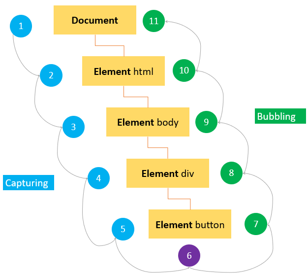

# JavaScript Interview Questions ( vES6 )

*Click  if you like the project. Pull Request are highly appreciated.*

<br/>

## Related Interview Questions

* [JavaScript ES6 Basics](https://github.com/learning-zone/JavaScript-ES6-Basics/blob/main/README.md)
* [JavaScript Design Patterns](https://github.com/learning-zone/JavaScript-Design-Patterns/blob/main/README.md)
* [JavaScript Coding Practice](https://github.com/learning-zone/JavaScript-Coding-Practice/blob/main/README.md)

<br/>

## Table of Contents

* [Introduction](#-introduction)
* [Variables](#-variables)
* [Data types](#-data-types)
* [Operators](#-operators)
* [Numbers](#-numbers)
* [String](#-string)
* [Array](#-array)
* [Regular Expression](#-regular-expression)
* [Functions](#-functions)
* [Events](#-events)
* [Objects](#-objects)
* [Window/Document Object](#-windowdocument-object)
* [Classes](#-classes)
* [Error Handling](#-error-handling)
* [Promises](#-promises)
* [Collections](#-collections)
* [Modules](#-modules)
* [Miscellaneous](#-miscellaneous)

<br/>

## # Introduction

<br/>

## Q. ***List out important features of JavaScript ES6?***

**1. Template Strings:**

Template literals are string literals allowing embedded expressions.

**Benefits:**

* String interpolation
* Embedded expressions
* Multiline strings without hacks
* String formatting
* String tagging for safe HTML escaping, localization and more

```js
// String Substitution
let name = `Abhinav Sharma`;
console.log(`Hi, ${name}!`); // Output: "Abhinav Sharma"

// Multiline String
let msg = `Hello \
World`;
console.log(`${msg}`); // Output: "Hello World"
```

**&#9885; [Try this example on CodeSandbox](https://codesandbox.io/s/js-template-strings-dwj699?file=/src/index.js)**

<div align="right">
    <b><a href="#">↥ back to top</a></b>
</div>

**2. Spread Operator:**

Spread operator allows iterables( arrays / objects / strings ) to be expanded into single arguments/elements. 

```js
function sum(x, y, z) {
  return x + y + z;
}
const numbers = [10, 20, 30];

// Using Spread Operator
console.log(sum(...numbers)); // 60

// Using Apply (ES5)
console.log(sum.apply(null, numbers)); // 60
```

**&#9885; [Try this example on CodeSandbox](https://codesandbox.io/s/js-spread-operator-25tmcf?file=/src/index.js)**

<div align="right">
    <b><a href="#">↥ back to top</a></b>
</div>

**2.1. Copying an array:**

```js
let fruits = ["Apple", "Orange", "Banana"];
let newFruitArray = [...fruits];

console.log(newFruitArray); 

//Output 
['Apple','Orange','Banana']
```

**&#9885; [Try this example on CodeSandbox](https://codesandbox.io/s/js-spread-operator-wy1q0l?file=/src/index.js)**

<div align="right">
    <b><a href="#">↥ back to top</a></b>
</div>

**2.2. Concatenating arrays:**  

```js
let arr1 = ["A", "B", "C"];
let arr2 = ["X", "Y", "Z"];

let result = [...arr1, ...arr2];

console.log(result); 

// Output
['A', 'B', 'C', 'X', 'Y', 'Z']
```

**&#9885; [Try this example on CodeSandbox](https://codesandbox.io/s/js-spread-operator-m7v6gg?file=/src/index.js)**

<div align="right">
    <b><a href="#">↥ back to top</a></b>
</div>

**2.3. Spreading elements together with an individual element:**

```js
let fruits = ["Apple", "Orange", "Banana"];

let newFruits = ["Cherry", ...fruits];

console.log(newFruits); 

// Output
['Cherry', 'Apple','Orange','Banana']
```

**&#9885; [Try this example on CodeSandbox](https://codesandbox.io/s/js-spread-operator-16l7oh?file=/src/index.js)**

<div align="right">
    <b><a href="#">↥ back to top</a></b>
</div>

**2.4. Spreading elements on function calls:**

```js
let fruits = ["Apple", "Orange", "Banana"];

const getFruits = (f1, f2, f3) => {
  console.log(`Fruits: ${f1}, ${f2} and ${f3}`);
};

getFruits(...fruits); 

// Output
Fruits: Apple, Orange and Banana
```

**&#9885; [Try this example on CodeSandbox](https://codesandbox.io/s/js-spread-operator-jdhoe6?file=/src/index.js)**

<div align="right">
    <b><a href="#">↥ back to top</a></b>
</div>

**2.5. Spread syntax for object literals:**

```js
var obj1 = { id: 101, name: 'Rajiv Sandal' }
var obj2 = { age: 35, country: 'INDIA'}

const employee = { ...obj1, ...obj2 }

console.log(employee); // { "id": 101, "name": "Rajiv Sandal", "age": 35, "country": "INDIA" }
```

<div align="right">
    <b><a href="#">↥ back to top</a></b>
</div>

**3. Sets:**  

Sets are a new object type with ES6 (ES2015) that allow to create collections of unique values. The values in a set can be either simple primitives like strings or integers, but more complex object types like object literals or arrays can also be part of a set.

```js
let numbers = new Set([10, 20, 20, 30, 40, 50]);

console.log(numbers); // Set(5) {10, 20, 30, 40, 50}
console.log(typeof numbers); // Object
```

**&#9885; [Try this example on CodeSandbox](https://codesandbox.io/s/js-sets-chwvp0)**

<div align="right">
    <b><a href="#">↥ back to top</a></b>
</div>

**4. Default Parametrs:**

```js
function add(x = 10, y = 20) {
  console.log(x + y);
}

add(10, 30); // 40
```

**&#9885; [Try this example on CodeSandbox](https://codesandbox.io/s/js-default-parametrs-tjw9uk?file=/src/index.js)**

<div align="right">
    <b><a href="#">↥ back to top</a></b>
</div>

**5. repeat():**  

The `repeat()` method constructs and returns a new string which contains the specified number of copies of the string on which it was called, concatenated together.

```js
const msg = "Hello World \n";

console.log(`${msg.repeat(3)}`);

// Output: 
Hello World
Hello World
Hello World
```

**&#9885; [Try this example on CodeSandbox](https://codesandbox.io/s/js-repeat-d3ko3z?file=/src/index.js)**

<div align="right">
    <b><a href="#">↥ back to top</a></b>
</div>

**6. Arrow Function (=>):**

```js
let add = (x, y) => x + y;

console.log(add(10, 20)); // 30
```

**&#9885; [Try this example on CodeSandbox](https://codesandbox.io/s/js-arrow-function-ejlrmf?file=/src/index.js)**

<div align="right">
    <b><a href="#">↥ back to top</a></b>
</div>

**7. Arrow function with `this`**

```js
var person = {
  name: "Diksha",
  actions: ["bike", "hike", "ski", "surf"],
  printActions: function() {
    var _this = this;
    this.actions.forEach(function(action) {
      var str = _this.name + " likes to " + action;
      console.log(str);
    });
  }
};
person.printActions();

// Arrow function
let person = {
  name: "Diksha",
  actions: ["bike", "hike", "ski", "surf"],
  printActions() {
    this.actions.forEach((action) => {
      let str = this.name + " likes to " + action;
      console.log(str);
    });
  }
};

person.printActions();

// Output:
Diksha likes to bike 
Diksha likes to hike 
Diksha likes to ski 
Diksha likes to surf
```

**&#9885; [Try this example on CodeSandbox](https://codesandbox.io/s/js-arrow-function-kh1v84?file=/src/index.js)**

<div align="right">
    <b><a href="#">↥ back to top</a></b>
</div>

**8. Destructing Assignment:**

```js
const phone = {
  title: "iPhone",
  price: 999,
  description: "The iPhone is a smartphone developed by Apple"
};
console.log(phone.title);


// Destructing Assignment
const { title, price, description } = {
  title: "iPhone",
  price: 999,
  description: "The iPhone is a smartphone developed by Apple"
};
console.log(title); // iPhone
console.log(price); // 999
console.log(description); // The iPhone is a smartphone developed by Apple
```

**&#9885; [Try this example on CodeSandbox](https://codesandbox.io/s/js-destructing-assignment-0c0fzl?file=/src/index.js)**

<div align="right">
    <b><a href="#">↥ back to top</a></b>
</div>

**9. Generators:**  

A generator is a function that can stop midway and then continue from where it stopped. In short, a generator appears to be a function but it behaves like an `iterator`.

```js
function* generator(num) {
  yield num + 10;
  yield num + 20;
  yield num + 30;
}
let gen = generator(10);

console.log(gen.next().value); // 20
console.log(gen.next().value); // 30
console.log(gen.next().value); // 40
```  

**&#9885; [Try this example on CodeSandbox](https://codesandbox.io/s/js-generators-pboss2?file=/src/index.js)**

<div align="right">
    <b><a href="#">↥ back to top</a></b>
</div>

**10. Symbols:**  

They are tokens that serve as unique IDs. We create symbols via the factory function Symbol(). Symbols primary use case is for making private object properties, which can be only of type String or Symbol (Numbers are automatically converted to Strings).

```js
const symbol1 = Symbol();
const symbol2 = Symbol(42);
const symbol3 = Symbol("Hi");

console.log(typeof symbol1); // symbol
console.log(symbol3.toString()); // Symbol(Hi)
console.log(Symbol("Hi") === Symbol("Hi")); // false
```

**&#9885; [Try this example on CodeSandbox](https://codesandbox.io/s/js-symbols-5oedjv?file=/src/index.js)**

<div align="right">
    <b><a href="#">↥ back to top</a></b>
</div>

**11. Iterator:**  
  
The iterable is a interface that specifies that an object can be accessible if it implements a method who is key is `[symbol.iterator]`.

```js
const title = "ES6";
const iterateIt = title[Symbol.iterator]();

console.log(iterateIt.next().value); //output: E
console.log(iterateIt.next().value); //output: S
console.log(iterateIt.next().value); //output: 6
```

**&#9885; [Try this example on CodeSandbox](https://codesandbox.io/s/js-iterator-ceqbrw?file=/src/index.js)**

<div align="right">
    <b><a href="#">↥ back to top</a></b>
</div>

## # VARIABLES

<br/>

## Q. ***What are global variables?***

Global variables are declared outside of a function or declared with a window object for accessibility throughout the program (unless shadowed by locals). If you declare a variable without using var, even if it\'s inside a function, it will still be seen as global.

The `var` **statement** declares a function-scoped or globally-scoped variable, optionally initializing it to a value.

**Example:**

```js
var x = 10;

if (x === 10) {
  var x = 20;

  console.log(x);
  // expected output: 20
}

console.log(x);
// expected output: 20
```

**Example:** Declaring global variable within function

```js
window.value = 90;

// Declaring global variable by window object
function setValue() {
  window.value = 100;
}

// Accessing global variable from other function
function getValue() {
  setValue();
  return window.value;
}

console.log(getValue()); // 100
```

**Using Undeclared Variables:**

* In strict mode, if you attempt to use an undeclared variable, you\'ll get a reference error when you run your code. 
* Outside of strict mode, however, if you assign a value to a name that has not been declared with `let`, `const`, or `var`, you\'ll end up creating a new global variable. It will be global no matter how deeply nested within functions and blocks your code is, which is almost certainly not what you want, is bug-prone, and is one of the best reasons for using strict mode!
* Global variables created in this accidental way are like global variables declared with `var`: they define properties of the global object. But unlike the properties defined by proper var declarations, these properties can be deleted with the delete operator.

**&#9885; [Try this example on CodeSandbox](https://codesandbox.io/s/js-global-variables-b4isqk?file=/src/index.js)**

<div align="right">
    <b><a href="#">↥ back to top</a></b>
</div>

## Q. ***What are template literals in es6?***

Template literals help make it simple to do string interpolation, or to include variables in a string.

```js
const person = { name: 'Tyler', age: 28 };

console.log(`Hi, my name is ${person.name} and I am ${person.age} years old!`);
// 'Hi, my name is Tyler and I am 28 years old!'
```

Template literals, however, preserve whatever spacing you add to them. For example, to create that same multi-line output that we created above, you can simply do:

```js
console.log(`This is line one.
This is line two.`);
// This is line one.
// This is line two.
```

Another use case of template literals would be to use as a substitute for templating libraries for simple variable interpolations:

```js
const person = { name: 'Tyler', age: 28 };

document.body.innerHTML = `
  <div>
    <p>Name: ${person.name}</p>
    <p>Name: ${person.age}</p>
  </div>
`
```

<div align="right">
    <b><a href="#">↥ back to top</a></b>
</div>

## Q. ***What are the differences between variables created using `let`, `var` or `const`?***

Variables declared using the `var` keyword are scoped to the function in which they are created, or if created outside of any function, to the global object. `let` and `const` are _block scoped_, meaning they are only accessible within the nearest set of curly braces (function, if-else block, or for-loop).

```js
/**
 * All variables are accessible within functions.
 * 
**/
function variableScope() {

  var x = 10;
  let y = 20;
  const z = 30;

  console.log(x); // 10
  console.log(y); // 20
  console.log(z); // 30
}

console.log(x); // ReferenceError: x is not defined
console.log(y); // ReferenceError: y is not defined
console.log(z); // ReferenceError: z is not defined

variableScope();
```

```js
/**
 * var declared variables are accessible anywhere in the function scope.
 * 
 **/
if (true) {
  var a = 10;
  let b = 20;
  const c = 30;
}

console.log(a); // 10
console.log(b); // ReferenceError: baz is not defined
console.log(c); // ReferenceError: qux is not defined
```

`var` allows variables to be hoisted, meaning they can be referenced in code before they are declared. `let` and `const` will not allow this, instead throwing an error.

```js
console.log(foo); // undefined
var foo = 'foo';

console.log(baz); // ReferenceError: can't access lexical declaration 'baz' before initialization
let baz = 'baz';

console.log(bar); // ReferenceError: can't access lexical declaration 'bar' before initialization
const bar = 'bar';
```

Redeclaring a variable with `var` will not throw an error, but 'let' and 'const' will.

```js
var foo = 'foo';
var foo = 'bar';
console.log(foo); // "bar"

let baz = 'baz';
let baz = 'qux'; // Uncaught SyntaxError: Identifier 'baz' has already been declared
```

`let` and `const` differ in that `let` allows reassigning the variable's value while `const` does not.

```js
// This is fine.
let foo = 'foo';
foo = 'bar';

// This causes an exception.
const baz = 'baz';
baz = 'qux';
```

**&#9885; [Try this example on CodeSandbox](https://codesandbox.io/s/js-variables-declaration-fmrkjz?file=/src/index.js)**

<div align="right">
    <b><a href="#">↥ back to top</a></b>
</div>

## Q. ***What is Hoisting in JavaScript?***

JavaScript **Hoisting** refers to the process whereby the interpreter appears to move the declaration of functions, variables or classes to the top of their scope, prior to execution of the code.

Hoisting allows functions to be safely used in code before they are declared.

**Example 01:** Function Hoisting

One of the advantages of hoisting is that it lets you use a function before you declare it in your code.

```js
getName("Sadhika Sandal");

function getName(name) {
  console.log("Hello " + name);
}

// Output
Hello Sadhika Sandal
```

**Example 02:** Variable Hoisting  

```js
console.log(message); // output : undefined
var message = "The variable Has been hoisted";
```

The above code looks like as below to the interpreter,

```js
var message;
console.log(message);
message = "The variable Has been hoisted";
```

**Example 03:** `let` and `const` hoisting

All declarations (function, var, let, const and class) are hoisted in JavaScript, while the `var` declarations are initialized with `undefined`, but `let` and `const` declarations remain uninitialized.

```js
console.log(x);
let x = 10;

// Output: ReferenceError: x is not defined
```

They will only get initialized when their lexical binding (assignment) is evaluated during runtime by the JavaScript engine. This means we can\'t access the variable before the engine evaluates its value at the place it was declared in the source code. This is what we call **Temporal Dead Zone**, A time span between variable creation and its initialization where they can\'t be accessed.

*Note: JavaScript only hoists declarations, not initialisation*

**&#9885; [Try this example on CodeSandbox](https://codesandbox.io/s/js-hoisting-l745nc?file=/src/index.js)**

<div align="right">
    <b><a href="#">↥ back to top</a></b>
</div>

## Q. ***What is the Temporal Dead Zone in ES6?***

In ES6, let bindings are not subject to Variable Hoisting, which means that let declarations do not move to the top of the current execution context. Referencing the variable in the block before the initialization results in a `ReferenceError` (contrary to a variable declared with var, which will just have the undefined value). The variable is in a “temporal dead zone” from the start of the block until the initialization is processed.

```javascript
console.log(aVar); // undefined
console.log(aLet); // causes ReferenceError: aLet is not defined
var aVar = 1;
let aLet = 2;
```

<div align="right">
    <b><a href="#">↥ back to top</a></b>
</div>

## Q. ***What is the purpose of double exclamation?***

The double exclamation or negation(!!) ensures the resulting type is a boolean. If it was falsey (e.g. `0`, `null`, `undefined`, etc.), it will be `false`, otherwise, `true`.

For example, you can test IE version using this expression as below,

```js
let isIE11 = false;
isIE11 = !!navigator.userAgent.match(/Trident.*rv[ :]*11\./);
console.log(isIE11); // returns true or false
```

If you do not use this expression then it returns the original value.

```js
console.log(navigator.userAgent.match(/Trident.*rv[ :]*11\./));  // returns either an Array or null
```

*Note: The expression !! is not an operator, but it is just twice of ! operator*.

<div align="right">
    <b><a href="#">↥ back to top</a></b>
</div>

## Q. ***In JavaScript, what is the difference between `var x = 1` and `x = 1`?***

`var x = 1`:

* Allowed in 'strict mode'.
* The var statement declares a function-scoped or globally-scoped variable, optionally initializing it to a value.
* Variables declared using var inside a { } block can be accessed from outside the block.
* Variables defined using var inside a function are not accessible (visible) from outside the function.
* Duplicate variable declarations using var will not trigger an error, even in strict mode, and the variable will not lose its value unless another assignment is performed.

```js
var x = 1;

if (x === 1) {
  var x = 2;

  console.log(x);
  // expected output: 2
}

console.log(x);
// expected output: 2
```

```js
var x = 5; // global
function someThing(y) {
  var x = 3; // local
  var z = x + y;
  console.log(z);
}
someThing(4); // 7
console.log(x); // 5
```

`x = 1`:

* Not allowed in 'strict mode'.
* Undeclared Variables like: x = 1 is accessible in: (Block scope - Function scope - Global scope)
* Outside of strict mode, however, if you assign a value to a name that has not been declared with let, const, or var, you\'ll end up creating a new global variable. It will be global no matter how deeply nested within functions and blocks your code is, which is almost certainly not what you want, is bug-prone, and is one of the best reasons for using strict mode!
* Global variables created in this accidental way are like global variables declared with var: they define properties of the global object.
* Unlike the properties defined by proper var declarations, these properties can be deleted with the delete operator.
* Not recommended.

```js
var x = 5; // global
function someThing(y) {
  x = 1; // still global!
  var z = x + y;
  console.log(z);
}
someThing(4) // 5
console.log(x) // 1
```

**Example:**

```js
{
  console.log(x + y); // NaN
  var x = 1;
  var y = 2;
}
```

```js
{
  console.log(x + y); // Uncaught ReferenceError: x is not defined
   x = 1;
   y = 2;
}
```

<br/>

|               | var x = 1 | x = 1 |
|:---:          | :---:     | :---:|
|Strict mode    | &#10004;  | &#10060; |
|Block scope    | &#10060;  | &#10004; |
|Function scope | &#10004;  | &#10004; |
|Global scope   | &#10004;  | &#10004; |
|Hoisting       | &#10004;  | &#10060; |
|Reassigning    | &#10004;  | &#10004; |

<div align="right">
    <b><a href="#">↥ back to top</a></b>
</div>

## Q. ***How do you assign default values to variables?***

You can use the logical or operator `||` in an assignment expression to provide a default value. The syntax looks like as below,

```js
var a = b || c;
```

As per the above expression, variable 'a 'will get the value of 'c' only if 'b' is falsy (if is null, false, undefined, 0, empty string, or NaN), otherwise 'a' will get the value of 'b'.

<div align="right">
    <b><a href="#">↥ back to top</a></b>
</div>

## Q. ***What is the precedence order between local and global variables?***

A local variable takes precedence over a global variable with the same name. 

```js
var msg = "Good morning";

function greeting() {
  msg = "Good Evening";
  console.log(msg);
}
greeting();

// Output
Good Evening
```

**&#9885; [Try this example on CodeSandbox](https://codesandbox.io/s/js-precedence-n1ve75?file=/src/index.js)**

<div align="right">
    <b><a href="#">↥ back to top</a></b>
</div>

## Q. ***What is variable shadowing in javascript?***

Variable shadowing occurs when a variable declared within a certain scope (decision block, method, or inner class) has the same name as a variable declared in an outer scope. This outer variable is said to be shadowed.

If there is a variable in the global scope, and you'd like to create a variable with the same name in a function. The variable in the inner scope will temporarily shadow the variable in the outer scope.

```js
var val = 10;

function Hoist(val) {
  console.log(val);
}
Hoist(20);

// Output: 
20
```

**&#9885; [Try this example on CodeSandbox](https://codesandbox.io/s/js-variable-shadowing-dvibcw?file=/src/index.js)**

<div align="right">
    <b><a href="#">↥ back to top</a></b>
</div>

## Q. ***Explain `var self = this` in JavaScript?***

`self` is being used to maintain a reference to the original this even as the context is changing. It is a technique often used in event handlers (especially in closures).

`this` is a JavaScript keyword which refers to the current context. Unlike other programming languages, JavaScript does not have block scoping(in C open/close {} curly braces refers to a block). JavaScript has two scopes namely, global and local scope.

```js
// this Context
const context = {
  prop: 10,
  getCurrentContext: function () {
    return this.prop;
  }
};

console.log(context.getCurrentContext());
// expected output: 10
```

*Note: 'self' should not be used this way anymore, since modern browsers provide a global variable self pointing to the global object of either a normal window or a WebWorker.*

**&#9885; [Try this example on CodeSandbox](https://codesandbox.io/s/js-self-this-k1w0e8?file=/src/index.js)**

<div align="right">
    <b><a href="#">↥ back to top</a></b>
</div>

## Q. ***How do you swap variables using Destructuring Assignment?***

```js
var x = 10, y = 20;

[x, y] = [y, x];

console.log(x); // 20
console.log(y); // 10
```

**&#9885; [Try this example on CodeSandbox](https://codesandbox.io/s/js-destructuring-sv99cd?file=/src/index.js)**

<div align="right">
    <b><a href="#">↥ back to top</a></b>
</div>

## # DATA TYPES

<br/>

## Q. ***What are data types in javascript?***

There are eight basic data types in JavaScript.

|Data Types	  | Description	                         |Example                     |
|-------------|--------------------------------------|----------------------------|
|String	      |Represents textual data	             |let str = 'Hi', let str2 = "Hello", let str3 = \`Hello World\`|
|Number	      |An integer or a floating-point number |let num = 3, let num2 = 3.234, let num3 = 3e-2 |
|BigInt	      |An integer with arbitrary precision	 |let num = 900719925124740999n, let num = 1n    |
|Boolean	    |Any of two values: true or false	     |let flag = true             |
|undefined	  |A data type whose variable is not initialized	|let a;             |
|null	        |Denotes a null value	                 |let a = null;               |
|Symbol	      |Data type whose instances are unique and immutable|let value = Symbol('hello');|
|Object	      |key-value pairs of collection of data	|let student = { };         |

**String:**

`String` is used to store text. In JavaScript, strings are surrounded by quotes:

* Single quotes: 'Hello'
* Double quotes: "Hello"
* Backticks: \`Hello\`

Example:

```js
// Strings
const firstName = "Mukul";
const lastName = "Mittal";
const result = `Name: ${firstName} ${lastName}`;

console.log(result); // Name: Mukul Mittal
```

**Number:**

Number represents integer and floating numbers (decimals and exponentials). A number type can also be `+Infinity`, `-Infinity`, and `NaN` (not a number).

```js
const number1 = 3;
const number2 = 3.433;
const number3 = 3e5; // 3 * 10^5

const number4 = 3 / 0;
console.log(number4); // Infinity

const number5 = -3 / 0;
console.log(number5); // -Infinity

// strings can't be divided by numbers
const number6 = "abc" / 3;
console.log(number6); // NaN
```

**BigInt:**

In JavaScript, Number type can only represent numbers less than (2<sup>53</sup> - 1) and more than -(2<sup>53</sup> - 1). However, if you need to use a larger number than that, you can use the BigInt data type.

A BigInt number is created by appending `n` to the end of an integer.

```js
// BigInt value
const num1 = 900719925124740998n;
const num2 = 900719925124740998n;
const num3 = 10;


// Adding two big integers
const result1 = num1 + num2;
console.log(result1); // "1801439850249481996n"


// Error! BitInt and number cannot be added
const result2 = num1 + num2 + num3; 
console.log(result2);  // Uncaught TypeError: Cannot mix BigInt and other types
```

**Boolean:**

This data type represents logical entities. Boolean represents one of two values: `true` or `false`. 

```js
const dataChecked = true;
const valueCounted = false;
```

**undefined:**

The undefined data type represents value that is not assigned. If a variable is declared but the value is not assigned, then the value of that variable will be undefined. 

```js
let name;
console.log(name); // undefined

let name = undefined;
console.log(name); // undefined
```

**null:**

In JavaScript, `null` is a special value that represents empty or unknown value.

```js
const number = null;
```

**Symbol:**

A value having the data type Symbol can be referred to as a symbol value. Symbol is an immutable primitive value that is unique.

```js
// Two symbols with the same description

const value1 = Symbol('hello');
const value2 = Symbol('hello');

let result = (value1 === value2) ? true : false;  // false;

// Note: Though value1 and value2 both contain 'hello', they are different as they are of the Symbol type.
```

**Object:**

An object is a complex data type that allows us to store collections of data. 

```js
const employee = {
    firstName: 'John',
    lastName: 'K',
    email: 'john.k@gmail.com'
};
```

<div align="right">
    <b><a href="#">↥ back to top</a></b>
</div>

## Q. ***What is `undefined` property?***

The undefined property indicates that a variable has not been assigned a value, or not declared at all. The type of undefined value is undefined too.

```js
var user;    // Value is undefined, type is undefined
console.log(typeof(user)) //undefined
```

Any variable can be emptied by setting the value to undefined.

```js
user = undefined
```

<div align="right">
    <b><a href="#">↥ back to top</a></b>
</div>

## Q. ***What is difference between `null` vs `undefined`?***

**Null:**

`Null` means an empty or non-existent value. Null is assigned, and explicitly means nothing.

```js
var test = null;
console.log(test); // null
```

`null` is also an object. Interestingly, this was actually an error in the original JavaScript implementation:

```js
console.log(typeof test); // object
```

**Undefined:**

Undefined means a variable has been declared, but the value of that variable has not yet been defined. For example:

```js
var test2;
console.log(test2); // undefined
```

Unlike null, undefined is of the type undefined:

```js
console.log(typeof test2); // undefined
```

**Difference:**

| Null | Undefined |
|---- | -----------|
| It is an assignment value which indicates that variable points to no object.  | It is not an assignment value where a variable has been declared but has not yet been assigned a value. |
| Type of null is object | Type of undefined is undefined  |
| The null value is a primitive value that represents the null, empty, or non-existent reference. | The undefined value is a primitive value used when a variable has not been assigned a value.|
| Indicates the absence of a value for a variable | Indicates absence of variable itself |
| Converted to zero (0) while performing primitive operations | Converted to NaN while performing primitive operations |

<div align="right">
    <b><a href="#">↥ back to top</a></b>
</div>

## # OPERATORS

<br/>

## Q. ***What are various operators supported by javascript?***

An operator is capable of manipulating(mathematical and logical computations) a certain value or operand. There are various operators supported by JavaScript as below,

**Arithmetic Operators:**

Arithmetic operators are used to perform mathematical operations between numeric operands.

|Operators|Description             | Example ( say `let x = 10, y = 20;`) |
|--------|------------------------|-------------|
| +      |Adds two numeric operands.| x + y     |
| -      |Subtract right operand from left operand| y - x|
| *      |Multiply two numeric operands.| x * y|
| /      |Divide left operand by right operand.| y / x|
| %      |Modulus operator. Returns remainder of two operands.| x % 2|
| ++     |Increment operator. Increase operand value by one.| x++|
| --     |Decrement operator. Decrease value by one.| x--|

**Comparison Operators:**

JavaScript provides comparison operators that compare two operands and return a boolean value `true` or `false`.

|Operators|	Description|
|---------|-------------|
|==       |Compares the equality of two operands without considering type.|
|===      |Compares equality of two operands with type.|
|!=       |Compares inequality of two operands.|
|>        |Returns a boolean value true if the left-side value is greater than the right-side value; otherwise, returns false.|
|<        |Returns a boolean value true if the left-side value is less than the right-side value; otherwise, returns false.|
|>=       |Returns a boolean value true if the left-side value is greater than or equal to the right-side value; otherwise, returns false.|
|<=       |Returns a boolean value true if the left-side value is less than or equal to the right-side value; otherwise, returns false.|

**Logical Operators:**

The logical operators are used to combine two or more conditions.

|Operators |Description         |
|----------|--------------------|
|&&	&&     |is known as AND operator. It checks whether two operands are non-zero or not (0, false, undefined, null or "" are considered as zero). It returns 1 if they are non-zero; otherwise, returns 0.|
|<code>||</code> | <code>||</code> is known as OR operator. It checks whether any one of the two operands is non-zero or not (0, false, undefined, null or "" is considered as zero). It returns 1 if any one of of them is non-zero; otherwise, returns 0.|
|!         |	! is known as NOT operator. It reverses the boolean result of the operand (or condition). !false returns true, and !true returns false.|

**Assignment Operators:**

The assignment operators to assign values to variables with less key strokes.

|Operators | Description  |
|----|--------------------|
|=   |Assigns right operand value to the left operand.|
|+=  |Sums up left and right operand values and assigns the result to the left operand.|
|-=  |Subtract right operand value from the left operand value and assigns the result to the left operand.|
|*=  |Multiply left and right operand values and assigns the result to the left operand.|
|/=  |Divide left operand value by right operand value and assign the result to the left operand.|
|%=  |Get the modulus of left operand divide by right operand and assign resulted modulus to the left operand.|

**Ternary Operators:**

JavaScript provides a special operator called ternary operator `:?` that assigns a value to a variable based on some condition.

**Syntax:**

```js
<condition> ? <value1> : <value2>;

// Example
let a = 10, b = 20;

let c = a > b ? a : b; // 20
let d = a > b ? b : a; // 10
```

**typeof Operator:** It uses to find type of variable.

**Syntax:**

```js
typeof variable

// Example
Let a = 10;

typeof a // number
```

<div align="right">
    <b><a href="#">↥ back to top</a></b>
</div>

## Q. ***What are the bitwise operators available in javascript?***

Below are the list of bit-wise logical operators used in JavaScript

|Operator	   |  Usage	      |   Description    |
|------------|---------|-----------------------|
|Bitwise AND |	a & b	 |Returns a one in each bit position for which the corresponding bits of both operands are ones.|
|Bitwise OR	 |a | b	   |Returns a one in each bit position for which the corresponding bits of either or both operands are ones.|
|Bitwise XOR |	a ^ b	 |Returns a one in each bit position for which the corresponding bits of either but not both operands are ones.|
|Bitwise NOT |	~ a	   |Inverts the bits of its operand.|
|Left shift	 |a << b	 |Shifts a in binary representation b (< 32) bits to the left, shifting in zeroes from the right.|
|Sign-propagating right shift|	a >> b |Shifts a in binary representation b (< 32) bits to the right, discarding bits shifted off.|
|Zero-fill right shift |	a >>> b	 | Shifts a in binary representation b (< 32) bits to the right, discarding bits shifted off, and shifting in zeroes from the left.|

**Examples:**

|Operation|	Result	  |Same as	    |Result    |
|---------|-----------|-------------|----------|
|5 & 1    | 1	        |0101 & 0001	|0001      |
|`5 | 1` 	| 5         |0101 | 0001  |0101      |
|`~ 5`    |-6	        |~0101	      |1010      |
|`5 << 1`	| 10        |0101 << 1  	|1010      |
|`5 ^ 1`	| 4         |0101 ^ 0001  |0100      |
|`5 >> 1`	| 2	        |0101 >> 1	  |0010      |
|5 >>> 1	| 2	        |0101 >>> 1	  |0010      |

**&#9885; [Try this example on CodeSandbox](https://codesandbox.io/s/js-bitwise-operators-nnz00d?file=/src/index.js)**

<div align="right">
    <b><a href="#">↥ back to top</a></b>
</div>

## Q. ***What is the difference between == and === operators?***

JavaScript provides both strict(===, !==) and type-converting(==, !=) equality comparison. The strict operators takes type of variable in consideration, while non-strict operators make type correction/conversion based upon values of variables. The strict operators follow the below conditions for different types,

1. Two strings are strictly equal when they have the same sequence of characters, same length, and same characters in corresponding positions.
2. Two numbers are strictly equal when they are numerically equal. i.e, Having the same number value.
   There are two special cases in this,
   1. NaN is not equal to anything, including NaN.
   2. Positive and negative zeros are equal to one another.
3. Two Boolean operands are strictly equal if both are true or both are false.
4. Two objects are strictly equal if they refer to the same Object.
5. Null and Undefined types are not equal with ===, but equal with ==. i.e,
    null===undefined --> false but null==undefined --> true

**Example:**

```js
0 == false // true
0 === false // false
1 == "1" // true
1 === "1" // false
null == undefined // true
null === undefined // false
"0" == false // true
"0" === false // false
[] === [] // false, refer different objects in memory
{} === {} // false, refer different objects in memory
```

**&#9885; [Try this example on CodeSandbox](https://codesandbox.io/s/js-comparison-0y16ii?file=/src/index.js)**

<div align="right">
    <b><a href="#">↥ back to top</a></b>
</div>

## Q. ***What is typeof operator?***

In JavaScript, the typeof operator returns the data type of its operand in the form of a string. The operand can be any object, function, or variable.

**Example:**

```js
typeof undeclaredVariable; // "undefined"

var a;
typeof a; // "undefined"

a = "Hello World";
typeof a; // "string"

a = 42;
typeof a; // "number"

a = 3.1415
typeof a; // "number"

a = true;
typeof a; // "boolean"

a = null;
typeof a; // "object"

a = undefined;
typeof a; // "undefined"

a = { b: "c" };
typeof a; // "object"

a = function () {
  return 10;
};

console.log(typeof a); // "function"
```

**&#9885; [Try this example on CodeSandbox](https://codesandbox.io/s/js-typeof-jesw53?file=/src/index.js)**

<div align="right">
    <b><a href="#">↥ back to top</a></b>
</div>

## Q. ***What is an Unary operator?***

The unary(+) operator is used to convert a variable to a number. If the variable cannot be converted, it will still become a number but with the value NaN.

**Example:**

```js
var x = "100";
var y = +x;
console.log(typeof x, typeof y); // string, number

var a = "Hello";
var b = +a;
console.log(typeof a, typeof b, b); // string, number, NaN
```

**&#9885; [Try this example on CodeSandbox](https://codesandbox.io/s/js-unary-operator-ld2luh?file=/src/index.js)**

<div align="right">
    <b><a href="#">↥ back to top</a></b>
</div>

## Q. ***What is the purpose of delete operator?***

The delete keyword is used to delete the property as well as its value.

```js
var user = {name: "Sadhika Chaudhuri", age: 24};
delete user.age;

console.log(user); // {name: "Sadhika Chaudhuri"}
```

<div align="right">
    <b><a href="#">↥ back to top</a></b>
</div>

## Q. ***What is a conditional operator in javascript?***

The conditional (ternary) operator is the only JavaScript operator that takes three operands which acts as a shortcut for if statement.

```js
var isAuthenticated = false;

console.log(isAuthenticated ? 'Hello, welcome' : 'Sorry, you are not authenticated');
```

<div align="right">
    <b><a href="#">↥ back to top</a></b>
</div>

## Q. ***Can you apply chaining on conditional operator?***

Yes, you can apply chaining on conditional operator similar to if … else if … else if … else chain.

**Example:**

```js
function getValue(someParam) {
  return condition1 ? value1
    : condition2 ? value2
    : condition3 ? value3
    : value4;
}

// The above conditional operator is equivalent to:
function getValue(someParam) {
  if (condition1) {
    return value1;
  } else if (condition2) {
    return value2;
  } else if (condition3) {
    return value3;
  } else {
    return value4;
  }
}
```

<div align="right">
    <b><a href="#">↥ back to top</a></b>
</div>

## Q. ***What is the difference between `==` and `===`?***

The `==` is the abstract equality operator while `===` is the strict equality operator. The `==` operator will compare for equality after doing any necessary type conversions.

The `===` operator will not do type conversion, so if two values are not the same type `===` will simply return `false`. When using `==`, funky things can happen, such as:

```js
1 == '1'; // true
1 == [1]; // true
1 == true; // true
0 == ''; // true
0 == '0'; // true
0 == false; // true

let x = null;
console.log(x == null); // true
console.log(x == undefined); // true
```

**&#9885; [Try this example on CodeSandbox](https://codesandbox.io/s/js-equality-operator-lt2ngc?file=/src/index.js)**

<div align="right">
    <b><a href="#">↥ back to top</a></b>
</div>

## Q. ***What is the difference between `typeof` and `instanceof` operator?***

The `typeof` operator checks if a value has type of primitive type which can be one of boolean, function, object, number, string, undefined and symbol (ES6).

**Example:**

```js
const x = "Hello World";
const y = new String("Hello World");

typeof x; // returns 'string'
typeof y; // returns 'object'
```

The `instanceof` is a binary operator, accepting an object and a constructor. It returns a boolean indicating whether or not the object has the given constructor in its prototype chain.

```js
const a = "Hello World";
const b = new String("Hello World");

a instanceof String; // returns false
b instanceof String; // returns true
```

**&#9885; [Try this example on CodeSandbox](https://codesandbox.io/s/js-typeof-operator-9uejl1?file=/src/index.js)**

<div align="right">
    <b><a href="#">↥ back to top</a></b>
</div>

## Q. ***What is the output of below spread operator array?***

```js
[...'Hello']
```

**Output**:  ['H', 'e', 'l', 'l', 'o']  

**Explanation**: The string is an iterable type and the spread operator with in an array maps every character of an iterable to one element. Hence, each character of a string becomes an element within an Array.

<div align="right">
    <b><a href="#">↥ back to top</a></b>
</div>

## # NUMBERS

<br/>

## Q. ***How do you generate random integers?***

The `Math.random()` function returns a floating-point, pseudo-random number in the range 0 to less than 1 (inclusive of 0, but not 1). For example, if you want generate random integers between 1 to 100, the multiplication factor should be 100,

```js
// Example 01:
Math.random(); // returns a random integer between 0 to 1

// Example 02:
Math.floor(Math.random() * 100) + 1; // returns a random integer from 1 to 100

// Example 03:
function getRandomNumber(max) {
  return Math.floor(Math.random() * max) + 1;
}

console.log(getRandomNumber(10)); // returns a random integer from 1 to 10
```

**&#9885; [Try this example on CodeSandbox](https://codesandbox.io/s/js-random-number-slllvd?file=/src/index.js)**

<div align="right">
    <b><a href="#">↥ back to top</a></b>
</div>

## Q. ***What is isNaN?***

The `isNaN()` function determines whether a value is NaN ( Not a Number ) or not. This function returns `true` if the value equates to NaN. The `isNaN()` method converts the value to a number before testing it.

```js
isNaN('Hello') // true

isNaN('100') // false

typeof NaN // Number

Number.isNaN('Hello'); // false
```

**&#9885; [Try this example on CodeSandbox](https://codesandbox.io/s/js-isnan-6w1huz?file=/src/index.js)**

<div align="right">
    <b><a href="#">↥ back to top</a></b>
</div>

## Q. ***What is the purpose of isFinite function?***

The global `isFinite()` function determines whether the passed value is a finite number. It returns `false` if the value is `+infinity`, `-infinity`, or `NaN` (Not-a-Number), otherwise it returns true.

```js
isFinite(Infinity);  // false
isFinite(NaN);       // false
isFinite(-Infinity); // false

isFinite(100);  // true
isFinite(1/0); // false

Number.isFinite(0 / 0); // false
Number.isFinite(null); // false
Number.isFinite("123") // false
```

**&#9885; [Try this example on CodeSandbox](https://codesandbox.io/s/js-isfinite-5sl988?file=/src/index.js)**

<div align="right">
    <b><a href="#">↥ back to top</a></b>
</div>

## Q. ***Explain NEGATIVE_INFINITY in JavaScript?***

The `Number.NEGATIVE_INFINITY` property represents the negative Infinity value.

**Syntax:**

```js
Number.NEGATIVE_INFINITY
```

* Negative infinity is a number in javascript, which is derived by 'dividing negative number by zero'.
* A number object needs not to be created to access this static property.
* The value of negative infinity is the same as the negative value of the infinity property of the global object.

```js
// NEGATIVE_INFINITY
console.log(Number.NEGATIVE_INFINITY); // -Infinity
console.log(Number.MAX_VALUE + Number.MAX_VALUE); // Infinity
console.log(-2 * Number.MAX_VALUE); // -Infinity

console.log("Math.pow(10, 1000): " + Math.pow(10, 1000)); // Infinity 
console.log("Math.log(0): " + Math.log(0)); // -Infinity

console.log(Number.NEGATIVE_INFINITY === -2 * Number.MAX_VALUE); // true
```

**&#9885; [Try this example on CodeSandbox](https://codesandbox.io/s/js-negative-infinity-1gmh0r?file=/src/index.js)**

<div align="right">
    <b><a href="#">↥ back to top</a></b>
</div>

## # STRING

<br/>

## Q. ***What is the difference between slice and splice?***

**1. slice():**

The `slice()` method returns a new array with a copied slice from the original array. The first optional argument is the beginning index and the second optional argument is the ending index (non-inclusive).

**Example:**

```js
let languages = [ "JavaScript", "Python", "Java", "PHP" ];

languages.slice(1,3); // ["Python", "Java"]
languages.slice(2); // (from index 2 until the end of the array).
// ["Java", "PHP"]

console.log(languages); // the original array is not mutated.
// [ "JavaScript", "Python", "Java", "PHP" ]
```

**2. splice():**

The `splice()` method changes the content of the array in place and can be used to add or remove items from the array.
When only one argument is provided, all the items after the provided starting index are removed from the array.

**Example:**

```js
let numbers = [10, 20, 30];

numbers.splice(2, 1, 40, 50); // returns removed array:[30]

console.log(numbers); // Original array is mutated.
// returns: [10, 20, 40, 50]
```

**Difference:**

| Slice | Splice |
|---- | ---------|
| Doesn't modify the original array(immutable)  | Modifies the original array(mutable) |
| Returns the subset of original array | Returns the deleted elements as array  |
| Used to pick the elements from array | Used to insert or delete elements to/from array|

**&#9885; [Try this example on CodeSandbox](https://codesandbox.io/s/js-slice-vs-splice-xm7c54?file=/src/index.js)**

<div align="right">
    <b><a href="#">↥ back to top</a></b>
</div>

## Q. ***How do you check whether a string contains a substring?***

There are 3 fastest ways to check whether a string contains a substring or not,  

**1. Using RegEx:**

The regular expression `test()` method checks if a match exists in a string. This method returns `true` if it finds a match, otherwise, it returns `false`.

```js
let str = "JavaScript, Node.js, Express.js, React.js, MongoDB";
let exp1 = /MongoDB/g;
let exp2 = /Ajax/;

exp1.test(str); // true
exp2.test(str); // false
```

**2. Using indexOf:**

The `indexOf()` method is case-sensitive and accepts two parameters. The first parameter is the substring to search for, and the second optional parameter is the index to start the search from (default index is 0).

```js
let str = "JavaScript, Node.js, Express.js, React.js, MongoDB";

str.indexOf('MongoDB') !== -1 // true
str.indexOf('PHP') !== -1 // false
str.indexOf('Node', 5) !== -1 // true
```

**3. Using includes:**

The `includes()` is also case-sensitive and accepts an optional second parameter, an integer which indicates the position where to start searching for.

```js
let str = "JavaScript, Node.js, Express.js, React.js, MongoDB";

str.includes('MongoDB') // true
str.includes('PHP') // false
str.includes('Node', 5) //true
```

**&#9885; [Try this example on CodeSandbox](https://codesandbox.io/s/js-substring-su64zr?file=/src/index.js)**

<div align="right">
    <b><a href="#">↥ back to top</a></b>
</div>

## Q. ***How do you trim a string in javascript?***

The `trim()` method removes whitespace from both sides of a string. JavaScript provides 3 simple functions on how to trim strings.

**1. string.trim():**

The `string.trim()` removes sequences of whitespaces and line terminators from both the start and the end of the string.

```js
const name = "  Karan Talwar  ";
console.log(name.trim()); // => 'Karan Talwar'

const phoneNumber = "\t  80-555-123\n ";
console.log(phoneNumber.trim()); // => '555-123'
```

**2. string.trimStart():**

The `string.trimStart()` removes sequences of whitespaces and line terminators only from the start of the string.

```js
const name = "   Karan Talwar  ";
console.log(name.trimStart()); // => "Talwar "

const phoneNumber = "\t  80-555-123\n ";
console.log(phoneNumber.trimStart()); // => "80-555-123 "
```

**3. string.trimEnd():**

The `string.trimEnd()` removes sequences of whitespaces and line terminators only from the end of the string.

```js
const name = "  Karan Talwar ";
console.log(name.trimEnd()); // => " Karan Talwar"

const phoneNumber = "\t  80-555-123\n ";
console.log(phoneNumber.trimEnd()); // => " 80-555-123"
```

**&#9885; [Try this example on CodeSandbox](https://codesandbox.io/s/js-trim-4mo5bi?file=/src/index.js)**

<div align="right">
    <b><a href="#">↥ back to top</a></b>
</div>

## Q. ***What is eval function in javascript?***

The `eval()` function evaluates JavaScript code represented as a string. The string can be a JavaScript expression, variable, statement, or sequence of statements.

```js
console.log(eval('10 + 20')); // 30

let x = 10;
let y = 20;
let z = '50';
eval('x + y + 1'); // returns 31
eval(z);           // returns 50
```

If the argument of `eval()` is not a string, `eval()` returns the argument unchanged. In the following example, the String constructor is specified and eval() returns a String object rather than evaluating the string.

```js
eval(new String('10 + 20')); // returns a String object containing "10 + 20"
eval('10 + 20');             // returns 30


// work around
let expression = new String('10 + 20');
eval(expression.toString()); // returns 30
```

***Warning:*** *Executing JavaScript from a string is an enormous security risk. It is far too easy for a bad actor to run arbitrary code when you use eval().*

**&#9885; [Try this example on CodeSandbox](https://codesandbox.io/s/js-eval-p9fxgs?file=/src/index.js)**

<div align="right">
    <b><a href="#">↥ back to top</a></b>
</div>

## Q. ***How do you check if a string starts with another string?***

You can use ECMAScript 6 `String.prototype.startsWith()` method to check a string starts with another string or not. But it is not yet supported in all browsers. Let us see an example to see this usage,

```js
let str = "Hello World";

console.log(str.startsWith("Hello")); // true
console.log(str.startsWith("World")); // false
```

**&#9885; [Try this example on CodeSandbox](https://codesandbox.io/s/js-startswith-tvq7i5?file=/src/index.js)**

<div align="right">
    <b><a href="#">↥ back to top</a></b>
</div>

## # ARRAY

<br/>

## Q. ***Explain arrays in JavaScript?***

JavaScript array is an object that represents a collection of similar type of elements. It can holds values (of any type) not particularly in named properties/keys, but rather in numerically indexed positions.

**Syntax:**

```js
const array_name = [item-1, item-2, item-3, ...];    
```

**Example 01:** Creating an array

```js
// array of numbers
const numbers = [10, 20, 30, 40, 50];

// using new keyword
const numbers = new Array(10, 20, 30, 40, 50);

// array of strings
let fruits = ["Apple", "Orange", "Plum", "Mango"];
```

**Example 02:** Accessing array elements

```js
let fruits = ["Apple", "Orange", "Plum", "Mango"];

fruits[0]; // Apple
fruits[fruits.length - 1] // Mango

// Iterate array elements
for (let i = 0; i < fruits.length; i++) {
  console.log(fruits[i]);
}
```

**Example 03:** Adding new array elements

```js
let fruits = ["Apple", "Orange", "Plum", "Mango"];

fruits.push("Grapes");  // Adds a new element (Grapes) to fruits
```

**&#9885; [Try this example on CodeSandbox](https://codesandbox.io/s/js-array-y73m66?file=/src/index.js)**

<div align="right">
    <b><a href="#">↥ back to top</a></b>
</div>

## Q. ***What are associative arrays in javascript?***

Associative arrays are basically objects in JavaScript where indexes are replaced by user-defined keys. They do not have a length property like a normal array and cannot be traversed using a normal for loop.

**Syntax:**

```js
const array_name = { key1: 'value1', key2: 'value2', key3: 'value3' }   
```

**Example:**

```js
const employee = {
  id: 12345,
  name: "Sakshi Memon",
  email: "sakshi.memon@email.com"
};

// Accesing employee elements
console.log(employee.id); // 12345
console.log(employee.name); // Sakshi Memon

// Array Length 
console.log(Object.keys(employee).length); // 3

// Retrieve the elements
for (let key in employee) {
  console.log(key + " = " + employee[key]);
}

// Output
id = 12345 
name = Sakshi Memon 
email = sakshi.memon@email.com 
```

**&#9885; [Try this example on CodeSandbox](https://codesandbox.io/s/js-associative-arrays-vxc4qc?file=/src/index.js)**

<div align="right">
    <b><a href="#">↥ back to top</a></b>
</div>

## Q. ***Calculate the length of the associative array?***

**Method 1:** Using `Object.keys().length`

```js
const employee = {
  id: 12345,
  name: "Sakshi Memon",
  email: "sakshi.memon@email.com"
};

console.log(Object.keys(employee).length); // Output 3
```

**Method 2:** Using `Object.hasOwnProperty()`

```js
function getLength(object) {
  let count = 0;
  for (let key in object) {
    // hasOwnProperty method check own property of object
    if (object.hasOwnProperty(key)) count++;
  }
  return count;
}

console.log(getLength(employee)); // Output 3
```

**Method 3:** Using `Object.getOwnPropertyNames()`

```js
const employee = {
  id: 12345,
  name: "Sakshi Memon",
  email: "sakshi.memon@email.com"
};

Object.getOwnPropertyNames(employee).length; // Output 3
```

**&#9885; [Try this example on CodeSandbox](https://codesandbox.io/s/js-associative-arrays-qye2t1?file=/src/index.js)**

<div align="right">
    <b><a href="#">↥ back to top</a></b>
</div>

## Q. ***What is the difference between Array and Array of Objects in JavaScript?***

Objects represent a special data type that is mutable and can be used to store a collection of data (rather than just a single value). Arrays are a special type of variable that is also mutable and can also be used to store a list of values.

**Example:** Arrays

```js
const numbers = [10, 20, 30];

// Iterating through loop
for (let i = 0; i < numbers.length; i++) {
  console.log(numbers[i]);
}

// Pop an element from array
numbers.pop();
console.log("after pop(): " + numbers);
```

**Example:** Array of Objects

```js
const employees = [
  { id: 101, name: "Sakshi Memon", email: "sakshi.memon@email.com" },
  { id: 102, name: "Subhash Shukla", email: "subhash.shukla@email.com" },
  { id: 103, name: "Mohini Karpe", email: "mohini.karpe@email.com" }
];

// Using DOT notation
console.log(employees[0].name);

// Using delete keyword
delete employees[0];

// Iterating using for..in loop
for (let key in employees) {
  console.log(employees[key]);
}
```

**Difference:**

|S.No.  | Array   | Array of objects |
|-------|---------|------------------|
|1.	|Arrays are best to use when the elements are numbers.|	Objects are best to use when the elements strings |
|3.	|The elements can be manipulated using []. | The properties can be manipulated using both . ( DOT ) notation and [].|
|4.	|The elements can be popped out of an array using the pop() function.| The keys or properties can be deleted by using the delete keyword.|
|5.	|Iterating through an array is possible using For loop, For..in, For..of, and ForEach().| Iterating through an array of objects is possible using For..in, For..of, and ForEach().|

**&#9885; [Try this example on CodeSandbox](https://codesandbox.io/s/js-array-vs-object-w7wz7i?file=/src/index.js)**

<div align="right">
    <b><a href="#">↥ back to top</a></b>
</div>

## Q. ***Explain array methods [ join(), pop(), push(), shift(), unshift(), concat(), map(), filter(), reduce(), reduceRight(), every(), some(), indexOf(), lastIndexOf(), find(), findIndex(), includes() ]***

**1. array.join()**:

The `join()` method creates and returns a new string by concatenating all of the elements in an array (or an array-like object), separated by commas or a specified separator string. If the array has only one item, then that item will be returned without using the separator.

```js
var elements = ['Fire', 'Air', 'Water'];

console.log(elements.join()); // Output: "Fire,Air,Water"
console.log(elements.join('')); // Output: "FireAirWater"
console.log(elements.join('-')); // Output: "Fire-Air-Water"
```

**2. array.pop()**:

The pop() method removes the last element from an array and returns that element. This method changes the length of the array.

```js
var plants = ['broccoli', 'cauliflower', 'kale'];

console.log(plants.pop()); // Output: "kale"
console.log(plants); // Output: Array ["broccoli", "cauliflower"]
console.log(plants.pop()); // Output: "cauliflower"
console.log(plants.pop()); // Output: "broccoli"
console.log(plants.pop()); // Output: "undefined"
```

**3. array.push()**:

The push() method adds one or more elements to the end of an array and returns the new length of the array.

```js
const animals = ['pigs', 'goats', 'sheep'];

const count = animals.push('cows');
console.log(count); // Output: 4
console.log(animals); // Output: Array ["pigs", "goats", "sheep", "cows"]
```

**4. array.shift()**:

The shift() method removes the first element from an array and returns that removed element. This method 
changes the length of the array.

```js
var fruits = ["Banana", "Orange", "Apple", "Mango"];
fruits.shift();
console.log(fruits) // Output: Array ["Orange", "Apple", "Mango"]
```

**5. array.unshift()**:

The unshift() method adds one or more elements to the beginning of an array and returns the new length of the array.

```js
var fruits = ["Banana", "Orange", "Apple"];
fruits.unshift("Mango","Pineapple");
console.log(fruits); // Output: Array ["Mango", "Pineapple", "Banana", "Orange", "Apple"]
```

**6. array.concat()**:

The concat() method is used to merge two or more arrays. This method does not change the existing arrays, but instead returns a new array.

```js
const array1 = ['a', 'b', 'c'];
const array2 = ['d', 'e', 'f'];

console.log(array1.concat(array2)); // Output: Array ["a", "b", "c", "d", "e", "f"]
```

**7. array.map()**:

The map() method creates a new array with the results of calling a provided function on every element in the calling array.

```js
var array1 = [1, 4, 9, 16];

// pass a function to map
const map1 = array1.map(x => x * 2); 

console.log(map1); // Output: Array [2, 8, 18, 32]
```

**8. array.filter()**:

The filter() method creates a new array with all elements that pass the test implemented by the provided function.

```js
var words = ['spray', 'limit', 'elite', 'exuberant', 'destruction'];

const result = words.filter(word => word.length > 6);

console.log(result); // Output: Array ["exuberant", "destruction"]
```

**9. array.reduce()**:

The reduce() method executes a reducer function (that you provide) on each element of the array, 
resulting in a single output value.

```js
const array1 = [1, 2, 3, 4];
const reducer = (accumulator, currentValue) => accumulator + currentValue;

console.log(array1.reduce(reducer)); // Output: 10
console.log(array1.reduce(reducer, 5)); // Output: 15
```

**10. array.reduceRight()**:

The reduceRight() method applies a function against an accumulator and each value of the array (from right-to-left) to reduce it to a single value.

```js
const array1 = [[0, 1], [2, 3], [4, 5]].reduceRight(
  (accumulator, currentValue) => accumulator.concat(currentValue)
);

console.log(array1); // Output: Array [4, 5, 2, 3, 0, 1]
```

**11. array.every()**:

The every() method tests whether all elements in the array pass the test implemented by the provided function. It returns a Boolean value. 

```js
function isBelowThreshold(currentValue) {
  return currentValue < 40;
}

var array1 = [1, 30, 39, 29, 10, 13];
console.log(array1.every(isBelowThreshold)); // Output: true
```

**12. array.some()**:

The some() method tests whether at least one element in the array passes the test implemented by the provided function. It returns a Boolean value.

```js
var array = [1, 2, 3, 4, 5];

var even = function(element) {
  // checks whether an element is even
  return element % 2 === 0;
};

console.log(array.some(even)); // Output: true
```

**13. array.indexOf()**:

The indexOf() method returns the first index at which a given element can be found in the array, or -1 if it is not present.

```js
var beasts = ['ant', 'bison', 'camel'];

console.log(beasts.indexOf('camel')); // Output: 2
console.log(beasts.indexOf('giraffe')); // Output: -1
```

**14. array.lastIndexOf()**:

The lastIndexOf() method returns the index within the calling String object of the last occurrence 
of the specified value, searching backwards from fromIndex. Returns -1 if the value is not found.

```js
var paragraph = 'The quick brown fox jumps over the lazy dog. If the dog barked, was it really lazy?';

var searchTerm = 'dog';

console.log('The index of the first "' + searchTerm + '" from the end is ' + paragraph.lastIndexOf(searchTerm));
// Output: "The index of the first "dog" from the end is 52"
```

**15. array.find()**:

The find() method returns the value of the first element in the provided array that satisfies the provided testing function.

```js
var array1 = [5, 12, 8, 130, 44];

var found = array1.find(function(element) {
  return element > 100;
});

console.log(found); // Output: 130
```

**16. array.findIndex()**:

The findIndex() method returns the index of the first element in the array that satisfies the provided testing function. Otherwise, it returns -1, indicating that no element passed the test.

```js
var array1 = [5, 12, 8, 130, 44];

function isLargeNumber(element) {
  return element > 20;
}

console.log(array1.findIndex(isLargeNumber)); // Output: 3
```

**17. array.includes()**:

The includes() method determines whether an array includes a certain value among its entries, returning true or false as appropriate.

```js
var array1 = [1, 2, 3];
console.log(array1.includes(2)); // Output: true

var pets = ['cat', 'dog', 'bat'];
console.log(pets.includes('at')); // Output: false
```

<div align="right">
    <b><a href="#">↥ back to top</a></b>
</div>

## Q. ***What are the benefits of using spread syntax and how is it different from rest syntax?***

Spread operator or Spread Syntax allow us to expand the arrays and objects into elements in the case of an array and key-value pairs in the case of an object.

**Example:**

```js
function sum(x, y, z) {
  return x + y + z;
}

const numbers = [1, 2, 3];
console.log(sum(...numbers));

// ES-5 way
console.log(sum.apply(null, numbers));
```

**Example:** Merge arrays

```js
const newBrands = ["Tesla", "Mahindra"];
const brands = ["Ford", "Honda", ...newBrands, "BMW"];

console.log(brands);
```

**Example:** Copy array/object

```js
let obj = { a: 10, b: 20, c: 30 };

// spread the object into a list of parameters
let objCopy = { ...obj };

// add new
obj.d = 40;

console.log(JSON.stringify(obj)); // { "a":10, "b":20, "c":30, "d":40 }
console.log(JSON.stringify(objCopy)); // { "a":10, "b":20, "c":30 }
```

**Difference:**

The main difference between `rest` and `spread` is that the rest operator puts the rest of some specific user-supplied values into a JavaScript array. But the spread syntax expands iterables into individual elements.

|Spread Syntax           |  Rest Syntax                    |
|------------------------|---------------------------------|
|Spread operator as its name suggests it spreads or expands the content of the given element.| Rest Syntax is just the opposite of spread syntax it collects the data and stores that data in a variable which we can use further in our code.|
|It expands an Array in form of elements, while in key-value pairs in the case of Objects. | It collects the data in the developer's desired format.|
|You may or may not use the strict mode inside the function containing the spread operator. | You can not use the strict mode inside function containing the rest operator.|
|It will overwrite the identical properties inside two objects and replace the former with the latter. | It simply collects all properties and wraps them inside a container.|

**&#9885; [Try this example on CodeSandbox](https://codesandbox.io/s/js-spread-vs-spread-qvxkkz?file=/src/index.js)**

<div align="right">
    <b><a href="#">↥ back to top</a></b>
</div>

## Q. ***What is the difference between for..in and for..of?***

Both `for..of` and `for..in` statements iterate over lists; the values iterated on are different though, `for..in` returns a **list of keys** on the object being iterated, whereas `for..of` returns a **list of values** of the numeric properties of the object being iterated.  

* **for in**: iterates over all enumerable properties of an object that are **keyed** by strings.  
* **for of**: iterates over the **values** of an iterable objects. including: built-in `String`, `Array`, array-like objects (e.g., `arguments` or `NodeList`), `TypedArray`, `Map`, `Set`, and `user-defined` iterables.

**Example:**

```js
// for..in
const list = [10, 20, 30];

for (let i in list) {
  console.log(i); // "0", "1", "2",
}

// for..of
for (let i of list) {
  console.log(i); // "10", "20", "30"
}
```

**&#9885; [Try this example on CodeSandbox](https://codesandbox.io/s/js-for-in-for-of-b0vn3v?file=/src/index.js)**

<div align="right">
    <b><a href="#">↥ back to top</a></b>
</div>

## Q. ***Can you give an example for destructuring an array?***

Destructuring is a JavaScript expression that makes it possible to unpack values from arrays, or properties from objects, into distinct variables. That is, we can extract data from arrays and objects and assign them to variables.

```js
// Variable assignment.
const numbers = [10, 20, 30];
const [one, two, three] = numbers;

console.log(one); // 10
console.log(two); // 20
console.log(three); // 30
```

```js
// Swapping variables
let a = 100;
let b = 200;

[a, b] = [b, a];

console.log(a); // 20
console.log(b); // 10
```

**&#9885; [Try this example on CodeSandbox](https://codesandbox.io/s/js-array-destructure-bg71je?file=/src/index.js)**

<div align="right">
    <b><a href="#">↥ back to top</a></b>
</div>

## Q. ***What are default values in destructuring assignment?***

A variable can be assigned a default value when the value unpacked from the array or object is undefined during destructuring assignment. It helps to avoid setting default values separately for each assignment.  

**Array Destructuring:**

```js
const [x = 2, y = 4, z = 6] = [10];

console.log("x: " + x); // 10
console.log("y: " + y); // 4
console.log("z: " + z); // 6
```

**Object Destructuring:**

```js
const { i = 2, j = 4, k = 6 } = { n: 10 };

console.log("i: " + i); // 10
console.log("j: " + j); // 4
console.log("k: " + k); // 6
```

**&#9885; [Try this example on CodeSandbox](https://codesandbox.io/s/ecstatic-drake-iq971p?file=/src/index.js)**

## Q. ***When to use reduce(), map(), foreach() and filter() in JavaScript?***

**1. forEach():**  

It takes a callback function and run that callback function on each element of array one by one.
Basically forEach works as a traditional for loop looping over the array and providing array elements to do operations on them.

```js
let numbers = [10, 20, 30];

numbers.forEach(function (number, index) {
  console.log(number + " comes at " + index);
});

// Output
10 comes at 0
20 comes at 1
30 comes at 2
```

**2. filter():**

The main difference between forEach() and filter() is that forEach just loop over the array and executes the callback but filter executes the callback and check its return value. If the value is true element remains in the resulting array but if the return value is false the element will be removed for the resulting array.

*Note: filter does not update the existing array it will return a new filtered array every time*.

```js
let numbers = [10, 20, 30];

let result = numbers.filter(function (number) {
  return number !== 20;
});

console.log(result);

// Output
[10, 30]
```

**3. map():**

map() like filter() & forEach() takes a callback and run it against every element on the array but whats makes it unique is it generate a new array based on your existing array.

Like filter(), map() also returns an array. The provided callback to map modifies the array elements and save them into the new array upon completion that array get returned as the mapped array.

```js
let numbers = [10, 20, 30];

let mapped = numbers.map(function (number) {
  return number * 10;
});

console.log(mapped);

// Output
[100, 200, 300]
```

**4. reduce():**

reduce() method of the array object is used to reduce the array to one single value.

```js
let numbers = [10, 20, 30];

let sum = numbers.reduce(function (sum, number) {
  return sum + number;
});

console.log(sum); // Output: 60
```

**&#9885; [Try this example on CodeSandbox](https://codesandbox.io/s/js-loop-m755cw?file=/src/index.js)**

<div align="right">
    <b><a href="#">↥ back to top</a></b>
</div>

## Q. ***How do you define JSON arrays?***

JSON is an acronym for JavaScript Object Notation, and is "an open standard data interchange format".

JSON array represents ordered list of values. JSON array can store multiple values. It can store string, number, boolean or object in JSON array.

```js
// Empty JSON array
const empty = [ ];


// JSON Array of Numbers
const numbers = [12, 34, 56, 43, 95];


// JSON Array of Objects
{
 "employees": [
   { "name": "Kabir Dixit", "email": "kabir.dixit@gmail.com", "age": 23 },
   { "name": "Mukta Bhagat", "email": "mukta.bhagat@gmail.com", "age": 28 },
   { "name": "Sakshi Ramakrishnan", "email": "sakshi.ramakrishnan@gmail.com", "age": 33 }
  ]
}

// access array values
console.log(employees[0].name) // Kabir Dixit
```

<div align="right">
    <b><a href="#">↥ back to top</a></b>
</div>

## Q. ***How to validate JSON Object in javascript?***

`JSON.parse()` function will use string and converts to JSON object and if it parses invalidate JSON data, it throws an exception ( **Uncaught SyntaxError: Unexpected string in JSON** ).

```js
function isValidJson(json) {
  try {
    JSON.parse(json);
    return true;
  } catch (e) {
    return false;
  }
}

console.log(isValidJson("{}")); // true
console.log(isValidJson("abc")); // false
```

**&#9885; [Try this example on CodeSandbox](https://codesandbox.io/s/js-validate-json-iwzom7?file=/src/index.js)**

<div align="right">
    <b><a href="#">↥ back to top</a></b>
</div>

## Q. ***What is the purpose JSON stringify?***

When sending data to a web server, the data has to be in a string format. The `JSON.stringify()` method converts a JavaScript object or value to a JSON string format.

```js
const user = {'name': 'Shashi Meda', 'email': 'shashi.meda@email.com', 'age': 28}

console.log(JSON.stringify(user)); // {"name":"Shashi Meda","email":"shashi.meda@email.com","age":28}
```

<div align="right">
    <b><a href="#">↥ back to top</a></b>
</div>

## Q. ***How do you parse JSON string?***

When receiving the data from a web server, the data is always in a string format. But you can convert this string value to javascript object using `JSON.parse()` method.

```js
const user = '{"name": "Shashi Meda", "email": "shashi.meda@email.com", "age": 28}'

console.log(JSON.parse(user));// {'name': 'Shashi Meda', 'email': 'shashi.meda@email.com', 'age': 28}
```

<div align="right">
    <b><a href="#">↥ back to top</a></b>
</div>

## Q. ***What is the purpose of compare function while sorting arrays?***

The purpose of the compare function is to define an alternative sort order. When the `sort()` function compares two values, it sends the values to the compare function, and sorts the values according to the returned (negative, zero, positive) value.

If omitted, the array elements are converted to strings, then sorted according to each character's Unicode code point value.

```js
const numbers = [1, 2, 5, 3, 4];

numbers.sort((a, b) => b - a);
console.log(numbers); // [5, 4, 3, 2, 1]
```

**&#9885; [Try this example on CodeSandbox](https://codesandbox.io/s/js-sort-ykfhck?file=/src/index.js)**

<div align="right">
    <b><a href="#">↥ back to top</a></b>
</div>

## Q. ***Can you describe the main difference between a `.forEach` loop and a `.map()` loop and why you would pick one versus the other?***

To understand the differences between the two, Let us look at what each function does.

**1. Array.forEach():**

* Iterates through the elements in an array.
* Executes a callback for each element.
* Does not return a value.

```js
const numbers = [10, 20, 30];
const doubled = numbers.forEach((num, index) => {
  return num * 2;
});

console.log(doubled) // undefined
```

**2. Array.map():**

* Iterates through the elements in an array.
* "Maps" each element to a new element by calling the function on each element, creating a new array as a result.

```js
const numbers = [10, 20, 30];
const doubled = numbers.map(num => {
  return num * 2;
});

console.log(doubled) // [20, 40, 60]
```

The main difference between `.forEach` and `.map()` is that `.map()` returns a new array. If you need the result, but do not wish to mutate the original array, `.map()` is the clear choice. If you simply need to iterate over an array, `forEach` is a fine choice.

**&#9885; [Try this example on CodeSandbox](https://codesandbox.io/s/js-foreach-vs-map-kxch52?file=/src/index.js)**

<div align="right">
    <b><a href="#">↥ back to top</a></b>
</div>

## Q. ***What is unshift() method in JavaScript?***

The `unshift()` method adds one or more elements to the beginning of an array and returns the new length of the array.

**Example:**

```js
const numbers = [10, 20, 30];

console.log(numbers.unshift(40, 50)); // 5
console.log(numbers); // [40, 50, 10, 20, 30]
```

**&#9885; [Try this example on CodeSandbox](https://codesandbox.io/s/js-unshift-khl0dq?file=/src/index.js)**

<div align="right">
    <b><a href="#">↥ back to top</a></b>
</div>

## Q. ***What is a rest parameter?***

The rest parameter is used to represent an indefinite number of arguments as an array. The important point here is only the function\'s last parameter can be a "rest parameter".

This feature has been introduced to reduce the boilerplate code that was induced by the arguments.

**Example:**

```js
function sum(...args) {
  return args.reduce((previous, current) => {
    return previous + current;
  });
}

console.log(sum(10)); // 10
console.log(sum(10, 20)); // 30
console.log(sum(10, 20, 30)); // 60
```

**&#9885; [Try this example on CodeSandbox](https://codesandbox.io/s/es6-rest-parameters-w8zy28?file=/src/index.js)**

<div align="right">
    <b><a href="#">↥ back to top</a></b>
</div>

## Q. ***What happens if you do not use rest parameter as a last argument?***

The rest parameter should be the last argument, as its job is to collect all the remaining arguments into an array.

**Example:** If you define a function like below it does not make any sense and will throw an `SyntaxError`.

```js
function display(a, ...args, b) {
  console.log(a);
  for (let i = 0; i < args.length; i++) {
    console.log(args[i]);
  }
  console.log(b);
}

display(10, 20, 30, 40, 50);

// Output
SyntaxError: Rest element must be last element
```

**&#9885; [Try this example on CodeSandbox](https://codesandbox.io/s/js-rest-parameter-v8r5yt?file=/src/index.js)**

<div align="right">
    <b><a href="#">↥ back to top</a></b>
</div>

## # Regular Expression

<br/>

## Q. ***What is a RegExp object?***

A regular expression is an object that describes a pattern of characters.

The JavaScript `RegExp` class represents regular expressions, and both String and `RegExp` define methods that use regular expressions to perform powerful pattern-matching and search-and-replace functions on text.

**Syntax:**

```js
// Using literal notation 
let pattern = /pattern/attributes;

// Using RegExp Object
let pattern = new RegExp(pattern, attributes);


// * pattern − A string that specifies the pattern of the regular expression or another regular expression.
// * attributes − An optional string containing any of the "g", "i", and "m" attributes that specify global, case-insensitive, and multi-line matches, respectively.
```

**Example:**

```js
let pattern = /ab+c/i; // literal notation

let pattern = new RegExp(/ab+c/, 'i') // constructor with regular expression literal as first argument
```

<div align="right">
    <b><a href="#">↥ back to top</a></b>
</div>

## Q. ***What are the string method available in regular expression?***

Regular expressions are patterns used to match character combinations in strings. In JavaScript, regular expressions are also objects. These patterns are used with the `exec()` and `test()` methods of `RegExp`, and with the `match()`, `matchAll()`, `replace()`, `replaceAll()`, `search()`, and `split()` methods of String.

**Example 01:** `test()`

Tests for a match in a string. It returns `true` or `false`

```js
let exp = /Hello/;
let res1 = exp.test("Hello World");
let res2 = exp.test("Hi");

console.log(res1); // true
console.log(res2); // false
```

**Example 02:** `exec()`

Executes a search for a match in a string. It returns an array of information or `null` on a mismatch.

```js
let res1 = exp.exec("Hello World");
let res2 = exp.exec("Hi");

console.log(res1); // ['Hello', index: 0, input: 'Hello World', groups: undefined]
console.log(res2); // null
```

|Method	      |Description             |
|-------------|------------------------|
|exec()	      |Executes a search for a match in a string. It returns an array of information or `null` on a mismatch.|
|test()	      |Tests for a match in a string. It returns `true` or `false`.|
|match()	    |Returns an array containing all of the matches, including capturing groups, or `null` if no match is found.|
|matchAll()	  |Returns an iterator containing all of the matches, including capturing groups.|
|search()	    |Tests for a match in a string. It returns the index of the match, or `-1` if the search fails.|
|replace()	  |Executes a search for a match in a string, and replaces the matched substring with a replacement substring.|
|replaceAll()	|Executes a search for all matches in a string, and replaces the matched substrings with a replacement substring.|
|split()	    |Uses a regular expression or a fixed string to break a string into an array of substrings.|

**&#9885; [Try this example on CodeSandbox](https://codesandbox.io/s/js-regular-expression-fn79dp?file=/src/index.js)**

<div align="right">
    <b><a href="#">↥ back to top</a></b>
</div>

## Q. ***What are modifiers in regular expression?***

Modifiers can be used to perform case-insensitive and global searches.

| Modifier | Description |
|---- | -----------------|
| i  | Perform case-insensitive matching |
| g | Perform a global match rather than stops at first match  |
| m | Perform multiline matching|

**Example 01:** Global Search

```js
let text = "Hello World! Hello World!";
let pattern = /Hello/g;

console.log(text.match(pattern)); // ['Hello', 'Hello']
```

**Example 02:** Case-insensitive match

```js
let string = "Hello World!";
let pattern = /WORLD/i;

console.log(string.match(pattern2)); // ['World', index: 6, input: 'Hello World!', groups: undefined]
```

**Example 03:** Multiline match

The "m" modifier specifies a multiline match. It only affects the behavior of start `^` and end `$`. `^` specifies a match at the start of a string. `$` specifies a match at the end of a string.

```js
let paragraph = `Lorem Ipsum is simply dummy text of the printing and typesetting industry.`;

let pattern = /Lorem/m;

console.log(paragraph.match(pattern3)); // ["Lorem"]
```

**&#9885; [Try this example on CodeSandbox](https://codesandbox.io/s/js-modifier-sm7ul2)**

<div align="right">
    <b><a href="#">↥ back to top</a></b>
</div>

## Q. ***What are regular expression patterns?***

Regular Expressions provided group of patterns in order to match characters. Basically they are categorized into 3 types,  

**Brackets:**

These are used to find a range of characters.

* **[...]**: Any one character between the brackets.
* **[^...]**: Any one character not between the brackets.
* **[0-9]**: It matches any decimal digit from **0** through **9**.
* **[a-z]**: It matches any character from lowercase **a** through lowercase **z**.
* **[A-Z]**: It matches any character from uppercase **A** through uppercase **Z**.
* **[a-Z]**: It matches any character from lowercase **a** through uppercase **Z**.

**Metacharacters:**

These are characters with a special meaning

* **.**: a single character
* **\s**: a whitespace character (space, tab, newline)
* **\S**: non-whitespace character
* **\d**: a digit (0-9)
* **\D**: a non-digit
* **\w**: a word character (a-z, A-Z, 0-9, _)
* **\W**: a non-word character
* **[\b]**: a literal backspace (special case).
* **[aeiou]**: matches a single character in the given set
* **[^aeiou]**: matches a single character outside the given set
* **(foo|bar|baz)**: matches any of the alternatives specified

**Quantifiers:**

These are useful to define quantities

* **p+**: It matches any string containing one or more p\'s.
* **p***: It matches any string containing zero or more p\'s.
* **p?**: It matches any string containing at most one p.
* **p{N}**: It matches any string containing a sequence of **N** p\'s
* **p{2,3}**: It matches any string containing a sequence of two or three p\'s.
* **p{2, }**: It matches any string containing a sequence of at least two p\'s.
* **p$**: It matches any string with p at the end of it.
* **^p**: It matches any string with p at the beginning of it.

**Example:**

```js
// Brackets
"Hello World".match(/[a-d]/); // -> matches 'a'
"Hello World".match(/[A-D]/); // -> no match
"Hello World".match(/[A-D]/i); // -> matches 'a'

// Metacharacters
"Hello World".match(/[A-Za-z]\s[A-Za-z]/); // -> matches
"Hello World".match(/[0-9]\s[A-Za-z]/); // -> no match

// Quantifiers
"Hello".match(/l+/); // -> matches
"Hello".match(/A*/); // -> no match
```

**&#9885; [Try this example on CodeSandbox](https://codesandbox.io/s/js-regular-expression-patterns-b5ojtl?file=/src/index.js)**

<div align="right">
    <b><a href="#">↥ back to top</a></b>
</div>

## Q. ***How do you search a string for a pattern?***

**1. Using test()** It searches a string for a pattern, and returns `true` or `false`, depending on the result.

```js
let re1 = /Hi/;
let re2 = /you/;

re1.test("How are you?"); // false
re2.test("How are you?"); // true
```

**2. Using exec()** It searches a string for a specified pattern, and returns the found text as an object. If no match is found, it returns an empty (null) object.

```js
let re1 = /Hi/;
let re2 = /you/;

re1.exec("How are you?"); // null
re2.exec("How are you?"); // ["you"]
```

**&#9885; [Try this example on CodeSandbox](https://codesandbox.io/s/js-regular-expression-m10bgo?file=/src/index.js)**

<div align="right">
    <b><a href="#">↥ back to top</a></b>
</div>

## Q. ***What is the purpose of exec method?***

The purpose of exec method is similar to test method but it returns a founded text as an object instead of returning true/false.

```js
// Using test() method
var pattern = /you/;
console.log(pattern.test("How are you?")); // true


// Using exec() method
var pattern = /you/;
console.log(pattern.exec("How are you?")); // ["you", index: 8, input: "How are you?", groups: undefined]
```

<div align="right">
    <b><a href="#">↥ back to top</a></b>
</div>

## Q. ***How do you validate an email in javascript?***

The `test()` method returns `true` if there is a match in the string with the regex pattern. The regular expression (regex) describes a sequence of characters used for defining a search pattern

```js
// Program to validate the email address

function validateEmail(email) {
  // regex pattern for email
  const re = /\S+@\S+\.\S+/g;

  // check if the email is valid
  let result = re.test(email);
  if (result) {
    console.log("Valid");
  } else {
    console.log("Not valid.");
  }
}

let email = "pradeep.kumar@gmail.com";
let email2 = "pradeep.kumar.com";

validateEmail(email); // Valid
validateEmail(email2); // Not Valid
```

**&#9885; [Try this example on CodeSandbox](https://codesandbox.io/s/js-regular-expression-rkxjb1?file=/src/index.js)**

<div align="right">
    <b><a href="#">↥ back to top</a></b>
</div>

## Q. ***How do you detect a mobile browser using regexp?***

You can detect mobile browser by simply running through a list of devices and checking if the useragent matches anything. This is an alternative solution for RegExp usage,

```js
function detectMobile() {
  if (
    navigator.userAgent.match(/Android/i) ||
    navigator.userAgent.match(/webOS/i) ||
    navigator.userAgent.match(/iPhone/i) ||
    navigator.userAgent.match(/iPad/i) ||
    navigator.userAgent.match(/iPod/i) ||
    navigator.userAgent.match(/BlackBerry/i) ||
    navigator.userAgent.match(/Windows Phone/i)
  ) {
    return true;
  } else {
    return false;
  }
}
```

<div align="right">
    <b><a href="#">↥ back to top</a></b>
</div>

## # FUNCTIONS

<br/>

## Q. ***What are the benefits of using arrow function over es5 function?***

Arrows is a new syntax for functions, which brings several benefits:

* Arrow syntax automatically binds `this` to the surrounding code\'s context
* The syntax allows an implicit return when there is no body block, resulting in shorter and simpler code in some cases
* Last but not least, `=>` is shorter and simpler than `function`, although stylistic issues are often subjective

**Example 01:** Arrow Function with No Argument

If a function doesn\'t take any argument, then you should use empty parentheses.

```js
let greet = () => console.log('Hello');
greet(); // Hello
```

**Example 02:** Arrow Function with One Argument

If a function has only one argument, you can omit the parentheses.

```js
let greet = x => console.log(x);
greet('Hello'); // Hello 
```

**Example 03:** Arrow Function as an Expression

You can also dynamically create a function and use it as an expression.

```js
let age = 25;

let welcome = (age < 18) ?
  () => console.log('Baby') :
  () => console.log('Adult');

welcome(); // Adult
```

**Example 04:** Multiline Arrow Functions

If a function body has multiple statements, you need to put them inside curly brackets `{}`.

```js
let area = (r) => {
  const pi = 3.14;
  return pi * r * r;
}

let result = area(10);
console.log(result); // 314
```

*Note: Unlike regular functions, arrow functions do not have their own `this`. The value of `this` inside an arrow function remains the same throughout the lifecycle of the function and is always bound to the value of `this` in the closest non-arrow parent function.*

**&#9885; [Try this example on CodeSandbox](https://codesandbox.io/s/es6-arrow-function-yl7oqo?file=/src/index.js)**

<div align="right">
    <b><a href="#">↥ back to top</a></b>
</div>

## Q. ***What is the benefit of using the arrow syntax for a method in a constructor?***

The main advantage of using an arrow function as a method inside a constructor is that the value of `this` gets set at the time of the function creation and can\'t change after that. So, when the constructor is used to create a new object, `this` will always refer to that object.

```js
const Person = function(firstName) {
  this.firstName = firstName;
  this.sayName1 = function() { console.log(this.firstName); };
  this.sayName2 = () => { console.log(this.firstName); };
};

const john = new Person('John');
const dave = new Person('Dave');

john.sayName1(); // John
john.sayName2(); // John

// The regular function can have its 'this' value changed, but the arrow function cannot
john.sayName1.call(dave); // Dave (because "this" is now the dave object)
john.sayName2.call(dave); // John

john.sayName1.apply(dave); // Dave (because 'this' is now the dave object)
john.sayName2.apply(dave); // John

john.sayName1.bind(dave)(); // Dave (because 'this' is now the dave object)
john.sayName2.bind(dave)(); // John

var sayNameFromWindow1 = john.sayName1;
sayNameFromWindow1(); // undefined (because 'this' is now the window object)

var sayNameFromWindow2 = john.sayName2;
sayNameFromWindow2(); // John
```

<div align="right">
    <b><a href="#">↥ back to top</a></b>
</div>

## Q. ***When you should not use arrow functions in ES6?***

An arrow function is a shorter syntax for a function expression and does not have its own **this, arguments, super, or new.target**. These function are best suited for non-method functions, and they cannot be used as constructors.

**Arrow functions in ES6 has two limitations:**

* Do not work with new
* Fixed this bound to scope at initialisation

**When should not use Arrow Functions:**

**1. Object methods:**  

The counter object has two methods: current() and next(). The current() method returns the current counter value and the next() method returns the next counter value.

```js
// Usin arrow function
const counter = {
  count: 0,
  next: () => ++this.count,
  current: () => this.count
};

console.log(counter.next()); // NaN
```

**2. Event handlers:**  

If we click the button, we would get a TypeError. It is because this is not bound to the button, but instead bound to its parent scope.

```js
let button = document.getElementById('press');

button.addEventListener('click', () => {
  this.classList.toggle('on');
});
```

**3. Prototype methods:**

The `this` value in these `next()` and `current()` methods reference the global object. Since the `this` value inside the methods to reference the Counter object, it needs to use the regular functions instead

```js
function Counter() {
    this.count = 0;
}

Counter.prototype.next = () => {
    return this.count;
};

Counter.prototype.current = () => {
    return ++this.next;
}
```

**4. Functions that use the arguments object:**

Arrow functions don\'t have the arguments object. Therefore, if a function that uses arguments object, you cannot use the arrow function.

```js
const concat = (separator) => {
    let args = Array.prototype.slice.call(arguments, 1);
    return args.join(separator);
}
```

**&#9885; [Try this example on CodeSandbox](https://codesandbox.io/s/js-arrow-function-52ny7c?file=/src/index.js)**

<div align="right">
    <b><a href="#">↥ back to top</a></b>
</div>

## Q. ***What are the properties of function objects in javascript?***

**JavaScript function objects** are used to define a piece of JavaScript code. This code can be called within a JavaScript code as and when required.

**Javascript Function Objects Property:**

|Name             |Description                       |
|-----------------|----------------------------------|
|arguments        |An array corresponding to the arguments passed to a function.|
|arguments.callee |Refers the currently executing function.|
|arguments.length |Refers the number of arguments defined for a function.|
|constructor      |Specifies the function that creates an object.|
|length           |The number of arguments defined by the function.|
|prototype        |Allows adding properties to a Function object.|

<div align="right">
    <b><a href="#">↥ back to top</a></b>
</div>

## Q. ***What is a first class function?***

In javaScript, functions can be stored as a variable inside an object or an array as well as it can be passed as an argument or be returned by another function. That makes function **first-class function** in JavaScript.

**Example 01:** Assign a function to a variable

```js
const message = function() {
   console.log("Hello World!");
}

message(); // Invoke it using the variable
```

**Example 02:** Pass a function as an Argument

```js
function sayHello() {
   return "Hello, ";
}
function greeting(helloMessage, name) {
  console.log(helloMessage() + name);
}
// Pass `sayHello` as an argument to `greeting` function
greeting(sayHello, "JavaScript!");
```

**Example 03:** Return a function

```js
function sayHello() {
   return function() {
      console.log("Hello!");
   }
}
```

**Example 04:** Using a variable

```js
const sayHello = function() {
   return function() {
      console.log("Hello!");
   }
}
const myFunc = sayHello();
myFunc();
```

**Example 05:** Using double parentheses

```js
function sayHello() {
   return function() {
      console.log("Hello!");
   }
}
sayHello()();
```

We are using double parentheses `()()` to invoke the returned function as well.

**&#9885; [Try this example on CodeSandbox](https://codesandbox.io/s/js-first-class-function-ckck8k?file=/src/index.js)**

<div align="right">
    <b><a href="#">↥ back to top</a></b>
</div>

## Q. ***What is a higher order function?***

A Higher-Order function is a function that receives a function as an argument or returns the function as output.

For example, `Array.prototype.map()`, `Array.prototype.filter()` , `Array.prototype.forEach()` and `Array.prototype.reduce()` are some of the Higher-Order functions in javascript.

**Example 01:** .map()

```js
const array = [10, 20, 30];

const result = array.map(function (item) {
  return item * 2;
});
console.log(result); // [20, 40, 60]
```

**Example 02:** .filter()

```js
const randomNumbers = [4, 11, 42, 14, 39];

const filteredArray = randomNumbers.filter((number) => {
  return number > 15;
});
console.log(filteredArray); // [42, 39]
```

**Example 03:** .forEach()

```js
const numbers = [28, 77, 45];

numbers.forEach((number) => {
  console.log(number);
});
```

**Example 04:** .reduce()

```js
const arrayOfNumbers = [10, 20, 30];

const sum = arrayOfNumbers.reduce((accumulator, currentValue) => {
  return accumulator + currentValue;
});
console.log("Sum: " + sum); // 60
```

**&#9885; [Try this example on CodeSandbox](https://codesandbox.io/s/js-higher-order-function-yhbo9v?file=/src/index.js)**

<div align="right">
    <b><a href="#">↥ back to top</a></b>
</div>

## Q. ***What is a unary function?***

Unary function (i.e. monadic) is a function that accepts exactly one argument. It stands for single argument accepted by a function.

```js
// Unary function
const unaryFunction = (number) => number + 10;

console.log(unaryFunction(10)); // 20
```

**&#9885; [Try this example on CodeSandbox](https://codesandbox.io/s/js-unary-function-j0h3gh?file=/src/index.js)**

<div align="right">
    <b><a href="#">↥ back to top</a></b>
</div>

## Q. ***What is currying function?***

Currying is the process of taking a function with multiple arguments and turning it into a sequence of functions each with only a single argument.

In other words, when a function, instead of taking all arguments at one time, takes the first one and return a new function that takes the second one and returns a new function which takes the third one, and so forth, until all arguments have been fulfilled.

```js
// Normal function
const add = (a, b, c) => {
  return a + b + c;
};
console.log(add(10, 10, 10)); // 30

// Currying function
const addCurry = (a) => {
  return (b) => {
    return (c) => {
      return a + b + c;
    };
  };
};
console.log(addCurry(20)(20)(20)); // 60
```

*Note: Curried functions are great to improve code re-usability and functional composition.*

**&#9885; [Try this example on CodeSandbox](https://codesandbox.io/s/js-currying-function-3kq1db?file=/src/index.js)**

<div align="right">
    <b><a href="#">↥ back to top</a></b>
</div>

## Q. ***What is a pure function?***

Pure functions are functions that accept an input and returns a value without modifying any data outside its scope(Side Effects). Its output or return value must depend on the input/arguments and pure functions must return a value.

**Example:** Pure Function

It is a pure function because you always get a Hello `<name>` as output for the `<name>` pass as an input.

```js
// Pure Function

function sayGreeting(name) {
  return `Hello ${name}`;
}

console.log(sayGreeting("World"));
```

**Example:** Not Pure Function

The function\'s output now depends on an outer state called greeting. What if someone changes the value of the greeting variable to `Hola`? It will change the output of the `sayGreeting()` function even when you pass the same input.

```js
let greeting = "Hello";

function sayGreeting(name) {
  return `${greeting} ${name}`;
}
```

A function must pass two tests to be considered **pure**:

* Same inputs always return same outputs
* No side-effects

**Benefits:**

* **Predictable**: It produces a predictable output for the same inputs.
* **Readable**: Anyone reading the function as a standalone unit can understand its purpose completely.
* **Reusable**: Can reuse the function at multiple places of the source code without altering its and the caller's behavior.
* **Testable**: We can test it as an independent unit.

<div align="right">
    <b><a href="#">↥ back to top</a></b>
</div>

## Q. ***What is memoization in JavaScript?***

Memoization is a programming technique which attempts to increase a function\'s performance by **caching** its previously computed results.  

Each time a memoized function is called, its parameters are used to index the cache. If the data is present, then it can be returned, without executing the entire function. Otherwise the function is executed and then the result is added to the cache.

```js
// Memoized function to Add Number

const memoizedAdd = () => {
  let cache = {};
  return (number) => {
    if (number in cache) {
      console.log('Fetching from cache: ');
      return cache[number];
    }
    else {
      console.log('Calculating result: ');
      let result = number + 10;
      cache[number] = result;
      return result;
    }
  }
}
// returned function from memoizedAdd
const sum = memoizedAdd();

console.log(sum(10)); // Calculating result: 20
console.log(sum(10)); // Fetching from cache: 20
```

**&#9885; [Try this example on CodeSandbox](https://codesandbox.io/s/js-memoized-function-kykkp7?file=/src/index.js)**

<div align="right">
    <b><a href="#">↥ back to top</a></b>
</div>

## Q. ***What is an arguments object?***

The arguments object is an Array-like object ( `arguments` ) accessible inside functions that contains the values of the arguments passed to that function.

**Example:**

```js
// arguments object

function sum() {
  let total = 0;
  for (let i = 0, len = arguments.length; i < len; ++i) {
    total += arguments[i];
  }
  return total;
}

sum(10, 20, 30); // returns 60
```

**&#9885; [Try this example on CodeSandbox](https://codesandbox.io/s/js-arguments-object-od6s7l?file=/src/index.js)**

<div align="right">
    <b><a href="#">↥ back to top</a></b>
</div>

## Q. ***What is the way to find the number of parameters expected by a function?***

The **length** property indicates the number of parameters expected by the function.

```js
// function.length

function fun1() {}
console.log(fun1.length); // 0

function fun2(arg1, arg2) {}
console.log(fun2.length); // 2
```

**&#9885; [Try this example on CodeSandbox](https://codesandbox.io/s/js-function-length-7btkvr?file=/src/index.js)**

<div align="right">
    <b><a href="#">↥ back to top</a></b>
</div>

## Q. ***What is the difference between Call, Apply and Bind?***

* **Call** invokes the function and allows you to pass in arguments one by one.
* **Apply** invokes the function and allows you to pass in arguments as an array.
* **Bind** returns a new function, allowing you to pass in a this array and any number of arguments.

**Example:** `call()`

```js
const employee1 = { firstName: "Sahima", lastName: "Mutti" };
const employee2 = { firstName: "Aarush", lastName: "Krishna" };

function say(greeting) {
  console.log(greeting + " " + this.firstName + " " + this.lastName);
}

say.call(employee1, "Hi");    // Hi Sahima Mutti 
say.call(employee2, "Hello"); // Hello Aarush Krishna 
```

**Example:** `apply()`

```js
const employee1 = { firstName: "Sahima", lastName: "Mutti" };
const employee2 = { firstName: "Aarush", lastName: "Krishna" };

function say(greeting) {
  console.log(greeting + " " + this.firstName + " " + this.lastName);
}

say.apply(employee1, ["Hi"]);    // Hi Sahima Mutti 
say.apply(employee2, ["Hello"]); // Hello Aarush Krishna 
```

**Example:** `bind()`

```js
const employee1 = { firstName: "Sahima", lastName: "Mutti" };
const employee2 = { firstName: "Aarush", lastName: "Krishna" };

function say(greeting) {
  console.log(greeting + " " + this.firstName + " " + this.lastName);
}

var sayEmployee1 = say.bind(employee1);
var sayEmployee2 = say.bind(employee2);

sayEmployee1("Hi");    // Hi Sahima Mutti 
sayEmployee2("Hello"); // Hello Aarush Krishna 
```

**&#9885; [Try this example on CodeSandbox](https://codesandbox.io/s/js-call-apply-bind-xwenyv?file=/src/index.js)**

<div align="right">
    <b><a href="#">↥ back to top</a></b>
</div>

## Q. ***What is bind method in javascript?***

The `bind()` method creates a new function, when invoked, has the `this` sets to a provided value. The `bind()` method allows an object to borrow a method from another object without making a copy of that method. This is known as function **borrowing** in JavaScript.

**Example:**

```js
// bind() function

const person = {
  firstName: "Chhavi",
  lastName: "Goswami",
  fullName: function () {
    return this.firstName + " " + this.lastName;
  }
};

const member = {
  firstName: "Vasuda",
  lastName: "Sahota"
};

let fullName = person.fullName.bind(member);
console.log(fullName()); // Vasuda Sahota
```

**&#9885; [Try this example on CodeSandbox](https://codesandbox.io/s/js-bind-gdspfz?file=/src/index.js)**

<div align="right">
    <b><a href="#">↥ back to top</a></b>
</div>

## Q. ***What is an anonymous function?***

An anonymous function is a function without a name. Anonymous functions are commonly assigned to a variable name or used as a callback function.

**Example 01:** Anonymous function

```js
let show = function () {
  console.log("Anonymous function");
};
show();
```

**Example 02:** anonymous functions as arguments

```js
setTimeout(function () {
  console.log("Execute later after 1 second");
}, 1000);
```

**Example 03:** Immediately invoked function execution

```js
const person = {
  firstName: "Ayaan",
  lastName: "Memon"
};

(function () {
  console.log(person.firstName + " " + person.lastName); // Ayaan Memon
})(person);
```

**Example 04:** Arrow functions

```js
let add = (a, b) => a + b;

add(10, 20); // 30
```

**&#9885; [Try this example on CodeSandbox](https://codesandbox.io/s/js-anonymous-function-vilo1d?file=/src/index.js)**

<div align="right">
    <b><a href="#">↥ back to top</a></b>
</div>

## Q. ***Explain the difference between `function foo() {}` and `var foo = function() {}`?***

**1. Function Declaration:**

Function declarations are evaluated upon entry into the enclosing scope, before any step-by-step code is executed. The function\'s name (`foo`) is added to the enclosing scope.

```js
foo(); // Function Declaration Example!

function foo() {
  console.log("Function Declaration Example!");
}
```

**2. Function Expression:**

Function expressions are evaluated as part of the step-by-step code, at the point where they appear. That one creates a function with no name, which it assigns to the foo variable.

```js
foo(); // TypeError: foo is not a function

var foo = function() {
  console.log(typeof foo); // function
};
console.log(typeof foo);     // undefined
```

**&#9885; [Try this example on CodeSandbox](https://codesandbox.io/s/js-function-erlj09?file=/src/index.js)**

<div align="right">
    <b><a href="#">↥ back to top</a></b>
</div>

## Q. ***When to use function declarations and expressions in JavaScript?***

**Function Declarations:**

A declared function is “saved for later use”, and will be executed later, when it is invoked (called).

```js
// Function declaration
function add(num1, num2) {
	return num1 + num2;
}
```

function is only declared here. For using it, it must be invoked using function name. e.g add(10, 20);  

**Function Expression:**

A function expression can be stored in a variable:

```js
// Function expression
var add = function (num1, num2) {
	return num1 + num2;
};
```

After a function expression has been stored in a variable, the variable can be used as a function. Functions stored in variables do not need function names. They are always invoked (called) using the variable name.

**Difference:**

* `Function declarations` load before any code is executed while `Function expressions` load only when the interpreter reaches that line of code.
* Similar to the `var` statement, function declarations are hoisted to the top of other code. Function expressions aren\'t hoisted, which allows them to retain a copy of the local variables from the scope where they were defined.  

**Benefits of Function Expressions:**  

There are several different ways that function expressions become more useful than function declarations.

* As closures
* As arguments to other functions
* As Immediately Invoked Function Expressions (IIFE)

<div align="right">
    <b><a href="#">↥ back to top</a></b>
</div>

## Q. ***What is the difference between a method and a function in javascript?***

**1. Function:**

A function is a piece of code that is called by name and function itself not associated with any object and not defined inside any object. It can be passed data to operate on (i.e. parameter) and can optionally return value.

**Example:**

```js
// Function 
function message(msg) {
  return msg;
}

// Call the function
message("Welcome to JavaScript");
```

Here, `message()` function call is not associated with `object` hence not invoked through any object.

**2. Method:**

A JavaScript method is a property of an object that contains a function definition. Methods are functions stored as object properties.

**Example:**

```js
// Method
let employee = {
  firstName: "Ajay",
  lastName: "Nagi",
  getName: function () {
    return "Employe Name: " + this.firstName + " " + this.lastName;
  }
};

// Call the method
console.log(employee.getName());
```

Here `employee` is an object and `getName` is a method which is associated with `employee`.

**&#9885; [Try this example on CodeSandbox](https://codesandbox.io/s/js-function-vs-method-rw9dmj?file=/src/index.js)**

<div align="right">
    <b><a href="#">↥ back to top</a></b>
</div>

## Q. ***What is Function binding?***

Function binding ( `.bind()` ) is a method on the prototype of all functions in JavaScript. It allows to create a new function from an existing function, change the new function\'s `this` context, and provide any arguments you want the new function to be called with. The arguments provided to `bind` will precede any arguments that are passed to the new function when it is called.

**Example:**

```js
// Function Binding
const person = {
  firstName: "Nirupama",
  lastName: "Randhawa",
  getName: function () {
    return this.firstName + " " + this.lastName;
  }
};

const member = {
  firstName: "Alisha",
  lastName: "Chhabra"
};

let getName = person.getName.bind(member);
console.log(getName()); // Alisha Chhabra
```

**&#9885; [Try this example on CodeSandbox](https://codesandbox.io/s/js-function-binding-od3zjg?file=/src/index.js)**

<div align="right">
    <b><a href="#">↥ back to top</a></b>
</div>

## Q. ***Explain how `this` works in JavaScript?***

The `this` keyword refers to an `object`. Which object depends on how this is being invoked (used or called). The `this` keyword refers to different objects depending on how it is used.

* In an object method, `this` refers to the object.
* Alone, `this` refers to the global object.
* In a function, `this` refers to the global object.
* In a function, in strict mode, `this` is `undefined`.
* In an event, `this` refers to the element that received the event.
* Methods like `call()`, `apply()`, and `bind()` can refer `this` to any object.

**Example:**

```js
// this keyword in object method

const person = {
  firstName: "Nirupama",
  lastName: "Randhawa",
  getName: function () {
    return this.firstName + " " + this.lastName;
  }
};
```

<div align="right">
    <b><a href="#">↥ back to top</a></b>
</div>

## Q. ***What is generator in JS?***

**Generator-Function:**

A generator-function is defined like a normal function, but whenever it needs to generate a value, it does so with the `yield` keyword rather than `return`. The `yield` statement suspends function\'s execution and sends a value back to caller, but retains enough state to enable function to resume where it is left off. When resumed, the function continues execution immediately after the last `yield` run.

**Syntax:**

```js
function* gen() {
     yeild 1;
     yeild 2;
     ...
     ...
}
```

**Generator-Object:**

Generator functions return a generator object. Generator objects are used either by calling the next method on the generator object or using the generator object in a "for in" loop.

**Example:**

```js
// Generate Function

function* fun() {
  yield 10;
  yield 20;
  yield 30;
}

// Calling the Generate Function
var gen = fun();
gen.next().value; // 10
gen.next().value; // 20
gen.next().value; // 30
```

**&#9885; [Try this example on CodeSandbox](https://codesandbox.io/s/js-generate-function-si7ieh?file=/src/index.js)**

<div align="right">
    <b><a href="#">↥ back to top</a></b>
</div>

## Q. ***Compare Async-Await and Generators usage to achive same functionality?***

**1. Generators/Yield:**

Generators are objects created by generator functions — functions with an * (asterisk) next to their name. The yield keyword pauses generator function execution and the value of the expression following the yield keyword is returned to the generator's caller. It can be thought of as a generator-based version of the return keyword.

```js
// Generator function

const generator = (function* () {
  // waiting for .next()
  const number = yield 5;
  // waiting for .next()
  console.log(number); // => 15
})();

console.log(generator.next()); // => { done: false, value: 5 }
console.log(generator.next(15)); // => { done: true, value: undefined }
```

**2. Async/Await:**

Async keyword is used to define an asynchronous function, which returns a `AsyncFunction` object.

Await keyword is used to pause async function execution until a `Promise` is fulfilled, that is resolved or rejected, and to resume execution of the `async` function after fulfillments. When resumed, the value of the `await` expression is that of the fulfilled `Promise`.

**Key points:**  

1. Await can only be used inside an async function.
2. Functions with the async keyword will always return a promise.
3. Multiple awaits will always run in sequential order under a same function.
4. If a promise resolves normally, then await promisereturns the result. But in case of a rejection it throws the error, just if there were a throw statement at that line.
5. Async function cannot wait for multiple promises at the same time.
6. Performance issues can occur if using await after await as many times one statement doesn\'t depend on the previous one.

```js
// Async/Await

async function asyncFunction() {
  const promise = new Promise((resolve, reject) => {
    setTimeout(() => resolve("resolved!"), 1000);
  });

  const result = await promise;
  // wait till the promise resolves (*)

  console.log(result); // "resolved!"
}

asyncFunction();
```

**Generator and Async-await — Comparison:**  

1. Generator functions/yield and Async functions/await can both be used to write asynchronous code that "waits", which means code that looks as if it was synchronous, even though it really is asynchronous.
2. Generator function are executed yield by yield i.e one yield-expression at a time by its iterator (the next method) where as Async-await, they are executed sequential await by await.
3. Async/await makes it easier to implement a particular use case of Generators.
4. The return value of Generator is always {value: X, done: Boolean} where as for Async function it will always be a promise that will either resolve to the value X or throw an error.
5. Async function can be decomposed into Generator and promise implementation which are good to know stuff.

**&#9885; [Try this example on CodeSandbox](https://codesandbox.io/s/js-generator-async-lhs021?file=/src/index.js)**

<div align="right">
    <b><a href="#">↥ back to top</a></b>
</div>

## Q. ***How do you compare two date objects?***

Two dates can be compared by converting them into numeric values using `date.getTime()` method to correspond to their time. Also,
the relational operators `<`, `<=`, `>`, `>=` can be used to compare JavaScript dates.

However, the equality operators `==`, `!=`, `===`, `!==` cannot be used to compare (the value of) dates because:

* Two distinct objects are never equal for either strict or abstract comparisons.
* An expression comparing Objects is only true if the operands reference the same Object.

**Example:**

```js
// Using getTime()
let d1 = new Date();
let d2 = new Date(d1);

console.log(d1.getTime() === d2.getTime()); // true

// Using '<' and '>'
let d3 = new Date(2022, 10, 31);
let d4 = new Date(2022, 10, 30);

console.log(d3 < d4); // true
```

**&#9885; [Try this example on CodeSandbox](https://codesandbox.io/s/js-date-comparison-lu76nj?file=/src/index.js)**

<div align="right">
    <b><a href="#">↥ back to top</a></b>
</div>

## Q. ***What are closures?***

A closure is the combination of a function and the lexical environment within which that function was declared. i.e, it is an inner function that has access to the outer or enclosing function\'s variables.

Closure is useful in hiding implementation detail in JavaScript. In other words, it can be useful to create private variables or functions. The closure has three scope chains

* Own scope where variables defined between its curly brackets
* Outer function\'s variables
* Global variables

**Example:**

```js
// Closures

function init() {
  let name = "JavaScript closures"; // name is a local variable created by init
  function displayName() {
    // displayName() is the inner function, a closure
    console.log(name); // use variable declared in the parent function
  }
  displayName();
}
init();
```

As per the above code, the inner `function displayName()` has access to the variables in the outer `function init()`.

**&#9885; [Try this example on CodeSandbox](https://codesandbox.io/s/js-closures-u4p0pq?file=/src/index.js)**

<div align="right">
    <b><a href="#">↥ back to top</a></b>
</div>

## Q. ***What is callback() function in javascript?***

A callback function is a function passed into another function as an argument, which is then invoked inside the outer function to complete some kind of routine or action.

```js
// callback() function

function greeting(name) {
  alert('Hello ' + name);
}

function processUserInput(callback) {
  var name = prompt('Please enter your name:');
  callback(name);
}

processUserInput(greeting);
```

The above example is a synchronous callback, as it is executed immediately.

*Note: callbacks are often used to continue code execution after an asynchronous operation has completed — these are called asynchronous callbacks.*.

**&#9885; [Try this example on CodeSandbox](https://codesandbox.io/s/js-callback-lz1qhw?file=/src/index.js)**

<div align="right">
    <b><a href="#">↥ back to top</a></b>
</div>

## Q. ***How to avoid callback hell in javascript?***

**Callback hell** is a phenomenon that afflicts a JavaScript developer when he tries to execute multiple asynchronous operations one after the other. Some people call it to be the **pyramid of doom**.  

**Example:**

```js
doSomething(param1, param2, function(err, paramx){
    doMore(paramx, function(err, result){
        insertRow(result, function(err){
            yetAnotherOperation(someparameter, function(s){
                somethingElse(function(x){
                });
            });
        });
    });
});
```

**Techniques for avoiding callback hell:**  

* Write comments
* Split functions into smaller functions
* Using Async.js
* Using Promises
* Using Async-Await

<div align="right">
    <b><a href="#">↥ back to top</a></b>
</div>

## # EVENTS

<br/>

## Q. ***What is event handling in javascript?***

The change in the state of an object is known as an **Event**. In html, there are various events which represents that some activity is performed by the user or by the browser.

When javascript code is included in HTML, js react over these events and allow the execution. This process of reacting over the events is called **Event Handling**. Thus, js handles the HTML events via **Event Handlers**.

Some of the HTML event handlers are:

**Mouse events:**

|Event Handler   |Description
|----------------|------------------------------|
|onclick         |When mouse click on an element|
|onmouseover     |When the cursor of the mouse comes over the element|
|onmouseout      |When the cursor of the mouse leaves an element|
|onmousedown     |When the mouse button is pressed over the element|
|onmouseup       |When the mouse button is released over the element|
|onmousemove     |When the mouse movement takes place.|

**Form events:**

|Event Handler |Description           |
|--------------|----------------------|
|onfocus       |When the user focuses on an element|
|onsubmit      |When the user submits the form|
|onblur        |When the focus is away from a form element|
|onchange      |When the user modifies or changes the value of a form element|

**Window/Document events:**

|Event Handler  |Description            |
|---------------|-----------------------|
|onload         |When the browser finishes the loading of the page|
|onunload       |When the visitor leaves the current webpage, the browser unloads it|
|onresize       |When the visitor resizes the window of the browser|

**Example:** Click Event

```html
<!DOCTYPE html>
<html>
  <head>
    <script>
      function greeting() {
        alert("Hello! Good morning");
      }
    </script>
  </head>
  <body>
    <h2>Click Event Example</h2>
    <button type="button" onclick="greeting()">Click me</button>
  </body>
</html>
```

**&#9885; [Try this example on CodeSandbox](https://codesandbox.io/s/js-click-event-rcvg65?file=/index.html)**

<div align="right">
    <b><a href="#">↥ back to top</a></b>
</div>

## Q. ***How to create and trigger events in javascript?***

Events can be handled either through `addEventListener()` method or we can trigger events on individual components by defining specific JavaScript functions.

**Syntax:**

```js
document.addEventListener(event, function, phase)
```

**Example:**

```html
<!DOCTYPE html>
<html>
  <head>
    <title>Click Event</title>
    <meta charset="UTF-8" />
  </head>
  <body>
    <h3>Click on the page to trigger click event</h3>
    <script type="text/javascript">
      document.addEventListener("click", function () {
        console.log("You clicked inside the document");
      });
    </script>
  </body>
</html>
```

**&#9885; [Try this example on CodeSandbox](https://codesandbox.io/s/js-addeventlistener-kxesqw?file=/index.html)**

<div align="right">
    <b><a href="#">↥ back to top</a></b>
</div>

## Q. ***What is an event delegation?***

Event Delegation is basically a pattern to handle events efficiently. Instead of adding an event listener to each and every similar element, we can add an event listener to a parent element and call an event on a particular target using the `event.target` property of the event object.

**Example:**

```html
<div id="buttons"> 
  <button class="buttonClass">Click me</button>
  <button class="buttonClass">Click me</button>
  <button class="buttonClass">Click me</button>
</div>

<script>
  document.getElementById('buttons')
    .addEventListener('click', event => { 
      if (event.target.className === 'buttonClass') { 
        console.log('Click!');
      }
    });
</script>
```

**&#9885; [Try this example on CodeSandbox](https://codesandbox.io/s/js-event-delegation-7x5idt?file=/index.html)**

<div align="right">
    <b><a href="#">↥ back to top</a></b>
</div>

## Q. ***What is an event flow?***

Event flow is the order in which event is received on the web page. When you click an element that is nested in various other elements, before your click actually reaches its destination, or target element, it must trigger the click event each of its parent elements first, starting at the top with the global window object.

There are two ways of event flow

* Top to Bottom (Event Capturing)
* Bottom to Top (Event Bubbling)

<p align="center">
  
</p>

<div align="right">
    <b><a href="#">↥ back to top</a></b>
</div>

## Q. ***What is event bubbling?***

Event bubbling is a type of event propagation where the event first triggers on the innermost target element, and then successively triggers on the ancestors (parents) of the target element in the same nesting hierarchy till it reaches the outermost DOM element.

**Example**: If you click on EM, the handler on DIV runs.  

```html
<div onclick="alert('The handler!')">
  <em>If you click on <code>EM</code>, the handler on <code>DIV</code> runs.</em>
</div>
```

**Stopping bubbling:**  

```html
<body onclick="alert(`the bubbling doesn\'t reach here`)">
  <button onclick="event.stopPropagation()">Click me</button>
</body>
```

**&#9885; [Try this example on CodeSandbox](https://codesandbox.io/s/js-event-bubbling-y1sjrk?file=/index.html)**

<div align="right">
    <b><a href="#">↥ back to top</a></b>
</div>

## Q. ***What is event capturing?***

Event capturing is a type of event propagation where the event is first captured by the outermost element and then successively triggers on the descendants (children) of the target element in the same nesting hierarchy till it reaches the inner DOM element.

**Example:**

```html
<article id="ancestor">
    Article Element
    <div id="parent">
      DIV Element
      <p id="child">
        P Element
      </p>
    </div>
</article>

<script>
  // Script to click event handler to capture on each element
  for (let elem of document.querySelectorAll("*")) {
    elem.addEventListener(
      "click",
      (e) => console.log("Capturing:", elem.tagName),
      true
    );
  }
</script>
```

**&#9885; [Try this example on CodeSandbox](https://codesandbox.io/s/js-event-capturing-mz6d16?file=/index.html)**

<div align="right">
    <b><a href="#">↥ back to top</a></b>
</div>

## Q. ***How do you submit a form using JavaScript?***

Generally, a form is submitted when the user presses a submit button. JavaScript provides the form object that contains the `submit()` method. Use the "id" of the form to get the form object.

**Example:**

```html
<form id="myForm" action="/action_page.php">
  Search: <input type='text' name='query' />
  <input type="button" onclick="handleSubmit()" value="Submit form">
</form>

<script>
function handleSubmit() {
  document.getElementById("myForm").submit();
}
</script>
```

<div align="right">
    <b><a href="#">↥ back to top</a></b>
</div>

## Q. ***What is the purpose of void(0)?***

The `void(0)` is used to prevent the page from refreshing. This will be helpful to eliminate the unwanted side-effect, because it will return the `undefined` primitive value.

It is commonly used for HTML document that uses `href="JavaScript:void(0);"` within an `<a>` element. i.e, when you click a link, the browser loads a new page or refreshes the same page. But this behavior will be prevented using this expression.  

**Example:** the below link notify the message without reloading the page

```html
<a href="JavaScript:void(0);" onclick="alert('Prevent the page from refreshing!')">Click Me!</a>
```

**&#9885; [Try this example on CodeSandbox](https://codesandbox.io/s/js-void-onx4n5?file=/index.html)**

<div align="right">
    <b><a href="#">↥ back to top</a></b>
</div>

## Q. ***What is difference between stoppropagation, stopimmediatepropagation and preventdefault in javascript?***

**1. event.preventDefault()**:

This method is used to stop the browser\'s default behavior when performing an action.

**Example:**

```html
<p>Please click on the checkbox control.</p>

<form>
  <label for="id-checkbox">Checkbox:</label>
  <input type="checkbox" id="id-checkbox" />
</form>

<div id="output-box"></div>

<script>
  document.querySelector("#id-checkbox").addEventListener("click", function(event) {
  document.getElementById("output-box").innerHTML += "Sorry! <code>preventDefault()</code> won't let you check this!<br>";
  event.preventDefault();
}, false);
</script>
```

**2. event.stopPropagation()**:

This method is used to prevent the propagation of an event as defined in the capturing/bubbling phase of the flow of an event in the browser.

**Example:**

```html
<div class="parent" (onClick)="console.log('parent')">
    <button class="child" (onClick)="buttonClick(event)"></button>
</div>
<script>
    function buttonClick(event) {
        event.stopPropagation();
        console.log('child');
    }
</script>
```

**3. event.stopImmediatePropagation()**:

With `stopImmediatePropagation()`, along with the event propagation, other event handlers will also be prevented from execution.

As a result, clicking on the div element will:

* Prevent event bubbling to the parent elements
* Prevent the execution of any other event listener attached to the element

<div align="right">
    <b><a href="#">↥ back to top</a></b>
</div>

## Q. ***What is the use of preventDefault method?***

The `preventDefault()` method is used to prevent the browser from executing the default action of the selected element. It can prevent the user from processing the request by clicking the link.

For example, prevent form submission when clicking on submit button and prevent opening the page URL when clicking on hyper link are some common usecases.

```js
document.getElementById("link").addEventListener("click", function(event) {
   event.preventDefault();
});
```

*Note: Remember that not all events are cancelable*.

<div align="right">
    <b><a href="#">↥ back to top</a></b>
</div>

## Q. ***What is the use of stopPropagation method?***

The `stopPropagation` method is used to stop the event from bubbling up the event chain.

For example, the below nested divs with stopPropagation method prevents default event propagation when clicking on nested div(Div1)

```html
<p>Click DIV1 Element</p>
<div onclick="secondFunc()">DIV 2
  <div onclick="firstFunc(event)">DIV 1</div>
</div>

<script>
function firstFunc(event) {
  alert("DIV 1");
  event.stopPropagation();
}

function secondFunc() {
  alert("DIV 2");
}
</script>
```

<div align="right">
    <b><a href="#">↥ back to top</a></b>
</div>

## Q. ***What is the use of setTimeout?***

The setTimeout() method is used to call a function or evaluates an expression after a specified number of milliseconds. For example, let us log a message after 2 seconds using setTimeout method,

```js
setTimeout(function() { console.log("Good morning"); }, 2000);
```

<div align="right">
    <b><a href="#">↥ back to top</a></b>
</div>

## Q. ***What is the use of setInterval?***

The setInterval() method is used to call a function or evaluates an expression at specified intervals (in milliseconds). For example, let us log a message after 2 seconds using setInterval method,

```js
setInterval(function() { console.log("Good morning"); }, 2000);
```

<div align="right">
    <b><a href="#">↥ back to top</a></b>
</div>

## Q. ***What is the purpose of clearTimeout method?***

The `clearTimeout()` function is used in javascript to clear the timeout which has been set by `setTimeout()` function before that. i.e, The return value of setTimeout() function is stored in a variable and it\'s passed into the `clearTimeout()` function to clear the timer.

For example, the below setTimeout method is used to display the message after 3 seconds. This timeout can be cleared by clearTimeout() method.

```js
// clearTimeout()

var msg;
function greeting() {
  console.log("Hello World!");
  stop();
}
function start() {
  console.log("start");
  msg = setTimeout(greeting, 3000);
}
function stop() {
  console.log("stop");
  clearTimeout(msg);
}

start();

// Output
Start
Hello World!
Stop
```

**&#9885; [Try this example on CodeSandbox](https://codesandbox.io/s/js-cleartimeout-w6ve8y?file=/src/index.js)**

<div align="right">
    <b><a href="#">↥ back to top</a></b>
</div>

## Q. ***What is the purpose of clearInterval method?***

The `clearInterval()` function is used in javascript to clear the interval which has been set by `setInterval()` function. i.e, The return value returned by setInterval() function is stored in a variable and it\'s passed into the clearInterval() function to clear the interval.

For example, the below setInterval method is used to display the message for every 3 seconds. This interval can be cleared by clearInterval() method.

```js
// clearInterval()

var msg;
function greeting() {
  console.log("Hello World!");
  stop();
}
function start() {
  console.log("start");
  msg = setInterval(greeting, 3000);
}
function stop() {
  console.log("stop");
  clearInterval(msg);
}

start();

// Output
Start
Hello World!
Stop
```

**&#9885; [Try this example on CodeSandbox](https://codesandbox.io/s/js-clearinterval-brugdh?file=/src/index.js)**

<div align="right">
    <b><a href="#">↥ back to top</a></b>
</div>

## Q. ***How setTimeout() and setInterval() are different from each other?***

```js
//Syntax for setTimeout

function displayMessage() {
    console.log('This message will be displayed only once after 4s!') ;
}

setTimeout(displayMessage, 4000);
```

```js
//Syntax for setInterval

function displayMessage(){
    console.log('This message will be displayed after every 4s!') ;
}

setInterval(displayMessage, 4000) ;

```

Usage : setTimeout( function/expression, timeout, param1, param2, ... ) ;

where expression/function is the JavaScript code to run after the timeout milliseconds have elapsed. The params are optional.

Usage : setInterval ( function/expression, interval, param1, param2, ... );

where expression/function is the  JavaScript code to run  repeatedly at specified interval of time has elpased . 

Main Difference

When you need to invoke a function/expression once after a specified duration use setTimeout() function. 
But, if you need to invoke a function/expression repeatedly at a specified interval of time, then you should use setInterval() function.

<div align="right">
    <b><a href="#">↥ back to top</a></b>
</div>

## Q. ***What is the difference between document load and DOMContentLoaded events?***

The `DOMContentLoaded` event is fired when the initial HTML document has been completely loaded and parsed, without waiting for assets(stylesheets, images, and subframes) to finish loading. Whereas The load event is fired when the whole page has loaded, including all dependent resources(stylesheets, images).

<div align="right">
    <b><a href="#">↥ back to top</a></b>
</div>

## # OBJECTS

<br/>

## Q. ***What are the possible ways to create objects in JavaScript?***

**a.) Object constructor**: The simpliest way to create an empty object is using Object constructor. Currently this approach is not recommended.

```js
 var object = new Object();
```

**b.) Object create method**: The create method of Object creates a new object by passing the prototype object as a parameter

```js
 var object = Object.create(null);
```

**c.) Object literal syntax**: The object literal syntax is equivalent to create method when it passes null as parameter

```js
 var object = {};
```

**d.) Function constructor**: Create any function and apply the new operator to create object instances,

```js
 function Person(name) {
  var object = {};
  object.name = name;
  object.age = 26;
  return object;
 }
 var object = new Person("Alex");
```

**e.) Function constructor with prototype**: This is similar to function constructor but it uses prototype for their properties and methods,

```js
function Person(){}
Person.prototype.name = "Alex";
var object = new Person();
```

This is equivalent to an instance created with an object create method with a function prototype and then call that function with an instance and parameters as arguments.

```js
function func {};

new func(x, y, z);

// **(OR)**

// Create a new instance using function prototype.
var newInstance = Object.create(func.prototype)

// Call the function
var result = func.call(newInstance, x, y, z),

// If the result is a non-null object then use it otherwise just use the new instance.
console.log(result && typeof result === 'object' ? result : newInstance);
```

**f.) ES6 Class syntax**: ES6 introduces class feature to create the objects

```js
class Person {
 constructor(name) {
    this.name = name;
 }
}

var object = new Person("Alex");
```

**g.) Singleton pattern**: A Singleton is an object which can only be instantiated one time. Repeated calls to its constructor return the same instance and this way one can ensure that they don\'t accidentally create multiple instances.

```js
var object = new function() {
  this.name = "Alex";
}
```

<div align="right">
    <b><a href="#">↥ back to top</a></b>
</div>

## Q. ***What are the recommendations to create new object?***

It is recommended to avoid creating new objects using `new Object()`. Instead you can initialize values based on it is type to create the objects.

1. Assign {} instead of new Object()
2. Assign "" instead of new String()
3. Assign 0 instead of new Number()
4. Assign false instead of new Boolean()
5. Assign [] instead of new Array()
6. Assign /()/ instead of new RegExp()
7. Assign function (){} instead of new Function()

You can define them as an example,

```js
var v1 = {};
var v2 = "";
var v3 = 0;
var v4 = false;
var v5 = [];
var v6 = /()/;
var v7 = function(){};
```

<div align="right">
    <b><a href="#">↥ back to top</a></b>
</div>

## Q. ***Can you give an example for destructuring an object?***

Destructuring is an expression available in ES6 which enables a succinct and convenient way to extract values of Objects or Arrays and place them into distinct variables.

```js
// Variable assignment.
const o = { p: 42, q: true };
const { p, q } = o;

console.log(p); // 42
console.log(q); // true
```

<div align="right">
    <b><a href="#">↥ back to top</a></b>
</div>

## Q. ***How do you clone an object in JavaScript?***

Using the object spread operator `...`, the object own enumerable properties can be copied into the new object. This creates a shallow clone of the object.

```js
const obj = { a: 1, b: 2 }
const shallowClone = { ...obj }
```

With this technique, prototypes are ignored. In addition, nested objects are not cloned, but rather their references get copied, so nested objects still refer to the same objects as the original. Deep-cloning is much more complex in order to effectively clone any type of object (Date, RegExp, Function, Set, etc) that may be nested within the object.

Other alternatives include:

* **JSON.parse(JSON.stringify(obj))** can be used to deep-clone a simple object, but it is CPU-intensive and only accepts valid JSON (therefore it strips functions and does not allow circular references).
* **Object.assign({}, obj)** is another alternative.
* **Object.keys(obj).reduce((acc, key) => (acc[key] = obj[key], acc), {})** is another more verbose alternative that shows the concept in greater depth.

<div align="right">
    <b><a href="#">↥ back to top</a></b>
</div>

## Q. ***What is the difference between native, host and user objects?***

**1. Native Objects** 

Are objects that are part of the JavaScript language defined by the ECMAScript specification. For example, `String`, `Math`, `RegExp`, `Object`, `Function` etc core objects defined in the ECMAScript spec.

**2. Host Objects** 

Are objects provided by the browser or runtime environment (Node). For example, `window`, `XmlHttpRequest`, `DOM nodes` etc considered as host objects.

**3. User Objects** 

Are objects defined in the javascript code. For example, User object created for profile information.

<div align="right">
    <b><a href="#">↥ back to top</a></b>
</div>

## Q. ***What are the properties of Intl object?***

Below are the list of properties available on Intl object,
1. **Collator:** These are the objects that enable language-sensitive string comparison.
2. **DateTimeFormat:** These are the objects that enable language-sensitive date and time formatting.
3. **ListFormat:** These are the objects that enable language-sensitive list formatting.
4. **NumberFormat:** Objects that enable language-sensitive number formatting.
5. **PluralRules:** Objects that enable plural-sensitive formatting and language-specific rules for plurals.
6. **RelativeTimeFormat:** Objects that enable language-sensitive relative time formatting.

<div align="right">
    <b><a href="#">↥ back to top</a></b>
</div>

## Q. ***Explain the difference between mutable and immutable objects?***

Immutability is a core principle in functional programming, and has lots to offer to object-oriented programs as well. A mutable object is an object whose state can be modified after it is created. An immutable object is an object whose state cannot be modified after it is created.

<div align="right">
    <b><a href="#">↥ back to top</a></b>
</div>

## Q. ***What is an example of an immutable object in JavaScript?***

In JavaScript, some built-in types (numbers, strings) are immutable, but custom objects are generally mutable.

Some built-in immutable JavaScript objects are `Math`, `Date`.

Here are a few ways to add/simulate immutability on plain JavaScript objects.

**Object Constant Properties:**

By combining `writable: false` and `configurable: false`, you can essentially create a constant (cannot be changed, redefined or deleted) as an object property, like:

```js
let myObject = {};
Object.defineProperty(myObject, 'number', {
  value: 42,
  writable: false,
  configurable: false,
});
console.log(myObject.number); // 42
myObject.number = 43;
console.log(myObject.number); // 42
```

**Prevent Extensions:**

If you want to prevent an object from having new properties added to it, but otherwise leave the rest of the object's properties alone, call `Object.preventExtensions(...)`:

```js
var myObject = {
  a: 2
};

Object.preventExtensions(myObject);

myObject.b = 3;
myObject.b; // undefined
```

In non-strict mode, the creation of `b` fails silently. In strict mode, it throws a `TypeError`.

**Seal:**

`Object.seal()` creates a "sealed" object, which means it takes an existing object and essentially calls `Object.preventExtensions()` on it, but also marks all its existing properties as `configurable: false`.

So, not only can you not add any more properties, but you also cannot reconfigure or delete any existing properties (though you can still modify their values).

**Freeze:**

`Object.freeze()` creates a frozen object, which means it takes an existing object and essentially calls `Object.seal()` on it, but it also marks all "data accessor" properties as writable:false, so that their values cannot be changed.

This approach is the highest level of immutability that you can attain for an object itself, as it prevents any changes to the object or to any of its direct properties (though, as mentioned above, the contents of any referenced other objects are unaffected).

```js
var immutable = Object.freeze({});
```

Freezing an object does not allow new properties to be added to an object and prevents from removing or altering the existing properties. `Object.freeze()` preserves the enumerability, configurability, writability and the prototype of the object. It returns the passed object and does not create a frozen copy.

<div align="right">
    <b><a href="#">↥ back to top</a></b>
</div>

## Q. ***How can you achieve immutability in your own code?***

One way to achieve immutability is to use libraries like [immutable.js](http://facebook.github.io/immutable-js/), [mori](https://github.com/swannodette/mori) or [immer](https://github.com/immerjs/immer).

The alternative is to use `const` declarations combined with the techniques mentioned above for creation. For "mutating" objects, use the spread operator, `Object.assign`, `Array.concat()`, etc., to create new objects instead of mutate the original object.

Examples:

```js
// Array Example
const arr = [1, 2, 3];
const newArr = [...arr, 4]; // [1, 2, 3, 4]

// Object Example
const human = Object.freeze({race: 'human'});
const john = { ...human, name: 'John' }; // {race: "human", name: "John"}
const alienJohn = { ...john, race: 'alien' }; // {race: "alien", name: "John"}
```
<div align="right">
    <b><a href="#">↥ back to top</a></b>
</div>

## Q. ***What is the drawback of declaring methods directly in JavaScript objects?***

One of the drawback of declaring methods directly in JavaScript objects is that they are very memory inefficient.  When you do that, a new copy of the method is created for each instance of an object. Let us see it on example:

```js
var Employee = function (name, company, salary) {
  this.name = name || "";       
  this.company = company || "";
  this.salary = salary || 5000;

  // We can create a method like this:
  this.formatSalary = function () {
      return "$ " + this.salary;
  };
};

// we can also create method in Employee's prototype:
Employee.prototype.formatSalary2 = function() {
    return "$ " + this.salary;
}

//creating objects
var emp1 = new Employee('Yuri Garagin', 'Company 1', 1000000);
var emp2 = new Employee('Dinesh Gupta', 'Company 2', 1039999);
var emp3 = new Employee('Erich Fromm', 'Company 3', 1299483);
```

Here each instance variable `emp1`, `emp2`, `emp3` has own copy of `formatSalary` method. However the `formatSalary2` will only be added once to an object `Employee.prototype`.

<div align="right">
    <b><a href="#">↥ back to top</a></b>
</div>

## Q. ***How do you compare Object and Map?***

**Objects** are similar to **Maps** in that both let you set keys to values, retrieve those values, delete keys, and detect whether something is stored at a key. Due to this reason, Objects have been used as Maps historically. But there are important differences that make using a Map preferable in certain cases.

1. The keys of an Object are Strings and Symbols, whereas they can be any value for a Map, including functions, objects, and any primitive.
2. The keys in Map are ordered while keys added to object are not. Thus, when iterating over it, a Map object returns keys in order of insertion.
3. You can get the size of a Map easily with the size property, while the number of properties in an Object must be determined manually.
4. A Map is an iterable and can thus be directly iterated, whereas iterating over an Object requires obtaining its keys in some fashion and iterating over them.
5. An Object has a prototype, so there are default keys in the map that could collide with your keys if you're not careful. As of ES5 this can be bypassed by using map = Object.create(null), but this is seldom done.
6. A Map may perform better in scenarios involving frequent addition and removal of key pairs.

<div align="right">
    <b><a href="#">↥ back to top</a></b>
</div>

## Q. ***How to extend built-in objects?***

All objects in JS contains a prototype property, even the variables we declare. Since we don\'t have access to the JS source code, thus, we cannot insert our custom functionality in String object by fiddling with JS source code, we use the String object’s prototype as another approach to insert our functionality.
```js
String.prototype.regexIt = function() {
  /*
    Since were attaching our custom function to String object,
    we don't need an argument instead, we use 'this' to access our argument
    as it points to the String value attached.
  */
  var input = this;

  // do something with input and

  return input;
}
```
Now, we can use our regexIt method as shown below:
```js
var result = 'Hello World';
result.regexIt();
```
<div align="right">
    <b><a href="#">↥ back to top</a></b>
</div>

## Q. ***What is shallow copy and deep copy in javascript?***

**Shallow copy**

Shallow copy is a bit-wise copy of an object. A new object is created that has an exact copy of the values in the original object. If any of the fields of the object are references to other objects, just the reference addresses are copied i.e., only the memory address is copied.

**Deep copy**

A deep copy copies all fields, and makes copies of dynamically allocated memory pointed to by the fields. A deep copy occurs when an object is copied along with the objects to which it refers.


A Shallow copy of the object can be done using `object.assign()` method in javascript.
```js
let obj = {
  a: 1,
  b: 2,
};
let objCopy = Object.assign({}, obj);
console.log(objCopy); // Result - { a: 1, b: 2 }
```
A Deep copy of the object can be done using JSON.parse(JSON.stringify(object));
```js
let obj = { 
  a: 1,
  b: { 
    c: 2,
  },
}
let newObj = JSON.parse(JSON.stringify(obj));
obj.b.c = 20;
console.log(obj); // { a: 1, b: { c: 20 } }
console.log(newObj); // { a: 1, b: { c: 2 } } (New Object Intact!)
```
<div align="right">
    <b><a href="#">↥ back to top</a></b>
</div>

## Q. ***Write code for merge two JavaScript Object dynamically?***

Let say you have two objects 

```js
var person = {
	name : 'John',
	age  : 24
}

var address = {
	addressLine1 : 'Some Location x',
	addressLine2 : 'Some Location y',
	city : 'NewYork'
} 
```
Write merge function which will take two object and add all the own property of second object into first object.

```js
merge(person , address); 
 
/* Now person should have 5 properties 
name , age , addressLine1 , addressLine2 , city */
```
**Method 1: Using ES6, Object.assign method**

```js
const merge = (toObj, fromObj) => Object.assign(toObj, fromObj);
```
 
**Method 2: Without using built-in function**

```js
function merge(toObj, fromObj) {
  // Make sure both of the parameter is an object
  if (typeof toObj === 'object' && typeof fromObj === 'object') {
    for (var pro in fromObj) {
      // Assign only own properties not inherited properties
      if (fromObj.hasOwnProperty(pro)) {
        // Assign property and value
        toObj[pro] = fromObj[pro];
      }
    }
  }else{
  	throw "Merge function can apply only on object";
  }
}
```
<div align="right">
    <b><a href="#">↥ back to top</a></b>
</div>

## Q. ***How do you check if a key exists in an object?***

**a.) Using in operator:** You can use the in operator whether a key exists in an object or not

```js
"key" in obj
```

and If you want to check if a key doesn\'t exist, remember to use parenthesis,

```js
!("key" in obj)
```

**b.) Using hasOwnProperty method:** You can use `hasOwnProperty` to particularly test for properties of the object instance (and not inherited properties)

```js
obj.hasOwnProperty("key") // true
```

<div align="right">
    <b><a href="#">↥ back to top</a></b>
</div>

## Q. ***How do you loop through or enumerate javascript object?***

You can use the `for-in` loop to loop through javascript object. You can also make sure that the key you get is an actual property of an object, and doesn\'t come from the prototype using `hasOwnProperty` method.

```js
var object = {
    "k1": "value1",
    "k2": "value2",
    "k3": "value3"
};

for (var key in object) {
    if (object.hasOwnProperty(key)) {
        console.log(key + " -> " + object[key]); // k1 -> value1 ...
    }
}
```

<div align="right">
    <b><a href="#">↥ back to top</a></b>
</div>

## Q. ***How do you test for an empty object?***

**a.) Using Object keys(ECMA 5+):** You can use object keys length along with constructor type.

```js
Object.keys(obj).length === 0 && obj.constructor === Object 
```

**b.) Using Object entries(ECMA 7+):** You can use object entries length along with constructor type.

```js
Object.entries(obj).length === 0 && obj.constructor === Object 
```

<div align="right">
    <b><a href="#">↥ back to top</a></b>
</div>

## Q. What is use of Proxies in es6?

The Proxy object is used to define custom behavior for fundamental operations (e.g. property lookup, assignment, enumeration, function invocation, etc).

There are 3 key terms we need to define before we proceed:

* **handler** — the placeholder object which contains the trap(s)
* **traps** — the method(s) that provide property access
* **target** — object which the proxy virtualizes

Syntax
```js
const p = new Proxy(target, handler)
```
Example:
```js
const handler = {
  get: function(obj, prop) {
    return prop in obj ?
      obj[prop] :
      37;
  }
};

const p = new Proxy({}, handler);
p.a = 1;
p.b = undefined;

console.log(p.a, p.b); 
//  1, undefined

console.log('c' in p, p.c); 
//  false, 37
```

There are many real-world applications for Proxies

* validation
* value correction
* property lookup extensions
* tracing property accesses
* revocable references
* implementing the DOM in javascript

<div align="right">
    <b><a href="#">↥ back to top</a></b>
</div>

## Q. ***What is a proxy object?***

The Proxy object is used to define custom behavior for fundamental operations such as property lookup, assignment, enumeration, function invocation, etc. The syntax would be as follows,
```js
var p = new Proxy(target, handler);
```
Let us take an example of proxy object,
```js
var handler = {
    get: function(obj, prop) {
        return prop in obj ?
            obj[prop] :
            100;
    }
};

var p = new Proxy({}, handler);
p.a = 10;
p.b = null;

console.log(p.a, p.b); // 10, null
console.log('c' in p, p.c); // false, 100
```
In the above code, it uses `get` handler which define the behavior of the proxy when an operation is performed on it

<div align="right">
    <b><a href="#">↥ back to top</a></b>
</div>

## Q. ***What is Proxies and Reflection in JavaScript?***

JavaScript support for the Proxy and Reflect objects allowing you to intercept and define custom behavior for fundamental language operations (e.g. property lookup, assignment, enumeration, function invocation, etc). 

**Proxies**  
The `Proxy` object is used to define custom behavior for fundamental operations (e.g. property lookup, assignment, enumeration, function invocation, etc). For example getting a property on an object:
```js
var handler = {
  get: function(target, name) {
    return name in target ? target[name] : 42;
  }
};

var p = new Proxy({}, handler);
p.a = 1;
console.log(p.a, p.b); // 1, 42
```
The Proxy object defines a target (an empty object here) and a handler object in which a get trap is implemented. Here, an object that is proxied will not return undefined when getting undefined properties, but will instead return the number 42.

**Reflection**  
Reflection is defined as the ability of a program to inspect and modify its structure and behavior at runtime. `Reflect` is not a function object.

`Reflect` helps with forwarding default operations from the handler to the target.
```js
Reflect.apply(Math.floor, undefined, [1.75]); // 1;

Reflect.apply(String.fromCharCode, undefined, [104, 101, 108, 108, 111]); // "hello"

Reflect.apply(RegExp.prototype.exec, /ab/, ['confabulation']).index; // 4

Reflect.apply(''.charAt, 'ponies', [3]); // "i"
```
<div align="right">
    <b><a href="#">↥ back to top</a></b>
</div>

## Q. ***How do you display the current date in javascript?***

You can use `new Date()` to generate a new Date object containing the current date and time. 

Example:

```js
var today = new Date();
var dd = String(today.getDate()).padStart(2, '0');
var mm = String(today.getMonth() + 1).padStart(2, '0'); //January is 0!
var yyyy = today.getFullYear();

today = mm + '/' + dd + '/' + yyyy;
document.write(today);
```

<div align="right">
    <b><a href="#">↥ back to top</a></b>
</div>

## Q. ***How do you add a key value pair in javascript?***

There are two possible solutions to add new properties to an object. Let us take a simple object to explain these solutions.

```js
var object = {
    key1: value1,
    key2: value2
};
```

**a.) Using dot notation:** This solution is useful when you know the name of the property

```js
object.key3 = "value3";
```

**b.) Using square bracket notation:** This solution is useful when the name of the property is dynamically determined.

```js
obj["key3"] = "value3";
```

<div align="right">
    <b><a href="#">↥ back to top</a></b>
</div>

## Q. ***What is non-enumerable property in JavaScript and how you can create one?***

Object can have properties that don\'t show up when you iterate through object using for...in loop or using Object.keys() to get an array of property names. This properties is know as non-enumerable properties.

Let say we have following object

```js
var person = {
	name: 'John'
};
person.salary = '10000$';
person['country'] = 'USA';

console.log(Object.keys(person)); // ['name', 'salary', 'country']
```
As we know that person object properties `name`, `salary` ,`country` are enumerable hence It is shown up when we called Object.keys(person).

To create a non-enumerable property we have to use **Object.defineProperty()**. This is a special method for creating non-enumerable property in JavaScript.

```js
var person = {
	name: 'John'
};
person.salary = '10000$';
person['country'] = 'USA';

// Create non-enumerable property
Object.defineProperty(person, 'phoneNo',{
	value : '8888888888',
	enumerable: false
})

Object.keys(person); // ['name', 'salary', 'country']
```
In the example above `phoneNo` property didn\'t show up because we made it non-enumerable by setting **enumerable:false**

Now Let us try to change value of `phoneNo`

```js
person.phoneNo = '7777777777'; 
```
Changing non-enumerable property value will return error in `strict mode`. In non-strict mode it won\'t through any error but it won\'t change the value of phoneNo.

**Bonus**

**Object.defineProperty()** is also let you create read-only properties as we saw above, we are not able to modify phoneNo value of a person object.

<div align="right">
    <b><a href="#">↥ back to top</a></b>
</div>

## Q. ***How do you check whether an object can be extendable or not?***

The `Object.isExtensible()` method is used to determine if an object is extensible or not. i.e, Whether it can have new properties added to it or not.
```js
const newObject = {};
console.log(Object.isExtensible(newObject)); //true
```
*Note: By default, all the objects are extendable. i.e, The new properties can added or modified.*

<div align="right">
    <b><a href="#">↥ back to top</a></b>
</div>

## Q. ***What are the different ways to make an object non-extensible?***

* `Object.preventExtensions()`
* `Object.seal()`
* `Object.freeze()`

```js
var newObject = {};

Object.preventExtensions(newObject); // Prevent objects are non-extensible
Object.isExtensible(newObject); // false

var sealedObject = Object.seal({}); // Sealed objects are non-extensible
Object.isExtensible(sealedObject); // false

var frozenObject = Object.freeze({}); // Frozen objects are non-extensible
Object.isExtensible(frozenObject); // false
```

<div align="right">
    <b><a href="#">↥ back to top</a></b>
</div>

## Q. ***What is the object type?***

The object type refers to a compound value where you can set properties (named locations) that each hold their own values of any type.

```js
var person = { 
    firstName: "Kamala", 
    lastName: "Ramaswamy", 
    age: 25, 
    getFullName: function () { 
      return this.firstName + ' ' + this.lastName 
    }
};

person.firstName; // returns Kamala
person.lastName; // returns Ramaswamy

person["firstName"];// returns Kamala
person["lastName"];// returns Ramaswamy

person.getFullName(); // returns Kamala Ramaswamy
```

<div align="right">
    <b><a href="#">↥ back to top</a></b>
</div>

## Q. ***How to compare two objects in javascript?***

ToDo

<div align="right">
    <b><a href="#">↥ back to top</a></b>
</div>

# # WINDOW/DOCUMENT OBJECT

## Q. ***What is the difference between window and document?***

The window is the first thing that gets loaded into the browser. This window object has the majority of the properties like length, innerWidth, innerHeight, name, if it has been closed, its parents, and more.

The document object is html, aspx, php, or other document that will be loaded into the browser. The document actually gets loaded inside the window object and has properties available to it like title, URL, cookie, etc.

| Window | Document |
|------- | ---------|
| It is the root level element in any web page  | It is the direct child of the window object. This is also known as Document Object Model(DOM) |
| By default window object is available implicitly in the page | You can access it via window.document or document.  |
| It has methods like alert(), confirm() and properties like document, location | It provides methods like getElementById(), getElementByTagName(), createElement() etc  |

<div align="right">
    <b><a href="#">↥ back to top</a></b>
</div>

## Q. ***How do you access history in javascript?***

The `window.history` object contains the browsers history. You can load previous and next URLs in the history using `back()` and `next()` methods.

```js
function goBack() {
  window.history.back()
}
function goForward() {
  window.history.forward()
}
```

*Note: You can also access history without window prefix*.

<div align="right">
    <b><a href="#">↥ back to top</a></b>
</div>

## Q. ***How do you find operating system details?***

The `window.navigator` object contains information about the visitor\'s browser os details. Some of the OS properties are avaialble under platform property,

```js
console.log(navigator.platform);
```

<div align="right">
    <b><a href="#">↥ back to top</a></b>
</div>

## Q. ***What is BOM?***

The Browser Object Model (BOM) allows JavaScript to "talk to" the browser. It consists of the objects navigator, history, screen, location and document which are children of window. The Browser Object Model is not standardized and can change based on different browsers.

<div align="right">
    <b><a href="#">↥ back to top</a></b>
</div>

## Q. ***How do you redirect new page in javascript?***

In vanilla javascript, you can redirect to a new page using `location` property of window object. The syntax would be as follows,

```js
function redirect() {
  window.location.href = 'newPage.html';
}
```

<div align="right">
    <b><a href="#">↥ back to top</a></b>
</div>

## Q. ***How do you get the current url with javascript?***

You can use `window.location.href` expression to get the current url path and you can use the same expression for updating the URL too. You can also use `document.URL` for read-only purpose but this solution has issues in FF.

```js
console.log('location.href', window.location.href); // Returns full URL
```

<div align="right">
    <b><a href="#">↥ back to top</a></b>
</div>

## Q. ***What are the various url properties of location object?***

The below `Location` object properties can be used to access URL components of the page

|Properties|Description|
|----------|------------|
|href      |The entire URL|
|protocol  |The protocol of the URL|
|host      |The hostname and port of the URL|
|hostname  |The hostname of the URL|
|port      |The port number in the URL|
|pathname  |The path name of the URL|
|search    |The query portion of the URL|
|hash      |The anchor portion of the URL|

<div align="right">
    <b><a href="#">↥ back to top</a></b>
</div>

## Q. ***How do get query string values in javascript?***

You can use URLSearchParams to get query string values in javascript. Let us see an example to get the client code value from URL query string,

```js
const urlParams = new URLSearchParams(window.location.search);
const clientCode = urlParams.get('clientCode');
```

<div align="right">
    <b><a href="#">↥ back to top</a></b>
</div>

## Q. ***What is difference between window.frames window.parent and window.top in JavaScript?***

```
window.frames – the collection of “children” windows (for nested frames).
window.parent – the reference to the “parent” (outer) window.
window.top – the reference to the topmost parent window.
```
<div align="right">
    <b><a href="#">↥ back to top</a></b>
</div>

## Q. ***What are the properties used to get size of window?***

You can use innerWidth, innerHeight, clientWidth, clientHeight properties of windows, document element and document body objects to find the size of a window. Let us use them combination of these properties to calculate the size of a window or document,

```js
var width = window.innerWidth
|| document.documentElement.clientWidth
|| document.body.clientWidth;

var height = window.innerHeight
|| document.documentElement.clientHeight
|| document.body.clientHeight;
```

<div align="right">
    <b><a href="#">↥ back to top</a></b>
</div>

## Q. ***What are the ways to execute javascript after page load?***

You can execute javascript after page load in many different ways,  
**a.) window.onload:**
```js
window.onload = function ...
```
**b.) document.onload:**
```js
document.onload = function ...
```
**c.) body onload:**
```html
<body onload="script();">
```
<div align="right">
    <b><a href="#">↥ back to top</a></b>
</div>

## Q. ***Difference between document `load` event and document `DOMContentLoaded` event?***

The `DOMContentLoaded` event is fired when the initial HTML document has been completely loaded and parsed, without waiting for stylesheets, images, and subframes to finish loading.

`window`'s `load` event is only fired after the DOM and all dependent resources and assets have loaded.

<div align="right">
    <b><a href="#">↥ back to top</a></b>
</div>

## Q. ***What do you understand by Screen objects?***

* **window**: is the execution context and global object for that context's JavaScript
* **document**: contains the DOM, initialized by parsing HTML
* **screen**: The screen object contains information about the visitor's screen.

**Properties:**  
* screen.width
* screen.height
* screen.availWidth
* screen.availHeight
* screen.colorDepth
* screen.pixelDepth

<div align="right">
    <b><a href="#">↥ back to top</a></b>
</div>

## Q. ***How do you change style of a HTML element?***

You can change inline style or classname of a HTML element using javascript
1. **Using style property:** You can modify inline style using style property

```js
document.getElementById("title").style.fontSize = "30px";
```
2. **Using ClassName property:** It is easy to modify element class using className property

```js
document.getElementById("title").style.className = "custom-title";
```
<div align="right">
    <b><a href="#">↥ back to top</a></b>
</div>

## Q. ***How do you print the contents of web page?***

The window object provided print() method which is used to prints the contents of the current window. It opens Print dialog box which lets you choose between various printing options. 
```html
  <input type="button" value="Print" onclick="window.print()" />
```
*Note: In most browsers, it will block while the print dialog is open*.

<div align="right">
    <b><a href="#">↥ back to top</a></b>
</div>

## Q. ***How do I modify the url without reloading the page?***

The `window.localtion.url` property will be helpful to modify the url but it reloads the page. HTML5 introduced the `history.pushState()` and `history.replaceState()` methods, which allow you to add and modify history entries, respectively. Example:
```js
window.history.pushState('newPage', 'Title', '/newPage.html');
```
<div align="right">
    <b><a href="#">↥ back to top</a></b>
</div>

## Q. ***When would you use `document.write()`?***

`document.write()` writes a string of text to a document stream opened by `document.open()`. When `document.write()` is executed after the page has loaded, it will call `document.open` which clears the whole document (`<head>` and `<body>` removed!) and replaces the contents with the given parameter value. Hence it is usually considered dangerous and prone to misuse.

<div align="right">
    <b><a href="#">↥ back to top</a></b>
</div>

## Q. ***What is the difference between an attribute and a property?***

Attributes are defined on the HTML markup whereas properties are defined on the DOM. For example, the below HTML element has 2 attributes type and value,

```html
<input type="text" value="Name:">
```

You can retrieve the attribute value as below,

```js
const input = document.querySelector('input');
console.log(input.getAttribute('value')); // Good morning
console.log(input.value); // Good morning
```

And after you change the value of the text field to "Good evening", it becomes like

```js
console.log(input.getAttribute('value')); // Good morning
console.log(input.value); // Good evening
```

<div align="right">
    <b><a href="#">↥ back to top</a></b>
</div>

## Q. ***What is the difference between an "attribute" and a "property"?***

Attributes are defined on the HTML markup but properties are defined on the DOM. To illustrate the difference, imagine we have this text field in our HTML: `<input type="text" value="Hello">`.

```js
const input = document.querySelector('input');
console.log(input.getAttribute('value')); // Hello
console.log(input.value); // Hello
```

But after you change the value of the text field by adding "World!" to it, this becomes:

```js
console.log(input.getAttribute('value')); // Hello
console.log(input.value); // Hello World!
```

<div align="right">
    <b><a href="#">↥ back to top</a></b>
</div>

## Q. ***Why would you use something like the `load` event? Does this event have disadvantages? Do you know any alternatives, and why would you use those?***

The `load` event fires at the end of the document loading process. At this point, all of the objects in the document are in the DOM, and all the images, scripts, links and sub-frames have finished loading.

The DOM event `DOMContentLoaded` will fire after the DOM for the page has been constructed, but do not wait for other resources to finish loading. This is preferred in certain cases when you do not need the full page to be loaded before initializing.

<div align="right">
    <b><a href="#">↥ back to top</a></b>
</div>

## Q. ***What is the difference between firstChild and firstElementChild?***

**firstChild:**

The firstChild property returns the first child node of the specified node, as a Node object.

```html
<ul id="myList">
    <li>Coffee</li>
    <li>Tea</li>
</ul>
```

```js
var list = document.getElementById("myList").firstChild.innerHTML; // Coffee
```

**firstElementChild:**  

The firstElementChild property returns the first child element of the specified element.

```html
<ul id="myList">
  <li>Coffee</li>
  <li>Tea</li>
</ul>
```

```js
var list = document.getElementById("myList").firstElementChild.innerHTML; // Coffee
```

**Difference:**

The difference between this property and firstElementChild, is that firstChild returns the first child node as an element node, a text node or a comment node (depending on which one's first), while firstElementChild returns the first child node as an element node (ignores text and comment nodes).

*Note: Whitespace inside elements is considered as text, and text is considered as nodes*

<div align="right">
    <b><a href="#">↥ back to top</a></b>
</div>

## Q. ***What is difference between document.getElementById() and document.querySelector()?***

**1. document.getElementById():**

Returns an element object representing the element whose id property matches the specified string. Since element IDs are required to be unique if specified, they're a useful way to get access to a specific element quickly.

```js
element = document.getElementById(id);
```

**2. document.querySelector():**

Returns the first matching Element node within the node\'s subtree. If no matching node is found, null is returned.

```js
element = document.querySelector(selectors);
```

**3. document.querySelectorAll():**

Returns a NodeList containing all matching Element nodes within the node\'s subtree, or an empty NodeList if no matches are found.

```js
element = document.querySelectorAll(selectors);
```

*Note: `querySelector()` is more useful when we want to use more complex selectors*.

<div align="right">
    <b><a href="#">↥ back to top</a></b>
</div>

## Q. ***Name the two functions that are used to create an HTML element dynamically?***

**createElement**  
In an HTML document, the `document.createElement()` method creates the HTML element specified by tagName.
Syntax

```js
var element = document.createElement(tagName[, options]);
```

HTML

```html
<!DOCTYPE html>
<html>
  <head>
      <title>||Working with elements||</title>
  </head>
<body>
  <div id="div1">The text above has been created dynamically.</div>
</body>
</html>
```

JavaScript

```js
document.body.onload = addElement;

function addElement () { 
  // create a new div element 
  var newDiv = document.createElement("div"); 
  // and give it some content 
  var newContent = document.createTextNode("Hi there and greetings!"); 
  // add the text node to the newly created div
  newDiv.appendChild(newContent);  

  // add the newly created element and its content into the DOM 
  var currentDiv = document.getElementById("div1"); 
  document.body.insertBefore(newDiv, currentDiv); 
}
```

**Create Dynamic Button:**

```js
var btn = document.createElement("BUTTON");
btn.innerHTML = "CLICK ME";
document.body.appendChild(btn);
```

**Removing Elements Dynamically:** 

```js
function removeElement(elementId) {
    // Removes an element from the document
    var element = document.getElementById(elementId);
    element.parentNode.removeChild(element);
}
```

<div align="right">
    <b><a href="#">↥ back to top</a></b>
</div>

# # CLASSES

## Q. ***Explain how prototypal inheritance works?***

All JavaScript objects have a `prototype` property, that is a reference to another object. When a property is accessed on an object and if the property is not found on that object, the JavaScript engine looks at the object's `prototype`, and the `prototype`'s `prototype` and so on, until it finds the property defined on one of the `prototype`s or until it reaches the end of the prototype chain.

**Example:**

We already have a build-in `Object.create`, but if you were to provide a polyfill for it, that might look like:

```js
if (typeof Object.create !== 'function') {
  Object.create = function (parent) {
    function Tmp() {}
    Tmp.prototype = parent;
    return new Tmp();
  };
}

const Parent = function() {
  this.name = "Parent";
}

Parent.prototype.greet = function() { console.log("hello from Parent"); }

const child = Object.create(Parent.prototype);

child.cry = function() {
  console.log("waaaaaahhhh!");
}

child.cry();
// Outputs: waaaaaahhhh!

child.greet();
// Outputs: hello from Parent
```

Things to note are:

* `.greet` is not defined on the _child_, so the engine goes up the prototype chain and finds `.greet` off the inherited from _Parent_.
* We need to call `Object.create` in one of following ways for the prototype methods to be inherited:
  * Object.create(Parent.prototype);
  * Object.create(new Parent(null));
  * Object.create(objLiteral);
  * Currently, `child.constructor` is pointing to the `Parent`:

```js
child.constructor
ƒ () {
  this.name = "Parent";
}
child.constructor.name
"Parent"
```
  * If we'd like to correct this, one option would be to do:

```js
function Child() {
  Parent.call(this);
  this.name = 'child';
}

Child.prototype = Parent.prototype;
Child.prototype.constructor = Child;

const c = new Child();

c.cry();
// Outputs: waaaaaahhhh!

c.greet();
// Outputs: hello from Parent

c.constructor.name;
// Outputs: "Child"
```
<div align="right">
    <b><a href="#">↥ back to top</a></b>
</div>

## Q. ***Example of Prototypal Inheritance?***

We already have a build-in `Object.create`, but if you were to provide a polyfill for it, that might look like:

```js
if (typeof Object.create !== 'function') {
  Object.create = function (parent) {
    function Tmp() {}
    Tmp.prototype = parent;
    return new Tmp();
  };
}

const Parent = function() {
  this.name = "Parent";
}

Parent.prototype.greet = function() { console.log("hello from Parent"); }

const child = Object.create(Parent.prototype);

child.cry = function() {
  console.log("waaaaaahhhh!");
}

child.cry();
// Outputs: waaaaaahhhh!

child.greet();
// Outputs: hello from Parent
```

Things to note are:

* `.greet` is not defined on the _child_, so the engine goes up the prototype chain and finds `.greet` off the inherited from _Parent_.
* We need to call `Object.create` in one of following ways for the prototype methods to be inherited:
  * Object.create(Parent.prototype);
  * Object.create(new Parent(null));
  * Object.create(objLiteral);
  * Currently, `child.constructor` is pointing to the `Parent`:

```js
child.constructor
ƒ () {
  this.name = "Parent";
}
child.constructor.name
"Parent"
```
  * If we'd like to correct this, one option would be to do:

```js
function Child() {
  Parent.call(this);
  this.name = 'child';
}

Child.prototype = Parent.prototype;
Child.prototype.constructor = Child;

const c = new Child();

c.cry();
// Outputs: waaaaaahhhh!

c.greet();
// Outputs: hello from Parent

c.constructor.name;
// Outputs: "Child"
```

<div align="right">
    <b><a href="#">↥ back to top</a></b>
</div>

## Q. ***What are the differences between ES6 class and ES5 function constructors?***

```js
// ES5 Function Constructor
function Person(name) {
  this.name = name;
}

// ES6 Class
class Person {
  constructor(name) {
    this.name = name;
  }
}
```

For simple constructors, they look pretty similar.

The main difference in the constructor comes when using inheritance. If we want to create a `Student` class that subclasses `Person` and add a `studentId` field, this is what we have to do in addition to the above.

```js
// ES5 Function Constructor
function Student(name, studentId) {
  // Call constructor of superclass to initialize superclass-derived members.
  Person.call(this, name);

  // Initialize subclass's own members.
  this.studentId = studentId;
}

Student.prototype = Object.create(Person.prototype);
Student.prototype.constructor = Student;

// ES6 Class
class Student extends Person {
  constructor(name, studentId) {
    super(name);
    this.studentId = studentId;
  }
}
```

It's much more verbose to use inheritance in ES5 and the ES6 version is easier to understand and remember.

<div align="right">
    <b><a href="#">↥ back to top</a></b>
</div>

## Q. ***What is difference between private variable, public variable and static variable? How we achieve this in JS?***

Private and public variables are two ways of information hiding. An object can have private and public variables. Private variables can be accessed by all the members (functions and variables) of the owner object but not by any other object. Public variables can be accessed by all the members of the owner as well as other objects that can access the owner.
Static variables are related to a class. They come into existence as soon as a class come into existence.

Now, JavaScript natively doesn\'t support these concepts. But you can use JavaScript's closure techniques to achieve the similar results.

```js
function MyClass () { // constructor function
  var privateVariable = "foo";  // Private variable 

  this.publicVariable = "bar";  // Public variable 

  this.privilegedMethod = function () {  // Public Method
    alert(privateVariable);
  };
}

// Instance method will be available to all instances but only load once in memory 
MyClass.prototype.publicMethod = function () {    
  alert(this.publicVariable);
};

// Static variable shared by all instances
MyClass.staticProperty = "baz";

var myInstance = new MyClass();
```

<div align="right">
    <b><a href="#">↥ back to top</a></b>
</div>

## Q. ***What is difference between Classic Inheritance and Prototypical Inheritance?***

**Class Inheritance**: instances inherit from classes (like a blueprint — a description of the class), and create sub-class relationships: hierarchical class taxonomies. Instances are typically instantiated via constructor functions with the new keyword. Class inheritance may or may not use the class keyword from ES6.

**Prototypal Inheritance**: instances inherit directly from other objects. Instances are typically instantiated via factory functions or Object.create(). Instances may be composed from many different objects, allowing for easy selective inheritance.

**Features**  

* Classes: create tight coupling or hierarchies/taxonomies.
* Prototypes: mentions of concatenative inheritance, prototype delegation, functional inheritance, object composition.
* No preference for prototypal inheritance & composition over class inheritance.

The difference between classical inheritance and prototypal inheritance is that classical inheritance is limited to classes inheriting from other classes while prototypal inheritance supports the cloning of any object using an object linking mechanism. A prototype basically acts as a template for other objects, whether they are extending the base object or not.

```js
function Circle(radius) {
  this.radius = radius;
}

Circle.prototype.area = function () {
  var radius = this.radius;
  return Math.PI * radius * radius;
};

Circle.prototype.circumference: function () {
  return 2 * Math.PI * this.radius;
};

var circle = new Circle(5);
```

<div align="right">
    <b><a href="#">↥ back to top</a></b>
</div>

## Q. ***What is the difference between proto and prototype?***

The `__proto__` object is the actual object that is used in the lookup chain to resolve methods, etc. Whereas `prototype` is the object that is used to build `__proto__` when you create an object with new

```js
( new Employee ).__proto__ === Employee.prototype;
( new Employee ).prototype === undefined;
```

<div align="right">
    <b><a href="#">↥ back to top</a></b>
</div>

## Q. ***How do you create an object with prototype?***

The `Object.create()` method is used to create a new object with the specified prototype object and properties. i.e, It uses existing object as the prototype of the newly created object. It returns a new object with the specified prototype object and properties.

```js
const user = {
  name: 'John',
  printInfo: function () {
    console.log(`My name is ${this.name}.`);
  }
};

const admin = Object.create(user);
admin.name = "Nick"; // Remember that "name" is a property set on "admin" but not on "user" object
admin.printInfo(); // My name is Nick
```

<div align="right">
    <b><a href="#">↥ back to top</a></b>
</div>

## Q. ***How does Object.create method works JavaScript?***

The ECMAScript 5 **Object.create()** method is the easiest way for one object to inherit from another, without invoking a constructor function. 

**For instance:** 

```js
var employee = {
  name: 'Alex',
  displayName: function () {
    console.log(this.name);
  }
};

var emp1 = Object.create(employee);
console.log(emp1.displayName());  // output "Alex"
```

In the example above, we create a new object `emp1` that inherits from `employee`. In other words `emp1`'s prototype is set to `employee`. After this emp1 is able to access the same properties and method on employee until new properties or method with the same name are defined.

**For instance:** Defining `displayName()` method on `emp1` will not automatically override the employee `displayName`.

```js
emp1.displayName = function() {
	console.log('xyz-Anonymous');
};

employee.displayName(); //Alex
emp1.displayName();//xyz-Anonymous
``` 

In addition to this **`Object.create(`)** method also allows to specify a second argument which is an object containing additional properties and methods to add to the new object.

**For example**

```js
var emp1 = Object.create(employee, {
	name: {
		value: "John"
	}
});

emp1.displayName(); // "John"
employee.displayName(); // "Alex"
```
In the example above, `emp1` is created with It is own value for name, so calling **displayName()** method will display `"John"` instead of `"Alex"`.

Object created in this manner give you full control over newly created object. You are free to add, remove any properties and method you want.

<div align="right">
    <b><a href="#">↥ back to top</a></b>
</div>

## Q. ***How to use constructor functions for inheritance in JavaScript?***

Let say we have `Person` class which has name, age, salary properties and **incrementSalary()** method.

```js
function Person(name, age, salary) {
  this.name = name;
  this.age = age;
  this.salary = salary;
  this.incrementSalary = function (byValue) {
    this.salary = this.salary + byValue;
  };
}
```

Now we wish to create Employee class which contains all the properties of Person class and wanted to add some additional properties into Employee class.

```js
function Employee(company){
	this.company = company;
}

//Prototypal Inheritance 
Employee.prototype = new Person("Alex", 24,5000);
```
In the example above, **Employee** type inherits from **Person**. It does so by assigning a new instance of `Person` to `Employee` prototype. After that, every instance of `Employee` inherits its properties and methods from `Person`.

```js
//Prototypal Inheritance 
Employee.prototype = new Person("Alex", 24,5000);

var emp1 = new Employee("Google");

console.log(emp1 instanceof Person); // true
console.log(emp1 instanceof Employee); // true
```

Let us understand Constructor inheritance 

```js
//Defined Person class
function Person(name){
	this.name = name || "Alex";
}

var obj = {};

// obj inherit Person class properties and method 
Person.call(obj); // constructor inheritance

console.log(obj); // Object {name: "Alex"}
```
Here we saw calling **Person.call(obj)** define the name properties from `Person` to `obj`.

```js
console.log(name in obj); // true
```
Type-based inheritance is best used with developer defined constructor function rather than natively in JavaScript. In addition to this also allows flexibility in how we create similar type of object.

<div align="right">
    <b><a href="#">↥ back to top</a></b>
</div>

## Q. ***What is prototype chain?***

Nearly all objects in JavaScript are instances of **Object**. That means all the objects in JavaScript inherit the properties and methods from **Object.prototype**. This is called **Prototype chaining**.

**Prototype chaining** is used to build new types of objects based on existing ones. It is similar to inheritance in a class based language. The prototype on object instance is available through `Object.getPrototypeOf(object)` or `__proto__` property whereas prototype on constructors function is available through **Object.prototype**.

```js
function Person(firstName, lastName, age) {
  this.firstName = firstName;
  this.lastName = lastName;
  this.age = age;
}
//Person class created
Person.prototype.getFullName = function() {
  return this.firstName + " " + this.lastName;
}

// we have added getFullName method in Person’s prototype.
var person = new Person("John", "K", 25);
// It will create an instance of the Person class
> person.hasOwnProperty("firstName");  // true
> person.hasOwnProperty("getFullName");  // false
> person.getFullName(); // John K
```

<div align="right">
    <b><a href="#">↥ back to top</a></b>
</div>

## Q. ***Difference between: `function Person(){}`, `var person = Person()`, and `var person = new Person()`?***

This question is pretty vague. My best guess at its intention is that it is asking about constructors in JavaScript. Technically speaking, `function Person(){}` is just a normal function declaration. The convention is to use PascalCase for functions that are intended to be used as constructors.

`var person = Person()` invokes the `Person` as a function, and not as a constructor. Invoking as such is a common mistake if the function is intended to be used as a constructor. Typically, the constructor does not return anything, hence invoking the constructor like a normal function will return `undefined` and that gets assigned to the variable intended as the instance.

`var person = new Person()` creates an instance of the `Person` object using the `new` operator, which inherits from `Person.prototype`. An alternative would be to use `Object.create`, such as: `Object.create(Person.prototype)`.

```js
function Person(name) {
  this.name = name;
}

var person = Person('John');
console.log(person); // undefined
console.log(person.name); // Uncaught TypeError: Cannot read property 'name' of undefined

var person = new Person('John');
console.log(person); // Person { name: "John" }
console.log(person.name); // "john"
```

<div align="right">
    <b><a href="#">↥ back to top</a></b>
</div>

## # ERROR HANDLING

<br/>

## Q. ***Define the various types of errors which occur in JavaScript programming language?***

When an exception occurs, an object representing the error is created and thrown.  The JavaScript language defines seven types of built-in error objects. 

**Error**: The “Error” type is used to represent generic exceptions.  This type of exception is most often used for implementing user defined exceptions. 
```js
var error = new Error("error message");
```
**RangeError**: “RangeError” exceptions are generated by numbers that fall outside of a specified range.
```js
var pi = 3.14159;

pi.toFixed(100000);  // RangeError
```
**ReferenceError**: A “ReferenceError” exception is thrown when a non-existent variable is accessed.  These exceptions commonly occur when an existing variable name is misspelled. 
```js
function foo() {
  bar++;  // ReferenceError
}
```
**SyntaxError**: A “SyntaxError” is thrown when the rules of the JavaScript language are broken. 
```js
if (foo) {  // SyntaxError
  // the closing curly brace is missing
```
**TypeError**: A “TypeError” exception occurs when a value is not of the expected type.  Attempting to call a non-existent object method is a common cause of this type of exception. 
```js
var foo = {};

foo.bar(); // TypeError
```
**URIError**: A “URIError” exception is thrown by methods such as encodeURI() and decodeURI() when they encounter a malformed URI. The following example generates a “URIError” while attempting to decode the string “%”.  The “%” character represents the beginning of a URI escape sequence.  Since nothing follows the “%” in this example, the string is an invalid escape sequence, and therefore a malformed URI component.
```js
decodeURIComponent("%"); // URIError
```
**EvalError**: “EvalError” exceptions are thrown when the eval() function is used improperly.  These exceptions are not used in the most recent version of the EcmaScript standard.  However, they are still supported in order to maintain backwards compatibility with older versions of the standard.

<div align="right">
    <b><a href="#">↥ back to top</a></b>
</div>

## Q. ***What is an error object?***

An error object is a built in error object that provides error information when an error occurs. It has two properties: name and message. For example, the below function logs error details,
```js
try {
  greeting("Welcome");
}
catch(err) {
  console.log(err.name + "<br>" + err.message);
}
```
<div align="right">
    <b><a href="#">↥ back to top</a></b>
</div>

## Q. ***When you get a syntax error?***

A SyntaxError is thrown if you try to evaluate code with a syntax error. For example, the below missing quote for the function parameter throws a syntax error
```js
try {
  eval("greeting('welcome)");   // Missing ' will produce an error
}
catch(err) {
  console.log(err.name);
}
```
<div align="right">
    <b><a href="#">↥ back to top</a></b>
</div>

## Q. ***What are the different error names from error object?***

There are 6 different types of error names returned from error object

| Error Name | Description |
|----------- |-------------|
| EvalError  | An error has occurred in the eval() function |
| RangeError | An error has occurred with a number "out of range"  |
| ReferenceError | An error due to an illegal reference|
| SyntaxError | An error due to a syntax error|
| TypeError | An error due to a type error |
| URIError | An error due to encodeURI() |

<div align="right">
    <b><a href="#">↥ back to top</a></b>
</div>

## Q. ***What are the various statements in error handling?***

Below are the list of statements used in an error handling,
1. **try:** This statement is used to test a block of code for errors
2. **catch:** This statement is used to handle the error
3. **throw:** This statement is used to create custom errors.
4. **finally:** This statement is used to execute code after try and catch regardless of the result.

<div align="right">
    <b><a href="#">↥ back to top</a></b>
</div>

## # PROMISES

<br/>

## Q. ***What is a promise?***

A promise is an object that may produce a single value some time in the future with either a resolved value or a reason that it’s not resolved(for example, network error). It will be in one of the 3 possible states: fulfilled, rejected, or pending.
Syntax

```js
const promise = new Promise(function(resolve, reject) {
  // promise description
})
```

Promises are used to handle asynchronous operations. They provide an alternative approach for callbacks by reducing the callback hell and writing the cleaner code.

Promises have three states:
1. **Pending:** This is an initial state of the Promise before an operation begins
2. **Fulfilled:** This state indicates that specified operation was completed.
3. **Rejected:** This state indicates that the operation did not complete. In this case an error value will be thrown.

<div align="right">
    <b><a href="#">↥ back to top</a></b>
</div>

## Q. ***What is promise chaining?***

The process of executing a sequence of asynchronous tasks one after another using promises is known as Promise chaining.

```js
new Promise(function(resolve, reject) {

  setTimeout(() => resolve(1), 1000);

}).then(function(result) {

  console.log(result); // 1
  return result * 2;

}).then(function(result) {

  console.log(result); // 2
  return result * 3;

}).then(function(result) {

  console.log(result); // 6
  return result * 4;

});
```
In the above handlers, the result is passed to the chain of .then() handlers with the below work flow,
1. The initial promise resolves in 1 second,
2. After that `.then` handler is called by logging the result(1) and then return a promise with the value of result * 2.
3. After that the value passed to the next `.then` handler by logging the result(2) and return a promise with result * 3.
4. Finally the value passed to the last `.then` handler by logging the result(6) and return a promise with result * 4.

<div align="right">
    <b><a href="#">↥ back to top</a></b>
</div>

## Q. ***What is promise.all()?***

`Promise.all` is a promise that takes an array of promises as an input (an iterable), and it gets resolved when all the promises get resolved or any one of them gets rejected.

```js
Promise.all([Promise1, Promise2, Promise3]) 
        .then(result) => {   
            console.log(result) 
          }) 
        .catch(error => console.log(`Error in promises ${error}`));
```
*Note: Remember that the order of the promises(output the result) is maintained as per input order*.

<div align="right">
    <b><a href="#">↥ back to top</a></b>
</div>

## Q. ***What is the purpose of race method in promise?***

`Promise.race()` method will return the promise instance which is firstly resolved or rejected. Let us take an example of race() method where promise2 is resolved first

```js
var promise1 = new Promise(function(resolve, reject) {
    setTimeout(resolve, 500, 'one');
});
var promise2 = new Promise(function(resolve, reject) {
    setTimeout(resolve, 100, 'two');
});

Promise.race([promise1, promise2]).then(function(value) {
  console.log(value); // "two" // Both promises will resolve, but promise2 is faster
});
```
<div align="right">
    <b><a href="#">↥ back to top</a></b>
</div>

## Q. ***What are the pros and cons of promises over callbacks?***

Below are the list of pros and cons of promises over callbacks,  

**Pros:**

1. It avoids callback hell which is unreadable
2. Easy to write sequential asynchronous code with .then()
3. Easy to write parallel asynchronous code with Promise.all()
4. Solves some of the common problems of callbacks(call the callback too late, too early, many times and swallow errors/exceptions)

**Cons:**

1. It makes little complex code
2. You need to load a polyfill if ES6 is not supported

<div align="right">
    <b><a href="#">↥ back to top</a></b>
</div>

## Q. ***What are the pros and cons of using Promises instead of callbacks?***

**Pros**

* Avoid callback hell which can be unreadable.
* Makes it easy to write sequential asynchronous code that is readable with `.then()`.
* Makes it easy to write parallel asynchronous code with `Promise.all()`.
* With promises, these scenarios which are present in callbacks-only coding, will not happen:
  * Call the callback too early
  * Call the callback too late (or never)
  * Call the callback too few or too many times
  * Fail to pass along any necessary environment/parameters
  * Swallow any errors/exceptions that may happen

**Cons**

* Slightly more complex code (debatable).
* In older browsers where ES2015 is not supported, you need to load a polyfill in order to use it.

<div align="right">
    <b><a href="#">↥ back to top</a></b>
</div>

## Q. ***How does await and async works in es6?***

* **Promises**

```js
const delay = seconds => {
    return new Promise(resolve => {
        setTimeout(resolve, seconds * 1000)
    });
};

console.log("Zero seconds wait");
delay(1).then(() => console.log('One seconds wait'));
delay(5).then(() => console.log('Five seconds wait'));
```

* **Loading data with fetch()**

```js
const getPeopleInSpace = () =>
    fetch('http://api.open-notify.org/astros.json')
        .then(res => res.json());

getPeopleInSpace()
    .then(console.log);
```

* **Async() and await():**

```js
const delay = seconds => {
    return new Promise(
        resolve => setTimeout(resolve, seconds * 1000)
    )
};

const countToFive = async() => {
    console.log('zero seconds wait');
    await delay(2);
    console.log('Two seconds wait');
    await delay(5);
    console.log('Five seconds wait');
}

countToFive();
```

* **Async with fetch:**

```js
const githubRequest = async(loginName) => {
    try{
        var response = await fetch(`http://api.github.com/users/${loginName}/followers`);
        var json = await response.json();
        var followerList = json.map(user => user.login);
        console.log(followerList);
    } catch(e){
        console.log("Data didn't load", e);
    }
};

//githubRequest('eveporcello');
githubRequest('pradeepkumar2');
```

<div align="right">
    <b><a href="#">↥ back to top</a></b>
</div>

## Q. ***What is difference between fetch() and XMLHttpRequest() in JavaScript?***

**XMLHttpRequest:**  

`XMLHttpRequest()` is a built-in browser object that allows to make HTTP requests in JavaScript. XMLHttpRequest has two modes of operation: **synchronous** and **asynchronous**.
```js
if (window.XMLHttpRequest) {
  // code for IE7+, Firefox, Chrome, Opera, Safari
  xhr = new XMLHttpRequest();
} else {
  // code for IE6, IE5
  xhr = new ActiveXObject('Microsoft.XMLHTTP');
}

xhr.onreadystatechange = function() {
  if (this.readyState == 4 && this.status == 200) {
    console.log(this.responseText);
  }
};
xhr.open('GET', 'https://jsonplaceholder.typicode.com/posts', true); // this makes asynchronous true or false
xhr.setRequestHeader('Content-Type', 'application/x-www-form-urlencoded');
xhr.send();
```

**Fetch():**  

Fetch allows to make network requests similar to `XMLHttpRequest`. Fetch makes it easier to make asynchronous requests and handle responses better than with the older XMLHttpRequest. It is an improvement over the `XMLHttpRequest` API. The main difference between `Fetch()` and `XMLHttpRequest()` is that the Fetch API uses Promises, hence avoiding **callback hell**.


**Fetch Interfaces**  

* **fetch()**: The fetch() method used to fetch a resource.
* **Headers**: Represents response/request headers, allows to query them and take different actions depending on the results.
* **Request**: Represents a resource request.
* **Response**: Represents the response to a request.

**Making a request using fetch()**  

A `fetch()` function is available in the global window object. The fetch() function takes one mandatory argument, the path to the resource you want to fetch. It returns a Promise, whether it is successful or not. If request is successful `.then()` function will receive Response object, if request fails then `.catch()` function will receive an error object
```js
fetch('https://api.github.com/users/learning-zone')
    .then(function (response) {
        return response.json();
    })
    .then(function (data) {
        console.log(data);
    })
    .catch(function (err) {
        console.log("Something went wrong!", err);
    });
```
**Headers Object**  

The Headers interface allows to create own headers object via the `Headers()` constructor. A headers object is a collection of name-value pairs.
```js
let reqHeader = new Headers();
reqHeader.append('Content-Type', 'text/json');
let initObject = {
    method: 'GET', headers: reqHeader,
};

fetch('https://api.github.com/users/learning-zone', initObject)
    .then(function (response) {
        return response.json();
    })
    .then(function (data) {
        console.log(data);
    })
    .catch(function (err) {
        console.log("Something went wrong!", err);
    });
```
**Request Object**  

The Request Object represents a resource request. Instead of passing an URL of the resource into the fetch() call, you can create a request object using the Request() constructor, and pass that as an argument to fetch(). By passing Request object to the fetch(), you can make customised requests.
```js
let reqHeader = new Headers();
reqHeader.append('Content-Type', 'text/json');

let initObject = {
    method: 'GET', headers: reqHeader,
};

var userRequest = new Request('https://api.github.com/users/learning-zone', initObject);

fetch(userRequest)
    .then(function (response) {
        return response.json();
    })
    .then(function (data) {
        console.log(data);
    })
    .catch(function (err) {
        console.log("Something went wrong!", err);
    });
```

<div align="right">
    <b><a href="#">↥ back to top</a></b>
</div>

## Q. ***What is the difference between Promise and AJAX?***

Promises are a tool for managing asynchronous operations. They keep track of when asynchronous operations complete and what their results are and let you coordinate that completion and those results (including error conditions) with other code or other asynchronous operations. They aren't actually asynchronous operations in themselves. An Ajax call is a specific asynchronous operation that can be used with with a traditional callback interface or wrapped in a promise interface.

An Ajax call is a specific type of asynchronous operation. We can make an Ajax call either with a traditional callback using the `XMLHttpRequest()` interface or we can make an Ajax call (in modern browsers), using a promise with the `fetch()` interface.

<div align="right">
    <b><a href="#">↥ back to top</a></b>
</div>

## Q. ***What is difference between async() or defer() keyword in JavaScript?***

**The async() Attribute**  
The async attribute is used to indicate to the browser that the script file can be executed asynchronously. The HTML parser does not need to pause at the point it reaches the script tag to fetch and execute, the execution can happen whenever the script becomes ready after being fetched in parallel with the document parsing.
```html
<script async src="script.js">
```
This attribute is only available for externally located script files. When an external script has this attribute, the file can be downloaded while the HTML document is still parsing. Once it has been downloaded, the parsing is paused for the script to be executed.

**The defer() Attribute**  
The defer attribute tells the browser to only execute the script file once the HTML document has been fully parsed.
```html
<script defer src="script.js">
```
Like an asynchronously loaded script, the file can be downloaded while the HTML document is still parsing. However, even if the file is fully downloaded long before the document is finished parsing, the script is not executed until the parsing is complete.


Asynchronous and deferred execution of scripts are more important when the <script> element is not located at the very end of the document. HTML documents are parsed in order, from the first opening <html> element to it is close. If an externally sourced JavaScript file is placed right before the closing </body> element, it becomes much less pertinent to use an async or defer attribute. Since the parser will have finished the vast majority of the document by that point, JavaScript files don not have much parsing left to block.

<div align="right">
    <b><a href="#">↥ back to top</a></b>
</div>

## Q. ***What is difference between async() and await() in JavaScript?***

When an `async()` function is called, it returns a `Promise`. When the `async()` function returns a value, the `Promise` will be resolved with the returned value. When the `async()` function throws an exception or some value, the `Promise` will be rejected with the thrown value.

An async function can contain an `await()` expression, which pauses the execution of the `async()` function and waits for the passed Promise's resolution, and then resumes the `async()` function's execution and returns the resolved value. 
```js
function resolveAfter2Seconds(x) {
    return new Promise(resolve => {
        setTimeout(() => {
            resolve(x);
        }, 2000);
    });
}

async function add1(x) {
    const a = await resolveAfter2Seconds(20);
    const b = await resolveAfter2Seconds(30);
    return x + a + b;
}

add1(10).then(v => {
    console.log(v); // prints 60 after 4 seconds.
});

async function add2(x) {
    const p_a = resolveAfter2Seconds(20);
    const p_b = resolveAfter2Seconds(30);
    return x + await p_a + await p_b;
}

add2(10).then(v => {
    console.log(v); // prints 60 after 2 seconds.
});
```

<div align="right">
    <b><a href="#">↥ back to top</a></b>
</div>

## # Collections

<br/>

## Q. ***What is the difference between ES6 Map and WeakMap?***

**Map:**  

It is used to associate a key to a value irrespective of the datatype such as strings, numbers, objects etc. To assign values to a map you need to use the set method:

```js
window.obj = {}
var map = new Map()
map.set(window.obj, 123)
```

Then, to retrieve the object call get:

```js
map.get(window.obj) // => 123
```

**WeakMap:**

WeakMap accepts only objects but not any primitive values (strings, numbers)

```js
function Obj(){
    this.val = new Array(10000000).join("---")
}

window.obj = new Obj();
var map = new WeakMap()
map.set(window.obj, 123)
delete window.obj
```

**Differences between Map and WeakMap:**  

1. A WeakMap accepts only objects as keys whereas a Map,in addition to objects, accepts primitive datatype such as strings, numbers etc.
2. WeakMap objects doesn't avert garbage collection if there are no references to the object which is acting like a key. Therefore there is no method to retrieve keys in WeakMap, whereas in Map there are methods such as Map.prototype.keys() to get the keys.
3. There is no size property exists in WeakMap.

**Browser support for Map and WeakMap:**

The latest Chrome, Firefox, Edge and Safari support Map and WeakMap on desktop. It's supported only in IE11 but not IE10 and below. On mobile, newer browsers also have support, but IE Mobile doesn\'t.

<div align="right">
    <b><a href="#">↥ back to top</a></b>
</div>

## Q. ***What is the difference between Set and WeakSet in ES6?***

**Set:**

Using the `Set()` class we can create an array like heterogeneous iterable object, which will contain only unique values in it. Unique is not just unique by values but also by types. i.e. it will consider `"2"` and `2` separate or different.

Syntax:  

```js
var mySet = new Set([iterable]);
```

Example:

```js
var mySet= new Set([0,1]);

mySet.add(2); // 0, 1, 2
mySet.add(2); // 0, 1, 2
mySet.add("Hello"); // 0, 1, 2, 'Hello'
mySet.add({a:1, b:2}); // 0, 1, 2, 'Hello', {a:1, b:2}
 
mySet.add(function(){}); // 0, 1, 2, 'Hello', {a:1, b:2}, [Function]
 
mySet.has("Hello"); // ture
mySet.delete("Hello"); // 'Hello' deleted
mySet.has("Hello"); // false
 
mySet.size; // 5
mySet.clear(); // Set Cleared
```

**WeakSet:**

A `WeakSet()` is a collection similar to Set, which holds unique values; but it only holds Objects and nothing else. If an object which is there in your WeakSet object has no other reference variable left, it will automatically be deleted.

Syntax:

```js
var myWeakSet = new WeakSet([iterable with only objects]);
```

Example:

```js
var myWeakSet = new WeakSet([{a:1}]);
var obj1 = {o:1};
var obj2 = {o:2};

myWeakSet.add(obj1); 
myWeakSet.has(obj1); // true
myWeakSet.has(obj2); // false
myWeakSet.add(obj2); 
myWeakSet.has(obj2); // true
delete obj2; // Don't take it literally - you can't delete objects like that. Use scope to execute this.
myWeakSet.has(obj2); // false, because you deleted obj2, so WeakSet releases it automatically
myWeakSet.delete(obj1); // obj1 deleted from the set
myWeakSet.add(2); // ERROR, no primitive value
```

|Set	                          |WeakSet                        |
|-------------------------------|-------------------------------|
|Can contain any type of values |	Can only contain objects      |
|To find number of elements use .size	|To find elements count use .length|
|.forEach() is available to iterate|	No .forEach() to iterate  |
|Nothing is auto destroyed	     |If an element object has no other reference left, it will be auto released to garbage collector|

<div align="right">
    <b><a href="#">↥ back to top</a></b>
</div>

## Q. ***What is a WeakSet?***

WeakSet is used to store a collection of weakly(weak references) held objects. The syntax would be as follows,

```js
new WeakSet([iterable]);
```
Let us see the below example to explain It is behavior,

```js
var ws = new WeakSet();
var user = {};
ws.add(user);
ws.has(user);    // true
ws.delete(user); // removes user from the set
ws.has(user);    // false, user has been removed
```

<div align="right">
    <b><a href="#">↥ back to top</a></b>
</div>

## Q. ***What are the differences between WeakSet and Set?***

The main difference is that references to objects in Set are strong while references to objects in WeakSet are weak. i.e, An object in WeakSet can be garbage collected if there is no other reference to it.
Other differences are,
1. Sets can store any value Whereas WeakSets can store only collections of objects
2. WeakSet does not have size property unlike Set
3. WeakSet does not have methods such as clear, keys, values, entries, forEach.
4. WeakSet is not iterable.

<div align="right">
    <b><a href="#">↥ back to top</a></b>
</div>

## Q. ***List down the collection of methods available on WeakSet?***

Below are the list of methods available on WeakSet,
1. add(value): A new object is appended with the given value to the weakset
2. delete(value): Deletes the value from the WeakSet collection.
3. has(value): It returns true if the value is present in the WeakSet Collection, otherwise it returns false.
4. length(): It returns the length of weakSetObject

Let us see the functionality of all the above methods in an example,

```js
var weakSetObject = new WeakSet();
var firstObject = {};
var secondObject = {};
// add(value)
weakSetObject.add(firstObject);
weakSetObject.add(secondObject);
console.log(weakSetObject.has(firstObject)); //true
console.log(weakSetObject.length()); //2
weakSetObject.delete(secondObject);
```

<div align="right">
    <b><a href="#">↥ back to top</a></b>
</div>

## Q. ***What is a WeakMap?***

The WeakMap object is a collection of key/value pairs in which the keys are weakly referenced. In this case, keys must be objects and the values can be arbitrary values. The syntax is looking like as below,

```js
new WeakMap([iterable])
```

Let us see the below example to explain It is behavior,

```js
var ws = new WeakMap();
var user = {};
ws.set(user);
ws.has(user);    // true
ws.delete(user); // removes user from the map
ws.has(user);    // false, user has been removed
```

<div align="right">
    <b><a href="#">↥ back to top</a></b>
</div>

## Q. ***What are the differences between WeakMap and Map?***

The main difference is that references to key objects in Map are strong while references to key objects in WeakMap are weak. i.e, A key object in WeakMap can be garbage collected if there is no other reference to it.
Other differences are,

1. Maps can store any key type Whereas WeakMaps can store only collections of key objects
2. WeakMap does not have size property unlike Map
3. WeakMap does not have methods such as clear, keys, values, entries, forEach.
4. WeakMap is not iterable.

<div align="right">
    <b><a href="#">↥ back to top</a></b>
</div>

## Q. ***List down the collection of methods available on WeakMap?***

Below are the list of methods available on WeakMap,
1. set(key, value): Sets the value for the key in the WeakMap object. Returns the WeakMap object.
2. delete(key): Removes any value associated to the key.
3. has(key): Returns a Boolean asserting whether a value has been associated to the key in the WeakMap object or not.
4. get(key): Returns the value associated to the key, or undefined if there is none.
Let us see the functionality of all the above methods in an example,

```js
var weakMapObject = new WeakMap();
var firstObject = {};
var secondObject = {};
// set(key, value)
weakMapObject.set(firstObject, 'John');
weakMapObject.set(secondObject, 100);
console.log(weakMapObject.has(firstObject)); //true
console.log(weakMapObject.get(firstObject)); // John
weakMapObject.delete(secondObject);
```

<div align="right">
    <b><a href="#">↥ back to top</a></b>
</div>

## Q. ***What is an Iterator?***

An iterator is an object which defines a sequence and a return value upon its termination. It implements the Iterator protocol with a `next()` method which returns an object with two properties: value (the next value in the sequence) and done (which is true if the last value in the sequence has been consumed).

<div align="right">
    <b><a href="#">↥ back to top</a></b>
</div>

## # MODULES

<br/>

## Q. ***What is modules in ES6?***

Making objects, functions, classes or variables available to the outside world is as simple as exporting them, and then importing them where needed in other files.

**Benefits**  

* Code can be split into smaller files of self-contained functionality.
* The same modules can be shared across any number of applications.
* Ideally, modules need never be examined by another developer, because they’ve has been proven to work.
* Code referencing a module understands it’s a dependency. If the module file is changed or moved, the problem is immediately obvious.
* Module code (usually) helps eradicate naming conflicts. Function `x()` in module1 cannot clash with function x() in module2. Options such as namespacing are employed so calls become `module1.x()` and `module2.x()`.

**Exporting:**

```js
export const myNumbers = [1, 2, 3, 4];
const animals = ['Panda', 'Bear', 'Eagle']; // Not available directly outside the module

export function myLogger() {
  console.log(myNumbers, animals);
}

export class Alligator {
   constructor() {
     // ...
   }
}
```

**Exporting with alias:**

```js
export { myNumbers, myLogger as Logger, Alligator }
```

**Default export:**

```js
export const myNumbers = [1, 2, 3, 4];
const animals = ['Panda', 'Bear', 'Eagle'];

export default function myLogger() {
  console.log(myNumbers, pets);
}

export class Alligator {
  constructor() {
    // ...
  }
}
```

<div align="right">
    <b><a href="#">↥ back to top</a></b>
</div>

## Q. ***Describe the Revealing Module Pattern in javascript?***

Javascript does not have the typical 'private' and 'public' specifiers of more traditional object oriented languages like C# or Java. However, you can achieve the same effect through the clever application of Javascript's function-level scoping. The Revealing Module pattern is a design pattern for Javascript applications that elegantly solves this problem.

The central principle of the Revealing Module pattern is that all functionality and variables should be hidden unless deliberately exposed.

The Revealing Module Pattern is one of the most popular ways of creating modules. Using the return statement we can return a object literal that ‘reveals’ only the methods or properties we want to be publicly available.

```js
var myModule = (function() {
  'use strict';

  var _privateProperty = 'Hello World';
  var publicProperty = 'I am a public property';

  function _privateMethod() {
    console.log(_privateProperty);
  }

  function publicMethod() {
    _privateMethod();
  }
    
  return {
    publicMethod: publicMethod,
    publicProperty: publicProperty
  };
}());
  
myModule.publicMethod();    		        // outputs 'Hello World'   
console.log(myModule.publicProperty);       // outputs 'I am a public property'
console.log(myModule._privateProperty);     // is undefined protected by the module closure
myModule._privateMethod();                  // is TypeError protected by the module closure
```

**Advantages**  

This pattern allows the syntax of our scripts to be more consistent. It also makes it easier to tell at the end of the module which of our functions and variables may be accessed publicly, which eases readability.

**Disadvantages**  

A disadvantage of this pattern is that if a private function refers to a public function, that public function can’t be overridden if a patch is necessary. This is because the private function will continue to refer to the private implementation,and the pattern does not apply to public members, only to functions.

<div align="right">
    <b><a href="#">↥ back to top</a></b>
</div>

## Q. ***How do you make synchronous HTTP request?***

Browsers provide an XMLHttpRequest object which can be used to make synchronous HTTP requests from JavaScript

```js
function httpGet(theUrl)
{
    var xmlHttpReq = new XMLHttpRequest();
    xmlHttpReQ.open( "GET", theUrl, false ); // false for synchronous request
    xmlHttpReQ.send( null );
    return xmlHttpReQ.responseText;
}
```

<div align="right">
    <b><a href="#">↥ back to top</a></b>
</div>

## Q. ***How do you make asynchronous HTTP request?***

Browsers provide an XMLHttpRequest object which can be used to make asynchronous HTTP requests from JavaScript by passing 3rd parameter as true.

```js
function httpGetAsync(theUrl, callback)
{
    var xmlHttpReq = new XMLHttpRequest();
    xmlHttpReQ.onreadystatechange = function() {
        if (xmlHttpReQ.readyState == 4 && xmlHttpReQ.status == 200)
            callback(xmlHttpReQ.responseText);
    }
    xmlHttp.open("GET", theUrl, true); // true for asynchronous
    xmlHttp.send(null);
}
```

<div align="right">
    <b><a href="#">↥ back to top</a></b>
</div>

## Q. ***How do you convert date to another timezone in javascript?***

You can use toLocaleString() method to convert date in one timezone to another. For example, let us convert current date to British English timezone as below,

```js
console.log(event.toLocaleString('en-GB', { timeZone: 'UTC' })); //29/06/2019, 09:56:00
```
<div align="right">
    <b><a href="#">↥ back to top</a></b>
</div>

## Q. ***What is a freeze method?***

The freeze() method is used to freeze an object. Freezing an object does'nt allow adding new properties to an object,prevents from removing and prevents changing the enumerability, configurability, or writability of existing properties. i.e, It returns the passed object and does not create a frozen copy.

```js
const obj = {
  prop: 100
};

Object.freeze(obj);
obj.prop = 200; // Throws an error in strict mode

console.log(obj.prop); //100
```

*Note: It causes a TypeError if the argument passed is not an object*.

<div align="right">
    <b><a href="#">↥ back to top</a></b>
</div>

## Q. ***What is the purpose of freeze method?***

Below are the main benefits of using freeze method,

1. It is used for freezing objects and arrays.
2. It is used to make an object immutable.

## Q. ***Why do I need to use freeze method?***

In Object-oriented paradigm, an existing API contains certain elements that are not intended to be extended, modified, or re-used outside of their current context. Hence it works as `final` keyword which is used in various languages.

<div align="right">
    <b><a href="#">↥ back to top</a></b>
</div>

## Q. ***Explain the difference between Object.freeze() vs const?***

`const` applies to bindings ("variables"). It creates an immutable binding, i.e. you cannot assign a new value to the binding. `const` behaves like let. The only difference is, it defines a variable that cannot be reassigned. Variables declared by const are block scoped and not function scoped like variables declared with var.

The const keyword applies to bindings and creates an immutable binding.

```js
let person = {
   name: "Leonardo"
};
let animal = {
   species: "snake"
};
person = animal;
console.log(person); //output { species: 'snake' }
```

If you change the person object declaration to be a constant the code above won’t work anymore:

```js
const person = {
   name: "Leonardo"
};
let animal = {
   species: "snake"
};
person = animal; // ERROR "person" is read-only
console.log(person);
```

But you can change its values:

```js
const person = {
   name: "Leonardo"
};
let animal = { 
   species: "snake"
};
person.name = "Lima";
console.log(person); //output { name: 'Lima' }
```

**Object.freeze**: 

Works on values, and more specifically, object values. It makes an object immutable, i.e. you cannot change its properties. `Object.freeze()` takes an object as an argument and returns the same object as an immutable object. This implies that no properties of the object can be added, removed, or changed.

It works on values and it makes an object immutable, i.e. you cannot change, add or delete its properties, but you can assign another instance.

```js
let person = {
   name: "Leonardo"
};
let animal = {
   species: "snake"
};
Object.freeze(person);
person = animal;
console.log(person); { species: 'snake' }
```

Even using Object.freeze() I could assign animal object to to person. Now, let’s try change some property of the person:

```js
let person = {
   name: "Leonardo"
};
let animal = {
   species: "snake"
};
Object.freeze(person);
person.name = "Lima"; //TypeError: Cannot assign to read only property 'name' of object
console.log(person);
```

<div align="right">
    <b><a href="#">↥ back to top</a></b>
</div>

## Q. ***How do you detect a browser language preference?***

You can use navigator object to detect a browser language preference as below,

```js
var language = navigator.languages && navigator.languages[0] || // Chrome / Firefox
              navigator.language ||   // All browsers
              navigator.userLanguage; // IE <= 10

console.log(language);
```

<div align="right">
    <b><a href="#">↥ back to top</a></b>
</div>

## Q. ***How do you detect javascript disabled in the page?***

You can use `<noscript>` tag to detect javascript disabled or not. The code block inside `<noscript>` get executed when JavaScript is disabled, and are typically used to display alternative content when the page generated in JavaScript.

```html
<script type="javascript">
    // JS related code goes here
</script>
<noscript>
    <a href="next_page.html?noJS=true">JavaScript is disabled in the apge. Please click Next Page</a>
</noscript>
```

<div align="right">
    <b><a href="#">↥ back to top</a></b>
</div>

## Q. ***How do you determine whether object is frozen or not?***

`Object.isFrozen()` method is used to determine if an object is frozen or not. An object is frozen if all of the below conditions hold true,

1. If it is not extensible.
2. If all of its properties are non-configurable.
3. If all its data properties are non-writable.
The usage is going to be as follows,

```js
const object = {
  property: 'Welcome JS world'
};
Object.freeze(object);
console.log(Object.isFrozen(object));
```

<div align="right">
    <b><a href="#">↥ back to top</a></b>
</div>

## Q. ***How do you determine two values same or not using object?***

The `Object.is()` method determines whether two values are the same value. For example, the usage with different types of values would be,

```js
Object.is('hello', 'hello'); // true
Object.is(window, window); // true
Object.is([], []) // false
```

Two values are the same if one of the following holds:

1. both undefined
2. both null
3. both true or both false
4. both strings of the same length with the same characters in the same order
5. both the same object (means both object have same reference)
6. both numbers and
  both +0
  both -0
  both NaN
  both non-zero and both not NaN and both have the same value

**Purpose:**

1. It is used for comparison of two strings.
2. It is used for comparison of two numbers.
3. It is used for comparing the polarity of two numbers.
4. It is used for comparison of two objects.

<div align="right">
    <b><a href="#">↥ back to top</a></b>
</div>

## Q. ***How do you copy properties from one object to other?***

You can use `Object.assign()` method which is used to copy the values and properties from one or more source objects to a target object.  It returns the target object which has properties and values copied from the target object. The syntax would be as below,

```js
Object.assign(target, ...sources)
```

Let us take example with one source and one target object,

```js
const target = { a: 1, b: 2 };
const source = { b: 3, c: 4 };

const returnedTarget = Object.assign(target, source);

console.log(target); // { a: 1, b: 3, c: 5 }
console.log(returnedTarget); // { a: 1, b: 3, c: 5 }
```

As observed in the above code, there is a common property(`b`) from source to target so it is value is been overwritten.

<div align="right">
    <b><a href="#">↥ back to top</a></b>
</div>

## Q. ***What are the applications of assign method?***

Below are the some of main applications of `Object.assign()` method,
1. It is used for cloning an object.
2. It is used to merge object with same properties.

<div align="right">
    <b><a href="#">↥ back to top</a></b>
</div>

## Q. ***What is the purpose of seal method?***

The `Object.seal()` method is used seal an object, by preventing new properties from being added to it and marking all existing properties as non-configurable. But values of present properties can still be changed as long as they are writable. 

```js
const object = {
    property: 'Welcome JS world'
};

Object.freeze(object);

object.property = 'Welcome to object world';
console.log(Object.isFrozen(object)); // true

delete object.property; // You cannot delete when sealed
console.log(object.property); // Welcome JS world
```

<div align="right">
    <b><a href="#">↥ back to top</a></b>
</div>

## Q. ***What are the applications of seal method?***

Below are the main applications of `Object.seal()` method,
1. It is used for sealing objects and arrays.
2. It is used to make an object immutable.

<div align="right">
    <b><a href="#">↥ back to top</a></b>
</div>

## Q. ***What are the differences between freeze and seal methods?***

If an object is frozen using the `Object.freeze()` method then its properties become immutable and no changes can be made in them whereas if an object is sealed using the `Object.seal()` method then the changes can be made in the existing properties of the object.

<div align="right">
    <b><a href="#">↥ back to top</a></b>
</div>

## Q. ***How do you determine if an object is sealed or not?***

The `Object.isSealed()` method is used to determine if an object is sealed or not. An object is sealed if all of the below conditions hold true
1. If it is not extensible.
2. If all of its properties are non-configurable.
3. If it is not removable (but not necessarily non-writable).


```js
const object = {
  property: 'Hello, Good morning'
};

Object.seal(object); // Using seal() method to seal the object
console.log(Object.isSealed(object));      // checking whether the object is sealed or not
```

<div align="right">
    <b><a href="#">↥ back to top</a></b>
</div>

## Q. ***How do you get enumerable key and value pairs?***

The `Object.entries()` method is used to return an array of a given object own enumerable string-keyed property [key, value] pairs, in the same order as that provided by a `for...in` loop. Let us see the functionality of object.entries() method in an example,
```js
const object = {
  a: 'Good morning',
  b: 100
};

for (let [key, value] of Object.entries(object)) {
  console.log(`${key}: ${value}`); // a: 'Good morning'
                                  // b: 100
}
```
*Note: The order is not guaranteed as object defined*.

<div align="right">
    <b><a href="#">↥ back to top</a></b>
</div>

## Q. ***What is the main difference between Object.values and Object.entries method?***

The `Object.values()` method's behavior is similar to `Object.entries()` method but it returns an array of values instead [key,value] pairs.
```js
const object = {
  a: 'Good morning',
  b: 100
};

for (let value of Object.values(object)) {
  console.log(`${value}`); // 'Good morning'
                                100
}
```
<div align="right">
    <b><a href="#">↥ back to top</a></b>
</div>

## Q. ***How can you get the list of keys of any object?***

You can use `Object.keys()` method which is used return an array of a given object's own property names, in the same order as we get with a normal loop. For example, you can get the keys of a user object,
```js
const user = {
  name: 'John',
  gender: 'male',
  age: 40
};

console.log(Object.keys(user)); //['name', 'gender', 'age']
```
<div align="right">
    <b><a href="#">↥ back to top</a></b>
</div>

## Q. ***How do you encode an URL?***

The encodeURI() function is used to encode complete URI which has special characters except (, / ? : @ & = + $ #) characters.
```js
var uri = 'https://mozilla.org/?x=шеллы';
var encoded = encodeURI(uri);
console.log(encoded); // https://mozilla.org/?x=%D1%88%D0%B5%D0%BB%D0%BB%D1%8B
```
<div align="right">
    <b><a href="#">↥ back to top</a></b>
</div>

## Q. ***How do you decode an URL?***

The decodeURI() function is used to decode a Uniform Resource Identifier (URI) previously created by encodeURI().
```js
var uri = 'https://mozilla.org/?x=шеллы';
var encoded = encodeURI(uri);
console.log(encoded); // https://mozilla.org/?x=%D1%88%D0%B5%D0%BB%D0%BB%D1%8B
try {
  console.log(decodeURI(encoded)); // "https://mozilla.org/?x=шеллы"
} catch(e) { // catches a malformed URI
  console.error(e);
}
```
<div align="right">
    <b><a href="#">↥ back to top</a></b>
</div>

## Q. ***What are javascript accessors?***

ECMAScript 5 introduced javascript object accessors or computed properties through getters and setters. Getters uses `get` keyword whereas Setters uses `set` keyword.

```js
var user = {
  firstName: "John",
  lastName : "Abraham",
  language : "en",
  get lang() {
    return this.language;
  }
  set lang(lang) {
  this.language = lang;
  }
};
console.log(user.lang); // getter access lang as en
user.lang = 'fr';
console.log(user.lang); // setter used to set lang as fr
```
<div align="right">
    <b><a href="#">↥ back to top</a></b>
</div>

## Q. ***How do you define property on Object constructor?***

The Object.defineProperty() static method is used to define a new property directly on an object, or modifies an existing property on an object, and returns the object. 
```js
const newObject = {};

Object.defineProperty(newObject, 'newProperty', {
  value: 100,
  writable: false
});

console.log(newObject.newProperty); // 100

newObject.newProperty = 200; // It throws an error in strict mode due to writable setting
```
<div align="right">
    <b><a href="#">↥ back to top</a></b>
</div>

## Q. ***What is the difference between get and defineProperty?***

Both has similar results until unless you use classes. If you use `get` the property will be defined on the prototype of the object whereas using `Object.defineProperty()` the property will be defined on the instance it is applied to.

<div align="right">
    <b><a href="#">↥ back to top</a></b>
</div>

## Q. ***What are the advantages of Getters and Setters?***

Below are the list of benefits of Getters and Setters,
1. They provide simpler syntax
2. They are used for defining computed properties, or accessors in JS.
3. Useful to provide equivalence relation between properties and methods
4. They can provide better data quality
5. Useful for doing things behind the scenes with the encapsulated logic.

<div align="right">
    <b><a href="#">↥ back to top</a></b>
</div>

## Q. ***Can I add getters and setters using defineProperty method?***

Yes, You can use `Object.defineProperty()` method to add Getters and Setters. For example, the below counter object uses increment, decrement, add and substract properties,
```js
var counterObj = {counter : 0};

// Define getters
Object.defineProperty(obj, "increment", {
  get : function () {this.counter++;}
});
Object.defineProperty(obj, "decrement", {
  get : function () {this.counter--;}
});

// Define setters
Object.defineProperty(obj, "add", {
  set : function (value) {this.counter += value;}
});
Object.defineProperty(obj, "subtract", {
  set : function (value) {this.counter -= value;}
});

obj.add = 10;
obj.subtract = 5;
console.log(obj.increment); //6
console.log(obj.decrement); //5
```
<div align="right">
    <b><a href="#">↥ back to top</a></b>
</div>

## Q. ***What are the different ways to access object properties?***

There are 3 possible ways for accessing the property of an object.
1. **Dot notation:** It uses dot for accessing the properties
```js
objectName.property
```
2. **Square brackets notation:** It uses square brackets for property access
```js
objectName["property"]
```
3. **Expression notation:** It uses expression in the square brackets
```js
objectName[expression]
```
<div align="right">
    <b><a href="#">↥ back to top</a></b>
</div>

## Q. ***What is an Intl object?***

The Intl object is the namespace for the ECMAScript Internationalization API, which provides language sensitive string comparison, number formatting, and date and time formatting. It provides an access to several constructors and language sensitive functions.

<div align="right">
    <b><a href="#">↥ back to top</a></b>
</div>

## Q. ***How do you perform language specific date and time formatting?***

You can use `Intl.DateTimeFormat` object which is constructor for objects that enable language-sensitive date and time formatting. Let us see this behavior with an example,
```js
var date = new Date(Date.UTC(2019, 07, 07, 3, 0, 0));
console.log(new Intl.DateTimeFormat('en-GB').format(date)); // 07/08/2019
console.log(new Intl.DateTimeFormat('en-AU').format(date)); // 07/08/2019
```

<div align="right">
    <b><a href="#">↥ back to top</a></b>
</div>

## Q. ***How do you get meta data of a module?***

You can use `import.meta` object which is a meta-property exposing context-specific meta data to a JavaScript module. It contains information about the current module, such as module's URL. In browser, you might get different meta data than NodeJS.

```js
<script type="module" src="welcome-module.js"></script>
console.log(import.meta); // { url: "file:///home/user/welcome-module.js" }
```

<div align="right">
    <b><a href="#">↥ back to top</a></b>
</div>

## Q. ***Explain why the following does not work as an IIFE: `function foo(){ }();`. What needs to be changed to properly make it an IIFE?***

IIFE stands for Immediately Invoked Function Expressions. The JavaScript parser reads `function foo(){ }();` as `function foo(){ }` and `();`, where the former is a *function declaration* and the latter (a pair of parentheses) is an attempt at calling a function but there is no name specified, hence it throws `Uncaught SyntaxError: Unexpected token )`.

Here are two ways to fix it that involves adding more parentheses: `(function foo(){ })()` and `(function foo(){ }())`. Statements that begin with `function` are considered to be *function declarations*; by wrapping this function within `()`, it becomes a *function expression* which can then be executed with the subsequent `()`. These functions are not exposed in the global scope and you can even omit its name if you do not need to reference itself within the body.

You might also use `void` operator: `void function foo(){ }();`. Unfortunately, there is one issue with such approach. The evaluation of given expression is always `undefined`, so if your IIFE function returns anything, you can not use it. An example:

```js
// Do not add JS syntax to this code block to prevent Prettier from formatting it.
const foo = void function bar() { return 'foo'; }();

console.log(foo); // undefined
```

<div align="right">
    <b><a href="#">↥ back to top</a></b>
</div>

## Q. ***How do you organize your code? (module pattern, classical inheritance?)***

In the past, I've used Backbone for my models which encourages a more OOP approach, creating Backbone models and attaching methods to them.

The module pattern is still great, but these days, I use React/Redux which utilize a single-directional data flow based on Flux architecture. I would represent my app\'s models using plain objects and write utility pure functions to manipulate these objects. State is manipulated using actions and reducers like in any other Redux application.

I avoid using classical inheritance where possible. When and if I do, I stick to [these rules](https://medium.com/@dan_abramov/how-to-use-classes-and-sleep-at-night-9af8de78ccb4).

<div align="right">
    <b><a href="#">↥ back to top</a></b>
</div>

## Q. ***What is the difference between feature detection, feature inference, and using the UA string?***

**Feature Detection**

Feature detection involves working out whether a browser supports a certain block of code, and running different code depending on whether it does (or doesn\'t), so that the browser can always provide a working experience rather crashing/erroring in some browsers. For example:

```js
if ('geolocation' in navigator) {
  // Can use navigator.geolocation
} else {
  // Handle lack of feature
}
```

[Modernizr](https://modernizr.com/) is a great library to handle feature detection.

**Feature Inference**

Feature inference checks for a feature just like feature detection, but uses another function because it assumes it will also exist, e.g.:

```js
if (document.getElementsByTagName) {
  element = document.getElementById(id);
}
```

This is not really recommended. Feature detection is more foolproof.

**UA String**

This is a browser-reported string that allows the network protocol peers to identify the application type, operating system, software vendor or software version of the requesting software user agent. It can be accessed via `navigator.userAgent`. However, the string is tricky to parse and can be spoofed. For example, Chrome reports both as Chrome and Safari. So to detect Safari you have to check for the Safari string and the absence of the Chrome string. Avoid this method.

<div align="right">
    <b><a href="#">↥ back to top</a></b>
</div>

## Q. ***Explain Ajax in detail?***

Ajax (asynchronous JavaScript and XML) is a set of web development techniques using many web technologies on the client side to create asynchronous web applications. With Ajax, web applications can send data to and retrieve from a server asynchronously (in the background) without interfering with the display and behavior of the existing page. 

By decoupling the data interchange layer from the presentation layer, Ajax allows for web pages, and by extension web applications, to change content dynamically without the need to reload the entire page. In practice, modern implementations commonly substitute use JSON instead of XML, due to the advantages of JSON being native to JavaScript.

The `XMLHttpRequest` API is frequently used for the asynchronous communication or these days, the `fetch` API.

**Advantages:**

* Better interactivity. New content from the server can be changed dynamically without the need to reload the entire page.
* Reduce connections to the server since scripts and stylesheets only have to be requested once.
* State can be maintained on a page. JavaScript variables and DOM state will persist because the main container page was not reloaded.
* Basically most of the advantages of an SPA.

<div align="right">
    <b><a href="#">↥ back to top</a></b>
</div>

## Q. ***What is strict mode?***

The Strict Mode is allows you to place a program, or a function, in a `strict` operating context. This strict context prevents certain actions from being taken and throws more exceptions.

**Example:**

```js
(function(){
"use strict";

// Define your library strictly...
})();
```

**Advantages:**

* Makes it impossible to accidentally create global variables.
* Makes assignments which would otherwise silently fail to throw an exception.
* Makes attempts to delete undeletable properties throw (where before the attempt would simply have no effect).
* Requires that function parameter names be unique.
* `this` is undefined in the global context.
* It catches some common coding bloopers, throwing exceptions.
* It disables features that are confusing or poorly thought out.

<div align="right">
    <b><a href="#">↥ back to top</a></b>
</div>

## Q. ***Explain the difference between synchronous and asynchronous functions?***

Synchronous functions are blocking while asynchronous functions are not. In synchronous functions, statements complete before the next statement is run. In this case, the program is evaluated exactly in order of the statements and execution of the program is paused if one of the statements take a very long time.

Asynchronous functions usually accept a callback as a parameter and execution continue on the next line immediately after the asynchronous function is invoked. The callback is only invoked when the asynchronous operation is complete and the call stack is empty. Heavy duty operations such as loading data from a web server or querying a database should be done asynchronously so that the main thread can continue executing other operations instead of blocking until that long operation to complete (in the case of browsers, the UI will freeze).

<div align="right">
    <b><a href="#">↥ back to top</a></b>
</div>

## Q. ***Why you might want to create static class members?***

Static class members (properties/methods) are not tied to a specific instance of a class and have the same value regardless of which instance is referring to it. Static properties are typically configuration variables and static methods are usually pure utility functions which do not depend on the state of the instance.

<div align="right">
    <b><a href="#">↥ back to top</a></b>
</div>

## Q. ***What is “closure” in javascript? Can you provide an example?***

A closure is a function defined inside another function (called parent function) and has access to the variable which is declared and defined in parent function scope.

The closure has access to the variable in three scopes:
- Variable declared in his own scope
- Variable declared in parent function scope
- Variable declared in the global namespace

```js
var globalVar = "abc";

// Parent self invoking function
(function outerFunction (outerArg) { // begin of scope outerFunction
  // Variable declared in outerFunction function scope
  var outerFuncVar = 'x';    
  // Closure self-invoking function
  (function innerFunction (innerArg) { // begin of scope innerFunction
    // variable declared in innerFunction function scope
    var innerFuncVar = "y";
    console.log(         
      "outerArg = " + outerArg + "\n" +
      "outerFuncVar = " + outerFuncVar + "\n" +
      "innerArg = " + innerArg + "\n" +
      "innerFuncVar = " + innerFuncVar + "\n" +
      "globalVar = " + globalVar);
  // end of scope innerFunction
  })(5); // Pass 5 as parameter
// end of scope outerFunction
})(7); // Pass 7 as parameter
```

`innerFunction` is closure which is defined inside `outerFunction` and has access to all variable which is declared and defined in outerFunction scope. In addition to this function defined inside the function as closure has access to the variable which is declared in `global namespace`.

Output of above code would be:

```js
outerArg = 7
outerFuncVar = x
innerArg = 5
innerFuncVar = y
globalVar = abc
```
<div align="right">
    <b><a href="#">↥ back to top</a></b>
</div>

## Q. ***How to check if an object is an array or not?***

The `Array.isArray()` method determines whether an object is an array. This function returns `true` if the object is an array, and `false` if not.

```js
 // Creating some variables
  var v1 = {name: "John", age: 22};   
  var v2 = ["red", "green", "blue", "yellow"];
  var v3 = [10, 20, 30, 40, 50];
  var v4 = null;
  
  // Testing the variables data type
  typeof(v1); // Returns: "object"
  typeof(v2); // Returns: "object"
  typeof(v3); // Returns: "object"
  typeof(v3); // Returns: "object"
  
  // Testing if the variable is an array
  Array.isArray(v1);  // Returns: false
  Array.isArray(v2);  // Returns: true
  Array.isArray(v3);  // Returns: true
  Array.isArray(v4);  // Returns: false
```

*Note: The `Array.isArray()` method is supported in all major browsers, such as Chrome, Firefox, IE (9 and above)*

<div align="right">
    <b><a href="#">↥ back to top</a></b>
</div>

## Q. ***What is the difference between declaring a function in the formats listed below?***

```js
var foo = function() {
  // Some code
}
```

```js
function bar () {
  // Some code
}
```


The main difference is that function `foo` is defined at `run-time` and is called a function expression, whereas function `bar` is defined at `parse time` and is called a function statement. To understand it better, Let us take a look at the code below :

```js
// Run-Time function declaration
  foo(); // Call foo function here, It will give an error
  var foo = function() {
    console.log("Hi I am inside Foo");
  };
```

```js
// Parse-Time function declaration
bar(); // Call bar function here, It will not give an Error
function bar() {
  console.log("Hi I am inside Foo");
}
```
<div align="right">
    <b><a href="#">↥ back to top</a></b>
</div>

## Q. ***In which case the function definition is not hoisted in JavaScript?***

Let us take the following **function expression**

```js
 var foo = function foo() {
     return 12;
 }
```

In JavaScript `var`-declared variables and functions are `hoisted`. Let us take function `hoisting` first. Basically, the JavaScript interpreter looks ahead to find all the variable declaration and hoists them to the top of the function where It is declared. For example:

```js
foo(); // Here foo is still undefined
var foo = function foo() {
  return 12;
};
```

The code above behind the scene look something like this:

```js
var foo = undefined;
foo(); // Here foo is undefined
foo = function foo() {
  // Some code stuff
}
```

```js
var foo = undefined;
foo = function foo() {
  // Some code stuff
}
foo(); // Now foo is defined here
```
<div align="right">
    <b><a href="#">↥ back to top</a></b>
</div>

## Q. ***Difference between `Function`, `Method` and `Constructor` calls in JavaScript?***

If your are familiar with Object-oriented programming, More likely familiar to thinking of functions, methods, and class constructors as three separate things. But In JavaScript, these are just three different usage patterns of one single construct.

functions : The simplest usages of function call:

```js
function helloWorld(name) {
  return "hello world, " + name;
}

helloWorld("JS Geeks"); // "hello world JS Geeks"
```

Methods in JavaScript are nothing more than object properties that are functions.

```js
var obj = {
  helloWorld : function() {
    return "hello world, " + this.name;
  },
  name: 'John Carter'
}
obj.helloWorld(); // // "hello world John Carter"
```

Notice how `helloWorld` refer to `this` properties of obj. Here It is clear or you might have already understood that `this` gets bound to `obj`. But the interesting point that we can copy a reference to the same function `helloWorld` in another object and get a difference answer. Let see:

```js
var obj2 = {
  helloWorld : obj.helloWorld,
  name: 'John Doe'
}
obj2.helloWorld(); // "hello world John Doe"
```

You might be wonder what exactly happens in a method call here. Here we call the expression itself determine the binding of this `this`, The expression `obj2.helloWorld()` looks up the `helloWorld` property of obj and calls it with receiver object `obj2`.

The third use of functions is as constructors. Like function and method, `constructors` are defined with function.

```js
function Employee(name, age) {
  this.name = name;
  this.age = age;
}

var emp1 = new Employee('John Doe', 28);
emp1.name; // "John Doe"
emp1.age; // 28
```

Unlike function calls and method calls, a constructor call `new Employee('John Doe', 28)` creates a brand new object and passes it as the value of `this`, and implicitly returns the new object as its result.

The primary role of the constructor function is to initialize the object.

<div align="right">
    <b><a href="#">↥ back to top</a></b>
</div>

## Q. ***What are Service Workers and when can you use them?***

It is a technology that allows your web application to use cached resources first, and provide default experience offline, before getting more data from the network later. This principle is commonly known as Offline First.

Service Workers actively use promises. A Service Worker has to be installed,activated and then it can react on fetch, push and sync events.

As of 2017, Service Workers are not supported in IE and Safari.

<div align="right">
    <b><a href="#">↥ back to top</a></b>
</div>


## Q. ***What is IIFE (Immediately Invoked Function Expression) and how it can be useful?***

IIFE a function that runs as soon as It is defined. Usually It is anonymous (doesn\'t have a function name), but it also can be named. Here's an example of IIFE:

```js
(function() {
  console.log("Hi, I'm IIFE!");
})();
// outputs "Hi, I'm IIFE!"
```

So, here's how it works. Remember the difference between function statements (`function a () {}`) and function expressions (`var a = function() {}`)? So, IIFE is a function expression. To make it an expression we surround our function declaration into the parens. We do it to explicitly tell the parser that It is an expression, not a statement (JS doesn\'t allow statements in parens).

After the function you can see the two `()` braces, this is how we run the function we just declared. 

That's it. The rest is details.  
- The function inside IIFE doesn\'t have to be anonymous. This one will work perfectly fine and will help to detect your function in a stacktrace during debugging: 
  ```js
  (function myIIFEFunc() {
    console.log("Hi, I'm IIFE!");
  })();
  // outputs "Hi, I'm IIFE!"
  ```
- It can take some parameters:
  ```js
  (function myIIFEFunc(param1) {
    console.log("Hi, I'm IIFE, " + param1);
  })("Yuri");
  // outputs "Hi, I'm IIFE, Yuri!"
  ```
  Here there value `"Yuri"` is passed to the `param1` of the function.
- It can return a value: 
  ```js
  var result = (function myIIFEFunc(param1) {
    console.log("Hi, I'm IIFE, " + param1);
    return 1;
  })("Yuri");
  // outputs "Hi, I'm IIFE, Yuri!"
  // result variable will contain 1
  ```
- You do not have to surround the function declaration into parens, although It is the most common way to define IIFE. Instead you can use any of the following forms: 
  - `~function(){console.log("hi I'm IIFE")}()`
  - `!function(){console.log("hi I'm IIFE")}()`
  - `+function(){console.log("hi I'm IIFE")}()`
  - `-function(){console.log("hi I'm IIFE")}()`
  - `(function(){console.log("hi I'm IIFE")}());`
  - `var i = function(){console.log("hi I'm IIFE")}();`
  - `true && function(){ console.log("hi I'm IIFE") }();`
  - `0, function(){ console.log("hi I'm IIFE") }();`
  - `new function(){ console.log("hi I'm IIFE") }`
  - `new function(){ console.log("hi I'm IIFE") }()`


**Applications and usefulness**  

Variables and functions that you declare inside an IIFE are not visible to the outside world, so you can:
 - Use the IIFE for isolating parts of the code to hide details of implementation.
 - Specify the input interface of your code by passing commonly used global objects (window, document, jQuery, etc.) IIFE’s parameters, and then reference these global objects within the IIFE via a local scope.
 - Use it in closures, when you use closures in loops.
 - IIFE is the basis of in the module pattern in ES5
code, it helps to prevent polluting the global scope and provide the module interface to the outside.

<div align="right">
    <b><a href="#">↥ back to top</a></b>
</div>

## Q. ***Describe Singleton Pattern In JavaScript?***

The singleton pattern is an often used JavaScript design pattern. It provides a way to wrap the code into a logical unit that can be accessed through a single variable. The Singleton design pattern is used when only one instance of an object is needed throughout the lifetime of an application. In JavaScript, Singleton pattern have many uses, they can be used for NameSpacing, which reduce the number of global variables in your page (prevent from polluting global space), organizing the code in a consistent manner, which increase the readability and maintainability of your pages.

There are two important points in the traditional definition of Singleton pattern:
- There should be only one instance allowed for a class and
- We should allow global point of access to that single instance

Let me define singleton pattern in JavaScript context:

> It is an object that is used to create namespace and group together a related set of methods and attributes (encapsulation) and if we allow to initiate then it can be initiated only once.

In JavaScript, we can create singleton though object literal. However, there is some another way but that I will cover in next post.

A singleton object consists of two parts: The object itself, containing the members (Both methods and attributes) within it, and global variable used to access it. The variable is global so that object can be accessed anywhere in the page, this is a key feature of the singleton pattern.

**JavaScript: A Singleton as a Namespace**

As I have already stated above that singleton can be used to declare Namespace in JavaScript. NameSpacing is a large part of responsible programming in JavaScript. Because everything can be overwritten, and it is very easy to wipe out variable by mistake or a function, or even a class without even knowing it. A common example which happens frequently when you are working with another team member parallel,  

```js
function findUserName(id) {

}

/* Later in the page another programmer
added code */
var findUserName = $('#user_list');

/* You are trying to call :( */
console.log(findUserName())
```

One of the best ways to prevent accidentally overwriting variable is to namespace your code within a singleton object.

```js
/*  Using Namespace */

var MyNameSpace = {
  findUserName : function(id) {},
  // Other methods and attribute go here as well
}

/* Later in the page another programmer
added code */
var findUserName = $('#user_list');

/* You are trying to call and you make this time workable */
console.log(MyNameSpace.findUserName());
```
<div align="right">
    <b><a href="#">↥ back to top</a></b>
</div>

## Q. ***Singleton Design Pattern Implementation?***

```js
/* Lazy Instantiation skeleton for a singleton pattern */

var MyNameSpace = {};
MyNameSpace.Singleton = (function() {

  // Private attribute that holds the single instance
  var singletonInstance;  

  // All of the normal code goes here
  function constructor() {
    // Private members
    var privateVar1 = "Alex";
    var privateVar2 = [1,2,3,4,5];

    function privateMethod1() {
      // code stuff
    }

    function privateMethod1() {
      // code stuff
    }

    return {
      attribute1 : "Alex",
      publicMethod: function() {
        alert("Alex");// some code logic
      }
    }
  }

  return {
    // public method (Global access point to Singleton object)
    getInstance: function() {
      //instance already exist then return  
      if(!singletonInstance) {
        singletonInstance = constructor();
      }
      return singletonInstance;
    }
  }

})();

// getting access of publicMethod
console.log(MyNamespace.Singleton.getInstance().publicMethod());
```

The singleton implemented above is easy to understand. The singleton class maintains a static reference to the lone singleton instance and return that reference from the static getInstance() method.

<div align="right">
    <b><a href="#">↥ back to top</a></b>
</div>

## Q. ***Write a function called deepClone which takes an object and creates a object copy of it?***

``` javascript
var newObject = deepClone(obj);
```
Solution:

```js
function deepClone(object) {
  var newObject = {};
  for (var key in object) {
    if (typeof object[key] === "object" && object[key] !== null) {
      newObject[key] = deepClone(object[key]);
    } else {
      newObject[key] = object[key];
    }
  }
  return newObject;
}
```

**Explanation:** We have been asked to do deep copy of object so What is basically It is mean ?. Let us understand in this way you have been given an object `personalDetail` this object contains some property which again a type of object here as you can see `address` is an object and `phoneNumber` in side an `address` is also an object. In simple term `personalDetail` is nested object(object inside object). So Here deep copy means we have to copy all the property of `personalDetail` object including nested object.

```js
var personalDetail = {
	name : 'Alex',
	address : {
	  location: 'xyz',
	  zip : '123456',
	  phoneNumber : {
	    homePhone: 8797912345,
	    workPhone : 1234509876
	  }
	}
}
```

So when we do deep clone then we should copy every property (including the nested object).

<div align="right">
    <b><a href="#">↥ back to top</a></b>
</div>

## Q. ***Write a function called `Clone` which takes an object and creates a object copy of it but not copy deep property of object?***

```js
  var objectLit = {foo : 'Bar'};
	var cloneObj = Clone(obj); // Clone is the function which you have to write 
	console.log(cloneObj === Clone(objectLit)); // this should return false
	console.log(cloneObj == Clone(objectLit)); // this should return true
```
**solution:**

```js
function Clone(object){
  var newObject = {};
  for(var key in object){
  	newObject[key] = object[key];
  }
  return newObject;
}
```
<div align="right">
    <b><a href="#">↥ back to top</a></b>
</div>

## Q. ***How to check whether a key exist in a JavaScript object or not?***

Let say we have `person` object with property **name** and **age**

```js
var person = {
	name: 'Alex',
	age: 24
}
```
Now we want to check whether `name` property exist in `person` object or not ?

In JavaScript object can have own property, in above example name and age is own property of person object. Object also have some of inherited property of base object like toString is inherited property of person object.

So how we will check whether property is own property or inherited property. 

Method 1: We can use `in` operator on objet to check own property or inherited property. 

```js
console.log('name' in person); // checking own property print true 
console.log('salary' in person); // checking undefined property print false
```
`in` operator also look into inherited property if it doesn\'t find property defined as own property. For instance If I check existence of toString property as we know that we haven\'t declared this property on person object so `in` operator look into there base property.

Here 

```js
console.log('toString' in person); // Will print true
```
If we want to test property of object instance not inherited properties then we will use `hasOwnProperty` method of object instance.

```js
console.log(person.hasOwnProperty('toString')); // print false
console.log(person.hasOwnProperty('name')); // print true
console.log(person.hasOwnProperty('salary')); // print false
```
<div align="right">
    <b><a href="#">↥ back to top</a></b>
</div>

## Q. ***How we can prevent modification of object in JavaScript?***

ECMAScript 5 introduce several methods to prevent modification of object which lock down object to ensure that no one, accidentally or otherwise, change functionality of Object.

There are three levels of preventing modification: 

**1: Prevent extensions :** 

No new properties or methods can be added to the object, but one can change the existing properties and method.

For example: 

```js
var employee = {
	name: "Alex"
};

// lock the object 
Object.preventExtensions(employee);

// Now try to change the employee object property name
employee.name = "John"; // work fine 

//Now try to add some new property to the object
employee.age = 24; // fails silently unless It is inside the strict mode
```
**2: Seal :**

It is same as prevent extension, in addition to this also prevent existing properties and methods from being deleted.

To seal an object, we use **Object.seal()** method. you can check whether an object is sealed or not using **Object.isSealed();**

```js
var employee = {
	name: "Alex"
};

// Seal the object 
Object.seal(employee);

console.log(Object.isExtensible(employee)); // false
console.log(Object.isSealed(employee)); // true

delete employee.name // fails silently unless It is in strict mode

// Trying to add new property will give an error
employee.age = 30; // fails silently unless in strict mode
``` 

when an object is sealed, its existing properties and methods can't be removed. Sealed object are also non-extensible.

**3: Freeze :**

Same as seal, In addition to this prevent existing properties methods from being modified (All properties and methods are read only).

To freeze an object, use Object.freeze() method. We can also determine whether an object is frozen using Object.isFrozen();

```js
var employee = {
	name: "Alex"
};

//Freeze the object
Object.freeze(employee); 

// Seal the object 
Object.seal(employee);

console.log(Object.isExtensible(employee)); // false
console.log(Object.isSealed(employee));     // true
console.log(Object.isFrozen(employee));     // true


employee.name = "xyz"; // fails silently unless in strict mode
employee.age = 30;     // fails silently unless in strict mode
delete employee.name   // fails silently unless It is in strict mode
``` 

Frozen objects are considered both non-extensible and sealed.

**Recommended:**

If you are decided to prevent modification, sealed, freeze the object then use in strict mode so that you can catch the error.

**Example:** 

```js
"use strict";

var employee = {
	name: "Alex"
};

//Freeze the object
Object.freeze(employee); 

// Seal the object 
Object.seal(employee);

console.log(Object.isExtensible(employee)); // false
console.log(Object.isSealed(employee));     // true
console.log(Object.isFrozen(employee));     // true


employee.name = "xyz"; // fails silently unless in strict mode
employee.age = 30;     // fails silently unless in strict mode
delete employee.name;  // fails silently unless It is in strict mode
``` 
<div align="right">
    <b><a href="#">↥ back to top</a></b>
</div>

## Q. ***How to add and remove properties to object in runtime?***

**Creating an Object:**

There are two ways to construct an object in JavaScript:
* The object literal, which uses curly brackets: {}
* The object constructor, which uses the new keyword
```js
// Initialize object literal with curly brackets
const objectLiteral = {};

// Initialize object constructor with new Object
const objectConstructor = new Object();
```
We can create an example object, contained in the variable employee, to describe a character.
```js
// Initialize gimli object
const employee = {
    name: "Gimli",
    race: "dwarf",
    weapon: "axe",
    greet: function() {
        return `Hi, my name is ${this.name}!`;
    },
};
```

**Accessing Object Properties:**

There are two ways to access an object\'s properties.

* Dot notation: .
* Bracket notation: []
```js
// Retrieve the value of the weapon property
gimli.weapon;

// Retrieve the value of the weapon property
gimli["weapon"];
```
Output
```
"axe"
```
In order to retrieve an object method, you would call it much in the same way you would call a regular function, just attached to the object variable.
```js
employee.greet();
```
Output
```
"Hi, my name is Gimli!"
```

**Adding and Modifying Object Properties:**  

```js
// Add new age property to gimli
employee.age = 22;

// Add new age property to gimli
employee["age"] = 22;

employee.age;
```
Output
```
22
```

**Removing Object Properties:**  

In order to remove a property from an object, you will utilize the delete keyword. delete is an operator that removes a property from an object.
```js
// Remove weapon from gimli
delete employee.weapon;

// Output
true
```

<div align="right">
    <b><a href="#">↥ back to top</a></b>
</div>

## Q. ***What is difference between browser detection and feature detection?***

Feature detection is just a way of determining if a feature exists in certain browsers. A good example is a modern HTML5 feature ‘Location’.

```js
if (navigator.geolocation) {
  // detect users location here B-) and do something 
}
```

Browser detection is generally done by reading a property known as `navigator.userAgent` that contains a string with a lot of information about the browser that is currently being used to visit the page.

Feature inference checks for a feature just like feature detection, but uses another function because it assumes it will also exist, e.g.:

```js
if (document.getElementsByTagName) {
    element = document.getElementById(id);
}
```
Checking the UA string is an old practice and should not be used anymore. You keep changing the UA checks and never benefit from newly implemented features, e.g.:

```js
if (navigator.userAgent.indexOf("MSIE 7") > -1){
    //do something
}
```

<div align="right">
    <b><a href="#">↥ back to top</a></b>
</div>

## Q. ***What do you understand by ViewState and SessionState?***

**a.) Session State**: 

Contains information that is pertaining to a specific session (by a particular client/browser/machine) with the server. It is a way to track what the user is doing on the site.. across multiple pages...amid the statelessness of the Web. e.g. the contents of a particular user's shopping cart is session data. Cookies can be used for session state.

* Maintained at session level.
* Session state value availability is in all pages available in a user session.
* Information in session state stored in the server.
* In session state, user data remains in the server.  The availability of the data is guaranteed until either the user closes the session or the browser is closed.
* Session state is used for the persistence of user-specific data on the server’s end.

**b.) View State**: 

On the other hand is information specific to particular web page. It is stored in a hidden field so that it is not visible to the user.

* Maintained at page level only.
* View state can only be visible from a single page and not multiple pages.
* Information stored on the client’s end only.
* View state will retain values in the event of a postback operation occurring.
* View state is used to allow the persistence of page-instance-specific data.

<div align="right">
    <b><a href="#">↥ back to top</a></b>
</div>

## Q. ***What is difference between append() vs appendChild()?*** 

* ParentNode.append() allows you to also append DOMString object, whereas Node.appendChild() only accepts Node objects.
* ParentNode.append() has no return value, whereas Node.appendChild() returns the appended Node object.
* ParentNode.append() can append several nodes and strings, whereas Node.appendChild() can only append one node.

The main difference is that `appendChild()` is a DOM function meanwhile `append()` is a JavaScript function.
```js
document.getElementById("yourId").append("Hello");

var p = document.createElement("p");
document.getElementById("yourId").appendChild(p);
```

<div align="right">
    <b><a href="#">↥ back to top</a></b>
</div>

## Q. ***What is difference between array[] vs object()?***

`[]` is declaring an array.
`{}` is declaring an object.

An array has all the features of an object with additional features (you can think of an array like a sub-class of an object) where additional methods and capabilities are added in the Array sub-class. In fact, typeof [] === "object" to further show you that an array is an object.

The additional features consist of a magic `.length` property that keeps track of the number of items in the array and a whole slew of methods for operating on the array such as `.push()`, `.pop()`, `.slice()`, `.splice()`, etc... You can see a list of array methods here.

An object gives you the ability to associate a property name with a value as in:
```js
var x = {};
x.foo = 3;
x["whatever"] = 10;
console.log(x.foo);      // shows 3
console.log(x.whatever); // shows 10
```
Object properties can be accessed either via the `x.foo` syntax or via the array-like syntax `x["foo"]`. The advantage of the latter syntax is that you can use a variable as the property name like `x[myvar]` and using the latter syntax, you can use property names that contain characters that Javascript won\'t allow in the `x.foo` syntax.

An array is an object so it has all the same capabilities of an object plus a bunch of additional features for managing an **ordered**, **sequential** list of numbered indexes starting from `0` and going up to some length. Arrays are typically used for an ordered list of items that are accessed by numerical index. And, because the array is ordered, there are lots of useful features to manage the order of the list `.sort()` or to add or remove things from the list.

<div align="right">
    <b><a href="#">↥ back to top</a></b>
</div>

## Q. ***How to check if page is fully loaded using javascript?***

```js
if (document.readyState === 'complete') {
  // The page is fully loaded
}
```
<div align="right">
    <b><a href="#">↥ back to top</a></b>
</div>

## Q. ***Explain browser console logs features?***

The `Console` method **log()** outputs a message to the web console. The message may be a single string or it may be any one or more JavaScript objects.

**a.) console.table()**
```js
const artists = [
  {
    first: 'René',
    last: 'Magritte'
  },
  {
    first: 'Chaim',
    last: 'Soutine'
  },
  {
    first: 'Henri',
    last: 'Matisse'
  }
];
console.table(artists);
```
Output


**b.) console.log()**


**c.) console.warn()**


**d.) console.error()**


<div align="right">
    <b><a href="#">↥ back to top</a></b>
</div>

## Q. ***What are the difference between console.log() and console.dir()?***

* `console.log()` prints the element in an HTML-like tree
Output


* `console.dir()` prints the element in a JSON-like tree
Output


<div align="right">
    <b><a href="#">↥ back to top</a></b>
</div>

## Q. ***How to Copy Text to Clipboard?***

```html
<!-- The text field -->
<input type="text" id="inputText" value="Hello World">

<!-- The button used to copy the text -->
<button onclick="copy()">Copy text</button>
```
```js
function copy() {
  /* Get the text field */
  let copyText = document.getElementById("inputText");

  /* Select the text field */
  copyText.select();
  copyText.setSelectionRange(0, 99999); /*For mobile devices*/

  /* Copy the text inside the text field */
  document.execCommand("copy");

  /* Alert the copied text */
  alert("Copied the text: " + copyText.value);
}
```
<div align="right">
    <b><a href="#">↥ back to top</a></b>
</div>

## Q. ***Explain types of Memory Leaks in JavaScript?***

*[Reference](https://auth0.com/blog/four-types-of-leaks-in-your-javascript-code-and-how-to-get-rid-of-them/)*

<div align="right">
    <b><a href="#">↥ back to top</a></b>
</div>

## Q. ***What is Coercion in JavaScript?***

Type coercion is the automatic or implicit conversion of values from one data type to another (such as strings to numbers). Type conversion is similar to type coercion because they both convert values from one data type to another with one key difference — type coercion is implicit whereas type conversion can be either implicit or explicit.

```js
const value1 = '10';
const value2 = 20;

let sum = value1 + value2;

console.log(sum);
```
In the above example, JavaScript has coerced the 10 from a number into a string and then concatenated the two values together, resulting in a string of 1020. JavaScript had a choice between a string or a number and decided to use a string.

```js
// Example of explicit coercion
const value1 = '10';
const value2 = 20;

let sum = Number(value1) + value2;

console.log(sum);
```

<div align="right">
    <b><a href="#">↥ back to top</a></b>
</div>

## Q. ***What is a service worker?***

A Service worker is basically a JavaScript file that runs in background, separate from a web page and provide features that don\'t need a web page or user interaction. 

Some of the major features of service workers are 
* Offline first web application development
* Periodic background syncs, push notifications
* Intercept and handle network requests
* Programmatically managing a cache of responses

**Lifecycle of a Service Worker**

It consists of the following phases:
* Download
* Installation
* Activation

**Registering a Service Worker**

To register a service worker we first check if the browser supports it and then register it.

```js
if ('serviceWorker' in navigator) {
  navigator.serviceWorker.register('/ServiceWorker.js')
  .then(function(response) {

    // Service worker registration done
    console.log('Registration Successful', response);
  }, function(error) {
    // Service worker registration failed
    console.log('Registration Failed', error);
  }
```

**Installation of service worker:**

After the controlled page that takes care of the registration process, we come to the service worker script that handles the installation part.

Basically, you will need to define a callback for the install event and then decide on the files that you wish to cache. Inside a callback, one needs to take of the following three points –

* Open a cache
* Cache the files
* Seek confirmation for the required caches and whether they have been successful.

```js
var CACHENAME = 'My site cache'; 
var urlstocache = [ 
	'/', 
  '/styles/main1.css', 
	'/script/main1.js' 
]; 
self.addEventListener('install', function(event) { 
	// Performing installation steps 
	event.waitUntil( 
		caches.open(CACHENAME) 
		.then(function(cache) { 
			console.log('Opening of cache'); 
			return cache.addAll(urlstocache);
		}) 
);
```

**Cache and return requests:**

After a service worker is installed and the user navigates to a different page or refreshes, the service worker will begin to receive fetch events, an example of which is below.

```js
self.addEventListener('fetch', function(event) {
  event.respondWith(
    caches.match(event.request)
      .then(function(response) {
        // Cache hit - return response
        if (response) {
          return response;
        }
        return fetch(event.request);
      }
    )
  );
});
```

<div align="right">
    <b><a href="#">↥ back to top</a></b>
</div>

## Q. ***How do you manipulate DOM using service worker?***

Service worker can\'t access the DOM directly. But it can communicate with the pages it controls by responding to messages sent via the `postMessage` interface, and those pages can manipulate the DOM.

**Example:** service-worker.html
```html
<!doctype html>
<html>
<head>
<meta charset="UTF-8">
<title>Service Worker</title>
</head>
<body>
(Look in the console.)
<script>
(function() {
    "use strict";

    if (!navigator.serviceWorker || !navigator.serviceWorker.register) {
        console.log("This browser doesn't support service workers");
        return;
    }

    // Listen to messages from service workers.
    navigator.serviceWorker.addEventListener('message', function(event) {
        console.log("Got reply from service worker: " + event.data);
    });

    // Are we being controlled?
    if (navigator.serviceWorker.controller) {
        // Yes, send our controller a message.
        console.log("Sending 'hi' to controller");
        navigator.serviceWorker.controller.postMessage("hi");
    } else {
        // No, register a service worker to control pages like us.
        // Note that it won't control this instance of this page, it only takes effect
        // for pages in its scope loaded *after* It is installed.
        navigator.serviceWorker.register("service-worker.js")
            .then(function(registration) {
                console.log("Service worker registered, scope: " + registration.scope);
                console.log("Refresh the page to talk to it.");
                // If we want to, we might do `location.reload();` so that we'd be controlled by it
            })
            .catch(function(error) {
                console.log("Service worker registration failed: " + error.message);
            });
    }
})();
</script>
</body>
</html>
```

**service-worker.js** 

```js
self.addEventListener("message", function(event) {
    //event.source.postMessage("Responding to " + event.data);
    self.clients.matchAll().then(all => all.forEach(client => {
        client.postMessage("Responding to " + event.data);
    }));
});
```

<div align="right">
    <b><a href="#">↥ back to top</a></b>
</div>

## Q. ***How do you reuse information across service worker restarts?***

The problem with service worker is that it get terminated when not in use, and restarted when it is next needed, so you cannot rely on global state within a service worker `onfetch` and `onmessage` handlers. In this case, service workers will have access to IndexedDB API in order to persist and reuse across restarts.

<div align="right">
    <b><a href="#">↥ back to top</a></b>
</div>

## Q. ***What is a post message?***

Post message is a method that enables cross-origin communication between Window objects.(i.e, between a page and a pop-up that it spawned, or between a page and an iframe embedded within it). Generally, scripts on different pages are allowed to access each other if and only if the pages follow same-origin policy(i.e, pages share the same protocol, port number, and host).

<div align="right">
    <b><a href="#">↥ back to top</a></b>
</div>

## Q. ***What is a web-storage event and its event handler?***

The StorageEvent is an event that fires when a storage area has been changed in the context of another document. Whereas onstorage property is an EventHandler for processing storage events.
The syntax would be as below

```js
  window.onstorage = functionRef;
```

Let us take the example usage of onstorage event handler which logs the storage key and its values

```js
if (typeof(Storage) !== "undefined") {
  window.onstorage = function(e) {
    console.log('The ' + e.key +
      ' key has been changed from ' + e.oldValue +
      ' to ' + e.newValue + '.');
  };
} else {
  // Browser doesnot support web-storage 
}
```

<div align="right">
    <b><a href="#">↥ back to top</a></b>
</div>

## Q. ***How to use Web Workers in javascript?***

**Step 01: Create a Web Workers file**: Write a script to increment the count value.

```js
// counter.js
let i = 0;

function timedCount() {
  i = i + 1;
  postMessage(i);
  setTimeout("timedCount()",500);
}

timedCount();
```

Here `postMessage()` method is used to post a message back to the HTML page.  

**Step 02: Create a Web Worker Object**: Create a web worker object by checking for browser support.

```js
if (typeof(w) == "undefined") {
  w = new Worker("counter.js");
}
```

and we can receive messages from web workers

```js
w.onmessage = function(event){
  document.getElementById("message").innerHTML = event.data;
};
```

**Step 03: Terminate a Web Workers**: Web workers will continue to listen for messages (even after the external script is finished) until it is terminated. You can use terminate() method to terminate listening the messages.

```js
w.terminate();
```

**Step 04: Reuse the Web Workers**: If you set the worker variable to undefined you can reuse the code

```js
w = undefined;
```

**Example:**

```html
<!DOCTYPE html>
<html>
<body>
  <p>Count numbers: <output id="result"></output></p>
  <button onclick="startWorker()">Start</button>
  <button onclick="stopWorker()">Stop</button>
  
  <script>
    var w;

    function startWorker() {
      if (typeof(Worker) !== "undefined") {
        if (typeof(w) == "undefined") {
          w = new Worker("counter.js");
        }
        w.onmessage = function(event) {
          document.getElementById("result").innerHTML = event.data;
        };
      } else {
        document.getElementById("result").innerHTML = "Sorry! No Web Worker support.";
      }
    }

    function stopWorker() {
      w.terminate();
      w = undefined;
    }
  </script>
</body>
</html>
```

<div align="right">
    <b><a href="#">↥ back to top</a></b>
</div>

## Q. ***What are the restrictions of web workers on DOM?***

WebWorkers do not have access to below javascript objects since they are defined in an external files

1. Window object
2. Document object
3. Parent object

<div align="right">
    <b><a href="#">↥ back to top</a></b>
</div>

## Q. ***What is a strict mode in javascript?***

Strict Mode is a new feature in ECMAScript 5 that allows to place a program, or a function, in a **strict** operating context. This way it prevents certain actions from being taken and throws more exceptions. The literal expression `'use strict';` instructs the browser to use the javascript code in the Strict mode.

Strict mode is useful to write **secure javaScript** by notifying "bad syntax" into real errors. For example, it eliminates accidentally creating a global variable by throwing an error and also throws an error for assignment to a non-writable property, a getter-only property, a non-existing property, a non-existing variable, or a non-existing object.

The strict mode is declared by adding "use strict"; to the beginning of a script or a function.
If declare at the beginning of a script, it has global scope.

```js
'use strict';
x = 3.14; // This will cause an error because x is not declared
```
and if you declare inside a function, it has local scope

```js
x = 3.14;       // This will not cause an error.
myFunction();

function myFunction() {
  'use strict';
  y = 3.14;   // This will cause an error
}
```

<div align="right">
    <b><a href="#">↥ back to top</a></b>
</div>

## # MISCELLANEOUS

<br/>

## Q. ***What is a decorator?***

A decorator is an expression that evaluates to a function and that takes the target, name, and decorator descriptor as arguments. Also, it optionally returns a decorator descriptor to install on the target object. Let us define admin decorator for user class at design time,
```js
function admin(isAdmin) {
  return function(target) {
      target.isAdmin = isAdmin;
  }
}

@admin(true)
class User() {
}
console.log(User.isAdmin); //true

@admin(false)
class User() {
}
console.log(User.isAdmin); //false
```
<div align="right">
    <b><a href="#">↥ back to top</a></b>
</div>

## Q. ***What is request header in javascript?***

The `headers` read-only property of the `Request` interface contains the `Headers` object associated with the request.  
Syntax
```js
var myHeaders = request.headers;
```
Example
```js
var myHeaders = new Headers();
myHeaders.append('Content-Type', 'image/jpeg');

var myInit = { 
  method: 'GET',
  headers: myHeaders,
  mode: 'cors',
  cache: 'default' 
};

var myRequest = new Request('flowers.jpg', myInit);
myContentType = myRequest.headers.get('Content-Type'); // returns 'image/jpeg'
```
<div align="right">
    <b><a href="#">↥ back to top</a></b>
</div>

## Q. ***What is rendering in JavaScript?***

JavaScript-powered content needs to be rendered before it can output meaningful code and be displayed for the client.
These are the different steps involved in the JavaScript rendering process:


1. **JavaScript**: Typically JavaScript is used to handle work that will result in visual changes. 
2. **Style calculations**: This is the process of figuring out which CSS rules apply to which elements. They are applied and the final styles for each element are calculated. 
3. **Layout**: Once the browser knows which rules apply to an element it can begin to calculate how much space it takes up and where it is on screen. 
4. **Paint**: Painting is the process of filling in pixels. It involves drawing out text, colors, images, borders, and shadows, essentially every visual part of the elements. 
5. **Compositing**: Since the parts of the page were drawn into potentially multiple layers they need to be drawn to the screen in the correct order so that the page renders correctly.

The main responsibility of the rendering engine is to display the requested page on the browser screen.
Rendering engines can display HTML and XML documents and images. 

Similar to the JavaScript engines, different browsers use different rendering engines as well. These are some of the popular ones:
* **Gecko** — Firefox
* **WebKit** — Safari
* **Blink** — Chrome, Opera (from version 15 onwards)

**The process of rendering**

The rendering engine receives the contents of the requested document from the networking layer.


**Constructing the DOM tree**

The first step of the rendering engine is parsing the HTML document and converting the parsed elements to actual DOM nodes in a DOM tree.
```html
<html>
  <head>
    <meta charset="UTF-8">
    <link rel="stylesheet" type="text/css" href="theme.css">
  </head>
  <body>
    <p> Hello, <span> World! </span> </p>
    <div> 
      
    </div>
  </body>
</html>
```
The DOM tree for this HTML will look like this:


Basically, each element is represented as the parent node to all of the elements, which are directly contained inside of it. And this is applied recursively.

**Constructing the CSSOM tree**

CSSOM refers to the CSS Object Model. While the browser was constructing the DOM of the page, it encountered a link tag in the head section which was referencing the external theme.css CSS style sheet. Anticipating that it might need that resource to render the page, it immediately dispatched a request for it. Let’s imagine that the theme.css file has the following contents:
```css
body { 
  font-size: 16px;
}

p { 
  font-weight: bold; 
}

span { 
  color: red; 
}

p span { 
  display: none; 
}

img { 
  float: right; 
}
```
As with the HTML, the engine needs to convert the CSS into something that the browser can work with — the CSSOM. Here is how the CSSOM tree will look like:


When computing the final set of styles for any object on the page, the browser starts with the most general rule applicable to that node (for example, if it is a child of a body element, then all body styles apply) and then recursively refines the computed styles by applying more specific rules.

**Painting the render tree** 

In this stage, the renderer tree is traversed and the renderer’s paint() method is called to display the content on the screen.
Painting can be global or incremental (similar to layout):

* **Global** — the entire tree gets repainted.
* **Incremental** — only some of the renderers change in a way that does not affect the entire tree. The renderer invalidates its rectangle on the screen. This causes the OS to see it as a region that needs repainting and to generate a paint event. The OS does it in a smart way by merging several regions into one.

<div align="right">
    <b><a href="#">↥ back to top</a></b>
</div>

## Q. ***What is the difference between HTMLCollection and NodeList?***

**HTMLCollection**

An HTMLCollection is a list of nodes. An individual node may be accessed by either ordinal index or the node’s name or id attributes. Collections in the HTML DOM are assumed to be live meaning that they are automatically updated when the underlying document is changed.

**NodeList**

A NodeList object is a collection of nodes. The NodeList interface provides the abstraction of an ordered collection of nodes, without defining or constraining how this collection is implemented. NodeList objects in the DOM are live or static based on the interface used to retrieve them

**Difference**

An HTMLCollection is a list of webpage elements (div, p, ul, li, img objects, etc…) which form part of the DOM, and are of a specific node type usually referred to as an element node. A NodeList is also a list of nodes, but it can contain a list not only of element nodes, but other types of nodes as well. So it is a more generic list of nodes than HTMLCollection. HTMLCollection tells you that what it contains are webpage elements, specifically.

Both interfaces are collections of DOM nodes. They differ in the methods they provide and in the type of nodes they can contain. While a NodeList can contain any node type, an HTMLCollection is supposed to only contain Element nodes.
An HTMLCollection provides the same methods as a NodeList and additionally a method called namedItem.

Collections are always used when access has to be provided to multiple nodes, e.g. most selector methods (such as getElementsByTagName) return multiple nodes or getting a reference to all children (element.childNodes).

**Attribute Node**

Refers to the attributes of an element node.  
```js
// html: <div id=”my-id” /> 
let element = document.getElementById(“my-id”); 
let myIdAttribute = element.getAttributeNode(“id”); 
console.log(myIdAttribute); // output: my-id
```
**Text Node**

Refers to the text of an element.
```js
// html: <div id=”my-id”></div>
let element = document.getElementById(“my-id”);
let text = document.createTextNode(“Some Text”);
element.appendChild(text);
// updated html: <div id=”my-id”>Some Text</div>
```
**Comment Node**

```js
<!-- This is what a comment node looks like -->
```
<div align="right">
    <b><a href="#">↥ back to top</a></b>
</div>

## Q. ***What is a trampoline function? What is it used for?*** 

The trampoline is just a technique to optimize **recursion** and prevent `stack-overflow` exceptions in languages that don't support tail call optimization like Javascript ES5 implementation. However, ES6 will probably have support for tail call optimization.

The problem with regular recursion is that every recursive call adds a stack frame to the call stack, which you can visualize as a **pyramid** of calls. Here is a visualization of calling a factorial function recursively:
```
(factorial 3)
(* 3 (factorial 2))
(* 3 (* 2 (factorial 1)))
(* 3 (* 2 (* 1 (factorial 0)))) 
(* 3 (* 2 (* 1 1)))
(* 3 (* 2 1))
(* 3 2)
6
```
Here is a visualization of the stack where each vertical dash is a stack frame:
```
         ---|---
      ---|     |---
   ---|            |--- 
---                    ---
```
The problem is that the stack has limited size, and stacking up these stack frames can overflow the stack. Depending on the stack size, a calculation of a larger factorial would overflow the stack. That is why regular recursion in Javascript could be considered dangerous.

An optimal execution model would be something like a **trampoline** instead of a **pyramid**, where each recursive call is executed in place, and does not stack up on the call stack. That execution in languages supporting tail call optimization could look like:
```
(fact 3)
(fact-tail 3 1)
(fact-tail 2 3)
(fact-tail 1 6)
(fact-tail 0 6)
6
```
You can visualize the stack like a bouncing trampoline:
```
   ---|---   ---|---   ---|---
---      ---       ---       
```
This is clearly better since the stack has always only one frame, and from the visualization you can also see why it is called a trampoline. This prevents the stack from overflowing.

Since we don't have the luxury of `tail call optimization` in Javascript, we need to figure out a way to turn regular recursion into an optimized version that will execute in trampoline-fashion.

One obvious way is to **get rid of recursion**, and rewrite the code to be iterative.

When that is not possible we need a bit more complex code where instead of executing directly the recursive steps, we will utilize `higher order functions` to return a wrapper function instead of executing the recursive step directly, and let another function control the execution.

In your example, the **repeat** function wraps the regular recursive call with a function, and it returns that function instead of executing the recursive call:
```js
function repeat(operation, num) {
    return function() {
       if (num <= 0) return
       operation()
       return repeat(operation, --num)
    }
}
```
The returned function is the next step of recursive execution and the trampoline is a mechanism to execute these steps in a controlled and iterative fashion in the while loop:
```js
function trampoline(fn) {
    while(fn && typeof fn === 'function') {
        fn = fn()
    }
}
```
So the sole purpose of the trampoline function is to control the execution in an iterative way, and that ensures the stack to have only a single stack frame on the stack at any given time.

Using a trampoline is obviously less performant than simple recursion, since you are "blocking" the normal recursive flow, but it is much safer.

<div align="right">
    <b><a href="#">↥ back to top</a></b>
</div>

## Q. ***What is throttling and debouncing in javascript?***

Debouncing and throttling techniques are used to limit the number of times a function can execute. These are two widely-used techniques to improve the performance of code that gets executed repeatedly within a period of time.

**Throttling** enforces a maximum number of times a function can be called over time. As in "execute this function at most once every 100 milliseconds."

Example:
```js
$("body").on('scroll', _.throttle(function() {
  // Do expensive things
}, 100));
```
**Debouncing** enforces that a function not be called again until a certain amount of time has passed without it being called. As in "execute this function only if 100 milliseconds have passed without it being called."

Example:
```js
$(window).on('resize', _.debounce(function() {
  // Do expensive things
}, 100));
```

**Example: Use Case**  

* Throttling a button click so we can't spam click
* Throttling an API call
* Throttling a mousemove event handler
* Debouncing a resize event handler
* Debouncing a scroll event handler
* Debouncing a save function in an autosave feature

<div align="right">
    <b><a href="#">↥ back to top</a></b>
</div>

## Q. ***What is same-origin policy?***

The same-origin policy is a policy that prevents JavaScript from making requests across domain boundaries. An origin is defined as a combination of URI scheme, hostname, and port number. If you enable this policy then it prevents a malicious script on one page from obtaining access to sensitive data on another web page using Document Object Model(DOM).

<div align="right">
    <b><a href="#">↥ back to top</a></b>
</div>

## Q. ***What is server-sent events?***

Server-sent events (SSE) is a server push technology enabling a browser to receive automatic updates from a server via HTTP connection without resorting to polling. These are a one way communications channel - events flow from server to client only. This is been used in Facebook/Twitter updates, stock price updates, news feeds etc.

The `EventSource` object is used to receive server-sent event notifications. For example, we can receive messages from server as below,

```js
if(typeof(EventSource) !== "undefined") {
  var source = new EventSource("sse_generator.js");
  source.onmessage = function(event) {
    document.getElementById("output").innerHTML += event.data + "<br>";
  };
}
```

Below are the list of events available for server sent events

| Event | Description |
|------ |--------------|
| onopen  | It is used when a connection to the server is opened |
| onmessage | This event is used when a message is received  |
| onerror | It happens when an error occurs|

<div align="right">
    <b><a href="#">↥ back to top</a></b>
</div>

## Q. ***How do you get the image width and height using JS?***

You can programmatically get the image and check the dimensions(width and height) using Javascript.

```js
var img = new Image();
img.onload = function() {
  console.log(this.width + 'x' + this.height);
}
img.src = 'http://www.google.com/intl/en_ALL/images/logo.gif';
```

<div align="right">
    <b><a href="#">↥ back to top</a></b>
</div>

#### Q. ***What is optional chaining in javascript?***
#### Q. ***How could you make sure a const value is garbage collected?***

*ToDo*

<div align="right">
    <b><a href="#">↥ back to top</a></b>
</div>
