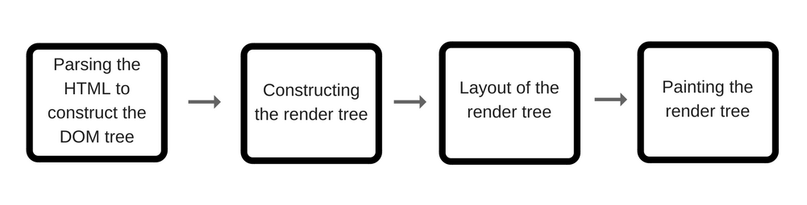
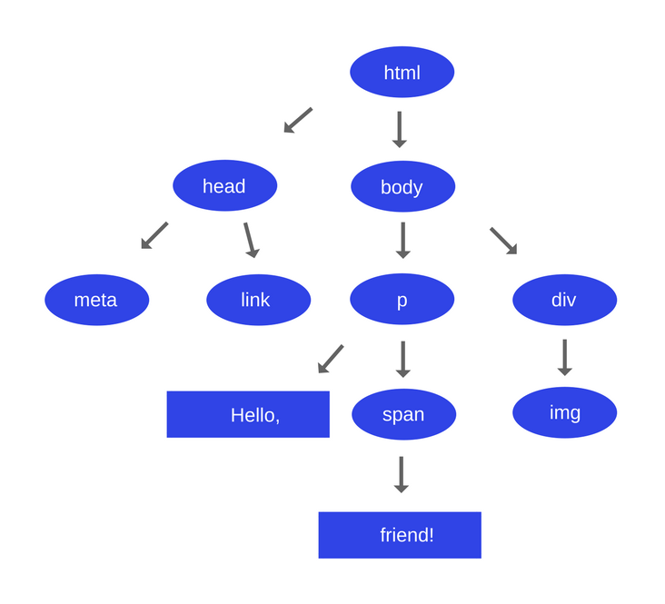
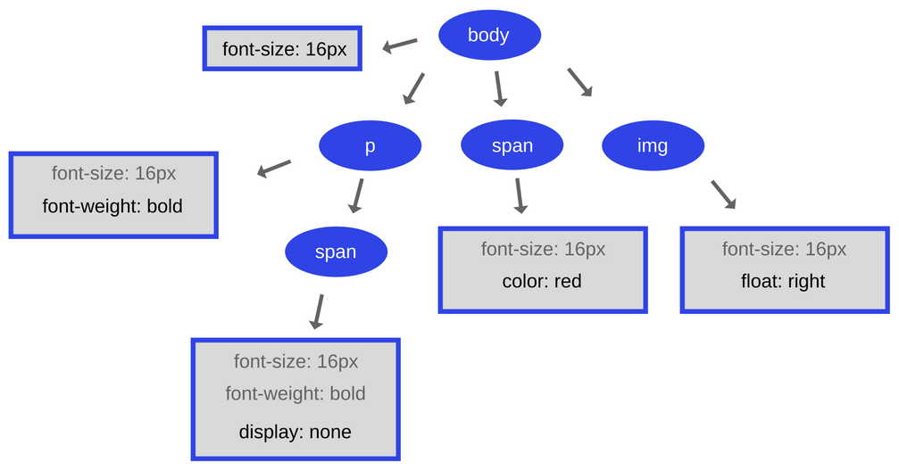
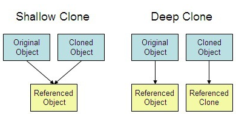
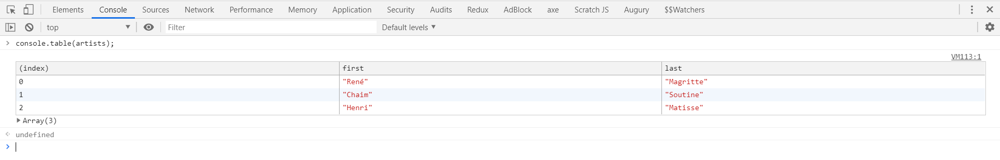
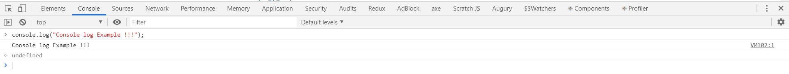
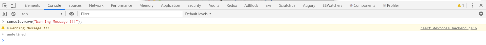
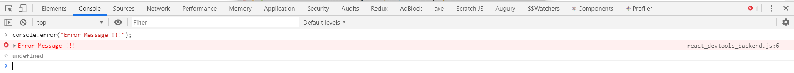
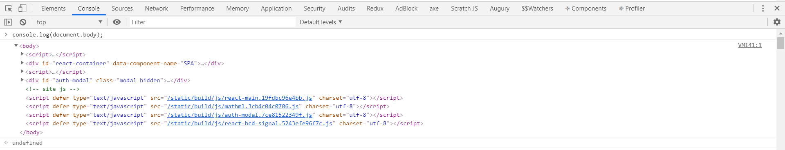
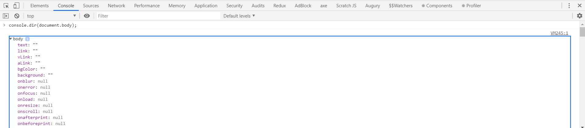

# JavaScript Interview Questions

*Click  if you like the project. Pull Request are highly appreciated.*

## Table of Contents

* *[ES6 Interview Questions and Answers](es6-questions.md)*
* *[Programming in JavaScript](javascript-programs.md)*

<br/>

|Sl.No| Questions                                                                         |
|-----|-----------------------------------------------------------------------------------|
| 01.|[What is difference between document.getElementById() and document.querySelector()?](#q-what-is-difference-between-document-getelementbyid-and-document-queryselector)|
| 02.|[When to use reduce(), map(), foreach() and filter() in JavaScript?](#q-when-to-use-reduce-map-foreach-and-filter-in-javascript)|
| 03.|[What is Hoisting in JavaScript?](#q-what-is-hoisting-in-javascript)|
| 04.|[What are closures?](#q-what-are-closures)|
| 05.|[How do you clone an object in JavaScript?](#q-how-do-you-clone-an-object-in-javascript)|
| 06.|[What are the possible ways to create objects in JavaScript?](#q-what-are-the-possible-ways-to-create-objects-in-javascript)|
| 07.|[What are the javascript data types?](#q-what-are-the-javascript-data-types)|
| 08.|[What are global variables?](#q-what-are-global-variables)|
| 09.|[What is variable shadowing in javascript?](#q-what-is-variable-shadowing-in-javascript)|
| 10.|[What is an event flow?](#q-what-is-an-event-flow)|
| 11.|[What is event bubbling?](#q-what-is-event-bubbling)|
| 12.|[What is event capturing?](#q-what-is-event-capturing)|
| 13.|[What is prototype chain?](#q-what-is-prototype-chain)|
| 14.|[What is the difference between Call, Apply and Bind?](#q-what-is-the-difference-between-call-apply-and-bind)|
| 15.|[What is the difference between == and === operators?](#q-what-is-the-difference-between-and-operators)|
| 16.|[What is a first class function?](#q-what-is-a-first-class-function)|
| 17.|[What is a higher order function?](#q-what-is-a-higher-order-function)|
| 18.|[What is a unary function?](#q-what-is-a-unary-function)|
| 19.|[What is currying function?](#q-what-is-currying-function)|
| 20.|[What is a pure function?](#q-what-is-a-pure-function)|
| 21.|[What is memoization in JavaScript?](#q-what-is-memoization-in-javascript)|
| 22.|[What is a service worker?](#q-what-is-a-service-worker)|
| 23.|[How do you manipulate DOM using service worker?](#q-how-do-you-manipulate-dom-using-service-worker)|
| 24.|[How do you reuse information across service worker restarts?](#q-how-do-you-reuse-information-across-service-worker-restarts)|
| 25.|[What is a post message?](#q-what-is-a-post-message)|
| 26.|[What is a web-storage event and its event handler?](#q-what-is-a-web-storage-event-and-its-event-handler)|
| 27.|[How to use Web Workers in javascript?](#q-how-to-use-web-workers-in-javascript)|
| 28.|[What are the restrictions of web workers on DOM?](#q-what-are-the-restrictions-of-web-workers-on-dom)|
| 29.|[What is a promise?](#q-what-is-a-promise)|
| 30.|[What is a callback function?](#q-what-is-a-callback-function)|
| 31.|[Why do we need callbacks?](#q-why-do-we-need-callbacks)|
| 32.|[What is a callback hell?](#q-what-is-a-callback-hell)|
| 33.|[What is server-sent events?](#q-what-is-server-sent-events)|
| 34.|[What is callback in callback?](#q-what-is-callback-in-callback)|
| 35.|[What is promise chaining?](#q-what-is-promise-chaining)|
| 36.|[What is promise.all()?](#q-what-is-promiseall)|
| 37.|[What is the purpose of race method in promise?](#q-what-is-the-purpose-of-race-method-in-promise)|
| 38.|[What is a strict mode in javascript?](#q-what-is-a-strict-mode-in-javascript)|
| 39.|[What is the purpose of double exclamation?](#q-what-is-the-purpose-of-double-exclamation)|
| 40.|[What is the purpose of delete operator?](#q-what-is-the-purpose-of-delete-operator)|
| 41.|[What is typeof operator?](#q-what-is-typeof-operator)|
| 42.|[What is undefined property?](#q-what-is-undefined-property)|
| 43.|[What is the difference between null and undefined?](#q-what-is-the-difference-between-null-and-undefined)|
| 44.|[What is eval?](#q-what-is-eval)|
| 45.|[What is the difference between window and document?](#q-what-is-the-difference-between-window-and-document)|
| 46.|[How do you access history in javascript?](#q-how-do-you-access-history-in-javascript)|
| 47.|[What is isNaN?](#q-what-is-isnan)|
| 48.|[What are the differences between undeclared and undefined variables?](#q-what-are-the-differences-between-undeclared-and-undefined-variables)|
| 49.|[What is NaN property?](#q-what-is-nan-property)|
| 50.|[What is the purpose of isFinite function?](#q-what-is-the-purpose-of-isfinite-function)|
| 51.|[How do you submit a form using JavaScript?](#q-how-do-you-submit-a-form-using-javascript)|
| 52.|[How do you find operating system details?](#q-how-do-you-find-operating-system-details)|
| 53.|[What is the difference between document load and DOMContentLoaded events?](#q-what-is-the-difference-between-document-load-and-domcontentloaded-events)|
| 54.|[What is the difference between native, host and user objects?](#q-what-is-the-difference-between-native-host-and-user-objects)|
| 55.|[What are the pros and cons of promises over callbacks?](#q-what-are-the-pros-and-cons-of-promises-over-callbacks)|
| 56.|[What is the difference between an attribute and a property?](#q-what-is-the-difference-between-an-attribute-and-a-property)|
| 57.|[What is same-origin policy?](#q-what-is-same-origin-policy)|
| 58.|[What is the purpose of void(0)?](#q-what-is-the-purpose-of-void-0)|
| 59.|[Is JavaScript a compiled or interpreted language?](#q-is-javascript-a-compiled-or-interpreted-language)|
| 60.|[Is JavaScript a case-sensitive language?](#q-is-javascript-a-case-sensitive-language)|
| 61.|[What are events?](#q-what-are-events)|
| 62.|[What is the use of preventDefault method?](#q-what-is-the-use-of-preventdefault-method)|
| 63.|[What is the use of stopPropagation method?](#q-what-is-the-use-of-stoppropagation-method)|
| 64.|[What are the steps involved in return false usage?](#q-what-are-the-steps-involved-in-return-false-usage)|
| 65.|[What is BOM?](#q-what-is-bom)|
| 66.|[What is the use of setTimeout?](#q-what-is-the-use-of-settimeout)|
| 67.|[What is the use of setInterval?](#q-what-is-the-use-of-setinterval)|
| 68.|[Why is JavaScript treated as Single threaded?](#q-why-is-javascript-treated-as-single-threaded)|
| 69.|[What is an event delegation?](#q-what-is-an-event-delegation)|
| 70.|[What is the purpose JSON stringify?](#q-what-is-the-purpose-json-stringify)|
| 71.|[How do you parse JSON string?](#q-how-do-you-parse-json-string)|
| 72.|[What is the purpose of clearTimeout method?](#q-what-is-the-purpose-of-cleartimeout-method)|
| 73.|[What is the purpose of clearInterval method?](#q-what-is-the-purpose-of-clearinterval-method)|
| 74.|[How do you redirect new page in javascript?](#q-how-do-you-redirect-new-page-in-javascript)|
| 75.|[How do you check whether a string contains a substring?](#q-how-do-you-check-whether-a-string-contains-a-substring)|
| 76.|[How do you validate an email in javascript?](#q-how-do-you-validate-an-email-in-javascript)|
| 77.|[How do you get the current url with javascript?](#q-how-do-you-get-the-current-url-with-javascript)|
| 78.|[What are the various url properties of location object?](#q-what-are-the-various-url-properties-of-location-object)|
| 79.|[How do get uery string values in javascript?](#q-how-do-get-uery-string-values-in-javascript)|
| 80.|[How do you check if a key exists in an object?](#q-how-do-you-check-if-a-key-exists-in-an-object)|
| 81.|[How do you loop through or enumerate javascript object?](#q-how-do-you-loop-through-or-enumerate-javascript-object)|
| 82.|[How do you test for an empty object?](#q-how-do-you-test-for-an-empty-object)|
| 83.|[What is an arguments object?](#q-what-is-an-arguments-object)|
| 84.|[How do you make first letter of the string in an uppercase?](#q-how-do-you-make-first-letter-of-the-string-in-an-uppercase)|
| 85.|[What are the pros and cons of for loop?](#q-what-are-the-pros-and-cons-of-for-loop)|
| 86.|[How do you display the current date in javascript?](#q-how-do-you-display-the-current-date-in-javascript)|
| 87.|[How do you compare two date objects?](#q-how-do-you-compare-two-date-objects)|
| 88.|[How do you check if a string starts with another string?](#q-how-do-you-check-if-a-string-starts-with-another-string)|
| 89.|[How do you trim a string in javascript?](#q-how-do-you-trim-a-string-in-javascript)|
| 90.|[How do you add a key value pair in javascript?](#q-how-do-you-add-a-key-value-pair-in-javascript)|
| 91.|[How do you assign default values to variables?](#q-how-do-you-assign-default-values-to-variables)|
| 92.|[Can we define properties for functions?](#q-can-we-define-properties-for-functions)|
| 93.|[What is the way to find the number of parameters expected by a function?](#q-what-is-the-way-to-find-the-number-of-parameters-expected-by-a-function)|
| 94.|[What are break and continue statements?](#q-what-are-break-and-continue-statements)|
| 95.|[What are js labels?](#q-what-are-js-labels)|
| 96.|[What are the benefits of keeping declarations at the top?](#q-what-are-the-benefits-of-keeping-declarations-at-the-top)|
| 97.|[What are the benefits of initializing variables?](#q-what-are-the-benefits-of-initializing-variables)|
| 98.|[What are the recommendations to create new object?](#q-what-are-the-recommendations-to-create-new-object)|
| 99.|[How do you define JSON arrays?](#q-how-do-you-define-json-arrays)|
| 100.|[How do you generate random integers?](#q-how-do-you-generate-random-integers)|
| 101.|[Can you write a random integers function to print integers with in a range?](#q-can-you-write-a-random-integers-function-to-print-integers-with-in-a-range)|
| 102.|[What are the string methods available in Regular expression?](#q-what-are-the-string-methods-available-in-regular-expression)|
| 103.|[What are modifiers in regular expression?](#q-what-are-modifiers-in-regular-expression)|
| 104.|[What are regular expression patterns?](#q-what-are-regular-expression-patterns)|
| 105.|[What is a RegExp object?](#q-what-is-a-regexp-object)|
| 106.|[How do you search a string for a pattern?](#q-how-do-you-search-a-string-for-a-pattern)|
| 107.|[What is the purpose of exec method?](#q-what-is-the-purpose-of-exec-method)|
| 108.|[How do you change style of a HTML element?](#q-how-do-you-change-style-of-a-html-element)|
| 109.|[What is a debugger statement?](#q-what-is-a-debugger-statement)|
| 110.|[What is the purpose of breakpoints in debugging?](#q-what-is-the-purpose-of-breakpoints-in-debugging)|
| 111.|[Can I use reserved words as identifiers?](#q-can-i-use-reserved-words-as-identifiers)|
| 112.|[How do you detect a mobile browser without regexp?](#q-how-do-you-detect-a-mobile-browser-without-regexp)|
| 113.|[How do you get the image width and height using JS?](#q-how-do-you-get-the-image-width-and-height-using-js)|
| 114.|[How do you make synchronous HTTP reuest?](#q-how-do-you-make-synchronous-http-reuest)|
| 115.|[How do you make asynchronous HTTP reuest?](#q-how-do-you-make-asynchronous-http-reuest)|
| 116.|[How do you convert date to another timezone in javascript?](#q-how-do-you-convert-date-to-another-timezone-in-javascript)|
| 117.|[What are the properties used to get size of window?](#q-what-are-the-properties-used-to-get-size-of-window)|
| 118.|[What is a conditional operator in javascript?](#q-what-is-a-conditional-operator-in-javascript)|
| 119.|[Can you apply chaining on conditional operator?](#q-can-you-apply-chaining-on-conditional-operator)|
| 120.|[What are the ways to execute javascript after page load?](#q-what-are-the-ways-to-execute-javascript-after-page-load)|
| 121.|[What is the difference between proto and prototype?](#q-what-is-the-difference-between-proto-and-prototype)|
| 122.|[Give an example where do you really need semicolon?](#q-give-an-example-where-do-you-really-need-semicolon)|
| 123.|[What is a freeze method?](#q-what-is-a-freeze-method)|
| 124.|[What is the purpose of freeze method?](#q-what-is-the-purpose-of-freeze-method)|
| 125.|[Why do I need to use freeze method?](#q-why-do-i-need-to-use-freeze-method)|
| 126.|[How do you detect a browser language preference?](#q-how-do-you-detect-a-browser-language-preference)|
| 127.|[How to convert string to title case with javascript?](#q-how-to-convert-string-to-title-case-with-javascript)|
| 128.|[How do you detect javascript disabled in the page?](#q-how-do-you-detect-javascript-disabled-in-the-page)|
| 129.|[What are various operators supported by javascript?](#q-what-are-various-operators-supported-by-javascript)|
| 130.|[What is a rest parameter?](#q-what-is-a-rest-parameter)|
| 131.|[What happens if you do not use rest parameter as a last argument?](#q-what-happens-if-you-do-not-use-rest-parameter-as-a-last-argument)|
| 132.|[What are the bitwise operators available in javascript?](#q-what-are-the-bitwise-operators-available-in-javascript)|
| 133.|[How do you determine whether object is frozen or not?](#q-how-do-you-determine-whether-object-is-frozen-or-not)|
| 134.|[How do you determine two values same or not using object?](#q-how-do-you-determine-two-values-same-or-not-using-object)|
| 135.|[What is the purpose of using object is method?](#q-what-is-the-purpose-of-using-object-is-method)|
| 136.|[How do you copy properties from one object to other?](#q-how-do-you-copy-properties-from-one-object-to-other)|
| 137.|[What are the applications of assign method?](#q-what-are-the-applications-of-assign-method)|
| 138.|[What is a proxy object?](#q-what-is-a-proxy-object)|
| 139.|[What is the purpose of seal method?](#q-what-is-the-purpose-of-seal-method)|
| 140.|[What are the applications of seal method?](#q-what-are-the-applications-of-seal-method)|
| 141.|[What are the differences between freeze and seal methods?](#q-what-are-the-differences-between-freeze-and-seal-methods)|
| 142.|[How do you determine if an object is sealed or not?](#q-how-do-you-determine-if-an-object-is-sealed-or-not)|
| 143.|[How do you get enumerable key and value pairs?](#q-how-do-you-get-enumerable-key-and-value-pairs)|
| 144.|[What is the main difference between Object.values and Object.entries method?](#q-what-is-the-main-difference-between-objectvalues-and-objectentries-method)|
| 145.|[How can you get the list of keys of any object?](#q-how-can-you-get-the-list-of-keys-of-any-object)|
| 146.|[How do you create an object with prototype?](#q-how-do-you-create-an-object-with-prototype)|
| 147.|[What is a WeakSet?](#q-what-is-a-weakset)|
| 148.|[What are the differences between WeakSet and Set?](#q-what-are-the-differences-between-weakset-and-set)|
| 149.|[List down the collection of methods available on WeakSet?](#q-list-down-the-collection-of-methods-available-on-weakset)|
| 150.|[What is a WeakMap?](#q-what-is-a-weakmap)|
| 151.|[What are the differences between WeakMap and Map?](#q-what-are-the-differences-between-weakmap-and-map)|
| 152.|[List down the collection of methods available on WeakMap?](#q-list-down-the-collection-of-methods-available-on-weakmap)|
| 153.|[What is the purpose of uneval?](#q-what-is-the-purpose-of-uneval)|
| 154.|[How do you encode an URL?](#q-how-do-you-encode-an-url)|
| 155.|[How do you decode an URL?](#q-how-do-you-decode-an-url)|
| 156.|[How do you print the contents of web page?](#q-how-do-you-print-the-contents-of-web-page)|
| 157.|[What is the difference between uneval and eval?](#q-what-is-the-difference-between-uneval-and-eval)|
| 158.|[What is an anonymous function?](#q-what-is-an-anonymous-function)|
| 159.|[What is the precedence order between local and global variables?](#q-what-is-the-precedence-order-between-local-and-global-variables)|
| 160.|[What are javascript accessors?](#q-what-are-javascript-accessors)|
| 161.|[How do you define property on Object constructor?](#q-how-do-you-define-property-on-object-constructor)|
| 162.|[What is the difference between get and defineProperty?](#q-what-is-the-difference-between-get-and-defineproperty)|
| 163.|[What are the advantages of Getters and Setters?](#q-what-are-the-advantages-of-getters-and-setters)|
| 164.|[Can I add getters and setters using defineProperty method?](#q-can-i-add-getters-and-setters-using-defineproperty-method)|
| 165.|[What is the purpose of switch-case?](#q-what-is-the-purpose-of-switch-case)|
| 166.|[What are the conventions to be followed for the usage of swtich case?](#q-what-are-the-conventions-to-be-followed-for-the-usage-of-swtich-case)|
| 167.|[What are the different ways to access object properties?](#q-what-are-the-different-ways-to-access-object-properties)|
| 168.|[What are the function parameter rules?](#q-what-are-the-function-parameter-rules)|
| 169.|[What is an error object?](#q-what-is-an-error-object)|
| 170.|[When you get a syntax error?](#q-when-you-get-a-syntax-error)|
| 171.|[What are the different error names from error object?](#q-what-are-the-different-error-names-from-error-object)|
| 172.|[What are the various statements in error handling?](#q-what-are-the-various-statements-in-error-handling)|
| 173.|[What are the two types of loops in javascript?](#q-what-are-the-two-types-of-loops-in-javascript)|
| 174.|[What is an Intl object?](#q-what-is-an-intl-object)|
| 175.|[How do you perform language specific date and time formatting?](#q-how-do-you-perform-language-specific-date-and-time-formatting)|
| 176.|[What is an Iterator?](#q-what-is-an-iterator)|
| 177.|[What is a decorator?](#q-what-is-a-decorator)|
| 178.|[What are the properties of Intl object?](#q-what-are-the-properties-of-intl-object)|
| 179.|[What is an Unary operator?](#q-what-is-an-unary-operator)|
| 180.|[How do you sort elements in an array?](#q-how-do-you-sort-elements-in-an-array)|
| 181.|[What is the purpose of compareFunction while sorting arrays?](#q-what-is-the-purpose-of-comparefunction-while-sorting-arrays)|
| 182.|[How do you reversing an array?](#q-how-do-you-reversing-an-array)|
| 183.|[How do you find min and max value in an array?](#q-how-do-you-find-min-and-max-value-in-an-array)|
| 184.|[How do you find min and max values without Math functions?](#q-how-do-you-find-min-and-max-values-without-math-functions)|
| 185.|[What is an empty statement and purpose of it?](#q-what-is-an-empty-statement-and-purpose-of-it)|
| 186.|[How do you get meta data of a module?](#q-how-do-you-get-meta-data-of-a-module)|
| 187.|[What is a comma operator?](#q-what-is-a-comma-operator)|
| 188.|[What is the advantage of a comma operator?](#q-what-is-the-advantage-of-a-comma-operator)|
| 189.|[Explain event delegation?](#q-explain-event-delegation)|
| 190.|[Explain how prototypal inheritance works?](#q-explain-how-prototypal-inheritance-works)|
| 191.|[Example of Prototypal Inheritance?](#q-example-of-prototypal-inheritance)|
| 192.|[What do you think of AMD vs CommonJS?](#q-what-do-you-think-of-amd-vs-commonjs)|
| 193.|[Explain why the following does not work as an IIFE: `function foo(){ }();`. What needs to be changed to properly make it an IIFE?](#q-explain-why-the-following-does-not-work-as-an-iife-function-foo-what-needs-to-be-changed-to-properly-make-it-an-iife)|
| 194.|[What is the difference between a variable that is: `null`, `undefined` or undeclared? How would you go about checking for any of these states?](#q-what-is-the-difference-between-a-variable-that-is-null-undefined-or-undeclared-how-would-you-go-about-checking-for-any-of-these-states)|
| 195.|[Can you describe the main difference between a `.forEach` loop and a `.map()` loop and why you would pick one versus the other?](#q-can-you-describe-the-main-difference-between-a-foreach-loop-and-a-map-loop-and-why-you-would-pick-one-versus-the-other)|
| 196.|[What is a typical use case for anonymous functions?](#q-what-is-a-typical-use-case-for-anonymous-functions)|
| 197.|[How do you organize your code? (module pattern, classical inheritance?)](#q-how-do-you-organize-your-code-module-pattern-classical-inheritance)|
| 198.|[What is the difference between host objects and native objects?](#q-what-is-the-difference-between-host-objects-and-native-objects)|
| 199.|[Difference between: `function Person(){}`, `var person = Person()`, and `var person = new Person()`?](#q-difference-between-function-person-var-person-person-and-var-person-new-person)|
| 200.|[What is the difference between `.call` and `.apply`?](#q-what-is-the-difference-between-call-and-apply)|
| 201.|[Explain `Function.prototype.bind`?](#q-explain-functionprototypebind)|
| 202.|[When would you use `document.write()`?](#q-when-would-you-use-documentwrite)|
| 203.|[What is the difference between feature detection, feature inference, and using the UA string?](#q-what-is-the-difference-between-feature-detection-feature-inference-and-using-the-ua-string)|
| 204.|[Explain Ajax in detail?](#q-explain-ajax-in-detail)|
| 205.|[Explain how JSONP works (and how It is not really Ajax)](#q-explain-how-jsonp-works-and-how-it-s-not-really-ajax)|
| 206.|[What is the difference between an "attribute" and a "property"?](#q-what-is-the-difference-between-an-attribute-and-a-property)|
| 207.|[Why is extending built-in JavaScript objects not a good idea?](#q-why-is-extending-built-in-javascript-objects-not-a-good-idea)|
| 208.|[Difference between document `load` event and document `DOMContentLoaded` event?](#q-difference-between-document-load-event-and-document-domcontentloaded-event)|
| 209.|[What is the difference between `==` and `===`?](#q-what-is-the-difference-between-and)|
| 210.|[Explain the same-origin policy with regards to JavaScript?](#q-explain-the-same-origin-policy-with-regards-to-javascript)|
| 211.|[Why is it called a Ternary expression, what does the word "Ternary" indicate?](#q-why-is-it-called-a-ternary-expression-what-does-the-word-ternary-indicate)|
| 212.|[What is `"use strict";`? What are the advantages and disadvantages to using it?](#q-what-is-use-strict-what-are-the-advantages-and-disadvantages-to-using-it)|
| 213.|[Why is it, in general, a good idea to leave the global scope of a website as-is and never touch it?](#q-why-is-it-in-general-a-good-idea-to-leave-the-global-scope-of-a-website-as-is-and-never-touch-it)|
| 214.|[Why would you use something like the `load` event? Does this event have disadvantages? Do you know any alternatives, and why would you use those?](#q-why-would-you-use-something-like-the-load-event-does-this-event-have-disadvantages-do-you-know-any-alternatives-and-why-would-you-use-those)|
| 215.|[What is the extent of your experience with Promises and/or their polyfills?](#q-what-is-the-extent-of-your-experience-with-promises-and-or-their-polyfills)|
| 216.|[What are the pros and cons of using Promises instead of callbacks?](#q-what-are-the-pros-and-cons-of-using-promises-instead-of-callbacks)|
| 217.|[What are some of the advantages/disadvantages of writing JavaScript code in a language that compiles to JavaScript?](#q-what-are-some-of-the-advantages-disadvantages-of-writing-javascript-code-in-a-language-that-compiles-to-javascript)|
| 218.|[What tools and techniues do you use for debugging JavaScript code?](#q-what-tools-and-techniues-do-you-use-for-debugging-javascript-code)|
| 219.|[What language constructions do you use for iterating over object properties and array items?](#q-what-language-constructions-do-you-use-for-iterating-over-object-properties-and-array-items)|
| 220.|[Explain the difference between mutable and immutable objects?](#q-explain-the-difference-between-mutable-and-immutable-objects)|
| 221.|[What is an example of an immutable object in JavaScript?](#q-what-is-an-example-of-an-immutable-object-in-javascript)|
| 222.|[How can you achieve immutability in your own code?](#q-how-can-you-achieve-immutability-in-your-own-code)|
| 223.|[Explain the difference between synchronous and asynchronous functions?](#q-explain-the-difference-between-synchronous-and-asynchronous-functions)|
| 224.|[What is event loop? What is the difference between call stack and task ueue?](#q-what-is-event-loop-what-is-the-difference-between-call-stack-and-task-ueue)|
| 225.|[Explain the differences on the usage of `foo` between `function foo() {}` and `var foo = function() {}`?](#q-explain-the-differences-on-the-usage-of-foo-between-function-foo-and-var-foo-function)|
| 226.|[What are the differences between variables created using `let`, `var` or `const`?](#q-what-are-the-differences-between-variables-created-using-let-var-or-const)|
| 227.|[What is the definition of a higher-order function?](#q-what-is-the-definition-of-a-higher-order-function)|
| 228.|[Can you give an example of a curry function and why this syntax offers an advantage?](#q-can-you-give-an-example-of-a-curry-function-and-why-this-syntax-offers-an-advantage)|
| 229.|[How can you share code between files?](#q-how-can-you-share-code-between-files)|
| 230.|[Why you might want to create static class members?](#q-why-you-might-want-to-create-static-class-members)|
| 231.|[What is the difference between `undefined` and `not defined` in JavaScript?](#q-what-is-the-difference-between-undefined-and-not-defined-in-javascript)|
| 232.|[For which value of `x` the results of the following statements are not the same?](#q-for-which-value-of-x-the-results-of-the-following-statements-are-not-the-same)|
| 233.|[What is the drawback of declaring methods directly in JavaScript objects?](#q-what-is-the-drawback-of-declaring-methods-directly-in-javascript-objects)|
| 234.|[What is “closure” in javascript? Can you provide an example?](#q-what-is-closure-in-javascript-can-you-provide-an-example)|
| 235.|[Write a mul function which will work properly when invoked with following syntax?](#q-write-a-mul-function-which-will-work-properly-when-invoked-with-following-syntax)|
| 236.|[How to empty an array in JavaScript?](#q-how-to-empty-an-array-in-javascript)|
| 237.|[How to check if an object is an array or not?](#q-how-to-check-if-an-object-is-an-array-or-not)|
| 238.|[What is `undefined x 1` in JavaScript?](#q-what-is-undefined-x-1-in-javascript)|
| 239.|[What is the difference between declaring a function in the formats listed below?](#q-what-is-the-difference-between-declaring-a-function-in-the-formats-listed-below)|
| 240.|[In which case the function definition is not hoisted in JavaScript?](#q-in-which-case-the-function-definition-is-not-hoisted-in-javascript)|
| 241.|[What’s the difference between `typeof` and `instanceof`?](#q-what-s-the-difference-between-typeof-and-instanceof)|
| 242.|[Calculate the length of the associative array?](#q-calculate-the-length-of-the-associative-array)|
| 243.|[Difference between `Function`, `Method` and `Constructor` calls in JavaScript?](#q-difference-between-function-method-and-constructor-calls-in-javascript)|
| 244.|[What are Service Workers and when can you use them?](#q-what-are-service-workers-and-when-can-you-use-them)|
| 245.|[What is the difference between a method and a function in javascript?](#q-what-is-the-difference-between-a-method-and-a-function-in-javascript)|
| 246.|[What is IIFE (Immediately Invoked Function Expression) and how it can be useful?](#q-what-is-iife-immediately-invoked-function-expression-and-how-it-can-be-useful)|
| 247.|[Describe Singleton Pattern In JavaScript?](#q-describe-singleton-pattern-in-javascript)|
| 248.|[Singleton Design Pattern Implementation?](#q-singleton-design-pattern-implementation)|
| 249.|[Write a function called deepClone which takes an object and creates a object copy of it?](#q-write-a-function-called-deepclone-which-takes-an-object-and-creates-a-object-copy-of-it)|
| 250.|[Best way to detect `undefined` object property in JavaScript?](#q-best-way-to-detect-undefined-object-property-in-javascript)|
| 251.|[Write a function called `Clone` which takes an object and creates a object copy of it but not copy deep property of object?](#q-write-a-function-called-clone-which-takes-an-object-and-creates-a-object-copy-of-it-but-not-copy-deep-property-of-object)|
| 252.|[What are promises and how they are useful?](#q-what-are-promises-and-how-they-are-useful)|
| 253.|[How to check whether a key exist in a JavaScript object or not?](#q-how-to-check-whether-a-key-exist-in-a-javascript-object-or-not)|
| 254.|[What is NaN, why do we need it, and when can it break the page?](#q-what-is-nan-why-do-we-need-it-and-when-can-it-break-the-page)|
| 255.|[How to check if the value of a variable in an array?](#q-how-to-check-if-the-value-of-a-variable-in-an-array)|
| 256.|[Best way to detect reference values of any type in JavaScript?](#q-best-way-to-detect-reference-values-of-any-type-in-javascript)|
| 257.|[How does Object.create method works JavaScript?](#q-how-does-objectcreate-method-works-javascript)|
| 258.|[How to use constructor functions for inheritance in JavaScript?](#q-how-to-use-constructor-functions-for-inheritance-in-javascript)|
| 259.|[How we can prevent modification of object in JavaScript?](#q-how-we-can-prevent-modification-of-object-in-javascript)|
| 260.|[Write a log function which will add prefix `(your message)` to every message you log using console.log ?](#q-write-a-log-function-which-will-add-prefix-your-message-to-every-message-you-log-using-consolelog)|
| 261.|[Write a function which will test string as a literal and as an object ?](#q-write-a-function-which-will-test-string-as-a-literal-and-as-an-object)|
| 262.|[What is typical use case for anonymous function in JavaScript?](#q-what-is-typical-use-case-for-anonymous-function-in-javascript)|
| 263.|[How to set a default parameter value?](#q-how-to-set-a-default-parameter-value)|
| 264.|[Write code for merge two JavaScript Object dynamically?](#q-write-code-for-merge-two-javascript-object-dynamically)|
| 265.|[What is non-enumerable property in JavaScript and how you can create one?](#q-what-is-non-enumerable-property-in-javascript-and-how-you-can-create-one)|
| 266.|[What is Function binding ?](#q-what-is-function-binding)|
| 267.|[Explain event delegation?](#q-explain-event-delegation)|
| 268.|[Explain how `this` works in JavaScript?](#q-explain-how-this-works-in-javascript)|
| 269.|[Explain how prototypal inheritance works?](#q-explain-how-prototypal-inheritance-works)|
| 270.|[What do you think of AMD vs CommonJS?](#q-what-do-you-think-of-amd-vs-commonjs)|
| 274.|[Can you describe the main difference between a `.forEach` loop and a `.map()` loop and why you would pick one versus the other?](#q-can-you-describe-the-main-difference-between-a-foreach-loop-and-a-map-loop-and-why-you-would-pick-one-versus-the-other)|
| 283.|[Have you ever used JavaScript templating? If so, what libraries have you used?](#q-have-you-ever-used-javascript-templating-if-so-what-libraries-have-you-used)|
| 285.|[What is the difference between an "attribute" and a "property"?](#q-what-is-the-difference-between-an-attribute-and-a-property)|
| 287.|[Difference between document `load` event and document `DOMContentLoaded` event?](#q-difference-between-document-load-event-and-document-domcontentloaded-event)
| 289.|[What is JSON and its common operations?](#q-what-is-json-and-its-common-operations)|
| 290.|[What is the purpose of array slice method?](#q-what-is-the-purpose-of-array-slice-method)|
| 291.|[What is the purpose of array splice method?](#q-what-is-the-purpose-of-array-splice-method)|
| 292.|[What is the difference between slice and splice?](#q-what-is-the-difference-between-slice-and-splice)|
| 293.|[How do you compare Object and Map?](#q-how-do-you-compare-object-and-map)|
| 294.|[How do you redeclare variables in switch block without an error?](#q-how-do-you-redeclare-variables-in-switch-block-without-an-error)|
| 295.|[How to create and trigger events in javascript?](#q-how-to-create-and-trigger-events-in-javascript)|
| 296.|[What is difference between window.frames window.parent and window.top in JavaScript?](#q-what-is-difference-between-windowframes-windowparent-and-windowtop-in-javascript)|
| 297.|[In JavaScript, what is the difference between var x = 1 and x = 1?](#q-in-javascript-what-is-the-difference-between-var-x-1-and-x-1)|
| 298.|[What is Associative Array? How do we use it?](#q-what-is-associative-array-how-do-we-use-it)|
| 299.|[What is difference between Classic Inheritance and Prototypical Inheritance?](#q-what-is-difference-between-classic-inheritance-and-prototypical-inheritance)|
| 300.|[What is difference between private variable, public variable and static variable? How we achieve this in JS?](#q-what-is-difference-between-private-variable-public-variable-and-static-variable-how-we-achieve-this-in-js)|
| 301.|[How to add and remove properties to object in runtime?](#q-how-to-add-and-remove-properties-to-object-in-runtime)|
| 302.|[How to extend built-in objects?](#q-how-to-extend-built-in-objects)|
| 303.|[Why extending array is bad idea?](#q-why-extending-array-is-bad-idea)|
| 304.|[What is difference between browser detection and feature detection?](#q-what-is-difference-between-browser-detection-and-feature-detection)|
| 305.|[What is difference between Graceful Degradation and Progressive Enhancement?](#q-what-is-difference-between-graceful-degradation-and-progressive-enhancement)|
| 306.|[In JavaScript, why is the “this” operator inconsistent?](#q-in-javascript-why-is-the-this-operator-inconsistent)|
| 307.|[What unit testing framework do you use? and why?](#q-what-unit-testing-framework-do-you-use-and-why)|
| 308.|[Explain the difference between Object.freeze() vs const?](#q-explain-the-difference-between-objectfreeze-vs-const)|
| 309.|[What is generator in JS?](#q-what-is-generator-in-js)|
| 310.|[Describe the Revealing Module Pattern in javascript?](#q-describe-the-revealing-module-pattern-in-javascript)|
| 311.|[Compare Async-Await and Generators usage to achive same functionality?](#q-compare-async-await-and-generators-usage-to-achive-same-functionality)|
| 312.|[Explain escape() and unescape() functions?](#q-explain-escape-and-unescape-functions)|
| 313.|[What do you understand by Screen objects?](#q-what-do-you-understand-by-screen-objects)|
| 314.|[How will you remove duplicates from an array in JavaScript?](#q-how-will-you-remove-duplicates-from-an-array-in-javascript)|
| 315.|[Explain NEGATIVE_INFINITY in JavaScript?](#q-explain-negative-infinity-in-javascript)|
| 316.|[What do you understand by ViewState and SessionState?](#q-what-do-you-understand-by-viewstate-and-sessionstate)|
| 317.|[Explain var self = this in JavaScript?](#q-explain-var-self-this-in-javascript)|
| 318.|[What is difference between append() vs appendChild()?](#q-what-is-difference-between-append-vs-appendchild)|
| 319.|[What is difference between null vs undefined?](#q-what-is-difference-between-null-vs-undefined)|
| 320.|[What is difference between array[] vs object()?](#q-what-is-difference-between-array-vs-object)|
| 321.|[What is difference between async() or defer() keyword in JavaScript?](#q-what-is-difference-between-async-or-defer-keyword-in-javascript)|
| 322.|[What is difference between async() and await() in ajax?](#q-what-is-difference-between-async-and-await-in-ajax)|
| 323.|[What is reuest header in javascript?](#q-what-is-reuest-header-in-javascript)|
| 324.|[What is rendering in JavaScript?](#q-what-is-rendering-in-javascript)|
| 325.|[Define the various types of errors which occur in JavaScript programming language?](#q-define-the-various-types-of-errors-which-occur-in-javascript-programming-language)|
| 326.|[What is unshift() method in JavaScript?](#q-what-is-unshift-method-in-javascript)|
| 327.|[What is the difference between HTMLCollection and NodeList?](#q-what-is-the-difference-between-htmlcollection-and-nodelist)|
| 328.|[What is the difference between firstChild and firstElementChild?](#q-what-is-the-difference-between-firstchild-and-firstelementchild)|
| 329.|[Name the two functions that are used to create an HTML element dynamically?](#q-name-the-two-functions-that-are-used-to-create-an-html-element-dynamically)|
| 330.|[What is callback() function in javascript?](#q-what-is-callback-function-in-javascript)|
| 331.|[What is shallow copy and deep copy in javascript?](#q-what-is-shallow-copy-and-deep-copy-in-javascript)|
| 332.|[What is difference between stoppropagation vs stopimmediatepropagation vs preventdefault in javascript?](#q-what-is-difference-between-stoppropagation-vs-stopimmediatepropagation-vs-preventdefault-in-javascript)|
| 333.|[Explain array methods [ join(), pop(), push(), shift(), unshift(), concat(), map(), filter(), reduce(), reduceRight(), every(), some(), indexOf(), lastIndexOf(), find(), findIndex(), includes() ]](#q-explain-array-methods-join-pop-push-shift-unshift-concat-map-filter-reduce-reduceright-every-some-indexof-lastindexof-find-findindex-includes)|
| 334.|[When to use function declarations and expressions in JavaScript?](#q-when-to-use-function-declarations-and-expressions-in-javascript)|
| 335.|[How to avoid callback hell in javascript?](#q-how-to-avoid-callback-hell-in-javascript)|
| 336.|[Why is eval() considered evil and dangerous?](#q-why-is-eval-considered-evil-and-dangerous)|
| 337.|[What is the difference between encryption and hashing?](#q-what-is-the-difference-between-encryption-and-hashing)|
| 338.|[What is Proxies and Reflection in JavaScript?](#q-what-is-proxies-and-reflection-in-javascript)|
| 339.|[How do you check whether an object can be extendable or not?](#q-how-do-you-check-whether-an-object-can-be-extendable-or-not)|
| 340.|[What are the different ways to make an object non-extensible?](#q-what-are-the-different-ways-to-make-an-object-non-extensible)|
| 341.|[Is enums feature available in javascript?](#q-is-enums-feature-available-in-javascript)|
| 342.|[How do I modify the url without reloading the page?](#q-how-do-i-modify-the-url-without-reloading-the-page)|
| 343.|[What is throttling and debouncing in javascript?](#q-what-is-throttling-and-debouncing-in-javascript)|
| 344.|[How to validate JSON Object in javascript?](#q-how-to-validate-json-object-in-javascript)|
| 345.|[How to check if page is fully loaded using javascript?](#q-how-to-check-if-page-is-fully-loaded-using-javascript)|
| 346.|[Explain browser console logs features?](#q-explain-browser-console-logs-features)|
| 347.|[What are the difference between console.log() and console.dir()?](#q-what-are-the-difference-between-consolelog-and-consoledir)|
| 348.|[How to Copy Text to Clipboard?](#q-how-to-copy-text-to-clipboard)|
| 349.|[Explain types of Memory Leaks in JavaScript?](#q-explain-types-of-memory-leaks-in-javascript)|
| 350.|[How accidental closures might cause memory leaks in IE?](#q-how-accidental-closures-might-cause-memory-leaks-in-ie)|
| 351.|[How to convert Decimal to Binary in JavaScript?](#q-how-to-convert-decimal-to-binary-in-javascript)|
| 352.|[How setTimeout() and setInterval() are different from each other ?](#q-how-setTimeout()-and-setInterval()-are-different-from-each-other)|


<br/>

## Q. ***What is difference between document.getElementById() and document.querySelector()?***

* **document.getElementById()**

Returns an element object representing the element whose id property matches the specified string. Since element IDs are required to be unique if specified, they're a useful way to get access to a specific element quickly.

```javascript
element = document.getElementById(id);
```

* **document.querySelector()**

Returns the first matching Element node within the node\'s subtree. If no matching node is found, null is returned.

```javascript
element = document.querySelector(selectors);
```

* **document.querySelectorAll()**

Returns a NodeList containing all matching Element nodes within the node\'s subtree, or an empty NodeList if no matches are found.

```javascript
element = document.querySelectorAll(selectors);
```

*Note: `querySelector()` is more useful when we want to use more complex selectors*.

<div align="right">
    <b><a href="#">↥ back to top</a></b>
</div>

## Q. ***When to use reduce(), map(), foreach() and filter() in JavaScript?***

* **forEach()**  

It takes a callback function and run that callback function on each element of array one by one.

Basically forEach works as a traditional for loop looping over the array and providing array elements to do operations on them.

```javascript
var arr = [10, 20, 30];

arr.forEach(function (elem, index){
   console.log(elem + ' comes at ' + index);
})
```
Output
```
10 comes at 0
20 comes at 1
30 comes at 2
```

* **filter()** 

The main difference between forEach() and filter() is that forEach just loop over the array and executes the callback but filter executes the callback and check its return value. If the value is true element remains in the resulting array but if the return value is false the element will be removed for the resulting array.

*Note: filter does not update the existing array it will return a new filtered array every time*.

```javascript
var arr = [10, 20, 30]; 

var result = arr.filter(function(elem){
    return elem !== 20;
})
console.log(result)
```
Output
```
[10, 30]
```

* **map()**

map() like filter() & forEach() takes a callback and run it against every element on the array but whats makes it unique is it generate a new array based on your existing array.

Like filter(), map() also returns an array. The provided callback to map modifies the array elements and save them into the new array upon completion that array get returned as the mapped array.

```javascript
var arr = [10, 20, 30];

var mapped = arr.map(function(elem) {
    return elem * 10;
});
console.log(mapped)
```
Output
```
[100, 200, 300]
```

* **reduce()** 

reduce() method of the array object is used to reduce the array to one single value.

```javascript
var arr = [10, 20, 30];

var sum = arr.reduce(function(sum, elem) {
    return sum + elem;
});
console.log(sum); // Output: 60
```

<div align="right">
    <b><a href="#">↥ back to top</a></b>
</div>

## Q. ***What is Hoisting in JavaScript?***

Hoisting is a JavaScript mechanism where variables and function declarations are moved to the top of their scope before code execution.

**Example 01:** Variable Hoisting  

```javascript
console.log(message); // output : undefined
var message = "The variable Has been hoisted";
```
The above code looks like as below to the interpreter,

```javascript
var message;
console.log(message);
message = "The variable Has been hoisted";
```
**Example 02:** Function Hoisting

```javascript
function hoist() {
  a = 20;
  var b = 100;
}

hoist();

console.log(a);
/* 
Accessible as a global variable outside hoist() function
Output: 20
*/

console.log(b);
/*
Since it was declared, it is confined to the hoist() function scope.
We can't print it out outside the confines of the hoist() function.
Output: ReferenceError: b is not defined
*/
```

All declarations (function, var, let, const and class) are hoisted in JavaScript, while the `var` declarations are initialized with `undefined`, but `let` and `const` declarations remain uninitialized.

```javascript
console.log(a);
let a = 3;

// Output: ReferenceError: a is not defined
```
They will only get initialized when their lexical binding (assignment) is evaluated during runtime by the JavaScript engine. This means we can’t access the variable before the engine evaluates its value at the place it was declared in the source code. This is what we call **Temporal Dead Zone**, A time span between variable creation and its initialization where they can’t be accessed.

*Note: JavaScript only hoists declarations, not initialisation*

<div align="right">
    <b><a href="#">↥ back to top</a></b>
</div>

## Q. ***What are closures?***

A closure is the combination of a function and the lexical environment within which that function was declared. i.e, It is an inner function that has access to the outer or enclosing function’s variables. The closure has three scope chains

* Own scope where variables defined between its curly brackets
* Outer function’s variables
* Global variables

```javascript
function Welcome(name) {
  var greetingInfo = function(message) {
    console.log(message+' '+name);
  }
  return greetingInfo;
}
var myFunction = Welcome('John');
myFunction('Welcome '); // Output: Welcome John
myFunction('Hello Mr.'); // output: Hello Mr.John
```

As per the above code, the inner `function greetingInfo()` has access to the variables in the outer `function Welcome()` even after outer function has returned.

<div align="right">
    <b><a href="#">↥ back to top</a></b>
</div>

## Q. ***How do you clone an object in JavaScript?***

Using the object spread operator `...`, the object own enumerable properties can be copied into the new object. This creates a shallow clone of the object.

```javascript
const obj = { a: 1, b: 2 }
const shallowClone = { ...obj }
```

With this technique, prototypes are ignored. In addition, nested objects are not cloned, but rather their references get copied, so nested objects still refer to the same objects as the original. Deep-cloning is much more complex in order to effectively clone any type of object (Date, RegExp, Function, Set, etc) that may be nested within the object.

Other alternatives include:

* **JSON.parse(JSON.stringify(obj))** can be used to deep-clone a simple object, but it is CPU-intensive and only accepts valid JSON (therefore it strips functions and does not allow circular references).
* **Object.assign({}, obj)** is another alternative.
* **Object.keys(obj).reduce((acc, key) => (acc[key] = obj[key], acc), {})** is another more verbose alternative that shows the concept in greater depth.

<div align="right">
    <b><a href="#">↥ back to top</a></b>
</div>

## Q. ***What are the possible ways to create objects in JavaScript?***

**a.) Object constructor**: The simpliest way to create an empty object is using Object constructor. Currently this approach is not recommended.

```javascript
 var object = new Object();
```

**b.) Object create method**: The create method of Object creates a new object by passing the prototype object as a parameter

```javascript
 var object = Object.create(null);
```

**c.) Object literal syntax**: The object literal syntax is equivalent to create method when it passes null as parameter

```javascript
 var object = {};
```

**d.) Function constructor**: Create any function and apply the new operator to create object instances,

```javascript
 function Person(name) {
  var object = {};
  object.name = name;
  object.age = 26;
  return object;
 }
 var object = new Person("Alex");
```

**e.) Function constructor with prototype**: This is similar to function constructor but it uses prototype for their properties and methods,

```javascript
function Person(){}
Person.prototype.name = "Alex";
var object = new Person();
```

This is equivalent to an instance created with an object create method with a function prototype and then call that function with an instance and parameters as arguments.

```javascript
function func {};

new func(x, y, z);

// **(OR)**

// Create a new instance using function prototype.
var newInstance = Object.create(func.prototype)

// Call the function
var result = func.call(newInstance, x, y, z),

// If the result is a non-null object then use it otherwise just use the new instance.
console.log(result && typeof result === 'object' ? result : newInstance);
```

**f.) ES6 Class syntax**: ES6 introduces class feature to create the objects

```javascript
class Person {
 constructor(name) {
    this.name = name;
 }
}

var object = new Person("Alex");
```

**g.) Singleton pattern**: A Singleton is an object which can only be instantiated one time. Repeated calls to its constructor return the same instance and this way one can ensure that they don't accidentally create multiple instances.

```javascript
var object = new function() {
  this.name = "Alex";
}
```

<div align="right">
    <b><a href="#">↥ back to top</a></b>
</div>

## Q. ***What are the javascript data types?***

Below are the list of javascript data types available
1. Number
2. String
3. Boolean
4. Object
5. Undefined

<div align="right">
    <b><a href="#">↥ back to top</a></b>
</div>

## Q. ***What are global variables?***

Global variables are those that are available throughout the length of the code without any scope. The var keyword is used to declare a local variable but if you omit it then it will become global variable

```javascript
msg = "Hello" // var is missing, it becomes global variable
```

The problem with global variables is the conflict of variable names of local and global scope. It is also difficult to debug and test the code that relies on global variables.

<div align="right">
    <b><a href="#">↥ back to top</a></b>
</div>

## Q. ***What is variable shadowing in javascript?***

Variable shadowing occurs when a variable declared within a certain scope (decision block, method, or inner class) has the same name as a variable declared in an outer scope. This outer variable is said to be shadowed.

If there is a variable in the global scope, and you'd like to create a variable with the same name in a function. The variable in the inner scope will temporarily shadow the variable in the outer scope.

```javascript
var val = 10;

function Hoist(val) {
    alert(val);
}

Hoist(20);
```

Output
```
20
```

<div align="right">
    <b><a href="#">↥ back to top</a></b>
</div>

## Q. ***What is an event flow?***

Event flow is the order in which event is received on the web page. When you click an element that is nested in various other elements, before your click actually reaches its destination, or target element, it must trigger the click event each of its parent elements first, starting at the top with the global window object.

There are two ways of event flow
* Top to Bottom(Event Capturing)
* Bottom to Top (Event Bubbling)

<div align="right">
    <b><a href="#">↥ back to top</a></b>
</div>

## Q. ***What is event bubbling?***

Event bubbling is a type of event propagation where the event first triggers on the innermost target element, and then successively triggers on the ancestors (parents) of the target element in the same nesting hierarchy till it reaches the outermost DOM element.

Example: If you click on EM, the handler on DIV runs.  

```html
<div onclick="alert('The handler!')">
  <em>If you click on <code>EM</code>, the handler on <code>DIV</code> runs.</em>
</div>
```

* **Stopping bubbling**  

```html

<body onclick="alert(`the bubbling doesn\'t reach here`)">
  <button onclick="event.stopPropagation()">Click me</button>
</body>
```

<div align="right">
    <b><a href="#">↥ back to top</a></b>
</div>

## Q. ***What is event capturing?***

Event capturing is a type of event propagation where the event is first captured by the outermost element and then successively triggers on the descendants (children) of the target element in the same nesting hierarchy till it reaches the inner DOM element.

<div align="right">
    <b><a href="#">↥ back to top</a></b>
</div>

## Q. ***What is prototype chain?***

Nearly all objects in JavaScript are instances of **Object**. That means all the objects in JavaScript inherit the properties and methods from **Object.prototype**. This is called **Prototype chaining**.

**Prototype chaining** is used to build new types of objects based on existing ones. It is similar to inheritance in a class based language. The prototype on object instance is available through `Object.getPrototypeOf(object)` or `__proto__` property whereas prototype on constructors function is available through **Object.prototype**.

```javascript
function Person(firstName, lastName, age) {
  this.firstName = firstName;
  this.lastName = lastName;
  this.age = age;
}
//Person class created
Person.prototype.getFullName = function() {
  return this.firstName + " " + this.lastName;
}

// we have added getFullName method in Person’s prototype.
var person = new Person("John", "K", 25);
// It will create an instance of the Person class
> person.hasOwnProperty("firstName");  // true
> person.hasOwnProperty("getFullName");  // false
> person.getFullName(); // John K
```

<div align="right">
    <b><a href="#">↥ back to top</a></b>
</div>

## Q. ***What is the difference between Call, Apply and Bind?***

**a.) call()**

The call() method invokes a function with a given `this` value and arguments provided one by one

```javascript
var employee1 = {firstName: 'John', lastName: 'Rodson'};
var employee2 = {firstName: 'Jimmy', lastName: 'Baily'};

function invite(greeting1, greeting2) {
    console.log(greeting1 + ' ' + this.firstName + ' ' + this.lastName+ ', '+ greeting2);
}

invite.call(employee1, 'Hello', 'How are you?'); // Hello John Rodson, How are you?
invite.call(employee2, 'Hello', 'How are you?'); // Hello Jimmy Baily, How are you?
```
**b.) apply()** 

Invokes the function and allows you to pass in arguments as an array

```javascript
var employee1 = {firstName: 'John', lastName: 'Rodson'};
var employee2 = {firstName: 'Jimmy', lastName: 'Baily'};

function invite(greeting1, greeting2) {
    console.log(greeting1 + ' ' + this.firstName + ' ' + this.lastName+ ', '+ greeting2);
}

invite.apply(employee1, ['Hello', 'How are you?']); // Hello John Rodson, How are you?
invite.apply(employee2, ['Hello', 'How are you?']); // Hello Jimmy Baily, How are you?
```

**c.) bind()**

returns a new function, allowing you to pass in an array and any number of arguments

```javascript
var employee1 = {firstName: 'John', lastName: 'Rodson'};
var employee2 = {firstName: 'Jimmy', lastName: 'Baily'};

function invite(greeting1, greeting2) {
    console.log(greeting1 + ' ' + this.firstName + ' ' + this.lastName+ ', '+ greeting2);
}

var inviteEmployee1 = invite.bind(employee1);
var inviteEmployee2 = invite.bind(employee2);
inviteEmployee1('Hello', 'How are you?'); // Hello John Rodson, How are you?
inviteEmployee2('Hello', 'How are you?'); // Hello Jimmy Baily, How are you?
```

<div align="right">
    <b><a href="#">↥ back to top</a></b>
</div>

## Q. ***What is the difference between == and === operators?***

JavaScript provides both strict(===, !==) and type-converting(==, !=) equality comparison. The strict operators takes type of variable in consideration, while non-strict operators make type correction/conversion based upon values of variables. The strict operators follow the below conditions for different types,
1. Two strings are strictly equal when they have the same sequence of characters, same length, and same characters in corresponding positions.
2. Two numbers are strictly equal when they are numerically equal. i.e, Having the same number value.
   There are two special cases in this,
   1. NaN is not equal to anything, including NaN.
   2. Positive and negative zeros are equal to one another.
3. Two Boolean operands are strictly equal if both are true or both are false.
4. Two objects are strictly equal if they refer to the same Object.
5. Null and Undefined types are not equal with ===, but equal with ==. i.e,
    null===undefined --> false but null==undefined --> true

**Examples**

```javascript
0 == false   // true
0 === false  // false
1 == "1"     // true
1 === "1"    // false
null == undefined // true
null === undefined // false
'0' == false // true
'0' === false // false
[]==[] or []===[] //false, refer different objects in memory
{}=={} or {}==={} //false, refer different objects in memory
```

<div align="right">
    <b><a href="#">↥ back to top</a></b>
</div>

## Q. ***What is a first class function?***

JavaScript functions are first-class functions meaning functions and objects are treated as the same thing. Functions can be stored as a variable inside an object or an array as well as it can be passed as an argument or be returned by another function. That makes function "first-class citizens in JavaScript"

**Example:** Assign a function to a variable

```javascript
const message = function() {
   console.log("Hello World!");
}

message(); // Invoke it using the variable
```

**Example:** Pass a function as an Argument

```javascript
function sayHello() {
   return "Hello, ";
}
function greeting(helloMessage, name) {
  console.log(helloMessage() + name);
}
// Pass `sayHello` as an argument to `greeting` function
greeting(sayHello, "JavaScript!");
```

**Example:** Return a function

```javascript
function sayHello() {
   return function() {
      console.log("Hello!");
   }
}
```

**Example:** Using a variable

```javascript
const sayHello = function() {
   return function() {
      console.log("Hello!");
   }
}
const myFunc = sayHello();
myFunc();
```

**Example:** Using double parentheses

```javascript
function sayHello() {
   return function() {
      console.log("Hello!");
   }
}
sayHello()();
```
We are using double parentheses `()()` to invoke the returned function as well.

<div align="right">
    <b><a href="#">↥ back to top</a></b>
</div>

## Q. ***What is a higher order function?***

A Higher-Order function is a function that receives a function as an argument or returns the function as output.

For example, `Array.prototype.map()`, `Array.prototype.filter()` and `Array.prototype.reduce()` are some of the Higher-Order functions in javascript.

```javascript
const arr1 = [1, 2, 3];
const arr2 = arr1.map(function(item) {
  return item * 2;
});
console.log(arr2);
```
<div align="right">
    <b><a href="#">↥ back to top</a></b>
</div>

## Q. ***What is a unary function?***

Unary function (i.e. monadic) is a function that accepts exactly one argument. Let us take an example of unary function. It stands for single argument accepted by a function.

```javascript
const unaryFunction = a => console.log (a + 10); //Add 10 to the given argument and display the value
```
<div align="right">
    <b><a href="#">↥ back to top</a></b>
</div>

## Q. ***What is currying function?***

Currying is the process of taking a function with multiple arguments and turning it into a sequence of functions each with only a single argument.

```javascript
function volume(length) {
  return function(width) {
    return function(height) {
      return height * width * length;
    }
  }
}

volume(2)(3)(4); // 24
```
Curried functions are great to improve code re-usability and functional composition.

<div align="right">
    <b><a href="#">↥ back to top</a></b>
</div>

## Q. ***What is a pure function?***

Pure functions are functions that accept an input and returns a value without modifying any data outside its scope(Side Effects). Its output or return value must depend on the input/arguments and pure functions must return a value.

**Example**

```javascript
function impure(arg) {
    finalR.s = 90
    return arg * finalR.s
}
```
The above function is not a pure function because it modified a state `finalR.s` outside its scope.

```javascript
function pure(arg) {
    return arg * 4
}
```
Here is a pure function. It didn’t side effect any external state and it returns an output based on the input.

A function must pass two tests to be considered “pure”:

1. Same inputs always return same outputs
1. No side-effects

**1. Same Input => Same Output**  
Compare this:

```javascript
const add = (x, y) => x + y;

add(2, 4); // 6
```
To this

```javascript
let x = 2;

const add = (y) => {
  x += y;
};

add(4); // x === 6 (the first time)
```
**2. Pure Functions = Consistent Results**  
The first example returns a value based on the given parameters, regardless of where/when you call it.

If you pass 2 and 4, you’ll always get 6.

Nothing else affects the output.

**Benefits**  
* One of the major benefits of using pure functions is they are immediately testable. They will always produce the same result if you pass in the same arguments.
* The pure functions are easier to parallelize
* They also makes maintaining and refactoring code much easier.

<div align="right">
    <b><a href="#">↥ back to top</a></b>
</div>

## Q. ***What is memoization in JavaScript?***

Memoization is a programming technique which attempts to increase a function’s performance by caching its previously computed results.  Each time a memoized function is called, its parameters are used to index the cache. If the data is present, then it can be returned, without executing the entire function. Otherwise the function is executed and then the result is added to the cache.

```javascript
// A simple memoized function to Add Number
const memoizedAdd = () => {
  let cache = {};
  return (number) => {
    if (number in cache) {
      console.log('Fetching from cache: ');
      return cache[number];
    }
    else {
      console.log('Calculating result: ');
      let result = number + 10;
      cache[number] = result;
      return result;
    }
  }
}
// returned function from memoizedAdd
const sum = memoizedAdd();
console.log(sum(10)); // Calculating result: 20
console.log(sum(10)); // Fetching from cache: 20
```

<div align="right">
    <b><a href="#">↥ back to top</a></b>
</div>

## Q. ***What is a service worker?***

A Service worker is basically a JavaScript file that runs in background, separate from a web page and provide features that don't need a web page or user interaction. 

Some of the major features of service workers are 
* Offline first web application development
* Periodic background syncs, push notifications
* Intercept and handle network requests
* Programmatically managing a cache of responses

**Lifecycle of a Service Worker**

It consists of the following phases:
* Download
* Installation
* Activation

**Registering a Service Worker**

To register a service worker we first check if the browser supports it and then register it.

```javascript
if ('serviceWorker' in navigator) {
  navigator.serviceWorker.register('/ServiceWorker.js')
  .then(function(response) {

    // Service worker registration done
    console.log('Registration Successful', response);
  }, function(error) {
    // Service worker registration failed
    console.log('Registration Failed', error);
  }
```

**Installation of service worker**

After the controlled page that takes care of the registration process, we come to the service worker script that handles the installation part.

Basically, you will need to define a callback for the install event and then decide on the files that you wish to cache. Inside a callback, one needs to take of the following three points –

* Open a cache
* Cache the files
* Seek confirmation for the required caches and whether they have been successful.

```javascript
var CACHENAME = 'My site cache'; 
var urlstocache = [ 
	'/', 
  '/styles/main1.css', 
	'/script/main1.js' 
]; 
self.addEventListener('install', function(event) { 
	// Performing installation steps 
	event.waitUntil( 
		caches.open(CACHENAME) 
		.then(function(cache) { 
			console.log('Opening of cache'); 
			return cache.addAll(urlstocache);
		}) 
);
```

**Cache and return requests**

After a service worker is installed and the user navigates to a different page or refreshes, the service worker will begin to receive fetch events, an example of which is below.

```javascript
self.addEventListener('fetch', function(event) {
  event.respondWith(
    caches.match(event.request)
      .then(function(response) {
        // Cache hit - return response
        if (response) {
          return response;
        }
        return fetch(event.request);
      }
    )
  );
});
```

<div align="right">
    <b><a href="#">↥ back to top</a></b>
</div>

## Q. ***How do you manipulate DOM using service worker?***

Service worker can\'t access the DOM directly. But it can communicate with the pages it controls by responding to messages sent via the `postMessage` interface, and those pages can manipulate the DOM.

**Example:** service-worker.html
```html
<!doctype html>
<html>
<head>
<meta charset="UTF-8">
<title>Service Worker</title>
</head>
<body>
(Look in the console.)
<script>
(function() {
    "use strict";

    if (!navigator.serviceWorker || !navigator.serviceWorker.register) {
        console.log("This browser doesn't support service workers");
        return;
    }

    // Listen to messages from service workers.
    navigator.serviceWorker.addEventListener('message', function(event) {
        console.log("Got reply from service worker: " + event.data);
    });

    // Are we being controlled?
    if (navigator.serviceWorker.controller) {
        // Yes, send our controller a message.
        console.log("Sending 'hi' to controller");
        navigator.serviceWorker.controller.postMessage("hi");
    } else {
        // No, register a service worker to control pages like us.
        // Note that it won't control this instance of this page, it only takes effect
        // for pages in its scope loaded *after* It is installed.
        navigator.serviceWorker.register("service-worker.js")
            .then(function(registration) {
                console.log("Service worker registered, scope: " + registration.scope);
                console.log("Refresh the page to talk to it.");
                // If we want to, we might do `location.reload();` so that we'd be controlled by it
            })
            .catch(function(error) {
                console.log("Service worker registration failed: " + error.message);
            });
    }
})();
</script>
</body>
</html>
```

**service-worker.js** 

```javascript
self.addEventListener("message", function(event) {
    //event.source.postMessage("Responding to " + event.data);
    self.clients.matchAll().then(all => all.forEach(client => {
        client.postMessage("Responding to " + event.data);
    }));
});
```

<div align="right">
    <b><a href="#">↥ back to top</a></b>
</div>

## Q. ***How do you reuse information across service worker restarts?***

The problem with service worker is that it get terminated when not in use, and restarted when it is next needed, so you cannot rely on global state within a service worker `onfetch` and `onmessage` handlers. In this case, service workers will have access to IndexedDB API in order to persist and reuse across restarts.

<div align="right">
    <b><a href="#">↥ back to top</a></b>
</div>

## Q. ***What is a post message?***

Post message is a method that enables cross-origin communication between Window objects.(i.e, between a page and a pop-up that it spawned, or between a page and an iframe embedded within it). Generally, scripts on different pages are allowed to access each other if and only if the pages follow same-origin policy(i.e, pages share the same protocol, port number, and host).

<div align="right">
    <b><a href="#">↥ back to top</a></b>
</div>

## Q. ***What is a web-storage event and its event handler?***

The StorageEvent is an event that fires when a storage area has been changed in the context of another document. Whereas onstorage property is an EventHandler for processing storage events.
The syntax would be as below

```javascript
  window.onstorage = functionRef;
```

Let us take the example usage of onstorage event handler which logs the storage key and its values

```javascript
if (typeof(Storage) !== "undefined") {
  window.onstorage = function(e) {
    console.log('The ' + e.key +
      ' key has been changed from ' + e.oldValue +
      ' to ' + e.newValue + '.');
  };
} else {
  // Browser doesnot support web-storage 
}
```

<div align="right">
    <b><a href="#">↥ back to top</a></b>
</div>

## Q. ***How to use Web Workers in javascript?***

**Step 01: Create a Web Workers file**: Write a script to increment the count value.

```javascript
// counter.js
let i = 0;

function timedCount() {
  i = i + 1;
  postMessage(i);
  setTimeout("timedCount()",500);
}

timedCount();
```

Here `postMessage()` method is used to post a message back to the HTML page.  

**Step 02: Create a Web Worker Object**: Create a web worker object by checking for browser support.

```javascript
if (typeof(w) == "undefined") {
  w = new Worker("counter.js");
}
```
and we can receive messages from web workers

```javascript
w.onmessage = function(event){
  document.getElementById("message").innerHTML = event.data;
};
```
**Step 03: Terminate a Web Workers**: Web workers will continue to listen for messages (even after the external script is finished) until it is terminated. You can use terminate() method to terminate listening the messages.

```javascript
w.terminate();
```

**Step 04: Reuse the Web Workers**: If you set the worker variable to undefined you can reuse the code

```javascript
w = undefined;
```

Example:
```html
<!DOCTYPE html>
<html>
<body>
  <p>Count numbers: <output id="result"></output></p>
  <button onclick="startWorker()">Start</button>
  <button onclick="stopWorker()">Stop</button>
  
  <script>
    var w;

    function startWorker() {
      if (typeof(Worker) !== "undefined") {
        if (typeof(w) == "undefined") {
          w = new Worker("counter.js");
        }
        w.onmessage = function(event) {
          document.getElementById("result").innerHTML = event.data;
        };
      } else {
        document.getElementById("result").innerHTML = "Sorry! No Web Worker support.";
      }
    }

    function stopWorker() {
      w.terminate();
      w = undefined;
    }
  </script>
</body>
</html>
```

<div align="right">
    <b><a href="#">↥ back to top</a></b>
</div>

## Q. ***What are the restrictions of web workers on DOM?***

WebWorkers do not have access to below javascript objects since they are defined in an external files
1. Window object
2. Document object
3. Parent object

<div align="right">
    <b><a href="#">↥ back to top</a></b>
</div>

## Q. ***What is a promise?***

A promise is an object that may produce a single value some time in the future with either a resolved value or a reason that it’s not resolved(for example, network error). It will be in one of the 3 possible states: fulfilled, rejected, or pending.
Syntax

```javascript
const promise = new Promise(function(resolve, reject) {
  // promise description
})
```

Promises are used to handle asynchronous operations. They provide an alternative approach for callbacks by reducing the callback hell and writing the cleaner code.

Promises have three states:
1. **Pending:** This is an initial state of the Promise before an operation begins
2. **Fulfilled:** This state indicates that specified operation was completed.
3. **Rejected:** This state indicates that the operation did not complete. In this case an error value will be thrown.

<div align="right">
    <b><a href="#">↥ back to top</a></b>
</div>

## Q. ***What is a callback function?***

A callback function is a function passed into another function as an argument. This function is invoked inside the outer function to complete an action.

```javascript
function callbackFunction(name) {
  console.log('Hello ' + name);
}

function outerFunction(callback) {
  let name = prompt('Please enter your name.');
  callback(name);
}

outerFunction(callbackFunction);
```

<div align="right">
    <b><a href="#">↥ back to top</a></b>
</div>

## Q. ***Why do we need callbacks?***

The callbacks are needed because javascript is a event driven language. That means instead of waiting for a response javascript will keep executing while listening for other events.

Let us take an example with first function invoking an API call(simulated by setTimeout) and next function which logs the message.

```javascript
function firstFunction() {
  // Simulate a code delay
  setTimeout( function() {
    console.log('First function called');
  }, 1000 );
}
function secondFunction() {
  console.log('Second function called');
}
firstFunction();
secondFunction();

Output
// Second function called
// First function called
```
As observed from the output, javascript didnot wait for the response of first function and remaining code block get executed. So callbacks used in a way to make sure that certain code does not execute until other code finished execution.

<div align="right">
    <b><a href="#">↥ back to top</a></b>
</div>

## Q. ***What is a callback hell?***

Callback Hell is an anti-pattern with multiple nested callbacks which makes code hard to read and debug when dealing with asynchronous logic. The callback hell looks like below,

```javascript
async1(function() {
    async2(function() {
        async3(function() {
            async4(function() {
                ....
            });
        });
    });
});
```

<div align="right">
    <b><a href="#">↥ back to top</a></b>
</div>

## Q. ***What is server-sent events?***

Server-sent events (SSE) is a server push technology enabling a browser to receive automatic updates from a server via HTTP connection without resorting to polling. These are a one way communications channel - events flow from server to client only. This is been used in Facebook/Twitter updates, stock price updates, news feeds etc.

The `EventSource` object is used to receive server-sent event notifications. For example, we can receive messages from server as below,

```javascript
if(typeof(EventSource) !== "undefined") {
  var source = new EventSource("sse_generator.js");
  source.onmessage = function(event) {
    document.getElementById("output").innerHTML += event.data + "<br>";
  };
}
```
Below are the list of events available for server sent events

| Event | Description |
|------ |--------------|
| onopen  | It is used when a connection to the server is opened |
| onmessage | This event is used when a message is received  |
| onerror | It happens when an error occurs|

<div align="right">
    <b><a href="#">↥ back to top</a></b>
</div>

## Q. ***What is callback in callback?***

You can nest one callback inside in another callback to execute the actions sequentially one by one. This is known as callbacks in callbacks.

```javascript
loadScript('/script1.js', function(script) {
    console.log('first script is loaded');

  loadScript('/script2.js', function(script) {

    console.log('second script is loaded');

    loadScript('/script3.js', function(script) {

        console.log('third script is loaded');
      // after all scripts are loaded
    });
  })
});
```
<div align="right">
    <b><a href="#">↥ back to top</a></b>
</div>

## Q. ***What is promise chaining?***

The process of executing a sequence of asynchronous tasks one after another using promises is known as Promise chaining.

```javascript
new Promise(function(resolve, reject) {

  setTimeout(() => resolve(1), 1000);

}).then(function(result) {

  console.log(result); // 1
  return result * 2;

}).then(function(result) {

  console.log(result); // 2
  return result * 3;

}).then(function(result) {

  console.log(result); // 6
  return result * 4;

});
```
In the above handlers, the result is passed to the chain of .then() handlers with the below work flow,
1. The initial promise resolves in 1 second,
2. After that `.then` handler is called by logging the result(1) and then return a promise with the value of result * 2.
3. After that the value passed to the next `.then` handler by logging the result(2) and return a promise with result * 3.
4. Finally the value passed to the last `.then` handler by logging the result(6) and return a promise with result * 4.

<div align="right">
    <b><a href="#">↥ back to top</a></b>
</div>

## Q. ***What is promise.all()?***

`Promise.all` is a promise that takes an array of promises as an input (an iterable), and it gets resolved when all the promises get resolved or any one of them gets rejected.

```javascript
Promise.all([Promise1, Promise2, Promise3]) 
        .then(result) => {   
            console.log(result) 
          }) 
        .catch(error => console.log(`Error in promises ${error}`));
```
*Note: Remember that the order of the promises(output the result) is maintained as per input order*.

<div align="right">
    <b><a href="#">↥ back to top</a></b>
</div>

## Q. ***What is the purpose of race method in promise?***

`Promise.race()` method will return the promise instance which is firstly resolved or rejected. Let us take an example of race() method where promise2 is resolved first

```javascript
var promise1 = new Promise(function(resolve, reject) {
    setTimeout(resolve, 500, 'one');
});
var promise2 = new Promise(function(resolve, reject) {
    setTimeout(resolve, 100, 'two');
});

Promise.race([promise1, promise2]).then(function(value) {
  console.log(value); // "two" // Both promises will resolve, but promise2 is faster
});
```
<div align="right">
    <b><a href="#">↥ back to top</a></b>
</div>

## Q. ***What is a strict mode in javascript?***

Strict Mode is a new feature in ECMAScript 5 that allows to place a program, or a function, in a **strict** operating context. This way it prevents certain actions from being taken and throws more exceptions. The literal expression `'use strict';` instructs the browser to use the javascript code in the Strict mode.

Strict mode is useful to write **secure javaScript** by notifying "bad syntax" into real errors. For example, it eliminates accidentally creating a global variable by throwing an error and also throws an error for assignment to a non-writable property, a getter-only property, a non-existing property, a non-existing variable, or a non-existing object.

The strict mode is declared by adding "use strict"; to the beginning of a script or a function.
If declare at the beginning of a script, it has global scope.

```javascript
'use strict';
x = 3.14; // This will cause an error because x is not declared
```
and if you declare inside a function, it has local scope

```javascript
x = 3.14;       // This will not cause an error.
myFunction();

function myFunction() {
  'use strict';
  y = 3.14;   // This will cause an error
}
```
<div align="right">
    <b><a href="#">↥ back to top</a></b>
</div>

## Q. ***What is the purpose of double exclamation?***

The double exclamation or negation(!!) ensures the resulting type is a boolean. If it was falsey (e.g. 0, null, undefined, etc.), it will be false, otherwise, true.
For example, you can test IE version using this expression as below,

```javascript
let isIE11 = false;
isIE11 = !!navigator.userAgent.match(/Trident.*rv[ :]*11\./);
console.log(isIE11); // returns true or false
```
If you do not use this expression then it returns the original value.

```javascript
console.log(navigator.userAgent.match(/Trident.*rv[ :]*11\./));  // returns either an Array or null
```
*Note: The expression !! is not an operator, but it is just twice of ! operator*.

<div align="right">
    <b><a href="#">↥ back to top</a></b>
</div>

## Q. ***What is the purpose of delete operator?***

The delete keyword is used to delete the property as well as its value.

```javascript
var user= {name: "John", age:20};
delete user.age;

console.log(user); // {name: "John"}
```
<div align="right">
    <b><a href="#">↥ back to top</a></b>
</div>

## Q. ***What is typeof operator?***

You can use the JavaScript typeof operator to find the type of a JavaScript variable. It returns the type of a variable or an expression.

```javascript
typeof "John Abraham"     // Returns "string"
typeof (1 + 2)        // Returns "number"
```
<div align="right">
    <b><a href="#">↥ back to top</a></b>
</div>

## Q. ***What is undefined property?***

The undefined property indicates that a variable has not been assigned a value, or not declared at all. The type of undefined value is undefined too.

```javascript
var user;    // Value is undefined, type is undefined
console.log(typeof(user)) //undefined
```
Any variable can be emptied by setting the value to undefined.

```javascript
user = undefined
```
<div align="right">
    <b><a href="#">↥ back to top</a></b>
</div>

## Q. ***What is the difference between null and undefined?***

Below are the main differences between null and undefined,

| Null | Undefined |
|---- | -----------|
| It is an assignment value which indicates that variable points to no object.  | It is not an assignment value where a variable has been declared but has not yet been assigned a value. |
| Type of null is object | Type of undefined is undefined  |
| The null value is a primitive value that represents the null, empty, or non-existent reference. | The undefined value is a primitive value used when a variable has not been assigned a value.|
| Indicates the absence of a value for a variable | Indicates absence of variable itself |
| Converted to zero (0) while performing primitive operations | Converted to NaN while performing primitive operations |

<div align="right">
    <b><a href="#">↥ back to top</a></b>
</div>

## Q. ***What is eval?***

The eval() function evaluates JavaScript code represented as a string. The string can be a JavaScript expression, variable, statement, or sequence of statements.

```javascript
console.log(eval('1 + 2')); //  3
```
<div align="right">
    <b><a href="#">↥ back to top</a></b>
</div>

## Q. ***What is the difference between window and document?***

The window is the first thing that gets loaded into the browser. This window object has the majority of the properties like length, innerWidth, innerHeight, name, if it has been closed, its parents, and more.

The document object is html, aspx, php, or other document that will be loaded into the browser. The document actually gets loaded inside the window object and has properties available to it like title, URL, cookie, etc.

| Window | Document |
|------- | ---------|
| It is the root level element in any web page  | It is the direct child of the window object. This is also known as Document Object Model(DOM) |
| By default window object is available implicitly in the page | You can access it via window.document or document.  |
| It has methods like alert(), confirm() and properties like document, location | It provides methods like getElementById(), getElementByTagName(), createElement() etc  |

<div align="right">
    <b><a href="#">↥ back to top</a></b>
</div>

## Q. ***How do you access history in javascript?***

The window.history object contains the browsers history. You can load previous and next URLs in the history using back() and next() methods.

```javascript
function goBack() {
  window.history.back()
}
function goForward() {
  window.history.forward()
}
```
*Note: You can also access history without window prefix*.

<div align="right">
    <b><a href="#">↥ back to top</a></b>
</div>

## Q. ***What is isNaN?***

The isNaN() function is used to determine whether a value is an illegal number (Not-a-Number) or not. i.e, This function returns true if the value equates to NaN. Otherwise it returns false.

```javascript
isNaN('Hello') //true
isNaN('100') //false
typeof(NaN) //Number
```
<div align="right">
    <b><a href="#">↥ back to top</a></b>
</div>

## Q. ***What are the differences between undeclared and undefined variables?***

Below are the major differences between undeclared and undefined variables,

| undeclared | undefined |
|---- | ---------
| These variables do not exist in a program and are not declared  | These variables declared in the program but have not assigned any value |
| If you try to read the value of an undeclared variable, then a runtime error is encountered | If you try to read the value of an undefined variable, an undefined value is returned.  |

<div align="right">
    <b><a href="#">↥ back to top</a></b>
</div>

## Q. ***What is NaN property?***

The NaN property is a global property that represents "Not-a-Number" value. i.e, It indicates that a value is not a legal number. It is very rare to use NaN in a program but it can be used as return value for few cases

```javascript
Math.sqrt(-1)
parseInt("Hello")
```
<div align="right">
    <b><a href="#">↥ back to top</a></b>
</div>

## Q. ***What is the purpose of isFinite function?***

The isFinite() function is used to determine whether a number is a finite, legal number. It returns false if the value is +infinity, -infinity, or NaN (Not-a-Number), otherwise it returns true.

```javascript
isFinite(Infinity);  // false
isFinite(NaN);       // false
isFinite(-Infinity); // false

isFinite(100);         // true
```
<div align="right">
    <b><a href="#">↥ back to top</a></b>
</div>

## Q. ***How do you submit a form using JavaScript?***

You can submit a form using JavaScript use document.form[0].submit(). All the form input information is submitted using onsubmit event handler

```javascript
function submit() {
    document.form[0].submit();
}
```

<div align="right">
    <b><a href="#">↥ back to top</a></b>
</div>

## Q. ***How do you find operating system details?***

The window.navigator object contains information about the visitor\'s browser os details. Some of the OS properties are avaialble under platform property,

```javascript
console.log(navigator.platform);
```

<div align="right">
    <b><a href="#">↥ back to top</a></b>
</div>

## Q. ***What is the difference between document load and DOMContentLoaded events?***

The `DOMContentLoaded` event is fired when the initial HTML document has been completely loaded and parsed, without waiting for assets(stylesheets, images, and subframes) to finish loading. Whereas The load event is fired when the whole page has loaded, including all dependent resources(stylesheets, images).

<div align="right">
    <b><a href="#">↥ back to top</a></b>
</div>

## Q. ***What is the difference between native, host and user objects?***

* `Native objects` are objects that are part of the JavaScript language defined by the ECMAScript specification. For example, String, Math, RegExp, Object, Function etc core objects defined in the ECMAScript spec.
* `Host objects` are objects provided by the browser or runtime environment (Node). For example, window, XmlHttpRequest, DOM nodes etc considered as host objects.
* `User objects` are objects defined in the javascript code. For example, User object created for profile information.

<div align="right">
    <b><a href="#">↥ back to top</a></b>
</div>

## Q. ***What are the pros and cons of promises over callbacks?***

Below are the list of pros and cons of promises over callbacks,  
**Pros:**
1. It avoids callback hell which is unreadable
2. Easy to write sequential asynchronous code with .then()
3. Easy to write parallel asynchronous code with Promise.all()
4. Solves some of the common problems of callbacks(call the callback too late, too early, many times and swallow errors/exceptions)

**Cons:**
1. It makes little complex code
2. You need to load a polyfill if ES6 is not supported

<div align="right">
    <b><a href="#">↥ back to top</a></b>
</div>

## Q. ***What is the difference between an attribute and a property?***

Attributes are defined on the HTML markup whereas properties are defined on the DOM. For example, the below HTML element has 2 attributes type and value,
```html
<input type="text" value="Name:">
```
You can retrieve the attribute value as below,

```javascript
const input = document.querySelector('input');
console.log(input.getAttribute('value')); // Good morning
console.log(input.value); // Good morning
```
And after you change the value of the text field to "Good evening", it becomes like

```javascript
console.log(input.getAttribute('value')); // Good morning
console.log(input.value); // Good evening
```
<div align="right">
    <b><a href="#">↥ back to top</a></b>
</div>

## Q. ***What is same-origin policy?***

The same-origin policy is a policy that prevents JavaScript from making requests across domain boundaries. An origin is defined as a combination of URI scheme, hostname, and port number. If you enable this policy then it prevents a malicious script on one page from obtaining access to sensitive data on another web page using Document Object Model(DOM).

<div align="right">
    <b><a href="#">↥ back to top</a></b>
</div>

## Q. ***What is the purpose of void(0)?***

The `void(0)` is used to prevent the page from refreshing. This will be helpful to eliminate the unwanted side-effect, because it will return the undefined primitive value. It is commonly used for HTML document that uses `href="JavaScript:void(0);"` within an `<a>` element. i.e, when you click a link, the browser loads a new page or refreshes the same page. But this behavior will be prevented using this expression.  
For example, the below link notify the message without reloading the page
```html
<a href="JavaScript:void(0);" onclick="alert('Well done!')">Click Me!</a>
```
<div align="right">
    <b><a href="#">↥ back to top</a></b>
</div>

## Q. ***Is JavaScript a compiled or interpreted language?***

JavaScript is an interpreted language, not a compiled language. An interpreter in the browser reads over the JavaScript code, interprets each line, and runs it. Nowadays  modern browsers use a technology known as Just-In-Time (JIT) compilation, which compiles JavaScript to executable bytecode just as it is about to run.

<div align="right">
    <b><a href="#">↥ back to top</a></b>
</div>

## Q. ***Is JavaScript a case-sensitive language?***

Yes, JavaScript is a case sensitive language. The language keywords, variables, function & object names, and any other identifiers must always be typed with a consistent capitalization of letters.

<div align="right">
    <b><a href="#">↥ back to top</a></b>
</div>

## Q. ***What are events?***

Events are "things" that happen to HTML elements. When JavaScript is used in HTML pages, JavaScript can `react` on these events. Some of the examples of HTML events are,

1. Web page has finished loading
2. Input field was changed
3. Button was clicked

Example: click event for button element

```html
<!doctype html>
<html>
<head>
  <script>
    function greeting() {
      alert('Hello! Good morning');
    }
  </script>
</head>
<body>
  <button type="button" onclick="greeting()">Click me</button>
</body>
</html>
```

<div align="right">
    <b><a href="#">↥ back to top</a></b>
</div>

## Q. ***What is the use of preventDefault method?***

The preventDefault() method cancels the event if it is cancelable, meaning that the default action or behaviour that belongs to the event will not occur. For example, prevent form submission when clicking on submit button and prevent opening the page URL when clicking on hyper link are some common usecases.

```javascript
document.getElementById("link").addEventListener("click", function(event) {
   event.preventDefault();
});
```

*Note: Remember that not all events are cancelable*.

<div align="right">
    <b><a href="#">↥ back to top</a></b>
</div>

## Q. ***What is the use of stopPropagation method?***

The stopPropagation method is used to stop the event from bubbling up the event chain. For example, the below nested divs with stopPropagation method prevents default event propagation when clicking on nested div(Div1)
```html
<p>Click DIV1 Element</p>
<div onclick="secondFunc()">DIV 2
  <div onclick="firstFunc(event)">DIV 1</div>
</div>

<script>
function firstFunc(event) {
  alert("DIV 1");
  event.stopPropagation();
}

function secondFunc() {
  alert("DIV 2");
}
</script>
```
<div align="right">
    <b><a href="#">↥ back to top</a></b>
</div>

## Q. ***What are the steps involved in return false usage?***

The return false statement in event handlers performs the below steps,
1. First it stops the browser default action or behaviour.
2. It prevents the event from propagating the DOM
3. Stops callback execution and returns immediately when called.

## Q. ***What is BOM?***

The Browser Object Model (BOM) allows JavaScript to "talk to" the browser. It consists of the objects navigator, history, screen, location and document which are children of window. The Browser Object Model is not standardized and can change based on different browsers.

<div align="right">
    <b><a href="#">↥ back to top</a></b>
</div>

## Q. ***What is the use of setTimeout?***

The setTimeout() method is used to call a function or evaluates an expression after a specified number of milliseconds. For example, let us log a message after 2 seconds using setTimeout method,

```javascript
setTimeout(function() { console.log("Good morning"); }, 2000);
```

<div align="right">
    <b><a href="#">↥ back to top</a></b>
</div>

## Q. ***What is the use of setInterval?***

The setInterval() method is used to call a function or evaluates an expression at specified intervals (in milliseconds). For example, let us log a message after 2 seconds using setInterval method,

```javascript
setInterval(function() { console.log("Good morning"); }, 2000);
```

<div align="right">
    <b><a href="#">↥ back to top</a></b>
</div>

## Q. ***How setTimeout() and setInterval() are different from each other?***

```javascript
//Syntax for setTimeout

function displayMessage() {
    console.log('This message will be displayed only once after 4s!') ;
}

setTimeout(displayMessage, 4000);
 
```

```javascript
//Syntax for setInterval

function displayMessage(){
    console.log('This message will be displayed after every 4s!') ;
}

setInterval(displayMessage, 4000) ;

```

Usage : setTimeout( function/expression, timeout, param1, param2, ... ) ;

where expression/function is the JavaScript code to run after the timeout milliseconds have elapsed. The params are optional.

Usage : setInterval ( function/expression, interval, param1, param2, ... );

where expression/function is the  JavaScript code to run  repeatedly at specified interval of time has elpased . 

Main Difference

When you need to invoke a function/expression once after a specified duration use setTimeout() function. 
But, if you need to invoke a function/expression repeatedly at a specified interval of time, then you should use setInterval() function.

<div align="right">
    <b><a href="#">↥ back to top</a></b>
</div>

## Q. ***Why is JavaScript treated as Single threaded?***

JavaScript is a single-threaded language. Because the language specification does not allow the programmer to write code so that the interpreter can run parts of it in parallel in multiple threads or processes. Whereas languages like java, go, C++ can make multi-threaded and multi-process programs.

<div align="right">
    <b><a href="#">↥ back to top</a></b>
</div>

## Q. ***What is an event delegation?***

Event delegation is a technique for listening to events where you delegate a parent element as the listener for all of the events that happen inside it.
For example, if you wanted to detect field changes in inside a specific form, you can use event delegation technique,

```javascript
var form = document.querySelector('#registration-form');

// Listen for changes to fields inside the form
form.addEventListener('input', function (event) {

// Log the field that was changed
console.log(event.target);

}, false);
```
<div align="right">
    <b><a href="#">↥ back to top</a></b>
</div>

## Q. ***What is the purpose JSON stringify?***

When sending data to a web server, the data has to be in a string format. You can achieve this by converting JSON object into a string using stringify() method.

```javascript
var userJSON = {'name': 'John', age: 31}
var userString = JSON.stringify(user);
console.log(userString); //"{"name":"John","age":31}"
```
<div align="right">
    <b><a href="#">↥ back to top</a></b>
</div>

## Q. ***How do you parse JSON string?***

When receiving the data from a web server, the data is always in a string format. But you can convert this string value to javascript object using parse() method.

```javascript
var userString = '{"name":"John","age":31}';
var userJSON = JSON.parse(userString);
console.log(userJSON);// {name: "John", age: 31}
```
<div align="right">
    <b><a href="#">↥ back to top</a></b>
</div>

## Q. ***What is the purpose of clearTimeout method?***

The `clearTimeout()` function is used in javascript to clear the timeout which has been set by `setTimeout()` function before that. i.e, The return value of setTimeout() function is stored in a variable and it’s passed into the clearTimeout() function to clear the timer.
For example, the below setTimeout method is used to display the message after 3 seconds. This timeout can be cleared by clearTimeout() method.

```javascript
var msg;
function greeting() {
  alert('Good morning');
}
function start() {
  msg =setTimeout(greeting, 3000);
}
function stop() {
    clearTimeout(msg);
}
```
<div align="right">
    <b><a href="#">↥ back to top</a></b>
</div>

## Q. ***What is the purpose of clearInterval method?***

The `clearInterval()` function is used in javascript to clear the interval which has been set by `setInterval()` function. i.e, The return value returned by setInterval() function is stored in a variable and it’s passed into the clearInterval() function to clear the interval.
For example, the below setInterval method is used to display the message for every 3 seconds. This interval can be cleared by clearInterval() method.

```javascript
var msg;
function greeting() {
  alert('Good morning');
}
function start() {
  msg = setInterval(greeting, 3000);
}
function stop() {
    clearInterval(msg);
}
```
<div align="right">
    <b><a href="#">↥ back to top</a></b>
</div>

## Q. ***How do you redirect new page in javascript?***

In vanilla javascript, you can redirect to a new page using `location` property of window object. The syntax would be as follows,

```javascript
function redirect() {
  window.location.href = 'newPage.html';
}
```
<div align="right">
    <b><a href="#">↥ back to top</a></b>
</div>

## Q. ***How do you check whether a string contains a substring?***

There are 3 possible ways to check whether a string contains a substring or not,  
**a.) Using includes:** ES6 provided `String.prototype.includes` method to test a string contains a substring

```javascript
var mainString = "hello", subString = "hell";
mainString.includes(subString)
```
**b.) Using indexOf:** In an ES5 or older environments, you can use `String.prototype.indexOf` which returns the index of a substring. If the index value is not equal to -1 then it means the substring exist in the main string.

```javascript
var mainString = "hello", subString = "hell";
mainString.indexOf(subString) !== -1
```
**c.) Using RegEx:** The advanced solution is using Regular expression test method(`RegExp.test`), which allows for testing for against regular expressions

```javascript
var mainString = "hello", regex = "/hell/";
regex.test(mainString)
```
<div align="right">
    <b><a href="#">↥ back to top</a></b>
</div>

## Q. ***How do you validate an email in javascript?***

You can validate an email in javascript using regular expressions. It is recommended to do validations on the server side instead client side. Because the javascript can be disabled on the client side.

```javascript
function validateEmail(email) {
    var re = /^(([^<>()\[\]\\.,;:\s@"]+(\.[^<>()\[\]\\.,;:\s@"]+)*)|(".+"))@((\[[0-9]{1,3}\.[0-9]{1,3}\.[0-9]{1,3}\.[0-9]{1,3}\])|(([a-zA-Z\-0-9]+\.)+[a-zA-Z]{2,}))$/;
    return re.test(String(email).toLowerCase());
}
```
The above regular expression regular accepts unicode characters.

<div align="right">
    <b><a href="#">↥ back to top</a></b>
</div>

## Q. ***How do you get the current url with javascript?***

You can use `window.location.href` expression to get the current url path and you can use the same expression for updating the URL too. You can also use `document.URL` for read-only purpose but this solution has issues in FF.

```javascript
console.log('location.href', window.location.href); // Returns full URL
```

<div align="right">
    <b><a href="#">↥ back to top</a></b>
</div>

## Q. ***What are the various url properties of location object?***

The below `Location` object properties can be used to access URL components of the page

|Properties|Description|
|----------|------------|
|href      |The entire URL|
|protocol  |The protocol of the URL|
|host      |The hostname and port of the URL|
|hostname  |The hostname of the URL|
|port      |The port number in the URL|
|pathname  |The path name of the URL|
|search    |The query portion of the URL|
|hash      |The anchor portion of the URL|

<div align="right">
    <b><a href="#">↥ back to top</a></b>
</div>

## Q. ***How do get query string values in javascript?***

You can use URLSearchParams to get query string values in javascript. Let us see an example to get the client code value from URL query string,

```javascript
const urlParams = new URLSearchParams(window.location.search);
const clientCode = urlParams.get('clientCode');
```
<div align="right">
    <b><a href="#">↥ back to top</a></b>
</div>

## Q. ***How do you check if a key exists in an object?***

**a.) Using in operator:** You can use the in operator whether a key exists in an object or not

```javascript
"key" in obj
```
and If you want to check if a key doesn't exist, remember to use parenthesis,

```javascript
!("key" in obj)
```
**b.) Using hasOwnProperty method:** You can use `hasOwnProperty` to particularly test for properties of the object instance (and not inherited properties)

```javascript
obj.hasOwnProperty("key") // true
```
<div align="right">
    <b><a href="#">↥ back to top</a></b>
</div>

## Q. ***How do you loop through or enumerate javascript object?***

You can use the `for-in` loop to loop through javascript object. You can also make sure that the key you get is an actual property of an object, and doesn't come from the prototype using `hasOwnProperty` method.

```javascript
var object = {
    "k1": "value1",
    "k2": "value2",
    "k3": "value3"
};

for (var key in object) {
    if (object.hasOwnProperty(key)) {
        console.log(key + " -> " + object[key]); // k1 -> value1 ...
    }
}
```
<div align="right">
    <b><a href="#">↥ back to top</a></b>
</div>

## Q. ***How do you test for an empty object?***

**a.) Using Object keys(ECMA 5+):** You can use object keys length along with constructor type.

```javascript
Object.keys(obj).length === 0 && obj.constructor === Object 
```
**b.) Using Object entries(ECMA 7+):** You can use object entries length along with constructor type.

```javascript
Object.entries(obj).length === 0 && obj.constructor === Object 
```
<div align="right">
    <b><a href="#">↥ back to top</a></b>
</div>

## Q. ***What is an arguments object?***

The arguments object is an Array-like object accessible inside functions that contains the values of the arguments passed to that function. For example, let us see how to use arguments object inside sum function,

```javascript
function sum() {
    var total = 0;
    for (var i = 0, len = arguments.length; i < len; ++i) {
        total += arguments[i];
    }
    return total;
}

sum(1, 2, 3) // returns 6
```
<div align="right">
    <b><a href="#">↥ back to top</a></b>
</div>

## Q. ***How do you make first letter of the string in an uppercase?***

You can create a function which uses chain of string methods such as charAt, toUpperCase and slice methods to generate a string with first letter in uppercase.

```javascript
function capitalizeFirstLetter(string) {
    return string.charAt(0).toUpperCase() + string.slice(1);
}
```
<div align="right">
    <b><a href="#">↥ back to top</a></b>
</div>

## Q. ***What are the pros and cons of for loop?***

The for-loop is a commonly used iteration syntax in javascript. It has both pros and cons

**Pros**  
1. Works on every environment
2. You can use break and continue flow control statements

**Cons**  
1. Too verbose
2. Imperative
3. You might face one-by-off errors

<div align="right">
    <b><a href="#">↥ back to top</a></b>
</div>

## Q. ***How do you display the current date in javascript?***

You can use `new Date()` to generate a new Date object containing the current date and time. 

Example:
```javascript
var today = new Date();
var dd = String(today.getDate()).padStart(2, '0');
var mm = String(today.getMonth() + 1).padStart(2, '0'); //January is 0!
var yyyy = today.getFullYear();

today = mm + '/' + dd + '/' + yyyy;
document.write(today);
```

<div align="right">
    <b><a href="#">↥ back to top</a></b>
</div>

## Q. ***How do you compare two date objects?***

You need to use use date.getTime() method to compare date values instead comparision operators (==, !=, ===, and !== operators)

```javascript
var d1 = new Date();
var d2 = new Date(d1);
console.log(d1.getTime() === d2.getTime()); //True
console.log(d1 === d2); // False
```

<div align="right">
    <b><a href="#">↥ back to top</a></b>
</div>

## Q. ***How do you check if a string starts with another string?***

You can use ECMAScript 6 `String.prototype.startsWith()` method to check a string starts with another string or not. But it is not yet supported in all browsers. Let us see an example to see this usage,

```javascript
"Good morning".startsWith("Good"); // true
"Good morning".startsWith("morning"); // false
```

<div align="right">
    <b><a href="#">↥ back to top</a></b>
</div>

## Q. ***How do you trim a string in javascript?***

JavaScript provided a trim method on string types to trim any whitespaces present at the begining or ending of the string.

```javascript
"  Hello World   ".trim(); //Hello World
```

If your browser(`< IE9`) doesnot support this method then you can use below polyfill.

```javascript
if (!String.prototype.trim) {
    (function() {
        // Make sure we trim BOM and NBSP
        var rtrim = /^[\s\uFEFF\xA0]+|[\s\uFEFF\xA0]+$/g;
        String.prototype.trim = function() {
            return this.replace(rtrim, '');
        };
    })();
}
```

<div align="right">
    <b><a href="#">↥ back to top</a></b>
</div>

## Q. ***How do you add a key value pair in javascript?***

There are two possible solutions to add new properties to an object. Let us take a simple object to explain these solutions.

```javascript
var object = {
    key1: value1,
    key2: value2
};
```

**a.) Using dot notation:** This solution is useful when you know the name of the property

```javascript
object.key3 = "value3";
```
**b.) Using square bracket notation:** This solution is useful when the name of the property is dynamically determined.

```javascript
obj["key3"] = "value3";
```
<div align="right">
    <b><a href="#">↥ back to top</a></b>
</div>

## Q. ***How do you assign default values to variables?***

You can use the logical or operator `||` in an assignment expression to provide a default value. The syntax looks like as below,

```javascript
var a = b || c;
```

As per the above expression, variable 'a 'will get the value of 'c' only if 'b' is falsy (if is null, false, undefined, 0, empty string, or NaN), otherwise 'a' will get the value of 'b'.

<div align="right">
    <b><a href="#">↥ back to top</a></b>
</div>

## Q. ***Can we define properties for functions?***

Yes, We can define properties for functions because functions are also objects.

```javascript
fn = function(x) {
  //Function code goes here
}

fn.name = "John";

fn.profile = function(y) {
  //Profile code goes here
}
```

<div align="right">
    <b><a href="#">↥ back to top</a></b>
</div>

## Q. ***What is the way to find the number of parameters expected by a function?***

You can use `function.length` syntax to find the number of parameters expected by a function. Let us take an example of `sum` function to calculate the sum of numbers,

```javascript
function sum(num1, num2, num3, num4){
    return num1 + num2 + num3 + num4;
}
sum.length // 4 is the number of parameters expected.
```

<div align="right">
    <b><a href="#">↥ back to top</a></b>
</div>

## Q. ***What are break and continue statements?***

The break statement is used to "jumps out" of a loop. i.e, It breaks the loop and continues executing the code after the loop.

```javascript
for (i = 0; i < 10; i++) {
  if (i === 5) { break; }
  text += "Number: " + i + "<br>";
}
```

The continue statement is used to "jumps over" one iteration in the loop. i.e, It breaks one iteration (in the loop), if a specified condition occurs, and continues with the next iteration in the loop.

```javascript
for (i = 0; i < 10; i++) {
    if (i === 5) { continue; }
    text += "Number: " + i + "<br>";
}
```

<div align="right">
    <b><a href="#">↥ back to top</a></b>
</div>

## Q. ***What are js labels?***

The label statement allows us to name loops and blocks in JavaScript. We can then use these labels to refer back to the code later. For example, the below code with labels avoids printing the numbers when they are same,

```javascript
var i, j;

loop1:
for (i = 0; i < 3; i++) {
  loop2:
  for (j = 0; j < 3; j++) {
      if (i === j) {
        continue loop1;
      }
      console.log('i = ' + i + ', j = ' + j);
  }
}

// Output is:
//   "i = 1, j = 0"
//   "i = 2, j = 0"
//   "i = 2, j = 1"
```

<div align="right">
    <b><a href="#">↥ back to top</a></b>
</div>

## Q. ***What are the benefits of keeping declarations at the top?***

It is recommended to keep all declarations at the top of each script or function. The benefits of doing this are,
1. Gives cleaner code
2. It provides a single place to look for local variables
3. Easy to avoid unwanted global variables
4. It reduces the possibility of unwanted re-declarations

<div align="right">
    <b><a href="#">↥ back to top</a></b>
</div>

## Q. ***What are the benefits of initializing variables?***

It is recommended to initialize variables because of the below benefits,
1. It gives cleaner code
2. It provides a single place to initialize variables
3. Avoid undefined values in the code

<div align="right">
    <b><a href="#">↥ back to top</a></b>
</div>

## Q. ***What are the recommendations to create new object?***

It is recommended to avoid creating new objects using `new Object()`. Instead you can initialize values based on it is type to create the objects.
1. Assign {} instead of new Object()
2. Assign "" instead of new String()
3. Assign 0 instead of new Number()
4. Assign false instead of new Boolean()
5. Assign [] instead of new Array()
6. Assign /()/ instead of new RegExp()
7. Assign function (){} instead of new Function()

You can define them as an example,

```javascript
var v1 = {};
var v2 = "";
var v3 = 0;
var v4 = false;
var v5 = [];
var v6 = /()/;
var v7 = function(){};
```

<div align="right">
    <b><a href="#">↥ back to top</a></b>
</div>

## Q. ***How do you define JSON arrays?***

JSON arrays are written inside square brackets and array contain javascript objects. For example, the JSON array of users would be as below,

```javascript
"users":[
  {"firstName":"John", "lastName":"Abrahm"},
  {"firstName":"Anna", "lastName":"Smith"},
  {"firstName":"Shane", "lastName":"Warn"}
]
```
<div align="right">
    <b><a href="#">↥ back to top</a></b>
</div>

## Q. ***How do you generate random integers?***

You can use Math.random() with Math.floor() to return random integers. For example, if you want generate random integers between 1 to 10, the multiplication factor should be 10,

```javascript
Math.floor(Math.random() * 10) + 1;     // returns a random integer from 1 to 10
Math.floor(Math.random() * 100) + 1;     // returns a random integer from 1 to 100
```
*Note: Math.random() returns a random number between 0 (inclusive), and 1 (exclusive)*

<div align="right">
    <b><a href="#">↥ back to top</a></b>
</div>

## Q. ***Can you write a random integers function to print integers with in a range?***

Yes, you can create a proper random function to return a random number between min and max (both included)

```javascript
function randomInteger(min, max) {
  return Math.floor(Math.random() * (max - min + 1) ) + min;
}
randomInteger(1, 100); // returns a random integer from 1 to 100
randomInteger(1, 1000); // returns a random integer from 1 to 1000
```
<div align="right">
    <b><a href="#">↥ back to top</a></b>
</div>

## Q. ***What are the string methods available in Regular expression?***

Regular Expressions has two string methods: search() and replace().
The search() method uses an expression to search for a match, and returns the position of the match.

```javascript
var msg = "Hello John";
var n = msg.search(/John/i); // 6
```
The replace() method is used return a modified string where the pattern is replaced.

```javascript
var msg = "Hello John";
var n = msg.search(/John/i, "Buttler"); // Hello Buttler
```
<div align="right">
    <b><a href="#">↥ back to top</a></b>
</div>

## Q. ***What are modifiers in regular expression?***

Modifiers can be used to perform case-insensitive and global searches. 

| Modifier | Description |
|---- | -----------------|
| i  | Perform case-insensitive matching |
| g | Perform a global match rather than stops at first match  |
| m | Perform multiline matching|

Example: Global Modifier

```javascript
  var text = "Learn JS one by one";
  var pattern = /one/g;
  var result = text.match(pattern); // one,one
```
<div align="right">
    <b><a href="#">↥ back to top</a></b>
</div>

## Q. ***What are regular expression patterns?***

Regular Expressions provided group of patterns in order to match characters. Basically they are categorized into 3 types,  

**1. Brackets:** These are used to find a range of characters.
  For example, below are some use cases,
  * [abc]: Used to find any of the characters between the brackets(a,b,c)
  * [0-9]: Used to find any of the digits between the brackets
  * (a|b): Used to find any of the alternatives separated with |

**2. Metacharacters:** These are characters with a special meaning
  For example, below are some use cases,
  * \d: Used to find a digit
  * \s: Used to find a whitespace character
  * \b: Used to find a match at the beginning or ending of a word

**3. Quantifiers:** These are useful to define quantities
  For example, below are some use cases,
  * n+: Used to find matches for any string that contains at least one n
  * n*: Used to find matches for any string that contains zero or more occurrences of n
  * n?: Used to find	matches for any string that contains zero or one occurrences of n

<div align="right">
    <b><a href="#">↥ back to top</a></b>
</div>

## Q. ***What is a RegExp object?***

RegExp object is a regular expression object with predefined properties and methods. 

```javascript
var regexp = new RegExp('\\w+');
console.log(regexp);
// expected output: /\w+/
```
<div align="right">
    <b><a href="#">↥ back to top</a></b>
</div>

## Q. ***How do you search a string for a pattern?***

You can use test() method of regular expression in order to search a string for a pattern, and returns true or false depending on the result.

```javascript
var pattern = /you/;
console.log(pattern.test("How are you?")); //true
```
<div align="right">
    <b><a href="#">↥ back to top</a></b>
</div>

## Q. ***What is the purpose of exec method?***

The purpose of exec method is similar to test method but it returns a founded text as an object instead of returning true/false.

```javascript
var pattern = /you/;
console.log(pattern.test("How are you?")); //you
```
<div align="right">
    <b><a href="#">↥ back to top</a></b>
</div>

## Q. ***How do you change style of a HTML element?***

You can change inline style or classname of a HTML element using javascript
1. **Using style property:** You can modify inline style using style property

```javascript
document.getElementById("title").style.fontSize = "30px";
```
2. **Using ClassName property:** It is easy to modify element class using className property

```javascript
document.getElementById("title").style.className = "custom-title";
```
<div align="right">
    <b><a href="#">↥ back to top</a></b>
</div>

## Q. ***What is a debugger statement?***

The debugger statement invokes any available debugging functionality, such as setting a breakpoint. If no debugging functionality is available, this statement has no effect.
For example, in the below function a debugger statement has been inserted. So execution is paused at the debugger statement just like a breakpoint in the script source.

```javascript
function getProfile() {
// code goes here
debugger;
// code goes here
}
```
<div align="right">
    <b><a href="#">↥ back to top</a></b>
</div>

## Q. ***What is the purpose of breakpoints in debugging?***

You can set breakpoints in the javascript code once the debugger statement is executed and debugger window pops up. At each breakpoint, javascript will stop executing, and let you examine the JavaScript values. After examining values, you can resume the execution of code using play button.

<div align="right">
    <b><a href="#">↥ back to top</a></b>
</div>

## Q. ***Can I use reserved words as identifiers?***

No, you cannot use the reserved words as variables, labels, object or function names.

```javascript
var else = "hello"; // Uncaught SyntaxError: Unexpected token else
```
<div align="right">
    <b><a href="#">↥ back to top</a></b>
</div>

## Q. ***How do you detect a mobile browser without regexp?***

You can detect mobile browser by simply running through a list of devices and checking if the useragent matches anything. This is an alternative solution for RegExp usage,

```javascript
function detectmob() {
if( navigator.userAgent.match(/Android/i)
|| navigator.userAgent.match(/webOS/i)
|| navigator.userAgent.match(/iPhone/i)
|| navigator.userAgent.match(/iPad/i)
|| navigator.userAgent.match(/iPod/i)
|| navigator.userAgent.match(/BlackBerry/i)
|| navigator.userAgent.match(/Windows Phone/i)
){
    return true;
  }
else {
    return false;
  }
}
```
<div align="right">
    <b><a href="#">↥ back to top</a></b>
</div>

## Q. ***How do you get the image width and height using JS?***

You can programmatically get the image and check the dimensions(width and height) using Javascript.

```javascript
var img = new Image();
img.onload = function() {
  console.log(this.width + 'x' + this.height);
}
img.src = 'http://www.google.com/intl/en_ALL/images/logo.gif';
```
<div align="right">
    <b><a href="#">↥ back to top</a></b>
</div>

## Q. ***How do you make synchronous HTTP request?***

Browsers provide an XMLHttpRequest object which can be used to make synchronous HTTP requests from JavaScript

```javascript
function httpGet(theUrl)
{
    var xmlHttpReq = new XMLHttpRequest();
    xmlHttpReQ.open( "GET", theUrl, false ); // false for synchronous request
    xmlHttpReQ.send( null );
    return xmlHttpReQ.responseText;
}
```
<div align="right">
    <b><a href="#">↥ back to top</a></b>
</div>

## Q. ***How do you make asynchronous HTTP request?***

Browsers provide an XMLHttpRequest object which can be used to make asynchronous HTTP requests from JavaScript by passing 3rd parameter as true.

```javascript
function httpGetAsync(theUrl, callback)
{
    var xmlHttpReq = new XMLHttpRequest();
    xmlHttpReQ.onreadystatechange = function() {
        if (xmlHttpReQ.readyState == 4 && xmlHttpReQ.status == 200)
            callback(xmlHttpReQ.responseText);
    }
    xmlHttp.open("GET", theUrl, true); // true for asynchronous
    xmlHttp.send(null);
}
```
<div align="right">
    <b><a href="#">↥ back to top</a></b>
</div>

## Q. ***How do you convert date to another timezone in javascript?***

You can use toLocaleString() method to convert date in one timezone to another. For example, let us convert current date to British English timezone as below,

```javascript
console.log(event.toLocaleString('en-GB', { timeZone: 'UTC' })); //29/06/2019, 09:56:00
```
<div align="right">
    <b><a href="#">↥ back to top</a></b>
</div>

## Q. ***What are the properties used to get size of window?***

You can use innerWidth, innerHeight, clientWidth, clientHeight properties of windows, document element and document body objects to find the size of a window. Let us use them combination of these properties to calculate the size of a window or document,

```javascript
var width = window.innerWidth
|| document.documentElement.clientWidth
|| document.body.clientWidth;

var height = window.innerHeight
|| document.documentElement.clientHeight
|| document.body.clientHeight;
```
<div align="right">
    <b><a href="#">↥ back to top</a></b>
</div>

## Q. ***What is a conditional operator in javascript?***

The conditional (ternary) operator is the only JavaScript operator that takes three operands which acts as a shortcut for if statement.

```javascript
var isAuthenticated = false;
console.log(isAuthenticated ? 'Hello, welcome' : 'Sorry, you are not authenticated');
```
<div align="right">
    <b><a href="#">↥ back to top</a></b>
</div>

## Q. ***Can you apply chaining on conditional operator?***

Yes, you can apply chaining on conditional operator similar to if … else if … else if … else chain. The syntax is going to be as below,

```javascript
function traceValue(someParam) {
    return condition1 ? value1
        : condition2 ? value2
        : condition3 ? value3
        : value4;
}

// The above conditional operator is equivalent to:

function traceValue(someParam) {
    if (condition1) { return value1; }
    else if (condition2) { return value2; }
    else if (condition3) { return value3; }
    else { return value4; }
}
```
<div align="right">
    <b><a href="#">↥ back to top</a></b>
</div>

## Q. ***What are the ways to execute javascript after page load?***

You can execute javascript after page load in many different ways,  
**a.) window.onload:**
```javascript
window.onload = function ...
```
**b.) document.onload:**
```javascript
document.onload = function ...
```
**c.) body onload:**
```html
<body onload="script();">
```
<div align="right">
    <b><a href="#">↥ back to top</a></b>
</div>

## Q. ***What is the difference between proto and prototype?***

The `__proto__` object is the actual object that is used in the lookup chain to resolve methods, etc. Whereas `prototype` is the object that is used to build `__proto__` when you create an object with new
```javascript
( new Employee ).__proto__ === Employee.prototype;
( new Employee ).prototype === undefined;
```
<div align="right">
    <b><a href="#">↥ back to top</a></b>
</div>

## Q. ***Give an example where do you really need semicolon?***

It is recommended to use semicolons after every statement in JavaScript. For example, in the below case it throws an error ".. is not a function" at runtime due to missing semicolon.
```javascript
// define a function
var fn = function () {
    //...
} // semicolon missing at this line

// then execute some code inside a closure
(function () {
    //...
})();
```
and it will be interpreted as
```javascript
var fn = function () {
    //...
}(function () {
    //...
})();
```
In this case, we are passing second function as an argument to the first function and then trying to call the result of the first function call as a function. Hence, the second function will fail with a "... is not a function" error at runtime.

<div align="right">
    <b><a href="#">↥ back to top</a></b>
</div>

## Q. ***What is a freeze method?***

The freeze() method is used to freeze an object. Freezing an object does'nt allow adding new properties to an object,prevents from removing and prevents changing the enumerability, configurability, or writability of existing properties. i.e, It returns the passed object and does not create a frozen copy.
```javascript
const obj = {
  prop: 100
};

Object.freeze(obj);
obj.prop = 200; // Throws an error in strict mode

console.log(obj.prop); //100
```
*Note: It causes a TypeError if the argument passed is not an object*.

<div align="right">
    <b><a href="#">↥ back to top</a></b>
</div>

## Q. ***What is the purpose of freeze method?***

Below are the main benefits of using freeze method,
1. It is used for freezing objects and arrays.
2. It is used to make an object immutable.

## Q. ***Why do I need to use freeze method?***

In Object-oriented paradigm, an existing API contains certain elements that are not intended to be extended, modified, or re-used outside of their current context. Hence it works as `final` keyword which is used in various languages.

<div align="right">
    <b><a href="#">↥ back to top</a></b>
</div>

## Q. ***How do you detect a browser language preference?***

You can use navigator object to detect a browser language preference as below,
```javascript
var language = navigator.languages && navigator.languages[0] || // Chrome / Firefox
              navigator.language ||   // All browsers
              navigator.userLanguage; // IE <= 10

console.log(language);
```
<div align="right">
    <b><a href="#">↥ back to top</a></b>
</div>

## Q. ***How to convert string to title case with javascript?***

Title case means that the first letter of each word is capitalized. You can convert a string to title case using the below function,
```javascript
    function toTitleCase(str) {
        return str.replace(
            /\w\S*/g,
            function(txt) {
                return txt.charAt(0).toUpperCase() + txt.substr(1).toLowerCase();
            }
        );
    }
    toTitleCase("good morning john"); // Good Morning John
```
<div align="right">
    <b><a href="#">↥ back to top</a></b>
</div>

## Q. ***How do you detect javascript disabled in the page?***

You can use `<noscript>` tag to detect javascript disabled or not. The code block inside `<noscript>` get executed when JavaScript is disabled, and are typically used to display alternative content when the page generated in JavaScript.
```html
<script type="javascript">
    // JS related code goes here
</script>
<noscript>
    <a href="next_page.html?noJS=true">JavaScript is disabled in the apge. Please click Next Page</a>
</noscript>
```
<div align="right">
    <b><a href="#">↥ back to top</a></b>
</div>

## Q. ***What are various operators supported by javascript?***

An operator is capable of manipulating(mathematical and logical computations) a certain value or operand. There are various operators supported by JavaScript as below,
1. **Arithmetic Operators:** Includes + (Addition),– (Subtraction), * (Multiplication), / (Division), % (Modulus), + + (Increment)  and – – (Decrement)
2. **Comparison Operators:** Includes = =(Equal),!= (Not Equal), ===(Equal with type), > (Greater than),> = (Greater than or Equal to),< (Less than),<= (Less than or Equal to)
3. **Logical Operators:** Includes &&(Logical AND),||(Logical OR),!(Logical NOT)
4. **Assignment Operators:** Includes = (Assignment Operator), += (Add and Assignment Operator), – = (Subtract and Assignment Operator), *= (Multiply and Assignment), /= (Divide and Assignment), %= (Modules and Assignment)
5. **Ternary Operators:** It includes conditional(: ?) Operator
6. **typeof Operator:** It uses to find type of variable. The syntax looks like `typeof variable`

<div align="right">
    <b><a href="#">↥ back to top</a></b>
</div>

## Q. ***What is a rest parameter?***

Rest parameter is an improved way to handle function parameter which allows us to represent an indefinite number of arguments as an array. The syntax would be as below,
```javascript
function f(a, b, ...theArgs) {
  // ...
}
```
For example, let us take a sum example to calculate on dynamic number of parameters,
```javascript
function total(…args) {
  let sum = 0;
  for(let i of args) {
    sum+=i;
  }
 return sum;
}
console.log(fun(1,2)); //3
console.log(fun(1,2,3)); //6
console.log(fun(1,2,3,4)); //13
console.log(fun(1,2,3,4,5)); //15
```

*Note: Rest parameter is added in ES2015 or ES6*

<div align="right">
    <b><a href="#">↥ back to top</a></b>
</div>

## Q. ***What happens if you do not use rest parameter as a last argument?***

The rest parameter should be the last argument, as its job is to collect all the remaining arguments into an array. For example, if you define a function like below it does not make any sense and will throw an error.

```javascript
function someFunc(a,…b,c) {
  //You code goes here
  return;
}
```

<div align="right">
    <b><a href="#">↥ back to top</a></b>
</div>

## Q. ***What are the bitwise operators available in javascript?***

Below are the list of bit-wise logical operators used in JavaScript
1. Bit-wise AND ( & )
2. Bit-Wise OR ( | )
3. Bit-Wise XOR ( ^ )
4. Bit-Wise NOT ( ~ )
5. Left Shift ( << )
6. Sign Propagating Right Shift ( >> )
7. Zero fill Right Shift ( >>> )

<div align="right">
    <b><a href="#">↥ back to top</a></b>
</div>

## Q. ***How do you determine whether object is frozen or not?***

`Object.isFrozen()` method is used to determine if an object is frozen or not. An object is frozen if all of the below conditions hold true,
1. If it is not extensible.
2. If all of its properties are non-configurable.
3. If all its data properties are non-writable.
The usage is going to be as follows,
```javascript
const object = {
  property: 'Welcome JS world'
};
Object.freeze(object);
console.log(Object.isFrozen(object));
```

<div align="right">
    <b><a href="#">↥ back to top</a></b>
</div>

## Q. ***How do you determine two values same or not using object?***

The `Object.is()` method determines whether two values are the same value. For example, the usage with different types of values would be,
```javascript
Object.is('hello', 'hello'); // true
Object.is(window, window); // true
Object.is([], []) // false
```
Two values are the same if one of the following holds:
1. both undefined
2. both null
3. both true or both false
4. both strings of the same length with the same characters in the same order
5. both the same object (means both object have same reference)
6. both numbers and
  both +0
  both -0
  both NaN
  both non-zero and both not NaN and both have the same value

**Purpose**

1. It is used for comparison of two strings.
2. It is used for comparison of two numbers.
3. It is used for comparing the polarity of two numbers.
4. It is used for comparison of two objects.

<div align="right">
    <b><a href="#">↥ back to top</a></b>
</div>

## Q. ***How do you copy properties from one object to other?***

You can use `Object.assign()` method which is used to copy the values and properties from one or more source objects to a target object.  It returns the target object which has properties and values copied from the target object. The syntax would be as below,
```javascript
Object.assign(target, ...sources)
```
Let us take example with one source and one target object,
```javascript
const target = { a: 1, b: 2 };
const source = { b: 3, c: 4 };

const returnedTarget = Object.assign(target, source);

console.log(target); // { a: 1, b: 3, c: 5 }
console.log(returnedTarget); // { a: 1, b: 3, c: 5 }
```
As observed in the above code, there is a common property(`b`) from source to target so it is value is been overwritten.

<div align="right">
    <b><a href="#">↥ back to top</a></b>
</div>

## Q. ***What are the applications of assign method?***

Below are the some of main applications of `Object.assign()` method,
1. It is used for cloning an object.
2. It is used to merge object with same properties.

<div align="right">
    <b><a href="#">↥ back to top</a></b>
</div>

## Q. ***What is a proxy object?***

The Proxy object is used to define custom behavior for fundamental operations such as property lookup, assignment, enumeration, function invocation, etc. The syntax would be as follows,
```javascript
var p = new Proxy(target, handler);
```
Let us take an example of proxy object,
```javascript
var handler = {
    get: function(obj, prop) {
        return prop in obj ?
            obj[prop] :
            100;
    }
};

var p = new Proxy({}, handler);
p.a = 10;
p.b = null;

console.log(p.a, p.b); // 1, null
console.log('c' in p, p.c); // false, 100
```
In the above code, it uses `get` handler which define the behavior of the proxy when an operation is performed on it

<div align="right">
    <b><a href="#">↥ back to top</a></b>
</div>

## Q. ***What is the purpose of seal method?***

The `Object.seal()` method is used seal an object, by preventing new properties from being added to it and marking all existing properties as non-configurable. But values of present properties can still be changed as long as they are writable. 
```javascript
const object = {
    property: 'Welcome JS world'
};
Object.freeze(object);
object.property = 'Welcome to object world';
console.log(Object.isFrozen(object)); // Welcome to object world
delete object.property; // You cannot delete when sealed
console.log(object.property); //Welcome to object world
```
<div align="right">
    <b><a href="#">↥ back to top</a></b>
</div>

## Q. ***What are the applications of seal method?***

Below are the main applications of `Object.seal()` method,
1. It is used for sealing objects and arrays.
2. It is used to make an object immutable.

<div align="right">
    <b><a href="#">↥ back to top</a></b>
</div>

## Q. ***What are the differences between freeze and seal methods?***

If an object is frozen using the `Object.freeze()` method then its properties become immutable and no changes can be made in them whereas if an object is sealed using the `Object.seal()` method then the changes can be made in the existing properties of the object.

<div align="right">
    <b><a href="#">↥ back to top</a></b>
</div>

## Q. ***How do you determine if an object is sealed or not?***

The `Object.isSealed()` method is used to determine if an object is sealed or not. An object is sealed if all of the below conditions hold true
1. If it is not extensible.
2. If all of its properties are non-configurable.
3. If it is not removable (but not necessarily non-writable).


```javascript
const object = {
  property: 'Hello, Good morning'
};

Object.seal(object); // Using seal() method to seal the object
console.log(Object.isSealed(object));      // checking whether the object is sealed or not
```

<div align="right">
    <b><a href="#">↥ back to top</a></b>
</div>

## Q. ***How do you get enumerable key and value pairs?***

The `Object.entries()` method is used to return an array of a given object own enumerable string-keyed property [key, value] pairs, in the same order as that provided by a `for...in` loop. Let us see the functionality of object.entries() method in an example,
```javascript
const object = {
  a: 'Good morning',
  b: 100
};

for (let [key, value] of Object.entries(object)) {
  console.log(`${key}: ${value}`); // a: 'Good morning'
                                  // b: 100
}
```
*Note: The order is not guaranteed as object defined*.

<div align="right">
    <b><a href="#">↥ back to top</a></b>
</div>

## Q. ***What is the main difference between Object.values and Object.entries method?***

The `Object.values()` method's behavior is similar to `Object.entries()` method but it returns an array of values instead [key,value] pairs.
```javascript
const object = {
  a: 'Good morning',
  b: 100
};

for (let value of Object.values(object)) {
  console.log(`${value}`); // 'Good morning'
                                100
}
```
<div align="right">
    <b><a href="#">↥ back to top</a></b>
</div>

## Q. ***How can you get the list of keys of any object?***

You can use `Object.keys()` method which is used return an array of a given object's own property names, in the same order as we get with a normal loop. For example, you can get the keys of a user object,
```javascript
const user = {
  name: 'John',
  gender: 'male',
  age: 40
};

console.log(Object.keys(user)); //['name', 'gender', 'age']
```
<div align="right">
    <b><a href="#">↥ back to top</a></b>
</div>

## Q. ***How do you create an object with prototype?***

The `Object.create()` method is used to create a new object with the specified prototype object and properties. i.e, It uses existing object as the prototype of the newly created object. It returns a new object with the specified prototype object and properties.
```javascript
const user = {
  name: 'John',
  printInfo: function () {
    console.log(`My name is ${this.name}.`);
  }
};

const admin = Object.create(person);
admin.name = "Nick"; // Remember that "name" is a property set on "admin" but not on "user" object
admin.printInfo(); // My name is Nick
```
<div align="right">
    <b><a href="#">↥ back to top</a></b>
</div>

## Q. ***What is a WeakSet?***

WeakSet is used to store a collection of weakly(weak references) held objects. The syntax would be as follows,
```javascript
new WeakSet([iterable]);
```
Let us see the below example to explain It is behavior,
```javascript
var ws = new WeakSet();
var user = {};
ws.add(user);
ws.has(user);    // true
ws.delete(user); // removes user from the set
ws.has(user);    // false, user has been removed
```
<div align="right">
    <b><a href="#">↥ back to top</a></b>
</div>

## Q. ***What are the differences between WeakSet and Set?***

The main difference is that references to objects in Set are strong while references to objects in WeakSet are weak. i.e, An object in WeakSet can be garbage collected if there is no other reference to it.
Other differences are,
1. Sets can store any value Whereas WeakSets can store only collections of objects
2. WeakSet does not have size property unlike Set
3. WeakSet does not have methods such as clear, keys, values, entries, forEach.
4. WeakSet is not iterable.

<div align="right">
    <b><a href="#">↥ back to top</a></b>
</div>

## Q. ***List down the collection of methods available on WeakSet?***

Below are the list of methods available on WeakSet,
1. add(value): A new object is appended with the given value to the weakset
2. delete(value): Deletes the value from the WeakSet collection.
3. has(value): It returns true if the value is present in the WeakSet Collection, otherwise it returns false.
4. length(): It returns the length of weakSetObject
Let us see the functionality of all the above methods in an example,
```javascript
var weakSetObject = new WeakSet();
var firstObject = {};
var secondObject = {};
// add(value)
weakSetObject.add(firstObject);
weakSetObject.add(secondObject);
console.log(weakSetObject.has(firstObject)); //true
console.log(weakSetObject.length()); //2
weakSetObject.delete(secondObject);
```
<div align="right">
    <b><a href="#">↥ back to top</a></b>
</div>

## Q. ***What is a WeakMap?***

The WeakMap object is a collection of key/value pairs in which the keys are weakly referenced. In this case, keys must be objects and the values can be arbitrary values. The syntax is looking like as below,
```javascript
new WeakMap([iterable])
```
Let us see the below example to explain It is behavior,
```javascript
var ws = new WeakMap();
var user = {};
ws.set(user);
ws.has(user);    // true
ws.delete(user); // removes user from the map
ws.has(user);    // false, user has been removed
```
<div align="right">
    <b><a href="#">↥ back to top</a></b>
</div>

## Q. ***What are the differences between WeakMap and Map?***

The main difference is that references to key objects in Map are strong while references to key objects in WeakMap are weak. i.e, A key object in WeakMap can be garbage collected if there is no other reference to it.
Other differences are,
1. Maps can store any key type Whereas WeakMaps can store only collections of key objects
2. WeakMap does not have size property unlike Map
3. WeakMap does not have methods such as clear, keys, values, entries, forEach.
4. WeakMap is not iterable.

<div align="right">
    <b><a href="#">↥ back to top</a></b>
</div>

## Q. ***List down the collection of methods available on WeakMap?***

Below are the list of methods available on WeakMap,
1. set(key, value): Sets the value for the key in the WeakMap object. Returns the WeakMap object.
2. delete(key): Removes any value associated to the key.
3. has(key): Returns a Boolean asserting whether a value has been associated to the key in the WeakMap object or not.
4. get(key): Returns the value associated to the key, or undefined if there is none.
Let us see the functionality of all the above methods in an example,
```javascript
var weakMapObject = new WeakMap();
var firstObject = {};
var secondObject = {};
// set(key, value)
weakMapObject.set(firstObject, 'John');
weakMapObject.set(secondObject, 100);
console.log(weakMapObject.has(firstObject)); //true
console.log(weakMapObject.get(firstObject)); // John
weakMapObject.delete(secondObject);
```
<div align="right">
    <b><a href="#">↥ back to top</a></b>
</div>

## Q. ***What is the purpose of uneval?***

The `uneval()` is an inbuilt function which is used to create a string representation of the source code of an Object. It is a top-level function and is not associated with any object. 
```javascript
var a = 1;
uneval(a); // returns a String containing 1
uneval(function user() {}); // returns "(function user(){})"
```
<div align="right">
    <b><a href="#">↥ back to top</a></b>
</div>

## Q. ***How do you encode an URL?***

The encodeURI() function is used to encode complete URI which has special characters except (, / ? : @ & = + $ #) characters.
```javascript
var uri = 'https://mozilla.org/?x=шеллы';
var encoded = encodeURI(uri);
console.log(encoded); // https://mozilla.org/?x=%D1%88%D0%B5%D0%BB%D0%BB%D1%8B
```
<div align="right">
    <b><a href="#">↥ back to top</a></b>
</div>

## Q. ***How do you decode an URL?***

The decodeURI() function is used to decode a Uniform Resource Identifier (URI) previously created by encodeURI().
```javascript
var uri = 'https://mozilla.org/?x=шеллы';
var encoded = encodeURI(uri);
console.log(encoded); // https://mozilla.org/?x=%D1%88%D0%B5%D0%BB%D0%BB%D1%8B
try {
  console.log(decodeURI(encoded)); // "https://mozilla.org/?x=шеллы"
} catch(e) { // catches a malformed URI
  console.error(e);
}
```
<div align="right">
    <b><a href="#">↥ back to top</a></b>
</div>

## Q. ***How do you print the contents of web page?***

The window object provided print() method which is used to prints the contents of the current window. It opens Print dialog box which lets you choose between various printing options. 
```html
  <input type="button" value="Print" onclick="window.print()" />
```
*Note: In most browsers, it will block while the print dialog is open*.

<div align="right">
    <b><a href="#">↥ back to top</a></b>
</div>

## Q. ***What is the difference between uneval and eval?***

The `uneval()` function returns the source of a given object; whereas the `eval` function does the opposite, by evaluating that source code in a different memory area. 
```javascript
var msg = uneval(function greeting() { return 'Hello, Good morning'; });
var greeting = eval(msg);
greeting(); // returns "Hello, Good morning"
```
<div align="right">
    <b><a href="#">↥ back to top</a></b>
</div>

## Q. ***What is an anonymous function?***

An anonymous function is a function without a name! Anonymous functions are commonly assigned to a variable name or used as a callback function. The syntax would be as below,
```javascript
function (optionalParameters) {
  //do something
}

const myFunction = function(){ //Anonymous function assigned to a variable
  //do something
};

[1, 2, 3].map(function(element){ //Anonymous function used as a callback function
  //do something
});
```
Example:
```javascript
var x = function (a, b) {return a * b};
var z = x(5, 10);
console.log(z); // 50
```

<div align="right">
    <b><a href="#">↥ back to top</a></b>
</div>

## Q. ***What is the precedence order between local and global variables?***

A local variable takes precedence over a global variable with the same name. 
```javascript
var msg = "Good morning";
function greeting() {
  msg = "Good Evening";
  console.log(msg);
}
greeting();
```
<div align="right">
    <b><a href="#">↥ back to top</a></b>
</div>

## Q. ***What are javascript accessors?***

ECMAScript 5 introduced javascript object accessors or computed properties through getters and setters. Getters uses `get` keyword whereas Setters uses `set` keyword.
```javascript
var user = {
  firstName: "John",
  lastName : "Abraham",
  language : "en",
  get lang() {
    return this.language;
  }
  set lang(lang) {
  this.language = lang;
  }
};
console.log(user.lang); // getter access lang as en
user.lang = 'fr';
console.log(user.lang); // setter used to set lang as fr
```
<div align="right">
    <b><a href="#">↥ back to top</a></b>
</div>

## Q. ***How do you define property on Object constructor?***

The Object.defineProperty() static method is used to define a new property directly on an object, or modifies an existing property on an object, and returns the object. 
```javascript
const newObject = {};

Object.defineProperty(newObject, 'newProperty', {
  value: 100,
  writable: false
});

console.log(newObject.newProperty); // 100

newObject.newProperty = 200; // It throws an error in strict mode due to writable setting
```
<div align="right">
    <b><a href="#">↥ back to top</a></b>
</div>

## Q. ***What is the difference between get and defineProperty?***

Both has similar results until unless you use classes. If you use `get` the property will be defined on the prototype of the object whereas using `Object.defineProperty()` the property will be defined on the instance it is applied to.

<div align="right">
    <b><a href="#">↥ back to top</a></b>
</div>

## Q. ***What are the advantages of Getters and Setters?***

Below are the list of benefits of Getters and Setters,
1. They provide simpler syntax
2. They are used for defining computed properties, or accessors in JS.
3. Useful to provide equivalence relation between properties and methods
4. They can provide better data quality
5. Useful for doing things behind the scenes with the encapsulated logic.

<div align="right">
    <b><a href="#">↥ back to top</a></b>
</div>

## Q. ***Can I add getters and setters using defineProperty method?***

Yes, You can use `Object.defineProperty()` method to add Getters and Setters. For example, the below counter object uses increment, decrement, add and substract properties,
```javascript
var counterObj = {counter : 0};

// Define getters
Object.defineProperty(obj, "increment", {
  get : function () {this.counter++;}
});
Object.defineProperty(obj, "decrement", {
  get : function () {this.counter--;}
});

// Define setters
Object.defineProperty(obj, "add", {
  set : function (value) {this.counter += value;}
});
Object.defineProperty(obj, "subtract", {
  set : function (value) {this.counter -= value;}
});

obj.add = 10;
obj.subtract = 5;
console.log(obj.increment); //6
console.log(obj.decrement); //5
```
<div align="right">
    <b><a href="#">↥ back to top</a></b>
</div>

## Q. ***What is the purpose of switch-case?***

The switch case statement in JavaScript is used for decision making purposes. In few cases, using the switch case statement is going to be more convenient than if-else statements. The syntax would be as below,
```javascript
switch (expression)
{
    case value1:
        statement1;
        break;
    case value2:
        statement2;
        break;
    .
    .
    case valueN:
        statementN;
        break;
    default:
        statementDefault;
}
```
The above multi-way branch statement provides an easy way to dispatch execution to different parts of code based on the value of the expression.

<div align="right">
    <b><a href="#">↥ back to top</a></b>
</div>

## Q. ***What are the conventions to be followed for the usage of swtich case?***

Below are the list of conventions should be taken care,
1. The expression can be of type either number or string.
2. Duplicate values are not allowed for the expression.
3. The default statement is optional. If the expression passed to switch does not matches with any case value then the statement within default case will be executed.
4. The break statement is used inside the switch to terminate a statement sequence.
5. The break statement is optional. But if it omitted, the execution will continue on into the next case.

<div align="right">
    <b><a href="#">↥ back to top</a></b>
</div>

## Q. ***What are the different ways to access object properties?***

There are 3 possible ways for accessing the property of an object.
1. **Dot notation:** It uses dot for accessing the properties
```javascript
objectName.property
```
2. **Square brackets notation:** It uses square brackets for property access
```javascript
objectName["property"]
```
3. **Expression notation:** It uses expression in the square brackets
```javascript
objectName[expression]
```
<div align="right">
    <b><a href="#">↥ back to top</a></b>
</div>

## Q. ***What are the function parameter rules?***

JavaScript functions follow below rules for parameters,
1. The function definitions do not specify data types for parameters.
2. Do not perform type checking on the passed arguments.
3. Do not check the number of arguments received.
i.e, The below function follows the above rules,
```javascript
function functionName(parameter1, parameter2, parameter3) {
  console.log(parameter1); // 1
}
functionName(1);
```
<div align="right">
    <b><a href="#">↥ back to top</a></b>
</div>

## Q. ***What is an error object?***

An error object is a built in error object that provides error information when an error occurs. It has two properties: name and message. For example, the below function logs error details,
```javascript
try {
  greeting("Welcome");
}
catch(err) {
  console.log(err.name + "<br>" + err.message);
}
```
<div align="right">
    <b><a href="#">↥ back to top</a></b>
</div>

## Q. ***When you get a syntax error?***

A SyntaxError is thrown if you try to evaluate code with a syntax error. For example, the below missing quote for the function parameter throws a syntax error
```javascript
try {
  eval("greeting('welcome)");   // Missing ' will produce an error
}
catch(err) {
  console.log(err.name);
}
```
<div align="right">
    <b><a href="#">↥ back to top</a></b>
</div>

## Q. ***What are the different error names from error object?***

There are 6 different types of error names returned from error object

| Error Name | Description |
|----------- |-------------|
| EvalError  | An error has occurred in the eval() function |
| RangeError | An error has occurred with a number "out of range"  |
| ReferenceError | An error due to an illegal reference|
| SyntaxError | An error due to a syntax error|
| TypeError | An error due to a type error |
| URIError | An error due to encodeURI() |

<div align="right">
    <b><a href="#">↥ back to top</a></b>
</div>

## Q. ***What are the various statements in error handling?***

Below are the list of statements used in an error handling,
1. **try:** This statement is used to test a block of code for errors
2. **catch:** This statement is used to handle the error
3. **throw:** This statement is used to create custom errors.
4. **finally:** This statement is used to execute code after try and catch regardless of the result.

<div align="right">
    <b><a href="#">↥ back to top</a></b>
</div>

## Q. ***What are the two types of loops in javascript?***

1. **Entry Controlled loops:** In this kind of loop type, the test condition is tested before entering the loop body. For example, For Loop and While Loop comes under this category.
2. **Exit Controlled Loops:** In this kind of loop typpe, the test condition is tested or evaluated at the end of loop body. i.e, the loop body will execute atleast once irrespective of test condition true or false. For example, do-while loop comes under this category.

<div align="right">
    <b><a href="#">↥ back to top</a></b>
</div>

## Q. ***What is an Intl object?***

The Intl object is the namespace for the ECMAScript Internationalization API, which provides language sensitive string comparison, number formatting, and date and time formatting. It provides an access to several constructors and language sensitive functions.

<div align="right">
    <b><a href="#">↥ back to top</a></b>
</div>

## Q. ***How do you perform language specific date and time formatting?***

You can use `Intl.DateTimeFormat` object which is constructor for objects that enable language-sensitive date and time formatting. Let us see this behavior with an example,
```javascript
var date = new Date(Date.UTC(2019, 07, 07, 3, 0, 0));
console.log(new Intl.DateTimeFormat('en-GB').format(date)); // 07/08/2019
console.log(new Intl.DateTimeFormat('en-AU').format(date)); // 07/08/2019
```
<div align="right">
    <b><a href="#">↥ back to top</a></b>
</div>

## Q. ***What is an Iterator?***

An iterator is an object which defines a sequence and a return value upon its termination. It implements the Iterator protocol with a `next()` method which returns an object with two properties: value (the next value in the sequence) and done (which is true if the last value in the sequence has been consumed).

<div align="right">
    <b><a href="#">↥ back to top</a></b>
</div>

## Q. ***What is a decorator?***

A decorator is an expression that evaluates to a function and that takes the target, name, and decorator descriptor as arguments. Also, it optionally returns a decorator descriptor to install on the target object. Let us define admin decorator for user class at design time,
```javascript
function admin(isAdmin) {
  return function(target) {
      target.isAdmin = isAdmin;
  }
}

@admin(true)
class User() {
}
console.log(User.isAdmin); //true

@admin(false)
class User() {
}
console.log(User.isAdmin); //false
```
<div align="right">
    <b><a href="#">↥ back to top</a></b>
</div>

## Q. ***What are the properties of Intl object?***

Below are the list of properties available on Intl object,
1. **Collator:** These are the objects that enable language-sensitive string comparison.
2. **DateTimeFormat:** These are the objects that enable language-sensitive date and time formatting.
3. **ListFormat:** These are the objects that enable language-sensitive list formatting.
4. **NumberFormat:** Objects that enable language-sensitive number formatting.
5. **PluralRules:** Objects that enable plural-sensitive formatting and language-specific rules for plurals.
6. **RelativeTimeFormat:** Objects that enable language-sensitive relative time formatting.

<div align="right">
    <b><a href="#">↥ back to top</a></b>
</div>

## Q. ***What is an Unary operator?***

The unary(+) operator is used to convert a variable to a number.If the variable cannot be converted, it will still become a number but with the value NaN. Let us see this behavior in an action.
```javascript
var x = "100";
var y = + x;
console.log(typeof x, typeof y); // string, number

var a = "Hello";
var b = + a;
console.log(typeof a, typeof b, b); // string, number, NaN
```
<div align="right">
    <b><a href="#">↥ back to top</a></b>
</div>

## Q. ***How do you sort elements in an array?***

The sort() method is used to sort the elements of an array in place and returns the sorted array. The example usage would be as below,
```javascript
var months = ["Aug", "Sep", "Jan", "June"];
months.sort();
console.log(months); //  ["Aug", "Jan", "June", "Sep"]
```
<div align="right">
    <b><a href="#">↥ back to top</a></b>
</div>

## Q. ***What is the purpose of compareFunction while sorting arrays?***

The compareFunction is used to define the sort order. If omitted, the array elements are converted to strings, then sorted according to each character's Unicode code point value. Let us take an example to see the usage of compareFunction,
```javascript
let numbers = [1, 2, 5, 3, 4];
numbers.sort((a, b) => b - a);
console.log(numbers); // [5, 4, 3, 2, 1]
```
<div align="right">
    <b><a href="#">↥ back to top</a></b>
</div>

## Q. ***How do you reversing an array?***

You can use reverse() method is used reverse the elements in an array. This method is useful to sort an array in descending order. Let us see the usage of reverse() method in an example,
```javascript
let numbers = [1, 2, 5, 3, 4];
numbers.sort((a, b) => b - a);
numbers.reverse();
console.log(numbers); // [1, 2, 3, 4 ,5]
```
<div align="right">
    <b><a href="#">↥ back to top</a></b>
</div>

## Q. ***How do you find min and max value in an array?***

You can use `Math.min` and `Math.max` methods on array variable to find the minimum and maximum elements with in an array. Let us create two functions to find the min and max value with in an array,
```javascript
var marks = [50, 20, 70, 60, 45, 30];
function findMin(arr) {
  return Math.min.apply(null, arr);
}
function findMax(arr) {
  return Math.max.apply(null, arr);
}

console.log(findMin(marks));
console.log(findMax(marks));
```
<div align="right">
    <b><a href="#">↥ back to top</a></b>
</div>

## Q. ***How do you find min and max values without Math functions?***

You can write functions which loops through an array comparing each value with the lowest value or highest value to find the min and max values. Let us create those functions to find min an max values,
```javascript
var marks = [50, 20, 70, 60, 45, 30];
function findMin(arr) {
  var length = arr.length
  var min = Infinity;
  while (length--) {
    if (arr[length] < min) {
      min = arr[length];
    }
  }
  return min;
}

function findMax(arr) {
  var length = arr.length
  var max = -Infinity;
  while (length--) {
    if (arr[length] > max) {
      max = arr[length];
    }
  }
  return max;
}

console.log(findMin(marks));
console.log(findMax(marks));
```
<div align="right">
    <b><a href="#">↥ back to top</a></b>
</div>

## Q. ***What is an empty statement and purpose of it?***

The empty statement is a semicolon (;) indicating that no statement will be executed, even if JavaScript syntax requires one. Since there is no action with an empty statement you might think that It is usage is quite less, but the empty statement is occasionally useful when you want to create a loop that has an empty body. For example, you can initialize an array with zero values as below,
```javascript
// Initialize an array a
for(int i=0; i < a.length; a[i++] = 0) ;
```
<div align="right">
    <b><a href="#">↥ back to top</a></b>
</div>

## Q. ***How do you get meta data of a module?***

You can use `import.meta` object which is a meta-property exposing context-specific meta data to a JavaScript module. It contains information about the current module, such as module's URL. In browser, you might get different meta data than NodeJS.
```javascript
<script type="module" src="welcome-module.js"></script>
console.log(import.meta); // { url: "file:///home/user/welcome-module.js" }
```
<div align="right">
    <b><a href="#">↥ back to top</a></b>
</div>

## Q. ***What is a comma operator?***

The comma operator is used to evaluate each of its operands from left to right and returns the value of the last operand. This is totally different from comma usage within arrays, objects, and function arguments and parameters. For example, the usage for numeric expressions would be as below,
```javascript
var x = 1;
x = (x++, x);

console.log(x); // 2
```
<div align="right">
    <b><a href="#">↥ back to top</a></b>
</div>

## Q. ***What is the advantage of a comma operator?***

It is normally used to include multiple expressions in a location that requires a single expression. One of the common usage of this comma operator is to supply multiple parameters in a `for` loop. For example, the below for loop uses multiple expressions in a single location using comma operator,
```javascript
for (var a = 0, b =10; a <= 10; a++, b--)
```
You can also use the comma operator in a return statement where it process before returning.
```javascript
function myFunction() {
  var a = 1;
  return (a += 10, a); // 11
}
```
<div align="right">
    <b><a href="#">↥ back to top</a></b>
</div>

## Q. ***Explain event delegation?***

Event delegation is a technique involving adding event listeners to a parent element instead of adding them to the descendant elements. The listener will fire whenever the event is triggered on the descendant elements due to event bubbling up the DOM. The benefits of this technique are:

* Memory footprint goes down because only one single handler is needed on the parent element, rather than having to attach event handlers on each descendant.
* There is no need to unbind the handler from elements that are removed and to bind the event for new elements.

<div align="right">
    <b><a href="#">↥ back to top</a></b>
</div>

## Q. ***Example of Prototypal Inheritance?***

We already have a build-in `Object.create`, but if you were to provide a polyfill for it, that might look like:

```javascript
if (typeof Object.create !== 'function') {
  Object.create = function (parent) {
    function Tmp() {}
    Tmp.prototype = parent;
    return new Tmp();
  };
}

const Parent = function() {
  this.name = "Parent";
}

Parent.prototype.greet = function() { console.log("hello from Parent"); }

const child = Object.create(Parent.prototype);

child.cry = function() {
  console.log("waaaaaahhhh!");
}

child.cry();
// Outputs: waaaaaahhhh!

child.greet();
// Outputs: hello from Parent
```

Things to note are:

* `.greet` is not defined on the _child_, so the engine goes up the prototype chain and finds `.greet` off the inherited from _Parent_.
* We need to call `Object.create` in one of following ways for the prototype methods to be inherited:
  * Object.create(Parent.prototype);
  * Object.create(new Parent(null));
  * Object.create(objLiteral);
  * Currently, `child.constructor` is pointing to the `Parent`:

```javascript
child.constructor
ƒ () {
  this.name = "Parent";
}
child.constructor.name
"Parent"
```
  * If we'd like to correct this, one option would be to do:

```javascript
function Child() {
  Parent.call(this);
  this.name = 'child';
}

Child.prototype = Parent.prototype;
Child.prototype.constructor = Child;

const c = new Child();

c.cry();
// Outputs: waaaaaahhhh!

c.greet();
// Outputs: hello from Parent

c.constructor.name;
// Outputs: "Child"
```
<div align="right">
    <b><a href="#">↥ back to top</a></b>
</div>

## Q. ***What do you think of AMD vs CommonJS?***

Both are ways to implement a module system, which was not natively present in JavaScript until ES2015 came along. CommonJS is synchronous while AMD (Asynchronous Module Definition) is obviously asynchronous. CommonJS is designed with server-side development in mind while AMD, with its support for asynchronous loading of modules, is more intended for browsers.

I find AMD syntax to be quite verbose and CommonJS is closer to the style you would write import statements in other languages. Most of the time, I find AMD unnecessary, because if you served all your JavaScript into one concatenated bundle file, you wouldn't benefit from the async loading properties. Also, CommonJS syntax is closer to Node style of writing modules and there is less context-switching overhead when switching between client side and server side JavaScript development.

I'm glad that with ES2015 modules, that has support for both synchronous and asynchronous loading, we can finally just stick to one approach. Although it hasn't been fully rolled out in browsers and in Node, we can always use transpilers to convert our code.

<div align="right">
    <b><a href="#">↥ back to top</a></b>
</div>

## Q. ***Explain why the following does not work as an IIFE: `function foo(){ }();`. What needs to be changed to properly make it an IIFE?***

IIFE stands for Immediately Invoked Function Expressions. The JavaScript parser reads `function foo(){ }();` as `function foo(){ }` and `();`, where the former is a *function declaration* and the latter (a pair of parentheses) is an attempt at calling a function but there is no name specified, hence it throws `Uncaught SyntaxError: Unexpected token )`.

Here are two ways to fix it that involves adding more parentheses: `(function foo(){ })()` and `(function foo(){ }())`. Statements that begin with `function` are considered to be *function declarations*; by wrapping this function within `()`, it becomes a *function expression* which can then be executed with the subsequent `()`. These functions are not exposed in the global scope and you can even omit its name if you do not need to reference itself within the body.

You might also use `void` operator: `void function foo(){ }();`. Unfortunately, there is one issue with such approach. The evaluation of given expression is always `undefined`, so if your IIFE function returns anything, you can not use it. An example:

```js
// Do not add JS syntax to this code block to prevent Prettier from formatting it.
const foo = void function bar() { return 'foo'; }();

console.log(foo); // undefined
```

<div align="right">
    <b><a href="#">↥ back to top</a></b>
</div>

## Q. ***What is the difference between a variable that is: `null`, `undefined` or undeclared? How would you go about checking for any of these states?***

**Undeclared** variables are created when you assign a value to an identifier that is not previously created using `var`, `let` or `const`. Undeclared variables will be defined globally, outside of the current scope. In strict mode, a `ReferenceError` will be thrown when you try to assign to an undeclared variable. Undeclared variables are bad just like how global variables are bad. Avoid them at all cost! To check for them, wrap its usage in a `try`/`catch` block.

```javascript
function foo() {
  x = 1; // Throws a ReferenceError in strict mode
}

foo();
console.log(x); // 1
```

A variable that is `undefined` is a variable that has been declared, but not assigned a value. It is of type `undefined`. If a function does not return any value as the result of executing it is assigned to a variable, the variable also has the value of `undefined`. To check for it, compare using the strict equality (`===`) operator or `typeof` which will give the `'undefined'` string. Note that you should not be using the abstract equality operator to check, as it will also return `true` if the value is `null`.

```javascript
var foo;
console.log(foo); // undefined
console.log(foo === undefined); // true
console.log(typeof foo === 'undefined'); // true

console.log(foo == null); // true. Wrong, don't use this to check!

function bar() {}
var baz = bar();
console.log(baz); // undefined
```

A variable that is `null` will have been explicitly assigned to the `null` value. It represents no value and is different from `undefined` in the sense that it has been explicitly assigned. To check for `null,` simply compare using the strict equality operator. Note that like the above, you should not be using the abstract equality operator (`==`) to check, as it will also return `true` if the value is `undefined`.

```javascript
var foo = null;
console.log(foo === null); // true
console.log(typeof foo === 'object'); // true

console.log(foo == undefined); // true. Wrong, don't use this to check!
```

As a personal habit, I never leave my variables undeclared or unassigned. I will explicitly assign `null` to them after declaring if I do not intend to use it yet. If you use a linter in your workflow, it will usually also be able to check that you are not referencing undeclared variables.

<div align="right">
    <b><a href="#">↥ back to top</a></b>
</div>

## Q. ***What is a typical use case for anonymous functions?***

They can be used in IIFEs to encapsulate some code within a local scope so that variables declared in it do not leak to the global scope.

```javascript
(function() {
  // Some code here.
})();
```

As a callback that is used once and does not need to be used anywhere else. The code will seem more self-contained and readable when handlers are defined right inside the code calling them, rather than having to search elsewhere to find the function body.

```javascript
setTimeout(function() {
  console.log('Hello world!');
}, 1000);
```

Arguments to functional programming constructs or Lodash (similar to callbacks).

```javascript
const arr = [1, 2, 3];
const double = arr.map(function(el) {
  return el * 2;
});
console.log(double); // [2, 4, 6]
```
<div align="right">
    <b><a href="#">↥ back to top</a></b>
</div>

## Q. ***How do you organize your code? (module pattern, classical inheritance?)***

In the past, I've used Backbone for my models which encourages a more OOP approach, creating Backbone models and attaching methods to them.

The module pattern is still great, but these days, I use React/Redux which utilize a single-directional data flow based on Flux architecture. I would represent my app's models using plain objects and write utility pure functions to manipulate these objects. State is manipulated using actions and reducers like in any other Redux application.

I avoid using classical inheritance where possible. When and if I do, I stick to [these rules](https://medium.com/@dan_abramov/how-to-use-classes-and-sleep-at-night-9af8de78ccb4).

<div align="right">
    <b><a href="#">↥ back to top</a></b>
</div>

## Q. ***What is the difference between host objects and native objects?***

Native objects are objects that are part of the JavaScript language defined by the ECMAScript specification, such as `String`, `Math`, `RegExp`, `Object`, `Function`, etc.

Host objects are provided by the runtime environment (browser or Node), such as `window`, `XMLHTTPRequest`, etc.

<div align="right">
    <b><a href="#">↥ back to top</a></b>
</div>

## Q. ***Difference between: `function Person(){}`, `var person = Person()`, and `var person = new Person()`?***

This question is pretty vague. My best guess at its intention is that it is asking about constructors in JavaScript. Technically speaking, `function Person(){}` is just a normal function declaration. The convention is to use PascalCase for functions that are intended to be used as constructors.

`var person = Person()` invokes the `Person` as a function, and not as a constructor. Invoking as such is a common mistake if the function is intended to be used as a constructor. Typically, the constructor does not return anything, hence invoking the constructor like a normal function will return `undefined` and that gets assigned to the variable intended as the instance.

`var person = new Person()` creates an instance of the `Person` object using the `new` operator, which inherits from `Person.prototype`. An alternative would be to use `Object.create`, such as: `Object.create(Person.prototype)`.

```javascript
function Person(name) {
  this.name = name;
}

var person = Person('John');
console.log(person); // undefined
console.log(person.name); // Uncaught TypeError: Cannot read property 'name' of undefined

var person = new Person('John');
console.log(person); // Person { name: "John" }
console.log(person.name); // "john"
```

<div align="right">
    <b><a href="#">↥ back to top</a></b>
</div>

## Q. ***What is the difference between `.call` and `.apply`?***

Both `.call` and `.apply` are used to invoke functions and the first parameter will be used as the value of `this` within the function. However, `.call` takes in comma-separated arguments as the next arguments while `.apply` takes in an array of arguments as the next argument. An easy way to remember this is C for `call` and comma-separated and A for `apply` and an array of arguments.

```javascript
function add(a, b) {
  return a + b;
}

console.log(add.call(null, 1, 2)); // 3
console.log(add.apply(null, [1, 2])); // 3
```
<div align="right">
    <b><a href="#">↥ back to top</a></b>
</div>

## Q. ***Explain `Function.prototype.bind`?***

[MDN](https://developer.mozilla.org/en/docs/Web/JavaScript/Reference/Global_objects/Function/bind):

> The `bind()` method creates a new function that, when called, has its `this` keyword set to the provided value, with a given sequence of arguments preceding any provided when the new function is called.

In my experience, it is most useful for binding the value of `this` in methods of classes that you want to pass into other functions. This is frequently done in React components.

<div align="right">
    <b><a href="#">↥ back to top</a></b>
</div>

## Q. ***When would you use `document.write()`?***

`document.write()` writes a string of text to a document stream opened by `document.open()`. When `document.write()` is executed after the page has loaded, it will call `document.open` which clears the whole document (`<head>` and `<body>` removed!) and replaces the contents with the given parameter value. Hence it is usually considered dangerous and prone to misuse.

<div align="right">
    <b><a href="#">↥ back to top</a></b>
</div>

## Q. ***What is the difference between feature detection, feature inference, and using the UA string?***

**Feature Detection**

Feature detection involves working out whether a browser supports a certain block of code, and running different code depending on whether it does (or doesn't), so that the browser can always provide a working experience rather crashing/erroring in some browsers. For example:

```javascript
if ('geolocation' in navigator) {
  // Can use navigator.geolocation
} else {
  // Handle lack of feature
}
```

[Modernizr](https://modernizr.com/) is a great library to handle feature detection.

**Feature Inference**

Feature inference checks for a feature just like feature detection, but uses another function because it assumes it will also exist, e.g.:

```javascript
if (document.getElementsByTagName) {
  element = document.getElementById(id);
}
```

This is not really recommended. Feature detection is more foolproof.

**UA String**

This is a browser-reported string that allows the network protocol peers to identify the application type, operating system, software vendor or software version of the requesting software user agent. It can be accessed via `navigator.userAgent`. However, the string is tricky to parse and can be spoofed. For example, Chrome reports both as Chrome and Safari. So to detect Safari you have to check for the Safari string and the absence of the Chrome string. Avoid this method.

<div align="right">
    <b><a href="#">↥ back to top</a></b>
</div>

## Q. ***Explain Ajax in detail?***

Ajax (asynchronous JavaScript and XML) is a set of web development techniques using many web technologies on the client side to create asynchronous web applications. With Ajax, web applications can send data to and retrieve from a server asynchronously (in the background) without interfering with the display and behavior of the existing page. By decoupling the data interchange layer from the presentation layer, Ajax allows for web pages, and by extension web applications, to change content dynamically without the need to reload the entire page. In practice, modern implementations commonly substitute use JSON instead of XML, due to the advantages of JSON being native to JavaScript.

The `XMLHttpRequest` API is frequently used for the asynchronous communication or these days, the `fetch` API.

**Advantages**

* Better interactivity. New content from the server can be changed dynamically without the need to reload the entire page.
* Reduce connections to the server since scripts and stylesheets only have to be requested once.
* State can be maintained on a page. JavaScript variables and DOM state will persist because the main container page was not reloaded.
* Basically most of the advantages of an SPA.

**Disadvantages**

* Dynamic webpages are harder to bookmark.
* Does not work if JavaScript has been disabled in the browser.
* Some webcrawlers do not execute JavaScript and would not see content that has been loaded by JavaScript.
* Basically most of the disadvantages of an SPA.

<div align="right">
    <b><a href="#">↥ back to top</a></b>
</div>

## Q. ***Explain how JSONP works (and how It is not really Ajax)***

JSONP (JSON with Padding) is a method commonly used to bypass the cross-domain policies in web browsers because Ajax requests from the current page to a cross-origin domain is not allowed.

JSONP works by making a request to a cross-origin domain via a `<script>` tag and usually with a `callback` query parameter, for example: `https://example.com?callback=printData`. The server will then wrap the data within a function called `printData` and return it to the client.

```html
<!-- https://mydomain.com -->
<script>
function printData(data) {
  console.log(`My name is ${data.name}!`);
}
</script>

<script src="https://example.com?callback=printData"></script>
```

```javascript
// File loaded from https://example.com?callback=printData
printData({ name: 'Yang Shun' });
```

The client has to have the `printData` function in its global scope and the function will be executed by the client when the response from the cross-origin domain is received.

JSONP can be unsafe and has some security implications. As JSONP is really JavaScript, it can do everything else JavaScript can do, so you need to trust the provider of the JSONP data.

These days, [CORS](http://en.wikipedia.org/wiki/Cross-origin_resource_sharing) is the recommended approach and JSONP is seen as a hack.

<div align="right">
    <b><a href="#">↥ back to top</a></b>
</div>

## Q. ***What is the difference between an "attribute" and a "property"?***

Attributes are defined on the HTML markup but properties are defined on the DOM. To illustrate the difference, imagine we have this text field in our HTML: `<input type="text" value="Hello">`.

```javascript
const input = document.querySelector('input');
console.log(input.getAttribute('value')); // Hello
console.log(input.value); // Hello
```

But after you change the value of the text field by adding "World!" to it, this becomes:

```javascript
console.log(input.getAttribute('value')); // Hello
console.log(input.value); // Hello World!
```

<div align="right">
    <b><a href="#">↥ back to top</a></b>
</div>

## Q. ***Why is extending built-in JavaScript objects not a good idea?***

Extending a built-in/native JavaScript object means adding properties/functions to its `prototype`. While this may seem like a good idea at first, it is dangerous in practice. Imagine your code uses a few libraries that both extend the `Array.prototype` by adding the same `contains` method, the implementations will overwrite each other and your code will break if the behavior of these two methods is not the same.

The only time you may want to extend a native object is when you want to create a polyfill, essentially providing your own implementation for a method that is part of the JavaScript specification but might not exist in the user's browser due to it being an older browser.

<div align="right">
    <b><a href="#">↥ back to top</a></b>
</div>

## Q. ***Difference between document `load` event and document `DOMContentLoaded` event?***

The `DOMContentLoaded` event is fired when the initial HTML document has been completely loaded and parsed, without waiting for stylesheets, images, and subframes to finish loading.

`window`'s `load` event is only fired after the DOM and all dependent resources and assets have loaded.

<div align="right">
    <b><a href="#">↥ back to top</a></b>
</div>

## Q. ***What is the difference between `==` and `===`?***

`==` is the abstract equality operator while `===` is the strict equality operator. The `==` operator will compare for equality after doing any necessary type conversions. The `===` operator will not do type conversion, so if two values are not the same type `===` will simply return `false`. When using `==`, funky things can happen, such as:

```javascript
1 == '1'; // true
1 == [1]; // true
1 == true; // true
0 == ''; // true
0 == '0'; // true
0 == false; // true
```

My advice is never to use the `==` operator, except for convenience when comparing against `null` or `undefined`, where `a == null` will return `true` if `a` is `null` or `undefined`.

```javascript
var a = null;
console.log(a == null); // true
console.log(a == undefined); // true
```

<div align="right">
    <b><a href="#">↥ back to top</a></b>
</div>

## Q. ***Explain the same-origin policy with regards to JavaScript?***

The same-origin policy prevents JavaScript from making requests across domain boundaries. An origin is defined as a combination of URI scheme, hostname, and port number. This policy prevents a malicious script on one page from obtaining access to sensitive data on another web page through that page's Document Object Model.

<div align="right">
    <b><a href="#">↥ back to top</a></b>
</div>

## Q. ***Why is it called a Ternary expression, what does the word "Ternary" indicate?***

"Ternary" indicates three, and a ternary expression accepts three operands, the test condition, the "then" expression and the "else" expression. Ternary expressions are not specific to JavaScript and I'm not sure why it is even in this list.

<div align="right">
    <b><a href="#">↥ back to top</a></b>
</div>

## Q. ***What is `"use strict";`? What are the advantages and disadvantages to using it?***

'use strict' is a statement used to enable strict mode to entire scripts or individual functions. Strict mode is a way to opt into a restricted variant of JavaScript.

Advantages:

* Makes it impossible to accidentally create global variables.
* Makes assignments which would otherwise silently fail to throw an exception.
* Makes attempts to delete undeletable properties throw (where before the attempt would simply have no effect).
* Requires that function parameter names be unique.
* `this` is undefined in the global context.
* It catches some common coding bloopers, throwing exceptions.
* It disables features that are confusing or poorly thought out.

Disadvantages:

* Many missing features that some developers might be used to.
* No more access to `function.caller` and `function.arguments`.
* Concatenation of scripts written in different strict modes might cause issues.

Overall, I think the benefits outweigh the disadvantages, and I never had to rely on the features that strict mode blocks. I would recommend using strict mode.

<div align="right">
    <b><a href="#">↥ back to top</a></b>
</div>

## Q. ***Why is it, in general, a good idea to leave the global scope of a website as-is and never touch it?***

Every script has access to the global scope, and if everyone uses the global namespace to define their variables, collisions will likely occur. Use the module pattern (IIFEs) to encapsulate your variables within a local namespace.

<div align="right">
    <b><a href="#">↥ back to top</a></b>
</div>

## Q. ***Why would you use something like the `load` event? Does this event have disadvantages? Do you know any alternatives, and why would you use those?***

The `load` event fires at the end of the document loading process. At this point, all of the objects in the document are in the DOM, and all the images, scripts, links and sub-frames have finished loading.

The DOM event `DOMContentLoaded` will fire after the DOM for the page has been constructed, but do not wait for other resources to finish loading. This is preferred in certain cases when you do not need the full page to be loaded before initializing.

<div align="right">
    <b><a href="#">↥ back to top</a></b>
</div>

## Q. ***What is the extent of your experience with Promises and/or their polyfills?***

Possess working knowledge of it. A promise is an object that may produce a single value sometime in the future: either a resolved value or a reason that It is not resolved (e.g., a network error occurred). A promise may be in one of 3 possible states: fulfilled, rejected, or pending. Promise users can attach callbacks to handle the fulfilled value or the reason for rejection.

Some common polyfills are `$.deferred`, Q and Bluebird but not all of them comply with the specification. ES2015 supports Promises out of the box and polyfills are typically not needed these days.

<div align="right">
    <b><a href="#">↥ back to top</a></b>
</div>

## Q. ***What are the pros and cons of using Promises instead of callbacks?***

**Pros**

* Avoid callback hell which can be unreadable.
* Makes it easy to write sequential asynchronous code that is readable with `.then()`.
* Makes it easy to write parallel asynchronous code with `Promise.all()`.
* With promises, these scenarios which are present in callbacks-only coding, will not happen:
  * Call the callback too early
  * Call the callback too late (or never)
  * Call the callback too few or too many times
  * Fail to pass along any necessary environment/parameters
  * Swallow any errors/exceptions that may happen

**Cons**

* Slightly more complex code (debatable).
* In older browsers where ES2015 is not supported, you need to load a polyfill in order to use it.

<div align="right">
    <b><a href="#">↥ back to top</a></b>
</div>

## Q. ***What are some of the advantages/disadvantages of writing JavaScript code in a language that compiles to JavaScript?***

Some examples of languages that compile to JavaScript include CoffeeScript, Elm, ClojureScript, PureScript, and TypeScript.

Advantages:

* Fixes some of the longstanding problems in JavaScript and discourages JavaScript anti-patterns.
* Enables you to write shorter code, by providing some syntactic sugar on top of JavaScript, which I think ES5 lacks, but ES2015 is awesome.
* Static types are awesome (in the case of TypeScript) for large projects that need to be maintained over time.

Disadvantages:

* Require a build/compile process as browsers only run JavaScript and your code will need to be compiled into JavaScript before being served to browsers.
* Debugging can be a pain if your source maps do not map nicely to your pre-compiled source.
* Most developers are not familiar with these languages and will need to learn it. There's a ramp up cost involved for your team if you use it for your projects.
* Smaller community (depends on the language), which means resources, tutorials, libraries, and tooling would be harder to find.
* IDE/editor support might be lacking.
* These languages will always be behind the latest JavaScript standard.
* Developers should be cognizant of what their code is being compiled to — because that is what would actually be running, and that is what matters in the end.

Practically, ES2015 has vastly improved JavaScript and made it much nicer to write. I don't really see the need for CoffeeScript these days.

<div align="right">
    <b><a href="#">↥ back to top</a></b>
</div>

## Q. ***What tools and techniques do you use for debugging JavaScript code?***

* React and Redux
  * [React Devtools](https://github.com/facebook/react-devtools)
  * [Redux Devtools](https://github.com/gaearon/redux-devtools)
* Vue
  * [Vue Devtools](https://github.com/vuejs/vue-devtools)
* JavaScript
  * [Chrome Devtools](https://hackernoon.com/twelve-fancy-chrome-devtools-tips-dc1e39d10d9d)
  * `debugger` statement
  * Good old `console.log` debugging

<div align="right">
    <b><a href="#">↥ back to top</a></b>
</div>

## Q. ***What language constructions do you use for iterating over object properties and array items?***

For objects:

* `for-in` loops - `for (var property in obj) { console.log(property); }`. However, this will also iterate through its inherited properties, and you will add an `obj.hasOwnProperty(property)` check before using it.
* `Object.keys()` - `Object.keys(obj).forEach(function (property) { ... })`. `Object.keys()` is a static method that will lists all enumerable properties of the object that you pass it.
* `Object.getOwnPropertyNames()` - `Object.getOwnPropertyNames(obj).forEach(function (property) { ... })`. `Object.getOwnPropertyNames()` is a static method that will lists all enumerable and non-enumerable properties of the object that you pass it.

For arrays:

* `for` loops - `for (var i = 0; i < arr.length; i++)`. The common pitfall here is that `var` is in the function scope and not the block scope and most of the time you would want block scoped iterator variable. ES2015 introduces `let` which has block scope and it is recommended to use that instead. So this becomes: `for (let i = 0; i < arr.length; i++)`.
* `forEach` - `arr.forEach(function (el, index) { ... })`. This construct can be more convenient at times because you do not have to use the `index` if all you need is the array elements. There are also the `every` and `some` methods which will allow you to terminate the iteration early.
* `for-of` loops - `for (let elem of arr) { ... }`. ES6 introduces a new loop, the `for-of` loop, that allows you to loop over objects that conform to the [iterable protocol](https://developer.mozilla.org/en-US/docs/Web/JavaScript/Reference/Iteration_protocols#The_iterable_protocol) such as `String`, `Array`, `Map`, `Set`, etc. It combines the advantages of the `for` loop and the `forEach()` method. The advantage of the `for` loop is that you can break from it, and the advantage of `forEach()` is that it is more concise than the `for` loop because you don't need a counter variable. With the `for-of` loop, you get both the ability to break from a loop and a more concise syntax.

Most of the time, I would prefer the `.forEach` method, but it really depends on what you are trying to do. Before ES6, we used `for` loops when we needed to prematurely terminate the loop using `break`. But now with ES6, we can do that with `for-of` loops. I would use `for` loops when I need even more flexibility, such as incrementing the iterator more than once per loop.

Also, when using the `for-of` loop, if you need to access both the index and value of each array element, you can do so with the ES6 Array `entries()` method and destructuring:

```javascript
const arr = ['a', 'b', 'c'];

for (let [index, elem] of arr.entries()) {
  console.log(index, ': ', elem);
}
```

<div align="right">
    <b><a href="#">↥ back to top</a></b>
</div>

## Q. ***Explain the difference between mutable and immutable objects?***

Immutability is a core principle in functional programming, and has lots to offer to object-oriented programs as well. A mutable object is an object whose state can be modified after it is created. An immutable object is an object whose state cannot be modified after it is created.

<div align="right">
    <b><a href="#">↥ back to top</a></b>
</div>

## Q. ***What is an example of an immutable object in JavaScript?***

In JavaScript, some built-in types (numbers, strings) are immutable, but custom objects are generally mutable.

Some built-in immutable JavaScript objects are `Math`, `Date`.

Here are a few ways to add/simulate immutability on plain JavaScript objects.

**Object Constant Properties**

By combining `writable: false` and `configurable: false`, you can essentially create a constant (cannot be changed, redefined or deleted) as an object property, like:

```javascript
let myObject = {};
Object.defineProperty(myObject, 'number', {
  value: 42,
  writable: false,
  configurable: false,
});
console.log(myObject.number); // 42
myObject.number = 43;
console.log(myObject.number); // 42
```

**Prevent Extensions**

If you want to prevent an object from having new properties added to it, but otherwise leave the rest of the object's properties alone, call `Object.preventExtensions(...)`:

```javascript
var myObject = {
  a: 2
};

Object.preventExtensions(myObject);

myObject.b = 3;
myObject.b; // undefined
```

In non-strict mode, the creation of `b` fails silently. In strict mode, it throws a `TypeError`.

**Seal**

`Object.seal()` creates a "sealed" object, which means it takes an existing object and essentially calls `Object.preventExtensions()` on it, but also marks all its existing properties as `configurable: false`.

So, not only can you not add any more properties, but you also cannot reconfigure or delete any existing properties (though you can still modify their values).

**Freeze**

`Object.freeze()` creates a frozen object, which means it takes an existing object and essentially calls `Object.seal()` on it, but it also marks all "data accessor" properties as writable:false, so that their values cannot be changed.

This approach is the highest level of immutability that you can attain for an object itself, as it prevents any changes to the object or to any of its direct properties (though, as mentioned above, the contents of any referenced other objects are unaffected).

```javascript
var immutable = Object.freeze({});
```

Freezing an object does not allow new properties to be added to an object and prevents from removing or altering the existing properties. `Object.freeze()` preserves the enumerability, configurability, writability and the prototype of the object. It returns the passed object and does not create a frozen copy.

<div align="right">
    <b><a href="#">↥ back to top</a></b>
</div>

## Q. ***How can you achieve immutability in your own code?***

One way to achieve immutability is to use libraries like [immutable.js](http://facebook.github.io/immutable-js/), [mori](https://github.com/swannodette/mori) or [immer](https://github.com/immerjs/immer).

The alternative is to use `const` declarations combined with the techniques mentioned above for creation. For "mutating" objects, use the spread operator, `Object.assign`, `Array.concat()`, etc., to create new objects instead of mutate the original object.

Examples:

```javascript
// Array Example
const arr = [1, 2, 3];
const newArr = [...arr, 4]; // [1, 2, 3, 4]

// Object Example
const human = Object.freeze({race: 'human'});
const john = { ...human, name: 'John' }; // {race: "human", name: "John"}
const alienJohn = { ...john, race: 'alien' }; // {race: "alien", name: "John"}
```
<div align="right">
    <b><a href="#">↥ back to top</a></b>
</div>

## Q. ***Explain the difference between synchronous and asynchronous functions?***

Synchronous functions are blocking while asynchronous functions are not. In synchronous functions, statements complete before the next statement is run. In this case, the program is evaluated exactly in order of the statements and execution of the program is paused if one of the statements take a very long time.

Asynchronous functions usually accept a callback as a parameter and execution continue on the next line immediately after the asynchronous function is invoked. The callback is only invoked when the asynchronous operation is complete and the call stack is empty. Heavy duty operations such as loading data from a web server or querying a database should be done asynchronously so that the main thread can continue executing other operations instead of blocking until that long operation to complete (in the case of browsers, the UI will freeze).

<div align="right">
    <b><a href="#">↥ back to top</a></b>
</div>

## Q. ***What is event loop? What is the difference between call stack and task queue?***

The event loop is a single-threaded loop that monitors the call stack and checks if there is any work to be done in the task queue. If the call stack is empty and there are callback functions in the task queue, a function is dequeued and pushed onto the call stack to be executed.

If you haven't already checked out Philip Robert's [talk on the Event Loop](https://2014.jsconf.eu/speakers/philip-roberts-what-the-heck-is-the-event-loop-anyway.html), you should. It is one of the most viewed videos on JavaScript.

<div align="right">
    <b><a href="#">↥ back to top</a></b>
</div>

## Q. ***Explain the differences on the usage of `foo` between `function foo() {}` and `var foo = function() {}`?***

The former is a function declaration while the latter is a function expression. The key difference is that function declarations have its body hoisted but the bodies of function expressions are not (they have the same hoisting behavior as variables). For more explanation on hoisting, refer to the question above [on hoisting](#explain-hoisting). If you try to invoke a function expression before it is defined, you will get an `Uncaught TypeError: XXX is not a function` error.

**Function Declaration**

```javascript
foo(); // 'FOOOOO'
function foo() {
  console.log('FOOOOO');
}
```

**Function Expression**

```javascript
foo(); // Uncaught TypeError: foo is not a function
var foo = function() {
  console.log('FOOOOO');
};
```

<div align="right">
    <b><a href="#">↥ back to top</a></b>
</div>

## Q. ***What are the differences between variables created using `let`, `var` or `const`?***

Variables declared using the `var` keyword are scoped to the function in which they are created, or if created outside of any function, to the global object. `let` and `const` are _block scoped_, meaning they are only accessible within the nearest set of curly braces (function, if-else block, or for-loop).

```javascript
function foo() {
  // All variables are accessible within functions.
  var bar = 'bar';
  let baz = 'baz';
  const qux = 'qux';

  console.log(bar); // bar
  console.log(baz); // baz
  console.log(qux); // qux
}

console.log(bar); // ReferenceError: bar is not defined
console.log(baz); // ReferenceError: baz is not defined
console.log(qux); // ReferenceError: qux is not defined
```

```javascript
if (true) {
  var bar = 'bar';
  let baz = 'baz';
  const qux = 'qux';
}

// var declared variables are accessible anywhere in the function scope.
console.log(bar); // bar
// let and const defined variables are not accessible outside of the block they were defined in.
console.log(baz); // ReferenceError: baz is not defined
console.log(qux); // ReferenceError: qux is not defined
```

`var` allows variables to be hoisted, meaning they can be referenced in code before they are declared. `let` and `const` will not allow this, instead throwing an error.

```javascript
console.log(foo); // undefined
var foo = 'foo';

console.log(baz); // ReferenceError: can't access lexical declaration 'baz' before initialization
let baz = 'baz';

console.log(bar); // ReferenceError: can't access lexical declaration 'bar' before initialization
const bar = 'bar';
```

Redeclaring a variable with `var` will not throw an error, but 'let' and 'const' will.

```javascript
var foo = 'foo';
var foo = 'bar';
console.log(foo); // "bar"

let baz = 'baz';
let baz = 'qux'; // Uncaught SyntaxError: Identifier 'baz' has already been declared
```

`let` and `const` differ in that `let` allows reassigning the variable's value while `const` does not.

```javascript
// This is fine.
let foo = 'foo';
foo = 'bar';

// This causes an exception.
const baz = 'baz';
baz = 'qux';
```

<div align="right">
    <b><a href="#">↥ back to top</a></b>
</div>

## Q. ***What is the definition of a higher-order function?***

A higher-order function is any function that takes one or more functions as arguments, which it uses to operate on some data, and/or returns a function as a result. Higher-order functions are meant to abstract some operation that is performed repeatedly. The classic example of this is `map`, which takes an array and a function as arguments. `map` then uses this function to transform each item in the array, returning a new array with the transformed data. Other popular examples in JavaScript are `forEach`, `filter`, and `reduce`. A higher-order function doesn't just need to be manipulating arrays as there are many use cases for returning a function from another function. `Function.prototype.bind` is one such example in JavaScript.

**Map**

Let say we have an array of names which we need to transform each string to uppercase.

```javascript
const names = ['irish', 'daisy', 'anna'];
```

The imperative way will be as such:

```javascript
const transformNamesToUppercase = function(names) {
  const results = [];
  for (let i = 0; i < names.length; i++) {
    results.push(names[i].toUpperCase());
  }
  return results;
};
transformNamesToUppercase(names); // ['IRISH', 'DAISY', 'ANNA']
```

Use `.map(transformerFn)` makes the code shorter and more declarative.

```javascript
const transformNamesToUppercase = function(names) {
  return names.map(name => name.toUpperCase());
};
transformNamesToUppercase(names); // ['IRISH', 'DAISY', 'ANNA']
```

<div align="right">
    <b><a href="#">↥ back to top</a></b>
</div>

## Q. ***Can you give an example of a curry function and why this syntax offers an advantage?***

Currying is a pattern where a function with more than one parameter is broken into multiple functions that, when called in series, will accumulate all of the required parameters one at a time. This technique can be useful for making code written in a functional style easier to read and compose. It is important to note that for a function to be curried, it needs to start out as one function, then broken out into a sequence of functions that each accepts one parameter.

```javascript
function curry(fn) {
  if (fn.length === 0) {
    return fn;
  }

  function _curried(depth, args) {
    return function(newArgument) {
      if (depth - 1 === 0) {
        return fn(...args, newArgument);
      }
      return _curried(depth - 1, [...args, newArgument]);
    };
  }

  return _curried(fn.length, []);
}

function add(a, b) {
  return a + b;
}

var curriedAdd = curry(add);
var addFive = curriedAdd(5);

var result = [0, 1, 2, 3, 4, 5].map(addFive); // [5, 6, 7, 8, 9, 10]
```

<div align="right">
    <b><a href="#">↥ back to top</a></b>
</div>

## Q. ***How can you share code between files?***

This depends on the JavaScript environment.

On the client (browser environment), as long as the variables/functions are declared in the global scope (`window`), all scripts can refer to them. Alternatively, adopt the Asynchronous Module Definition (AMD) via RequireJS for a more modular approach.

On the server (Node.js), the common way has been to use CommonJS. Each file is treated as a module and it can export variables and functions by attaching them to the `module.exports` object.

ES2015 defines a module syntax which aims to replace both AMD and CommonJS. This will eventually be supported in both browser and Node environments.

<div align="right">
    <b><a href="#">↥ back to top</a></b>
</div>

## Q. ***Why you might want to create static class members?***

Static class members (properties/methods) are not tied to a specific instance of a class and have the same value regardless of which instance is referring to it. Static properties are typically configuration variables and static methods are usually pure utility functions which do not depend on the state of the instance.

<div align="right">
    <b><a href="#">↥ back to top</a></b>
</div>

## Q. ***What is the difference between `undefined` and `not defined` in JavaScript?***

In JavaScript if you try to use a variable that doesn't exist and has not been declared, then JavaScript will throw an error `var name is not defined` and the script will stop executing thereafter. But If you use `typeof undeclared_variable` then it will return `undefined`.

Before starting further discussion Let us understand the difference between declaration and definition.

`var x` is a declaration because you are not defining what value it holds yet, but you are declaring its existence and the need for memory allocation.

```javascript
var x; // declaring x
console.log(x); // output: undefined
```

`var x = 1` is both declaration and definition (also we can say we are doing initialisation), Here declaration and assignment of value happen inline for variable x, In JavaScript every variable declaration and function declaration brings to the top of its current scope in which It is declared then assignment happen in order this term is called `hoisting`.

A variable can be declared but not defined. When we try to access it, It will result `undefined`.

```javascript
var x; // Declaration
typeof x === 'undefined'; // Will return true
```

A variable can be neither declared nor defined. When we try to reference such variable then the result will be `not defined`.

```javascript
console.log(y);  // Output: ReferenceError: y is not defined
```

<div align="right">
    <b><a href="#">↥ back to top</a></b>
</div>

## Q. ***For which value of `x` the results of the following statements are not the same?***

```javascript
//  if( x <= 100 ) {...}
if( !(x > 100) ) {...}
```
`NaN <= 100` is `false` and `NaN > 100` is also `false`, so if the
value of `x` is `NaN`, the statements are not the same.

The same holds true for any value of x that being converted to Number, returns NaN, e.g.: `undefined`, `[1,2,5]`, `{a:22}` , etc.

This is why you need to pay attention when you deal with numeric variables. `NaN` can’t be equal, less than or more than any other numeric value, so the only reliable way to check if the value is `NaN`, is to use `isNaN()` function.

<div align="right">
    <b><a href="#">↥ back to top</a></b>
</div>

## Q. ***What is the drawback of declaring methods directly in JavaScript objects?***

One of the drawback of declaring methods directly in JavaScript objects is that they are very memory inefficient.  When you do that, a new copy of the method is created for each instance of an object. Let us see it on example:

```javascript
var Employee = function (name, company, salary) {
  this.name = name || "";       
  this.company = company || "";
  this.salary = salary || 5000;

  // We can create a method like this:
  this.formatSalary = function () {
      return "$ " + this.salary;
  };
};

// we can also create method in Employee's prototype:
Employee.prototype.formatSalary2 = function() {
    return "$ " + this.salary;
}

//creating objects
var emp1 = new Employee('Yuri Garagin', 'Company 1', 1000000);
var emp2 = new Employee('Dinesh Gupta', 'Company 2', 1039999);
var emp3 = new Employee('Erich Fromm', 'Company 3', 1299483);
```

Here each instance variable `emp1`, `emp2`, `emp3` has own copy of `formatSalary` method. However the `formatSalary2` will only be added once to an object `Employee.prototype`.

<div align="right">
    <b><a href="#">↥ back to top</a></b>
</div>

## Q. ***What is “closure” in javascript? Can you provide an example?***

A closure is a function defined inside another function (called parent function) and has access to the variable which is declared and defined in parent function scope.

The closure has access to the variable in three scopes:
- Variable declared in his own scope
- Variable declared in parent function scope
- Variable declared in the global namespace

```javascript
var globalVar = "abc";

// Parent self invoking function
(function outerFunction (outerArg) { // begin of scope outerFunction
  // Variable declared in outerFunction function scope
  var outerFuncVar = 'x';    
  // Closure self-invoking function
  (function innerFunction (innerArg) { // begin of scope innerFunction
    // variable declared in innerFunction function scope
    var innerFuncVar = "y";
    console.log(         
      "outerArg = " + outerArg + "\n" +
      "outerFuncVar = " + outerFuncVar + "\n" +
      "innerArg = " + innerArg + "\n" +
      "innerFuncVar = " + innerFuncVar + "\n" +
      "globalVar = " + globalVar);
  // end of scope innerFunction
  })(5); // Pass 5 as parameter
// end of scope outerFunction
})(7); // Pass 7 as parameter
```

`innerFunction` is closure which is defined inside `outerFunction` and has access to all variable which is declared and defined in outerFunction scope. In addition to this function defined inside the function as closure has access to the variable which is declared in `global namespace`.

Output of above code would be:

```javascript
outerArg = 7
outerFuncVar = x
innerArg = 5
innerFuncVar = y
globalVar = abc
```
<div align="right">
    <b><a href="#">↥ back to top</a></b>
</div>

## Q. ***Write a mul function which will work properly when invoked with following syntax?***

```javascript
console.log(mul(2)(3)(4)); // output : 24
console.log(mul(4)(3)(4)); // output : 48
```


Below is the code followed by the explanation of how it works:

```javascript
function mul (x) {
  return function (y) { // anonymous function
    return function (z) { // anonymous function
      return x * y * z;
    };
  };
}
```

Here the `mul` function accepts the first argument and returns the anonymous function which takes the second parameter and returns the anonymous function which takes the third parameter and returns the multiplication of arguments which is being passed in successive

In Javascript function defined inside has access to outer function variable and function is the first class object so it can be returned by the function as well and passed as an argument in another function.
- A function is an instance of the Object type
- A function can have properties and has a link back to its constructor method
- A function can be stored as variable
- A function can be pass as a parameter to another function
- A function can be returned from another function

<div align="right">
    <b><a href="#">↥ back to top</a></b>
</div>

## Q. ***How to empty an array in JavaScript?***

For instance:

```javascript
var arrayList =  ['a', 'b', 'c', 'd', 'e', 'f'];
```

How can we empty the array above?

There are a couple of ways by which we can empty an array, So Let us discuss all the possible way by which we can empty an array.

**Method 1**

```javascript
arrayList = [];
```

The code above will set the variable `arrayList` to a new empty array. This is recommended if you don't have **references to the original array** `arrayList` anywhere else because It will actually create a new empty array. You should be careful with this way of empty the array, because if you have referenced this array from another variable, then the original reference array will remain unchanged, Only use this way if you have only referenced the array by its original variable `arrayList`.

For instance:

```javascript
var arrayList = ['a', 'b', 'c', 'd', 'e', 'f']; // Created array
var anotherArrayList = arrayList;  // Referenced arrayList by another variable
arrayList = []; // Empty the array
console.log(anotherArrayList); // Output ['a', 'b', 'c', 'd', 'e', 'f']
```

**Method 2**

```javascript
arrayList.length = 0;
```

The code above will clear the existing array by setting its length to 0. This way of emptying an array will also update all the reference variables that point to the original array. 

For instance:

```javascript
var arrayList = ['a', 'b', 'c', 'd', 'e', 'f']; // Created array
var anotherArrayList = arrayList;  // Referenced arrayList by another variable
arrayList.length = 0; // Empty the array by setting length to 0
console.log(anotherArrayList); // Output []
```

**Method 3**

```javascript
arrayList.splice(0, arrayList.length);
```

Above implementation will also work perfectly. This way of empty the array will also update all the references of the original array.

```javascript
var arrayList = ['a', 'b', 'c', 'd', 'e', 'f']; // Created array
var anotherArrayList = arrayList;  // Referenced arrayList by another variable
arrayList.splice(0, arrayList.length); // Empty the array by setting length to 0
console.log(anotherArrayList); // Output []
```

**Method 4**

```javascript
while(arrayList.length) {
  arrayList.pop();
}
```
Above implementation can also empty the array. But not recommended to use often.

<div align="right">
    <b><a href="#">↥ back to top</a></b>
</div>

## Q. ***How to check if an object is an array or not?***

The best way to find whether an object is instance of a particular class or not using `toString` method from `Object.prototype`

```javascript
var arrayList = [1 , 2, 3];
```

One of the best use cases of type checking of an object is when we do method overloading in JavaScript. To understand this, Let us say we have a method called `greet` which can take a single string and also a list of strings. To make our `greet` method workable in both situation we need to know what kind of parameter is being passed: is it single value or list of values?

```javascript
function greet(param) {
  if() {
    // here have to check whether param is array or not
  }
  else {
  }
}
```

However, in the above implementation it might not necessary to check the type of the array, we can check for single value string and put array logic code in else block, let see below code for the same.

```javascript
 function greet(param) {
   if(typeof param === 'string') {
   }
   else {
     // If param is of type array then this block of code would execute
   }
 }
```

Now it is fine we can go with the previous two implementations, but when we have a situation like a parameter can be `single value`, `array`, and `object` type then we will be in trouble.

Coming back to checking the type of an object, As we mentioned that we can use `Object.prototype.toString`

```javascript
if(Object.prototype.toString.call(arrayList) === '[object Array]') {
  console.log('Array!');
}
```

If you are using `jQuery` then you can also used jQuery `isArray` method:

```javascript
if($.isArray(arrayList)) {
  console.log('Array');
} else {
  console.log('Not an array');
}
```

FYI jQuery uses `Object.prototype.toString.call` internally to check whether an object is an array or not.

In modern browser, you can also use:

```javascript
Array.isArray(arrayList);
```

`Array.isArray` is supported by Chrome 5, Firefox 4.0, IE 9, Opera 10.5 and Safari 5

<div align="right">
    <b><a href="#">↥ back to top</a></b>
</div>

## Q. ***What is `undefined x 1` in JavaScript?***

```javascript
var trees = ["redwood", "bay", "cedar", "oak", "maple"];
delete trees[3];
```

 - When you run the code above and do `console.log(trees);` in chrome developer console then you will get `["redwood", "bay", "cedar", undefined × 1, "maple"]`.
 - In the recent versions of Chrome you will see the word `empty` of `undefined x 1`.
 - When you run the same code in Firefox browser console then you will get `["redwood", "bay", "cedar", undefined, "maple"]`
  
Clearly we can see that Chrome has its own way of displaying uninitialized index in arrays. However when you check `trees[3] === undefined` in any browser you will get similar output as `true`.

*Note: Please remember that you need not check for the uninitialized index of the array in  `trees[3] === 'undefined × 1'` it will give an error because `'undefined × 1'` this is just way of displaying an uninitialized index of an array in chrome*.

<div align="right">
    <b><a href="#">↥ back to top</a></b>
</div>

## Q. ***What is the difference between declaring a function in the formats listed below?***

```javascript
var foo = function() {
  // Some code
}
```

```javascript
function bar () {
  // Some code
}
```


The main difference is that function `foo` is defined at `run-time` and is called a function expression, whereas function `bar` is defined at `parse time` and is called a function statement. To understand it better, Let us take a look at the code below :

```javascript
// Run-Time function declaration
  foo(); // Call foo function here, It will give an error
  var foo = function() {
    console.log("Hi I am inside Foo");
  };
```

```javascript
// Parse-Time function declaration
bar(); // Call bar function here, It will not give an Error
function bar() {
  console.log("Hi I am inside Foo");
}
```
<div align="right">
    <b><a href="#">↥ back to top</a></b>
</div>

## Q. ***In which case the function definition is not hoisted in JavaScript?***

Let us take the following **function expression**

```javascript
 var foo = function foo() {
     return 12;
 }
```

In JavaScript `var`-declared variables and functions are `hoisted`. Let us take function `hoisting` first. Basically, the JavaScript interpreter looks ahead to find all the variable declaration and hoists them to the top of the function where It is declared. For example:

```javascript
foo(); // Here foo is still undefined
var foo = function foo() {
  return 12;
};
```

The code above behind the scene look something like this:

```javascript
var foo = undefined;
foo(); // Here foo is undefined
foo = function foo() {
  // Some code stuff
}
```

```javascript
var foo = undefined;
foo = function foo() {
  // Some code stuff
}
foo(); // Now foo is defined here
```
<div align="right">
    <b><a href="#">↥ back to top</a></b>
</div>

## Q. ***What is the difference between `typeof` and `instanceof`?***

`typeof` is an operator that returns a string with the type of whatever you pass.

The `typeof` operator checks if a value belongs to one of the seven basic types: `number`, `string`, `boolean`, `object`, `function`, `undefined` or `Symbol`.

`typeof(null)` will return `object`.

`instanceof` is much more intelligent: it works on the level of prototypes. In particular, it tests to see if the right operand appears anywhere in the prototype chain of the left. `instanceof` doesn’t work with primitive types. It `instanceof` operator checks the current object and returns true if the object is of the specified type, for example:

```javascript
var dog = new Animal();
dog instanceof Animal; // Output : true
```

Here `dog instanceof Animal` is true since `dog` inherits from `Animal.prototype`

```javascript
var name = new String("xyz");
name instanceof String; // Output : true
```
<div align="right">
    <b><a href="#">↥ back to top</a></b>
</div>

## Q. ***Calculate the length of the associative array?***

```javascript
var counterArray = {
  A : 3,
  B : 4
};
counterArray["C"] = 1;
```

First of all, in case of JavaScript an associative array is the same as an object. Secondly, even though is no built-in function or property available to calculate the length/size an object, we can write such function ourselves.

**Method 1**

`Object` has `keys` method which can we used to calculate the length of object.

```javascript
Object.keys(counterArray).length; // Output 3
```

**Method 2**

We can also calculate the length of object by iterating through the object and by doing a count of own property of object. This way we will ignoge the properties that came from the object's prototype chain:  

```javascript
function getLength(object) {
  var count = 0;
  for(key in object) {
    // hasOwnProperty method check own property of object
    if(object.hasOwnProperty(key)) count++;
  }
  return count;
}
```

**Method 3**

All modern browsers (including IE9+) support the [`getOwnPropertyNames`](https://developer.mozilla.org/en-US/docs/Web/JavaScript/Reference/Global_Objects/Object/getOwnPropertyNames) method, so we can calculate the length using the following code: 

```javascript
Object.getOwnPropertyNames(counterArray).length; // Output 3
```

**Method 4**

[Underscore](https://underscorejs.org/#size) and [lodash](https://lodash.com/docs/4.17.10#size) libraries have the method `size` dedicated to calculate the object length. We don't recommend to include one of these libraries just to use the `size` method, but if It is already used in your project - why not? 

```javascript
_.size({one: 1, two: 2, three: 3});
=> 3
```
<div align="right">
    <b><a href="#">↥ back to top</a></b>
</div>

## Q. ***Difference between `Function`, `Method` and `Constructor` calls in JavaScript?***

If your are familiar with Object-oriented programming, More likely familiar to thinking of functions, methods, and class constructors as three separate things. But In JavaScript, these are just three different usage patterns of one single construct.

functions : The simplest usages of function call:

```javascript
function helloWorld(name) {
  return "hello world, " + name;
}

helloWorld("JS Geeks"); // "hello world JS Geeks"
```

Methods in JavaScript are nothing more than object properties that are functions.

```javascript
var obj = {
  helloWorld : function() {
    return "hello world, " + this.name;
  },
  name: 'John Carter'
}
obj.helloWorld(); // // "hello world John Carter"
```

Notice how `helloWorld` refer to `this` properties of obj. Here It is clear or you might have already understood that `this` gets bound to `obj`. But the interesting point that we can copy a reference to the same function `helloWorld` in another object and get a difference answer. Let see:

```javascript
var obj2 = {
  helloWorld : obj.helloWorld,
  name: 'John Doe'
}
obj2.helloWorld(); // "hello world John Doe"
```

You might be wonder what exactly happens in a method call here. Here we call the expression itself determine the binding of this `this`, The expression `obj2.helloWorld()` looks up the `helloWorld` property of obj and calls it with receiver object `obj2`.

The third use of functions is as constructors. Like function and method, `constructors` are defined with function.

```javascript
function Employee(name, age) {
  this.name = name;
  this.age = age;
}

var emp1 = new Employee('John Doe', 28);
emp1.name; // "John Doe"
emp1.age; // 28
```

Unlike function calls and method calls, a constructor call `new Employee('John Doe', 28)` creates a brand new object and passes it as the value of `this`, and implicitly returns the new object as its result.

The primary role of the constructor function is to initialize the object.

<div align="right">
    <b><a href="#">↥ back to top</a></b>
</div>

## Q. ***What are Service Workers and when can you use them?***

It is a technology that allows your web application to use cached resources first, and provide default experience offline, before getting more data from the network later. This principle is commonly known as Offline First.

Service Workers actively use promises. A Service Worker has to be installed,activated and then it can react on fetch, push and sync events.

As of 2017, Service Workers are not supported in IE and Safari.

<div align="right">
    <b><a href="#">↥ back to top</a></b>
</div>

## Q. ***What is the difference between a method and a function in javascript?***

In JS, that difference is quite subtle. A function is a piece of code that is called by name and function itself not associated with any object and not defined inside any object. It can be passed data to operate on (i.e. parameter) and can optionally return data (the return value).

```javascript
// Function statement
function myFunc() {
  // Do some stuff;
}

// Calling the function
myFunc();
```

Here myFunc() function call is not associated with object hence not invoked through any object.

A function can take a form of immediately invoked function expression (IIFE):

```javascript

// Anonymous Self-invoking Function
(function() {
  // Do some stuff;
})();
```

Finally there are also arrow functions: 

```javascript
const myFunc = arg => {
    console.log("hello", arg)
} 
```

A method is a piece of code that is called by its name and that is associated with the object. Methods are functions. When you call a method like this `obj1.myMethod()`, the reference to `obj1` gets assigned (bound) to `this` variable. In other words, the value of `this` will be `obj1` inside `myMethod`. 

Here are some examples of methods: 

**Example 1**

```javascript
var obj1 = {
  attribute: "xyz",
  myMethod: function () {  // Method
    console.log(this.attribute);
  }
};

// Call the method
obj1.myMethod();
```

Here `obj1` is an object and `myMethod` is a method which is associated with `obj1`.

**Example 2**

In ES6 we have classes. There the methods will look like this:

```javascript
class MyAwesomeClass {
  myMethod() {
    console.log("hi there");
  }
}

const obj1 = new MyAwesomeClass();
obj1.myMethod();
```

Understand: the method is not some kind of special type of a function, and It is not about how you declare a function. It is the way we **call** a function. Look at that: 

```javascript
var obj1 = {
  prop1: "buddy"
}; 
var myFunc = function () {
  console.log("Hi there", this);
};
// Let us call myFunc as a function: 
myFunc(); // will output "Hi there undefined" or "Hi there Window"
 
obj1.myMethod = myFunc;
//now we're calling myFunc as a method of obj1, so this will point to obj1
obj1.myMethod(); // will print "Hi there" following with obj1. 
```
<div align="right">
    <b><a href="#">↥ back to top</a></b>
</div>

## Q. ***What is IIFE (Immediately Invoked Function Expression) and how it can be useful?***

IIFE a function that runs as soon as It is defined. Usually It is anonymous (doesn't have a function name), but it also can be named. Here's an example of IIFE:

```javascript
(function() {
  console.log("Hi, I'm IIFE!");
})();
// outputs "Hi, I'm IIFE!"
```

So, here's how it works. Remember the difference between function statements (`function a () {}`) and function expressions (`var a = function() {}`)? So, IIFE is a function expression. To make it an expression we surround our function declaration into the parens. We do it to explicitly tell the parser that It is an expression, not a statement (JS doesn't allow statements in parens).

After the function you can see the two `()` braces, this is how we run the function we just declared. 

That's it. The rest is details.  
- The function inside IIFE doesn't have to be anonymous. This one will work perfectly fine and will help to detect your function in a stacktrace during debugging: 
  ```javascript
  (function myIIFEFunc() {
    console.log("Hi, I'm IIFE!");
  })();
  // outputs "Hi, I'm IIFE!"
  ```
- It can take some parameters:
  ```javascript
  (function myIIFEFunc(param1) {
    console.log("Hi, I'm IIFE, " + param1);
  })("Yuri");
  // outputs "Hi, I'm IIFE, Yuri!"
  ```
  Here there value `"Yuri"` is passed to the `param1` of the function.
- It can return a value: 
  ```javascript
  var result = (function myIIFEFunc(param1) {
    console.log("Hi, I'm IIFE, " + param1);
    return 1;
  })("Yuri");
  // outputs "Hi, I'm IIFE, Yuri!"
  // result variable will contain 1
  ```
- You do not have to surround the function declaration into parens, although It is the most common way to define IIFE. Instead you can use any of the following forms: 
  - `~function(){console.log("hi I'm IIFE")}()`
  - `!function(){console.log("hi I'm IIFE")}()`
  - `+function(){console.log("hi I'm IIFE")}()`
  - `-function(){console.log("hi I'm IIFE")}()`
  - `(function(){console.log("hi I'm IIFE")}());`
  - `var i = function(){console.log("hi I'm IIFE")}();`
  - `true && function(){ console.log("hi I'm IIFE") }();`
  - `0, function(){ console.log("hi I'm IIFE") }();`
  - `new function(){ console.log("hi I'm IIFE") }`
  - `new function(){ console.log("hi I'm IIFE") }()`


**Applications and usefulness**  

Variables and functions that you declare inside an IIFE are not visible to the outside world, so you can:
 - Use the IIFE for isolating parts of the code to hide details of implementation.
 - Specify the input interface of your code by passing commonly used global objects (window, document, jQuery, etc.) IIFE’s parameters, and then reference these global objects within the IIFE via a local scope.
 - Use it in closures, when you use closures in loops.
 - IIFE is the basis of in the module pattern in ES5
code, it helps to prevent polluting the global scope and provide the module interface to the outside.

<div align="right">
    <b><a href="#">↥ back to top</a></b>
</div>

## Q. ***Describe Singleton Pattern In JavaScript?***

The singleton pattern is an often used JavaScript design pattern. It provides a way to wrap the code into a logical unit that can be accessed through a single variable. The Singleton design pattern is used when only one instance of an object is needed throughout the lifetime of an application. In JavaScript, Singleton pattern have many uses, they can be used for NameSpacing, which reduce the number of global variables in your page (prevent from polluting global space), organizing the code in a consistent manner, which increase the readability and maintainability of your pages.

There are two important points in the traditional definition of Singleton pattern:
- There should be only one instance allowed for a class and
- We should allow global point of access to that single instance

Let me define singleton pattern in JavaScript context:

> It is an object that is used to create namespace and group together a related set of methods and attributes (encapsulation) and if we allow to initiate then it can be initiated only once.

In JavaScript, we can create singleton though object literal. However, there is some another way but that I will cover in next post.

A singleton object consists of two parts: The object itself, containing the members (Both methods and attributes) within it, and global variable used to access it. The variable is global so that object can be accessed anywhere in the page, this is a key feature of the singleton pattern.

**JavaScript: A Singleton as a Namespace**

As I have already stated above that singleton can be used to declare Namespace in JavaScript. NameSpacing is a large part of responsible programming in JavaScript. Because everything can be overwritten, and it is very easy to wipe out variable by mistake or a function, or even a class without even knowing it. A common example which happens frequently when you are working with another team member parallel,  

```javascript
function findUserName(id) {

}

/* Later in the page another programmer
added code */
var findUserName = $('#user_list');

/* You are trying to call :( */
console.log(findUserName())
```

One of the best ways to prevent accidentally overwriting variable is to namespace your code within a singleton object.

```javascript
/*  Using Namespace */

var MyNameSpace = {
  findUserName : function(id) {},
  // Other methods and attribute go here as well
}

/* Later in the page another programmer
added code */
var findUserName = $('#user_list');

/* You are trying to call and you make this time workable */
console.log(MyNameSpace.findUserName());
```
<div align="right">
    <b><a href="#">↥ back to top</a></b>
</div>

## Q. ***Singleton Design Pattern Implementation?***

```javascript
/* Lazy Instantiation skeleton for a singleton pattern */

var MyNameSpace = {};
MyNameSpace.Singleton = (function() {

  // Private attribute that holds the single instance
  var singletonInstance;  

  // All of the normal code goes here
  function constructor() {
    // Private members
    var privateVar1 = "Alex";
    var privateVar2 = [1,2,3,4,5];

    function privateMethod1() {
      // code stuff
    }

    function privateMethod1() {
      // code stuff
    }

    return {
      attribute1 : "Alex",
      publicMethod: function() {
        alert("Alex");// some code logic
      }
    }
  }

  return {
    // public method (Global access point to Singleton object)
    getInstance: function() {
      //instance already exist then return  
      if(!singletonInstance) {
        singletonInstance = constructor();
      }
      return singletonInstance;
    }
  }

})();

// getting access of publicMethod
console.log(MyNamespace.Singleton.getInstance().publicMethod());
```

The singleton implemented above is easy to understand. The singleton class maintains a static reference to the lone singleton instance and return that reference from the static getInstance() method.

<div align="right">
    <b><a href="#">↥ back to top</a></b>
</div>

## Q. ***Write a function called deepClone which takes an object and creates a object copy of it?***

``` javascript
var newObject = deepClone(obj);
```
Solution:

```javascript
function deepClone(object){
	var newObject = {};
	for(var key in object){
		if(typeof object[key] === 'object'  && object[key] !== null ){
		 newObject[key] = deepClone(object[key]);
		}else{
		 newObject[key] = object[key];
		}
	}
	return newObject;
}
```

**Explanation:** We have been asked to do deep copy of object so What is basically It is mean ??. Let us understand in this way you have been given an object `personalDetail` this object contains some property which again a type of object here as you can see `address` is an object and `phoneNumber` in side an `address` is also an object. In simple term `personalDetail` is nested object(object inside object). So Here deep copy means we have to copy all the property of `personalDetail` object including nested object.

```javascript
var personalDetail = {
	name : 'Alex',
	address : {
	  location: 'xyz',
	  zip : '123456',
	  phoneNumber : {
	    homePhone: 8797912345,
	    workPhone : 1234509876
	  }
	}
}
```
So when we do deep clone then we should copy every property (including the nested object).

<div align="right">
    <b><a href="#">↥ back to top</a></b>
</div>

## Q. ***Best way to detect `undefined` object property in JavaScript?***

> Suppose we have given an object `person`

```javascript
var person = {
	name: 'Alex',
	age : 24
}
```
Here the `person` object has a `name` and `age` property. Now we are trying to access the **salary** property which we haven't declared on the person object so while accessing it will return undefined. So how we will ensure whether property is undefined or not before performing some operation over it?

**Explanation:**

We can use `typeof` operator to check undefined

```javascript
if(typeof someProperty === 'undefined'){
	console.log('something is undefined here');
}
```
Now we are trying to access salary property of person object.

```javascript
if(typeof person.salary === 'undefined'){
	console.log("salary is undefined here because we haven't declared");
}
```
<div align="right">
    <b><a href="#">↥ back to top</a></b>
</div>

## Q. ***Write a function called `Clone` which takes an object and creates a object copy of it but not copy deep property of object?***

```javascript
  var objectLit = {foo : 'Bar'};
	var cloneObj = Clone(obj); // Clone is the function which you have to write 
	console.log(cloneObj === Clone(objectLit)); // this should return false
	console.log(cloneObj == Clone(objectLit)); // this should return true
```
**solution:**

```javascript
function Clone(object){
  var newObject = {};
  for(var key in object){
  	newObject[key] = object[key];
  }
  return newObject;
}
```
<div align="right">
    <b><a href="#">↥ back to top</a></b>
</div>

## Q. ***What are promises and how they are useful?***

We use promises for handling asynchronous interactions in a sequential manner. They are especially useful when we need to do an async operation and THEN do another async operation based on the results of the first one. For example, if you want to request the list of all flights and then for each flight you want to request some details about it. The promise represents the future value. It has an internal state (`pending`, `fulfilled` and `rejected`) and works like a state machine.

A promise object has `then` method, where you can specify what to do when the promise is fulfilled or rejected.

You can chain `then()` blocks, thus avoiding the callback hell. You can handle errors in the `catch()` block.  After a promise is set to fulfilled or rejected state, it becomes immutable.

Also mention that you know about more sophisticated concepts: 
 - `async/await` which makes the code appear even more linear
 - RxJS observables can be viewed as the recyclable promises

Be sure that you can implement the promise, read [one of the articles on a topic](https://opensourceconnections.com/blog/2014/02/16/a-simple-promise-implementation-in-about-20-lines-of-javascript/), and learn the source code of the [simplest promise implementation](https://gist.github.com/softwaredoug/9044640). 

<div align="right">
    <b><a href="#">↥ back to top</a></b>
</div>

## Q. ***How to check whether a key exist in a JavaScript object or not?***

Let say we have `person` object with property **name** and **age**

```javascript
var person = {
	name: 'Alex',
	age: 24
}
```
Now we want to check whether `name` property exist in `person` object or not ?

In JavaScript object can have own property, in above example name and age is own property of person object. Object also have some of inherited property of base object like toString is inherited property of person object.

So how we will check whether property is own property or inherited property. 

Method 1: We can use `in` operator on objet to check own property or inherited property. 

```javascript
console.log('name' in person); // checking own property print true 
console.log('salary' in person); // checking undefined property print false
```
`in` operator also look into inherited property if it doesn't find property defined as own property. For instance If I check existence of toString property as we know that we haven't declared this property on person object so `in` operator look into there base property.

Here 

```javascript
console.log('toString' in person); // Will print true
```
If we want to test property of object instance not inherited properties then we will use `hasOwnProperty` method of object instance.

```javascript
console.log(person.hasOwnProperty('toString')); // print false
console.log(person.hasOwnProperty('name')); // print true
console.log(person.hasOwnProperty('salary')); // print false
```
<div align="right">
    <b><a href="#">↥ back to top</a></b>
</div>

## Q. ***What is NaN, why do we need it, and when can it break the page?***

`NaN` stands for “not a number.” and it can break your table of numbers when it has an arithmetic operation that is not allowed. Here are some examples of how you can get `NaN`:

```javascript
Math.sqrt(-5);
Math.log(-1);
parseFloat("foo"); /* this is common: you get JSON from the server, convert some strings from JSON to a number and end up with NaN in your UI. */
```

`NaN` is not equal to any number, it’s not less or more than any number, also It is not equal to itself: 

```javascript
NaN !== NaN
NaN < 2 // false
NaN > 2 // false
NaN === 2 // false
```

To check if the current value of the variable is NaN, you have to use the `isNaN` function. This is why we can often see NaN in the webpages: it requires special check which a lot of developers forget to do. 

Further reading: [great blogpost on ariya.io](https://ariya.io/2014/05/the-curious-case-of-javascript-nan)

<div align="right">
    <b><a href="#">↥ back to top</a></b>
</div>

## Q. ***How to check if the value of a variable in an array?***

We always encounter in such situation where we need to know whether value is type of array or not.

For instance : the code below perform some operation based value type

```javascript
function(value){
	if("value is an array"){
		// Then perform some operation
	}else{
		// otherwise
	}
}
```

Let us discuss some way to detect an array in JavaScript.

**Method 1:**

Juriy Zaytsev (Also known as kangax) proposed an elegant solution to this.

```javascript
function isArray(value){
  return Object.prototype.toString.call(value) === '[object Array]';
}
```
This approach is most popular way to detecting a value of type array in JavaScript and recommended to use. This approach relies on the fact that, native toString() method on a given value produce a standard string in all browser. 


**Method 2:** 

Duck typing test for array type detection

```javascript
// Duck typing arrays
function isArray(value){
  return typeof value.sort === 'function';
}
```
As we can see above isArray method will return true if value object have `sort` method of type `function`. Now assume you have created a object with sort method

```javascript
var bar = {
  sort: function(){
    // Some code 
  }
}
```
Now when you check `isArray(bar)` then it will return true because bar object has sort method, But the fact is bar is not an array.

So this method is not a best way to detect an array as you can see It is not handle the case when some object has sort method.

**Method 3:** 

ECMAScript 5 has introduced **Array.isArray()** method to detect an array type value. The sole purpose of this method is accurately detecting whether a value is an array or not.

In many JavaScript libraries you may see the code below for detecting an value of type array.

```javascript
function(value){
   // ECMAScript 5 feature
	if(typeof Array.isArray === 'function'){
		return Array.isArray(value);
	}else{
	   return Object.prototype.toString.call(value) === '[object Array]';
	}
}
```
<div align="right">
    <b><a href="#">↥ back to top</a></b>
</div>

## Q. ***Best way to detect reference values of any type in JavaScript?***

 In Javascript Object are called as reference type, Any value other then primitive is definitely a reference type. There are several built-in reference type such as **Object**, **Array**, **Function**, **Date**, **null** and **Error**.

Detecting object using `typeof` operator

```javascript
console.log(typeof {});           // object
console.log(typeof []);           // object
console.log(typeof new Array());  // object
console.log(typeof null);         // object 
console.log(typeof new RegExp()); // object
console.log(typeof new Date());   // object
```
But the downside of using typeof operator to detect an object is that typeof returns `object` for `null` (However this is fact that null is an object in JavaScript).

The best way to detect an object of specific reference type using `instanceof` operator.

>Syntax : **value** instanceof **constructor**   

```javascript
//Detecting an array
if(value instanceof Array){
	console.log("value is type of array");
}
```
```javascript
// Employee constructor function
function Employee(name){
	this.name = name; // Public property
}

var emp1 = new Employee('John');

console.log(emp1 instanceof Employee); // true
```
`instanceof` not only check the constructor which is used to create an object but also check It is prototype chain see below example.

```javascript
console.log(emp1 instanceof Object); // true
```
<div align="right">
    <b><a href="#">↥ back to top</a></b>
</div>

## Q. ***How does Object.create method works JavaScript?***

The ECMAScript 5 **Object.create()** method is the easiest way for one object to inherit from another, without invoking a constructor function. 

**For instance:** 

```javascript
var employee = {
  name: 'Alex',
  displayName: function () {
    console.log(this.name);
  }
};

var emp1 = Object.create(employee);
console.log(emp1.displayName());  // output "Alex"
```

In the example above, we create a new object `emp1` that inherits from `employee`. In other words `emp1`'s prototype is set to `employee`. After this emp1 is able to access the same properties and method on employee until new properties or method with the same name are defined.

**For instance:** Defining `displayName()` method on `emp1` will not automatically override the employee `displayName`.

```javascript
emp1.displayName = function() {
	console.log('xyz-Anonymous');
};

employee.displayName(); //Alex
emp1.displayName();//xyz-Anonymous
``` 

In addition to this **`Object.create(`)** method also allows to specify a second argument which is an object containing additional properties and methods to add to the new object.

**For example**

```javascript
var emp1 = Object.create(employee, {
	name: {
		value: "John"
	}
});

emp1.displayName(); // "John"
employee.displayName(); // "Alex"
```
In the example above, `emp1` is created with It is own value for name, so calling **displayName()** method will display `"John"` instead of `"Alex"`.

Object created in this manner give you full control over newly created object. You are free to add, remove any properties and method you want.

<div align="right">
    <b><a href="#">↥ back to top</a></b>
</div>

## Q. ***How to use constructor functions for inheritance in JavaScript?***

Let say we have `Person` class which has name, age, salary properties and **incrementSalary()** method.

```javascript
function Person(name, age, salary) {
  this.name = name;
  this.age = age;
  this.salary = salary;
  this.incrementSalary = function (byValue) {
    this.salary = this.salary + byValue;
  };
}
```

Now we wish to create Employee class which contains all the properties of Person class and wanted to add some additional properties into Employee class.

```javascript
function Employee(company){
	this.company = company;
}

//Prototypal Inheritance 
Employee.prototype = new Person("Alex", 24,5000);
```
In the example above, **Employee** type inherits from **Person**. It does so by assigning a new instance of `Person` to `Employee` prototype. After that, every instance of `Employee` inherits its properties and methods from `Person`.

```javascript
//Prototypal Inheritance 
Employee.prototype = new Person("Alex", 24,5000);

var emp1 = new Employee("Google");

console.log(emp1 instanceof Person); // true
console.log(emp1 instanceof Employee); // true
```

Let us understand Constructor inheritance 

```javascript
//Defined Person class
function Person(name){
	this.name = name || "Alex";
}

var obj = {};

// obj inherit Person class properties and method 
Person.call(obj); // constructor inheritance

console.log(obj); // Object {name: "Alex"}
```
Here we saw calling **Person.call(obj)** define the name properties from `Person` to `obj`.

```javascript
console.log(name in obj); // true
```
Type-based inheritance is best used with developer defined constructor function rather than natively in JavaScript. In addition to this also allows flexibility in how we create similar type of object.

<div align="right">
    <b><a href="#">↥ back to top</a></b>
</div>

## Q. ***How we can prevent modification of object in JavaScript?***

ECMAScript 5 introduce several methods to prevent modification of object which lock down object to ensure that no one, accidentally or otherwise, change functionality of Object.

There are three levels of preventing modification: 

**1: Prevent extensions :** 

No new properties or methods can be added to the object, but one can change the existing properties and method.

For example: 

```javascript
var employee = {
	name: "Alex"
};

// lock the object 
Object.preventExtensions(employee);

// Now try to change the employee object property name
employee.name = "John"; // work fine 

//Now try to add some new property to the object
employee.age = 24; // fails silently unless It is inside the strict mode
```
**2: Seal :**

It is same as prevent extension, in addition to this also prevent existing properties and methods from being deleted.

To seal an object, we use **Object.seal()** method. you can check whether an object is sealed or not using **Object.isSealed();**

```javascript
var employee = {
	name: "Alex"
};

// Seal the object 
Object.seal(employee);

console.log(Object.isExtensible(employee)); // false
console.log(Object.isSealed(employee)); // true

delete employee.name // fails silently unless It is in strict mode

// Trying to add new property will give an error
employee.age = 30; // fails silently unless in strict mode
``` 

when an object is sealed, its existing properties and methods can't be removed. Sealed object are also non-extensible.

**3: Freeze :**

Same as seal, In addition to this prevent existing properties methods from being modified (All properties and methods are read only).

To freeze an object, use Object.freeze() method. We can also determine whether an object is frozen using Object.isFrozen();

```javascript
var employee = {
	name: "Alex"
};

//Freeze the object
Object.freeze(employee); 

// Seal the object 
Object.seal(employee);

console.log(Object.isExtensible(employee)); // false
console.log(Object.isSealed(employee));     // true
console.log(Object.isFrozen(employee));     // true


employee.name = "xyz"; // fails silently unless in strict mode
employee.age = 30;     // fails silently unless in strict mode
delete employee.name   // fails silently unless It is in strict mode
``` 

Frozen objects are considered both non-extensible and sealed.

**Recommended:**

If you are decided to prevent modification, sealed, freeze the object then use in strict mode so that you can catch the error.

**Example:** 

```javascript
"use strict";

var employee = {
	name: "Alex"
};

//Freeze the object
Object.freeze(employee); 

// Seal the object 
Object.seal(employee);

console.log(Object.isExtensible(employee)); // false
console.log(Object.isSealed(employee));     // true
console.log(Object.isFrozen(employee));     // true


employee.name = "xyz"; // fails silently unless in strict mode
employee.age = 30;     // fails silently unless in strict mode
delete employee.name;  // fails silently unless It is in strict mode
``` 
<div align="right">
    <b><a href="#">↥ back to top</a></b>
</div>

## Q. ***Write a log function which will add prefix `(your message)` to every message you log using console.log ?***
 
 For example, If you log `console.log("Some message")` then output should be **(your message) Some message**

Logging error message or some informative message is always required when you dealing with client side JavaScript using console.log method. Some time you want to add some prefix to identify message generated log from your application hence you would like to prefix your app name in every console.log. 

A general way to do this keep adding your app name in every console.log message like 

```javascript
console.log('your app name' + 'some error message');
```
But doing in this way you have to write your app name everytime when you log message using console.

There are some best way we can achieve this 

```javascript
function appLog() {
  var args = Array.prototype.slice.call(arguments);
  args.unshift('your app name');
  console.log.apply(console, args);
}

appLog("Some error message"); 
//output of above console: 'your app name Some error message'
```
<div align="right">
    <b><a href="#">↥ back to top</a></b>
</div>

## Q. ***Write a function which will test string as a literal and as an object ?***

For example: We can create string using string literal and using String constructor function. 

```javascript
 // using string literal
 var ltrlStr = "Hi I am string literal";
 // using String constructor function 
 var objStr = new String("Hi I am string object");
```
 We can use typeof operator to test string literal and instanceof operator to test String object.

```javascript
 function isString(str) {
 	return typeof(str) == 'string' || str instanceof String;
 }
 
 var ltrlStr = "Hi I am string literal";
 var objStr = new String("Hi I am string object");
 console.log(isString(ltrlStr)); // true
 console.log(isString(objStr)); // true
``` 
<div align="right">
    <b><a href="#">↥ back to top</a></b>
</div>

## Q. ***What is typical use case for anonymous function in JavaScript?***

Anonymous functions basically used in following scenario.

a.) No name is needed if function is only used in one place, then there is no need to add a name to function.

Example: setTimeout function

```javascript
setTimeout(function(){
	alert("Hello");
},1000);
```
Here there is no need of using named function when we are sure 	that function which will alert `hello` would use only once in	application.

b.) Anonymous functions are declared inline and inline functions have advantages in the case that they can access variable in the parent scopes.

Let us take a example of event handler. Notify event of particular 	type (such as click) for a given object. 

Let say we have HTML element (button) on which we want to add click event and when user do click on button we would like toexecute some logic.

```html
<button id="myBtn"></button>
```
Add Event Listener 

```javascript
var btn = document.getElementById('myBtn');
btn.addEventListener('click', function () {
  alert('button clicked');
});
```
	
Above example shows used of anonymous function as a callback function in event handler.
	
c.) Passing anonymous function as a parameter to calling function.
	
**Example:** 

```javascript
// Function which will execute callback function
function processCallback(callback){
	if(typeof callback === 'function'){
		callback();
	}
}

// Call function and pass anonymous function as callback 
processCallback(function(){
	alert("Hi I am anonymous callback function");
});
```
The best way to make a decision for using anonymous function is to ask the following question:

Will the function which I am going to define, be used anywhere else?

If your answer is yes then go and create named function rather anonymous function.

**Advantage of using anonymous function:**

* It can reduce a bit of code, particularly in recursive function and in callback function.
* Avoid needless global namespace pollutions.

<div align="right">
    <b><a href="#">↥ back to top</a></b>
</div>

## Q. ***How to set a default parameter value?***

 If you are coming from python/c# you might be using default value for function parameter incase value(formal parameter) has not been passed. For instance : 

```python
// Define sentEmail function 
// configuration : Configuration object
// provider : Email Service provider, Default would be gmail
def sentEmail(configuration, provider = 'Gmail'):
	# Your code logic
```
**In Pre ES6/ES2015**

There are a lot of ways by which you can achieve this in pre ES2015.

Let us understand the code below by which we achieved setting default parameter value.

**Method 1: Setting default parameter value** 

```javascript
function sentEmail(configuration, provider) {
  // Set default value if user has not passed value for provider
  provider = typeof provider !== 'undefined' ? provider : 'Gmail'  
  // Your code logic
;
}
// In this call we are not passing provider parameter value
sentEmail({
  from: 'xyz@gmail.com',
  subject: 'Test Email'
});
// Here we are passing Yahoo Mail as a provider value
sentEmail({
  from: 'xyz@gmail.com',
  subject: 'Test Email'
}, 'Yahoo Mail');
```

**Method 2: Setting default parameter value** 

```javascript
function sentEmail(configuration, provider) {
  // Set default value if user has not passed value for provider
  provider = provider || 'Gmail'  
  // Your code logic
;
}
// In this call we are not passing provider parameter value
sentEmail({
  from: 'xyz@gmail.com',
  subject: 'Test Email'
});
// Here we are passing Yahoo Mail as a provider value
sentEmail({
  from: 'xyz@gmail.com',
  subject: 'Test Email'
}, 'Yahoo Mail');
```
<div align="right">
    <b><a href="#">↥ back to top</a></b>
</div>

## Q. ***Write code for merge two JavaScript Object dynamically?***

Let say you have two objects 

```javascript
var person = {
	name : 'John',
	age  : 24
}

var address = {
	addressLine1 : 'Some Location x',
	addressLine2 : 'Some Location y',
	city : 'NewYork'
} 
```
Write merge function which will take two object and add all the own property of second object into first object.

```javascript
merge(person , address); 
 
/* Now person should have 5 properties 
name , age , addressLine1 , addressLine2 , city */
```
**Method 1: Using ES6, Object.assign method**

```javascript
const merge = (toObj, fromObj) => Object.assign(toObj, fromObj);
```
 
**Method 2: Without using built-in function**

```javascript
function merge(toObj, fromObj) {
  // Make sure both of the parameter is an object
  if (typeof toObj === 'object' && typeof fromObj === 'object') {
    for (var pro in fromObj) {
      // Assign only own properties not inherited properties
      if (fromObj.hasOwnProperty(pro)) {
        // Assign property and value
        toObj[pro] = fromObj[pro];
      }
    }
  }else{
  	throw "Merge function can apply only on object";
  }
}
```
<div align="right">
    <b><a href="#">↥ back to top</a></b>
</div>

## Q. ***What is non-enumerable property in JavaScript and how you can create one?***

Object can have properties that don't show up when you iterate through object using for...in loop or using Object.keys() to get an array of property names. This properties is know as non-enumerable properties.

Let say we have following object

```javascript
var person = {
	name: 'John'
};
person.salary = '10000$';
person['country'] = 'USA';

console.log(Object.keys(person)); // ['name', 'salary', 'country']
```
As we know that person object properties `name`, `salary` ,`country` are enumerable hence It is shown up when we called Object.keys(person).

To create a non-enumerable property we have to use **Object.defineProperty()**. This is a special method for creating non-enumerable property in JavaScript.

```javascript
var person = {
	name: 'John'
};
person.salary = '10000$';
person['country'] = 'USA';

// Create non-enumerable property
Object.defineProperty(person, 'phoneNo',{
	value : '8888888888',
	enumerable: false
})

Object.keys(person); // ['name', 'salary', 'country']
```
In the example above `phoneNo` property didn't show up because we made it non-enumerable by setting **enumerable:false**

Now Let us try to change value of `phoneNo`

```javascript
person.phoneNo = '7777777777'; 
```
Changing non-enumerable property value will return error in `strict mode`. In non-strict mode it won't through any error but it won't change the value of phoneNo.

**Bonus**

**Object.defineProperty()** is also let you create read-only properties as we saw above, we are not able to modify phoneNo value of a person object.

<div align="right">
    <b><a href="#">↥ back to top</a></b>
</div>

## Q. ***What is Function binding ?***

 Function binding falls in advance JavaScript category and this is very popular technique to use in conjunction with event handler and callback function to preserve code execution context while passing function as a parameter.

Example:

```javascript
var clickHandler = {
	message: 'click event handler',
	handleClick: function(event) {
		console.log(this.message);
	}
};

var btn = document.getElementById('myBtn');
// Add click event to btn
btn.addEventListener('click', clickHandler.handleClick);
```

Here in this example clickHandler object is created which contain message properties and handleClick method.

We have assigned handleClick method to a DOM button, which will be executed in response of click. When the button is clicked, then handleClick method is being called and console message. Here console.log should log the `click event handler` message but it actually log `undefined`.

The problem of displaying `undefined` is because of the execution context of clickHandler.handleClick method is not being saved hence `this` pointing to button `btn` object. We can fix this issue using bind method.

```javascript
var clickHandler = {
	message: 'click event handler',
	handleClick: function(event) {
		console.log(this.message);
	}
};

var btn = document.getElementById('myBtn');
// Add click event to btn and bind the clickHandler object
btn.addEventListener('click', clickHandler.handleClick.bind(clickHandler));
```

`bind` method is available to all the function similar to call and apply method which take argument value of `this`.

<div align="right">
    <b><a href="#">↥ back to top</a></b>
</div>

## Q. ***Explain how `this` works in JavaScript?***

The following rules are applied when we use `this` keyword in javascript

1. If the `new` keyword is used when calling the function, `this` inside the function is a brand new object.
2. If `apply`, `call`, or `bind` are used to call/create a function, `this` inside the function is the object that is passed in as the argument.
3. If a function is called as a method, such as `obj.method()` — `this` is the object that the function is a property of.
4. If a function is invoked as a free function invocation, meaning it was invoked without any of the conditions present above, `this` is the global object. In a browser, it is the `window` object. If in strict mode (`'use strict'`), `this` will be `undefined` instead of the global object.
5. If multiple of the above rules apply, the rule that is higher wins and will set the `this` value.
6. If the function is an ES2015 arrow function, it ignores all the rules above and receives the `this` value of its surrounding scope at the time it is created.

<div align="right">
    <b><a href="#">↥ back to top</a></b>
</div>

## Q. ***Explain how prototypal inheritance works?***

All JavaScript objects have a `prototype` property, that is a reference to another object. When a property is accessed on an object and if the property is not found on that object, the JavaScript engine looks at the object's `prototype`, and the `prototype`'s `prototype` and so on, until it finds the property defined on one of the `prototype`s or until it reaches the end of the prototype chain.

**Example:**

We already have a build-in `Object.create`, but if you were to provide a polyfill for it, that might look like:

```javascript
if (typeof Object.create !== 'function') {
  Object.create = function (parent) {
    function Tmp() {}
    Tmp.prototype = parent;
    return new Tmp();
  };
}

const Parent = function() {
  this.name = "Parent";
}

Parent.prototype.greet = function() { console.log("hello from Parent"); }

const child = Object.create(Parent.prototype);

child.cry = function() {
  console.log("waaaaaahhhh!");
}

child.cry();
// Outputs: waaaaaahhhh!

child.greet();
// Outputs: hello from Parent
```

Things to note are:

* `.greet` is not defined on the _child_, so the engine goes up the prototype chain and finds `.greet` off the inherited from _Parent_.
* We need to call `Object.create` in one of following ways for the prototype methods to be inherited:
  * Object.create(Parent.prototype);
  * Object.create(new Parent(null));
  * Object.create(objLiteral);
  * Currently, `child.constructor` is pointing to the `Parent`:

```javascript
child.constructor
ƒ () {
  this.name = "Parent";
}
child.constructor.name
"Parent"
```
  * If we'd like to correct this, one option would be to do:

```javascript
function Child() {
  Parent.call(this);
  this.name = 'child';
}

Child.prototype = Parent.prototype;
Child.prototype.constructor = Child;

const c = new Child();

c.cry();
// Outputs: waaaaaahhhh!

c.greet();
// Outputs: hello from Parent

c.constructor.name;
// Outputs: "Child"
```
<div align="right">
    <b><a href="#">↥ back to top</a></b>
</div>

## Q. ***Can you describe the main difference between a `.forEach` loop and a `.map()` loop and why you would pick one versus the other?***

To understand the differences between the two, Let us look at what each function does.

**`forEach`**

* Iterates through the elements in an array.
* Executes a callback for each element.
* Does not return a value.

```javascript
const a = [1, 2, 3];
const doubled = a.forEach((num, index) => {
  // Do something with num and/or index.
});

// doubled = undefined
```

**`map`**

* Iterates through the elements in an array.
* "Maps" each element to a new element by calling the function on each element, creating a new array as a result.

```javascript
const a = [1, 2, 3];
const doubled = a.map(num => {
  return num * 2;
});

// doubled = [2, 4, 6]
```

The main difference between `.forEach` and `.map()` is that `.map()` returns a new array. If you need the result, but do not wish to mutate the original array, `.map()` is the clear choice. If you simply need to iterate over an array, `forEach` is a fine choice.

<div align="right">
    <b><a href="#">↥ back to top</a></b>
</div>

## Q. ***Have you ever used JavaScript templating? If so, what libraries have you used?***

Yes. Handlebars, Underscore, Lodash, AngularJS, and JSX. I disliked templating in AngularJS because it made heavy use of strings in the directives and typos would go uncaught. JSX is my new favorite as it is closer to JavaScript and there is barely any syntax to learn. Nowadays, you can even use ES2015 template string literals as a quick way for creating templates without relying on third-party code.

```javascript
const template = `<div>My name is: ${name}</div>`;
```

However, do be aware of a potential XSS in the above approach as the contents are not escaped for you, unlike in templating libraries.

<div align="right">
    <b><a href="#">↥ back to top</a></b>
</div>

## Q. ***What is JSON and its common operations?***

**JSON** is a text-based data format following JavaScript object syntax, which was popularized by Douglas Crockford. It is useful when you want to transmit data across a network and it is basically just a text file with an extension of .json, and a MIME type of application/json
Parsing: **Converting a string to a native object
```javascript
JSON.parse(text)
```
Stringification: converting a native object to a string so it can be transmitted across the network
```javascript
JSON.stringify(object)
```
<div align="right">
    <b><a href="#">↥ back to top</a></b>
</div>

## Q. ***What is the purpose of array slice method?***

The **slice()** method returns the selected elements in an array as a new array object. It selects the elements starting at the given start argument, and ends at the given optional end argument without including the last element. If you omit the second argument then it selects till the end. Some of the examples of this method are,
```javascript
let arrayIntegers = [1, 2, 3, 4, 5];
let arrayIntegers1 = arrayIntegers.slice(0,2); // returns [1,2]
let arrayIntegers2 = arrayIntegers.slice(2,3); // returns [3]
let arrayIntegers3 = arrayIntegers.slice(4); //returns [5]
```
*Note: Slice method wonot mutate the original array but it returns the subset as new array*.

<div align="right">
    <b><a href="#">↥ back to top</a></b>
</div>

## Q. ***What is the purpose of array splice method?***

The **splice()** method is used either adds/removes items to/from an array, and then returns the removed item. The first argument specifies the array position for insertion or deletion whereas the option second argument indicates the number of elements to be deleted. Each additional argument is added to the array. Some of the examples of this method are,
```javascript
let arrayIntegersOriginal1 = [1, 2, 3, 4, 5];
let arrayIntegersOriginal2 = [1, 2, 3, 4, 5];
let arrayIntegersOriginal3 = [1, 2, 3, 4, 5];

let arrayIntegers1 = arrayIntegersOriginal1.splice(0,2); // returns [1, 2]; original array: [3, 4, 5]
let arrayIntegers2 = arrayIntegersOriginal2.splice(3); // returns [4, 5]; original array: [1, 2, 3]
let arrayIntegers3 = arrayIntegersOriginal3.splice(3, 1, "a", "b", "c"); //returns [4]; original array: [1, 2, 3, "a", "b", "c", 5]
```
*Note: Splice method modifies the original array and returns the deleted array*.

<div align="right">
    <b><a href="#">↥ back to top</a></b>
</div>

## Q. ***What is the difference between slice and splice?***

Some of the major difference in a tabular form

| Slice | Splice |
|---- | ---------|
| Doesn't modify the original array(immutable)  | Modifies the original array(mutable) |
| Returns the subset of original array | Returns the deleted elements as array  |
| Used to pick the elements from array | Used to insert or delete elements to/from array|

<div align="right">
    <b><a href="#">↥ back to top</a></b>
</div>

## Q. ***How do you compare Object and Map?***

**Objects** are similar to **Maps** in that both let you set keys to values, retrieve those values, delete keys, and detect whether something is stored at a key. Due to this reason, Objects have been used as Maps historically. But there are important differences that make using a Map preferable in certain cases.

1. The keys of an Object are Strings and Symbols, whereas they can be any value for a Map, including functions, objects, and any primitive.
2. The keys in Map are ordered while keys added to object are not. Thus, when iterating over it, a Map object returns keys in order of insertion.
3. You can get the size of a Map easily with the size property, while the number of properties in an Object must be determined manually.
4. A Map is an iterable and can thus be directly iterated, whereas iterating over an Object requires obtaining its keys in some fashion and iterating over them.
5. An Object has a prototype, so there are default keys in the map that could collide with your keys if you're not careful. As of ES5 this can be bypassed by using map = Object.create(null), but this is seldom done.
6. A Map may perform better in scenarios involving frequent addition and removal of key pairs.

<div align="right">
    <b><a href="#">↥ back to top</a></b>
</div>

## Q. ***How do you redeclare variables in switch block without an error?***

If you try to redeclare variables in a `switch block` then it will cause errors because there is only one block. For example, the below code block throws a syntax error as below,
```javascript
let counter = 1;
switch(x) {
    case 0:
      let name;
      break;

    case 1:
      let name; // SyntaxError for redeclaration.
      break;
}
```
To avoid this error, you can create a nested block inside a case clause will create a new block scoped lexical environment.
```javascript
let counter = 1;
switch(x) {
    case 0: {
      let name;
      break;
    }
    case 1: {
      let name; // No SyntaxError for redeclaration.
      break;
    }
}
```
<div align="right">
    <b><a href="#">↥ back to top</a></b>
</div>

## Q. ***How to create and trigger events in javascript?***

Events can be created with the Event constructor as follows:
```javascript
var event = new Event('build');

// Listen for the event.
elem.addEventListener('build', function (e) { /* ... */ }, false);

// Dispatch the event.
elem.dispatchEvent(event);
```
<div align="right">
    <b><a href="#">↥ back to top</a></b>
</div>

## Q. ***What is difference between window.frames window.parent and window.top in JavaScript?***

```
window.frames – the collection of “children” windows (for nested frames).
window.parent – the reference to the “parent” (outer) window.
window.top – the reference to the topmost parent window.
```
<div align="right">
    <b><a href="#">↥ back to top</a></b>
</div>

## Q. ***In JavaScript, what is the difference between var x = 1 and x = 1?***

'var x = 1' will create a variable within the current scope. Given this is declared in a function, x will not be available outside it, unless explicitly returned.

'x = 1' will create a variable within the global scope. Thus, any other code can access and alter its value. It is generally a bad practice to use variables in a global scope.

<div align="right">
    <b><a href="#">↥ back to top</a></b>
</div>

## Q. ***What is Associative Array? How do we use it?***

Associative arrays are dynamic objects that  the user redefines as needed. When you assign values ​​to keys in a variable of type Array, the array is transformed into an object, and it loses the attributes and methods of Array. The `length` attribute has no effect because the variable is not longer of Array type.

**An associative array is declared or dynamically created**  
```javascript
var arr = { "one": 1, "two": 2, "three": 3 }; 
```

Unlike simple arrays, we use curly braces instead of square brackets. This has implicitly created a variable of type Object.
The content is accessed by keys, whatever the method used to declare the array.
```javascript
var y = arr["one"];
```
**An associative array is also an object**  
we can create an associative array with the Object reserved word, then and assign keys and values:
```javascript
var obj = new Object();
obj["one"] = 1;
obj["two"] = 2;
obj["three"] = 3;
for(var i in obj) {
     document.write(i + "=" + obj[i] + '<br>');
}
```
Output
```
one = 1
two = 2
three = 3
```
**Attributes of a JavaScript object are also keys**  
```javascript
var oa = new Object();
oa.one = 1;
oa.two = 2;
oa.three = 3;
for(var i in oa) {
     document.write(i + "=" + x[i] + '<br>');
}
```
**An associative array is scanned with for in**  
We can not use a simple for loop because the elements are not accessible by an index (besides the fact that we must use a special function to determine the position of the last), but the simpler for in loop is ideal.

Keys are assigned to the variable "key", and with the key we access the value.
```javascript
var arr = { "one" : 1, "two" : 2, "three": 3 };  
for(var key in arr) {
  var value = arr[key];
  document.write(key + " = " + value + '<br>');
}
```
**List of properties**  
```javascript
Object.keys(arr)

Object.keys(arr).length

var a2 = { "a":1, "b":2, "c":3 }
document.write("Size=" + Object.keys(a2).length
```
**List of values**  
We can transform an associative array, ie an object, into a simple array. With the method that returns the list of keys, and the map method (ECMAScript 1.6), we also obtain the values:
```javascript
var a3 = Object.keys(a2).map(function (k) { return a2[k];})
document.write(a3)
```
Result
```
1,2,3
```
<div align="right">
    <b><a href="#">↥ back to top</a></b>
</div>

## Q. ***What is difference between Classic Inheritance and Prototypical Inheritance?***

**Class Inheritance**: instances inherit from classes (like a blueprint — a description of the class), and create sub-class relationships: hierarchical class taxonomies. Instances are typically instantiated via constructor functions with the new keyword. Class inheritance may or may not use the class keyword from ES6.

**Prototypal Inheritance**: instances inherit directly from other objects. Instances are typically instantiated via factory functions or Object.create(). Instances may be composed from many different objects, allowing for easy selective inheritance.

**Features**  

* Classes: create tight coupling or hierarchies/taxonomies.
* Prototypes: mentions of concatenative inheritance, prototype delegation, functional inheritance, object composition.
* No preference for prototypal inheritance & composition over class inheritance.

The difference between classical inheritance and prototypal inheritance is that classical inheritance is limited to classes inheriting from other classes while prototypal inheritance supports the cloning of any object using an object linking mechanism. A prototype basically acts as a template for other objects, whether they are extending the base object or not.
```javascript
function Circle(radius) {
    this.radius = radius;
}
Circle.prototype.area = function () {
    var radius = this.radius;
    return Math.PI * radius * radius;
};
Circle.prototype.circumference: function () {
    return 2 * Math.PI * this.radius;
};
var circle = new Circle(5);
```
<div align="right">
    <b><a href="#">↥ back to top</a></b>
</div>

## Q. ***What is difference between private variable, public variable and static variable? How we achieve this in JS?***

Private and public variables are two ways of information hiding. An object can have private and public variables. Private variables can be accessed by all the members (functions and variables) of the owner object but not by any other object. Public variables can be accessed by all the members of the owner as well as other objects that can access the owner.
Static variables are related to a class. They come into existence as soon as a class come into existence.

Now, JavaScript natively doesn't support these concepts. But you can use JavaScript's closure techniques to achieve the similar results.
```javascript
function MyClass () { // constructor function
  var privateVariable = "foo";  // Private variable 

  this.publicVariable = "bar";  // Public variable 

  this.privilegedMethod = function () {  // Public Method
    alert(privateVariable);
  };
}

// Instance method will be available to all instances but only load once in memory 
MyClass.prototype.publicMethod = function () {    
  alert(this.publicVariable);
};

// Static variable shared by all instances
MyClass.staticProperty = "baz";

var myInstance = new MyClass();
```
<div align="right">
    <b><a href="#">↥ back to top</a></b>
</div>

## Q. ***How to add and remove properties to object in runtime?***

**Creating an Object**  
There are two ways to construct an object in JavaScript:
* The object literal, which uses curly brackets: {}
* The object constructor, which uses the new keyword
```javascript
// Initialize object literal with curly brackets
const objectLiteral = {};

// Initialize object constructor with new Object
const objectConstructor = new Object();
```
We can create an example object, contained in the variable employee, to describe a character.
```javascript
// Initialize gimli object
const employee = {
    name: "Gimli",
    race: "dwarf",
    weapon: "axe",
    greet: function() {
        return `Hi, my name is ${this.name}!`;
    },
};
```
**Accessing Object Properties**  
There are two ways to access an object’s properties.

* Dot notation: .
* Bracket notation: []
```javascript
// Retrieve the value of the weapon property
gimli.weapon;

// Retrieve the value of the weapon property
gimli["weapon"];
```
Output
```
"axe"
```
In order to retrieve an object method, you would call it much in the same way you would call a regular function, just attached to the object variable.
```javascript
employee.greet();
```
Output
```
"Hi, my name is Gimli!"
```
**Adding and Modifying Object Properties**  
```javascript
// Add new age property to gimli
employee.age = 22;

// Add new age property to gimli
employee["age"] = 22;

employee.age;
```
Output
```
22
```
**Removing Object Properties**  
In order to remove a property from an object, you will utilize the delete keyword. delete is an operator that removes a property from an object.
```javascript
// Remove weapon from gimli
delete employee.weapon;
```
Output
```
true
```
<div align="right">
    <b><a href="#">↥ back to top</a></b>
</div>

## Q. ***How to extend built-in objects?***

All objects in JS contains a prototype property, even the variables we declare. Since we don’t have access to the JS source code, thus, we cannot insert our custom functionality in String object by fiddling with JS source code, we use the String object’s prototype as another approach to insert our functionality.
```javascript
String.prototype.regexIt = function() {
  /*
    Since were attaching our custom function to String object,
    we don't need an argument instead, we use 'this' to access our argument
    as it points to the String value attached.
  */
  var input = this;

  // do something with input and

  return input;
}
```
Now, we can use our regexIt method as shown below:
```javascript
var result = 'Hello World';
result.regexIt();
```
<div align="right">
    <b><a href="#">↥ back to top</a></b>
</div>

## Q. ***Why extending array is bad idea?***

Polyfilling or shimming standard functionality like `Array.prototype.filter` so that it works in older browsers is a good idea in my opinion. Usually the advice for not extending `Array.prototype` or other native prototypes might come down to one of these:
1. `for..in` might not work properly
1. Someone else might also want to extend Array with the same function name
1. It might not work properly in every browser, even with the shim.

<div align="right">
    <b><a href="#">↥ back to top</a></b>
</div>

## Q. ***What is difference between browser detection and feature detection?***

Feature detection is just a way of determining if a feature exists in certain browsers. A good example is a modern HTML5 feature ‘Location’.
```javascript
if (navigator.geolocation) {
  // detect users location here B-) and do something 
}
```
Browser detection is generally done by reading a property known as `navigator.userAgent` that contains a string with a lot of information about the browser that is currently being used to visit the page.

Feature inference checks for a feature just like feature detection, but uses another function because it assumes it will also exist, e.g.:
```javascript
if (document.getElementsByTagName) {
    element = document.getElementById(id);
}
```
Checking the UA string is an old practice and should not be used anymore. You keep changing the UA checks and never benefit from newly implemented features, e.g.:
```javascript
if (navigator.userAgent.indexOf("MSIE 7") > -1){
    //do something
}
```
<div align="right">
    <b><a href="#">↥ back to top</a></b>
</div>

## Q. ***What is difference between Graceful Degradation and Progressive Enhancement?***

**Progressive Enhancement** is when you create a web site that is available to everyone, but then add advanced functionality in layers that improves the experience for those who can access it. For instance, a basic text website can be upgraded to include a design (stylesheets), interactive functionality (javascript), and video (flash). But the website continues to function as just a text-based website.

**Graceful Degradation** is an aspect of `fault-tolerant` systems where your design continues to function even if certain points of the design can't work. For example, HTML5 works in all browsers because HTML parsers themselves don't break if there are unrecognised tags. But since older browsers don't recognise those tags, they also can't provide the functionality associated with them (such as the various new input types like range, number, date, time, color, etc.). Another example is setting color and background-color together in CSS, but possibly overriding the color with an image. If the image doesn't load, you want the text to still be legible, but that might not be the case if you don't ensure that the background colour is one that allows the text to be legible.

**When to use graceful degradation**  
* You retrofit an old product and you don’t have the time, access or insight to change or replace it.
* You just don’t have time to finish a product with full progressive enhancement (often a sign of bad planning or running out of budget).
* The product you have is an edge case, for example very high traffic sites where every millisecond of performance means a difference of millions of dollars.
* Your product by definition is so dependent on scripting that it makes more sense to maintain a “basic” version rather than enhancing one (Maps, email clients, feed readers).

**When to use progressive enhancement**  
* Regardless of environment and ability you deliver a product that works.
* When a new browser comes out or a browser extension becomes widely adopted you can enhance to yet another level without having to touch the original solution — graceful degradation would require you to alter the original solution.
* You allow technology to be what it is supposed to be — an aid to reach a goal faster than without it, not a “must” to be able to reach a goal in the first place.
* If you need to add new features, you can do so after checking if they are supported at a certain stage, or you can add it to the most basic level of functionality and make it better in more sophisticated environments. In any case, the maintenance happens at the same spot and not in two different places. Keeping a progressively enhanced product up-to-date is much less work than maintaining two versions.

<div align="right">
    <b><a href="#">↥ back to top</a></b>
</div>

## Q. ***In JavaScript, why is the “this” operator inconsistent?***

The this variable is attached to functions. Whenever you invoke a function, this is given a certain value, depending on how you invoke the function. This is often called the invocation pattern.

There are four ways to invoke functions in javascript. You can invoke the function as a method, as a function, as a constructor, and with apply.  

**As a Method**  
A method is a function that's attached to an object
```javascript
var foo = {};
foo.someMethod = function(){
    alert(this);
}
```
When invoked as a method, this will be bound to the object the function/method is a part of.  

**As a Function**  
If you have a stand alone function, the this variable will be bound to the "global" object, almost always the window object in the context of a browser.
```javascript
var foo = function(){
    alert(this);
 }
 foo();
 ```
**As a Constructor**  
When invoked as a constructor, a new Object will be created, and this will be bound to that object. Again, if you have inner functions and they're used as callbacks, you'll be invoking them as functions, and this will be bound to the global object. Use that var that = this; trick/pattern.
```javascript
function Foo(){
    this.confusing = 'hell yeah';
}
var myObject = new Foo();
```
**With the Apply Method**  
Finally, every function has a method (yes, functions are objects in Javascript) named apply. Apply lets you determine what the value of this will be, and also lets you pass in an array of arguments.
```javascript
function foo(a,b){
    alert(a);
    alert(b);
    alert(this);
}
var args = ['ah','be'];
foo.apply('omg',args);
```
<div align="right">
    <b><a href="#">↥ back to top</a></b>
</div>

## Q. ***What unit testing framework do you use? and why?***

Unit testing is the process of testing the implemented code at a module level. Unit testing allows you to ensure that your developed modules are meeting the requirements specified by the business document. These tests are written for every module as they are created.

Unit testing provides numerous benefits including finding software bugs early, facilitating change, simplifying integration, providing a source of documentation, and many others, which we will look right now with more detail. 

1. Makes the Process Agile
2. Quality of Code
3. Finds Software Bugs Early
4. Facilitates Changes and Simplifies Integration
5. Provides Documentation
6. Debugging Process
7. Design
8. Reduce Costs

**Challenges in JavaScript Unit Testing**  
1. Many other languages support unit testing in browsers, in the stable as well as in runtime environment but JavaScript can not
1. You can understand some system actions with other languages, but this is not the case with JavaScript
1. Some JavaScript are written for a web application may have multiple dependencies
1. JavaScript is good to use in combination with HTML and CSS rather than on the web
1. Difficulties with page rendering and DOM manipulation

**JavaScript Unit Testing Frameworks**  
1. **Unit.js**: It is known as an open source assertion library running on browser and Node.js. It is extremely compatible with other JavaScript Unit Testing frameworks like Mocha, Karma, Jasmine, QUnit, Protractor, etc. Provides the full documented API of assertion list

2. **QUnit**: It is used for both client-side as well as server-side JavaScript Unit Testing. This Free framework is used for jQuery projects. It follows Common JS unit testing Specification for unit testing. It supports the Node Long-term Support Schedule.

3. **Jasmine**: Jasmine is the behavior-driven development framework for JavaScript unit Testing. It is used for testing both synchronous and asynchronous JavaScript Code. It does not require DOM and comes with the easy syntax that can be Written for any test.

4. **Karma**: Karma is an open source productive testing environment. Easy workflow control Running on the command line. Offers the freedom to write the tests with Jasmine, Mocha, and QUnit. You can run the test on real devices with easy debugging.

5. **Mocha**: Mocha runs on Node.js and in the browser. Mocha performs asynchronous Testing in a simpler way. Provides accuracy and flexibility in reporting. Provides tremendous support of rich features such as test-specific timeouts, JavaScript APIs etc.

6. **Jest**: Jest is used by Facebook so far to test all of the JavaScript code. It provides the 'zero-configuration' testing experience. Supports independent and non-interrupting running test without any conflict. Do not require any other setup configuration and libraries.

7. **AVA**: AVA is simple JavaScript Unit Testing Framework. Tests are being run in parallel and serially. Parallel tests run without interrupting each other. AVA Supports asynchronous testing as well. AVA uses subprocesses to run the test.

<div align="right">
    <b><a href="#">↥ back to top</a></b>
</div>

## Q. ***Explain the difference between Object.freeze() vs const?***

`const` applies to bindings ("variables"). It creates an immutable binding, i.e. you cannot assign a new value to the binding. `const` behaves like let. The only difference is, it defines a variable that cannot be reassigned. Variables declared by const are block scoped and not function scoped like variables declared with var.

The const keyword applies to bindings and creates an immutable binding.
```javascript
let person = {
   name: "Leonardo"
};
let animal = {
   species: "snake"
};
person = animal;
console.log(person); //output { species: 'snake' }
```
If you change the person object declaration to be a constant the code above won’t work anymore:
```javascript
const person = {
   name: "Leonardo"
};
let animal = {
   species: "snake"
};
person = animal; // ERROR "person" is read-only
console.log(person);
```
But you can change its values:
```javascript
const person = {
   name: "Leonardo"
};
let animal = { 
   species: "snake"
};
person.name = "Lima";
console.log(person); //output { name: 'Lima' }
```

**Object.freeze**: works on values, and more specifically, object values. It makes an object immutable, i.e. you cannot change its properties. `Object.freeze()` takes an object as an argument and returns the same object as an immutable object. This implies that no properties of the object can be added, removed, or changed.

It works on values and it makes an object immutable, i.e. you cannot change, add or delete its properties, but you can assign another instance.
```javascript
let person = {
   name: "Leonardo"
};
let animal = {
   species: "snake"
};
Object.freeze(person);
person = animal;
console.log(person); { species: 'snake' }
```
Even using Object.freeze() I could assign animal object to to person. Now, let’s try change some property of the person:
```javascript
let person = {
   name: "Leonardo"
};
let animal = {
   species: "snake"
};
Object.freeze(person);
person.name = "Lima"; //TypeError: Cannot assign to read only property 'name' of object
console.log(person);
```
<div align="right">
    <b><a href="#">↥ back to top</a></b>
</div>

## Q. ***What is generator in JS?***

**Generator-Function**: A generator-function is defined like a normal function, but whenever it needs to generate a value, it does so with the `yield` keyword rather than `return`. The `yield` statement suspends function’s execution and sends a value back to caller, but retains enough state to enable function to resume where it is left off. When resumed, the function continues execution immediately after the last `yield` run.
Syntax 
```javascript
function* gen() {
     yeild 1;
     yeild 2;
     ...
     ...
}
```
**Generator-Object**: Generator functions return a generator object. Generator objects are used either by calling the next method on the generator object or using the generator object in a “for in” loop.
```javascript
function * fun() {
    yield 10;
    yield 20;
    yield 30;
} 
  
// Calling the Generate Function
var gen = fun();
document.write(gen.next().value);
document.write("<br>");
document.write(gen.next().value);
document.write("<br>");
document.write(gen.next().value);
```
<div align="right">
    <b><a href="#">↥ back to top</a></b>
</div>

## Q. ***Describe the Revealing Module Pattern in javascript?***

Javascript does not have the typical 'private' and 'public' specifiers of more traditional object oriented languages like C# or Java. However, you can achieve the same effect through the clever application of Javascript's function-level scoping. The Revealing Module pattern is a design pattern for Javascript applications that elegantly solves this problem.

The central principle of the Revealing Module pattern is that all functionality and variables should be hidden unless deliberately exposed.

The Revealing Module Pattern is one of the most popular ways of creating modules. Using the return statement we can return a object literal that ‘reveals’ only the methods or properties we want to be publicly available.
```javascript
var myModule = (function() {
  'use strict';

  var _privateProperty = 'Hello World';
  var publicProperty = 'I am a public property';

  function _privateMethod() {
    console.log(_privateProperty);
  }

  function publicMethod() {
    _privateMethod();
  }
    
  return {
    publicMethod: publicMethod,
    publicProperty: publicProperty
  };
}());
  
myModule.publicMethod();    		        // outputs 'Hello World'   
console.log(myModule.publicProperty);       // outputs 'I am a public property'
console.log(myModule._privateProperty);     // is undefined protected by the module closure
myModule._privateMethod();                  // is TypeError protected by the module closure
```
**Advantages**  
This pattern allows the syntax of our scripts to be more consistent. It also makes it easier to tell at the end of the module which of our functions and variables may be accessed publicly, which eases readability.

**Disadvantages**  
A disadvantage of this pattern is that if a private function refers to a public function, that public function can’t be overridden if a patch is necessary. This is because the private function will continue to refer to the private implementation,and the pattern does not apply to public members, only to functions.

<div align="right">
    <b><a href="#">↥ back to top</a></b>
</div>

## Q. ***Compare Async-Await and Generators usage to achive same functionality?***

**Generators/Yield**

Generators are objects created by generator functions — functions with an * (asterisk) next to their name. The yield keyword pauses generator function execution and the value of the expression following the yield keyword is returned to the generator's caller. It can be thought of as a generator-based version of the return keyword.
```javascript
const generator = (function*() {
  // waiting for .next()
  const a = yield 5;
  // waiting for .next()
  console.log(a); // => 15
})();

console.log(generator.next()); // => { done: false, value: 5 }
console.log(generator.next(15)); // => { done: true, value: undefined }
```
**Async/Await**

Async keyword is used to define an asynchronous function, which returns a `AsyncFunction` object.

Await keyword is used to pause async function execution until a `Promise` is fulfilled, that is resolved or rejected, and to resume execution of the `async` function after fulfillments. When resumed, the value of the `await` expression is that of the fulfilled `Promise`.

**Key points:**  

1. Await can only be used inside an async function.
2. Functions with the async keyword will always return a promise.
3. Multiple awaits will always run in sequential order under a same function.
4. If a promise resolves normally, then await promisereturns the result. But in case of a rejection it throws the error, just if there were a throw statement at that line.
5. Async function cannot wait for multiple promises at the same time.
6. Performance issues can occur if using await after await as many times one statement doesn\'t depend on the previous one.

```javascript

async function asyncFunction() {

  const promise = new Promise((resolve, reject) => {
    setTimeout(() => resolve("i am resolved!"), 1000)
  });

  const result = await promise; 
  // wait till the promise resolves (*)

  console.log(result); // "i am resolved!"
}

asyncFunction();
```

**Generator and Async-await — Comparison**  

1. Generator functions/yield and Async functions/await can both be used to write asynchronous code that “waits”, which means code that looks as if it was synchronous, even though it really is asynchronous.
2. Generator function are executed yield by yield i.e one yield-expression at a time by its iterator (the next method) where as Async-await, they are executed sequential await by await.
3. Async/await makes it easier to implement a particular use case of Generators.
4. The return value of Generator is always {value: X, done: Boolean} where as for Async function it will always be a promise that will either resolve to the value X or throw an error.
5. Async function can be decomposed into Generator and promise implementation which are good to know stuff.

Generators and async functions always return a specific type of object:
- Generator functions: If you yield/return a value X, it will always return an iteration object with the form {value: X, done: Boolean}
- Async functions: If you return a value X, it will always return a promise that will either resolve to the value X or throw an error.

<div align="right">
    <b><a href="#">↥ back to top</a></b>
</div>

## Q. ***Explain escape() and unescape() functions?***

The `escape()` [deprecated] function computes a new string in which certain characters have been replaced by a hexadecimal escape sequence.
```javascript
escape('abc123');     // "abc123"
escape('äöü');        // "%E4%F6%FC"
escape('ć');          // "%u0107"

// special characters
escape('@*_+-./');    // "@*_+-./"
```

The `unescape()` [deprecated] function computes a new string in which hexadecimal escape sequences are replaced with the character that it represents. The escape sequences might be introduced by a function like escape. Usually, `decodeURI()` or `decodeURIComponent()` are preferred over `unescape()`.
```javascript
unescape('abc123');     // "abc123"
unescape('%E4%F6%FC');  // "äöü"
unescape('%u0107');     // "ć"
```
<div align="right">
    <b><a href="#">↥ back to top</a></b>
</div>

## Q. ***What do you understand by Screen objects?***

* **window**: is the execution context and global object for that context's JavaScript
* **document**: contains the DOM, initialized by parsing HTML
* **screen**: The screen object contains information about the visitor's screen.

**Properties:**  
* screen.width
* screen.height
* screen.availWidth
* screen.availHeight
* screen.colorDepth
* screen.pixelDepth

<div align="right">
    <b><a href="#">↥ back to top</a></b>
</div>

## Q. ***How will you remove duplicates from an array in JavaScript?***

**a.) Using set()**  
```javascript
const names = ['John', 'Paul', 'George', 'Ringo', 'John'];

let unique = [...new Set(names)];
console.log(unique); // 'John', 'Paul', 'George', 'Ringo'
```
**b.) Using filter()**   
```javascript
const names = ['John', 'Paul', 'George', 'Ringo', 'John'];

let x = (names) => names.filter((v,i) => names.indexOf(v) === i)
x(names); // 'John', 'Paul', 'George', 'Ringo'
```
**c.) Using forEach()**  
```javascript
const names = ['John', 'Paul', 'George', 'Ringo', 'John'];

function removeDups(names) {
  let unique = {};
  names.forEach(function(i) {
    if(!unique[i]) {
      unique[i] = true;
    }
  });
  return Object.keys(unique);
}

removeDups(names); // // 'John', 'Paul', 'George', 'Ringo'
```
<div align="right">
    <b><a href="#">↥ back to top</a></b>
</div>

## Q. ***Explain NEGATIVE_INFINITY in JavaScript?***

```javascript
Number.NEGATIVE_INFINITY;
```

- Negative infinity is a number in javascript, which is derived by 'dividing negative number by zero'.
- A number object needs not to be created to access this static property.
- The value of negative infinity is the same as the negative value of the infinity property of the global object.

```javascript
function checkNumber(smallNumber) {
  if (smallNumber === Number.NEGATIVE_INFINITY) {
    return 'Process number as -Infinity';
  }
  return smallNumber;
}

console.log(checkNumber(-Number.MAX_VALUE));
// expected output: -1.7976931348623157e+308

console.log(checkNumber(-Number.MAX_VALUE * 2));
// expected output: "Process number as -Infinity"
```

<div align="right">
    <b><a href="#">↥ back to top</a></b>
</div>

## Q. ***What do you understand by ViewState and SessionState?***

**a.) Session State**: contains information that is pertaining to a specific session (by a particular client/browser/machine) with the server. It is a way to track what the user is doing on the site.. across multiple pages...amid the statelessness of the Web. e.g. the contents of a particular user's shopping cart is session data. Cookies can be used for session state.

* Maintained at session level.
* Session state value availability is in all pages available in a user session.
* Information in session state stored in the server.
* In session state, user data remains in the server.  The availability of the data is guaranteed until either the user closes the session or the browser is closed.
* Session state is used for the persistence of user-specific data on the server’s end.

**b.) View State**: on the other hand is information specific to particular web page. It is stored in a hidden field so that it is not visible to the user.

* Maintained at page level only.
* View state can only be visible from a single page and not multiple pages.
* Information stored on the client’s end only.
* View state will retain values in the event of a postback operation occurring.
* View state is used to allow the persistence of page-instance-specific data.

<div align="right">
    <b><a href="#">↥ back to top</a></b>
</div>

## Q. ***Explain var self = this in JavaScript?***

`self` is being used to maintain a reference to the original this even as the context is changing. It is a technique often used in event handlers (especially in closures).

`this` is a JavaScript keyword which refers to the current context. Unlike other programming languages, JavaScript does not have block scoping(in C open/close {} curly braces refers to a block). JavaScript has two scopes namely, global and local scope.

```javascript
function Note() {
  var self = this;

  var note = document.createElement('div');
  note.className = 'note';
  note.addEventListener('mousedown', function(e) { return self.onMouseDown(e) }, false);
  note.addEventListener('click', function() { return self.onNoteClick() }, false);
  this.note = note;
  // ...
}
```

*Note: 'self' should not be used this way anymore, since modern browsers provide a global variable self pointing to the global object of either a normal window or a WebWorker.*

To avoid confusion and potential conflicts, you can write var thiz = this or var that = this instead.

<div align="right">
    <b><a href="#">↥ back to top</a></b>
</div>

## Q. ***What is difference between append() vs appendChild()?*** 

* ParentNode.append() allows you to also append DOMString object, whereas Node.appendChild() only accepts Node objects.
* ParentNode.append() has no return value, whereas Node.appendChild() returns the appended Node object.
* ParentNode.append() can append several nodes and strings, whereas Node.appendChild() can only append one node.

The main difference is that `appendChild()` is a DOM function meanwhile `append()` is a JavaScript function.
```javascript
document.getElementById("yourId").append("Hello");

var p = document.createElement("p");
document.getElementById("yourId").appendChild(p);
```

<div align="right">
    <b><a href="#">↥ back to top</a></b>
</div>

## Q. ***What is difference between null vs undefined?***

**Null**  
`Null` means an empty or non-existent value. Null is assigned, and explicitly means nothing.
```javascript
var test = null;
console.log(test); // null
```
`null` is also an object. Interestingly, this was actually an error in the original JavaScript implementation:
```javascript
console.log(typeof test); // object
```
**Undefined**  
Undefined means a variable has been declared, but the value of that variable has not yet been defined. For example:
```javascript
var test2;
console.log(test2); // undefined
```
Unlike null, undefined is of the type undefined:
```javascript
console.log(typeof test2); // undefined
```
**Difference**  
* `null` is an assigned value. It means nothing.
* `undefined` means a variable has been declared but not defined yet.
* `null` is an object. `undefined` is of type `undefined`.
* `null !== undefined` but `null == undefined`.

<div align="right">
    <b><a href="#">↥ back to top</a></b>
</div>

## Q. ***What is difference between array[] vs object()?***

`[]` is declaring an array.
`{}` is declaring an object.

An array has all the features of an object with additional features (you can think of an array like a sub-class of an object) where additional methods and capabilities are added in the Array sub-class. In fact, typeof [] === "object" to further show you that an array is an object.

The additional features consist of a magic `.length` property that keeps track of the number of items in the array and a whole slew of methods for operating on the array such as `.push()`, `.pop()`, `.slice()`, `.splice()`, etc... You can see a list of array methods here.

An object gives you the ability to associate a property name with a value as in:
```javascript
var x = {};
x.foo = 3;
x["whatever"] = 10;
console.log(x.foo);      // shows 3
console.log(x.whatever); // shows 10
```
Object properties can be accessed either via the `x.foo` syntax or via the array-like syntax `x["foo"]`. The advantage of the latter syntax is that you can use a variable as the property name like `x[myvar]` and using the latter syntax, you can use property names that contain characters that Javascript won't allow in the `x.foo` syntax.

An array is an object so it has all the same capabilities of an object plus a bunch of additional features for managing an **ordered**, **sequential** list of numbered indexes starting from `0` and going up to some length. Arrays are typically used for an ordered list of items that are accessed by numerical index. And, because the array is ordered, there are lots of useful features to manage the order of the list `.sort()` or to add or remove things from the list.

<div align="right">
    <b><a href="#">↥ back to top</a></b>
</div>

## Q. ***What is difference between async() or defer() keyword in JavaScript?***

**The async() Attribute**  
The async attribute is used to indicate to the browser that the script file can be executed asynchronously. The HTML parser does not need to pause at the point it reaches the script tag to fetch and execute, the execution can happen whenever the script becomes ready after being fetched in parallel with the document parsing.
```html
<script async src="script.js">
```
This attribute is only available for externally located script files. When an external script has this attribute, the file can be downloaded while the HTML document is still parsing. Once it has been downloaded, the parsing is paused for the script to be executed.

**The defer() Attribute**  
The defer attribute tells the browser to only execute the script file once the HTML document has been fully parsed.
```html
<script defer src="script.js">
```
Like an asynchronously loaded script, the file can be downloaded while the HTML document is still parsing. However, even if the file is fully downloaded long before the document is finished parsing, the script is not executed until the parsing is complete.


Asynchronous and deferred execution of scripts are more important when the <script> element is not located at the very end of the document. HTML documents are parsed in order, from the first opening <html> element to it is close. If an externally sourced JavaScript file is placed right before the closing </body> element, it becomes much less pertinent to use an async or defer attribute. Since the parser will have finished the vast majority of the document by that point, JavaScript files don not have much parsing left to block.

<div align="right">
    <b><a href="#">↥ back to top</a></b>
</div>

## Q. ***What is difference between async() and await() in ajax?***

When an `async()` function is called, it returns a `Promise`. When the `async()` function returns a value, the `Promise` will be resolved with the returned value. When the `async()` function throws an exception or some value, the `Promise` will be rejected with the thrown value.

An async function can contain an `await()` expression, which pauses the execution of the `async()` function and waits for the passed Promise's resolution, and then resumes the `async()` function's execution and returns the resolved value. 
```javascript
function resolveAfter2Seconds(x) {
    return new Promise(resolve => {
        setTimeout(() => {
            resolve(x);
        }, 2000);
    });
}

async function add1(x) {
    const a = await resolveAfter2Seconds(20);
    const b = await resolveAfter2Seconds(30);
    return x + a + b;
}

add1(10).then(v => {
    console.log(v); // prints 60 after 4 seconds.
});

async function add2(x) {
    const p_a = resolveAfter2Seconds(20);
    const p_b = resolveAfter2Seconds(30);
    return x + await p_a + await p_b;
}

add2(10).then(v => {
    console.log(v); // prints 60 after 2 seconds.
});
```

<div align="right">
    <b><a href="#">↥ back to top</a></b>
</div>

## Q. ***What is request header in javascript?***

The `headers` read-only property of the `Request` interface contains the `Headers` object associated with the request.  
Syntax
```javascript
var myHeaders = request.headers;
```
Example
```javascript
var myHeaders = new Headers();
myHeaders.append('Content-Type', 'image/jpeg');

var myInit = { 
  method: 'GET',
  headers: myHeaders,
  mode: 'cors',
  cache: 'default' 
};

var myRequest = new Request('flowers.jpg', myInit);
myContentType = myRequest.headers.get('Content-Type'); // returns 'image/jpeg'
```
<div align="right">
    <b><a href="#">↥ back to top</a></b>
</div>

## Q. ***What is rendering in JavaScript?***

JavaScript-powered content needs to be rendered before it can output meaningful code and be displayed for the client.
These are the different steps involved in the JavaScript rendering process:


1. **JavaScript**: Typically JavaScript is used to handle work that will result in visual changes. 
2. **Style calculations**: This is the process of figuring out which CSS rules apply to which elements. They are applied and the final styles for each element are calculated. 
3. **Layout**: Once the browser knows which rules apply to an element it can begin to calculate how much space it takes up and where it is on screen. 
4. **Paint**: Painting is the process of filling in pixels. It involves drawing out text, colors, images, borders, and shadows, essentially every visual part of the elements. 
5. **Compositing**: Since the parts of the page were drawn into potentially multiple layers they need to be drawn to the screen in the correct order so that the page renders correctly.

The main responsibility of the rendering engine is to display the requested page on the browser screen.
Rendering engines can display HTML and XML documents and images. 

Similar to the JavaScript engines, different browsers use different rendering engines as well. These are some of the popular ones:
* **Gecko** — Firefox
* **WebKit** — Safari
* **Blink** — Chrome, Opera (from version 15 onwards)

**The process of rendering**

The rendering engine receives the contents of the requested document from the networking layer.



**Constructing the DOM tree**

The first step of the rendering engine is parsing the HTML document and converting the parsed elements to actual DOM nodes in a DOM tree.
```html
<html>
  <head>
    <meta charset="UTF-8">
    <link rel="stylesheet" type="text/css" href="theme.css">
  </head>
  <body>
    <p> Hello, <span> World! </span> </p>
    <div> 
      
    </div>
  </body>
</html>
```
The DOM tree for this HTML will look like this:



Basically, each element is represented as the parent node to all of the elements, which are directly contained inside of it. And this is applied recursively.

**Constructing the CSSOM tree**

CSSOM refers to the CSS Object Model. While the browser was constructing the DOM of the page, it encountered a link tag in the head section which was referencing the external theme.css CSS style sheet. Anticipating that it might need that resource to render the page, it immediately dispatched a request for it. Let’s imagine that the theme.css file has the following contents:
```css
body { 
  font-size: 16px;
}

p { 
  font-weight: bold; 
}

span { 
  color: red; 
}

p span { 
  display: none; 
}

img { 
  float: right; 
}
```
As with the HTML, the engine needs to convert the CSS into something that the browser can work with — the CSSOM. Here is how the CSSOM tree will look like:



When computing the final set of styles for any object on the page, the browser starts with the most general rule applicable to that node (for example, if it is a child of a body element, then all body styles apply) and then recursively refines the computed styles by applying more specific rules.

**Painting the render tree** 

In this stage, the renderer tree is traversed and the renderer’s paint() method is called to display the content on the screen.
Painting can be global or incremental (similar to layout):

* **Global** — the entire tree gets repainted.
* **Incremental** — only some of the renderers change in a way that does not affect the entire tree. The renderer invalidates its rectangle on the screen. This causes the OS to see it as a region that needs repainting and to generate a paint event. The OS does it in a smart way by merging several regions into one.

<div align="right">
    <b><a href="#">↥ back to top</a></b>
</div>

## Q. ***Define the various types of errors which occur in JavaScript programming language?***

When an exception occurs, an object representing the error is created and thrown.  The JavaScript language defines seven types of built-in error objects. 

**Error**: The “Error” type is used to represent generic exceptions.  This type of exception is most often used for implementing user defined exceptions. 
```javascript
var error = new Error("error message");
```
**RangeError**: “RangeError” exceptions are generated by numbers that fall outside of a specified range.
```javascript
var pi = 3.14159;

pi.toFixed(100000);  // RangeError
```
**ReferenceError**: A “ReferenceError” exception is thrown when a non-existent variable is accessed.  These exceptions commonly occur when an existing variable name is misspelled. 
```javascript
function foo() {
  bar++;  // ReferenceError
}
```
**SyntaxError**: A “SyntaxError” is thrown when the rules of the JavaScript language are broken. 
```javascript
if (foo) {  // SyntaxError
  // the closing curly brace is missing
```
**TypeError**: A “TypeError” exception occurs when a value is not of the expected type.  Attempting to call a non-existent object method is a common cause of this type of exception. 
```javascript
var foo = {};

foo.bar(); // TypeError
```
**URIError**: A “URIError” exception is thrown by methods such as encodeURI() and decodeURI() when they encounter a malformed URI. The following example generates a “URIError” while attempting to decode the string “%”.  The “%” character represents the beginning of a URI escape sequence.  Since nothing follows the “%” in this example, the string is an invalid escape sequence, and therefore a malformed URI component.
```javascript
decodeURIComponent("%"); // URIError
```
**EvalError**: “EvalError” exceptions are thrown when the eval() function is used improperly.  These exceptions are not used in the most recent version of the EcmaScript standard.  However, they are still supported in order to maintain backwards compatibility with older versions of the standard.

<div align="right">
    <b><a href="#">↥ back to top</a></b>
</div>

## Q. ***What is unshift() method in JavaScript?***

The `unshift()` method adds one or more elements to the beginning of an array and returns the new length of the array.
```javascript
var arr = [1, 2, 3];

console.log(arr.unshift(4, 5)); // Output: 5
console.log(arr); // Output: Array [4, 5, 1, 2, 3]
```
<div align="right">
    <b><a href="#">↥ back to top</a></b>
</div>

## Q. ***What is the difference between HTMLCollection and NodeList?***

**HTMLCollection**

An HTMLCollection is a list of nodes. An individual node may be accessed by either ordinal index or the node’s name or id attributes. Collections in the HTML DOM are assumed to be live meaning that they are automatically updated when the underlying document is changed.

**NodeList**

A NodeList object is a collection of nodes. The NodeList interface provides the abstraction of an ordered collection of nodes, without defining or constraining how this collection is implemented. NodeList objects in the DOM are live or static based on the interface used to retrieve them

**Difference**

An HTMLCollection is a list of webpage elements (div, p, ul, li, img objects, etc…) which form part of the DOM, and are of a specific node type usually referred to as an element node. A NodeList is also a list of nodes, but it can contain a list not only of element nodes, but other types of nodes as well. So it is a more generic list of nodes than HTMLCollection. HTMLCollection tells you that what it contains are webpage elements, specifically.

Both interfaces are collections of DOM nodes. They differ in the methods they provide and in the type of nodes they can contain. While a NodeList can contain any node type, an HTMLCollection is supposed to only contain Element nodes.
An HTMLCollection provides the same methods as a NodeList and additionally a method called namedItem.

Collections are always used when access has to be provided to multiple nodes, e.g. most selector methods (such as getElementsByTagName) return multiple nodes or getting a reference to all children (element.childNodes).

**Attribute Node**

Refers to the attributes of an element node.  
```javascript
// html: <div id=”my-id” /> 
let element = document.getElementById(“my-id”); 
let myIdAttribute = element.getAttributeNode(“id”); 
console.log(myIdAttribute); // output: my-id
```
**Text Node**

Refers to the text of an element.
```javascript
// html: <div id=”my-id”></div>
let element = document.getElementById(“my-id”);
let text = document.createTextNode(“Some Text”);
element.appendChild(text);
// updated html: <div id=”my-id”>Some Text</div>
```
**Comment Node**

```javascript
<!-- This is what a comment node looks like -->
```
<div align="right">
    <b><a href="#">↥ back to top</a></b>
</div>

## Q. ***What is the difference between firstChild and firstElementChild?***

**firstChild**  
The firstChild property returns the first child node of the specified node, as a Node object.
```html
<ul id="myList">
    <li>Coffee</li>
    <li>Tea</li>
</ul>
```
```javascript
var list = document.getElementById("myList").firstChild.innerHTML; // Coffee
```
**firstElementChild**  
The firstElementChild property returns the first child element of the specified element.
```html
<ul id="myList">
  <li>Coffee</li>
  <li>Tea</li>
</ul>
```
```javascript
var list = document.getElementById("myList").firstElementChild.innerHTML; // Coffee
```

**Difference**  
The difference between this property and firstElementChild, is that firstChild returns the first child node as an element node, a text node or a comment node (depending on which one's first), while firstElementChild returns the first child node as an element node (ignores text and comment nodes).

*Note: Whitespace inside elements is considered as text, and text is considered as nodes*

<div align="right">
    <b><a href="#">↥ back to top</a></b>
</div>

## Q. ***Name the two functions that are used to create an HTML element dynamically?***

**createElement**  
In an HTML document, the `document.createElement()` method creates the HTML element specified by tagName.
Syntax
```javascript
var element = document.createElement(tagName[, options]);
```
HTML
```html
<!DOCTYPE html>
<html>
  <head>
      <title>||Working with elements||</title>
  </head>
<body>
  <div id="div1">The text above has been created dynamically.</div>
</body>
</html>
```
JavaScript
```javascript
document.body.onload = addElement;

function addElement () { 
  // create a new div element 
  var newDiv = document.createElement("div"); 
  // and give it some content 
  var newContent = document.createTextNode("Hi there and greetings!"); 
  // add the text node to the newly created div
  newDiv.appendChild(newContent);  

  // add the newly created element and its content into the DOM 
  var currentDiv = document.getElementById("div1"); 
  document.body.insertBefore(newDiv, currentDiv); 
}
```
**Create Dynamic Button**  
```javascript
var btn = document.createElement("BUTTON");
btn.innerHTML = "CLICK ME";
document.body.appendChild(btn);
```
**Removing Elements Dynamically**  
```javascript
function removeElement(elementId) {
    // Removes an element from the document
    var element = document.getElementById(elementId);
    element.parentNode.removeChild(element);
}
```
<div align="right">
    <b><a href="#">↥ back to top</a></b>
</div>

## Q. ***What is callback() function in javascript?***

A callback function is a function passed into another function as an argument, which is then invoked inside the outer function to complete some kind of routine or action.
```javascript
function greeting(name) {
  alert('Hello ' + name);
}

function processUserInput(callback) {
  var name = prompt('Please enter your name.');
  callback(name);
}

processUserInput(greeting);
```
The above example is a synchronous callback, as it is executed immediately.

*Note: callbacks are often used to continue code execution after an asynchronous operation has completed — these are called asynchronous callbacks. A good example is the callback functions executed inside a `.then()` block chained onto the end of a promise after that promise fulfills or rejects. This structure is used in many modern web APIs, such as `fetch()`*.

In JavaScript, functions are objects. Because of this, functions can take functions as arguments, and can be returned by other functions. Functions that do this are called `higher-order` functions. Any function that is passed as an argument is called a callback function.

<div align="right">
    <b><a href="#">↥ back to top</a></b>
</div>

## Q. ***What is shallow copy and deep copy in javascript?***

**Shallow copy**

Shallow copy is a bit-wise copy of an object. A new object is created that has an exact copy of the values in the original object. If any of the fields of the object are references to other objects, just the reference addresses are copied i.e., only the memory address is copied.

**Deep copy**

A deep copy copies all fields, and makes copies of dynamically allocated memory pointed to by the fields. A deep copy occurs when an object is copied along with the objects to which it refers.



A Shallow copy of the object can be done using `object.assign()` method in javascript.
```javascript
let obj = {
  a: 1,
  b: 2,
};
let objCopy = Object.assign({}, obj);
console.log(objCopy); // Result - { a: 1, b: 2 }
```
A Deep copy of the object can be done using JSON.parse(JSON.stringify(object));
```javascript
let obj = { 
  a: 1,
  b: { 
    c: 2,
  },
}
let newObj = JSON.parse(JSON.stringify(obj));
obj.b.c = 20;
console.log(obj); // { a: 1, b: { c: 20 } }
console.log(newObj); // { a: 1, b: { c: 2 } } (New Object Intact!)
```
<div align="right">
    <b><a href="#">↥ back to top</a></b>
</div>

## Q. ***What is difference between stoppropagation vs stopimmediatepropagation vs preventdefault in javascript?***

**a.) event.stopPropagation()**:  Whenever a event is raised, event will propagate or bubble up till the window object level.

**Example**: Parent Div containing a Child Div and both are registered for click events. When Child Div clicked, event handlers for both Child Div and Parent Div will be fired. To avoid the event bubbling  to top level DOM hierarchy, use the `event.stopPropagation()`.

**b.) event.stopImmediatePropagation()**: The event handlers will be called in the order they have registered. Lets say for a Div element click event is registered from different places. Then when the  Div element is clicked, the click event handler will be fired in all the places.

Since `event.stopPropagation()` will only stop event propagation to parent level and  not at the same element level, so to avoid the event firing at multiple places  we have to use `event.stopImmediatePropagation()`.

**c.) event.preventDefault()**:  Browsers have default behaviors like

* when a anchor tag is clicked, it will load the url specified in the href attribute,
* when a text content is double clicked it will selected the text.
So, to avoid these default browser behavior use `event.preventDefault()`.

**Example**: A click event handler is registered for anchor tag, Based on some logic in the event handler  want to suppress the default browser behavior i.e loading the url.

*Note: Some older versions of IE wont recognize `event.preventDefault()`. So, use `return false`*;

<div align="right">
    <b><a href="#">↥ back to top</a></b>
</div>

## Q. ***Explain array methods [ join(), pop(), push(), shift(), unshift(), concat(), map(), filter(), reduce(), reduceRight(), every(), some(), indexOf(), lastIndexOf(), find(), findIndex(), includes() ]***

**a.) array.join()**: The `join()` method creates and returns a new string by concatenating all of the elements in an array (or an array-like object), separated by commas or a specified separator string. If the array has only one item, then that item will be returned without using the separator. 
```javascript
var elements = ['Fire', 'Air', 'Water'];

console.log(elements.join()); // Output: "Fire,Air,Water"
console.log(elements.join('')); // Output: "FireAirWater"
console.log(elements.join('-')); // Output: "Fire-Air-Water"
```
**b.) array.pop()**: The pop() method removes the last element from an array and returns that element. This method changes the length of the array.
```javascript
var plants = ['broccoli', 'cauliflower', 'kale'];

console.log(plants.pop()); // Output: "kale"
console.log(plants); // Output: Array ["broccoli", "cauliflower"]
console.log(plants.pop()); // Output: "cauliflower"
console.log(plants.pop()); // Output: "broccoli"
console.log(plants.pop()); // Output: "undefined"
```
**c.) array.push()**: The push() method adds one or more elements to the end of an array and returns the new length of the array.
```javascript
const animals = ['pigs', 'goats', 'sheep'];

const count = animals.push('cows');
console.log(count); // Output: 4
console.log(animals); // Output: Array ["pigs", "goats", "sheep", "cows"]
```
**d.) array.shift()**: The shift() method removes the first element from an array and returns that removed element. This method changes the length of the array.
```javascript
var fruits = ["Banana", "Orange", "Apple", "Mango"];
fruits.shift();
console.log(fruits) // Output: Array ["Orange", "Apple", "Mango"]
```
**e.) array.unshift()**: The unshift() method adds one or more elements to the beginning of an array and returns the new length of the array.
```javascript
var fruits = ["Banana", "Orange", "Apple"];
fruits.unshift("Mango","Pineapple");
console.log(fruits); // Output: Array ["Mango", "Pineapple", "Banana", "Orange", "Apple"]
```
**f.) array.concat()**: The concat() method is used to merge two or more arrays. This method does not change the existing arrays, but instead returns a new array.
```javascript
const array1 = ['a', 'b', 'c'];
const array2 = ['d', 'e', 'f'];

console.log(array1.concat(array2)); // Output: Array ["a", "b", "c", "d", "e", "f"]
```
**g.) array.map()**: The map() method creates a new array with the results of calling a provided function on every element in the calling array.
```javascript
var array1 = [1, 4, 9, 16];

// pass a function to map
const map1 = array1.map(x => x * 2); 

console.log(map1); // Output: Array [2, 8, 18, 32]
```
**h.) array.filter()**: The filter() method creates a new array with all elements that pass the test implemented by the provided function.
```javascript
var words = ['spray', 'limit', 'elite', 'exuberant', 'destruction'];

const result = words.filter(word => word.length > 6);

console.log(result); // Output: Array ["exuberant", "destruction"]
```
**i.) array.reduce()**: The reduce() method executes a reducer function (that you provide) on each element of the array, resulting in a single output value.
```javascript
const array1 = [1, 2, 3, 4];
const reducer = (accumulator, currentValue) => accumulator + currentValue;

console.log(array1.reduce(reducer)); // Output: 10
console.log(array1.reduce(reducer, 5)); // Output: 15
```
**j.) array.reduceRight()**: The reduceRight() method applies a function against an accumulator and each value of the array (from right-to-left) to reduce it to a single value.
```javascript
const array1 = [[0, 1], [2, 3], [4, 5]].reduceRight(
  (accumulator, currentValue) => accumulator.concat(currentValue)
);

console.log(array1); // Output: Array [4, 5, 2, 3, 0, 1]
```
**k.) array.every()**: The every() method tests whether all elements in the array pass the test implemented by the provided function. It returns a Boolean value. 
```javascript
function isBelowThreshold(currentValue) {
  return currentValue < 40;
}

var array1 = [1, 30, 39, 29, 10, 13];
console.log(array1.every(isBelowThreshold)); // Output: true
```
**l.) array.some()**: The some() method tests whether at least one element in the array passes the test implemented by the provided function. It returns a Boolean value. 
```javascript
var array = [1, 2, 3, 4, 5];

var even = function(element) {
  // checks whether an element is even
  return element % 2 === 0;
};

console.log(array.some(even)); // Output: true
``` 
**m.) array.indexOf()**: The indexOf() method returns the first index at which a given element can be found in the array, or -1 if it is not present.
```javascript
var beasts = ['ant', 'bison', 'camel'];

console.log(beasts.indexOf('camel')); // Output: 2
console.log(beasts.indexOf('giraffe')); // Output: -1
```
**n.) array.lastIndexOf()**: The lastIndexOf() method returns the index within the calling String object of the last occurrence of the specified value, searching backwards from fromIndex. Returns -1 if the value is not found.
```javascript
var paragraph = 'The quick brown fox jumps over the lazy dog. If the dog barked, was it really lazy?';

var searchTerm = 'dog';

console.log('The index of the first "' + searchTerm + '" from the end is ' + paragraph.lastIndexOf(searchTerm));
// Output: "The index of the first "dog" from the end is 52"
```
**o.) array.find()**: The find() method returns the value of the first element in the provided array that satisfies the provided testing function.
```javascript
var array1 = [5, 12, 8, 130, 44];

var found = array1.find(function(element) {
  return element > 100;
});

console.log(found); // Output: 130
```
**p.) array.findIndex()**: The findIndex() method returns the index of the first element in the array that satisfies the provided testing function. Otherwise, it returns -1, indicating that no element passed the test.
```javascript
var array1 = [5, 12, 8, 130, 44];

function isLargeNumber(element) {
  return element > 20;
}

console.log(array1.findIndex(isLargeNumber)); // Output: 3
```
**q.) array.includes()**: The includes() method determines whether an array includes a certain value among its entries, returning true or false as appropriate.
```javascript
var array1 = [1, 2, 3];
console.log(array1.includes(2)); // Output: true

var pets = ['cat', 'dog', 'bat'];
console.log(pets.includes('at')); // Output: false
```
<div align="right">
    <b><a href="#">↥ back to top</a></b>
</div>

## Q. ***When to use function declarations and expressions in JavaScript?***

**Function Declarations**
A declared function is “saved for later use”, and will be executed later, when it is invoked (called).
```javascript
// Function declaration
function add(num1, num2) {
	return num1 + num2;
}
```
function is only declared here. For using it, it must be invoked using function name. e.g add(10, 20);  

**Function Expression**   
A function expression can be stored in a variable:
```javascript
// Function expression
var add = function (num1, num2) {
	return num1 + num2;
};
```
After a function expression has been stored in a variable, the variable can be used as a function. Functions stored in variables do not need function names. They are always invoked (called) using the variable name.

**Difference**  
* `Function declarations` load before any code is executed while `Function expressions` load only when the interpreter reaches that line of code.
* Similar to the `var` statement, function declarations are hoisted to the top of other code. Function expressions aren’t hoisted, which allows them to retain a copy of the local variables from the scope where they were defined.  

**Benefits of Function Expressions**  
There are several different ways that function expressions become more useful than function declarations.
* As closures
* As arguments to other functions
* As Immediately Invoked Function Expressions (IIFE)

<div align="right">
    <b><a href="#">↥ back to top</a></b>
</div>

## Q. ***How to avoid callback hell in javascript?***

**Callback hell** is a phenomenon that afflicts a JavaScript developer when he tries to execute multiple asynchronous operations one after the other. Some people call it to be the **pyramid of doom**.  

Example
```javascript
doSomething(param1, param2, function(err, paramx){
    doMore(paramx, function(err, result){
        insertRow(result, function(err){
            yetAnotherOperation(someparameter, function(s){
                somethingElse(function(x){
                });
            });
        });
    });
});
```
**Techniques for avoiding callback hell**  
* Write comments
* Split functions into smaller functions
* Using Async.js
* Using Promises
* Using Async-Await

<div align="right">
    <b><a href="#">↥ back to top</a></b>
</div>

## Q. ***Why is eval() considered evil and dangerous?***

The `eval()` function evaluates JavaScript code represented as a string.
```javascript
console.log(eval('2 + 2')); // Output: 4
```
`eval()` is heavily discouraged because it combines several common issues.
* **Performance** - eval() runs the interpreter/compiler. If your code is compiled, then this is a big hit, because you need to call a possibly-heavy compiler in the middle of run-time. However, JavaScript is still mostly an interpreted language, which means that calling eval() is not a big performance hit in the general case.
* **Code injection** - eval() potentially runs a string of code under elevated privileges. For example, a program running as administrator/root would never want to eval() user input, because that input could potentially be "rm -rf /etc/important-file" or worse.

<div align="right">
    <b><a href="#">↥ back to top</a></b>
</div>

## Q. ***What is the difference between encryption and hashing?***

**Encryption**  
Encryption is the process of encoding simple text and other information that can be accessed by the sole authorized entity if it has a decryption key. It will protect your sensitive data from being accessed by cybercriminals. It is the most effective way of achieving data security in modern communication systems. There are a number of encryption systems, where an asymmetric encryption is also known as public-key encryption, symmetric encryption and hybrid encryption are the most common.

* **Symmetric encryption** – Uses the same secret key to encrypt and decrypt the message. The secret key can be a word, a number or a string of random letters.  Both the sender and the receiver should have the key. It is the oldest technique of encryption.
* **Asymmetric encryption** – It deploys two keys, a public key known by everyone and a private key known only by the receiver. The public key is used to encrypt the message and a private key is used to decrypt it. Asymmetric encryption is little slower than symmetric encryption and consumes more processing power when encrypting data.
* **Hybrid encryption** – It is a process of encryption that blends both symmetric and asymmetric encryption. It takes advantage of the strengths of the two encryptions and minimizes their weakness.

**Purpose of encryption**  
* Confidentiality – Encrypted message cannot be read or changed by another person.
* Encrypt – It transforms data in such a way that only specific individuals can transform the message.
* Granular access control – Users are limited to what they can see and do.
* It makes auditing for accountability easy. In the case of message leaked, it is easy to trace who did that and when thus security breaches can be sorted out efficiently.
* Authentication – the origin of the message received can be traced thus facilitating authentication.

**Hashing**  
In hashing, data is converted to the hash using some hashing function, which can be any number generated from string or text. Various hashing algorithms are MD5, SHA256. Data once hashed is non-reversible.

Hash function can be any function that is used to map data of arbitrary size to data of fixed size. The data structure hash table is used for storing of data.

For example: When images are sent to different server and text is sent to a different server for efficiency purposes. So for verifying images that the images are not tampered in between data transfer over the internet, hashing algorithm like `MD5()`, `SHA()` algorithm can be used.

**Purpose of hashing**  
* Hashing can be used to compare a large amount of data. Hash values can be created for different data, meaning that it is easier comparing hashes than the data itself.
* It is easy to find a record when the data is hashed.
* Hashing algorithms are used in cryptographic applications like a digital signature.
* Hashing is used to generate random strings to avoid duplication of data stored in databases.
* Geometric hashing – widely used in computer graphics to find closet pairs and proximity problems in planes. It is also called grid method and it has also been adopted in telecommunications.

<div align="right">
    <b><a href="#">↥ back to top</a></b>
</div>

## Q. ***What is Proxies and Reflection in JavaScript?***

JavaScript support for the Proxy and Reflect objects allowing you to intercept and define custom behavior for fundamental language operations (e.g. property lookup, assignment, enumeration, function invocation, etc). 

**Proxies**  
The `Proxy` object is used to define custom behavior for fundamental operations (e.g. property lookup, assignment, enumeration, function invocation, etc). For example getting a property on an object:
```javascript
var handler = {
  get: function(target, name) {
    return name in target ? target[name] : 42;
  }
};

var p = new Proxy({}, handler);
p.a = 1;
console.log(p.a, p.b); // 1, 42
```
The Proxy object defines a target (an empty object here) and a handler object in which a get trap is implemented. Here, an object that is proxied will not return undefined when getting undefined properties, but will instead return the number 42.

**Reflection**  
Reflection is defined as the ability of a program to inspect and modify its structure and behavior at runtime. `Reflect` is not a function object.

`Reflect` helps with forwarding default operations from the handler to the target.
```javascript
Reflect.apply(Math.floor, undefined, [1.75]); // 1;

Reflect.apply(String.fromCharCode, undefined, [104, 101, 108, 108, 111]); // "hello"

Reflect.apply(RegExp.prototype.exec, /ab/, ['confabulation']).index; // 4

Reflect.apply(''.charAt, 'ponies', [3]); // "i"
```
<div align="right">
    <b><a href="#">↥ back to top</a></b>
</div>

## Q. ***How do you check whether an object can be extendable or not?***

The `Object.isExtensible()` method is used to determine if an object is extensible or not. i.e, Whether it can have new properties added to it or not.
```javascript
const newObject = {};
console.log(Object.isExtensible(newObject)); //true
```
*Note: By default, all the objects are extendable. i.e, The new properties can added or modified.*

<div align="right">
    <b><a href="#">↥ back to top</a></b>
</div>

## Q. ***What are the different ways to make an object non-extensible?***


* `Object.preventExtensions()`
* `Object.seal()`
* `Object.freeze()`

```javascript
var newObject = {};

Object.preventExtensions(newObject); // Prevent objects are non-extensible
Object.isExtensible(newObject); // false

var sealedObject = Object.seal({}); // Sealed objects are non-extensible
Object.isExtensible(sealedObject); // false

var frozenObject = Object.freeze({}); // Frozen objects are non-extensible
Object.isExtensible(frozenObject); // false
```
<div align="right">
    <b><a href="#">↥ back to top</a></b>
</div>

## Q. ***Is enums feature available in javascript?***

No, javascript does not natively support enums. But there are different kind of solutions to simulate them even though they may not provide exact equivalent. For example, you can use freeze or seal on object,

```javascript
var DaysEnum = Object.freeze({"monday":1, "tuesday":2, "wednesday":3, ...})
```
<div align="right">
    <b><a href="#">↥ back to top</a></b>
</div>

## Q. ***How do I modify the url without reloading the page?***

The `window.localtion.url` property will be helpful to modify the url but it reloads the page. HTML5 introduced the `history.pushState()` and `history.replaceState()` methods, which allow you to add and modify history entries, respectively. Example:
```javascript
window.history.pushState('newPage', 'Title', '/newPage.html');
```
<div align="right">
    <b><a href="#">↥ back to top</a></b>
</div>

## Q. ***What is throttling and debouncing in javascript?***

Debouncing and throttling techniques are used to limit the number of times a function can execute. These are two widely-used techniques to improve the performance of code that gets executed repeatedly within a period of time.

**Throttling** enforces a maximum number of times a function can be called over time. As in "execute this function at most once every 100 milliseconds."

Example:
```javascript
$("body").on('scroll', _.throttle(function() {
  // Do expensive things
}, 100));
```
**Debouncing** enforces that a function not be called again until a certain amount of time has passed without it being called. As in "execute this function only if 100 milliseconds have passed without it being called."

Example:
```javascript
$(window).on('resize', _.debounce(function() {
  // Do expensive things
}, 100));
```

**Example: Use Case**  

* Throttling a button click so we can’t spam click
* Throttling an API call
* Throttling a mousemove event handler
* Debouncing a resize event handler
* Debouncing a scroll event handler
* Debouncing a save function in an autosave feature

<div align="right">
    <b><a href="#">↥ back to top</a></b>
</div>

## Q. ***How to validate JSON Object in javascript?***

```javascript
function isValidJson(json) {
    try {
        JSON.parse(json);
        return true;
    } catch (e) {
        return false;
    }
}

var validjson = '{"firstName":"James","lastName":"Bond"}'; 
var invalidjson = '{"firstName""James","lastName":"Bond"}'; 

console.log("With Valid JSON Text: "+isValidJson(validjson)); //true
console.log("With inValid JSON Text: "+isValidJson(invalidjson)); //false
```
<div align="right">
    <b><a href="#">↥ back to top</a></b>
</div>

## Q. ***How to check if page is fully loaded using javascript?***

```javascript
if (document.readyState === 'complete') {
  // The page is fully loaded
}
```
<div align="right">
    <b><a href="#">↥ back to top</a></b>
</div>

## Q. ***Explain browser console logs features?***

The `Console` method **log()** outputs a message to the web console. The message may be a single string or it may be any one or more JavaScript objects.

**a.) console.table()**
```javascript
const artists = [
  {
    first: 'René',
    last: 'Magritte'
  },
  {
    first: 'Chaim',
    last: 'Soutine'
  },
  {
    first: 'Henri',
    last: 'Matisse'
  }
];
console.table(artists);
```
Output



**b.) console.log()**



**c.) console.warn()**



**d.) console.error()**



<div align="right">
    <b><a href="#">↥ back to top</a></b>
</div>

## Q. ***What are the difference between console.log() and console.dir()?***

* `console.log()` prints the element in an HTML-like tree
Output



* `console.dir()` prints the element in a JSON-like tree
Output



<div align="right">
    <b><a href="#">↥ back to top</a></b>
</div>

## Q. ***How to Copy Text to Clipboard?***

```html
<!-- The text field -->
<input type="text" id="inputText" value="Hello World">

<!-- The button used to copy the text -->
<button onclick="copy()">Copy text</button>
```
```javascript
function copy() {
  /* Get the text field */
  let copyText = document.getElementById("inputText");

  /* Select the text field */
  copyText.select();
  copyText.setSelectionRange(0, 99999); /*For mobile devices*/

  /* Copy the text inside the text field */
  document.execCommand("copy");

  /* Alert the copied text */
  alert("Copied the text: " + copyText.value);
}
```
<div align="right">
    <b><a href="#">↥ back to top</a></b>
</div>

## Q. ***Explain types of Memory Leaks in JavaScript?***

*[Reference](https://auth0.com/blog/four-types-of-leaks-in-your-javascript-code-and-how-to-get-rid-of-them/)*

<div align="right">
    <b><a href="#">↥ back to top</a></b>
</div>

## Q. ***How accidental closures might cause memory leaks in IE?***

A closure is a combination of a function and the lexical environment within which that function was declared. A closure is an inner(enclosed) function that has access to the outer (enclosing) function’s variables(scope). Also the inner function will continue to have access to the outer function’s scope even after the outer function is executed.

A memory leak occurs in a closure if a variable is declared in outer function becomes automatically available to the nested inner function and continues to reside in memory even if it is not being used/referenced in the nested function.
```javascript
var newElem;
 
function outer() {
    var someText = new Array(1000000);
    var elem = newElem;

    function inner() {
        if (elem) return someText;
    }

    return function () {};
}

setInterval(function () {
    newElem = outer();
}, 5);
```
In the above example, function inner is never called but keeps a reference to elem. But as all inner functions in a closure share the same context, inner shares the same context as function(){} which is returned by outer function. Now in every 5ms we make a function call to outer and assign its new value(after each call) to newElem which is a global variable. As long a reference is pointing to this function(){}, the shared scope/context is preserved and someText is kept because it is part of the inner function even if inner function is never called. Each time we call outer we save the previous function(){} in elem of the new function. Therefore again the previous shared scope/context has to be kept. So in the nth call of outer function, someText of the (n-1)th call of outer cannot be garbage collected. This process continues until your system runs out of memory eventually.

**SOLUTION**: The problem in this case occurs because the reference to function(){} is kept alive. There will be no javascript memory leak if the outer function is actually called(Call the outer function like newElem = outer()();). A small isolated javascript memory leak resulting from closures might not need any attention. However a periodic leak repeating and growing with each iteration can seriously damage the performance of your code.

<div align="right">
    <b><a href="#">↥ back to top</a></b>
</div>

## Q. ***How to convert Decimal to Binary in JavaScript?***

```javascript

var val = 10;

console.log(val.toString(2)); // 1010  ==> Binary Conversion

console.log(val.toString(8)); // 12  ==> Octal Conversion

console.log(val.toString(16)); // A  ==> Hexadecimal Conversion
```
<div align="right">
    <b><a href="#">↥ back to top</a></b>
</div>
